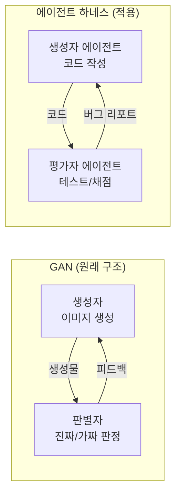
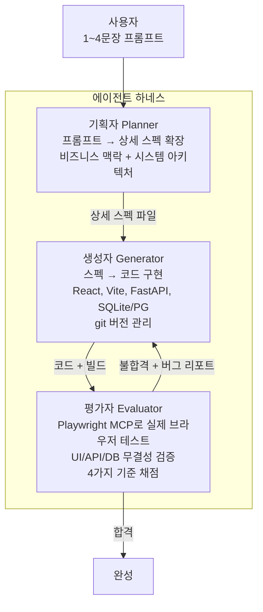
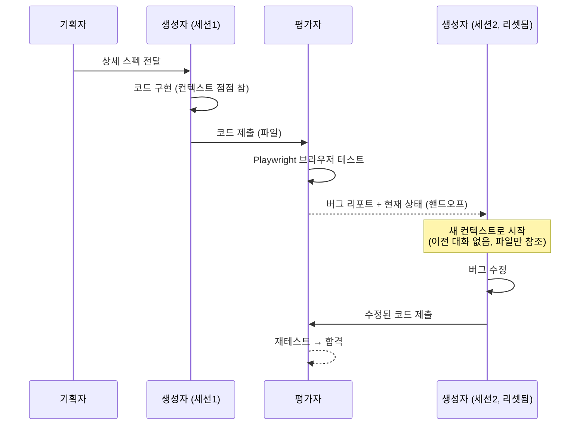
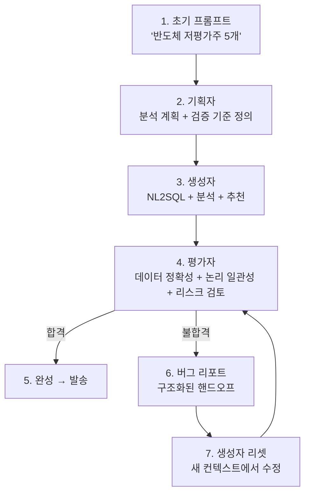

# 자율 코딩 에이전트 하네스 설계 (GAN 영감)

> **원문:** https://discuss.pytorch.kr/t/gan-feat-anthropic/9427/1
> **저자:** Prithvi Rajasekaran (Anthropic Labs)
> **공식 블로그:** https://anthropic.com/engineering/harness-design-long-running-apps

---

## 1. 개요 — 왜 GAN 구조인가

GAN(적대적 생성 신경망)에서 **생성자(Generator)**가 이미지를 만들고 **판별자(Discriminator)**가 평가하듯이, 코딩 에이전트도 **"만드는 에이전트"와 "검증하는 에이전트"를 분리**하면 품질이 올라간다는 발상.

> **자기 평가의 한계** — 에이전트가 자신의 결과물을 평가하면 항상 칭찬하는 경향이 있다. 작업 수행과 판단을 분리해야 한다.

---

## 2. 해결하려는 두 가지 핵심 문제

### 2-1. 문제 1 — Context Anxiety (컨텍스트 불안)

컨텍스트 윈도우가 차오르면 모델이 **"빨리 끝내자"는 압박**을 느끼고 조기에 작업을 마무리하려 한다.

| 접근 | 방법 | 한계 |
|------|------|------|
| **기존 해결** | 대화 내역 요약 (Compaction) | 정보 손실, 드리프트 |
| **이 연구** | 컨텍스트 리셋 — 완전히 비우고 새 에이전트 시작 | 구조화된 핸드오프 필요 |

### 2-2. 문제 2 — 자기 평가의 한계

같은 에이전트가 코드를 짜고 검증하면 **"내가 짠 코드니까 괜찮다"**고 판단하는 편향 발생.

**해결:** 에이전트 분리 — 만드는 에이전트와 판단하는 에이전트를 물리적으로 분리. 평가자는 실제 브라우저에서 테스트.

---

## 3. 3-에이전트 아키텍처

### 3-1. Planner (기획자)

- 사용자의 간단한 요청을 **상세 스펙**으로 확장
- 비즈니스 맥락 설정
- 고수준 시스템 아키텍처 설계
- 프론트엔드/백엔드 요구사항 정의

### 3-2. Generator (생성자)

- 스펙 기반 **전체 코드 구현**
- React + Vite + FastAPI + DB
- git으로 버전 관리
- 평가자 피드백 반영해 수정

### 3-3. Evaluator (평가자)

- **Playwright MCP**로 실제 브라우저 테스트
- 4가지 기준 채점
- 임계값 미달 → 생성자에 피드백
- 합격 → 완료

### 3-4. 에이전트 간 통신: 파일 기반

한 에이전트가 **마크다운/JSON 파일을 작성** → 다음 에이전트가 읽고 처리 → 결과를 새 파일로 작성.

API나 메시지 큐가 아닌 **파일 시스템을 중간 매개체**로 사용하여 단순성과 디버깅 용이성을 확보.

---

## 4. 평가자의 4가지 채점 기준

| 기준 | 설명 | 포인트 |
|------|------|--------|
| **논리적 깊이** | 비즈니스 로직이 올바르게 구현되었는가 | 코어 기능, 엣지 케이스 처리 |
| **기능성** | 실제로 동작하는가 (브라우저 테스트) | 클릭/입력/API 호출이 기대대로 동작 |
| **디자인** | 시각적 품질과 UX | 색상 조화, 타이포그래피, 레이아웃, 독창성 |
| **코드 품질** | 유지보수 가능한 코드인가 | 구조, 네이밍, 중복 제거 |

### 4-1. 디자인 평가의 어려움 — 주관 → 객관 변환

"예쁜가?"라는 주관적 질문을 다음 3가지 객관 항목으로 구조화:

| 항목 | 질문 |
|------|------|
| **독창성** | 템플릿 복사가 아닌 의도적 창작의 증거가 있는가? |
| **완성도(Craft)** | 타이포 계층구조, 간격, 색상 조화가 세심한가? |
| **기능성** | 사용자가 기능을 직관적으로 이해하고 실행할 수 있는가? |

> **실제 사례:** 네덜란드 미술관 웹사이트 — 10번의 반복을 거쳐 최종적으로 CSS 3D perspective 갤러리로 재구상

---

## 5. 컨텍스트 리셋 vs 컴팩션

### 5-1. 두 방식 비교

| | Compaction (기존) | Context Reset (이 연구) |
|--|------|------|
| 방법 | 대화 내역을 LLM으로 요약 | 컨텍스트 완전히 비움 |
| 한계 | 요약 과정에서 **정보 손실** | 핸드오프 설계 필요 |
| 누적 효과 | 요약의 요약 → **드리프트** | 매번 100% 깨끗한 시작 |
| 컨텍스트 불안 | 해결 못함 | **해결됨** |

### 5-2. 컨텍스트 리셋 흐름

---

## 6. 실험 결과

### 6-1. 실험 1 — 레트로 게임 메이커

| 지표 | Solo (단일) | Full Harness (3-에이전트) |
|------|:-:|:-:|
| 소요 시간 | 20분 | 6시간 |
| 비용 | $9 | $200 |
| 게임플레이 | 기능 안 함 (엔진 버그) | **정상 작동** |
| UI 품질 | 외형만 구성됨 | **완전한 기능 + 디자인** |

**핵심 차이:** 단일 에이전트는 UI는 그럴듯하게 만들지만, **다계층 시스템의 아키텍처 일관성을 유지하는 데 실패**. 평가자의 통합 테스트가 있어야 실제 동작하는 소프트웨어가 됨.

### 6-2. 실험 2 — DAW (디지털 오디오 워크스테이션)

| 단계 | 시간 | 비용 |
|------|------|------|
| 기획 | 4.7분 | $0.46 |
| 1차 빌드 | 2시간 7분 | $71.08 |
| QA + 반복 수정 | 1시간 26분 | ~$50 |
| **합계** | **3시간 50분** | **$124.70** |

### 6-3. 평가자가 발견한 실제 버그들

- `mouseUp` 이벤트에서 `fillRectangle` 함수 미트리거 (직사각형 채우기 안 됨)
- `selectedEntityId` 단일 변수 vs Delete 핸들러의 이중 변수 요구 불일치
- FastAPI에서 `/{frame_id}` 뒤에 `/reorder` 정의 → 'reorder'를 정수로 파싱 시도 → 422 에러
- 타임라인 드래그 좌표 갱신 로직 미구현
- 오디오 클립 리사이즈/스플릿 기능 누락

이런 버그들은 단일 에이전트의 자기 평가로는 발견이 어렵다. **분리된 평가자 + Playwright 실제 테스트**가 핵심.

---

## 7. Claude Opus 4.6으로의 진화 — 모델 향상 → 하네스 단순화

| 이전 (Opus 4.5 이전) | 현재 (Opus 4.6) |
|------|------|
| 스프린트 단위 분할 필수 (컨텍스트 한계) | **전체 스펙을 단일 세션에서 처리** |
| 매 스프린트마다 평가 | **배치 평가 (Batch Evaluation)** — 최종 통합 테스트만 |
| 컨텍스트 중간에 지시 잊어버림 | **긴 토큰에서도 초기 지시 유지** |

> **핵심 통찰:** 하네스는 모델의 한계를 보완하는 **임시 방편(workaround)**이다. 모델이 진화하면 이전 세대의 우회 로직은 기술 부채가 된다. 신규 모델 릴리스마다 아키텍처 재검토가 필수.

---

## 8. 핵심 교훈 3가지

### 8-1. 하네스는 임시방편이다

모델이 진화하면 이전 세대의 우회 로직은 **기술 부채**로 전락한다. Opus 4.6에서 스프린트 구조가 불필요해진 것처럼, 다음 모델에서는 평가자 분리조차 불필요해질 수 있다.

→ 하네스에 과도하게 투자하지 말고, 모델 업그레이드 시 재검토할 준비를 해야 함.

### 8-2. 마이크로 논리 단위 분해 필수

모놀리식 프로젝트를 **독립 검증 가능한 세분화 단위**로 분해해야 한다. 쓰기/읽기 권한 에이전트를 엄격히 분리.

→ "이 함수가 올바른가?"를 테스트할 수 있어야 에이전트도 검증할 수 있음.

### 8-3. 복잡도의 차원 이동

기저 모델 성능이 향상되면 과거의 로우레벨 작업은 자동화되고, 더 **고도화된 도메인**(3D 렌더링, 분산 시스템, 복합 금융 분석)의 새로운 가능성이 열린다.

→ "에이전트가 뭘 할 수 있는가"의 기준선이 계속 올라감.

---

## 9. BIP 프로젝트 적용 가능성

### 9-1. 지금 바로 적용 가능

| 아이디어 | BIP 적용 |
|---------|---------|
| **생성/평가 분리** | 모닝리포트 생성(Sonnet) → 별도 평가 에이전트(Haiku)가 팩트 체크 현재: 자기 평가 없이 바로 발송 |
| **파일 기반 통신** | 이미 BIP가 사용 중: 체크리스트 원문 → DB → 에이전트 분석 확장: Planner → 분석 계획서(JSON) → 하위 에이전트 |
| **Playwright 테스트** | React-FastAPI 프론트엔드의 자동화 테스트 에이전트가 생성한 UI 컴포넌트를 자동 검증 |
| **컨텍스트 리셋** | 장시간 분석(종목 스크리너) 시 중간 결과를 파일로 저장하고 새 세션에서 계속 현재: 한 세션에서 모두 처리 → 컨텍스트 불안 가능성 |

### 9-2. 장기적으로 고려

- **3-에이전트 구조 for 리포트:** 기획자(분석 계획) → 생성자(데이터 수집+분석) → 평가자(팩트 체크+품질 검증)
- **배치 평가:** Opus 4.6에서처럼 중간 검증 없이 최종 결과만 평가 → 비용 절감
- **디자인 평가 기준:** 모닝리포트 HTML 품질을 자동 평가하는 에이전트 (레이아웃, 가독성, 데이터 정확성)

### 9-3. 종목 추천에 적용 가능한 흐름

---

## 10. 참고

| 항목 | URL |
|------|-----|
| 원문 (PyTorch KR) | https://discuss.pytorch.kr/t/gan-feat-anthropic/9427/1 |
| Anthropic 공식 블로그 | https://anthropic.com/engineering/harness-design-long-running-apps |
| 저자 | Prithvi Rajasekaran (Anthropic Labs) |
| 모델 | Claude Opus 4.6 (최신 최적화 기준) |

### 내부 관련 문서
- `docs/bip_agent_strategy.md` — BIP 에이전트 전략
- `docs/checklist_agent_architecture.md` — Planner/Collector/Signal/Explainer 4단계 패턴
- `docs/stock_screener_architecture.md` — Bull/Bear 토론 + 검증 구조

---

## 변경 이력

| 날짜 | 내용 |
|------|------|
| 2026-04-13 | 초안 작성 (PyTorch KR 원문 기반) |
| 2026-04-27 | Mermaid 코드 블록 복원 + 표준 포맷 재작성 |
