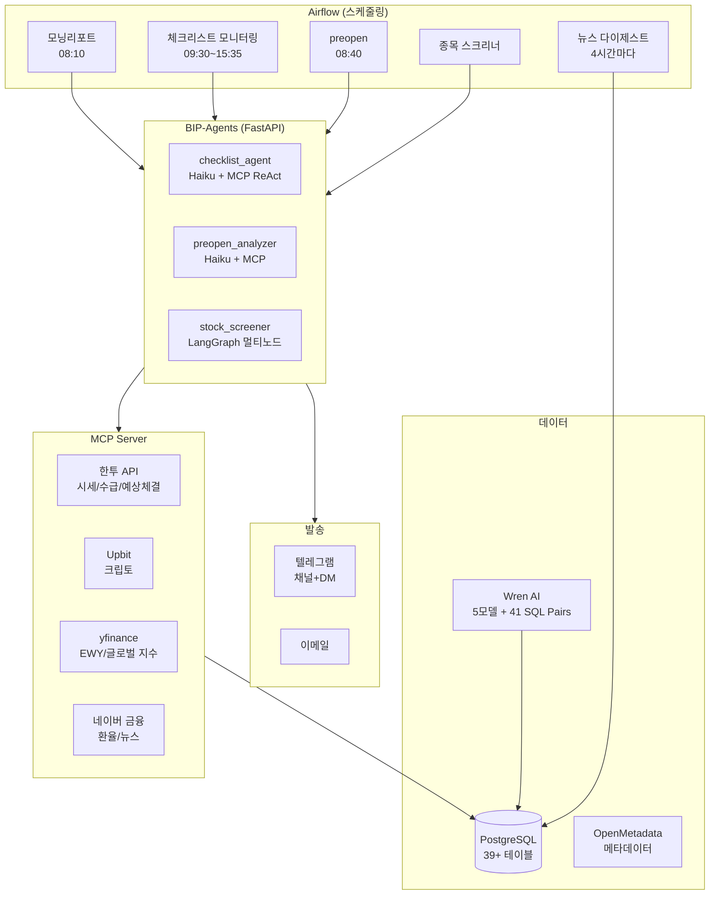
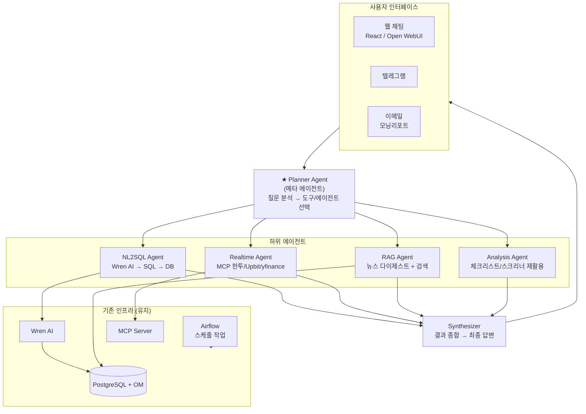
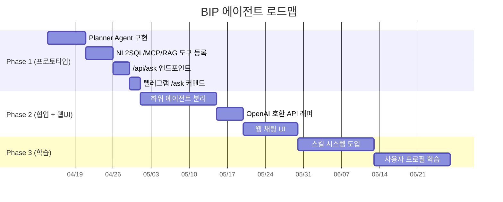
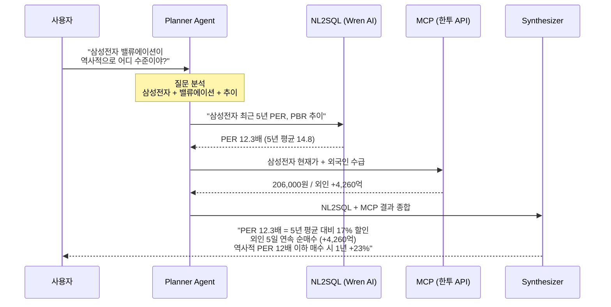

# BIP 에이전트 전략

> 차세대 아키텍처 — 복합 질문 처리, 에이전트 협업, 웹 인터페이스

---

## 1. 목표 비전

### 1-1. 우리가 원하는 것

고차원적이고 복합적인 질문에 대해, 내부 NL2SQL / MCP 도구 / RAG를 **에이전트가 알아서 판단하고 조합**해서 분석하고, 에이전트끼리도 협업해서 최종 답변을 제공하는 시스템.

### 1-2. 예시 시나리오

| 사용자 질문 | 필요한 도구 조합 |
|-----------|----------------|
| "삼성전자 지금 투자해도 되나? 밸류에이션이랑 수급 같이 봐줘" | NL2SQL(PER/PBR 추이) + MCP(현재가/외국인) + RAG(반도체 뉴스) |
| "요즘 반도체 섹터 전체적으로 어때?" | NL2SQL(섹터 수익률) + MCP(실시간) + RAG(HBM/DRAM 뉴스) |
| "외국인이 최근 뭘 사고 있는지 분석해줘" | NL2SQL(투자자별 순매수) + MCP(실시간 수급) + RAG(매매 배경) |
| "오늘 시장 요약해줘" | MCP(지수/환율/수급) + 뉴스 다이제스트 + 체크리스트 결과 |
| "포트폴리오 리밸런싱 해야 할까?" | NL2SQL(보유 현황) + MCP(현재가) + 스크리너 + 매크로 |

---

## 2. 현재 BIP 상태 (As-Is)



### 2-1. 현재의 한계

- **스케줄 기반만** — 사용자가 질문하면 응답하는 대화형 인터페이스 없음
- **에이전트가 독립적** — checklist/screener/preopen이 서로 결과를 참조하지 않음
- **도구 선택이 고정** — 각 에이전트가 어떤 도구를 쓸지 프롬프트에 명시. 동적 선택 메타 에이전트 없음
- **NL2SQL 미연동** — Wren AI가 있지만 에이전트가 자율 쿼리 생성/실행하지 않음
- **웹 UI 없음** — 텔레그램/이메일로만 결과 수신

---

## 3. 목표 아키텍처 (To-Be)



### 3-1. 핵심 변화

| 변화 | 설명 |
|------|------|
| **Planner Agent 신규** | 사용자 질문을 분석하고 어떤 하위 에이전트/도구를 조합할지 자율 결정 |
| **NL2SQL 에이전트 연동** | Wren AI를 에이전트 도구로 등록. 자연어 → SQL → 데이터 → 해석 |
| **에이전트 간 결과 전달** | NL2SQL 결과를 Analysis Agent에 넘겨 해석, RAG 결과와 합쳐 종합 판단 |
| **대화형 인터페이스** | 웹/텔레그램에서 자유롭게 질문하고 답변 받기 |
| **기존 스케줄은 유지** | 모닝리포트/체크리스트/스크리너는 Airflow가 계속 실행 |

---

## 4. 프레임워크 선택지

| 관점 | Hermes Agent | Deep Agents | 자체 LangGraph |
|------|-------------|------------|---------------|
| **핵심 강점** | 학습 루프 + 웹 UI + 멀티 플랫폼 | 에이전트 협업 오케스트레이션 | 기존 인프라 100% 호환 |
| **질문 분해 + 라우팅** | ReAct 패턴 | Supervisor 패턴 (강점) | 직접 구현 |
| **에이전트 간 협업** | 서브에이전트 (단순 위임) | 네이티브 (양방향) | 직접 설계 |
| **NL2SQL 연동** | 도구로 호출 | 도구로 호출 | 도구로 호출 |
| **MCP 연동** | 네이티브 | 래퍼 필요 | 이미 사용 중 |
| **RAG** | 도구로 가능 | LangChain RAG | 이미 사용 중 |
| **웹 UI** | 즉시 가능 (OpenAI 호환) | 전용 UI만 | 직접 구현 |
| **학습/스킬** | 내장 | 없음 | 직접 구현 |
| **기존 BIP 호환** | 중간 (SQLite vs PG) | 높음 | 최고 |
| **스케줄링** | 내장 cron (미성숙) | 없음 | Airflow (성숙) |
| **도입 리스크** | 중간 | 중간 | 낮음 |
| **구현 속도** | 빠름 | 중간 | 느림 |
| **토큰 오버헤드** | +15~25% | +10~15% | 최소 |

---

## 5. 추천 전략 — 단계별 접근

> **핵심 판단**: 외부 프레임워크를 통째로 도입하기보다, **기존 LangGraph 인프라 위에 Planner Agent를 추가**하고, 필요한 개념만 차용하는 점진적 접근이 리스크 대비 효과가 가장 큼.



### 5-1. Phase 1 — Planner Agent 프로토타입 (2~3주)

**목표:** "자연어 질문 → 도구 자동 선택 → 답변"이 동작하는 최소 프로토타입.

**새로 만들 것:**
```
planner_agent.py (LangGraph ReAct)
  └─ 도구: wren_ai_query, mcp_realtime, news_search, checklist_status
/api/ask 엔드포인트 (BIP-Agents FastAPI)
텔레그램 /ask 커맨드 (기존 게이트웨이 활용)
```

**재활용:**
```
MCP Server (기존 그대로)
news_digest_collector (기존 그대로)
Wren AI API (도구로 래핑만)
Airflow 스케줄 (기존 그대로)
```

- LLM: Sonnet (복잡한 플래닝) 또는 Haiku (비용 절감)
- 도구 4~5개만 등록해서 시작
- 텔레그램에서 `/ask 삼성전자 지금 어때?` → 답변

### 5-2. Phase 2 — 에이전트 간 협업 + 웹 UI (1~2개월)

**목표:** 복합 질문 처리 + 웹 채팅 인터페이스.

**추가할 것:**
```
하위 에이전트 분리:
  ├─ NL2SQL Agent (Wren AI + 결과 해석)
  ├─ Realtime Agent (MCP 멀티 호출 + 종합)
  ├─ RAG Agent (뉴스 다이제스트 + 실시간 검색)
  └─ Synthesizer (하위 결과 통합 → 최종 답변)
OpenAI 호환 API 래퍼 (/v1/chat/completions)
Open WebUI 또는 React 채팅 컴포넌트
```

- Planner가 복잡한 질문을 분해 → 하위 에이전트에 위임 → 결과 종합
- OpenAI 호환 API 노출 → Open WebUI/LobeChat 등 바로 연결
- 또는 기존 React-FastAPI에 채팅 페이지 추가

### 5-3. Phase 3 — 학습 + 고도화 (장기)

**목표:** 반복 질문 패턴 학습, 스킬 저장, 개인화.

**도입할 개념 (Hermes에서 차용):**
```
스킬 시스템 — 자주 묻는 분석 패턴을 스킬 문서로 저장
  예: "밸류에이션 분석 스킬" = PER/PBR 조회 + 업종 비교 + 수급 확인
Procedural Memory — "어떻게 분석했는지" 절차 기억
Progressive Disclosure — 스킬 요약만 로드, 필요 시 상세
사용자 프로필 — 선호 분석 스타일, 관심 섹터 학습
```

---

## 6. Phase 1 상세 설계

### 6-1. Planner Agent 흐름 예시



### 6-2. 도구 목록 (Phase 1)

| 도구 | 소스 | 기능 |
|------|------|------|
| `wren_ai_query` | Wren AI API | 자연어 → SQL → DB 결과 (재무/시세/수급) |
| `mcp_realtime` | bip-stock-mcp | 실시간 시세/수급/환율/지수 |
| `news_digest` | news_digest 테이블 | 최근 48시간 뉴스 다이제스트 |
| `news_search` | 네이버 뉴스 API | 키워드 실시간 뉴스 검색 |
| `checklist_status` | monitor_checklist 테이블 | 오늘 체크리스트 현황 |

### 6-3. API 인터페이스

```python
# BIP-Agents에 추가
POST /api/ask
{
  "question": "삼성전자 지금 투자해도 되나?",
  "context": "optional 추가 컨텍스트"
}

# 응답
{
  "answer": "종합 분석 텍스트...",
  "sources": ["wren_ai_query", "mcp_realtime", "news_digest"],
  "data": { ... },           // 참조한 원본 데이터
  "token_usage": { ... }
}

# OpenAI 호환 (Phase 2 — 웹 UI 연동용)
POST /v1/chat/completions
{
  "model": "bip-planner",
  "messages": [{"role": "user", "content": "삼성전자 어때?"}]
}
```

---

## 7. NL2SQL (Wren AI) 에이전트 연동

### 7-1. 현재 Wren AI 상태

- 5개 모델 (stock_info, stock_price_1d, financial_statements, consensus_estimates, macro_indicators)
- 41개 SQL Pairs (검증된 질문-SQL 쌍)
- `http://localhost:3000`에서 독립 실행
- 보안: `nl2sql_exec` 전용 계정 (민감 테이블 DB 레벨 차단)

### 7-2. 에이전트 도구로 래핑

```python
async def wren_ai_query(question: str) -> dict:
    """
    자연어 질문 → Wren AI → SQL 생성 → 실행 → 결과 반환
    보안: nl2sql_exec 계정으로만 실행 (민감 테이블 차단)
    """
    # 1. Wren AI API로 SQL 생성
    sql = await wren_ai.ask(question)

    # 2. nl2sql_exec 계정으로 실행
    result = await execute_sql(sql, role="nl2sql_exec")

    # 3. 결과 + SQL을 audit log에 기록
    await record_nl2sql_audit(question, sql, result)

    return {"question": question, "sql": sql, "data": result}
```

> **보안 거버넌스 준수**: raw value를 LLM 프롬프트에 직접 주입하지 않고, 집계된 결과만 전달.

---

## 8. 비용 예측

| 항목 | 현재 | Phase 1 추가 | Phase 2 추가 |
|------|------|------------|------------|
| 모닝리포트 (Sonnet) | ~$0.10/일 | - | - |
| 체크리스트 (Haiku ×6) | ~$0.06/일 | - | - |
| 뉴스 다이제스트 (Haiku ×7) | ~$0.02/일 | - | - |
| **/ask 질문 응답** | - | ~$0.02/질문 (Haiku) | ~$0.05/질문 (Sonnet) |
| **NL2SQL 호출** | - | Wren AI 자체 비용 없음 (셀프호스팅) | - |
| **일 합계 (질문 10개)** | ~$0.18 | +$0.20 | +$0.50 |
| **월 합계** | ~$5.4 | ~$11.4 | ~$20 |

---

## 9. 기술 결정 사항

### 9-1. 결정됨

- **기반 프레임워크: 자체 LangGraph** — 기존 인프라 호환성 최우선. Hermes/Deep Agents 개념은 필요 시 차용
- **스케줄링: Airflow 유지** — 정기 작업은 Airflow, 대화형만 새 에이전트
- **DB: PostgreSQL 유지** — 새 테이블 추가는 기존 DB에
- **보안: 기존 거버넌스 준수** — nl2sql_exec, 감사 로그, 민감 테이블 차단

### 9-2. 미결정 (Phase 1에서 검증 후 결정)

- **Planner LLM 모델** — Sonnet (정확) vs Haiku (저렴). 질문 복잡도에 따라 동적 선택?
- **웹 UI 방식** — Open WebUI (빠른 도입) vs React 직접 구현
- **에이전트 간 통신** — 직접 호출 vs 메시지 큐 vs LangGraph State
- **학습/스킬 시스템** — Phase 3에서 자체 구현 vs Hermes 도입
- **멀티 플랫폼** — 텔레그램 + 웹이면 충분? Slack/Discord 추가?

---

## 10. 리스크 & 완화

| 리스크 | 영향 | 완화 방안 |
|-------|------|---------|
| Planner가 잘못된 도구 선택 | 엉뚱한 답변 | 도구 선택 로그 + 사용자 피드백 루프 |
| NL2SQL이 잘못된 SQL 생성 | 부정확한 데이터 | nl2sql_exec 권한 제한 + SQL 검증 |
| LLM이 민감 데이터 노출 | 보안 위반 | security_governance 준수 + 응답 필터링 |
| 비용 급증 (질문 폭증) | API 비용 | 일일 한도 + Haiku 우선 + 캐시 |
| 응답 지연 (멀티 도구) | UX 저하 | 병렬 호출 + 스트리밍 응답 + 타임아웃 |

---

## 11. 관련 문서

- `docs/hermes_agent_research.md` — 자기 개선형 에이전트, 스킬 시스템, 학습 루프
- `docs/deepagents_guide.md` — 멀티 에이전트 오케스트레이션, Supervisor 패턴
- `docs/bip_agents_architecture.md` — 현재 에이전트 시스템 상세
- `docs/checklist_agent_architecture.md` — 체크리스트 에이전트 구조
- `docs/stock_screener_architecture.md` — 스크리너 + Bull/Bear 토론
- `docs/nl2sql_design.md` — Wren AI 연동, 보안 원칙
- `docs/nl2sql_agent_design.md` — LangGraph NL2SQL Agent 설계 (v3)

---

## 변경 이력

| 날짜 | 내용 |
|------|------|
| 2026-04-13 | 초안 작성 |
| 2026-04-27 | Mermaid 코드 블록 복원 (4개), 표준 포맷 재작성 |
