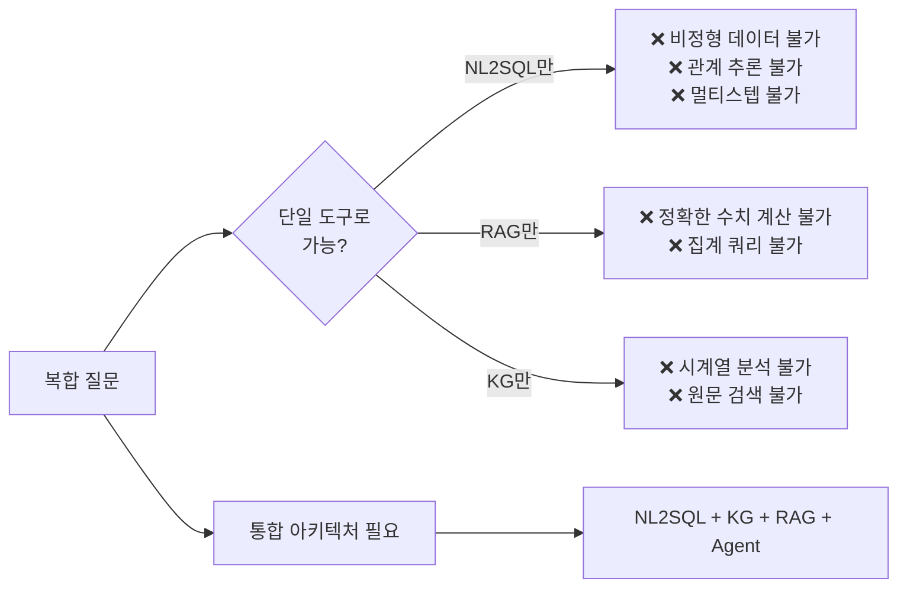
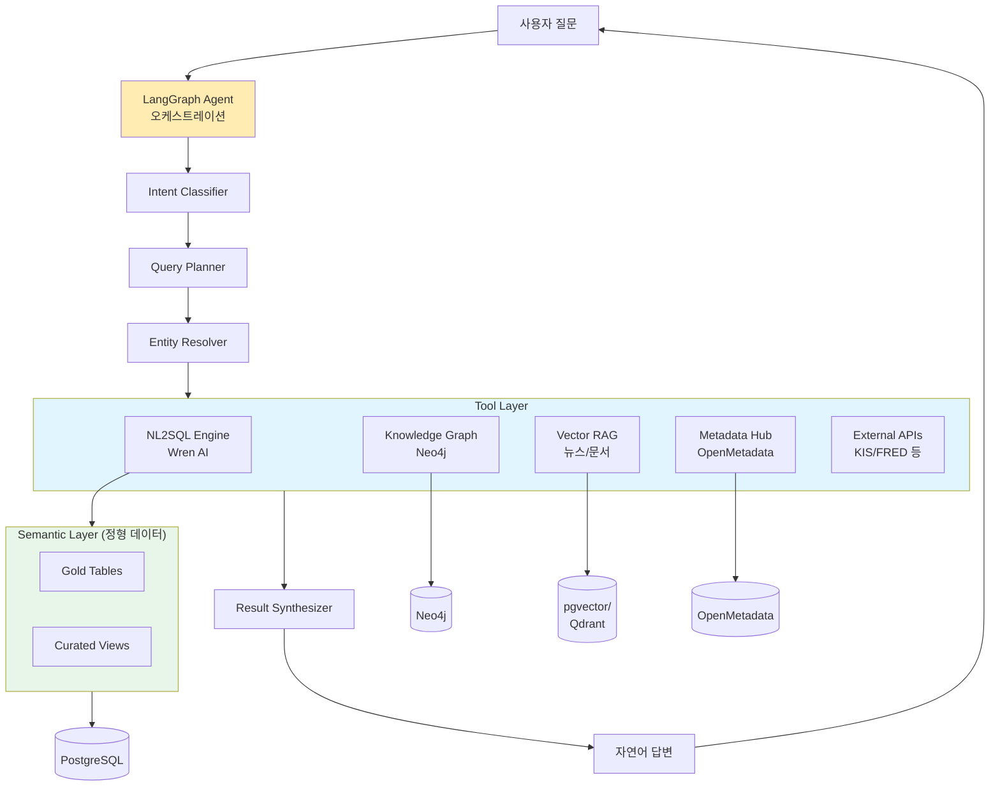
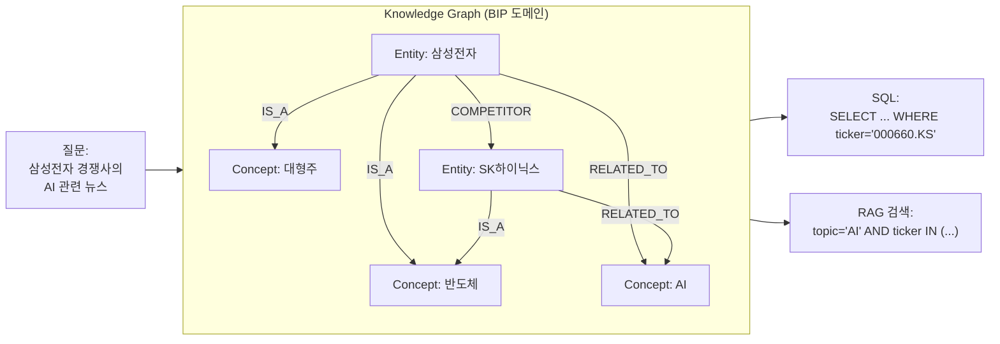
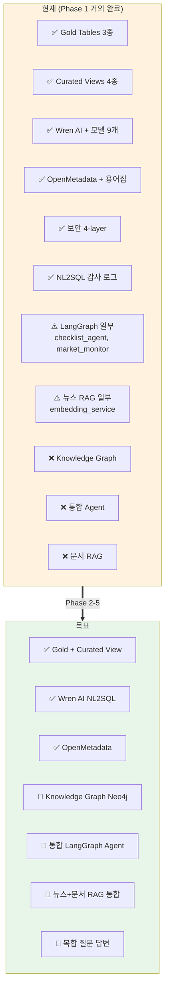
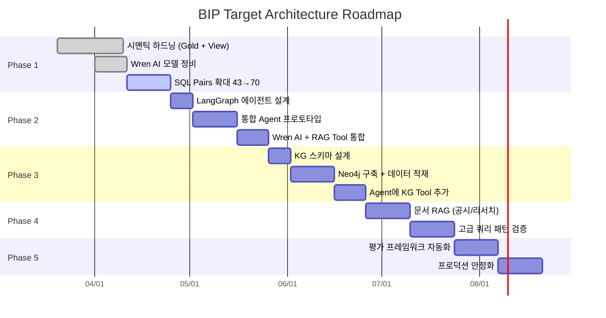
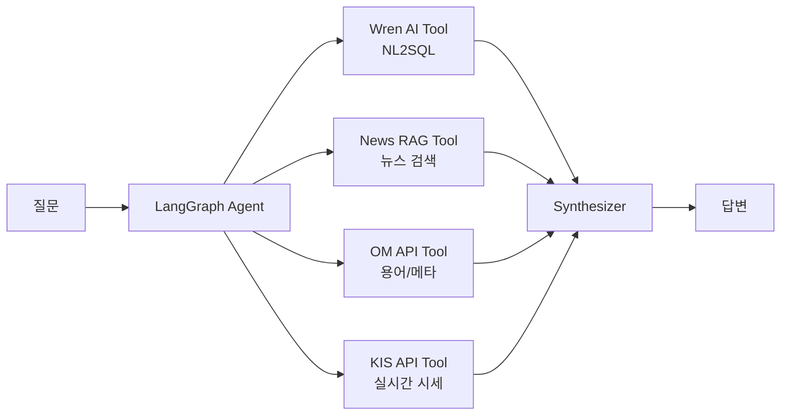
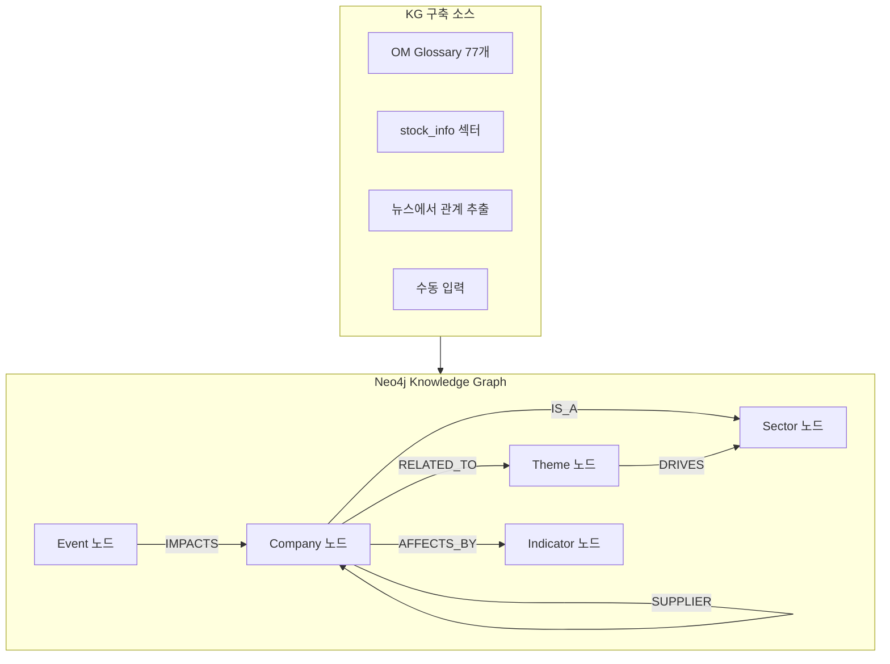
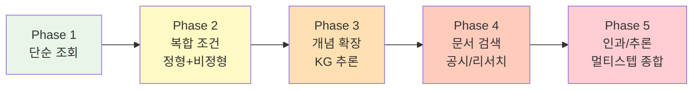

# BIP-Pipeline 최종 목표 아키텍처

> **목적:** BIP-Pipeline이 최종적으로 도달하고자 하는 아키텍처와 그 근거를 정리한다.
>
> **용어:** 이 문서는 `docs/nl2sql_concepts_and_terminology.md`의 정식 용어 정의를 사용한다. 개념이 헷갈리면 먼저 해당 문서를 참조할 것.
>
> **작성일:** 2026-04-11

---

## 1. 최종 목표

### 1-1. 문제 정의

**BIP-Pipeline의 궁극적 목표는 다음 유형의 질문에 정확히 답할 수 있는 시스템을 구축하는 것이다:**

| 유형 | 예시 질문 | 필요한 것 |
|------|----------|---------|
| **단순 조회** | "삼성전자 현재 PER" | NL2SQL |
| **복합 조건** | "저평가 반도체 관련주 중 외국인 순매수" | NL2SQL + 시맨틱 |
| **개념 기반 검색** | "삼성전자 경쟁사들의 밸류에이션 비교" | Knowledge Graph |
| **시계열/이벤트** | "골든크로스 발생 후 1개월 수익률" | 멀티스텝 쿼리 |
| **정형+비정형** | "삼성전자 실적 발표 후 시장 반응" | SQL + News RAG |
| **인과/추론** | "금리 인상이 포트폴리오에 미친 영향" | KG + 멀티스텝 + 분석 |
| **맥락 필요** | "지금 방어주로 피난할 종목" | 전체 통합 |

### 1-2. 단일 시스템의 한계

단일 도구로는 위 유형들을 모두 답할 수 없다.

---

## 2. 목표 아키텍처

### 2-1. 전체 구조

### 2-2. 레이어별 역할 (정식 용어 사용)

| 레이어 | 정식 용어 | 역할 | BIP 구현 |
|-------|---------|------|---------|
| **1. Orchestration** | Agent / LangGraph | 질문 분해, Tool 선택, 결과 통합 | LangGraph (Phase 3 예정) |
| **2. NL2SQL Engine** | NL2SQL Engine | 자연어 → SQL 변환 | Wren AI |
| **3. Knowledge Graph** | Knowledge Graph (KG) | 엔티티 관계 추론 | Neo4j (Phase 4 예정) |
| **4. Vector Retrieval** | RAG / Vector Store | 비정형 텍스트 검색 | pgvector (뉴스는 구축됨) |
| **5. Semantic Layer** | Semantic Layer (전통 정의) | 정형 데이터 비즈니스 로직 | Gold + Curated Views |
| **6. Metadata Hub** | Data Catalog | 메타데이터, 용어, lineage | OpenMetadata |
| **7. Raw Data** | - | 원본 저장소 | PostgreSQL |

> **중요:** "Semantic Layer"는 정형 데이터(Gold/View)에 **한정**된다. 비정형을 아우르는 "최상단 통합 레이어"라는 표현은 쓰지 않는다. 그 역할은 **Agent + Knowledge Graph**가 담당한다.

### 2-3. Knowledge Graph의 역할

**KG가 해결하는 것:**
- "경쟁사" → 실제 티커로 변환
- "반도체 관련주" → 섹터 + 테마 확장
- 개념 간 유사도 기반 확장

---

## 3. 현재 상태 vs 목표 상태

### 3-1. 진행 현황

### 3-2. 갭 분석

| 항목 | 현재 | 목표 | 갭 |
|------|-----|------|---|
| **NL2SQL 엔진** | Wren AI 운영 중 | Wren AI 유지 + 보강 | 소 |
| **정형 시맨틱** | Gold + Curated View | 동일 + SQL Pairs 100개 | 소 |
| **메타데이터** | OpenMetadata + 용어집 | 동일 + 지식그래프 연동 | 중 |
| **에이전트** | 체크리스트/모니터 독립 운영 | 통합 Agent로 수렴 | 대 |
| **Knowledge Graph** | 없음 | Neo4j + 도메인 KG | 대 |
| **비정형 통합** | 뉴스 임베딩만 분리 운영 | Agent Tool로 통합 | 중 |
| **문서 RAG** | 없음 | 공시/리서치 RAG | 대 |

---

## 4. 단계별 로드맵

### 4-1. Phase 맵

### 4-2. Phase 상세

#### Phase 1: 시맨틱 하드닝 (진행 중)
**목표:** NL2SQL의 정형 데이터 품질 안정화

| 작업 | 상태 |
|------|:-:|
| Gold Tables (analytics_*) | ✅ |
| Curated Views (v_*) | ✅ |
| Wren AI 모델 등록 | ✅ |
| Instructions / SQL Pairs | ✅ (진행 중: 43→70) |
| LLM 모델 선정 (GPT-4.1-mini) | ✅ |
| 메타데이터 동기화 DAG | ✅ |

**검증 질문 유형:**
- "삼성전자 PER"
- "코스피 시총 상위 5종목"
- "외국인 순매수 상위 10개"

#### Phase 2: 통합 Agent 구축
**목표:** 단일 Agent로 여러 Tool 호출 가능

**작업:**
- LangGraph 노드 설계 (Intent → Plan → Execute → Synthesize)
- Wren AI REST API Tool 래퍼
- 기존 뉴스 임베딩을 Agent Tool로 리팩터
- OM API Tool (용어집 조회)
- 멀티 Tool 결과 종합 LLM

**검증 질문 유형:**
- "삼성전자 최근 뉴스 감성" (SQL + RAG)
- "외국인 매수 상위 종목의 뉴스 요약" (SQL → RAG)
- "현재 금리 수준은 과거 대비 어느 정도?" (SQL + 비교 계산)

#### Phase 3: Knowledge Graph 구축
**목표:** 엔티티 관계 추론 Tool 추가

**작업:**
- KG 스키마 설계 (Node/Relationship 타입)
- OM Glossary → Concept 노드 승격
- stock_info 기반 Company/Sector 관계 로드
- (옵션) LLM으로 뉴스에서 관계 추출
- Agent에 Neo4j Cypher Tool 추가

**검증 질문 유형:**
- "삼성전자 경쟁사 밸류에이션" (KG → Ticker 확장 → SQL)
- "AI 관련주 중 저평가 종목" (KG → Theme 확장 → SQL)
- "반도체 섹터가 강할 때 같이 오르는 섹터" (KG 탐색 + 상관 분석)

#### Phase 4: 문서 RAG 통합
**목표:** 공시, 리서치, PDF까지 Agent가 참조

**작업:**
- 공시 문서 수집 + 임베딩 (DART, SEC)
- 리서치 리포트 RAG
- Agent Tool로 문서 검색 추가

**검증 질문 유형:**
- "삼성전자 최근 공시 요약"
- "애널리스트 리포트에서 언급되는 반도체 전망"

#### Phase 5: 평가 + 프로덕션
**목표:** 자동 품질 검증 + 운영 안정화

**작업:**
- 질문-답변 골든셋 구축
- Airflow DAG로 정기 품질 테스트
- 답변 신뢰도 스코어링
- 실패 케이스 자동 리포트

---

## 5. 핵심 의사결정

### 5-1. 왜 Palantir처럼 Ontology 중심 아키텍처를 안 쓰는가?

| 이유 | 설명 |
|------|------|
| **구축 비용** | Ontology 우선 설계는 시간 소요 크고 비즈니스 가치 검증이 늦음 |
| **경험적 설계** | Agent 먼저 만들어 한계를 경험한 뒤 KG 설계하는 것이 실용적 |
| **Stack 적합성** | PostgreSQL 중심 스택에서 Ontology 전면 도입은 과잉 |

**우리 전략:** **Agent First → KG Second**. Palantir와 반대 순서지만 자원 제약하에서 합리적.

### 5-2. 왜 dbt Semantic Layer를 안 쓰는가?

| 이유 | 설명 |
|------|------|
| **소비자 수** | BIP는 Wren AI 하나만 정형 데이터를 소비 — dbt 가치(여러 소비자 재사용)가 낮음 |
| **기존 스택** | Airflow가 dbt 역할을 대체하고 있어 추가 도구 도입 비용이 이득 대비 큼 |
| **향후 검토** | 사내 다중 팀으로 확장 시 dbt 도입 재검토 |

### 5-3. 왜 Wren AI를 유지하는가?

| 이유 | 설명 |
|------|------|
| **관리 UI** | SQL Pairs/Instructions를 비개발자도 관리 가능 |
| **SQL 검증 내장** | 3회 재시도 + 보정 파이프라인 |
| **추상화 레이어** | `NL2SQLEngine` 인터페이스로 감싸면 미래 교체 가능 |
| **한계 명확** | 1질문=1SQL, 비정형 불가 → LangGraph로 보완 |

---

## 6. 아키텍처 불변 조건

다음은 어떤 변경에서도 **유지해야 하는 원칙**이다.

### 6-1. 보안

- 민감 테이블(portfolio, holding 등)은 NL2SQL/LLM 접근 금지
- `nl2sql_exec` 전용 DB role 사용
- 모든 LLM/Agent 호출은 `agent_audit_log` 기록
- 4-layer 검증 (구문 → allowlist → DB role → curated view)

### 6-2. 메타데이터 거버넌스

- OpenMetadata가 메타데이터 SSOT
- 스키마 변경 시 OM → DB COMMENT → Wren AI 동기화 필수
- 신규 DAG는 `register_table_lineage_async` 호출 필수

### 6-3. 결정론 우선

- 가능한 한 결정론적 규칙(SQL, KG Cypher) 우선
- LLM은 설명/종합/불확실성 해소에만 사용
- 정확한 숫자 계산은 절대 LLM에 맡기지 않음

### 6-4. Grain 일관성

- Gold 테이블은 명확한 Grain 정의 필수
- Grain 불일치 JOIN 금지 (예: daily ↔ annual 직접 JOIN)
- 중간 View로 Grain 변환 후 결합

---

## 7. 리스크와 대응

| 리스크 | 영향 | 대응 |
|-------|-----|------|
| **Agent 환각** | 잘못된 수치/결론 | 결정론 우선, LLM은 설명만, 증거 부족 시 "모른다" 응답 |
| **LLM 비용 증가** | 운영 비용 | SQL Pairs 캐시 활용, Wren View로 정답 고정, 요청 배칭 |
| **KG 유지보수 부담** | 데이터 stale | 자동 구축 파이프라인, 정기 검증 |
| **Wren AI 락인** | 도구 교체 어려움 | `NL2SQLEngine` 추상화, MDL → YAML 백업 |
| **비정형 데이터 정확도** | 의사결정 오류 | 출처 표기 의무화, 신뢰도 스코어 |

---

## 8. 성공 기준

### 8-1. 기술 지표

| 지표 | 현재 | 목표 |
|------|:-:|:-:|
| NL2SQL A등급 비율 | 77% | 90% |
| SQL Pairs | 43개 | 100+ |
| 복합 질문 성공률 | - | 70% |
| 평균 응답 시간 | 16s | <20s |
| Agent 환각 비율 | - | <5% |

### 8-2. 질문 커버리지

Phase별로 다음 질문 유형이 답변 가능해야 한다.

---

## 9. 참고 문서

- `docs/nl2sql_concepts_and_terminology.md` — 정식 용어 레퍼런스
- `docs/nl2sql_project_plan.md` — NL2SQL 구현 계획 상세
- `docs/wrenai_technical_guide.md` — Wren AI 기술 가이드
- `docs/wrenai_test_report.md` — LLM 모델 비교 결과
- `docs/data_modeling_guide.md` — Gold/View 설계 가이드
- `docs/data_architecture_review.md` — 전체 아키텍처 리뷰
- `docs/security_governance.md` — 보안 거버넌스
- `docs/metadata_governance.md` — 메타데이터 거버넌스

---

## 10. 변경 이력

| 날짜 | 내용 |
|------|------|
| 2026-04-11 | 초안 작성 (용어 재정의, 5-layer 아키텍처, Phase 1-5 로드맵) |

---

*이 문서는 BIP-Pipeline의 최종 목표 아키텍처를 기록한다. 단기 실행 계획은 `docs/nl2sql_project_plan.md`를 참조하라.*
