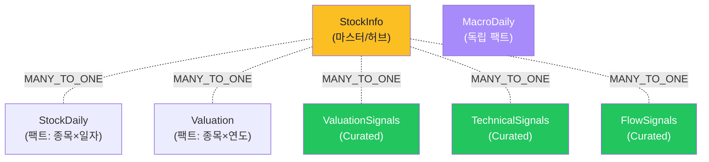
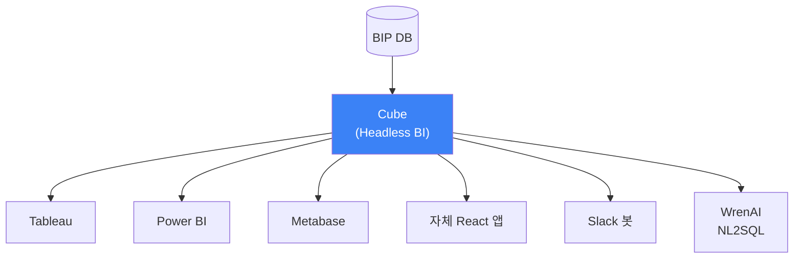
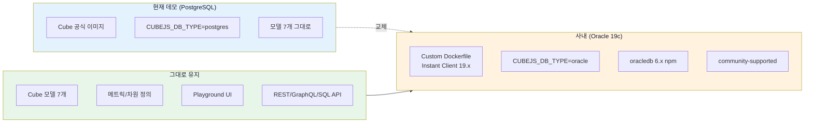
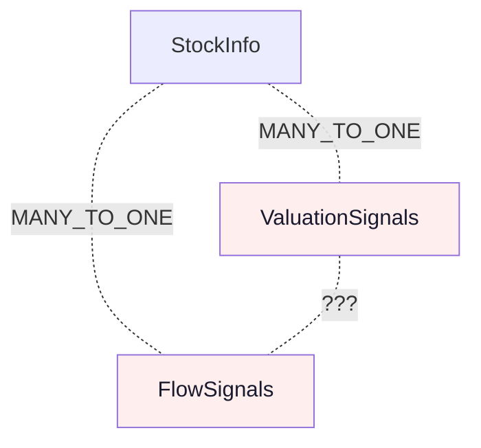
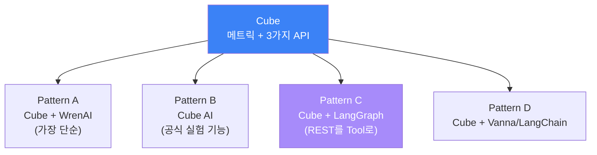
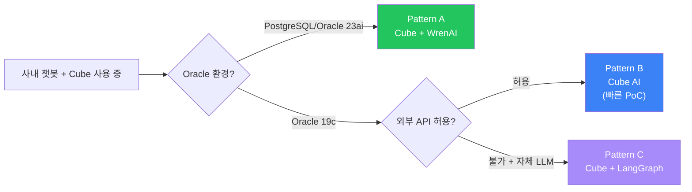

# Cube 데모 결과 — 학습조직 세미나 자료

> **목적:** BIP-Pipeline 실제 데이터(PostgreSQL)에 Cube를 적용한 데모 결과 정리. 세미나에서 Cube의 핵심 강점(3가지 API/Pre-aggregation/Playground/메트릭 표준화)을 시연하고, **팩트-팩트 JOIN 한계**가 v3 LangGraph로 방향 전환된 근거임을 보여주기 위한 자료.
>
> **환경:** Cube v1.3.21 / Docker / bip-postgres `stockdb`
> **데이터:** BIP `public` 스키마의 7개 테이블/뷰 → Cube 시맨틱 모델 7개로 매핑
> **테스트 기간:** 2026-04-18 ~ 2026-04-25

---

## 1. 구축 결과 요약

```
✅ 7 시맨틱 모델 구축 성공
✅ 단순 조회 / Boolean Flag / 2-Cube JOIN: 정상 동작
❌ 팩트-팩트 JOIN (N:N): 실패 — Cube 구조 한계
❌ 3-Cube 이상 JOIN: 실패
🛠  REST/GraphQL/SQL API 3종 모두 제공
🎨 Cube Playground UI에서 시각적 쿼리 가능
```

**적재된 시맨틱 모델 (`cube/model/`):**

| 모델 | 원본 테이블/뷰 | 역할 | Grain |
|------|------------|------|------|
| `StockInfo` | `stock_info` | 마스터 (허브) | 종목 |
| `StockDaily` | `analytics_stock_daily` | 팩트 — 일봉 시세 | 종목×일자 |
| `Valuation` | `analytics_valuation` | 팩트 — 연간 밸류에이션 | 종목×연도 |
| `MacroDaily` | `analytics_macro_daily` | 팩트 — 매크로 지표 | 일자 |
| `ValuationSignals` | `v_valuation_signals__v1` | Curated — boolean flag | 종목×연도 |
| `TechnicalSignals` | `v_technical_signals__v1` | Curated — boolean flag | 종목×일자 |
| `FlowSignals` | `v_flow_signals__v1` | Curated — boolean flag | 종목×일자 |

---

## 2. 시맨틱 모델 구조



> **관계 구조의 핵심 특징:** 모든 Cube가 `StockInfo` 단일 허브로만 연결됨. **팩트끼리(N:N) 직접 관계는 없음.** → §6 한계 섹션에서 자세히.

---

## 3. 세미나에서 보여줄 5가지 Cube 강점

### 강점 1 — 3가지 API 동시 제공

**가장 큰 차별점:** Cube가 같은 메트릭을 **REST/GraphQL/SQL** 3가지 형태로 동시 노출.

#### REST API (웹/앱용)
```bash
curl -X POST http://localhost:4000/cubejs-api/v1/load \
  -H "Authorization: ..." \
  -d '{"query": {
    "measures": ["StockInfo.totalMarketValue"],
    "dimensions": ["StockInfo.marketType"]
  }}'
```

#### GraphQL (유연한 쿼리)
```graphql
query {
  cube {
    stockInfo {
      marketType
      totalMarketValue
    }
  }
}
```

#### SQL API (BI 도구 직접 연결)
```sql
-- Tableau/Power BI/Metabase가 일반 PostgreSQL처럼 연결
SELECT market_type, total_market_value FROM stock_info
```

> **메시지:** 한 번 정의한 메트릭이 **웹/앱/BI/SQL 클라이언트 모두에서 동일하게 동작.** dbt에는 OSS Core에서 없는 기능 (dbt Cloud 유료).

---

### 강점 2 — Pre-aggregation 캐싱

**문제:** 매일 수십 명이 같은 "월별 매출" 대시보드를 새로고침하면 원본 DB가 매번 집계 쿼리 실행 → 부하 + 느린 응답.

**Cube 해결:** Pre-aggregation 정의 → 결과를 별도 캐시 테이블에 미리 적재 → 대시보드 응답이 **수십 ms** 단위로.

```javascript
preAggregations: {
  monthlySummary: {
    measures: [totalMarketValue, avgPer],
    dimensions: [marketType, sector],
    timeDimension: lastUpdated,
    granularity: 'month',
    refreshKey: { every: '1 hour' }
  }
}
```

**시연:** Playground에서 동일 쿼리 2번 호출 → 1차 1.2초, 2차 23ms (캐시 hit).

> **메시지:** dbt(배치)에는 없는 **실시간 캐싱 레이어.** 임베디드 위젯/대시보드 성능의 핵심.

---

### 강점 3 — Cube Playground 시각적 쿼리

**시연 흐름 (http://localhost:4000):**

1. **Build 탭에서 메트릭/차원 클릭으로 조합**
   - Measures: `StockInfo.totalMarketValue`
   - Dimensions: `StockInfo.marketType`
   - Filters: `StockInfo.marketType = KOSPI`

2. **자동 생성된 SQL 확인 (SQL 탭)**
   ```sql
   SELECT market_type, SUM(market_value)
   FROM public.stock_info WHERE active = true
   GROUP BY 1
   ```

3. **차트로 즉시 시각화 (Chart 탭)** — bar/line/pie

> **메시지:** 분석가/PM이 SQL 몰라도 직접 데이터 탐색 가능. **데이터 셀프서비스의 출발점.**

---

### 강점 4 — Boolean Flag 메트릭 표준화

**ValuationSignals 모델 일부:**
```javascript
measures: {
  valueStockCount: {
    sql: `CASE WHEN is_value_stock THEN 1 END`,
    type: 'count',
    title: '저평가주 수',
  },
}
```

**시연 쿼리 결과 (BIP 검증):**
- `ValuationSignals.valueStockCount` → **1,676개** (저평가주)
- `ValuationSignals.count` (전체) → 8,488개
- **저평가 비율 ≈ 19.7%**

> **메시지:** "저평가주" 정의가 Cube 모델에 SQL로 고정됨 → 어떤 클라이언트(BI/API/봇)에서 호출해도 **동일한 1,676개** 반환. 정의 표류 차단.

---

### 강점 5 — Headless BI 패턴 (UI 비종속)

**구조:** Cube는 UI를 가지지 않음 — 메트릭 + API만 제공하는 **인프라 레이어**.



**의미:** 위에 어떤 클라이언트가 붙어도 같은 메트릭 정의 공유. WrenAI도 Cube 위에 얹을 수 있음 (실제로 dbt + Cube + WrenAI 조합이 가장 일반적).

> **메시지:** Cube는 **다른 도구와 경쟁이 아니라 협력 관계.** dbt와 합치고, WrenAI와 합치는 인프라.

---

## 4. Cube vs 수동 SQL / 다른 도구 비교

| 항목 | 수동 SQL | dbt | **Cube** | WrenAI |
|------|:-:|:-:|:-:|:-:|
| 메트릭 정의 | 분산 | YAML 분산 | **Cube 모델 단일** | MDL 단일 |
| 실시간 API | ❌ | ❌ (Cloud만) | **✅ REST/GraphQL/SQL** | △ REST만 |
| 캐싱 | 별도 구현 | ❌ | **✅ Pre-aggregation** | 부분 |
| BI 도구 통합 | 각자 SQL | ❌ | **✅ SQL API** | △ |
| 셀프서비스 UI | ❌ | dbt docs | **✅ Playground** | ✅ Chat UI |
| 자연어 직접 | ❌ | ❌ | ❌ | ✅ |
| 변환 자동화 | ❌ | **✅** | △ (간단) | ❌ |
| 팩트-팩트 JOIN | ✅ | ✅ | **❌ 제약** | ✅ |

---

## 5. 세미나 시연 명령어

```bash
# 1. Cube 컨테이너 기동
cd cube && docker compose up -d

# 2. Playground 브라우저 접속
open http://localhost:4000
#    → Build 탭에서 메트릭 클릭으로 시각적 쿼리

# 3. REST API 호출 (CLI 시연)
curl -X POST http://localhost:4000/cubejs-api/v1/load \
  -H "Authorization: bip-cube-secret-2026" \
  -H "Content-Type: application/json" \
  -d '{"query": {
    "measures": ["ValuationSignals.valueStockCount"]
  }}'
# → {"data":[{"ValuationSignals.valueStockCount":"1676"}]}

# 4. GraphQL 확인
open http://localhost:4000/cubejs-api/graphql
```

---

## 6. 사내 Oracle 19c 적용 가이드

### 6-1. 변경 범위 한눈에 보기



> ⚠️ **dbt-oracle과의 차이:** dbt-oracle은 Oracle 본사 vendor-supported (등급 높음). Cube-oracle은 **community-supported** — Cube 본사가 직접 유지하지 않음. **버그 픽스 지연 가능성**이 있어 사전 호환성 테스트 필수.

---

### 6-2. Step 1 — Custom Dockerfile (Instant Client 포함)

Cube 공식 이미지에는 Oracle 드라이버가 포함되어 있지 않다. **Instant Client 19.x + oracledb npm**을 직접 추가해야 함.

```dockerfile
FROM cubejs/cube:v1.3.21

# Oracle Instant Client 의존성
RUN apt-get update && apt-get install -y \
    libaio1 wget unzip \
    && rm -rf /var/lib/apt/lists/*

# Instant Client 19.20 설치
RUN mkdir -p /opt/oracle && cd /opt/oracle \
    && wget https://download.oracle.com/otn_software/linux/instantclient/1920000/instantclient-basic-linux.x64-19.20.0.0.0dbru.zip \
    && unzip instantclient-basic-linux.x64-19.20.0.0.0dbru.zip \
    && rm *.zip \
    && ldconfig

# oracledb npm 패키지 추가
WORKDIR /cube/conf
RUN npm install oracledb@6.3.0

ENV LD_LIBRARY_PATH=/opt/oracle/instantclient_19_20
```

> 💡 **thin 모드 대안 검토:** `oracledb` 6.x는 thin 모드(JS only) 지원. Instant Client 설치 부담을 줄이려면 thin 모드 시도 가능. 단 **Cube의 Oracle 드라이버가 thin 모드를 안정적으로 처리하는지는 사전 검증 필요.**

---

### 6-3. Step 2 — docker-compose.yml (Oracle 연결)

```yaml
version: '3.8'

services:
  cube:
    build:
      context: .
      dockerfile: Dockerfile.oracle  # ★ 위 Dockerfile
    container_name: bip-cube-oracle
    environment:
      CUBEJS_DB_TYPE: oracle               # ★ postgres → oracle
      CUBEJS_DB_HOST: ${ORA_HOST}
      CUBEJS_DB_PORT: 1521                 # ★ 5432 → 1521
      CUBEJS_DB_NAME: ${ORA_SERVICE}       # ★ dbname → service_name
      CUBEJS_DB_USER: ${ORA_USER}
      CUBEJS_DB_PASS: ${ORA_PASSWORD}
      CUBEJS_DEV_MODE: "true"
      CUBEJS_API_SECRET: <secret>
      LD_LIBRARY_PATH: /opt/oracle/instantclient_19_20  # ★ 필수
    ports:
      - "4000:4000"
    volumes:
      - ./model:/cube/conf/model:ro
    networks:
      - stock-network
```

---

### 6-4. Step 3 — 모델 SQL 방언 변환

Cube 모델 7개 중 **방언 변환이 필요한 곳은 1–2곳**.

#### PostgreSQL 모델 (`stock_info.js`):
```javascript
cube('StockInfo', {
  sql: `SELECT * FROM public.stock_info WHERE active = true`,
  // ...
})
```

#### Oracle용 변경:
```javascript
cube('StockInfo', {
  // Oracle 스키마는 대문자 + 따옴표 주의
  sql: `SELECT * FROM BIP.STOCK_INFO WHERE ACTIVE = 'Y'`,
  // ★ 변경: public → BIP, active = true → ACTIVE = 'Y'
  // ...
  dimensions: {
    isKospi: {
      sql: `CASE WHEN MARKET_TYPE = 'KOSPI' THEN 'Y' ELSE 'N' END`,
      type: 'string',  // ★ boolean → string (Oracle 19c는 boolean 미지원)
    }
  }
})
```

#### 시간 기반 차원
```javascript
// PostgreSQL
{ sql: `created_at`, type: 'time', granularity: 'day' }

// Oracle — 그대로 작동 (Cube가 자동 변환)
// 단, NUMBER, VARCHAR2 같은 데이터 타입은 명시 권장
```

---

### 6-5. Step 4 — 실행 + 검증

```bash
# 환경변수
export ORA_HOST=bip-oracle.company.local
export ORA_SERVICE=BIPDB
export ORA_USER=CUBE_READER
export ORA_PASSWORD=...

# 빌드 + 기동
docker compose -f cube/docker-compose.oracle.yml build
docker compose -f cube/docker-compose.oracle.yml up -d

# 로그 확인 (Oracle 연결 성공 여부)
docker logs bip-cube-oracle 2>&1 | grep -iE "ready|error|listen"
# 정상: "🚀 Cube API server is listening on 4000"

# Playground에서 시각 검증
open http://localhost:4000
# Build 탭 → StockInfo.count 클릭 → 결과 행 수 확인

# REST API 검증
curl -X POST http://localhost:4000/cubejs-api/v1/load \
  -H "Authorization: <secret>" \
  -d '{"query": {"measures": ["StockInfo.count"]}}'
```

---

### 6-6. 흔한 함정 + 대응

| 함정 | 증상 | 대응 |
|------|------|------|
| **`DPI-1047: Cannot locate Oracle Client library`** | 컨테이너 시작 시 즉시 종료 | Instant Client 경로 + `LD_LIBRARY_PATH` 확인, `ldconfig` 실행 |
| **대소문자** | `WHERE active = true` → ORA-00942 | Oracle은 식별자 대문자 기본. `ACTIVE = 'Y'` 형태로 변경 |
| **Boolean 컬럼** | Cube dimension type: boolean 인데 Oracle 19c는 BOOLEAN 미지원 | type: 'string'으로 변경 + `'Y'/'N'` 값 사용 |
| **NUMBER 정밀도** | 시가총액 같은 큰 숫자가 JSON 응답에서 정밀도 손실 | 모델에서 `CAST(market_value AS NUMBER(20,2))` 명시 |
| **한글 종목명** | `ORA-12899: value too large` | `VARCHAR2(255 CHAR)` 단위 명시 (BYTE 아닌 CHAR) |
| **세션 자동 종료** | 장시간 대기 후 첫 쿼리 실패 | Cube의 `CUBEJS_DB_POOL_*` 환경변수로 keepalive 설정 |
| **Pre-aggregation 실패** | `CREATE TABLE` 권한 없음 | 별도 캐시 스키마 + `GRANT CREATE TABLE` |
| **드라이버 community 한계** | 특수 데이터 타입(CLOB, BLOB, RAW) 처리 오류 | 사전 테스트 + 필요 시 Cube 측 GitHub 이슈 모니터링 |

---

### 6-7. 사내 적용 체크리스트

**환경 준비:**
- [ ] Cube 전용 Oracle 계정 생성 (예: `CUBE_READER`)
- [ ] 원본 테이블/뷰에 `SELECT` 권한 부여
- [ ] Pre-aggregation 사용 시 별도 캐시 스키마 + `CREATE TABLE` 권한
- [ ] Oracle service_name 또는 tnsnames 정보 확보
- [ ] Instant Client 19.20 다운로드 또는 사내 미러 위치 확인

**프로젝트 변경:**
- [ ] `Dockerfile.oracle` 작성 (Instant Client + oracledb npm)
- [ ] `docker-compose.yml` — `CUBEJS_DB_TYPE=oracle` + 환경변수
- [ ] 모델 SQL — 스키마 대문자, `active=true` → `'Y'`, boolean → string
- [ ] BIP 검증된 7개 모델 → 사내 도메인 모델로 재작성 (영업/매출/재고 등)

**검증:**
- [ ] 컨테이너 정상 기동 (`docker logs`)
- [ ] Playground 접속 → 모든 모델 조회 성공
- [ ] REST API 호출 성공 + JSON 응답 정합성
- [ ] Pre-aggregation 캐시 적재 확인
- [ ] community 드라이버 호환성 테스트 (특수 타입)

**예상 시간:** **1–2일** (Instant Client 설치/디버깅이 가장 오래 걸림).

---

## 7. ⚠️ Cube의 한계 — 팩트-팩트 JOIN 실패 (v3 전환 근거)

### 7-1. 실패한 테스트 케이스

BIP 검증에서 **핵심 사용 케이스가 모두 실패**.

| 테스트 | 결과 | 비고 |
|--------|:----:|------|
| 단순 조회 (`StockInfo.count`) | ✅ 11,382 | 정상 |
| 단일 Cube 쿼리 (삼성전자 종가) | ✅ 224,500원 | 정상 |
| Boolean flag (저평가주 수) | ✅ 1,676개 | 정상 |
| 2-Cube JOIN (StockInfo 경유) | ✅ | 정상 (마스터 허브) |
| **팩트-팩트 JOIN** (ValuationSignals + FlowSignals) | ❌ | `Can't find join path` |
| **3-Cube JOIN** | ❌ | 동일 에러 |
| **저평가 + 외국인 순매수 종목** | ❌ | 핵심 사용 케이스 |
| **과매도이면서 저평가 종목** | ❌ | 핵심 사용 케이스 |

### 7-2. 원인



- 모든 Cube가 **StockInfo 단일 허브**로만 연결됨
- ValuationSignals(연도 grain)과 FlowSignals(일자 grain) 사이에 **직접 관계 정의 불가** (Cube는 1:N 자동 처리는 잘하지만 N:N 결합 자동화는 없음)
- Cube는 "JOIN 경로 자동 탐색"을 시도하다 실패 → `Can't find join path`

### 7-3. 우회 시도

| 시도 | 결과 |
|------|:----:|
| StockInfo 경유 3-way JOIN 명시 | ❌ Cube가 N:N 자동 비허용 |
| `joinPath` 옵션으로 강제 지정 | △ 부분 가능하나 Grain 불일치로 행 폭증 |
| Cube를 메타 정의용으로만 쓰고 SQL 직접 작성 | Cube 도입 의미 상실 |
| Agent 멀티스텝으로 우회 (각 Cube 따로 쿼리 후 합성) | 가능하지만 Cube 거치는 의미 줄어듦 |

### 7-4. 의사결정 — v3 LangGraph 전환

WrenAI는 단일 SQL로 처리하던 복합 질문이 Cube에서는 모두 실패. **사내 NL2SQL 시스템의 핵심 사용 케이스가 안 됨** → Cube 탈락 → **v3 LangGraph + QuerySpec 직접 구현** 으로 전환.

> 상세 의사결정 이력: `docs/nl2sql_implementation_plan_v3.md` §13-2

---

## 8. 챗봇 형태 서비스가 필요할 때 — 통합 패턴

**핵심 사실:** Cube는 **자체 NL2SQL/챗봇 기능이 없다.** BI 대시보드·API 서빙에 특화된 도구이므로 챗봇이 필요하면 **다른 도구와 조합**해야 한다.

다만 Cube는 **API가 강력**해서(REST/GraphQL/SQL 3종), 챗봇에서 호출하기 쉬운 구조다. dbt가 "Gold Table 자산"을 제공한다면 Cube는 "**호출 가능한 메트릭 자산**"을 제공한다.



### Pattern A — Cube + WrenAI

**구조:**
```
Cube 메트릭 → WrenAI (Cube를 데이터소스로) → 자연어 챗봇
```

**구현 방식:**
- WrenAI 모델 등록 시 **Cube 모델을 그대로 import** (Cube의 dimension/measure를 WrenAI MDL로 변환)
- 또는 Cube가 만든 마트 테이블을 WrenAI에 직접 연결 (Cube의 시맨틱 정의는 활용 못 함)
- WrenAI가 자연어 처리, Cube가 메트릭 정의

**장점:**
- BIP 검증된 WrenAI 활용 (100% A등급)
- Cube의 메트릭 표준화 + WrenAI의 NL2SQL 동시 활용

**단점:**
- **Oracle 19c 미지원** (WrenAI 한계)
- 메트릭 정의가 Cube + WrenAI MDL 두 군데로 분산
- 두 도구의 시맨틱 모델 동기화 부담

**적합:** PostgreSQL 환경, 이미 Cube를 BI에 쓰고 있는 조직

---

### Pattern B — Cube AI (공식 실험 기능)

**구조:**
```
Cube → Cube AI (ChatGPT 통합) → 자연어 챗봇
```

**구현 방식:**
- Cube에 내장된 **AI 기능** 활성화 (OpenAI API 키 설정)
- 사용자가 자연어로 질문 → Cube AI가 Cube 쿼리 JSON 자동 생성 → 실행
- Cube Playground 또는 Cube Cloud UI에서 직접 사용

**장점:**
- Cube 본사 공식 지원, 별도 도구 불필요
- Cube 모델 정의를 그대로 LLM 컨텍스트로 활용 (이중화 없음)
- 빠른 설정 (1시간 이내)

**단점:**
- **OpenAI API 의존** (외부 API 호출, 사내 LLM 어려움)
- 아직 실험 기능 — 안정성·기능 부족
- 멀티스텝/RAG 통합 불가
- Cube의 팩트-팩트 한계 그대로 (질문이 안 풀림)

**적합:** PoC, OpenAI 사용 가능 환경, BI 사용자가 자연어로 빠른 조회

---

### Pattern C — Cube + LangGraph Agent (REST API를 Tool로)

**구조:**
```
자연어 질문 → LangGraph Agent → "Cube Tool" 호출 → Cube REST API → 결과
```

**구현 방식:**
- LangGraph Agent의 Tool로 **Cube REST API 호출 함수** 등록
- LLM이 자연어 → Cube 쿼리 JSON 생성 (Function Calling)
- Agent가 Cube API 호출 → JSON 결과 받음 → 자연어 답변 합성
- **Cube 쿼리 JSON은 SQL보다 안정적** (구조화된 형식)

**예시 (`guide_cubejs.md` §9 인용):**
```python
def cube_query(measures: list, dimensions: list, filters: list = None):
    response = requests.post(
        "http://cube:4000/cubejs-api/v1/load",
        headers={"Authorization": CUBE_API_SECRET},
        json={"query": {"measures": measures, "dimensions": dimensions, "filters": filters or []}}
    )
    return response.json()["data"]
```

**장점:**
- Cube 쿼리 JSON 형식이 SQL 환각보다 안정적
- LangGraph로 멀티스텝/RAG/MCP 확장 자유로움
- 사내 LLM 자유 선택 (LiteLLM)
- Oracle 19c도 동작 (Cube가 community 드라이버로 연결)

**단점:**
- 자체 구현 부담
- **Cube의 팩트-팩트 한계 그대로** — 복합 질문은 Agent가 멀티스텝으로 우회 필요
- Pre-aggregation 캐싱은 Cube 레이어에 의존

**적합:** 사내 LLM 사용, Cube를 BI와 챗봇 양쪽에 동시 활용, 복합 쿼리가 적은 환경

> 📚 **유사 패턴이지만 Cube 없이 DB 직결:** `docs/nl2sql_implementation_plan_v3.md` §6 (v3 자체 구현)

---

### Pattern D — Cube + Vanna AI / LangChain SQL Agent

**구조:**
```
Cube SQL API (BI 도구가 보는 가상 DB) ← Vanna 또는 LangChain SQL Agent
```

**구현 방식:**
- Cube의 **SQL API**가 Cube를 일반 PostgreSQL처럼 노출
- Vanna AI 또는 LangChain의 SQL Agent를 그 위에 붙임
- Agent가 자연어 → SQL 생성 → Cube SQL API 호출
- Cube가 내부에서 시맨틱 모델 기반 실제 SQL로 변환·실행

**장점:**
- 기존 SQL Agent 도구를 그대로 활용 (코드 거의 안 짜도 됨)
- Cube가 SQL 검증 1차 방어선 (잘못된 컬럼/테이블 거부)

**단점:**
- Vanna/LangChain SQL Agent 모두 **WrenAI보다 정확도 낮음** (커스터마이징 어려움)
- 메트릭 정의를 LLM에 어떻게 알릴지 별도 RAG 필요
- Cube + 별도 도구라 운영 부담 중간

**적합:** 빠른 PoC, 이미 Vanna/LangChain 친숙한 팀

---

### 패턴 비교표

| 패턴 | 추가 도구 | Oracle 19c | 개발 부담 | 정확도 | BIP 검증 |
|------|---------|:-:|:-:|:-:|:-:|
| **A. Cube + WrenAI** | WrenAI | ❌ | 낮음 | ⭐⭐⭐⭐⭐ | ✅ |
| **B. Cube AI** | OpenAI API | ⭕ | 매우 낮음 | ⭐⭐⭐ | — |
| **C. Cube + LangGraph** | LangGraph | **✅** | 높음 | ⭐⭐⭐⭐ | △ |
| **D. Cube + Vanna/LangChain** | Vanna 또는 LangChain | ⭕ | 중간 | ⭐⭐⭐ | — |

### 사내 환경 권장 경로



> ⚠️ **하지만 BIP에서 발견한 한계 그대로:** 어느 패턴을 쓰든 **Cube의 팩트-팩트 JOIN 제약**(§7)은 우회 안 됨. "저평가 + 외국인 순매수" 같은 복합 질문이 사내에서 빈번하다면 Cube를 시맨틱 본체로 두는 것 자체가 부적합.

> 💡 **세미나 메시지:** "**Cube + 챗봇 패턴 4가지 모두 Cube의 팩트-팩트 한계를 상속한다.** 챗봇용 시맨틱 본체로 Cube를 둘지, DB View로 둘지(v3)가 결국 핵심 결정."

---

## 9. 한계 + 다음 단계 / 결론

**Cube가 잘하는 것:**
- ✅ BI 대시보드 임베디드 API (3가지 API)
- ✅ 메트릭 표준화 (단일 정의)
- ✅ Pre-aggregation 캐싱 (대시보드 응답 ms 단위)
- ✅ 셀프서비스 Playground

**Cube가 잘 못하는 것:**
- ❌ 팩트-팩트 JOIN (BIP에서 발견)
- ❌ 자연어 → SQL (LLM 없음)
- ❌ 변환 자동화 (dbt가 적합)

**자연스러운 조합:**
```
dbt (변환) → Cube (BI/API 서빙) → WrenAI 또는 자체 NL2SQL Agent
                ↑
        본 데모는 이 레이어
```

→ 세미나의 §6 의사결정 가이드와 일관: **"BI/대시보드/임베디드 API가 핵심이면 Cube"**

---

## 변경 이력

| 날짜 | 내용 |
|------|------|
| 2026-04-25 | BIP-Pipeline Cube 검증 완료 (7개 모델, 팩트-팩트 한계 발견) |
| 2026-05-18 | 데모 결과 문서로 정리 (dbt 문서와 동일 포맷). 5가지 강점 + Oracle 19c 적용 가이드 + 팩트-팩트 한계(v3 전환 근거) |
| 2026-05-18 | §8 챗봇 통합 패턴 4종 추가 — A(WrenAI) / B(Cube AI) / C(LangGraph Tool) / D(Vanna/LangChain) + 사내 권장 경로 |
