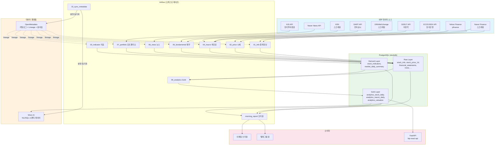
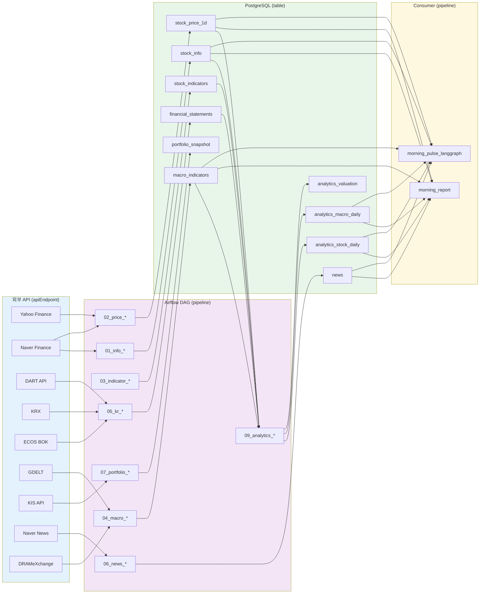
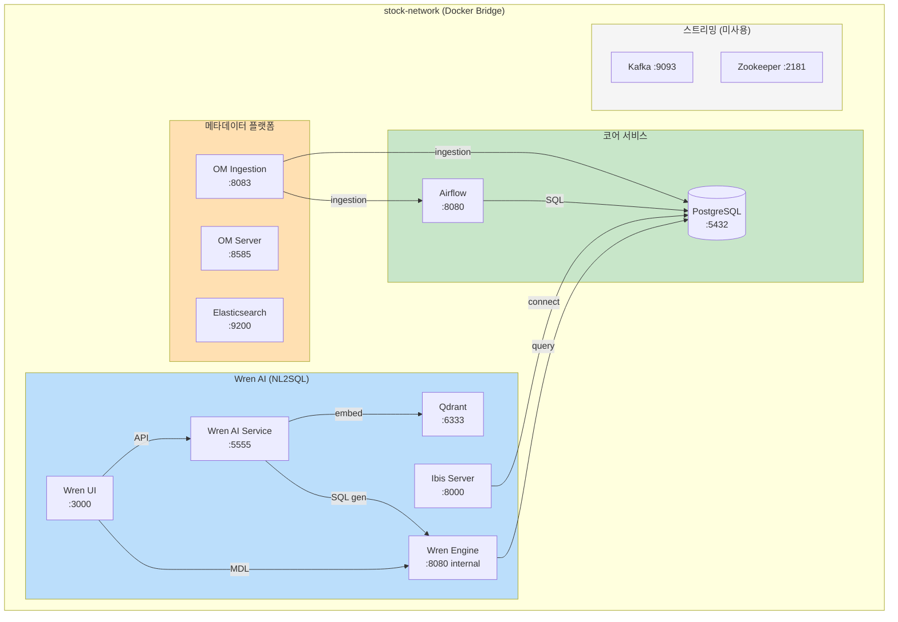
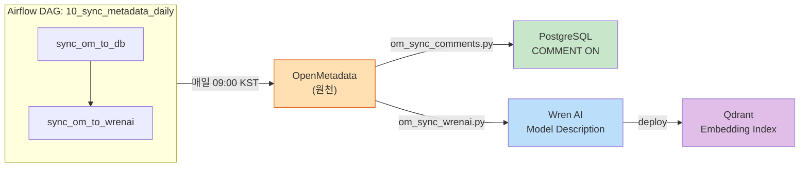
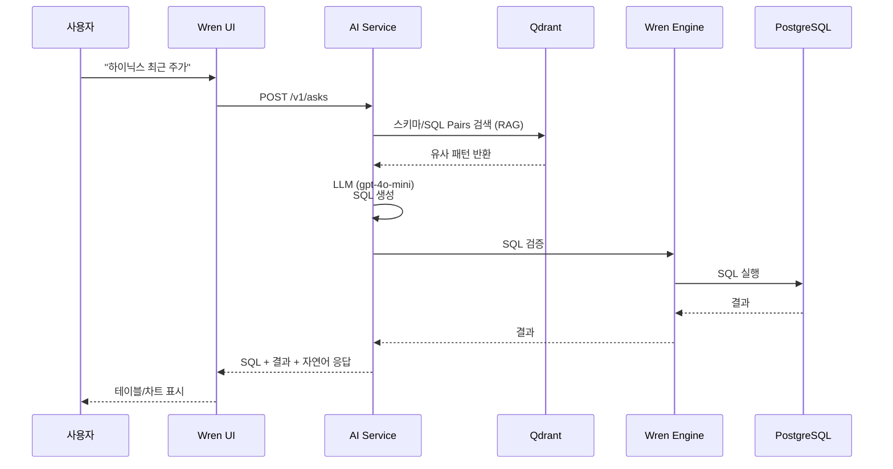
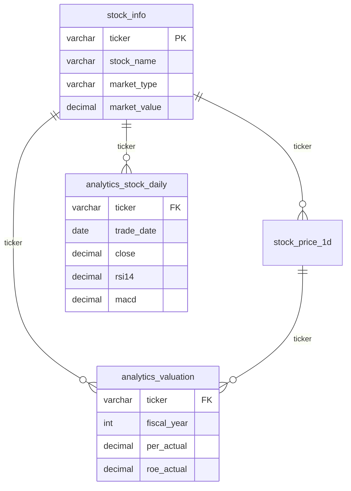
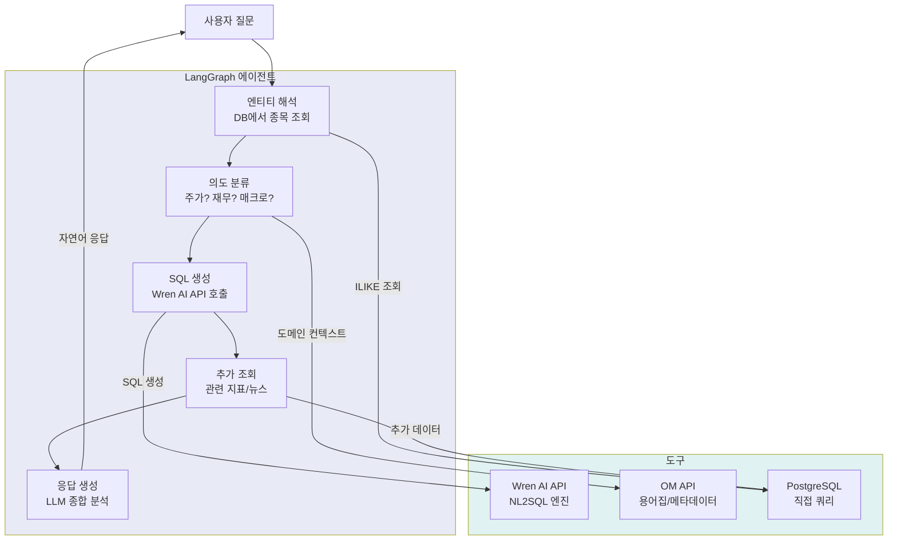

# BIP-Pipeline: 데이터 아키텍처 리뷰 & NL2SQL 준비도

> **최초 작성:** 2026-03-21
> **최근 업데이트:** 2026-04-02 (Wren AI NL2SQL 설치, OM↔Wren AI 메타데이터 동기화, 외부 소스 lineage 완성, 전체 아키텍처 다이어그램 추가)
> **작성자:** Claude Code (Data Architect 역할)
> **목적:** 아키텍처 이슈 추적, 개선 결정 기록, NL2SQL 준비도 관리

---

## 목차

1. [시스템 개요](#1-시스템-개요)
2. [데이터 레이어 구조](#2-데이터-레이어-구조)
3. [테이블 카탈로그](#3-테이블-카탈로그)
4. [데이터 소스 & DAG 맵](#4-데이터-소스--dag-맵)
   - [4-2. End-to-End 데이터 플로우](#4-2-end-to-end-데이터-플로우-소스--테이블--활용처)
   - [4-3. OpenMetadata Lineage 적용 범위](#4-3-openmetadata-lineage-적용-범위-및-한계)
   - [4-4. 전체 아키텍처 다이어그램](#4-4-전체-아키텍처-다이어그램)
   - [4-5. 메타데이터 동기화 흐름](#4-5-메타데이터-동기화-흐름)
   - [4-6. Wren AI NL2SQL 구성](#4-6-wren-ai-nl2sql-구성)
5. [아키텍처 이슈 트래커](#5-아키텍처-이슈-트래커)
6. [NL2SQL 위험 레지스트리](#6-nl2sql-위험-레지스트리)
7. [비즈니스 용어집](#7-비즈니스-용어집)
8. [Join 경로 맵 & FK 제약](#8-join-경로-맵--fk-제약)
9. [단위 정의](#9-단위-정의)
10. [개선 로드맵](#10-개선-로드맵)
11. [결정 로그](#11-결정-로그)
12. [OpenMetadata 구성](#12-openmetadata-구성)

---

## 1. 시스템 개요

**시스템명:** BIP-Pipeline
**목적:** KOSPI/KOSDAQ/미국 주식 데이터 수집 → 분석 → 모닝 브리핑
**주요 사용자:** 개인 투자자 (데이터 분석, 리포트, 향후 NL2SQL 쿼리)
**인프라:** Airflow (오케스트레이션) + PostgreSQL (저장) + Kafka/Spark (스트리밍, 미사용)

### 전체 시스템 아키텍처



---

## 2. 데이터 레이어 구조

### 현재 상태 (As-Is)

```
Layer 1: Raw / Operational
  stock_info              — 종목 메타데이터
  stock_price_1d/1m       — OHLCV 시세 (주봉/월봉은 1d에서 계산 가능 → 폐기)
  consensus_estimates     — 애널리스트 컨센서스
  financial_statements    — DART 재무제표  ✅ 스키마 확인됨
  company_*               — DART 기업정보 (배당/임원/감사 등)
  macro_indicators        — ✅ 매크로/금리/감성 통합 테이블
  news                    — 뉴스 기사 원문
  risk_headlines          — GDELT 지정학 리스크 헤드라인
  portfolio               — KIS 연동 포트폴리오 계정

Layer 2: Derived / Calculated
  stock_indicators        — 기술적 지표 (MA, MACD, RSI, BB...)
  market_daily_summary    — 시장 breadth
  sector_daily_performance — 섹터 수익률

Layer 3: Gold / Serving     ✅ 구현완료
  analytics_macro_daily   — 거시지표 EAV pivot (일별 1행)
  analytics_valuation     — 종목별 밸류에이션 종합 (pre-joined)
  analytics_stock_daily   — 시세 + 지표 + 컨센서스 와이드 테이블

Layer 4: Reporting (DB 미저장)
  모닝 브리핑             — LLM 분석 → 이메일 발송
```

### 목표 상태 (To-Be)

```
Layer 1: Raw / Operational  (현재와 동일, 스키마 정리)
Layer 2: Derived            (현재와 동일)
Layer 3: Gold / Serving     ✅ 구현완료
  analytics_macro_daily     — 거시지표 EAV pivot (437행, DAG: 09_analytics_macro_daily)
  analytics_valuation       — 밸류에이션 종합 PER/PBR/ROE (7,609행, DAG: 09_analytics_valuation)
  analytics_stock_daily     — 시세 + 기술지표 + 컨센서스 (1,870,328행, DAG: 09_analytics_stock_daily)

Layer 4: Semantic           ✅ 구현완료
  비즈니스 용어집 (OM Glossary 77개 등록 완료)
  Join 경로, 단위 정의, 지표 계산식
  Tags 분류 (raw/derived/gold, 도메인별) ✅ 37/37 완료
  SourceType 태그 (rest-api/scraping/library) ✅ 14 apiEndpoints

Layer 5: NL2SQL            ✅ 구현완료
  Wren AI (시맨틱 레이어 + NL2SQL 엔진)
  5개 모델 등록 (Gold 3 + Raw 2)
  29개 SQL Pairs (자주 묻는 패턴)
  OM → Wren AI 메타데이터 자동 동기화 DAG
```

### 전체 테이블 레이어 · 도메인 분류 (34개)

> OM Tags 적용 기준표. `scripts/om_tag_tables.py`로 일괄 등록.
> **Layer 태그:** `DataLayer.raw` / `DataLayer.derived` / `DataLayer.gold` / `DataLayer.application`
> **Domain 태그:** `Domain.market` / `Domain.financial` / `Domain.macro` / `Domain.news` / `Domain.portfolio` / `Domain.product` / `Domain.user`

| 테이블 | Layer | Domain | 설명 |
|--------|-------|--------|------|
| `stock_info` | raw | market | 종목 마스터 (KOSPI/KOSDAQ/US) |
| `stock_price_1d` | raw | market | 일봉 OHLCV + 투자자 수급 |
| `stock_price_1m` | raw | market | 1분봉 (watchlist 온디맨드) |
| `financial_statements` | raw | financial | DART 재무제표 (정규화 컬럼) |
| `company_dart_info` | raw | financial | DART 기업코드 매핑 |
| `company_dividend` | raw | financial | 배당 정보 |
| `company_employees` | raw | financial | 직원 현황 |
| `company_executives` | raw | financial | 임원 현황 |
| `company_audit` | raw | financial | 감사의견 |
| `company_treasury_stock` | raw | financial | 자기주식 |
| `company_shareholders` | raw | financial | 최대주주 |
| `company_exec_compensation` | raw | financial | 임원보수 |
| `consensus_estimates` | raw | financial | 애널리스트 컨센서스 (최신) |
| `consensus_history` | raw | financial | 컨센서스 변경 이력 |
| `us_financial_statements` | raw | financial | 미국 기업 재무제표 |
| `us_fundamentals` | raw | financial | 미국 기업 투자지표 |
| `macro_indicators` | raw | macro | 매크로/금리/환율/감성 (EAV) |
| `risk_headlines` | raw | macro | GDELT 지정학 리스크 헤드라인 |
| `news` | raw | news | 뉴스 기사 (Naver 수집) |
| `news_raw` | raw | news | 뉴스 원문 |
| `news_article` | raw | news | 파싱된 뉴스 기사 |
| `portfolio_snapshot` | raw | portfolio | KIS API 포트폴리오 일일 스냅샷 |
| `product_price` | raw | product | 제품 가격 데이터 |
| `product_release` | raw | product | 제품 출시 이력 |
| `stock_indicators` | derived | market | 기술적 지표 (pandas-ta, from 1d) |
| `market_daily_summary` | derived | market | 시장 breadth (ADR, 신고가 등) |
| `news_daily_summary` | derived | news | 일별 뉴스 요약/감성 집계 |
| `users` | application | user | 서비스 사용자 |
| `user_watchlist` | application | user | 사용자 관심 종목 |
| `portfolio` | application | portfolio | 포트폴리오 계정 |
| `holding` | application | portfolio | 보유 종목 현황 |
| `transaction` | application | portfolio | 매매 거래 내역 |
| `cash_transaction` | application | portfolio | 현금 입출금 내역 |

| `analytics_macro_daily` | gold | macro | macro_indicators EAV → pivot (일별 1행, forward-fill) ✅ 구현완료 |
| `analytics_stock_daily` | gold | market | 시세+지표+컨센서스 와이드 테이블 ✅ 구현완료 |
| `analytics_valuation` | gold | financial | PER/PBR/ROE pre-computed 밸류에이션 ✅ 구현완료 (7,609행) |

---

## 3. 테이블 카탈로그

> 상태 범례: ✅ 스키마 확인됨 | ⚠️ DDL 미확인 | ❌ 중복/폐기 예정

### 3-1. 종목 메타데이터

| 테이블 | 상태 | 스키마 파일 | 설명 | 비고 |
|--------|------|-------------|------|------|
| `stock_info` | ✅ | postgres/patch.sql | 종목 마스터 — ticker, 이름, 시장, 통화, 상장일, 시총 | 운영 기준 테이블 |
| `stock_metadata` | ❌ | postgres/init.sql | 구버전 5개 미국 주식 하드코딩 | 폐기 예정 |
| `company_dart_info` | ✅ | DAG 내 확인 | ticker ↔ corp_code(DART 10자리) 매핑 | FK: ticker → stock_info |

**`stock_info` 컬럼 상세:**

| 컬럼 | 타입 | 설명 | 단위/값범위 |
|------|------|------|------------|
| `ticker` | VARCHAR(20) | 종목코드 (UNIQUE) | KR: `005930.KS`, US: `NVDA` |
| `stock_name` | VARCHAR(100) | 한글 종목명 | |
| `stock_name_eng` | VARCHAR(100) | 영문 종목명 | |
| `market_type` | VARCHAR(20) | 시장 구분 | `KOSPI`, `KOSDAQ`, `NASDAQ`, `NYSE` |
| `exchange_code` | VARCHAR(10) | 거래소 코드 | `KS`, `KQ`, `NSQ`, `NYS` |
| `currency_code` | VARCHAR(10) | 통화 | `KRW`, `USD` |
| `listing_date` | DATE | 상장일 | |
| `par_value` | NUMERIC | 액면가 | 원(KRW) |
| `total_shares` | BIGINT | 상장주식수 | 주 |
| `market_value` | NUMERIC | 시가총액 | ⚠️ **단위: 억원** (원 아님) |
| `data_source` | VARCHAR(50) | 데이터 출처 | `naver`, `krx`, `yfinance` |
| `is_active` | BOOLEAN | 활성 여부 | |
| `sector` | — | 섹터/업종 | ❌ **컬럼 없음 — 추가 필요** |

---

### 3-2. 시세 데이터

| 테이블 | 상태 | 설명 | 주요 제약 |
|--------|------|------|-----------|
| `stock_price_1m` | ✅ | 1분봉 — watchlist 종목 on-demand | UNIQUE(ticker, timestamp) |
| `stock_price_1d` | ✅ | 일봉 — 주력 시세 테이블 | UNIQUE(ticker, timestamp) |
| `stock_price_1wk` | ❌ | 주봉 — **2026-03-28 DROP** (1d에서 resample 계산 가능) | — |
| `stock_price_1mo` | ❌ | 월봉 — **2026-03-28 DROP** (1d에서 resample 계산 가능) | — |

**공통 컬럼 (모든 price 테이블):**

| 컬럼 | 타입 | 설명 | 주의사항 |
|------|------|------|----------|
| `ticker` | VARCHAR(10) | 종목코드 | |
| `timestamp` | TIMESTAMP | ⚠️ UTC 기준 추정 | 명시 없음, 확인 필요 |
| `timestamp_ny` | TIMESTAMP | 뉴욕 시간 | 미국 주식용 |
| `timestamp_kst` | TIMESTAMP | 한국 시간 | 한국 주식용 |
| `open/high/low/close` | NUMERIC | OHLCV | |
| `volume` | BIGINT | 거래량 | |

> ⚠️ **이슈:** 일봉에서 3개 timestamp 컬럼은 과잉. `trade_date DATE` 컬럼 추가 권장.
> ⚠️ **이슈:** UNIQUE 키가 `timestamp` 기준인데 KR/US 주식이 다른 timezone을 사용함.

---

### 3-3. 컨센서스 & 애널리스트 추정

**`consensus_estimates` 컬럼 상세:**

| 컬럼 | 타입 | 설명 | 단위/값범위 |
|------|------|------|------------|
| `ticker` | VARCHAR(20) | Yahoo 형식 코드 | `005930.KS` |
| `stock_code` | VARCHAR(10) | 6자리 순수 코드 | `005930` ⚠️ ticker에서 파생 가능, 중복 |
| `rating` | NUMERIC(3,2) | 투자의견 점수 | 1.0~5.0, **5=Strong Buy** (높을수록 긍정) |
| `target_price` | BIGINT | 목표주가 | **원(KRW)** |
| `analyst_count` | INT | 추정 애널리스트 수 | |
| `estimate_year` | INT | 추정 대상 연도 | |
| `est_eps` | BIGINT | 예상 EPS | **원(KRW)** |
| `est_per` | NUMERIC(10,2) | 예상 PER | 배수(x) |
| `est_pbr` | NUMERIC(10,2) | 예상 PBR | 배수(x) |
| `est_roe` | NUMERIC(10,2) | 예상 ROE | **%** |
| `est_dividend` | BIGINT | 예상 배당금 | **원(KRW)** |
| `data_source` | VARCHAR(50) | 출처 | `wisereport` |
| `collected_at` | TIMESTAMPTZ | 수집 시각 | |

---

### 3-4. 기술적 지표

**`stock_indicators` 주요 컬럼:**

| 컬럼 그룹 | 컬럼들 | 설명 |
|-----------|--------|------|
| 기준 | `ticker`, `trade_date` | 종목 + 거래일 |
| 이동평균 | `ma5/10/20/60/120/200` | 단순이동평균 |
| EMA/MACD | `ema12/26`, `macd/signal/hist` | MACD 지표 |
| 모멘텀 | `rsi14`, `stoch_k/d` | RSI, 스토캐스틱 |
| 볼린저밴드 | `bb_upper/middle/lower`, `bb_pctb` | BB |
| 변동성 | `atr14` | Average True Range |
| 시그널 | `golden_cross`, `death_cross` | MA 크로스 시그널 (BOOLEAN) |
| 52주 | `high_52w`, `low_52w`, `pct_from_52w_high/low` | 52주 고가/저가 |
| 거래량 | `volume_ma20` | 거래량 이동평균 |

**`market_daily_summary` 주요 컬럼:**

| 컬럼 | 설명 |
|------|------|
| `trade_date` | 거래일 |
| `total_stocks` | 전체 종목수 |
| `advancing/declining/unchanged` | 상승/하락/보합 종목수 |
| `advance_decline_ratio` | ADR |
| `new_high_52w/new_low_52w` | 52주 신고가/신저가 종목수 |
| `above_ma20/50/200` | MA 위 종목 비율 |
| `rsi_overbought/oversold` | RSI 과매수/과매도 종목수 |

---

### 3-5. 기업 정보 (DART)

| 테이블 | 설명 | 고유키 |
|--------|------|--------|
| `company_dividend` | 배당 정보 | (ticker, fiscal_year, stock_type) |
| `company_employees` | 직원 현황 | (ticker, fiscal_year, department, gender, employee_type) |
| `company_executives` | 임원 현황 | (ticker, fiscal_year, name, position) |
| `company_audit` | 감사의견 | (ticker, fiscal_year) |
| `company_treasury_stock` | 자기주식 | (ticker, fiscal_year, stock_type) |
| `company_shareholders` | 최대주주 | (ticker, fiscal_year, shareholder_name) |
| `company_exec_compensation` | 임원보수(5억↑) | (ticker, fiscal_year, name) |
| `financial_statements` | DART 재무제표 (정규화 컬럼 구조) | (corp_code, fiscal_year, fiscal_quarter, report_type) |

**`financial_statements` 컬럼 상세:**

| 컬럼 | 설명 | 단위/값 |
|------|------|---------|
| `corp_code` | DART 기업코드 (10자리) | |
| `ticker` | Yahoo Finance 형식 코드 | `005930.KS` |
| `fiscal_year` | 회계연도 | 정수 (2024) |
| `fiscal_quarter` | 분기 | 1=Q1, 2=반기, 3=Q3, 4=연간 |
| `report_type` | 보고서 유형 | `annual`, `Q1`, `half`, `Q3` |
| `revenue` | 매출액 | 원(KRW) |
| `cost_of_sales` | 매출원가 | 원(KRW) |
| `gross_profit` | 매출총이익 | 원(KRW) |
| `operating_expense` | 판관비 | 원(KRW) |
| `operating_profit` | 영업이익 | 원(KRW) |
| `net_income` | 당기순이익 | 원(KRW) |
| `total_assets` | 자산총계 | 원(KRW) |
| `total_liabilities` | 부채총계 | 원(KRW) |
| `total_equity` | 자본총계 | 원(KRW) |
| `cash_from_operating` | 영업활동 현금흐름 | 원(KRW) |
| `cash_from_investing` | 투자활동 현금흐름 | 원(KRW) |
| `cash_from_financing` | 재무활동 현금흐름 | 원(KRW) |

> **참고:** 구 DART API RAW 방식(`sj_div`/`account_nm` 구분)과 달리 정규화된 컬럼 구조. CFS(연결) 우선, 없으면 OFS(별도) 사용.

> ⚠️ **공통 이슈:** 모든 company_* 테이블이 `ticker`와 `corp_code`를 함께 보유. FK 물리적 제약은 2026-03-28 추가됨.
> `corp_code` = DART 10자리 기업코드. `company_dart_info`를 통해 `ticker`와 매핑.

---

### 3-6. 매크로 / 금리 / 감성 지수

> ✅ 모든 매크로 데이터는 `macro_indicators` 단일 테이블에 통합 저장됨 (확인: 2026-03-28)

**`macro_indicators` 스키마:**

| 컬럼 | 타입 | 설명 |
|------|------|------|
| `indicator_date` | DATE | 지표 날짜 |
| `region` | VARCHAR | 지역 (`North America`, `South Korea`, `China`, `Europe`, `Japan`, ...) |
| `indicator_type` | VARCHAR | 지표 유형 (아래 목록) |
| `value` | NUMERIC | 지표 값 |
| `created_at` | TIMESTAMP | 수집 시각 |

UNIQUE: `(indicator_date, region, indicator_type)`

**저장되는 indicator_type 유형:**

| 카테고리 | indicator_type 예시 |
|----------|---------------------|
| 시장 변동성 | `vix`, `vvix` |
| 환율 | `exchange_rate` (KRW/USD 등) |
| 원자재 | `gold`, `oil_wti`, `copper` |
| 채권/금리 | `us_10y`, `us_2y`, `kr_10y`, `base_rate`, `cd91`, `cofix` |
| 주요 지수 | `sp500`, `nasdaq`, `kospi`, `kosdaq` |
| 경제지표 | `cpi`, `gdp_growth`, `m2`, `export`, `import` |
| KRX 투자자동향 | `institutional_net`, `foreign_net`, `retail_net` |
| GDELT 지정학 | `geopolitical_risk_*`, `news_tension_*` |
| 뉴스 감성 | `news_sentiment_geopolitical`, `news_sentiment_economic`, `news_sentiment_overall` |
| 반도체 가격 | `dram_4gb`, `nand_128gb` 등 |

> ⚠️ `sector_daily_performance` 는 별도 테이블로 KRX 섹터 지수 저장 (DAG: `05_kr_sectors_daily`)

**`risk_headlines` 테이블:**
- GDELT 기반 지정학 리스크 헤드라인 저장
- 컬럼: `event_date`, `headline`, `url`, `tone`, `event_code`, `country_code`, `goldstein_scale`, `avg_tone`

**`monitor_checklist` 테이블:**
- 모닝리포트 체크리스트 → Haiku 파싱 결과 저장
- 컬럼: `rule_date`, `rule_order`, `rule_type`, `original_text`, `parsed_rule(JSONB)`, `triggered`, `triggered_at`, `triggered_value`
- UNIQUE: `(rule_date, rule_order)`

**`monitor_alerts` 테이블:**
- 텔레그램 알림 발송 이력
- 컬럼: `alert_date`, `alert_time`, `level`, `category`, `title`, `description`, `data(JSONB)`, `checklist_id(FK)`

---

## 4. 데이터 소스 & DAG 맵

| Stage | DAG ID | 소스 | 출력 테이블 | 주기 |
|-------|--------|------|------------|------|
| 01 | `01_kr_info_daily`, `01_ny_info_daily` | Naver Mobile/Securities | `stock_info` | 평일 |
| 02 | `02_daily_loader`, `02_kr_daily_loader` | Yahoo Finance / Naver | `stock_price_1d` | 평일 |
| 02 | `02_price_us_historical_manual` | Yahoo Finance | `stock_price_1d` | 수동 (1wk/1mo 제거됨) |
| 02 | `02_kr_after_hours` | Naver Securities | `stock_price_1d` | 평일 장후 |
| 03 | `dag_daily_indicators`, `dag_kr_daily_indicators` | pandas-ta (from price) | `stock_indicators`, `market_daily_summary` | 평일 |
| 04 | `04_macro_global_hourly` | yfinance | `macro_indicators` | 시간별 |
| 04 | `04_geopolitical_indices` | GDELT / IMF / WB | `macro_indicators` | 주간 |
| 04 | `04_gdelt_events` | GDELT API | `macro_indicators`, `risk_headlines` | 일간 |
| 04 | `04_semiconductor_prices` | WSTS/SEMI 프록시 | `macro_indicators` | 주간 |
| 05 | `05_kr_ecos_weekly` | ECOS BOK API | `macro_indicators` | 주간 |
| 05 | `05_kr_rates_daily` | Naver Finance | `macro_indicators` | 일간 |
| 05 | `05_kr_sectors_daily` | KRX | `sector_daily_performance` | 일간 |
| 05 | `05_kr_financial_stmt_weekly` | DART API | `financial_statements`, `company_dart_info` | 주간 |
| 05 | `05_kr_financial_stmt_manual` | DART API | `financial_statements` | 수동 (5년치) |
| 05 | `05_kr_investor_trend` | KRX | `macro_indicators` | 일간 |
| 06 | `06_news_sentiment_daily` | Google News RSS | `macro_indicators` | 평일 22:00 |
| 06 | `06_naver_news_*` | Naver News API | `news` | 일간 |
| 07 | `07_portfolio_snapshot_daily` | KIS API (한국투자증권) | `portfolio_snapshot` | 평일 07:00 |
| 08 | `08_company_info_annual` | DART 사업보고서 | `company_dividend`, `company_employees`, `company_executives`, `company_audit`, `company_treasury_stock`, `company_shareholders`, `company_exec_compensation` | 연간/수동 |
| 보고 | `morning_report` | DB + OpenAI/Anthropic | 이메일 + 텔레그램 (체크리스트) | 평일 08:10 |
| 모니터 | `market_monitor_checklist_parse` | Anthropic Haiku | `monitor_checklist` | 평일 08:25 |
| 모니터 | `market_monitor_intraday` | Naver/Upbit/CoinGecko | `monitor_alerts` | 평일 09:00~15:50 (10분) |
| 모니터 | `market_monitor_open_close` | Naver Finance | 텔레그램 발송 | 평일 09:00 |
| 모니터 | `market_monitor_close` | Naver Finance | 텔레그램 발송 | 평일 15:35 |

> 모든 DAG는 완료 시 `utils/lineage.py`의 `register_table_lineage_async()`를 통해 OpenMetadata에 lineage를 자동 등록함.

---

## 4-2. End-to-End 데이터 플로우 (소스 → 테이블 → 활용처)

> 수집/적재(upstream)뿐 아니라 테이블이 **어디서 읽히는지(downstream)**까지 포함한 전체 플로우.

### 전체 흐름도

```
[외부 소스]          [수집 DAG]         [Raw/Derived 테이블]    [Gold 테이블]        [활용처 (Consumers)]
────────────────────────────────────────────────────────────────────────────────────────────────────────
Naver/Yahoo         01~02 DAG    →    stock_info              ─┐
                                      stock_price_1d           │
                                                               ├──→ analytics_stock_daily ──→ 모닝 브리핑
pandas-ta           03 DAG       →    stock_indicators         │                            FastAPI (BIP-React)
                                      market_daily_summary   ──┘                            NL2SQL (예정)

yfinance/GDELT      04~06 DAG    →    macro_indicators       ──→ analytics_macro_daily  ──→ 모닝 브리핑
ECOS/KRX/News                         risk_headlines                                        NL2SQL (예정)

DART API            05 DAG       →    financial_statements   ─┐
                                      company_dart_info       │
                                      company_*              ─┴──→ analytics_valuation  ──→ FastAPI (BIP-React)
Naver WiseReport    06 DAG       →    consensus_estimates                                   NL2SQL (예정)

Naver News API      06 DAG       →    news                   ──────────────────────────→ 모닝 브리핑
                                      news_article                                          (LLM RAG 컨텍스트)

KIS API (한투)       07 DAG       →    portfolio_snapshot     ──────────────────────────→ FastAPI (BIP-React)
                                      portfolio / holding                                   bip-agents
                                      transaction

DART 사업보고서       08 DAG       →    company_dividend       ──────────────────────────→ FastAPI (BIP-React)
                                      company_employees
                                      company_executives
```

### 테이블별 활용처 매핑

| 테이블 | Layer | 주요 Consumer | 비고 |
|--------|-------|--------------|------|
| `stock_info` | raw | 모닝 브리핑, FastAPI, analytics_* Gold | 종목 메타(이름/섹터) 모든 곳에서 JOIN |
| `stock_price_1d` | raw | analytics_stock_daily, 모닝 브리핑, FastAPI | Gold 적재 후에는 Gold 우선 사용 예정 |
| `stock_indicators` | derived | analytics_stock_daily | Gold 적재 후 직접 조회 대신 Gold 사용 |
| `macro_indicators` | raw | analytics_macro_daily, 모닝 브리핑 | EAV → Gold pivot으로 조회 단순화 |
| `financial_statements` | raw | analytics_valuation, FastAPI | DART 연간 재무 데이터 |
| `consensus_estimates` | raw | analytics_stock_daily, analytics_valuation, FastAPI | 애널리스트 추정치 |
| `news` / `news_article` | raw | 모닝 브리핑 (LLM RAG) | 뉴스 감성 분석 컨텍스트 |
| `portfolio_snapshot` | raw | FastAPI, bip-agents | 실시간 포트폴리오 현황 |
| `analytics_stock_daily` | **gold** | 모닝 브리핑, FastAPI, NL2SQL (예정) | 시세+지표+컨센서스 pre-joined |
| `analytics_macro_daily` | **gold** | 모닝 브리핑, NL2SQL (예정) | 거시지표 pivot, 조회 단순화 |
| `analytics_valuation` | **gold** | FastAPI, NL2SQL (예정) | PER/PBR/ROE pre-computed |

### Consumer별 주요 읽기 테이블

| Consumer | 주요 읽기 테이블 |
|----------|----------------|
| **모닝 브리핑 DAG** | `stock_price_1d`, `stock_info`, `macro_indicators`, `news`, `analytics_macro_daily` |
| **FastAPI (BIP-React)** | `stock_info`, `stock_price_1d`, `financial_statements`, `consensus_estimates`, `analytics_valuation`, `portfolio_snapshot`, `company_*` |
| **bip-agents (LangGraph)** | `portfolio_snapshot`, `holding`, `analytics_stock_daily`, `analytics_macro_daily` |
| **NL2SQL / Wren AI (예정)** | `analytics_stock_daily`, `analytics_valuation`, `analytics_macro_daily`, `stock_info` |

---

## 4-3. OpenMetadata Lineage 적용 범위 및 한계

### 현재 커버 범위 (✅)

전체 리니지 체인:
```
apiService (외부 API) → pipeline (DAG) → table (stockdb) → consumer pipeline
```

| 레이어 | 구현 방법 | 상태 |
|--------|---------|------|
| **apiService → pipeline** | `scripts/om_register_data_sources.py` | ✅ 구현 완료 |
| **pipeline → table** | `utils/lineage.py` `register_table_lineage_async()` | ✅ 22개 DAG |
| **table → consumer pipeline** | `register_table_lineage_async(target_table=None, source_tables=[...])` | ✅ `morning_report` 등록 |

예: `naver-finance` → `02_price_kr_ohlcv_daily` → `stock_price_1d` → `morning_report`

### 외부 데이터 소스 (apiService) 등록

`scripts/om_register_data_sources.py`로 9개 외부 소스를 OM에 `apiService`로 등록:

| 서비스명 | displayName | 연결 DAG 수 |
|---------|------------|-----------|
| `yahoo-finance` | Yahoo Finance (yfinance) | 5개 |
| `naver-finance` | Naver Finance / WiseReport | 5개 |
| `dart-api` | DART API (전자공시시스템) | 4개 |
| `krx-api` | KRX (한국거래소) | 3개 |
| `ecos-bok-api` | ECOS BOK API (한국은행) | 3개 |
| `gdelt-api` | GDELT (Global Database of Events) | 4개 |
| `kis-api` | KIS API (한국투자증권) | 1개 |
| `naver-news-api` | Naver News API | 3개 |
| `semiconductor-market-data` | 반도체 시장 가격 (DRAM/NAND) | 1개 |

**실행 방법:**
```bash
# Airflow ingestion 먼저 실행 (pipeline 엔티티 생성)
docker exec openmetadata-ingestion metadata ingest -c /connectors/bip_airflow.yaml

# 외부 소스 등록
set -a && source .env && set +a
OM_HOST=http://localhost:8585 OM_BOT_TOKEN=$OM_BOT_TOKEN \
    python scripts/om_register_data_sources.py

# Dry-run (미리 보기)
python scripts/om_register_data_sources.py --dry-run
```

### OM Lineage로 Consumer 추적

| Consumer 유형 | OM 지원 여부 | 구현 방법 |
|--------------|-------------|---------|
| **Airflow DAG (읽기 전용)** | ✅ 완료 | `register_table_lineage_async(target=None, source_tables=[...])` — pipeline을 종착점으로 등록 |
| **FastAPI (REST API)** | ⚠️ 제한적 | OM에 Dashboard Service로 등록하거나, 별도 커스텀 lineage API 활용 |
| **bip-agents (LangGraph)** | ⚠️ 제한적 | 별도 repo라 자동 추적 어려움. 수동 등록 가능 |
| **Wren AI (NL2SQL)** | ⚠️ 제한적 | Wren Engine이 OM과 직접 통합 없음. 메타데이터 공유 수준 |

**중기 (FastAPI lineage):**
OM에 `bip-react-api` Dashboard Service를 생성하고,
FastAPI 시작 시 `table → dashboard` lineage를 한 번 등록하는 스크립트 추가.

**현실적 결론:**
OM lineage는 **파이프라인(DAG) 간 데이터 흐름 추적**에는 매우 효과적이나,
**애플리케이션 레벨 consumer**(API, 에이전트) 추적은 수동 등록이 필요하고 유지보수 부담이 있다.

### SourceType 태그 (외부 소스 수집 방식 분류)

apiEndpoint 엔티티에 `SourceType` 태그를 적용하여 데이터 수집 안정성을 분류:

| SourceType 태그 | 설명 | 소스 |
|---|---|---|
| `rest-api` | 공식 인증키 기반, 안정적 | DART, ECOS, GDELT, KIS, Naver News |
| `scraping` | 웹 스크래핑, 구조 변경 시 깨질 수 있음 | Naver Finance, KRX, DRAMeXchange |
| `library` | Python 라이브러리 경유 (비공식 API) | yfinance |

### Lineage 커버리지 현황 (2026-04-02)

```
Pipeline: 43개 중 upstream 39개, downstream 37개 연결
Table:    39개 중 upstream 26개 연결
          (미연결 14개: 앱 전용 테이블 users/portfolio 등 → FastAPI lineage 시 해결)
```

---

## 4-4. 전체 아키텍처 다이어그램

### OM Lineage 전체 흐름



### Docker 서비스 구성



---

## 4-5. 메타데이터 동기화 흐름

### OM ↔ DB ↔ Wren AI 동기화

OpenMetadata를 메타데이터 원천(Source of Truth)으로 사용하고,
DB COMMENT와 Wren AI 모델에 자동 동기화합니다.



### 동기화 스크립트 목록

| 스크립트 | 역할 | 실행 방법 |
|---------|------|---------|
| `scripts/om_sync_comments.py` | OM → DB COMMENT (35 tables, 453 columns) | DAG 자동 / 수동 |
| `scripts/om_sync_wrenai.py` | OM → Wren AI model description + Deploy | DAG 자동 / 수동 |
| `scripts/om_register_data_sources.py` | 외부 API → OM apiEndpoint + lineage (9 services, 31 edges) | 수동 (1회) |
| `scripts/om_tag_tables.py` | OM 테이블 태그 일괄 등록 (DataLayer, Domain) | 수동 (1회) |
| `scripts/om_enrich_metadata.py` | OM 테이블/컬럼 설명 일괄 등록 | 수동 (1회) |
| `scripts/om_link_columns.py` | OM 컬럼 ↔ 용어집 링크 | 수동 (1회) |
| `scripts/om_build_glossary.py` | OM 용어집 생성 (77개 투자 용어) | 수동 (1회) |

---

## 4-6. Wren AI NL2SQL 구성

### 시스템 구성

```
docker-compose.wrenai.yml로 배포
UI: http://localhost:3000
```

| 서비스 | 이미지 | 역할 |
|--------|-------|------|
| wren-engine | `0.22.0` | SQL 실행 엔진 (MDL 기반) |
| wren-ai-service | `0.29.0` | NL2SQL 엔진 (LiteLLM + RAG) |
| wren-ui | `0.32.2` | 웹 인터페이스 |
| qdrant | `v1.11.0` | 벡터 DB (임베딩 저장) |
| ibis-server | `0.22.0` | 데이터 소스 커넥터 |

### NL2SQL 처리 흐름



### 등록된 모델 (5개)

| 모델 | 소스 테이블 | 용도 |
|------|-----------|------|
| `public_stock_info` | stock_info | 종목 마스터 (ticker, name, market) |
| `public_stock_price_1d` | stock_price_1d | 일봉 시세 (OHLCV + 수급) |
| `public_analytics_stock_daily` | analytics_stock_daily | Gold: 시세+지표+컨센서스 와이드 |
| `public_analytics_macro_daily` | analytics_macro_daily | Gold: 매크로 지표 피벗 |
| `public_analytics_valuation` | analytics_valuation | Gold: 밸류에이션 종합 |

### 테이블 관계 (Relationship)



### SQL Pairs (29개 등록)

자주 사용되는 질문-SQL 패턴을 사전 등록하여 RAG 검색 정확도 향상:

| 카테고리 | 수량 | 예시 질문 |
|---------|------|---------|
| 종목 검색/주가 | 7개 | "하이닉스 주가", "삼성전자 최근 한달 주가" |
| 기술지표 | 3개 | "RSI 과매도 종목", "골든크로스 발생 종목" |
| 밸류에이션 | 5개 | "PER 낮은 종목", "ROE 20% 이상 종목" |
| 매크로 | 5개 | "오늘 환율", "VIX 추이", "기준금리" |
| 수급 | 2개 | "외국인 순매수", "기관 순매수" |
| 복합 질문 | 4개 | "저PER 고ROE", "거래량 급증", "52주 신저가" |
| 비교/섹터 | 3개 | "삼성 vs 하이닉스", "반도체 관련주" |

### Wren AI 한계 및 향후 계획

| 한계 | 영향 | 해결 방향 |
|------|------|---------|
| 1질문 = 1쿼리만 생성 | 복합 질문 불가 | LangGraph 에이전트 통합 |
| OM 용어집/태그 활용 불가 | 도메인 지식 제한적 | LangGraph에서 OM API 직접 조회 |
| ETF/보통주 구분 없음 | 검색 노이즈 | Instructions 또는 is_etf 컬럼 추가 |
| 종목코드 추측 | 잘못된 ticker 매핑 | SQL Pairs + ILIKE 패턴 학습 |

### 향후 LangGraph 통합 구조 (중기 계획)



---

## 5. 아키텍처 이슈 트래커

> 상태: 🔴 미해결 | 🟡 진행중 | ✅ 해결됨

### ISS-001: `stock_metadata` vs `stock_info` 이중 엔티티
- **심각도:** 🔴 High
- **상태:** 🔴 미해결
- **설명:** `init.sql`의 `stock_metadata`(구버전 5개 하드코딩)와 `patch.sql`의 `stock_info`(운영 테이블)가 공존. NL2SQL이 어느 테이블을 사용해야 할지 모름.
- **권고:** `stock_metadata`를 `stock_info`로의 VIEW로 대체하거나 DROP.
- **영향 범위:** NL2SQL 정확도, 스키마 혼란

### ISS-002: `timestamp` 열의 시간대 의미론 혼란
- **심각도:** 🔴 High
- **상태:** 🔴 미해결
- **설명:** `stock_price_1d`에 `timestamp`, `timestamp_ny`, `timestamp_kst` 3개 컬럼. 일봉 데이터에 3개 timestamp는 과잉이며, 기준 시간대가 코드 없이는 불명확.
- **권고:** 일봉에 `trade_date DATE` 컬럼 추가. `timestamp` → `timestamp_utc`로 명칭 변경 (또는 COMMENT 추가).
- **영향 범위:** "오늘 종가", "최근 5거래일" 같은 쿼리의 NL2SQL 오류

### ISS-003: `market_value` 단위 불명확
- **심각도:** 🔴 High
- **상태:** 🔴 미해결
- **설명:** `stock_info.market_value`의 단위가 억원인데 컬럼명이나 COMMENT에 표기 없음. 과거 PER/PBR 계산 오류의 원인.
- **권고:** `COMMENT ON COLUMN stock_info.market_value IS '시가총액. 단위: 억원(×1억원). PER 계산 시 ×100,000,000 변환 필요';`
- **영향 범위:** 모든 valuation 계산

### ISS-004: 매크로/금리 테이블 DDL 미확인
- **심각도:** 🟠 Medium-High
- **상태:** ✅ 해결됨 (2026-03-28)
- **설명:** 모든 매크로/금리/감성 데이터는 `macro_indicators` 단일 테이블에 통합 저장됨. 컬럼: `indicator_date`, `region`, `indicator_type`, `value`, `created_at`. UNIQUE: `(indicator_date, region, indicator_type)`.
- **저장 데이터 유형 (indicator_type 값):** VIX, 환율(exchange_rate), 원자재, 채권수익률, 기준금리(base_rate), 뉴스 감성지수(news_sentiment_*), GDELT 위험지수(geopolitical_risk_*), 반도체 가격, EV 배터리 가격 등
- **영향 범위:** 해결됨 — 섹션 3-6 업데이트 참조

### ISS-005: `financial_statements` 테이블 DDL 미확인
- **심각도:** 🟠 Medium-High
- **상태:** ✅ 해결됨 (2026-03-28)
- **설명:** `dag_financial_statements.py` INSERT 구문에서 확인. 주요 컬럼: `corp_code`, `ticker`, `fiscal_year`, `fiscal_quarter`, `report_type` (annual/Q1/half/Q3), `revenue`, `cost_of_sales`, `gross_profit`, `operating_expense`, `operating_profit`, `net_income`, `total_assets`, `current_assets`, `non_current_assets`, `total_liabilities`, `current_liabilities`, `non_current_liabilities`, `total_equity`, `cash_from_operating`, `cash_from_investing`, `cash_from_financing`, `updated_at`. UNIQUE: `(corp_code, fiscal_year, fiscal_quarter, report_type)`.
- **참고:** 이 테이블은 구 DART API RAW 스키마(`sj_div` 방식)와 달리 정규화된 컬럼 구조. 비즈니스 용어집 섹션 업데이트 필요.
- **영향 범위:** 해결됨

### ISS-006: `consensus_estimates`의 `stock_code` 중복 컬럼
- **심각도:** 🟡 Medium
- **상태:** 🔴 미해결
- **설명:** `ticker`(`005930.KS`)와 `stock_code`(`005930`)가 파생 관계인데 둘 다 저장. join 시 어느 컬럼을 사용해야 할지 혼란.
- **권고:** `stock_code`를 GENERATED ALWAYS AS (`SPLIT_PART(ticker, '.', 1)`) 으로 변경하거나 제거.
- **영향 범위:** stock_info와 consensus_estimates join 조건 혼란

### ISS-007: 외래키 제약 없음
- **심각도:** 🟡 Medium
- **상태:** ✅ 해결됨 (2026-03-28)
- **설명:** 14개 물리적 FK가 PostgreSQL에 추가됨 (`DEFERRABLE INITIALLY DEFERRED` — 벌크 INSERT 안전). OM에 논리적 FK도 등록 (메타데이터 재수집으로 반영). 섹션 8 참조.
- **주의:** `holding` 테이블의 FK는 위반 데이터 6건으로 미적용. 데이터 정리 후 추가 예정.
- **영향 범위:** 해결됨

### ISS-008: `stock_info`에 섹터/업종 정보 없음
- **심각도:** 🟡 Medium
- **상태:** 🔴 미해결
- **설명:** "반도체 섹터 평균 PER", "IT 업종 상위 종목" 같은 쿼리가 불가. `sector_daily_performance`에는 섹터별 수익률이 있지만 개별 종목과 섹터를 연결하는 컬럼이 없음.
- **권고:** `stock_info`에 `sector VARCHAR(100)`, `industry VARCHAR(100)` 추가. 출처: KRX 또는 GICS 분류.
- **영향 범위:** 섹터 기반 분석 쿼리 전면 불가

### ISS-009: 스키마 파일 분산
- **심각도:** 🟢 Low
- **상태:** 🔴 미해결
- **설명:** DDL이 `/postgres/init.sql`, `/postgres/patch.sql`, `/airflow/dags/indicators/schema.sql`, 각 DAG 파일 내부 등에 분산. 전체 스키마를 한 곳에서 파악 불가.
- **권고:** 모든 DDL을 `/postgres/` 디렉터리로 중앙화. 파일별 역할 분리 (e.g., `01_core.sql`, `02_market.sql`, `03_fundamentals.sql`).
- **영향 범위:** 유지보수성, 신규 개발자 온보딩

### ISS-010: `company_employees.avg_salary` 단위 불명확
- **심각도:** 🟢 Low
- **상태:** 🔴 미해결
- **설명:** 컬럼 타입은 BIGINT, 주석은 `평균급여 (천원)`인데 실제 단위가 천원인지 원인지 확인 필요.
- **권고:** COMMENT 추가로 단위 명시.

---

## 6. NL2SQL 위험 레지스트리

> LLM이 자연어를 SQL로 변환할 때 발생할 수 있는 오류 패턴

| ID | 자연어 쿼리 예시 | 위험 | 잘못된 SQL 패턴 | 올바른 처리 |
|----|----------------|------|----------------|------------|
| NL-001 | "삼성전자 정보 알려줘" | 🔴 | `FROM stock_metadata` (구버전) | `FROM stock_info` |
| NL-002 | "오늘 종가 상위 10종목" | 🔴 | `WHERE timestamp = CURRENT_DATE` | `WHERE trade_date = CURRENT_DATE` (미구현) 또는 `DATE(timestamp) = ...` |
| NL-003 | "시총 1조 이상 종목" | 🔴 | `WHERE market_value >= 1000000000000` | `WHERE market_value >= 10000` (억원 단위) |
| NL-004 | "투자의견 좋은 종목" | 🟠 | `WHERE rating = 1` (1=좋다고 오해) | `WHERE rating >= 4` (4~5=Buy/Strong Buy) |
| NL-005 | "삼성전자 자본총계" | ✅ | ~~`FROM financial_statements WHERE account='자본총계'`~~ | `SELECT total_equity FROM financial_statements WHERE ticker='005930.KS'` (정규화 컬럼 직접 조회) |
| NL-006 | "컨센서스 PER로 삼성전자 찾기" | 🟠 | `WHERE stock_code='005930'` join `ticker='005930'` | ticker 포맷 통일 필요 |
| NL-007 | "반도체 섹터 평균 수익률" | 🟠 | 섹터 컬럼 없어 불가 | ISS-008 해결 후 가능 |
| NL-008 | "최근 52주 신고가 종목" | 🟡 | `FROM stock_price_1d` 집계 | `FROM stock_indicators WHERE pct_from_52w_high > -5` |
| NL-009 | "VIX 최근 추이" | ✅ | ~~테이블 불명~~ | `FROM macro_indicators WHERE indicator_type='vix' ORDER BY indicator_date DESC` |
| NL-010 | "작년 영업이익 성장률" | 🟡 | `FROM financial_statements` 연도 조건 불명확 | `WHERE report_type='annual' AND fiscal_year IN (...)` — `report_type` 컬럼 사용 |

---

## 7. 비즈니스 용어집

> NL2SQL 및 인간 분석가를 위한 비즈니스 용어 → DB 매핑

### 주가/시세

| 용어 | 테이블 | 컬럼 | 단위/조건 | 주의사항 |
|------|--------|------|-----------|----------|
| 종가 | `stock_price_1d` | `close` | 원(KR), USD(US) | |
| 시가 | `stock_price_1d` | `open` | | |
| 고가/저가 | `stock_price_1d` | `high/low` | | |
| 거래량 | `stock_price_1d` | `volume` | 주 | |
| 거래일 | `stock_price_1d` | `timestamp` | UTC → DATE 변환 필요 | `trade_date` 컬럼 추가 예정 |

### 투자지표 (계산값)

| 용어 | 계산식 | 단위 | 데이터 소스 | 주의사항 |
|------|--------|------|------------|----------|
| 시가총액 | `stock_info.market_value × 100,000,000` | 원(KRW) | Naver | market_value는 억원 단위 |
| PER (실제) | `시가총액 ÷ 순이익` | 배수(x) | 계산 필요 | 연간 순이익 기준 |
| PBR (실제) | `시가총액 ÷ 자본총계` | 배수(x) | 계산 필요 | BS 기준 자본총계 |
| 예상 PER | `consensus_estimates.est_per` | 배수(x) | WiseReport | 애널리스트 추정치 |
| 예상 PBR | `consensus_estimates.est_pbr` | 배수(x) | WiseReport | 애널리스트 추정치 |
| 배당수익률 | `cash_dividend_per_share ÷ 종가 × 100` | % | DART + price | |

### 컨센서스/투자의견

| 용어 | 테이블 | 컬럼 | 값 범위 | 주의사항 |
|------|--------|------|---------|----------|
| 투자의견 | `consensus_estimates` | `rating` | 1.0~5.0 | **5=Strong Buy, 1=Sell** (높을수록 긍정) |
| 목표주가 | `consensus_estimates` | `target_price` | | 단위: 원(KRW) |
| 추정기관수 | `consensus_estimates` | `analyst_count` | | |
| 예상 EPS | `consensus_estimates` | `est_eps` | | 단위: 원(KRW) |
| 예상 배당금 | `consensus_estimates` | `est_dividend` | | 단위: 원(KRW) |

### 재무제표 (DART)

> ✅ `financial_statements` 테이블은 정규화된 컬럼 구조 사용 (`sj_div` 방식 아님)

| 용어 | 테이블 | 컬럼 | 비고 |
|------|--------|------|------|
| 자산총계 | `financial_statements` | `total_assets` | 연결 기준 |
| 자본총계 | `financial_statements` | `total_equity` | |
| 부채총계 | `financial_statements` | `total_liabilities` | |
| 매출액 | `financial_statements` | `revenue` | |
| 매출총이익 | `financial_statements` | `gross_profit` | |
| 영업이익 | `financial_statements` | `operating_profit` | |
| 당기순이익 | `financial_statements` | `net_income` | |
| 영업활동현금흐름 | `financial_statements` | `cash_from_operating` | |
| 연간 데이터 필터 | `financial_statements` | `report_type = 'annual'` | |
| 분기 데이터 필터 | `financial_statements` | `report_type IN ('Q1','half','Q3')` | |

> ✅ CFS(연결재무제표) 우선 수집, 없을 경우 OFS(별도). 수집 시 이미 처리됨.
> **NL2SQL 주의:** 구 `sj_div='BS'` 스타일 조건은 이 테이블에서 불필요.

### 기술적 지표

| 용어 | 테이블 | 컬럼 | 설명 |
|------|--------|------|------|
| 골든크로스 | `stock_indicators` | `golden_cross = TRUE` | MA50이 MA200을 상향돌파 |
| 데드크로스 | `stock_indicators` | `death_cross = TRUE` | MA50이 MA200을 하향돌파 |
| RSI 과매수 | `stock_indicators` | `rsi14 >= 70` | |
| RSI 과매도 | `stock_indicators` | `rsi14 <= 30` | |
| 52주 신고가 근접 | `stock_indicators` | `pct_from_52w_high >= -5` | 52주 고가 대비 -5% 이내 |
| 볼린저밴드 상단돌파 | `stock_indicators` | `bb_pctb >= 1.0` | |

---

## 8. Join 경로 맵 & FK 제약

### 물리적 FK 현황 (2026-03-28 추가, DEFERRABLE INITIALLY DEFERRED)

| 참조 테이블 | 컬럼 | → | 기준 테이블 | 컬럼 |
|------------|------|---|------------|------|
| `stock_price_1d` | `ticker` | → | `stock_info` | `ticker` |
| `stock_price_1m` | `ticker` | → | `stock_info` | `ticker` |
| `stock_indicators` | `ticker` | → | `stock_info` | `ticker` |
| `consensus_estimates` | `ticker` | → | `stock_info` | `ticker` |
| `company_dart_info` | `ticker` | → | `stock_info` | `ticker` |
| `financial_statements` | `corp_code` | → | `company_dart_info` | `corp_code` |
| `company_dividend` | `ticker` | → | `stock_info` | `ticker` |
| `company_employees` | `ticker` | → | `stock_info` | `ticker` |
| `company_executives` | `ticker` | → | `stock_info` | `ticker` |
| `company_audit` | `ticker` | → | `stock_info` | `ticker` |
| `company_shareholders` | `ticker` | → | `stock_info` | `ticker` |
| `company_exec_compensation` | `ticker` | → | `stock_info` | `ticker` |

> ⚠️ `holding` 테이블: 위반 데이터 6건으로 FK 미추가. 데이터 정리 후 추가 예정.

### 핵심 Join 관계

```
stock_info (ticker) ──┬── stock_price_1d (ticker)  [1wk/1mo는 2026-03-28 DROP]
                      │       └── stock_indicators (ticker, trade_date)
                      │
                      ├── consensus_estimates (ticker)
                      │
                      ├── company_dart_info (ticker)
                      │       └── financial_statements (corp_code)
                      │       └── company_dividend (ticker OR corp_code)
                      │       └── company_employees (ticker)
                      │       └── company_executives (ticker)
                      │       └── company_audit (ticker)
                      │       └── company_shareholders (ticker)
                      │       └── company_exec_compensation (ticker)
                      │
                      └── sector_daily_performance (sector) ── ⚠️ 컬럼 없음
```

### 구체적 JOIN 조건

```sql
-- 1. 종목 정보 + 시세
SELECT si.stock_name, sp.close, sp.volume
FROM stock_info si
JOIN stock_price_1d sp ON si.ticker = sp.ticker

-- 2. 종목 + 컨센서스
SELECT si.stock_name, ce.rating, ce.target_price
FROM stock_info si
JOIN consensus_estimates ce ON si.ticker = ce.ticker

-- 3. 종목 + 기술적 지표
SELECT si.stock_name, ind.rsi14, ind.golden_cross
FROM stock_info si
JOIN stock_indicators ind ON si.ticker = ind.ticker

-- 4. 종목 + 재무제표 (DART corp_code를 통한 간접 연결)
SELECT si.stock_name, fs.account_nm, fs.thstrm_amount
FROM stock_info si
JOIN company_dart_info cdi ON si.ticker = cdi.ticker
JOIN financial_statements fs ON cdi.corp_code = fs.corp_code
WHERE fs.sj_div = 'IS'  -- 손익계산서
  AND fs.fs_div = 'CFS'  -- 연결재무제표

-- 5. 시세 + 기술적 지표 (동일 ticker + 날짜)
SELECT sp.close, ind.rsi14, ind.ma20
FROM stock_price_1d sp
JOIN stock_indicators ind ON sp.ticker = ind.ticker
    AND DATE(sp.timestamp) = ind.trade_date
```

---

## 9. 단위 정의

> 모든 금액/비율 컬럼의 단위를 명확히 정의

| 테이블 | 컬럼 | 단위 | 변환식 | 비고 |
|--------|------|------|--------|------|
| `stock_info` | `market_value` | **억원** | × 100,000,000 = 원 | ⚠️ 자주 혼동 |
| `stock_info` | `par_value` | 원(KRW) | | |
| `consensus_estimates` | `target_price` | 원(KRW) | | |
| `consensus_estimates` | `est_eps` | 원(KRW) | | |
| `consensus_estimates` | `est_dividend` | 원(KRW) | | |
| `consensus_estimates` | `est_per` | 배수(x) | | |
| `consensus_estimates` | `est_pbr` | 배수(x) | | |
| `consensus_estimates` | `est_roe` | % | | |
| `company_dividend` | `cash_dividend_per_share` | 원(KRW) | | |
| `company_dividend` | `dividend_yield` | % | | |
| `company_dividend` | `payout_ratio` | % | | |
| `company_employees` | `avg_salary` | 천원 (추정) | × 1,000 = 원 | ⚠️ 확인 필요 |
| `company_exec_compensation` | `total_compensation` | 원(KRW) | | |
| `stock_indicators` | `pct_from_52w_high/low` | % | | 음수 = 고가 대비 하락률 |
| `stock_indicators` | `bb_pctb` | 비율 | 0~1 = 밴드 내, >1 = 상단초과 | |

---

## 10. 개선 로드맵

### Phase 0: 즉시 (1-2일, 코드 변경 없음)

| # | 작업 | 담당 | 상태 |
|---|------|------|------|
| 0-1 | 모든 금액 컬럼에 COMMENT 추가 (단위 명시) | DB | 🔴 미시작 — OM 메타데이터로 대체 예정 |
| 0-2 | 매크로/금리 DAG 파일에서 DDL 확인 | 아키텍처 | ✅ 완료 (2026-03-28) — `macro_indicators` 통합 테이블 확인 |
| 0-3 | `financial_statements` DDL 확인 및 이 문서에 추가 | 아키텍처 | ✅ 완료 (2026-03-28) — 정규화 컬럼 구조 문서화 |
| 0-4 | `stock_metadata` 현재 상태 확인 (DB에 실제 존재 여부) | DB | 🔴 미시작 |

### Phase 1: 단기 (1-2주, 스키마 수정)

| # | 작업 | 담당 | 상태 |
|---|------|------|------|
| 1-1 | `stock_metadata` → VIEW로 대체 또는 DROP | DB | 🔴 미시작 |
| 1-2 | `stock_price_1d`에 `trade_date DATE` 컬럼 추가 | DB | 🔴 미시작 |
| 1-3 | `stock_info`에 `sector`, `industry` 컬럼 추가 | DB | 🔴 미시작 |
| 1-4 | 모든 DDL을 `/postgres/` 디렉터리로 중앙화 | 코드 | 🔴 미시작 |
| 1-5 | `consensus_estimates.stock_code` 중복 제거 | DB | 🔴 미시작 |

### Phase 2: 중기 (1개월, 분석 레이어)

| # | 작업 | 담당 | 상태 |
|---|------|------|------|
| 2-1 | Gold layer 테이블 생성 (analytics_stock/macro/valuation) | DB | ✅ 완료 (2026-04-01) |
| 2-2 | Gold DAG 스케줄 최적화 (KR/US 분리, hourly macro) | DAG | ✅ 완료 (2026-04-01) |
| 2-3 | 논리적 FK 문서화 및 OM 등록 | 아키텍처 | ✅ 완료 (2026-03-28) |
| 2-4 | 외부 API 소스 OM lineage 등록 (9 services, 31 edges) | 아키텍처 | ✅ 완료 (2026-04-02) |
| 2-5 | OM 메타데이터 정비 (설명/Glossary/Tags 37/37) | 아키텍처 | ✅ 완료 (2026-03-29) |
| 2-6 | OM → DB COMMENT 동기화 (453 columns) | 인프라 | ✅ 완료 (2026-04-02) |
| 2-7 | `sp500_sectors` 미사용 테이블 삭제 | DB | ✅ 완료 (2026-04-02) |

### Phase 3: NL2SQL 인프라

| # | 작업 | 담당 | 상태 |
|---|------|------|------|
| 3-1 | OpenMetadata 카탈로그 도입 | 인프라 | ✅ 완료 (2026-03-28) |
| 3-2 | Wren AI 설치 (Docker, 5개 서비스) | 인프라 | ✅ 완료 (2026-04-02) |
| 3-3 | OM → Wren AI 메타데이터 동기화 + DAG 자동화 | 인프라 | ✅ 완료 (2026-04-02) |
| 3-4 | SQL Pairs 29개 등록 (자주 묻는 패턴) | AI | ✅ 완료 (2026-04-02) |
| 3-5 | SourceType 태그 적용 (rest-api/scraping/library) | 아키텍처 | ✅ 완료 (2026-04-02) |

### Phase 4: NL2SQL 고도화 (향후)

| # | 작업 | 담당 | 상태 |
|---|------|------|------|
| 4-1 | LangGraph 에이전트 + Wren AI API 통합 | AI | 🔴 미시작 |
| 4-2 | LangGraph에서 OM 용어집/메타데이터 활용 | AI | 🔴 미시작 |
| 4-3 | FastAPI lineage 등록 (Dashboard Service) | 아키텍처 | 🔴 미시작 |
| 4-4 | 데이터 품질 자동 검증 DAG | DAG | 🔴 미시작 |
| 4-5 | Wren AI Calculated Fields (MDL 비즈니스 지표) | AI | 🔴 미시작 |

---

## 11. 결정 로그

> 아키텍처 결정 및 그 이유를 기록

| 날짜 | 결정 | 이유 | 대안 |
|------|------|------|------|
| 2026-03-21 | `ticker` 포맷을 Yahoo Finance 형식으로 통일 (`005930.KS`) | Yahoo Finance API 연동 용이 | KRX 6자리 코드 단독 사용 |
| 2026-03-21 | 일봉에 `timestamp_ny`, `timestamp_kst` 동시 저장 | 한국/미국 주식 동일 테이블 처리 | 시장별 별도 테이블 |
| 2026-03-21 | DART 재무제표 CFS 우선, OFS 대체 | 연결 기준이 분석에 더 의미있음 | OFS 단독 사용 |
| 2026-03-21 | 컨센서스 출처를 WiseReport(Naver) 단일 소스로 | 수집 안정성 | Bloomberg/Fn가이드 직접 연동 |
| 2026-03-28 | `financial_statements`를 정규화 컬럼 구조로 설계 | NL2SQL 친화성, `sj_div` 방식은 EAV 패턴으로 NL2SQL에 불리 | RAW DART API 그대로 저장 |
| 2026-03-28 | 모든 매크로/금리/감성 데이터를 `macro_indicators` 단일 테이블로 통합 | EAV 패턴으로 지표 종류 유연하게 확장 가능 | 지표별 별도 테이블 |
| 2026-03-28 | Lineage를 SQL 파싱 대신 DAG 코드 내 명시적 등록 방식으로 | 모든 DAG가 PythonOperator 사용 — SQL 파싱 불가 | OpenLineage SQL 자동 추적 |
| 2026-03-28 | FK를 `DEFERRABLE INITIALLY DEFERRED`로 추가 | 벌크 INSERT 중 일시적 순서 위반 허용 | 즉시 FK 검증 (bulk insert 불가) |
| 2026-03-28 | OpenMetadata v1.12.3 도입 (메타데이터 카탈로그) | NL2SQL 시맨틱 레이어, lineage 시각화, 컬럼 설명 관리 | DataHub, Amundsen |
| 2026-03-28 | `stock_price_1wk`, `stock_price_1mo` 테이블 DROP (218만/51만 행) | 1d 데이터에서 pandas resample로 언제든 재계산 가능. 별도 수집/저장 불필요 | 유지 |
| 2026-03-28 | OM Glossary에 투자 도메인 용어 77개 등록 완료 | NL2SQL 시맨틱 레이어 기초. 비즈니스 용어 ↔ DB 컬럼 연결 | Tags만 사용 |
| 2026-03-28 | Lineage를 22개 DAG 전체에 register_table_lineage_async()로 명시적 등록 | 모든 DAG가 PythonOperator — SQL 파싱 자동 추적 불가 | OpenLineage |
| 2026-04-01 | Gold layer 3개 테이블 구현 (analytics_stock/macro/valuation) | NL2SQL 친화적 pre-joined 와이드 테이블. 복잡한 JOIN/단위변환 제거 | 뷰(VIEW) 사용 |
| 2026-04-01 | Gold DAG KR/US 분리 (09_analytics_stock_daily_kr/us) | 한국장(17:30 KST) / 미국장(07:30 KST) 마감 후 각각 실행 | 단일 DAG |
| 2026-04-01 | analytics_valuation NUMERIC(8,4) overflow guard 추가 | ROE/부채비율 등 극단값 overflow 방지 (`ABS(...) <= 9999`) | DDL에서 NUMERIC 자릿수 확대 |
| 2026-04-01 | read-only DAG consumer lineage 지원 (target_table=None) | morning_report처럼 테이블을 읽기만 하는 DAG의 lineage 추적 | lineage 미등록 |
| 2026-04-02 | 외부 API 소스를 OM apiEndpoint로 등록 (9 services, 14 endpoints, 31 edges) | 전체 lineage 체인 완성: apiEndpoint → pipeline → table → consumer | apiService 직접 사용 (UI 미표시) |
| 2026-04-02 | SourceType 태그 도입 (rest-api/scraping/library) | 데이터 수집 안정성 분류. scraping 소스 모니터링 강화 | 설명에 텍스트로 기재 |
| 2026-04-02 | `sp500_sectors` 테이블 삭제 | 수집 DAG 없고 어디서도 참조하지 않는 미사용 테이블 | 유지 |
| 2026-04-02 | OM을 메타데이터 원천으로, DB COMMENT + Wren AI에 동기화 | OM UI/API에서 편집 → DAG로 DB/Wren AI 자동 반영. 이원화 방지 | DB COMMENT를 원천으로 사용 |
| 2026-04-02 | Wren AI 설치 (Docker, gpt-4o-mini) | NL2SQL 시맨틱 레이어. Gold 테이블 기반 자연어 쿼리 | Vanna AI, LangChain SQL Agent |
| 2026-04-02 | Wren AI SQL Pairs 29개 등록 | RAG 기반 유사 패턴 검색으로 SQL 생성 정확도 향상 | Instructions만 사용 |
| 2026-04-02 | Wren AI는 1질문=1SQL 한계 → 복합질문은 LangGraph 통합 (향후) | Wren AI를 SQL 생성 도구로, LangGraph가 오케스트레이션 | Wren AI 단독 사용 |

---

---

## 12. OpenMetadata 구성

> 설치 완료: 2026-03-28 | 버전: 1.12.3

### 서비스 구성

| 서비스 이름 | 유형 | 설명 |
|------------|------|------|
| `bip-postgres` | Database Service (PostgreSQL) | stockdb 39개 테이블 메타데이터 |
| `bip-airflow` | Pipeline Service (Airflow) | 43개 DAG pipeline |
| `yahoo-finance` | API Service (Rest) | yfinance 주식 시세/기본정보 |
| `naver-finance` | API Service (Rest) | 한국 주식 시세/컨센서스 스크래핑 |
| `dart-api` | API Service (Rest) | 재무제표/기업코드 |
| `krx-api` | API Service (Rest) | 섹터/투자자동향 스크래핑 |
| `ecos-bok-api` | API Service (Rest) | 거시경제 지표 |
| `gdelt-api` | API Service (Rest) | 지정학 이벤트/리스크 |
| `kis-api` | API Service (Rest) | 포트폴리오 스냅샷 |
| `naver-news-api` | API Service (Rest) | 뉴스 검색 |
| `semiconductor-market` | API Service (Rest) | DRAM/NAND 가격 스크래핑 |

### Lineage 시스템

**구현 방식:** DAG 완료 시 `utils/lineage.py`의 `register_table_lineage_async()` 명시적 호출

**등록 패턴:**
```python
# 쓰기 DAG: source → pipeline → target
register_table_lineage_async(
    "stock_indicators",
    source_tables=["stock_price_1d", "stock_info"]
)

# 읽기 전용 DAG (consumer): source → pipeline (종착점)
register_table_lineage_async(
    target_table=None,
    source_tables=["stock_info", "stock_price_1d", "news"]
)
```

**환경변수 (airflow/.env):**
```
OM_HOST=http://openmetadata-server:8585
OM_BOT_TOKEN=<ingestion-bot JWT>
OM_SERVICE_PIPELINE=bip-airflow
OM_SERVICE_DB=bip-postgres
OM_DB_NAME=stockdb
OM_DB_SCHEMA=public
```

### 논리적 FK (OM 메타데이터)

물리적 FK와 동일한 14개 관계가 OM에도 논리적 FK로 등록됨 (메타데이터 재수집으로 반영).
OM UI: **Explore → Tables → stockdb.public.{table} → Schema 탭**에서 확인.

### 메타데이터 정비 현황 (2026-04-02 기준)

| 항목 | 상태 |
|------|------|
| 테이블 발견 (39개) | ✅ 완료 |
| 물리적 FK 반영 | ✅ 완료 |
| 논리적 FK 반영 | ✅ 완료 |
| 테이블 설명 (Description) | ✅ 완료 — 39개 테이블 (`scripts/om_enrich_metadata.py`) |
| 컬럼 설명 (단위 포함) | ✅ 완료 — 453개 컬럼 (`scripts/om_enrich_metadata.py`) |
| 용어집 (Glossary) | ✅ 완료 — 77개 용어 등록 (`scripts/om_build_glossary.py`) |
| 컬럼-용어 매핑 (Glossary Term) | ✅ 완료 — 주요 컬럼 (`scripts/om_link_columns.py`) |
| Lineage — DAG ↔ Table | ✅ 완료 — 43개 pipeline, 67개 edge |
| Lineage — 외부 API → DAG | ✅ 완료 — 9 services, 14 endpoints, 31 edges |
| Lineage — Consumer (읽기 전용) | ✅ 완료 — morning_report, morning_pulse_langgraph |
| 태그 — DataLayer / Domain | ✅ 완료 — 37/37 테이블 |
| 태그 — SourceType | ✅ 완료 — 14 apiEndpoints (rest-api/scraping/library) |
| DB COMMENT 동기화 | ✅ 완료 — 35 tables, 453 columns (DAG 자동화) |
| Wren AI 동기화 | ✅ 완료 — 5 models, 53 columns (DAG 자동화) |
| 프로파일러 (통계) | ✅ 완료 (1,416 레코드, 2026-03-27) |

**Glossary 카테고리 구성 (77개):**
| 카테고리 | 용어 수 | 예시 |
|----------|---------|------|
| investment-terms.price | 12개 | ohlcv, close-price, trading-volume, after-hours ... |
| investment-terms.valuation | 14개 | per, pbr, roe, roa, operating-margin, revenue-growth ... |
| investment-terms.technical | 12개 | ma, ema, rsi, macd, bollinger-band, golden-cross ... |
| investment-terms.fundamental | 9개 | revenue, operating-profit, net-income, total-equity ... |
| investment-terms.financial | 10개 | total-assets, total-liabilities, cashflow, shares-outstanding ... |
| investment-terms.market | 8개 | market-cap, kospi, kosdaq, sector, advance-decline ... |
| investment-terms.consensus | 7개 | analyst-rating, target-price, eps-estimate, investor-trend ... |
| investment-terms.macro | 5개 | vix, exchange-rate, interest-rate, gdp, cpi |

### 접속 정보

- **OM UI:** `http://localhost:8585`
- **Profiler YAML:** `openmetadata/connectors/bip_profiler.yaml`
- **Ingestion YAML:** `openmetadata/connectors/ingest.yaml`

---

*이 문서는 아키텍처 변경 시마다 업데이트되어야 합니다.*
*이슈 해결 시 해당 섹션의 상태를 ✅로 변경하고 결정 로그에 기록하세요.*
