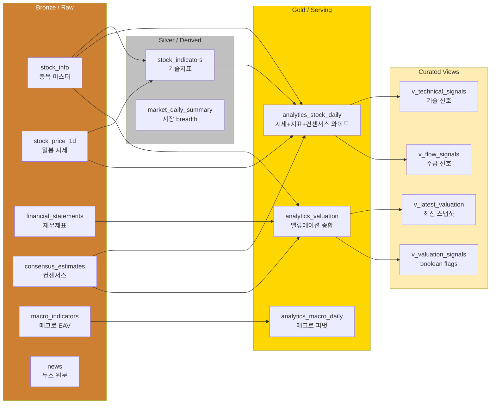
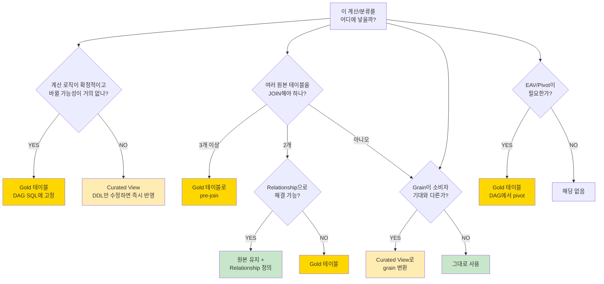
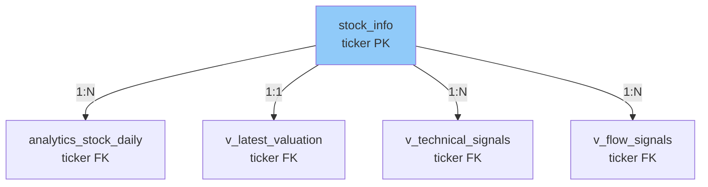
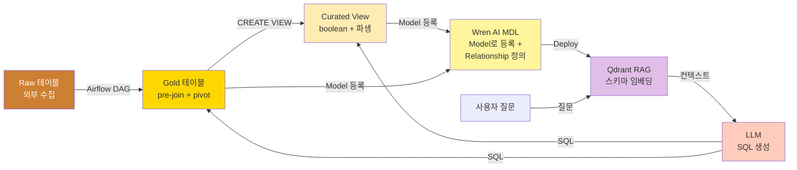
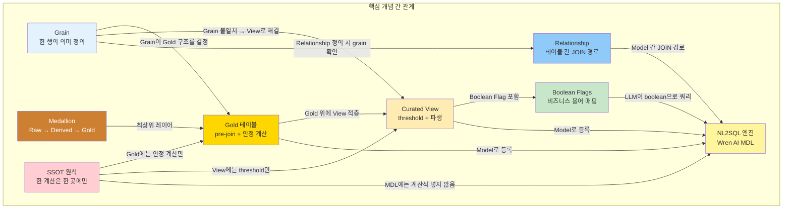
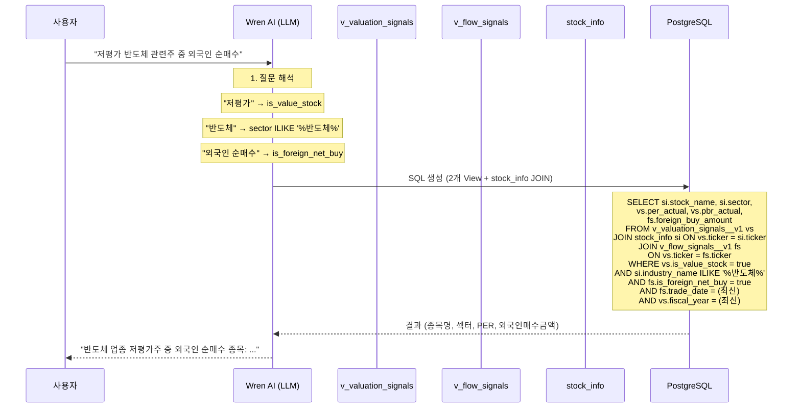
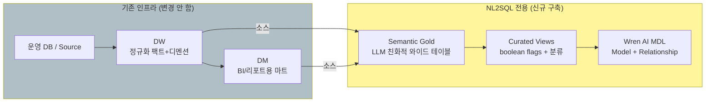

# 데이터 모델링 가이드 — Gold 테이블, Curated View, Grain 설계 원칙

> **작성일:** 2026-04-06
> **대상:** BIP-Pipeline 프로젝트 및 사내 업무 데이터 적용 시 재사용
> **목적:** NL2SQL 시맨틱 레이어를 위한 데이터 모델링의 핵심 개념, 판단 기준, 설계 원칙을 단일 문서로 정리
> **선행 지식:** SQL 기본, 데이터 웨어하우스 개념 (없어도 이 문서로 학습 가능)

---

## 목차

1. [핵심 개념 정의](#1-핵심-개념-정의)
2. [Medallion Architecture — 데이터 레이어 구조](#2-medallion-architecture--데이터-레이어-구조)
3. [Grain — 가장 중요한 설계 결정](#3-grain--가장-중요한-설계-결정)
4. [Gold 테이블 설계](#4-gold-테이블-설계)
5. [Curated View 설계](#5-curated-view-설계)
6. [Gold vs Curated View 판단 기준](#6-gold-vs-curated-view-판단-기준)
7. [Relationship 설계](#7-relationship-설계)
8. [Boolean Flag 설계](#8-boolean-flag-설계)
9. [네이밍 규칙](#9-네이밍-규칙)
10. [NL2SQL 시맨틱 레이어와의 연결](#10-nl2sql-시맨틱-레이어와의-연결)
11. [전체 흐름 — 개념 간 관계](#11-전체-흐름--개념-간-관계)
12. [실전 시나리오 — End-to-End 예시](#12-실전-시나리오--end-to-end-예시)
13. [체크리스트](#13-체크리스트)
14. [안티패턴](#14-안티패턴)
15. [와이드 테이블이란 무엇인가](#15-와이드-테이블이란-무엇인가)
16. [사내 적용 가이드 — 기존 DW/DM이 있는 경우](#16-사내-적용-가이드--기존-dwdm이-있는-경우)

---

## 1. 핵심 개념 정의

### 용어 사전

| 용어 | 정의 | 비유 |
|------|------|------|
| **Grain** | 테이블의 한 행(row)이 무엇을 의미하는지 정의 | "이 테이블의 한 줄은 ○○○이다" |
| **Medallion Architecture** | Raw → Derived → Gold 3단계 데이터 레이어 구조 | 원석 → 연마 → 보석 |
| **Gold 테이블** | 분석/소비용으로 pre-join된 와이드 테이블. Airflow DAG로 주기적 갱신 | 완성된 요리 (재료가 다 합쳐짐) |
| **Curated View** | Gold 위에 threshold 분류/파생 계산을 얹은 PostgreSQL View. DDL만으로 즉시 적용 | 완성된 요리에 소스/토핑 추가 |
| **Boolean Flag** | `is_value_stock`, `is_oversold_rsi` 같은 true/false 분류 컬럼 | "이 종목은 저평가주인가?" YES/NO |
| **Relationship** | 테이블 간 JOIN 경로를 명시적으로 정의 (NL2SQL 엔진이 자동 JOIN에 사용) | 테이블 간 연결 도로 |
| **SSOT** | Single Source of Truth — 하나의 계산은 한 곳에만 존재해야 한다 | 진실은 하나 |
| **Pre-join** | 자주 함께 쓰이는 여러 테이블을 미리 JOIN해서 하나로 합치는 것 | 재료를 미리 섞어둔 밀키트 |
| **EAV** | Entity-Attribute-Value 패턴 — (엔티티, 속성명, 값) 구조 | 설문지 형식 (질문, 답변) |
| **Pivot** | EAV를 컬럼 구조로 변환 (행 → 열 전환) | 설문 답변을 엑셀 열로 펼치기 |
| **Grain 불일치** | JOIN하려는 두 테이블의 grain이 달라서 의미 없는 크로스가 발생 | 일별 매출 × 연별 예산 = 의미 없는 곱 |

---

## 2. Medallion Architecture — 데이터 레이어 구조

### 3단 레이어



### 각 레이어의 역할

| 레이어 | 데이터 상태 | 갱신 방법 | 소비자 |
|--------|----------|---------|--------|
| **Raw (Bronze)** | 외부 소스에서 수집한 원본 그대로 | Airflow DAG (수집) | Derived/Gold DAG |
| **Derived (Silver)** | Raw에서 계산/집계한 중간 결과 | Airflow DAG (변환) | Gold DAG |
| **Gold** | 분석용 pre-joined 와이드 테이블 | Airflow DAG (JOIN + 집계) | Curated View, NL2SQL, BI |
| **Curated View** | Gold 위에 threshold/분류/파생 추가 | DDL (CREATE VIEW) | NL2SQL (Wren AI Model), 에이전트 |

### 왜 이렇게 나누나?

**핵심 이유: NL2SQL 정확도.**

```
LLM에게 10개 테이블 던져주고 "알아서 JOIN해" → ❌ 실패 확률 높음
LLM에게 1~2개 pre-joined 테이블 던져주고 "여기서 찾아" → ✅ 정확도 높음
```

Wren AI 공식 권장도 동일:
> "Build **reporting-ready tables** with pre-joined dimensions and boolean flags.
> LLMs are much more reliable with **explicit columns** than with string parsing and ad-hoc logic."

---

## 3. Grain — 가장 중요한 설계 결정

### 3-1. Grain이란?

**Grain = "이 테이블의 한 행(row)이 무엇을 의미하는가?"**

이것을 먼저 결정하지 않으면, 나머지 설계가 전부 흔들린다.

| 테이블 | Grain | 한 행의 의미 |
|--------|-------|----------|
| `stock_info` | `ticker` | 하나의 종목 |
| `stock_price_1d` | `(ticker, timestamp)` | 특정 종목의 특정 거래일 시세 |
| `analytics_stock_daily` | `(ticker, trade_date)` | 특정 종목의 특정 거래일 시세+지표+컨센서스 |
| `analytics_valuation` | `(ticker, fiscal_year)` | 특정 종목의 특정 회계연도 밸류에이션 |
| `analytics_macro_daily` | `indicator_date` | 특정 날짜의 거시경제 지표 전체 |
| `v_latest_valuation` | `ticker` | 특정 종목의 **최신** 회계연도 밸류에이션 |

### 3-2. Grain 불일치 — 가장 위험한 설계 오류

**문제:** 두 테이블의 grain이 다른데 공통 키로 JOIN하면 의미 없는 크로스가 발생한다.

```sql
-- ❌ 위험: analytics_stock_daily (일별) × analytics_valuation (연별)
-- ticker만으로 JOIN하면 삼성전자 일봉 750행 × 연도 4행 = 3,000행 크로스
SELECT asd.close, av.per_actual
FROM analytics_stock_daily asd
JOIN analytics_valuation av ON asd.ticker = av.ticker
WHERE asd.stock_name ILIKE '%삼성전자%';
-- → "JOIN은 되지만 의미는 틀린" SQL (가장 위험한 유형의 에러)
```

**해결:** Grain을 맞춘 View를 중간에 둔다.

```sql
-- ✅ 안전: v_latest_valuation (1 ticker = 1 row)로 grain 일치
SELECT asd.close, vlv.per_actual
FROM analytics_stock_daily asd
JOIN v_latest_valuation vlv ON asd.ticker = vlv.ticker
WHERE asd.stock_name ILIKE '%삼성전자%';
-- → 삼성전자 일봉 750행 × 최신 밸류에이션 1행 = 750행 (의미 정확)
```

### 3-3. Grain 설계 원칙

```
1. 테이블/View를 만들기 전에 Grain을 먼저 한 문장으로 정의
2. Grain이 다른 테이블 간 직접 JOIN 금지
3. Grain 변환이 필요하면 Curated View로 해결
   - 연별 → 최신 1행: v_latest_valuation 패턴
   - 일별 → 주별 요약: GROUP BY + window 함수
4. Grain을 테이블 COMMENT에 명시
   COMMENT ON TABLE analytics_stock_daily IS 'Grain: (ticker, trade_date)';
5. Relationship 정의 시 양쪽 grain 호환성 확인 필수
```

---

## 4. Gold 테이블 설계

### 4-1. 언제 Gold 테이블을 만드는가?

```
판단 기준:
  ✅ 자주 함께 쓰이는 3개 이상 테이블을 pre-join할 때
  ✅ EAV 구조를 pivot해야 할 때
  ✅ 변경 가능성 낮은 안정적 계산값을 고정할 때
  ✅ Airflow DAG로 주기적 갱신이 자연스러운 경우
```

### 4-2. Gold 테이블 설계 원칙

**원칙 1: Grain을 먼저 결정**
```
"이 Gold 테이블의 한 행은 ○○○이다"를 가장 먼저 쓴다.
```

**원칙 2: 소비자 질문 기반으로 컬럼 선택**
```
"사용자가 가장 자주 묻는 질문에 답하려면 어떤 컬럼이 한 행에 있어야 하나?"
→ 그 컬럼들을 한 테이블에 pre-join
```

**원칙 3: 안정적 계산만 포함**
```
✅ Gold에 넣을 것: per_actual, roe_actual, golden_cross
   → 계산 로직이 확정적, 기준이 안 바뀜

❌ Gold에 넣지 말 것: is_value_stock, is_oversold_rsi
   → threshold(PER<10)가 바뀔 수 있음 → Curated View
```

**원칙 4: EAV는 반드시 Pivot**
```
❌ macro_indicators (type='VIX', date, value=25.3) → NL2SQL이 매우 어려워함
✅ analytics_macro_daily (date, vix=25.3, usd_krw=1350) → 컬럼으로 펼침
```

### 4-3. BIP 예시

```sql
-- analytics_stock_daily: 시세 + 지표 + 컨센서스 pre-join
-- Grain: (ticker, trade_date)
-- 원본: stock_price_1d + stock_indicators + consensus_estimates + stock_info

INSERT INTO analytics_stock_daily
SELECT
    si.ticker, sp.trade_date, si.stock_name, si.market_type,
    sp.open, sp.high, sp.low, sp.close, sp.volume,
    ind.rsi14, ind.macd, ind.golden_cross,
    ce.target_price, ce.analyst_rating
FROM stock_price_1d sp
JOIN stock_info si ON sp.ticker = si.ticker
LEFT JOIN stock_indicators ind ON sp.ticker = ind.ticker AND sp.trade_date = ind.trade_date
LEFT JOIN consensus_estimates ce ON sp.ticker = ce.ticker;
```

---

## 5. Curated View 설계

### 5-1. 언제 Curated View를 만드는가?

```
판단 기준:
  ✅ Threshold가 바뀔 수 있는 분류 (is_value_stock)
  ✅ Grain 변환이 필요한 스냅샷 (연별 → 최신 1행)
  ✅ 금액 환산/비율 같은 단순 파생 계산
  ✅ DAG 없이 DDL만으로 즉시 적용하고 싶을 때
  ✅ 용어집(Glossary) 용어를 DB 컬럼으로 매핑할 때
```

### 5-2. Curated View 설계 원칙

**원칙 1: Gold 위에만 만든다**
```
Curated View는 항상 Gold 테이블을 소스로 사용.
Raw/Derived 테이블을 직접 참조하지 않는다.
→ 데이터 품질이 Gold 레벨에서 보장된 상태에서 추가 계산
```

**원칙 2: 계산 SSOT**
```
같은 계산이 Gold와 View 양쪽에 있으면 SSOT 위반.
→ Gold에 안정적 base metrics (per_actual, golden_cross)
→ View에 threshold 분류 (is_value_stock)
→ 절대 중복하지 않는다
```

**원칙 3: Boolean Flag로 비즈니스 용어 매핑**
```
OM Glossary: "저평가주" → View: is_value_stock (PER<10 AND PBR<1)
사용자 질문: "저평가주 보여줘" → LLM: WHERE is_value_stock = true
→ LLM이 PER<10 계산을 매번 추론하는 대신 boolean 컬럼만 참조
```

**원칙 4: Grain 변환은 View에서**
```
원본 (analytics_valuation): (ticker, fiscal_year) → 종목당 여러 행
View (v_latest_valuation): (ticker) → 종목당 1행 (최신 연도만)
→ 다른 일별 테이블과 안전하게 JOIN 가능
```

### 5-3. BIP 예시

```sql
-- Grain 변환 View
CREATE VIEW v_latest_valuation AS
SELECT av.*
FROM analytics_valuation av
INNER JOIN (
    SELECT ticker, MAX(fiscal_year) AS max_year
    FROM analytics_valuation
    GROUP BY ticker
) latest ON av.ticker = latest.ticker AND av.fiscal_year = latest.max_year;
-- Grain: (ticker) — 1 ticker = 1 row

-- Boolean Flag View
CREATE VIEW v_valuation_signals__v1 AS
SELECT
    ticker, stock_name, per_actual, pbr_actual, roe_actual,
    (per_actual > 0 AND per_actual < 10 AND pbr_actual < 1) AS is_value_stock,
    (revenue_growth > 20 AND operating_margin > 10) AS is_growth_stock
FROM analytics_valuation;

-- 파생 계산 View
CREATE VIEW v_technical_signals__v1 AS
SELECT
    ticker, trade_date, close, rsi14,
    (rsi14 IS NOT NULL AND rsi14 < 30) AS is_oversold_rsi,
    ROUND(((close - ma20) * 100.0 / NULLIF(ma20, 0))::numeric, 2) AS disparity_20d,
    close * volume AS trading_value
FROM analytics_stock_daily;
```

---

## 6. Gold vs Curated View 판단 기준

### 6-1. 판단 플로우차트



### 6-2. 한눈에 비교

| 기준 | Gold 테이블 | Curated View |
|------|:-----------:|:------------:|
| **변경 시 영향** | DAG 수정 + backfill | DDL 한 줄 수정 |
| **갱신 방법** | Airflow DAG (스케줄) | `CREATE OR REPLACE VIEW` |
| **계산 안정성** | ✅ 확정적 (per_actual, golden_cross) | ⚠️ 변동 가능 (is_value_stock) |
| **JOIN 처리** | ✅ pre-join (3+ 테이블) | ❌ JOIN 안 함 (Gold 위에 가공) |
| **EAV pivot** | ✅ 여기서 처리 | ❌ 안 함 |
| **Grain 변환** | ❌ 원본 grain 유지 | ✅ 여기서 변환 (연별→최신) |
| **Boolean flags** | 이벤트성만 (golden_cross) | ✅ threshold 분류 |
| **디스크 사용** | ✅ 물리적 저장 | ❌ 쿼리 시 계산 |
| **배포 속도** | 느림 (DAG 실행 필요) | 즉시 (DDL만) |
| **다른 소비자** | 모든 소비자 사용 가능 | 모든 소비자 사용 가능 |

### 6-3. 실제 판단 예시

| 계산/분류 | Gold? View? | 이유 |
|---------|:-----------:|------|
| PER = 시총 ÷ 순이익 | **Gold** | 계산 확정적, 변경 안 됨 |
| ROE = 순이익 ÷ 자본총계 | **Gold** | 계산 확정적 |
| Golden Cross (MA5 > MA20 전환) | **Gold** | 이벤트성 flag, 로직 확정 |
| is_value_stock (PER<10 AND PBR<1) | **View** | threshold가 바뀔 수 있음 |
| is_oversold_rsi (RSI<30) | **View** | 30 → 25로 기준 변경 가능 |
| trading_value (close × volume) | **View** | 단순 산술, 어디든 OK |
| disparity_20d (이격도) | **View** | 기준 MA가 바뀔 수 있음 |
| 최신 연도 밸류에이션 스냅샷 | **View** | grain 변환 (연별→최신 1행) |
| 매크로 EAV → 피벗 | **Gold** | EAV는 반드시 pivot해서 Gold로 |
| 외국인 순매수 금액 | **View** | volume × close 단순 환산 |

---

## 7. Relationship 설계

### 7-1. 개념

Relationship = 테이블 간 JOIN 경로를 **명시적으로** 정의하는 것.

NL2SQL 엔진(Wren AI)이 SQL을 생성할 때 "이 두 테이블은 이 컬럼으로 JOIN해"라고 알려주는 역할.

### 7-2. 설계 원칙

**원칙 1: Hub-and-Spoke 패턴**

마스터 테이블(예: `stock_info`)을 중심(Hub)으로 다른 테이블(Spoke)을 연결.



**원칙 2: Grain 호환성 확인**

JOIN하려는 두 테이블의 grain이 호환되는지 반드시 확인:

```
✅ 호환: stock_info (ticker) ↔ v_latest_valuation (ticker) — 1:1
✅ 호환: stock_info (ticker) ↔ analytics_stock_daily (ticker, trade_date) — 1:N
❌ 불일치: analytics_stock_daily (ticker, trade_date) ↔ analytics_valuation (ticker, fiscal_year)
   → 해결: v_latest_valuation (ticker) 를 중간에 둬서 grain 일치
```

**원칙 3: 2개 모델 간만 정의**

Wren AI 제약: 하나의 Relationship은 2개 모델 사이만 연결 가능. 3-way 관계는 불가.

```
❌ A ↔ B ↔ C (하나의 Relationship으로 불가)
✅ A ↔ B + B ↔ C (두 개의 Relationship으로 분리)
```

**원칙 4: JOIN 타입 명시**

| 타입 | 의미 | 예시 |
|------|------|------|
| `ONE_TO_ONE` | 1:1 | stock_info ↔ v_latest_valuation |
| `ONE_TO_MANY` | 1:N | stock_info ↔ analytics_stock_daily |
| `MANY_TO_ONE` | N:1 | analytics_stock_daily ↔ v_latest_valuation |
| `MANY_TO_MANY` | N:M | 가능하면 피할 것 (집계 필수) |

### 7-3. BIP 예시

| Relationship | From | To | Type | 근거 |
|---|---|---|---|---|
| stock_info → analytics_stock_daily | ticker | ticker | ONE_TO_MANY | 종목 1개에 일봉 여러 개 |
| stock_info → v_latest_valuation | ticker | ticker | ONE_TO_ONE | 종목 1개에 최신 밸류에이션 1행 |
| analytics_stock_daily → v_latest_valuation | ticker | ticker | MANY_TO_ONE | 일봉 여러 행이 최신 밸류에이션 1행과 연결 |

---

## 8. Boolean Flag 설계

### 8-1. 개념

Boolean Flag = 복잡한 비즈니스 규칙을 `true/false` 한 컬럼으로 단순화.

```
비즈니스 규칙: "PER이 10 미만이고 PBR이 1 미만인 종목을 저평가주라고 한다"
→ Boolean Flag: is_value_stock = (per_actual > 0 AND per_actual < 10 AND pbr_actual < 1)
→ NL2SQL: WHERE is_value_stock = true (LLM이 PER/PBR 조건을 매번 추론할 필요 없음)
```

### 8-2. 설계 원칙

```
1. 이름: is_<상태> 형식 (is_value_stock, is_oversold_rsi)
2. 타입: BOOLEAN (true/false, NULL 허용)
3. 기준: View SQL COMMENT에 명시
   COMMENT ON VIEW v_valuation_signals__v1 IS 'is_value_stock: PER<10 AND PBR<1';
4. 위치: Curated View (threshold가 바뀔 수 있으므로)
5. NULL 처리: 원본 데이터가 NULL이면 boolean도 NULL (false로 강제 X)
6. 용어집 매핑: OM Glossary term과 1:1 연결
   → "저평가주" (Glossary) = is_value_stock (View column)
```

### 8-3. 왜 Boolean Flag가 NL2SQL에 중요한가?

```
Boolean Flag 없을 때:
  사용자: "저평가주 보여줘"
  LLM이 해야 할 일: "저평가주가 뭐지? PER이 낮으면? 얼마나? PBR도 봐야 하나?"
  → WHERE per_actual < ??? AND pbr_actual < ??? (추측 → 오류 확률 높음)

Boolean Flag 있을 때:
  사용자: "저평가주 보여줘"
  LLM: "is_value_stock 컬럼이 있네"
  → WHERE is_value_stock = true (정확)
```

Wren AI 공식 권장:
> "Pre-computed boolean flags. LLMs are much more reliable with **explicit columns**
> than with string parsing and ad-hoc logic."

### 8-4. BIP 예시

| Boolean Flag | 기준 | 위치 | 용어집 매핑 |
|---|---|---|---|
| `is_value_stock` | PER>0 AND PER<10 AND PBR<1 | v_valuation_signals__v1 | 저평가주 |
| `is_value_growth` | PER>0 AND PER<10 AND ROE>15 | v_valuation_signals__v1 | 저PER고ROE |
| `is_growth_stock` | 매출성장>20% AND 영업이익률>10% | v_valuation_signals__v1 | 성장주 |
| `is_deep_value` | PER>0 AND PER<5 | v_valuation_signals__v1 | 초저평가 |
| `is_high_debt` | 부채비율>200% | v_valuation_signals__v1 | 고부채 |
| `is_high_roe` | ROE>20% | v_valuation_signals__v1 | 고ROE |
| `is_oversold_rsi` | RSI<30 | v_technical_signals__v1 | 과매도 |
| `is_overbought_rsi` | RSI>70 | v_technical_signals__v1 | 과매수 |
| `is_below_bollinger` | 종가<BB하단 | v_technical_signals__v1 | 볼린저이탈 |
| `is_volume_spike` | 거래량비율>3x | v_technical_signals__v1 | 거래량급증 |
| `is_near_52w_low` | 52주고점대비 -30% 이상 | v_technical_signals__v1 | 52주저점근접 |
| `is_foreign_net_buy` | 외국인 순매수>0 | v_flow_signals__v1 | 외국인순매수 |
| `is_institution_net_buy` | 기관 순매수>0 | v_flow_signals__v1 | 기관순매수 |

---

## 9. 네이밍 규칙

### 9-1. 테이블/View

| 유형 | 패턴 | 예시 |
|------|------|------|
| Gold 테이블 | `analytics_<domain>_<grain>` | `analytics_stock_daily`, `analytics_macro_daily` |
| Curated View | `v_<domain>_<purpose>__v<version>` | `v_valuation_signals__v1`, `v_latest_valuation` |
| Raw 테이블 | `<entity>_<detail>` | `stock_price_1d`, `financial_statements` |
| Derived 테이블 | `<entity>_<calculation>` | `stock_indicators`, `market_daily_summary` |

### 9-2. 컬럼

| 유형 | 패턴 | 예시 |
|------|------|------|
| Boolean flag | `is_<condition>` | `is_value_stock`, `is_oversold_rsi` |
| 금액 환산 | `<원본>_amount` 또는 `<원본>_krw` | `foreign_buy_amount`, `market_value_krw` |
| 비율/이격도 | `<지표>_pct` 또는 `<지표>_ratio` | `disparity_20d`, `foreign_ratio_pct` |
| 원본에서 온 실적 | `<지표>_actual` | `per_actual`, `roe_actual` |
| 컨센서스 추정 | `est_<지표>` | `est_per`, `est_eps` |

### 9-3. 버전 관리

```
v_valuation_signals__v1  ← 현재
v_valuation_signals__v2  ← is_value_stock 기준이 PER<12로 변경될 때 새 버전

- v1은 유지 (기존 소비자 호환)
- v2 생성 후 Wren AI 모델을 v2로 전환
- 이행 기간 후 v1 제거
```

---

## 10. NL2SQL 시맨틱 레이어와의 연결

### 10-1. 전체 데이터 → NL2SQL 흐름



### 10-2. 각 단계의 SSOT 역할

| 단계 | SSOT 역할 | 위반 시 |
|------|---------|--------|
| **Gold** | 안정적 base metrics의 계산 원천 | 다른 곳에 같은 계산 있으면 불일치 |
| **Curated View** | Threshold 분류 / 파생 계산의 유일한 정의 | View 외에 boolean 계산 중복 금지 |
| **Wren AI MDL** | Relationship / alias / description shell | 계산식을 MDL에 넣으면 SSOT 위반 |
| **OM description** | 설명 텍스트 원천 | 계산식을 description에만 넣으면 View와 충돌 |

### 10-3. Wren AI에 등록할 때 원칙

```
✅ PostgreSQL Curated View → Wren AI Model로 등록 (Relationship 지원)
❌ Wren AI UI View로 등록 (Relationship 미지원)
❌ Wren AI MDL에 계산식 직접 작성 (SSOT 위반)

Wren AI Model로 등록한 View에 description 추가:
  → OM에서 sync (om_sync_wrenai.py)
  → 계산 로직 자체는 View SQL에만 존재
  → description에는 "is_value_stock: PER<10 AND PBR<1" 형태로 "설명"만
```

---

## 11. 전체 흐름 — 개념 간 관계



### 한 문단 요약

> **Grain**이 모든 설계의 출발점이다. Grain이 Gold 테이블의 구조를 결정하고, Grain 불일치가 Curated View의 존재 이유이며, Grain 호환성이 Relationship의 안전성을 좌우한다. Gold에는 안정적 base metrics를, View에는 변동 가능한 threshold 분류를 두어 **SSOT**를 지킨다. Boolean Flag는 비즈니스 용어를 DB 컬럼으로 변환하여 LLM의 추론 부담을 줄인다. 이 모든 것이 Wren AI MDL에 Model + Relationship으로 등록되어 NL2SQL의 시맨틱 레이어를 구성한다.

---

## 12. 실전 시나리오 — End-to-End 예시

### 시나리오 1: E-Commerce — "VIP 고객의 반품률이 높은 상품"

#### Step 1. Raw 테이블 파악

```
orders         (order_id, customer_id, order_date, total_amount, status)
order_items    (item_id, order_id, product_id, quantity, unit_price)
customers      (customer_id, name, email, signup_date, tier)
products       (product_id, name, category, brand)
returns        (return_id, order_id, product_id, reason, return_date)
```

#### Step 2. Grain 설계

| 필요한 Gold 테이블 | Grain | 한 행의 의미 |
|---|---|---|
| `gold_order_summary` | `(customer_id, order_date)` | 특정 고객의 특정 날짜 주문 요약 |
| `gold_product_daily` | `(product_id, sale_date)` | 특정 상품의 특정 날짜 판매/반품 집계 |

#### Step 3. Gold 테이블 (pre-join)

```sql
CREATE TABLE gold_order_summary AS
SELECT
    o.order_id,
    o.customer_id,
    c.name AS customer_name,
    c.tier AS customer_tier,
    o.order_date,
    o.total_amount,
    o.status,
    COUNT(oi.item_id) AS item_count,
    -- 안정적 계산 (Gold에 고정)
    SUM(oi.quantity * oi.unit_price) AS gross_amount,
    COALESCE(r.return_count, 0) AS return_count
FROM orders o
JOIN customers c ON o.customer_id = c.customer_id
JOIN order_items oi ON o.order_id = oi.order_id
LEFT JOIN (
    SELECT order_id, COUNT(*) AS return_count
    FROM returns GROUP BY order_id
) r ON o.order_id = r.order_id
GROUP BY o.order_id, o.customer_id, c.name, c.tier, o.order_date, o.total_amount, o.status, r.return_count;

-- Grain: (order_id) — 주문 1건 = 1행
```

#### Step 4. Curated View (threshold 분류)

```sql
CREATE VIEW v_order_signals__v1 AS
SELECT
    *,
    -- Boolean Flags (기준이 바뀔 수 있으므로 View에)
    (customer_tier = 'VIP')                    AS is_vip_customer,
    (return_count > 0)                         AS is_returned_order,
    (total_amount > 100000)                    AS is_high_value_order,
    (return_count::decimal / NULLIF(item_count, 0) > 0.3)
                                               AS is_high_return_rate,
    -- 파생 계산
    ROUND(return_count::decimal * 100 / NULLIF(item_count, 0), 1)
                                               AS return_rate_pct
FROM gold_order_summary;

COMMENT ON VIEW v_order_signals__v1 IS
    'is_vip_customer: tier=VIP. '
    'is_returned_order: 반품 1건 이상. '
    'is_high_return_rate: 반품률>30%.';
```

#### Step 5. NL2SQL 질문 → SQL 흐름

```
사용자: "VIP 고객의 반품률이 높은 상품 보여줘"

LLM이 보는 것:
  - v_order_signals__v1 (Model로 등록)
  - is_vip_customer: true/false
  - is_high_return_rate: true/false

생성되는 SQL:
  SELECT product_name, COUNT(*) AS order_count, AVG(return_rate_pct) AS avg_return_rate
  FROM v_order_signals__v1
  WHERE is_vip_customer = true AND is_high_return_rate = true
  GROUP BY product_name
  ORDER BY avg_return_rate DESC;

→ Boolean Flag 덕분에 LLM이 VIP 기준/반품률 threshold를 추측할 필요 없음
```

---

### 시나리오 2: HR — "부서별 고성과자 이탈 위험"

#### Step 1. Raw 테이블

```
employees      (emp_id, name, dept_id, hire_date, salary, performance_score)
departments    (dept_id, dept_name, manager_id)
attendance     (emp_id, date, status, hours_worked)
salary_history (emp_id, effective_date, old_salary, new_salary)
```

#### Step 2. Grain 설계 — 사고 과정

```
질문: "부서별 고성과자 이탈 위험"을 답하려면?

필요한 정보:
  - 직원의 부서 → employees + departments JOIN
  - 고성과자 판단 → performance_score threshold
  - 이탈 위험 → 급여인상률 낮음? 출근율 낮음? 재직 기간?

Grain 결정:
  "한 행 = 특정 직원의 현재 스냅샷" → (emp_id)
  → 시계열이 아니라 최신 상태 스냅샷
```

#### Step 3. Gold 테이블

```sql
CREATE TABLE gold_employee_snapshot AS
SELECT
    e.emp_id,
    e.name,
    d.dept_name,
    e.hire_date,
    e.salary,
    e.performance_score,
    -- 안정적 계산
    EXTRACT(YEAR FROM AGE(CURRENT_DATE, e.hire_date)) AS tenure_years,
    COALESCE(sh.last_raise_pct, 0) AS last_raise_pct,
    COALESCE(att.avg_hours, 0) AS avg_daily_hours,
    COALESCE(att.absence_days, 0) AS absence_days_30d
FROM employees e
JOIN departments d ON e.dept_id = d.dept_id
LEFT JOIN (
    SELECT emp_id,
           ROUND((new_salary - old_salary) * 100.0 / old_salary, 1) AS last_raise_pct
    FROM salary_history
    WHERE effective_date = (SELECT MAX(effective_date) FROM salary_history sh2 WHERE sh2.emp_id = salary_history.emp_id)
) sh ON e.emp_id = sh.emp_id
LEFT JOIN (
    SELECT emp_id,
           AVG(hours_worked) AS avg_hours,
           COUNT(*) FILTER (WHERE status = 'absent') AS absence_days_30d
    FROM attendance
    WHERE date >= CURRENT_DATE - INTERVAL '30 days'
    GROUP BY emp_id
) att ON e.emp_id = att.emp_id;

-- Grain: (emp_id) — 직원 1명 = 1행
```

#### Step 4. Curated View

```sql
CREATE VIEW v_employee_signals__v1 AS
SELECT
    *,
    -- Boolean Flags
    (performance_score >= 4.0)                 AS is_high_performer,
    (last_raise_pct < 3.0 AND tenure_years > 2) AS is_underpaid_risk,
    (absence_days_30d > 5)                     AS is_attendance_risk,
    (is_high_performer AND (is_underpaid_risk OR is_attendance_risk))
                                               AS is_attrition_risk
FROM gold_employee_snapshot;
-- ⚠️ 위 SQL은 참조용. 실제로는 서브쿼리로 boolean을 재계산해야 함:

CREATE VIEW v_employee_signals__v1 AS
SELECT
    *,
    (performance_score >= 4.0) AS is_high_performer,
    (last_raise_pct < 3.0 AND tenure_years > 2) AS is_underpaid_risk,
    (absence_days_30d > 5) AS is_attendance_risk,
    (performance_score >= 4.0
     AND (last_raise_pct < 3.0 AND tenure_years > 2
          OR absence_days_30d > 5))
                               AS is_attrition_risk
FROM gold_employee_snapshot;

COMMENT ON VIEW v_employee_signals__v1 IS
    'is_high_performer: 성과점수>=4.0. '
    'is_underpaid_risk: 인상률<3% AND 재직>2년. '
    'is_attrition_risk: 고성과자 AND (저인상 OR 출근불량).';
```

#### Step 5. NL2SQL 질문 → SQL 흐름

```
사용자: "부서별 고성과자 이탈 위험 인원수"

LLM:
  SELECT dept_name, COUNT(*) AS attrition_risk_count
  FROM v_employee_signals__v1
  WHERE is_attrition_risk = true
  GROUP BY dept_name
  ORDER BY attrition_risk_count DESC;

→ 복잡한 조건(고성과 AND (저인상 OR 출근불량))을 LLM이 추론하지 않고
  is_attrition_risk = true 하나로 해결
```

---

### 시나리오 3: BIP — "저평가 반도체 관련주 중 외국인 순매수" (End-to-End)

#### 전체 흐름



#### 왜 이 구조가 작동하는가

```
Boolean Flags가 없었다면:
  LLM이 추론해야 할 것:
    "저평가 = PER이 몇 이하? PBR도 봐야 하나? 기준은?"  → 매번 달라짐
    "외국인 순매수 = foreign_buy_volume > 0? 아니면 금액 기준?"  → 모호

Boolean Flags가 있으면:
  LLM이 하는 것:
    "is_value_stock = true"  → 기준 확정
    "is_foreign_net_buy = true"  → 기준 확정
    나머지는 sector 필터만  → 단순
```

#### Grain 관점 분석

```
v_valuation_signals__v1:  Grain = (ticker, fiscal_year) — 종목×연도
v_flow_signals__v1:       Grain = (ticker, trade_date)  — 종목×거래일
stock_info:               Grain = (ticker)              — 종목

이 3개를 JOIN하려면?
  → v_valuation_signals에서 최신 fiscal_year만 필터 (WHERE 조건)
  → v_flow_signals에서 최신 trade_date만 필터 (WHERE 조건)
  → ticker로 JOIN하면 grain이 맞아짐

또는 v_latest_valuation (1 ticker = 1 row)을 쓰면 더 안전:
  → v_latest_valuation JOIN v_flow_signals ON ticker
     WHERE fs.trade_date = (최신)
```

---

### 시나리오 4: 물류 — "지연 배송이 잦은 창고의 재고 회전율"

#### 빠른 설계 스케치

```
Raw:
  warehouses     (warehouse_id, name, region)
  shipments      (shipment_id, warehouse_id, order_id, ship_date, delivery_date, status)
  inventory      (warehouse_id, product_id, date, quantity_on_hand, quantity_sold)

Grain 결정:
  "한 행 = 특정 창고의 특정 월 성과" → (warehouse_id, month)

Gold:
  gold_warehouse_monthly
    warehouse_id, month, warehouse_name, region,
    total_shipments, delayed_shipments, avg_delivery_days,
    avg_inventory, total_sold, inventory_turnover

Curated View:
  v_warehouse_signals__v1
    is_high_delay_rate     (지연율 > 10%)
    is_low_turnover        (재고회전율 < 2)
    is_problem_warehouse   (지연 AND 저회전)

NL2SQL:
  "지연 배송이 잦은 창고의 재고 회전율"
  → WHERE is_high_delay_rate = true
  → SELECT warehouse_name, inventory_turnover
```

---

### 시나리오 비교 — 공통 패턴

| 단계 | E-Commerce | HR | BIP (투자) | 물류 |
|------|-----------|-----|---------|------|
| **Hub 테이블** | customers | employees | stock_info | warehouses |
| **Grain** | order_id | emp_id | (ticker, date) | (warehouse_id, month) |
| **Gold pre-join** | 주문+고객+상품+반품 | 직원+부서+급여+출근 | 시세+지표+컨센서스 | 출하+재고 |
| **Boolean 예시** | is_vip, is_returned | is_high_performer, is_attrition_risk | is_value_stock, is_oversold | is_high_delay, is_low_turnover |
| **핵심 효과** | LLM이 VIP/반품 기준 추론 불필요 | LLM이 이탈위험 조건 추론 불필요 | LLM이 저평가/과매도 기준 추론 불필요 | LLM이 지연/회전율 기준 추론 불필요 |

**도메인이 달라도 패턴은 동일:**

```
1. Raw 파악 → 2. Grain 결정 → 3. Gold pre-join → 4. View boolean flags
→ 5. Wren AI Model + Relationship → 6. NL2SQL에서 boolean으로 단순 쿼리
```

---

## 13. 체크리스트

### 신규 Gold 테이블 생성 시

```
□ Grain을 한 문장으로 정의했는가? (COMMENT에 명시)
□ pre-join할 원본 테이블 3개 이상인가? (아니면 Relationship으로 충분)
□ EAV → pivot이 필요한가?
□ 안정적 계산만 포함했는가? (threshold 분류는 View로 분리)
□ Airflow DAG를 작성했는가? (스케줄, lineage 등록)
□ Wren AI에 Model로 등록했는가?
□ Relationship을 정의했는가? (Hub 테이블과 연결)
□ OM에 description을 등록했는가?
```

### 신규 Curated View 생성 시

```
□ Gold 테이블 위에 만들었는가? (Raw 직접 참조 X)
□ Grain 변환이 필요한가? (v_latest_valuation 패턴)
□ Boolean flag의 기준을 COMMENT에 명시했는가?
□ 같은 계산이 Gold에 이미 있지 않은가? (SSOT 위반 체크)
□ 네이밍 규칙을 따랐는가? (v_<domain>_<purpose>__v<N>)
□ nl2sql_exec에 GRANT SELECT 했는가?
□ Wren AI에 Model로 등록했는가? (View 아님!)
□ Relationship을 정의했는가? (Grain 호환성 확인)
□ OM에 description을 등록했는가?
```

### Relationship 추가 시

```
□ 양쪽 테이블의 Grain이 호환되는가?
□ Grain 불일치면 중간 View(v_latest_*)를 만들었는가?
□ JOIN 타입(1:1, 1:N, N:1)을 정확히 지정했는가?
□ Hub-and-Spoke 패턴을 따르는가?
□ 2개 모델 간 연결인가? (3-way 불가)
```

---

## 14. 안티패턴

### ❌ 안티패턴 1: Grain 무시 JOIN

```sql
-- 일별(daily) × 연별(annual) 직접 JOIN
SELECT * FROM analytics_stock_daily asd
JOIN analytics_valuation av ON asd.ticker = av.ticker;
-- → 삼성전자 750일 × 4연도 = 3,000행 크로스 (의미 없음)
```

**해결:** `v_latest_valuation` (1 ticker = 1 row)로 grain 일치 후 JOIN.

### ❌ 안티패턴 2: 계산 SSOT 중복

```
Gold에: net_margin = net_income / revenue * 100
View에: net_margin_pct = net_income * 100.0 / revenue

→ 같은 계산이 두 곳에 → 하나를 바꾸면 불일치 발생
```

**해결:** 한 곳에만 정의. 안정적이면 Gold, threshold면 View.

### ❌ 안티패턴 3: EAV를 NL2SQL에 직접 노출

```sql
-- macro_indicators (EAV) 직접 노출
-- LLM이 WHERE indicator_type = 'VIX' 조건을 매번 추론해야 함
SELECT value FROM macro_indicators WHERE indicator_type = 'VIX' AND ...;

-- → LLM이 indicator_type 값 목록을 알아야 하고, 오타/대소문자 틀릴 수 있음
```

**해결:** Gold에서 pivot하여 `analytics_macro_daily.vix` 컬럼으로 제공.

### ❌ 안티패턴 4: Boolean Flag 대신 LLM 계산 의존

```
사용자: "저평가주 보여줘"
LLM: WHERE per < 10 AND pbr < 1  (이번엔 맞음)

사용자: "저평가 종목"
LLM: WHERE per < 15  (기준이 바뀜! 일관성 없음)
```

**해결:** `is_value_stock` boolean flag로 기준 고정. LLM은 WHERE is_value_stock = true만.

### ❌ 안티패턴 5: PostgreSQL View를 Wren AI View로 등록

```
PostgreSQL View를 Wren AI의 UI "View" 기능에 등록
→ Relationship 정의 불가
→ Calculated Fields 불가
→ 시맨틱 모델링 능력 손실
```

**해결:** PostgreSQL View는 항상 Wren AI **Model**로 등록.

---

---

## 15. 와이드 테이블이란 무엇인가

### 15-1. 정의

**와이드 테이블 = "자주 함께 질문되는 컬럼들을 같은 Grain으로 한 테이블에 모은 것"**

"컬럼을 다 때려넣는다"가 아니라, **Grain이 같고 자주 같이 쓰이는 데이터**만 합친다.

### 15-2. 와이드 vs 정규화 비교

**정규화 (Star Schema, BI 전통):**

```
질문: "삼성전자의 오늘 종가와 RSI"

→ 3개 테이블 JOIN 필요:
  stock_info (종목명)
  + stock_price_1d (종가)
  + stock_indicators (RSI)

→ LLM이 3-way JOIN SQL을 생성해야 함 → 실패 확률 높음
```

**와이드 (Gold 테이블):**

```
같은 질문:

→ analytics_stock_daily 1개 테이블에서 조회:
  SELECT stock_name, close, rsi14 FROM analytics_stock_daily
  WHERE stock_name ILIKE '%삼성전자%'
  ORDER BY trade_date DESC LIMIT 1

→ JOIN 없음 → LLM이 쉽게 생성 → 정확도 높음
```

### 15-3. 와이드 테이블의 올바른 기준

```
✅ 올바른 와이드:
  같은 Grain (ticker, trade_date)에 해당하는 컬럼만 합침
  → 시세 + 기술지표 + 컨센서스 = analytics_stock_daily
  → 한 행 = "특정 종목의 특정 거래일에 대한 모든 정보"

❌ 잘못된 와이드:
  Grain이 다른 데이터를 억지로 합침
  → 일봉(일별) + 재무제표(연별) + 뉴스(기사별) = ???
  → 한 행이 무엇을 의미하는지 불명확 → 크로스조인 발생
```

### 15-4. 와이드 판단 기준

```
이 질문에 대해:
  "매번 3개 이상 테이블을 JOIN해야 하나?"
    → YES → 와이드 테이블 후보
    → NO (1-2개면 충분) → Relationship으로 해결

합칠 테이블의 Grain이 같은가?
    → YES → 와이드로 합칠 수 있음
    → NO → 합치면 안 됨 (Grain 변환 View로 해결)
```

### 15-5. BI 도구 vs LLM의 선호 구조

| 관점 | BI 도구 (Tableau, Power BI) | LLM (NL2SQL) |
|------|---|---|
| **선호 구조** | **스타 스키마** (팩트 + 디멘션 분리) | **와이드 테이블** (pre-join) |
| **조인 처리** | 사람이 모델링 시점에 정의 | LLM이 매 질문마다 추론 |
| **컬럼 수** | 적어도 OK (디멘션 따로) | **많아도 OK** (한 테이블에 다 있으면 유리) |
| **코드값** | lookup 테이블로 해석 | **명칭이 직접 있어야** (JOIN 줄이기) |
| **집계** | DAX/LOD 수식 | **pre-compute 해서 컬럼으로** |
| **복잡한 계산** | 사용자가 수식 작성 | **boolean flag로 단순화** |

**핵심:** BI 도구는 "사람이 구조를 이해하고 조합"하지만, LLM은 **"보이는 그대로 사용"**한다. 그래서 LLM에게는 이미 합쳐진 와이드 테이블이 훨씬 유리하다.

### 15-6. 와이드가 과하면?

컬럼이 100개 이상이면 LLM이 **적절한 컬럼을 선택하는 것** 자체가 어려워진다. 이때는:

```
1. 도메인별로 와이드 테이블을 분리 (analytics_stock_daily vs analytics_macro_daily)
2. Wren AI의 column description을 충실히 작성
3. 자주 안 쓰이는 컬럼은 별도 테이블/View로 분리
4. Wren AI 프로젝트를 도메인별로 나누기
```

**목표: 한 와이드 테이블당 20-50개 컬럼이 적정.** 넘으면 분리 검토.

---

## 16. 사내 적용 가이드 — 기존 DW/DM이 있는 경우

### 16-1. 핵심 원칙

> **기존 DW/DM은 건드리지 않는다.**
> 그 위에 "LLM이 읽기 좋은 형태의 Semantic Gold + Curated View"를 **별도로 구축**한다.
> 이것이 "NL2SQL을 위한 시맨틱 마트"를 만드는 것이다.

기존 BI용 DM을 그대로 NL2SQL에 쓰면 **BI 도구와 LLM의 데이터 소비 방식 차이** 때문에 정확도가 낮다.



### 16-2. 기존 DM 진단 — "그대로 Gold로 쓸 수 있는가?"

각 DM에 대해 다음을 체크:

| # | 진단 항목 | YES면 | NO면 |
|---|---------|-------|------|
| 1 | **Grain이 명확한가?** (한 행 = 하나의 비즈니스 단위) | ✅ 그대로 사용 가능 | Grain 재정의 필요 |
| 2 | **컬럼명이 비즈니스 의미를 담는가?** (dept_name vs dept_cd) | ✅ | 명칭 JOIN 필요 |
| 3 | **자주 함께 쓰이는 디멘션이 이미 포함되었는가?** | ✅ | pre-join 필요 |
| 4 | **단위가 통일되고 명시되었는가?** | ✅ | 단위 변환/COMMENT 필요 |
| 5 | **EAV/피벗 구조가 아닌가?** | ✅ | 피벗 필요 |

```
5개 중 4개 이상 YES → DM을 그대로 Semantic Gold로 등록
3개 이하 YES → Semantic Gold 테이블 별도 구축
```

### 16-3. Semantic Gold 구축 방법

기존 DM/DW를 **소스로** 사용하되, LLM 친화적으로 재구성:

```sql
-- 예: 영업 실적 DM → Semantic Gold
CREATE TABLE semantic_sales_daily AS
SELECT
    -- ❌ 코드 대신 ✅ 명칭 (디멘션 JOIN)
    d.dept_name,             -- dept_cd 대신
    p.product_name,          -- product_cd 대신
    p.category_name,         -- category_cd 대신
    r.region_name,           -- region_cd 대신

    -- 기존 DM 팩트 데이터
    dm.sale_date,
    dm.quantity,
    dm.amount,
    dm.cost,

    -- ❌ LLM에게 계산 맡기지 않고 ✅ pre-compute
    dm.amount / NULLIF(dm.quantity, 0) AS unit_price,
    dm.amount - dm.cost AS gross_profit,
    ROUND((dm.amount - dm.cost) * 100.0 / NULLIF(dm.amount, 0), 2) AS gross_margin_pct,

    -- ❌ 별도 테이블 참조 대신 ✅ 직접 포함
    dm.prev_month_amount,
    ROUND((dm.amount - dm.prev_month_amount) * 100.0
          / NULLIF(dm.prev_month_amount, 0), 2) AS mom_growth_pct

FROM dm_sales dm
JOIN dim_department d ON dm.dept_cd = d.dept_cd
JOIN dim_product p ON dm.product_cd = p.product_cd
JOIN dim_region r ON dm.region_cd = r.region_cd;

-- Grain: (sale_date, dept_name, product_name, region_name)
COMMENT ON TABLE semantic_sales_daily IS
    'Grain: (sale_date, dept_name, product_name, region_name). '
    '영업 실적 + 디멘션 명칭 + 마진/성장률 pre-compute.';
```

### 16-4. Curated View 추가

```sql
CREATE VIEW v_sales_signals__v1 AS
SELECT *,
    -- Boolean Flags (비즈니스 용어 매핑)
    (gross_margin_pct > 30)            AS is_high_margin,       -- "고마진"
    (mom_growth_pct > 20)              AS is_fast_growing,      -- "급성장"
    (quantity > 1000)                  AS is_large_volume,      -- "대량 거래"
    (amount > 100000000)               AS is_large_deal         -- "대형 계약"
FROM semantic_sales_daily;
```

### 16-5. 기존 DW 스타 스키마 → Semantic Gold 변환 패턴

| 기존 구조 | 문제 | 변환 |
|---------|------|------|
| **팩트 + 디멘션 분리** (코드로 연결) | LLM이 매번 JOIN 추론 | **명칭을 팩트에 직접 포함** (pre-join) |
| **코드값** (dept_cd='A01') | LLM이 코드 의미 모름 | **명칭으로 대체** (dept_name='영업1팀') |
| **Slowly Changing Dimension** | 어느 시점 기준인지 불명확 | **유효 기간을 행에 명시** 또는 **최신만 사용** |
| **EAV (메트릭 유형/값)** | LLM이 WHERE type='...' 추론 어려움 | **피벗해서 컬럼으로** |
| **집계 테이블 (월별 합계만)** | 상세 분석 불가 | **일별 또는 건별 Grain으로** + 집계는 View |
| **여러 DM에 같은 컬럼** (단위 다름) | 단위 혼란 | **Semantic Gold에서 단위 통일** + COMMENT |

### 16-6. 실적(Actual) + 추정/예산(Estimate/Budget) 통합

사내 데이터에서 흔한 패턴: **실적 vs 예산 vs 전망**을 같이 분석.

```sql
-- ❌ 분리 (LLM이 UNION 시도 → Wren Engine 파싱 에러)
SELECT * FROM fact_actual WHERE year = 2025
UNION ALL
SELECT * FROM fact_budget WHERE year = 2026

-- ✅ 통합 (data_type 컬럼으로 구분)
CREATE TABLE semantic_performance AS
SELECT year, dept_name, revenue, profit, 'actual' AS data_type
FROM fact_actual
UNION ALL
SELECT year, dept_name, budget_revenue, budget_profit, 'budget'
FROM fact_budget;

-- NL2SQL:
-- "2025년 실적과 2026년 예산 비교"
-- → WHERE year IN (2025, 2026) ← 단일 테이블 조회로 해결
```

**BIP에서 검증된 패턴:** `analytics_valuation`에 `data_type='actual'/'estimate'`를 통합하여 "2023-2026 순이익률"을 단일 쿼리로 해결.

### 16-7. 사내 적용 체크리스트

```
□ 기존 DW/DM 목록 파악
□ 각 DM에 대해 16-2 진단 수행 (5개 체크 항목)
□ NL2SQL 대상 도메인 결정 (전부 X, 핵심 도메인부터)
□ 도메인별 Semantic Gold 테이블 설계
   □ Grain 정의
   □ 코드→명칭 변환 (디멘션 pre-join)
   □ pre-compute 지표 식별
   □ 실적/예산 통합 여부 (data_type 패턴)
□ Curated View 설계
   □ Boolean flags (비즈니스 용어 매핑)
   □ Threshold 기반 분류
   □ Grain 변환 (필요 시)
□ Wren AI 모델 등록
   □ Semantic Gold → Model
   □ Curated View → Model (View 아님!)
   □ Relationship 정의 (Grain 호환 확인)
   □ Column description 작성
□ 평가셋 작성 + 기준선 측정
□ 기존 BI 도구와 공존 확인 (기존 DM 변경 없음)
```

### 16-8. 주의사항

```
1. 기존 DW/DM ETL을 건드리지 않는다
   → Semantic Gold는 기존 DM을 "읽기만" 하는 별도 ETL

2. Semantic Gold는 "NL2SQL 전용"이라는 걸 명확히 한다
   → 기존 BI 대시보드가 Semantic Gold를 쓰면 의존성 꼬임

3. 첫 도메인은 "질문이 잘 정의된 영역"부터
   → "월별 매출 현황" 같은 정형 질문이 많은 도메인 먼저
   → "왜 매출이 떨어졌나?" 같은 인과 분석은 Phase 3 에이전트에서

4. 컬럼 수 관리
   → 한 Semantic Gold 테이블당 20-50개 컬럼 적정
   → 100개 넘으면 도메인 분리

5. 갱신 주기
   → Semantic Gold는 소스 DM 갱신 직후 ETL 실행
   → Airflow DAG 또는 dbt job으로 자동화
```

---

*이 가이드는 BIP-Pipeline에서 검증된 패턴을 기반으로 작성되었습니다. 사내 업무 데이터에 적용할 때는 도메인 특성에 맞게 Grain 정의와 Boolean Flag 기준을 재설계하세요. 핵심 원칙(Grain 우선, SSOT, pre-join, boolean flags, 와이드 테이블)은 도메인과 무관하게 유효합니다.*
