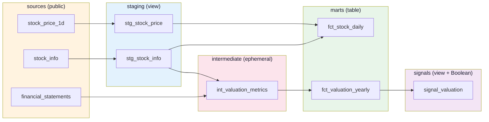

# dbt 데모 결과 — 학습조직 세미나 자료

> **목적:** BIP-Pipeline 실제 데이터(PostgreSQL)에 dbt를 적용한 데모 결과 정리. 세미나에서 dbt의 4가지 핵심 강점을 한 화면에 시연하기 위한 자료.
>
> **환경:** dbt-core 1.9 + dbt-postgres 1.9 / Docker / bip-postgres `stockdb`
> **데이터:** BIP `public` 스키마의 4개 원본 → `dbt_demo_*` 스키마에 변환 결과 적재

---

## 1. 구축 결과 요약

```
✅ 6 모델 빌드 성공 (PASS=5)
✅ 30개 데이터 테스트 통과 (PASS=30)
✅ Lineage 카탈로그 자동 생성 (catalog.json 1개)
⏱️  전체 dbt build 소요 시간: ~52초
```

**적재된 결과:**

| 모델 | 스키마 | 행 수 | 비고 |
|------|------|------:|------|
| `stg_stock_info` | dbt_demo_staging | 11,382 | view (Yahoo 종목 마스터 정제) |
| `stg_stock_price` | dbt_demo_staging | 627,623 | view (90일 시세 + 등락률 계산) |
| `int_valuation_metrics` | (ephemeral) | — | CTE 인라인 |
| `fct_stock_daily` | dbt_demo_marts | 627,623 | table (Gold 와이드) |
| `fct_valuation_yearly` | dbt_demo_marts | 8,488 | table (PER/PBR/ROE) |
| `signal_valuation` | dbt_demo_signals | 8,488 | view (Boolean Flag) |

**Boolean Flag 검증:**
- `is_value_stock = true` (저평가주): **1,689개**
- `is_high_roe = true` (고ROE): **764개**

---

## 2. 4-Layer Lineage 구조



> 이 그래프는 `dbt docs serve`에서 자동으로 시각화된다. 모델 1개를 클릭하면 컬럼 description, 테스트, SQL 코드가 모두 보임.

---

## 3. 세미나에서 보여줄 4가지 dbt 강점

### 강점 1 — `{{ ref() }}` 자동 의존성 추적

**기존 방식 (수동 SQL):**
```sql
-- 사람이 실행 순서를 기억하고 있어야 함
CREATE VIEW stg_stock_price ...;
CREATE TABLE fct_stock_daily AS SELECT ... FROM stg_stock_price;
CREATE VIEW signal_valuation AS SELECT ... FROM fct_valuation_yearly;
```

**dbt 방식:**
```sql
-- signal_valuation.sql
SELECT * FROM {{ ref('fct_valuation_yearly') }}
```

**시연:** `dbt run` 한 번이면 5개 모델이 의존성 순서대로 자동 실행.

```
1 of 5 START sql view model dbt_demo_staging.stg_stock_info
2 of 5 START sql view model dbt_demo_staging.stg_stock_price
3 of 5 START sql table model dbt_demo_marts.fct_stock_daily
4 of 5 START sql table model dbt_demo_marts.fct_valuation_yearly
5 of 5 START sql view model dbt_demo_signals.signal_valuation
```

> **메시지:** 모델 100개여도 사람이 순서 신경 쓸 필요 없음.

---

### 강점 2 — `dbt test` 데이터 품질 검증 내장

**작성한 테스트 (`schema.yml`):**
```yaml
columns:
  - name: ticker
    tests: [not_null, unique]
  - name: foreign_direction
    tests:
      - accepted_values:
          values: ['순매수', '순매도', '보합', '데이터없음']
```

**시연:** `dbt test`로 30개 테스트 자동 실행.

```
30 of 30 PASS unique_stg_stock_info_ticker ... [PASS in 0.22s]
Done. PASS=30 WARN=0 ERROR=0 SKIP=0 TOTAL=30
```

**테스트 종류:**
- `not_null` — 11개
- `unique` — 2개
- `relationships` — 3개 (FK 검증)
- `accepted_values` — 3개 (enum 검증)
- 그 외 11개

> **메시지:** 별도 데이터 품질 도구(Great Expectations 등) 없이도 기본 검증 가능.

---

### 강점 3 — `dbt docs serve` Lineage + 카탈로그 자동 생성

**작성:** 컬럼별 description을 `schema.yml`에 한 번만.

**시연 흐름:**
```bash
dbt docs generate    # catalog.json 생성
dbt docs serve       # http://localhost:8081 자동 사이트
```

**자동 생성되는 것:**
- 4-Layer Lineage 그래프 (위 mermaid와 동일)
- 모델별 페이지: 컬럼 + 설명 + 데이터 타입 + 소스 SQL
- 검색 가능한 데이터 카탈로그
- Test 결과

> **메시지:** Description은 모델 옆 `.yml`에 같이 작성 → 코드와 문서가 한 PR에서 변경됨. **문서 표류 방지.**

---

### 강점 4 — Jinja Macro 재사용

**문제:** BIP에서 자주 발생한 함정 — 시가총액이 어떤 컬럼은 "억원", 어떤 컬럼은 "원" 단위라 PER 계산 시 0이 나옴.

**매크로 (`macros/to_won.sql`):**
```sql

    CASE
        WHEN {{ column_name }} IS NULL THEN NULL
        WHEN {{ column_name }} < 100000000 THEN ({{ column_name }} * 100000000)::numeric
        ELSE {{ column_name }}::numeric
    END AS {{ alias }}

```

**사용 (`int_valuation_metrics.sql`):**
```sql
SELECT
    ticker,
    {{ to_won('s.market_value', alias='market_value_won') }},
    ...
```

> **메시지:** 단위 변환 함수를 한 번 작성 → 30개 모델에서 호출. 복붙 코드 제거.

---

## 4. dbt vs 수동 SQL 비교

| 항목 | 수동 CREATE VIEW | dbt |
|------|:-:|:-:|
| 의존성 관리 | 사람이 순서 기억 | `{{ ref() }}` 자동 |
| 데이터 품질 테스트 | 별도 스크립트 | `dbt test` 내장 |
| 문서화 | 별도 도구 / 수동 | `dbt docs` 자동 |
| 단위 변환 같은 반복 SQL | 복붙 | Jinja Macro 재사용 |
| Materialization 전략 | DDL 수동 작성 | `{{ config }}` 한 줄 |
| 형상 관리 | SQL 파일 단순 Git | dbt 프로젝트 단위 PR |

---

## 5. 세미나 시연 명령어

```bash
# 1. 컨테이너 기동 (이미 떠 있으면 생략)
docker compose -f dbt/docker-compose.yml up -d

# 2. 4단계 시연
docker exec bip-dbt dbt run              # ① 의존성 자동 실행
docker exec bip-dbt dbt test             # ② 30개 테스트 통과
docker exec bip-dbt dbt docs generate    # ③ Lineage 카탈로그 생성
docker exec bip-dbt dbt docs serve --port 8080 --host 0.0.0.0  # ④ 브라우저 확인
# 브라우저: http://localhost:8081
```

자동 스크립트는 `scripts/dbt_demo.sh` 참고.

---

## 6. Oracle 19c 적용 가능성

이번 데모는 PostgreSQL이지만, 사내 Oracle 19c에서도 같은 패턴 적용 가능.

| 변경 사항 | 내용 |
|----------|------|
| Adapter | `dbt-postgres` → **`dbt-oracle`** (Oracle 본사 vendor-supported) |
| 드라이버 | `psycopg2` → `python-oracledb` (thin 모드, Instant Client 불필요) |
| SQL 방언 | `LIMIT` → `FETCH FIRST n ROWS ONLY`, `INTERVAL` → `SYSDATE - n` |
| 스키마 | `dbt_demo_marts` → `DBT_DEMO_MARTS` (Oracle 대소문자) |
| 나머지 | **dbt 프로젝트 구조·테스트·docs 모두 동일** |

> **세미나 메시지:** "PostgreSQL에서 동작한 dbt 프로젝트는 Oracle 19c에서도 어댑터/방언만 바꾸면 그대로 동작한다."

---

## 7. 한계 + 다음 단계

**dbt가 잘 못하는 것:**
- 실시간 API 서빙 (배치 도구)
- 자연어 → SQL (NL2SQL은 별도 도구)
- 결과 캐싱 (Cube의 Pre-aggregation 같은 기능 없음)

**자연스러운 조합:**
```
dbt (변환) → Cube (BI/API 서빙) → WrenAI 또는 자체 NL2SQL Agent
```

→ 세미나의 §6 의사결정 가이드와 일관.

---

## 변경 이력

| 날짜 | 내용 |
|------|------|
| 2026-05-17 | 초안 작성 (BIP PostgreSQL 데모 결과 + Oracle 적용 가능성) |
