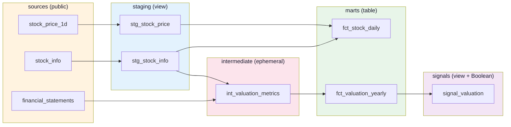
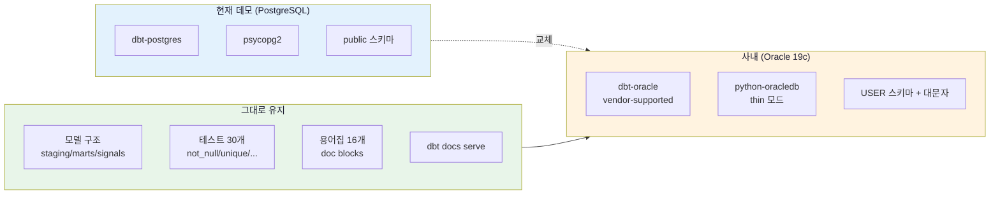
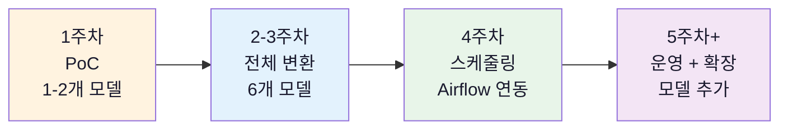
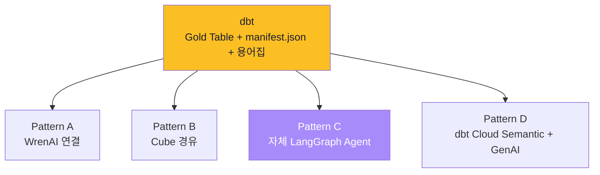
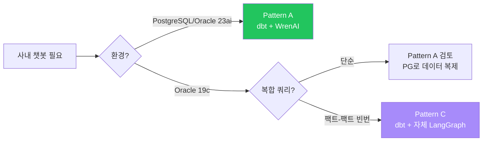

# dbt 데모 결과 — 학습조직 세미나 자료

> **목적:** BIP-Pipeline 실제 데이터(PostgreSQL)에 dbt를 적용한 데모 결과 정리. 세미나에서 dbt의 4가지 핵심 강점을 한 화면에 시연하기 위한 자료.
>
> **환경:** dbt-core 1.9 + dbt-postgres 1.9 / Docker / bip-postgres `stockdb`
> **데이터:** BIP `public` 스키마의 4개 원본 → `dbt_demo_*` 스키마에 변환 결과 적재

---

## 1. 구축 결과 요약

```
✅ 6 모델 빌드 성공 (PASS=5)
✅ 30개 데이터 테스트 통과 (PASS=30)
✅ Lineage 카탈로그 자동 생성 (catalog.json 1개)
⏱️  전체 dbt build 소요 시간: ~52초
```

**적재된 결과:**

| 모델 | 스키마 | 행 수 | 비고 |
|------|------|------:|------|
| `stg_stock_info` | dbt_demo_staging | 11,382 | view (Yahoo 종목 마스터 정제) |
| `stg_stock_price` | dbt_demo_staging | 627,623 | view (90일 시세 + 등락률 계산) |
| `int_valuation_metrics` | (ephemeral) | — | CTE 인라인 |
| `fct_stock_daily` | dbt_demo_marts | 627,623 | table (Gold 와이드) |
| `fct_valuation_yearly` | dbt_demo_marts | 8,488 | table (PER/PBR/ROE) |
| `signal_valuation` | dbt_demo_signals | 8,488 | view (Boolean Flag) |

**Boolean Flag 검증:**
- `is_value_stock = true` (저평가주): **1,689개**
- `is_high_roe = true` (고ROE): **764개**

---

## 2. 4-Layer Lineage 구조



> 이 그래프는 `dbt docs serve`에서 자동으로 시각화된다. 모델 1개를 클릭하면 컬럼 description, 테스트, SQL 코드가 모두 보임.

---

## 3. 세미나에서 보여줄 5가지 dbt 강점

### 강점 1 — `{{ ref() }}` 자동 의존성 추적

**기존 방식 (수동 SQL):**
```sql
-- 사람이 실행 순서를 기억하고 있어야 함
CREATE VIEW stg_stock_price ...;
CREATE TABLE fct_stock_daily AS SELECT ... FROM stg_stock_price;
CREATE VIEW signal_valuation AS SELECT ... FROM fct_valuation_yearly;
```

**dbt 방식:**
```sql
-- signal_valuation.sql
SELECT * FROM {{ ref('fct_valuation_yearly') }}
```

**시연:** `dbt run` 한 번이면 5개 모델이 의존성 순서대로 자동 실행.

```
1 of 5 START sql view model dbt_demo_staging.stg_stock_info
2 of 5 START sql view model dbt_demo_staging.stg_stock_price
3 of 5 START sql table model dbt_demo_marts.fct_stock_daily
4 of 5 START sql table model dbt_demo_marts.fct_valuation_yearly
5 of 5 START sql view model dbt_demo_signals.signal_valuation
```

> **메시지:** 모델 100개여도 사람이 순서 신경 쓸 필요 없음.

---

### 강점 2 — `dbt test` 데이터 품질 검증 내장

**작성한 테스트 (`schema.yml`):**
```yaml
columns:
  - name: ticker
    tests: [not_null, unique]
  - name: foreign_direction
    tests:
      - accepted_values:
          values: ['순매수', '순매도', '보합', '데이터없음']
```

**시연:** `dbt test`로 30개 테스트 자동 실행.

```
30 of 30 PASS unique_stg_stock_info_ticker ... [PASS in 0.22s]
Done. PASS=30 WARN=0 ERROR=0 SKIP=0 TOTAL=30
```

**테스트 종류:**
- `not_null` — 11개
- `unique` — 2개
- `relationships` — 3개 (FK 검증)
- `accepted_values` — 3개 (enum 검증)
- 그 외 11개

> **메시지:** 별도 데이터 품질 도구(Great Expectations 등) 없이도 기본 검증 가능.

---

### 강점 3 — `dbt docs serve` Lineage + 카탈로그 자동 생성

**작성:** 컬럼별 description을 `schema.yml`에 한 번만.

**시연 흐름:**
```bash
dbt docs generate    # catalog.json 생성
dbt docs serve       # http://localhost:8081 자동 사이트
```

**자동 생성되는 것:**
- 4-Layer Lineage 그래프 (위 mermaid와 동일)
- 모델별 페이지: 컬럼 + 설명 + 데이터 타입 + 소스 SQL
- 검색 가능한 데이터 카탈로그
- Test 결과

> **메시지:** Description은 모델 옆 `.yml`에 같이 작성 → 코드와 문서가 한 PR에서 변경됨. **문서 표류 방지.**

---

### 강점 4 — 용어집 (doc blocks) — BIP의 OM Glossary 77개에 대응

**문제:** "저평가주가 뭐냐"라고 부서마다 다르게 정의하면 NL2SQL이 매번 다른 결과를 냄.

**dbt 해결법 — `` 블록:** 도메인 용어를 한 파일에 정의 + 여러 모델에서 재사용.

**용어집 파일 (`models/_glossary.md`):**
```markdown

**저평가주 (Value Stock)**

가치 대비 주가가 낮게 형성된 종목. BIP 정의:
- PER < 10
- AND PBR < 1
- AND 두 지표 모두 양수 (적자 제외)

```

**컬럼 description에서 참조:**
```yaml
- name: is_value_stock
  description: '{{ doc("value_stock") }}'
```

**시연 효과:** `dbt docs serve`에서 컬럼 페이지에 용어 전체 정의가 표시됨. **모든 모델이 같은 정의 공유** → "저평가주가 뭐냐" 논쟁 종결.

**현재 데모에 포함된 용어 (16개):**

| 카테고리 | 용어 |
|---------|------|
| 데이터 모델링 | `grain`, `gold_table`, `curated_view`, `boolean_flag`, `interpretation_column` |
| 밸류에이션 지표 | `per`, `pbr`, `roe`, `debt_ratio` |
| 비즈니스 분류 | `value_stock`, `high_roe`, `quality_stock`, `high_debt` |
| 수급 | `foreign_direction`, `change_label` |
| 기간/시점 | `trade_date`, `fiscal_year` |

> **메시지:** BIP의 OpenMetadata Glossary(77개 용어)와 동일한 패턴. **dbt에서도 코드와 같은 PR에서 용어집 변경** 가능.

---

### 강점 5 — Jinja Macro 재사용

**문제:** BIP에서 자주 발생한 함정 — 시가총액이 어떤 컬럼은 "억원", 어떤 컬럼은 "원" 단위라 PER 계산 시 0이 나옴.

**매크로 (`macros/to_won.sql`):**
```sql

    CASE
        WHEN {{ column_name }} IS NULL THEN NULL
        WHEN {{ column_name }} < 100000000 THEN ({{ column_name }} * 100000000)::numeric
        ELSE {{ column_name }}::numeric
    END AS {{ alias }}

```

**사용 (`int_valuation_metrics.sql`):**
```sql
SELECT
    ticker,
    {{ to_won('s.market_value', alias='market_value_won') }},
    ...
```

> **메시지:** 단위 변환 함수를 한 번 작성 → 30개 모델에서 호출. 복붙 코드 제거.

---

## 4. dbt vs 수동 SQL 비교

| 항목 | 수동 CREATE VIEW | dbt |
|------|:-:|:-:|
| 의존성 관리 | 사람이 순서 기억 | `{{ ref() }}` 자동 |
| 데이터 품질 테스트 | 별도 스크립트 | `dbt test` 내장 |
| 문서화 | 별도 도구 / 수동 | `dbt docs` 자동 |
| **도메인 용어집** | **별도 OM/wiki** | **`` 블록 + `{{ doc() }}`** |
| 단위 변환 같은 반복 SQL | 복붙 | Jinja Macro 재사용 |
| Materialization 전략 | DDL 수동 작성 | `{{ config }}` 한 줄 |
| 형상 관리 | SQL 파일 단순 Git | dbt 프로젝트 단위 PR |

---

## 5. 세미나 시연 명령어

```bash
# 1. 컨테이너 기동 (이미 떠 있으면 생략)
docker compose -f dbt/docker-compose.yml up -d

# 2. 4단계 시연
docker exec bip-dbt dbt run              # ① 의존성 자동 실행
docker exec bip-dbt dbt test             # ② 30개 테스트 통과
docker exec bip-dbt dbt docs generate    # ③ Lineage 카탈로그 생성
docker exec bip-dbt dbt docs serve --port 8080 --host 0.0.0.0  # ④ 브라우저 확인
# 브라우저: http://localhost:8081
```

자동 스크립트는 `scripts/dbt_demo.sh` 참고.

---

## 6. 사내 Oracle 19c 적용 가이드 (단계별)

이번 데모는 BIP의 PostgreSQL에서 검증했지만, **dbt 프로젝트의 모델 구조·테스트·용어집·docs는 그대로 두고 어댑터와 SQL 방언만 변경하면** 사내 Oracle 19c 환경에서 동일하게 동작한다.

### 6-1. 변경 범위 한눈에 보기



**변경 부담:** 어댑터 설치 + 연결 설정 + SQL 4–5곳 방언 변환 = **하루 작업.**
**유지되는 자산:** 모델 6개, 테스트 30개, 용어집 16개, Lineage 카탈로그, 매크로 — **그대로.**

---

### 6-2. Step 1 — dbt-oracle 설치 (Dockerfile)

**현재 (PostgreSQL):**
```dockerfile
RUN pip install --no-cache-dir \
    dbt-core==1.9.* \
    dbt-postgres==1.9.*
```

**Oracle용으로 변경:**
```dockerfile
RUN apt-get update && apt-get install -y --no-install-recommends \
    git curl libaio1 \
    && rm -rf /var/lib/apt/lists/*

RUN pip install --no-cache-dir \
    dbt-core==1.9.* \
    dbt-oracle==1.9.* \
    oracledb
```

**핵심 변경:**
- `dbt-postgres` → **`dbt-oracle`** (Oracle 본사가 PyPI에 직접 배포 — vendor-supported)
- `oracledb` 패키지 추가 — Oracle 공식 Python 드라이버. **thin 모드** 사용 시 Oracle Instant Client 불필요 → Docker 이미지 가벼움
- `libaio1` — Oracle thick 모드 사용 시에만 필요 (대량 데이터 처리 성능 향상). 첫 적용에서는 thin 모드 권장

> ⚠️ **버전 핀 필수:** `dbt-oracle`은 vendor-supported 등급이라 새 dbt-core 출시 후 호환 릴리스까지 며칠~몇 주 지연. 운영에서는 `dbt-core==1.9.X` ↔ `dbt-oracle==1.9.X` 같은 minor 버전까지 핀.

---

### 6-3. Step 2 — Oracle 연결 설정 (profiles.yml)

**현재 (PostgreSQL):**
```yaml
bip_demo:
  outputs:
    dev:
      type: postgres
      host: bip-postgres
      port: 5432
      user: user
      password: pw1234
      dbname: stockdb
      schema: dbt_demo
```

**Oracle용 변경:**
```yaml
bip_demo:
  outputs:
    dev:
      type: oracle
      # 연결 방법 1: Easy Connect (간단)
      host: "{{ env_var('ORA_HOST') }}"
      port: 1521
      service: "{{ env_var('ORA_SERVICE') }}"   # 또는 sid

      # 연결 방법 2: TNS (사내 tnsnames.ora 사용 시 권장)
      # tns_name: "{{ env_var('ORA_TNS') }}"

      user: "{{ env_var('ORA_USER') }}"
      password: "{{ env_var('ORA_PASSWORD') }}"
      schema: "{{ env_var('ORA_USER') | upper }}"  # ★ Oracle 스키마는 대문자
      threads: 4
      protocol: tcp
      # thin 모드 (기본). thick 모드는 oracle_client_lib_dir 지정
```

**핵심 차이:**

| 항목 | PostgreSQL | Oracle |
|------|----------|--------|
| 연결 식별자 | `dbname` | `service` / `sid` / `tns_name` |
| 인증 | 단순 user/password | + Wallet, Kerberos 가능 |
| 스키마 | 임의 이름 | **사용자 이름 = 스키마 이름** (대문자) |
| 포트 | 5432 | 1521 |
| 연결 방식 | 단일 | Easy Connect / TNS / Wallet 3가지 |

> 💡 **사내 환경 팁:** 보통 `tnsnames.ora` 파일이 표준이라 `tns_name` 방식이 안전. Wallet 인증 필요 시 [dbt-oracle 공식 가이드](https://docs.getdbt.com/docs/core/connect-data-platform/oracle-setup) 참고.

---

### 6-4. Step 3 — SQL 방언 변환 (모델별 변경 예시)

dbt 프로젝트의 모델 6개 중 **방언 변환이 필요한 곳은 4곳**.

#### (1) `stg_stock_price.sql` — `INTERVAL` 구문

**PostgreSQL:**
```sql
WHERE timestamp >= CURRENT_DATE - INTERVAL '90 days'
```

**Oracle:**
```sql
WHERE timestamp >= TRUNC(SYSDATE) - 90        -- 일수는 그냥 빼기
-- 또는 명시적으로
WHERE timestamp >= SYSDATE - NUMTODSINTERVAL(90, 'DAY')
```

#### (2) `stg_stock_price.sql` — `SPLIT_PART` 함수

**PostgreSQL:**
```sql
SPLIT_PART(ticker, '.', 1) AS stock_code
```

**Oracle:**
```sql
SUBSTR(ticker, 1, INSTR(ticker, '.') - 1) AS stock_code
-- 또는 regex
REGEXP_SUBSTR(ticker, '[^.]+', 1, 1) AS stock_code
```

#### (3) `stg_stock_price.sql` — `LAG` 윈도우 함수

이건 **그대로 동작**. PostgreSQL과 Oracle 둘 다 SQL:2003 표준 지원.

```sql
LAG(close) OVER (PARTITION BY ticker ORDER BY timestamp) AS prev_close
```

#### (4) `fct_stock_daily.sql` — Boolean 타입

**PostgreSQL:**
```sql
(per_actual < 10 AND pbr_actual < 1) AS is_value_stock  -- boolean 반환
```

**Oracle (Boolean 타입 없음 — 19c 기준):**
```sql
CASE
    WHEN per_actual < 10 AND pbr_actual < 1 THEN 'Y'
    ELSE 'N'
END AS is_value_stock                                    -- CHAR(1) 반환
```

> 💡 **Oracle 21c+** 부터는 `BOOLEAN` 타입 지원. 19c라면 `Y/N` 패턴이 사실상 표준.

#### (5) `signal_valuation.sql` — accepted_values 테스트

Boolean 변환과 함께 `signals.yml`의 테스트도 변경:

```yaml
- name: is_value_stock
  tests:
    - accepted_values:
        values: ['Y', 'N']    # PG: [true, false] → Oracle: ['Y', 'N']
```

#### dbt가 자동 변환해주는 것 (변경 불필요)

| 구문 | dbt 자동 처리 |
|------|------------|
| `LIMIT n` | Oracle은 `FETCH FIRST n ROWS ONLY` 로 자동 변환 (dbt-oracle 매크로) |
| Materialization (`view`/`table`/`incremental`) | DDL 자동 생성 — 사용자가 신경 안 써도 됨 |
| `CREATE OR REPLACE` | Oracle의 `CREATE OR REPLACE VIEW` 자동 사용 |
| 스키마 분리 (`+schema: marts`) | `USER_MARTS` 같은 prefix 자동 생성 |

---

### 6-5. Step 4 — 매크로로 방언 차이 추상화 (권장)

여러 방언을 동시 지원해야 하면 **매크로로 분기**:

```sql
{# macros/date_subtract.sql #}

    
        {{ column }} >= CURRENT_DATE - INTERVAL '{{ days }} days'
    
        {{ column }} >= TRUNC(SYSDATE) - {{ days }}
    

```

**사용:**
```sql
WHERE {{ date_subtract('timestamp', 90) }}
```

→ **모델 SQL은 그대로 두고 매크로 한 곳만 수정하면 양쪽 DB 모두 지원.** 사내 적용 시 가장 깔끔한 패턴.

---

### 6-6. Step 5 — 실행 + 검증

```bash
# 환경변수 (사내 Oracle 계정)
export ORA_HOST=bip-oracle.company.local
export ORA_SERVICE=BIPDB
export ORA_USER=DBT_DEMO
export ORA_PASSWORD=...

# 1. 연결 확인
docker compose -f dbt/docker-compose.yml up -d
docker exec bip-dbt dbt debug
# 출력 확인:
#   adapter type: oracle
#   adapter version: 1.9.x
#   Connection test: OK connection ok

# 2. 컴파일만 먼저 (실행 없이 SQL 확인)
docker exec bip-dbt dbt compile --select stg_stock_price
cat target/compiled/bip_demo/models/staging/stg_stock_price.sql
# → Oracle 방언으로 컴파일됐는지 시각 확인

# 3. 전체 실행
docker exec bip-dbt dbt build

# 4. 결과 확인
docker exec bip-dbt dbt run-operation generate_schema_name
sqlplus DBT_DEMO/...@BIPDB
SQL> SELECT COUNT(*) FROM DBT_DEMO_MARTS.FCT_STOCK_DAILY;
```

---

### 6-7. 흔한 함정 + 대응

| 함정 | 증상 | 대응 |
|------|------|------|
| **대소문자** | `WHERE ticker = '005930.KS'` 실패 | Oracle은 식별자 대문자가 기본. 컬럼명은 `TICKER` 식으로 변경 또는 `"ticker"` 쌍따옴표 강제 |
| **Boolean 타입** | 19c에서 `BOOLEAN` 컬럼 생성 실패 | `Y/N` CHAR(1) 패턴 사용 + 21c+ 마이그레이션 시 일괄 변경 |
| **VARCHAR2 길이** | 한글 종목명에서 `ORA-12899: value too large` | `VARCHAR2(255 CHAR)` 명시 (BYTE 아닌 CHAR 단위) |
| **`LIMIT` 미사용** | Oracle 11g/12.1에서 `LIMIT` 미지원 | dbt-oracle이 19c에서는 자동 변환 — 19c 이상 확인 |
| **dbt-core 버전 충돌** | 새 dbt-core 출시 후 dbt-oracle 미호환 | `requirements.txt`에 minor 버전까지 핀 (`dbt-core==1.9.0` ↔ `dbt-oracle==1.9.0`) |
| **세션 스키마** | 모델은 만들어지는데 `dbt test`에서 못 찾음 | profiles.yml의 `schema` 가 대문자인지 확인 |
| **권한 부족** | `ORA-01031: insufficient privileges` | `GRANT CREATE TABLE, CREATE VIEW, UNLIMITED TABLESPACE TO DBT_DEMO` |
| **Materialized View** | dbt가 `view` materialization을 했는데 운영에서 MV가 필요 | dbt-oracle은 `materialized_view` 도 지원 — `+materialized: materialized_view` |

---

### 6-8. 사내 적용 체크리스트

**환경 준비:**
- [ ] dbt 전용 Oracle 계정 생성 (예: `DBT_DEMO`)
- [ ] 권한 부여: `CONNECT`, `RESOURCE`, `CREATE TABLE/VIEW`, `UNLIMITED TABLESPACE`
- [ ] 원본 테이블에 SELECT 권한 부여
- [ ] tnsnames.ora 또는 Easy Connect 정보 확보

**프로젝트 변경:**
- [ ] `dbt/Dockerfile` — dbt-oracle + oracledb 설치
- [ ] `dbt/profiles.yml` — type: oracle, 연결 정보
- [ ] `stg_stock_price.sql` — INTERVAL, SPLIT_PART 변환 (또는 매크로 도입)
- [ ] `fct_stock_daily.sql`, `signal_valuation.sql` — Boolean → Y/N CHAR(1)
- [ ] `signals.yml` — accepted_values 값 변경

**검증:**
- [ ] `dbt debug` 성공
- [ ] `dbt compile` 로 Oracle SQL 출력 시각 확인
- [ ] `dbt build` 성공 (모델 + 테스트 통과)
- [ ] `dbt docs generate` 카탈로그 생성
- [ ] sqlplus로 결과 행 수 검증

**예상 시간:** **반나절 ~ 1일** (환경 준비가 가장 오래 걸리는 부분, 코드 변경 자체는 1–2시간).

---

### 6-9. 사내 단계적 도입 시나리오 (권장)



| 주차 | 목표 | 산출물 |
|:----:|------|------|
| 1주차 | PoC — `stg_stock_info` 1개만 Oracle에서 동작 확인 | `dbt debug` + `dbt run --select stg_stock_info` 성공 |
| 2~3주차 | 전체 6개 모델 + 30개 테스트 통과 | `dbt build` 성공 + dbt docs 사이트 |
| 4주차 | Airflow에서 `dbt build` 호출 (BashOperator) | 매일 새벽 자동 실행 |
| 5주차+ | 사내 도메인 모델 추가 (영업/인사/매출 등) | 모델 수 점진적 확장 |

---

## 7. 챗봇 형태 서비스가 필요할 때 — 통합 패턴

**핵심 사실:** dbt는 **자체 NL2SQL/챗봇 기능이 없다.** 변환·메트릭 정의에 특화된 도구이므로 챗봇이 필요하면 **다른 도구와 조합**해야 한다.

dbt가 만드는 **Gold Table + 메트릭 정의 + 용어집은 자산**이고, 챗봇은 그 위에 어떤 방식으로 얹을지 선택의 문제다.



### Pattern A — dbt → WrenAI (가장 단순)

**구조:**
```
dbt 변환 → Gold Table (DB) → WrenAI 연결 → 자연어 챗봇
```

**구현 방식:**
- WrenAI를 BIP-Pipeline에 띄우고 **dbt가 만든 마트 스키마**(`dbt_demo_marts.*`)를 데이터소스로 등록
- dbt의 컬럼 description은 **DB COMMENT**로 동기화 → WrenAI가 자동 인식
- 추가로 dbt `manifest.json` → WrenAI MDL 변환 스크립트 작성하면 모델/관계까지 자동 import 가능

**장점:**
- 가장 빠른 PoC (1–2일)
- BIP에서 검증된 패턴 (Wren AI 100% A등급)
- dbt 자산(description/test 결과)을 거의 그대로 활용

**단점:**
- WrenAI가 **Oracle 19c 미지원** → 사내 환경 부적합
- dbt manifest와 WrenAI MDL 이중화 (자동 동기화 스크립트 필요)

**적합:** PostgreSQL/Oracle 23ai 환경, 빠른 PoC

---

### Pattern B — dbt → Cube → 챗봇 (정석 3-tier)

**구조:**
```
dbt 변환 → Gold Table → Cube 시맨틱 → REST API → 챗봇 (LangGraph/Vanna 등)
```

**구현 방식:**
- dbt가 Gold Table을 만들고, Cube가 그 위에 시맨틱 레이어 + Pre-aggregation 적용
- 챗봇 (LangGraph Agent 또는 Vanna)이 **Cube REST API를 Tool로 호출** → 자연어 질문을 Cube 쿼리 JSON으로 변환 후 호출
- 메트릭 정의: dbt와 Cube 양쪽에 존재 → 일관성 관리 필요

**장점:**
- 변환·시맨틱·서빙·챗봇 레이어가 명확히 분리
- BI 도구(Tableau 등)도 같이 사용 가능 (Cube SQL API)
- 가장 확장성 높은 구조

**단점:**
- 3개 도구 운영 부담
- 메트릭 정의가 dbt + Cube 두 군데로 분산 (`dbt_models` ↔ `cube/model/*.js`)
- Cube의 팩트-팩트 JOIN 한계 그대로 (BIP 검증)

**적합:** 대규모 조직, BI + 챗봇 동시 운영, 멀티 클라이언트

---

### Pattern C — dbt + 자체 LangGraph Agent (v3 방식)

**구조:**
```
dbt 변환 → Gold Table → DB 직결 → LangGraph Agent → QuerySpec → SQL
                                     ↑
                          manifest.json을 Schema RAG로 활용
```

**구현 방식:**
- dbt가 만든 `manifest.json`을 **Schema Registry의 입력**으로 사용
  - 모델 description → LLM 프롬프트의 테이블 설명
  - 컬럼 description → 컬럼 의미 (dbt 용어집 그대로)
  - JOIN 관계 → joins.yaml (수동 또는 manifest에서 추출)
- LangGraph Agent가 QuerySpec 생성 → SQL Converter → DB 직접 실행
- Cube 없이 dbt의 메트릭/관계 정의를 직접 활용

**장점:**
- **Oracle 19c 즉시 동작** (Cube/WrenAI 호환성 무관)
- dbt 용어집(``)을 LLM 컨텍스트로 그대로 주입
- 도구 락인 없음, 사내 LLM 자유 선택

**단점:**
- 자체 구현 부담 (Schema Registry/Converter/Validator)
- Cube의 Pre-aggregation 캐싱 같은 기능 별도 구현 필요

**적합:** 사내 Oracle 19c, 자체 LLM 사용, 팩트-팩트 JOIN 빈번

> 📚 **상세 설계:** `docs/nl2sql_implementation_plan_v3.md` §6 (Phase 2 LangGraph + QuerySpec)

---

### Pattern D — dbt Cloud Semantic Layer + GenAI (유료, 참고)

**구조:**
```
dbt Cloud (Semantic Layer + MetricFlow) → GenAI Integration → 챗봇
```

**구현 방식:**
- dbt Cloud의 **Semantic Layer API**가 메트릭을 표준화된 형태로 노출
- ChatGPT/Claude 등이 직접 Semantic Layer API를 호출 (Function Calling)
- dbt Labs가 공식 통합 제공 (Hex, Mode 등)

**장점:**
- dbt Cloud 사용 조직이라면 추가 구축 없이 챗봇 가능
- dbt Labs 공식 지원

**단점:**
- **유료** (dbt Cloud 라이선스 필요)
- 사내 환경/사내 LLM 사용 어려움 (외부 SaaS 의존)
- dbt Core 단독으론 불가

**적합:** 이미 dbt Cloud 라이선스가 있는 조직, SaaS 친화적

---

### 패턴 비교표

| 패턴 | 추가 도구 | Oracle 19c | 개발 부담 | BIP 검증 |
|------|---------|:-:|:-:|:-:|
| **A. dbt + WrenAI** | WrenAI | ❌ | 낮음 | ✅ |
| **B. dbt + Cube + Agent** | Cube + Agent | ⭕ (community) | 중간 | △ (Cube 한계) |
| **C. dbt + 자체 LangGraph** | LangGraph | **✅** | 높음 (초기) | 진행 중 (v3) |
| **D. dbt Cloud Semantic + GenAI** | dbt Cloud (유료) | ❌ | 낮음 | — |

### 사내 환경 권장 경로



> 💡 **세미나 메시지:** "**dbt만으로는 챗봇 안 됨. 어떤 도구와 조합하느냐가 다음 결정.** 환경이 PostgreSQL이면 WrenAI, Oracle 19c이면 자체 구현이 사실상 답."

---

## 8. 한계 + 다음 단계

**dbt가 잘 못하는 것:**
- 실시간 API 서빙 (배치 도구)
- 자연어 → SQL (NL2SQL은 별도 도구 — §7 패턴 참고)
- 결과 캐싱 (Cube의 Pre-aggregation 같은 기능 없음)

**자연스러운 조합:**
```
dbt (변환) → Cube (BI/API 서빙) → WrenAI 또는 자체 NL2SQL Agent
```

→ 세미나의 §6 의사결정 가이드와 일관.

---

## 변경 이력

| 날짜 | 내용 |
|------|------|
| 2026-05-17 | 초안 작성 (BIP PostgreSQL 데모 결과 + Oracle 적용 가능성) |
| 2026-05-17 | dbt 도메인 용어집(`_glossary.md`, 16개 용어) 추가 + 강점 4 신설 (강점 4→5) — BIP OM Glossary 77개와 동일 패턴 |
| 2026-05-18 | §6 Oracle 19c 적용 가이드 단계별 확장 — Dockerfile/profiles/SQL 방언 변환(4곳)/매크로 추상화/실행 검증/흔한 함정/사내 도입 시나리오 |
| 2026-05-18 | §7 챗봇 통합 패턴 4종 추가 — A(WrenAI) / B(Cube 경유) / C(자체 LangGraph) / D(dbt Cloud GenAI) + 사내 권장 경로 |
