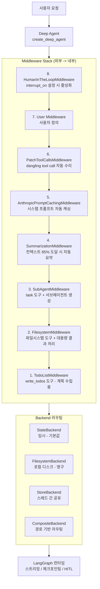
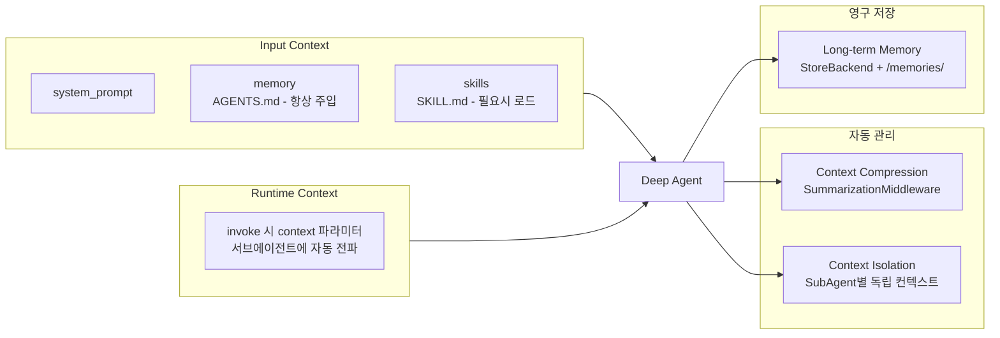
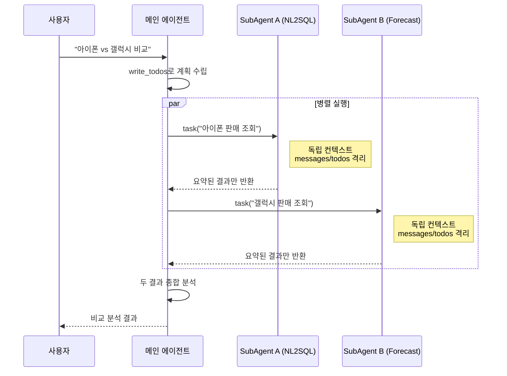

# Deep Agents 기술 가이드

> **GitHub:** <https://github.com/langchain-ai/deep-agents>
> **버전:** v0.5.0a1 (비동기 서브에이전트 프리뷰)
> **기반:** LangChain + LangGraph
> **라이선스:** MIT
> **설치:** `pip install deepagents`

---

## 목차

1. [개요](#1-개요)
2. [아키텍처](#2-아키텍처)
3. [핵심 개념](#3-핵심-개념)
4. [LangGraph vs Deep Agents 비교](#4-langgraph-vs-deep-agents-비교)
5. [혼합 패턴](#5-혼합-패턴)
6. [설치 및 시작](#6-설치-및-시작)
7. [실전 예시](#7-실전-예시)
8. [참고 및 변경 이력](#8-참고-및-변경-이력)

---

## 1. 개요

### Deep Agents란

LangChain이 Claude Code에서 영감을 받아 만든 **에이전트 하네스(Agent Harness)**.
LangGraph 런타임 위에 계획(Planning), 파일시스템, 서브에이전트, 장기 메모리를 내장하여
복잡한 다단계 작업을 처리한다.

### 핵심 철학

Claude Code의 4가지 핵심 패턴을 일반화한 것이다:

| Claude Code 패턴 | Deep Agents 대응 |
|---|---|
| 상세 시스템 프롬프트 | `system_prompt` + `memory` + `skills` |
| No-op 플래닝 툴 | `write_todos` (TodoListMiddleware) |
| 서브에이전트 | `task` 도구 (SubAgentMiddleware) |
| 파일시스템 | `ls`/`read_file`/`write_file` (FilesystemMiddleware) |

### LangChain / LangGraph / Deep Agents 관계

세 가지는 대체 관계가 아닌 **계층 관계**이다.

```
Deep Agents SDK    <-- 에이전트 하네스 (batteries-included)
      |  위에 구축
LangGraph          <-- 에이전트 런타임 (실행 인프라)
      |  위에 구축
LangChain          <-- 에이전트 프레임워크 (추상화 레이어)
```

### 역할별 상세 비교

| 구분 | LangChain | LangGraph | Deep Agents |
|---|---|---|---|
| **레이어** | 에이전트 프레임워크 | 에이전트 런타임 | 에이전트 하네스 |
| **역할** | 모델/툴/루프 추상화 | 그래프 기반 실행 엔진 | 계획/파일시스템/서브에이전트 내장 |
| **제어 수준** | 높음 (유연) | 매우 높음 (저수준) | 중간 (의견 포함) |
| **시작 난이도** | 쉬움 | 중간 | 가장 쉬움 |
| **플래닝 도구** | 직접 구현 | 직접 구현 | `write_todos` 내장 |
| **파일시스템** | 직접 구현 | 직접 구현 | `ls`/`read`/`write` 내장 |
| **컨텍스트 요약** | 직접 구현 | 직접 구현 | 자동 (85% 도달 시) |
| **서브에이전트** | 직접 구현 | 직접 그래프 설계 | `task` 도구 내장 |
| **스트리밍** | 지원 | 지원 | LangGraph 상속 |
| **HITL** | 기본 지원 | `interrupt` 완전 지원 | `interrupt_on`으로 선언적 |
| **배포** | 자유 | LangGraph Platform | LangGraph Platform |

### 유사 외부 SDK 비교

| 항목 | LangChain Deep Agents | Claude Agent SDK | OpenAI Codex SDK |
|---|---|---|---|
| **주요 용도** | 범용 에이전트 (코딩 포함) | Claude 기반 코딩 에이전트 | 코딩 작업 특화 |
| **모델 지원** | 모델 무관 (100+ 제공자) | Claude 계열 특화 | OpenAI 모델 특화 |
| **장기 메모리** | Memory Store (스레드 간) | 없음 | 없음 |
| **파일시스템 백엔드** | 플러그인형 (State/FS/Store/Composite) | 로컬 | 로컬/클라우드 |
| **보안 설정** | 툴별 HITL 선언적 설정 | 권한 모드 + Hooks | OS 레벨 샌드박스 모드 |
| **관찰 가능성** | LangSmith 네이티브 | 없음 | OpenAI Traces |
| **라이선스** | MIT | MIT (Claude Code는 독점) | Apache-2.0 |

> **Bedrock 환경에서의 선택:**
> Deep Agents는 모델 무관이라 Bedrock의 Claude든 다른 모델이든 자유롭게 선택 가능하고
> 장기 메모리도 내장되어 있다. 다만 Bedrock에서 LangSmith 연동이 제한될 수 있어 별도 확인 필요.

---

## 2. 아키텍처

### 전체 계층 구조



### Context 전파 흐름



### SubAgent 컨텍스트 격리



---

## 3. 핵심 개념

### 3-1. Agent 클래스 (`create_deep_agent`)

`create_deep_agent()`는 컴파일된 LangGraph 그래프를 반환하는 팩토리 함수이다.

```python
from deepagents import create_deep_agent
from langchain.chat_models import init_chat_model

agent = create_deep_agent(
    model=init_chat_model("claude-sonnet-4-6"),
    tools=[my_tool_a, my_tool_b],
    system_prompt="당신은 데이터 분석 전문가입니다.",
    backend=my_backend,
    subagents=[researcher, coder],
    checkpointer=checkpointer,
    store=store,
    interrupt_on={"write_file": True},
    debug=True,
    name="DataAnalysisAgent",
)

result = agent.invoke({
    "messages": [{"role": "user", "content": "질문"}]
})
```

#### 핵심 파라미터

| 파라미터 | 타입 | 기본값 | 설명 |
|---|---|---|---|
| `model` | `str` \| `BaseChatModel` | `claude-sonnet-4.5` | LLM 모델 |
| `tools` | `Sequence[...]` | `None` | 커스텀 도구 (내장 도구 외 추가) |
| `system_prompt` | `str` | `None` | 에이전트 역할 정의 |
| `backend` | `BackendProtocol` | `StateBackend` | 파일 저장소 백엔드 |
| `subagents` | `list[SubAgent]` | `None` | 커스텀 서브에이전트 정의 |
| `memory` | `list[str]` | `None` | 항상 주입되는 AGENTS.md 경로 목록 |
| `skills` | `list[str]` | `None` | 관련성 있을 때만 로드되는 SKILL.md 경로 |
| `checkpointer` | `Checkpointer` | `None` | 대화 상태 영속화 (`thread_id`로 재개) |
| `store` | `BaseStore` | `None` | 스레드 간 영구 메모리 |
| `interrupt_on` | `dict[str, bool]` | `None` | HITL 승인 필요 도구 설정 |
| `debug` | `bool` | `False` | 디버그 모드 |

#### 자동 주입되는 내장 도구

| 도구 | 출처 미들웨어 | 기능 |
|---|---|---|
| `write_todos` | TodoListMiddleware | 작업 목록 관리 (no-op, 컨텍스트 엔지니어링용) |
| `ls` | FilesystemMiddleware | 디렉토리 조회 |
| `read_file` | FilesystemMiddleware | 파일 읽기 (offset/limit 페이지네이션) |
| `write_file` | FilesystemMiddleware | 새 파일 생성 |
| `edit_file` | FilesystemMiddleware | 기존 파일 편집 (문자열 치환) |
| `glob` | FilesystemMiddleware | 패턴으로 파일 검색 |
| `grep` | FilesystemMiddleware | 파일 내용 검색 |
| `execute` | FilesystemMiddleware | 셸 명령 실행 (SandboxBackend 필요) |
| `task` | SubAgentMiddleware | 서브에이전트 호출 |

---

### 3-2. 계층 구조 (Parent-Child)

Deep Agents는 **오케스트레이터-서브에이전트** 패턴을 기본으로 한다.

- **메인 에이전트 (Parent):** 사용자 의도 파악, 계획 수립, 결과 종합
- **서브에이전트 (Child):** 전문 도메인 작업 실행, 독립된 컨텍스트에서 동작

격리되는 상태: `messages`, `todos`, `structured_response`.
파일(`files`)과 커스텀 상태는 부모-자식 간 공유된다.

---

### 3-3. Context (5개 레이어)

| 타입 | 제어 방법 | 범위 | 특징 |
|---|---|---|---|
| **Input context** | `system_prompt`, `memory`, `skills` | 정적 / 매 실행 | 시작 시 주입 |
| **Runtime context** | `invoke` 시 `context` 파라미터 | 실행당 | 서브에이전트에 자동 전파 |
| **Context compression** | SummarizationMiddleware 자동 | 자동 | 한계 도달 시 자동 압축 |
| **Context isolation** | SubAgent `task` 도구 | 서브에이전트별 | 메인 컨텍스트 오염 방지 |
| **Long-term memory** | StoreBackend + `/memories/` 경로 | 스레드 간 영구 | 대화 종료 후도 유지 |

#### Memory vs Skills

- **Memory** (AGENTS.md): 시스템 프롬프트에 **항상** 주입. 최소화가 중요하다.
- **Skills** (SKILL.md): 시작 시 frontmatter만 읽고, 관련 질문이 들어올 때만 전체 로드. 토큰 절약.

```python
agent = create_deep_agent(
    model="claude-sonnet-4-6",
    memory=["/project/AGENTS.md"],           # 항상 주입
    skills=["/skills/nl2sql/", "/skills/forecast/"],  # 필요시 로드
    system_prompt="""스마트폰 수요 데이터 분석 전문가.
    온톨로지: Brand -> Series -> Model / Region -> Country -> Channel"""
)
```

---

### 3-4. Middleware

미들웨어는 외부에서 내부로 자동 적용된다.

| 순서 | 미들웨어 | 기능 | 적용 |
|---|---|---|---|
| 8 | HumanInTheLoopMiddleware | `interrupt_on` 설정 시 활성화 | 선택 |
| 7 | User Middleware | 사용자 정의 | 선택 |
| 6 | PatchToolCallsMiddleware | dangling tool call 자동 수리 | 자동 |
| 5 | AnthropicPromptCachingMiddleware | 시스템 프롬프트 자동 캐싱 (비용 절감) | 자동 |
| 4 | SummarizationMiddleware | 컨텍스트 85% 도달 시 자동 요약 | 자동 |
| 3 | SubAgentMiddleware | `task` 도구 + 서브에이전트 생성 | 자동 |
| 2 | FilesystemMiddleware | 파일시스템 도구 + 대용량 결과 처리 | 자동 |
| 1 | TodoListMiddleware | `write_todos` (no-op, 계획 수립용) | 자동 |

#### SummarizationMiddleware 상세

- **기본 동작:** 컨텍스트의 85% 도달 시 자동 요약. 최근 10% 유지, 나머지 압축.
- **커스텀 설정:**

```python
from deepagents.middleware import SummarizationMiddleware

agent = create_deep_agent(
    model=model,
    middleware=[
        SummarizationMiddleware(
            model=model,
            trigger=("fraction", 0.80),  # 80%에서 트리거
            keep=("fraction", 0.15),     # 최근 15% 유지
        )
    ]
)
```

> **FilesystemMiddleware와 시너지:**
> 도구 결과가 80,000자 초과 시 `/large_tool_results/{id}`에 자동 저장하고,
> 에이전트에는 처음 10줄 + 파일 참조만 전달한다. `read_file`로 페이지네이션 읽기 가능.
> SummarizationMiddleware가 오래된 대화를 압축하여 장시간 세션을 안정적으로 유지한다.

---

### 3-5. SubAgent

SubAgent는 대용량 결과를 **독립된 컨텍스트**에서 처리하고 최종 결과만 메인에 반환한다 (Context Quarantine).

#### 두 가지 타입

| 타입 | 정의 방식 | 적합한 경우 |
|---|---|---|
| **SubAgent (dict)** | 딕셔너리로 정의 | 대부분의 경우 |
| **CompiledSubAgent** | LangGraph 그래프 직접 전달 | 복잡한 내부 워크플로우 |

```python
nl2sql_agent = {
    "name": "nl2sql-agent",
    "description": "Oracle DB 자연어 쿼리 처리",
    "system_prompt": "Oracle 19c SQL 전문가. FETCH FIRST 사용, 전체 스캔 금지.",
    "tools": [oracle_query_tool, metadata_lookup_tool],
    "model": "claude-sonnet-4-6",
    "skills": ["/skills/nl2sql/"],
}

agent = create_deep_agent(
    model="claude-sonnet-4-6",
    subagents=[nl2sql_agent, forecast_agent],
    system_prompt="데이터 분석 오케스트레이터. 병렬 실행 가능한 경우 동시 task 호출"
)
```

#### 동기 vs 비동기 SubAgent

| 기능 | 동기 SubAgent | 비동기 SubAgent (v0.5 NEW) |
|---|---|---|
| 실행 모델 | 완료까지 블록 | 즉시 반환, 백그라운드 실행 |
| 중간 업데이트 | 불가 | `update_async_task`로 가능 |
| 취소 | 불가 | `cancel_async_task`로 가능 |
| 배포 요건 | 없음 | LangSmith Deployments 필요 |

```python
from deepagents import AsyncSubAgent

async_subagents = [
    AsyncSubAgent(
        name="deep-researcher",
        description="장시간 데이터 수집 및 분석. 비동기 실행",
        graph_id="researcher",  # langgraph.json에 등록된 그래프 ID
    ),
]
# 자동 주입 도구: start_async_task, check_async_task,
#   update_async_task, cancel_async_task, list_async_tasks
```

> **v0.5 프리뷰 기능** -- 프로덕션 미권장

#### 병렬 실행 패턴

LLM이 한 번의 응답에서 여러 `task`를 호출하면 자동으로 병렬 실행된다.
`system_prompt`에 "병렬 실행 가능한 경우 동시에 여러 task를 호출하세요"를
명시하면 LLM이 더 적극적으로 병렬화한다.

---

### 3-6. Backend (4종)

| Backend | 특징 | 용도 |
|---|---|---|
| **StateBackend** (기본값) | 임시, LangGraph 상태에 저장 | 작업 중 임시 파일 |
| **FilesystemBackend** | 로컬 디스크, 영구, `virtual_mode` 필수 | 분석 결과 영구 보존 |
| **StoreBackend** | 스레드 간 공유, 영구 | 온톨로지 지식 영구 저장 |
| **CompositeBackend** | 경로 접두사 기반 라우팅, longest-prefix 매칭 | 여러 Backend 조합 |

```python
from deepagents.backends import (
    CompositeBackend, StateBackend, StoreBackend, FilesystemBackend
)

backend = CompositeBackend(
    default=StateBackend,   # / 하위 기본 (임시)
    routes={
        "/memories/": StoreBackend,    # 영구, 스레드 간 공유
        "/analysis/": FilesystemBackend(
            root_dir="./analysis_workspace",
            virtual_mode=True,
            max_file_size_mb=10,
        ),
    }
)
# /notes.txt           -> StateBackend (임시)
# /memories/ontology.md -> StoreBackend (영구)
# /analysis/report.md  -> FilesystemBackend (로컬 디스크)
```

---

## 4. LangGraph vs Deep Agents 비교

### 언제 무엇을 쓰는가

| 상황 | 선택 |
|---|---|
| 빠른 프로토타입, 단순 툴 호출 루프 | LangChain `create_agent` |
| 복잡한 상태 그래프, 결정론적 파이프라인 | LangGraph 직접 설계 |
| 계획/파일/서브에이전트가 필요한 다단계 자율 작업 | Deep Agents SDK |
| 온톨로지/시맨틱 레이어 위에서 자유 질의 | Deep Agents SDK |
| 정해진 파이프라인 안에서 Deep Agents 서브루틴 | LangGraph + Deep Agents 조합 |

### 실질적 차이 -- 6가지 기준

| 기준 | LangGraph 직접 설계 | Deep Agents |
|---|---|---|
| **실행 흐름** | 코드에 고정 (결정론적) | LLM이 동적으로 결정 |
| **새 에이전트 추가** | 그래프 노드/엣지 수정 필요 | `subagents` 목록에 추가만 |
| **병렬 실행** | 명시적으로 직접 구현 | LLM이 자동으로 병렬 `task` 호출 |
| **컨텍스트 관리** | State 직접 설계 | SummarizationMiddleware 자동 |
| **예측 가능성** | 높음 -- 항상 같은 흐름 | 낮음 -- LLM 판단에 따라 다름 |
| **디버깅** | 쉬움 -- 흐름 추적 명확 | 어려움 -- LLM 판단 추적 필요 |

### 결정론적 파이프라인에서의 위험

> **주의:** 실행 순서가 중요한 시스템(예: TradingAgents)에서 Deep Agents를 쓰면
> LLM이 스스로 판단해서 단계를 건너뛸 수 있다.
> 금융 시스템처럼 특정 단계가 반드시 실행되어야 하는 경우, 이런 비결정성이 치명적이다.
>
> **순서가 중요한 파이프라인 = LangGraph, 자유로운 탐색/분석 = Deep Agents**

---

## 5. 혼합 패턴

### Deep Agents + LangGraph 조합

상위는 Deep Agents가 판단하고, 내부 결정론적 실행은 LangGraph에 위임한다.

```mermaid
graph TB
    subgraph Orchestrator["Deep Agents (상위 오케스트레이터)"]
        O[사용자 자연어 요청<br/>"NVDA랑 AAPL 비교 분석해줘"]
        P[계획 수립 + 병렬 호출 결정]
        R[결과 종합 분석]
        O --> P
    end

    subgraph Pipeline1["LangGraph Pipeline A (NVDA)"]
        direction LR
        A1[Analyst] --> A2[Researcher] --> A3[Trader] --> A4[Risk] --> A5[FundManager]
    end

    subgraph Pipeline2["LangGraph Pipeline B (AAPL)"]
        direction LR
        B1[Analyst] --> B2[Researcher] --> B3[Trader] --> B4[Risk] --> B5[FundManager]
    end

    P -->|"task(NVDA 분석)"| Pipeline1
    P -->|"task(AAPL 분석)"| Pipeline2
    Pipeline1 -->|결과 반환| R
    Pipeline2 -->|결과 반환| R
```

#### CompiledSubAgent로 LangGraph 그래프 등록

```python
from deepagents import create_deep_agent, CompiledSubAgent
from langchain.agents import create_agent

# 1. LangGraph로 결정론적 파이프라인 구성
trading_pipeline = create_agent(
    model=model, tools=trading_tools,
    prompt="트레이딩 분석 파이프라인. 반드시 전체 단계를 순서대로 실행."
)

# 2. CompiledSubAgent로 래핑
trading_subagent = CompiledSubAgent(
    name="trading-pipeline",
    description="종목 심층 분석. 펀더멘털->리서처->트레이더->리스크 파이프라인",
    runnable=trading_pipeline
)

# 3. Deep Agents 오케스트레이터
orchestrator = create_deep_agent(
    model="claude-sonnet-4-6",
    subagents=[trading_subagent],
    system_prompt="""포트폴리오 분석 조율자.
    심층 종목 분석 -> trading-pipeline 호출
    여러 종목 비교 -> 병렬로 여러 task 동시 호출
    시장 개요 질문 -> 직접 답변
    서브에이전트의 실행 순서는 건드리지 마세요.""",
    backend=backend,
)

result = orchestrator.invoke({
    "messages": [{"role": "user", "content": "NVDA랑 AAPL 비교 분석해줘"}]
})
```

#### 역할 분리

| 레이어 | 담당 | 특징 |
|---|---|---|
| **Deep Agents (상위)** | 분석 필요성 판단, 병렬 호출 결정, 결과 종합 | 자유로운 자연어 처리 |
| **LangGraph (내부)** | 결정론적 파이프라인 실행, 단계 보장 | 순서/안전성 보장 |

> **BIP-Pipeline 적용 시:**
> NL2SQL + 수요예측 파이프라인은 LangGraph로 결정론적으로 구성하고,
> 자유로운 분석 요청은 Deep Agents 오케스트레이터가 받아서
> 필요한 파이프라인들을 병렬로 호출하는 패턴이 자연스럽다.

---

## 6. 설치 및 시작

### 기본 설치

```bash
pip install deepagents
```

### Docker 배포

Deep Agents는 일반 Python 패키지이다. 별도 런타임 불필요.

> **중요:** `/memories/`, `/workspace/` 경로는 반드시 볼륨으로 마운트해야 한다.
> 없으면 컨테이너 재시작 시 장기 메모리가 소실된다.

```dockerfile
FROM python:3.13-slim
WORKDIR /app
COPY requirements.txt .
RUN pip install deepagents langchain-aws
COPY . .
VOLUME ["/app/workspace", "/app/memories"]
CMD ["python", "main.py"]
```

```yaml
services:
  deep-agent:
    build: .
    env_file: .env
    volumes:
      - ./workspace:/app/workspace   # FilesystemBackend
      - ./memories:/app/memories     # 장기 메모리 (필수)
    ports:
      - "8000:8000"
```

### HITL (Human-in-the-Loop)

```python
agent = create_deep_agent(
    model=model,
    checkpointer=checkpointer,  # HITL에 필수
    interrupt_on={
        "execute": True,   # 셸 명령 전 승인
        "write_file": True,
        "task": False,     # 서브에이전트 자동 허용
    }
)
```

### MCP 서버 연동

```python
from langchain_mcp_adapters.client import MultiServerMCPClient
from deepagents import create_deep_agent

async with MultiServerMCPClient({
    "oracle": {"command": "python", "args": ["mcp_servers/oracle_server.py"]},
    "metadata": {"url": "http://openmetadata-mcp:8080/sse", "transport": "sse"},
}) as client:
    agent = create_deep_agent(
        model="claude-sonnet-4-6",
        tools=await client.get_tools(),
        subagents=[nl2sql_agent],
    )
```

### 보안 설정

| 계층 | 메커니즘 | 효과 |
|---|---|---|
| 입력 검증 | `_validate_path()` | `..` 경로 탈출 차단 |
| 파일시스템 격리 | `virtual_mode=True` | `root_dir` 외부 접근 불가 |
| 심볼릭 링크 | `O_NOFOLLOW` | symlink 따라가기 방지 (Linux/macOS) |
| 명령 인젝션 | Base64 인코딩 | 셸 인젝션 방지 |
| 파일 크기 | `max_file_size_mb` | 대용량 파일 grep 스킵 |
| 실행 승인 | `interrupt_on["execute"]` | 셸 명령 전 사람 확인 |

> **Windows 주의:** `O_NOFOLLOW` 미지원. 반드시 `virtual_mode=True` 사용.

---

## 7. 실전 예시

### 온톨로지 기반 데이터 플랫폼 전체 구성

```python
from deepagents import create_deep_agent
from deepagents.backends import (
    CompositeBackend, StateBackend, StoreBackend, FilesystemBackend
)
from langchain_aws import ChatBedrock
from langgraph.checkpoint.memory import MemorySaver
from langgraph.store.memory import InMemoryStore

main_model = ChatBedrock(model_id="anthropic.claude-sonnet-4-6...")
sub_model  = ChatBedrock(model_id="anthropic.claude-haiku-4-5...")

backend = CompositeBackend(
    default=StateBackend,
    routes={
        "/memories/": StoreBackend,
        "/analysis/": FilesystemBackend(root_dir="./workspace", virtual_mode=True),
    }
)

nl2sql_sub = {
    "name": "nl2sql", "description": "자연어 -> SQL 변환 및 실행",
    "system_prompt": "Oracle 19c SQL 전문가...",
    "tools": [oracle_mcp_tool, metadata_mcp_tool],
    "model": sub_model, "skills": ["/skills/nl2sql/"],
}
forecast_sub = {
    "name": "forecast", "description": "수요 예측 모델 실행 및 SHAP 해석",
    "system_prompt": "Prophet/XGBoost 수요 예측 전문가...",
    "tools": [data_load_tool, model_run_tool, mlflow_tool],
    "model": sub_model, "skills": ["/skills/forecast/", "/skills/shap/"],
}

agent = create_deep_agent(
    model=main_model,
    subagents=[nl2sql_sub, forecast_sub],
    backend=backend,
    memory=["/project/AGENTS.md"],
    skills=["/skills/domain-knowledge/"],
    checkpointer=MemorySaver(),
    store=InMemoryStore(),
    interrupt_on={"execute": True},
    system_prompt="""스마트폰 수요 데이터 분석 전문가.
## 위임 전략
- SQL 조회 -> nl2sql, 예측/SHAP -> forecast
- 독립 작업은 병렬 task 호출
- 온톨로지 확인 -> /memories/ 참조""",
)

config = {"configurable": {"thread_id": "user_session_001"}}
result = agent.invoke(
    {"messages": [{"role": "user", "content": "지난 분기 아이폰 vs 갤럭시 판매 비교해줘"}]},
    config=config
)
```

### 프로덕션 장기 메모리 (PostgreSQL)

```python
from langgraph.checkpoint.postgres import PostgresSaver
from langgraph.store.postgres import PostgresStore

checkpointer = PostgresSaver.from_conn_string("postgresql://...")
store = PostgresStore.from_conn_string("postgresql://...")

agent = create_deep_agent(
    model=model, checkpointer=checkpointer, store=store,
    backend=CompositeBackend(default=StateBackend, routes={"/memories/": StoreBackend}),
    system_prompt="중요한 발견은 /memories/ 에 저장해줘."
)
```

### Bedrock / Ollama 배포

```yaml
# Bedrock (air-gapped)
services:
  deep-agent:
    build: .
    environment:
      - AWS_DEFAULT_REGION=ap-northeast-2
      - AWS_ACCESS_KEY_ID=${AWS_ACCESS_KEY_ID}
      - AWS_SECRET_ACCESS_KEY=${AWS_SECRET_ACCESS_KEY}
    volumes: [./workspace:/app/workspace, ./memories:/app/memories]

# Ollama (로컬 모델)
  deep-agent-ollama:
    build: .
    environment: [LLM_PROVIDER=ollama, OLLAMA_BASE_URL=http://ollama:11434]
    volumes: [./workspace:/app/workspace, ./memories:/app/memories]
    depends_on: [ollama]
  ollama:
    image: ollama/ollama
    volumes: [ollama_data:/root/.ollama]
    ports: ["11434:11434"]
volumes:
  ollama_data:
```

### 구현 체크리스트

**기본 설정**

- [ ] `pip install deepagents` 설치
- [ ] `system_prompt`에 에이전트 역할 및 온톨로지 구조 정의
- [ ] Memory에 핵심 규칙 (최소화), Skills에 도메인 지식 분리
- [ ] CompositeBackend로 임시/영구/로컬 스토리지 분리

**SubAgent 설계**

- [ ] SubAgent별 역할 명확히 분리 (`name`, `description` 구체적으로)
- [ ] 각 SubAgent에 최소한의 툴만 할당
- [ ] 비용 최적화: 오케스트레이터 Sonnet, 서브에이전트 Haiku
- [ ] 병렬 실행 권장 내용을 `system_prompt`에 명시

**컨텍스트 관리**

- [ ] Memory 파일 최소화 (항상 주입)
- [ ] Skills는 단일 도메인에 집중
- [ ] SummarizationMiddleware 트리거 값 조정 (필요시)

**보안 및 운영**

- [ ] FilesystemBackend에 `virtual_mode=True` 설정
- [ ] `execute` 도구에 `interrupt_on` 필수
- [ ] LangSmith 트레이싱 활성화
- [ ] `checkpointer` 설정으로 대화 연속성 확보

**Docker 배포**

- [ ] `/memories/` 볼륨 마운트 필수
- [ ] `/workspace/` 볼륨 마운트 권장
- [ ] Backend `root_dir`과 볼륨 마운트 경로 일치
- [ ] Bedrock: AWS 자격증명 환경변수 주입 (하드코딩 금지)

---

## 8. 참고 및 변경 이력

### 참고 자료

| 자료 | URL |
|---|---|
| Deep Agents GitHub | <https://github.com/langchain-ai/deep-agents> |
| LangGraph 문서 | <https://langchain-ai.github.io/langgraph/> |
| LangChain 문서 | <https://python.langchain.com/> |
| LangSmith | <https://smith.langchain.com/> |
| langchain-mcp-adapters | <https://github.com/langchain-ai/langchain-mcp-adapters> |

### 변경 이력

| 날짜 | 버전 | 변경 내용 | 작성자 |
|---|---|---|---|
| 2026-04-26 | v2.0 | 문서 전면 재구성: Mermaid 다이어그램 4개 추가, 마크다운 포맷 정상화, 8개 섹션 체계화, 중복 제거 | Claude |
| 2026-04 | v1.0 | 초안 작성 (v0.5.0a1 기준) | - |

---

> deepagents_guide.md -- Deep Agents v0.5 기준 -- LangChain / LangGraph / MIT License
