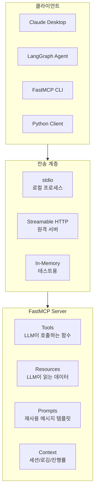
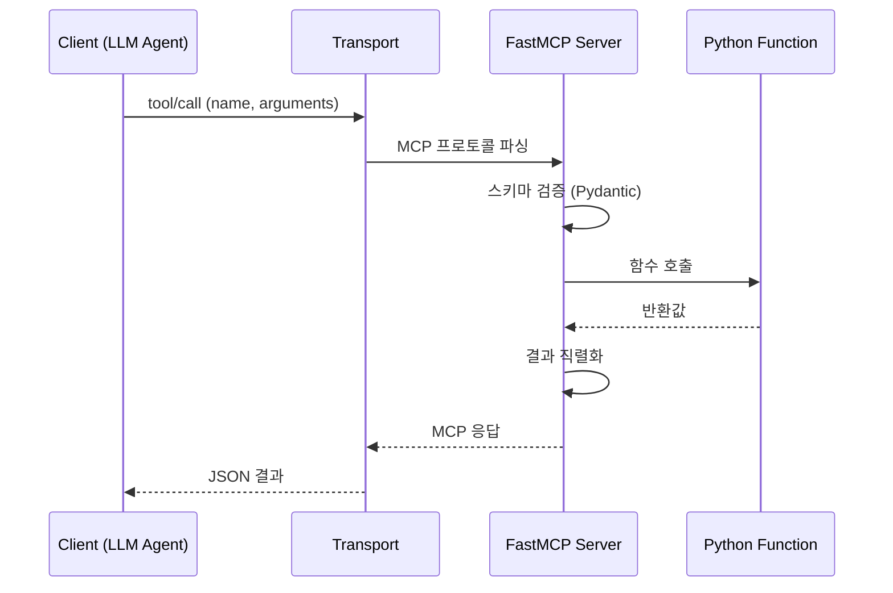
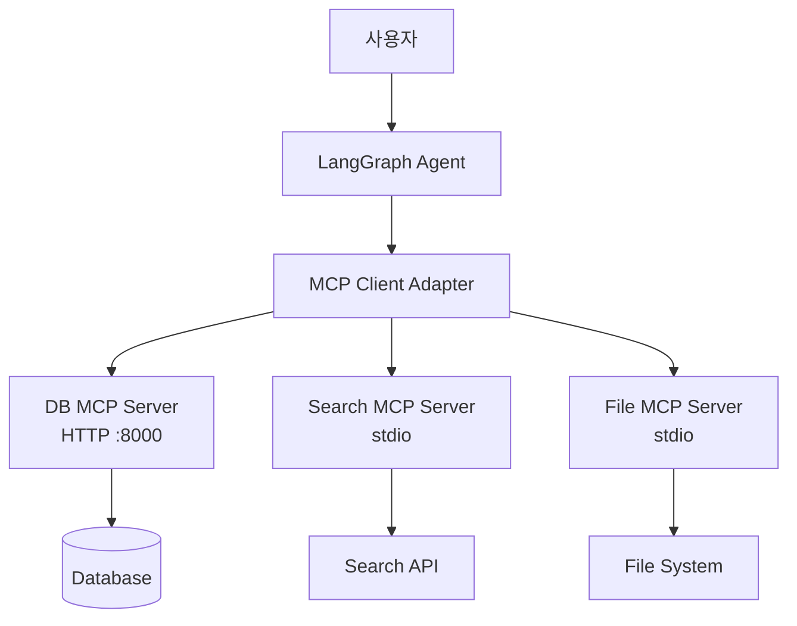

# FastMCP 가이드

> **공식 문서:** https://gofastmcp.com

---

## 1. 개요

### MCP란?

**MCP(Model Context Protocol)**는 Anthropic이 2024년 공개한 AI 도구 연결 표준이다. "AI 에이전트의 USB-C"로 불리며, 어떤 AI 에이전트든 MCP 서버에 연결하면 표준화된 방식으로 도구를 사용할 수 있다.


### FastMCP란?

**FastMCP**는 MCP 서버를 Python 데코레이터 한 줄로 구축하는 프레임워크다.

- **Prefect**가 관리하는 오픈소스 (Apache 2.0)
- 2024년 공식 MCP Python SDK에 편입 → v3.0에서 독립적 진화
- 모든 언어의 MCP 서버 **70%**가 FastMCP 기반
- 일일 **100만 회** 다운로드

### 3가지 기둥

| 기둥 | 역할 |
|------|------|
| **Servers** | Python 함수를 MCP 호환 도구/리소스/프롬프트로 변환 |
| **Clients** | 로컬/원격 MCP 서버에 프로그래밍 방식으로 연결 |
| **Apps** | 대화 내 대화형 UI 제공 |

### 최소 예제

```python
from fastmcp import FastMCP

mcp = FastMCP("Demo")

@mcp.tool
def add(a: int, b: int) -> int:
    """두 수를 더합니다"""
    return a + b

if __name__ == "__main__":
    mcp.run()
```

이것만으로 MCP 서버가 실행되고, Claude Desktop이나 LangGraph에서 `add` 도구를 호출할 수 있다.

---

## 2. 설치

```bash
# uv 사용 (권장)
uv pip install fastmcp

# pip 사용
pip install fastmcp

# LangGraph 연동용
pip install langchain-mcp-adapters

# 버전 확인
fastmcp version
```

---

## 3. 아키텍처



### 요청 처리 흐름



---

## 4. Tools — 도구 정의

### 개념

Tool은 **LLM이 호출하는 함수**다. `@mcp.tool` 데코레이터를 붙이면 타입 힌트와 docstring에서 **스키마가 자동 생성**된다. JSON Schema, 입력 검증, 에러 처리가 전부 자동.

### 기본 사용법

```python
@mcp.tool
def get_weather(city: str, unit: str = "celsius") -> str:
    """도시의 현재 날씨를 조회합니다.

    Args:
        city: 도시 이름 (한글 가능)
        unit: 온도 단위 (celsius 또는 fahrenheit)
    """
    return f"{city}: 22°{unit[0].upper()}, 맑음"
```

이것만으로 LLM은:
- `get_weather`라는 도구가 있다는 걸 알고
- `city`(필수), `unit`(선택)이 필요하다는 걸 알고
- 자동으로 호출할 수 있다

### 타입 지원

Pydantic이 지원하는 모든 타입 사용 가능:

```python
from pydantic import BaseModel
from enum import Enum

class Priority(str, Enum):
    HIGH = "high"
    MEDIUM = "medium"
    LOW = "low"

class TaskInput(BaseModel):
    title: str
    priority: Priority
    tags: list[str] = []

@mcp.tool
def create_task(task: TaskInput) -> dict:
    """작업을 생성합니다"""
    return {"id": 1, "title": task.title, "priority": task.priority}
```

### 비동기 함수

```python
@mcp.tool
async def fetch_data(url: str) -> str:
    """외부 API에서 데이터를 가져옵니다"""
    async with httpx.AsyncClient() as client:
        response = await client.get(url)
        return response.text
```

동기 함수는 자동으로 threadpool에서 실행되어 이벤트 루프를 차단하지 않는다.

### 반환값 유형

| 반환 타입 | 처리 |
|---------|------|
| `str` | 텍스트로 전송 |
| `bytes` | Base64 인코딩 |
| `dict` / Pydantic Model | JSON 직렬화 |
| `Image` | 이미지 콘텐츠 |
| `ToolResult` | 구조화된 출력 (v3.0+) |

### 에러 처리

```python
from fastmcp.exceptions import ToolError

@mcp.tool
def divide(a: float, b: float) -> float:
    """나눗셈"""
    if b == 0:
        raise ToolError("0으로 나눌 수 없습니다")
    return a / b
```

### 의존성 주입 (Depends)

LLM에게 노출하지 않을 파라미터를 주입:

```python
from fastmcp import Depends

def get_db_session():
    return create_session()

@mcp.tool
def query_users(name: str, db = Depends(get_db_session)) -> list:
    """사용자를 검색합니다 (LLM은 name만 입력)"""
    return db.query(User).filter(User.name == name).all()
```

### 파라미터 검증

```python
from pydantic import Field

@mcp.tool
def search(
    query: str = Field(description="검색어", min_length=1),
    limit: int = Field(default=10, ge=1, le=100, description="결과 수")
) -> list:
    """검색합니다"""
    ...
```

---

## 5. Resources — 데이터 노출

### 개념

Resource는 **LLM이 읽을 수 있는 데이터**다. Tool과 달리 "실행"이 아닌 "조회" 성격.

### 기본 사용법

```python
@mcp.resource("config://app-settings")
def get_settings() -> str:
    """애플리케이션 설정을 제공합니다"""
    return json.dumps({"debug": False, "version": "1.0"})
```

### 리소스 템플릿 (동적 URI)

```python
@mcp.resource("users://{user_id}/profile")
def get_user_profile(user_id: str) -> str:
    """사용자 프로필을 조회합니다"""
    user = db.get_user(user_id)
    return json.dumps({"name": user.name, "email": user.email})
```

클라이언트가 `users://123/profile`로 요청하면 `user_id="123"`으로 함수가 호출된다.

### 와일드카드 (v2.2.4+)

```python
@mcp.resource("file://{path*}")
def read_file(path: str) -> str:
    """파일 내용을 읽습니다 (하위 경로 포함)"""
    return Path(path).read_text()
```

`file://docs/api/guide.md` 같은 다중 경로 세그먼트도 매칭.

### 정적 리소스

```python
from fastmcp.resources import FileResource

mcp.add_resource(FileResource(
    uri="file://README.md",
    path=Path("./README.md"),
    mime_type="text/markdown"
))
```

---

## 6. Prompts — 메시지 템플릿

### 개념

Prompt는 **재사용 가능한 메시지 템플릿**이다. LLM에게 구조화된 지시를 제공할 때 사용.

### 기본 사용법

```python
@mcp.prompt
def code_review(code: str, language: str = "python") -> str:
    """코드 리뷰를 요청하는 프롬프트"""
    return f"""다음 {language} 코드를 리뷰해주세요.

```{language}
{code}
```

포인트:
1. 버그 또는 에러 가능성
2. 성능 개선점
3. 가독성"""
```

### 복수 메시지 반환

```python
from fastmcp.prompts import Message

@mcp.prompt
def debug_session(error: str) -> list[Message]:
    """디버깅 세션을 시작합니다"""
    return [
        Message(role="user", content=f"이 에러를 분석해주세요: {error}"),
        Message(role="assistant", content="네, 에러를 분석하겠습니다. 관련 코드를 보여주세요."),
        Message(role="user", content="관련 코드는 다음과 같습니다:"),
    ]
```

---

## 7. Context — 세션 컨텍스트

### 개념

Context는 도구/리소스 함수 내에서 **MCP 세션 정보에 접근**하는 객체다.

### 사용 방법

```python
from fastmcp import Context

@mcp.tool
async def process_data(data: str, ctx: Context) -> str:
    """데이터를 처리합니다 (진행률 보고 포함)"""

    # 로깅
    await ctx.info("처리 시작")
    await ctx.debug(f"데이터 크기: {len(data)}")

    # 진행률 보고
    for i in range(10):
        await ctx.report_progress(i + 1, 10)
        await process_chunk(data[i])

    await ctx.info("처리 완료")
    return "완료"
```

### 주요 기능

| 기능 | 메서드 | 용도 |
|------|--------|------|
| **로깅** | `ctx.debug()`, `ctx.info()`, `ctx.warning()`, `ctx.error()` | 클라이언트에 실행 상태 전달 |
| **진행률** | `ctx.report_progress(current, total)` | 장시간 작업 진행률 |
| **리소스 접근** | `ctx.read_resource(uri)` | 등록된 리소스 읽기 |
| **LLM 샘플링** | `ctx.sample(prompt)` | 클라이언트의 LLM에게 텍스트 생성 요청 |
| **사용자 입력** | `ctx.elicit(schema)` | 대화형 사용자 입력 요청 (v3.0+) |
| **세션 상태** | `ctx.session[key]` | 요청 간 데이터 유지 |

### LLM 샘플링

```python
@mcp.tool
async def summarize_and_translate(text: str, ctx: Context) -> str:
    """텍스트를 요약한 후 번역합니다"""
    summary = await ctx.sample(f"다음을 3줄로 요약해주세요:\n{text}")
    translation = await ctx.sample(f"다음을 영어로 번역해주세요:\n{summary}")
    return translation
```

---

## 8. 전송 모드 (Transport)

MCP 서버와 클라이언트 간의 통신 방식.

| 모드 | 용도 | 명령어 |
|------|------|--------|
| **stdio** | 로컬 프로세스, Claude Desktop 연동 | `mcp.run(transport="stdio")` |
| **Streamable HTTP** | 원격 서버, 프로덕션 | `mcp.run(transport="streamable-http", port=8000)` |
| **SSE** (레거시) | HTTP 서버 (하위 호환) | `mcp.run(transport="sse")` |
| **In-Memory** | 테스트, 같은 프로세스 | `Client(server)` 직접 전달 |

### stdio 실행

```bash
# CLI로 실행
fastmcp run my_server.py

# Python 코드에서
if __name__ == "__main__":
    mcp.run()  # 기본값이 stdio
```

### HTTP 실행

```bash
# CLI로 실행
fastmcp run my_server.py --transport streamable-http --port 8000

# Python 코드에서
mcp.run(transport="streamable-http", host="0.0.0.0", port=8000)
```

### Claude Desktop 연동

```json
{
  "mcpServers": {
    "my-server": {
      "command": "fastmcp",
      "args": ["run", "/path/to/my_server.py"]
    }
  }
}
```

---

## 9. Client — 서버 연결

### 기본 사용법

```python
from fastmcp import Client

client = Client("http://localhost:8000/mcp")

async with client:
    # 도구 목록 조회
    tools = await client.list_tools()

    # 도구 호출
    result = await client.call_tool("add", {"a": 1, "b": 2})
    print(result)  # 3

    # 리소스 읽기
    data = await client.read_resource("config://app-settings")

    # 프롬프트 렌더링
    messages = await client.get_prompt("code_review", {"code": "x = 1"})
```

### 연결 방식

```python
# 인메모리 (테스트용)
client = Client(mcp_server_instance)

# stdio (서브프로세스)
client = Client("my_server.py")

# HTTP (원격)
client = Client("http://api.example.com/mcp")
```

---

## 10. 서버 합성 (Composition)

여러 MCP 서버를 하나로 합치는 기능.

### mount()

```python
from fastmcp import FastMCP

# 개별 서버 정의
weather_server = FastMCP("Weather")
db_server = FastMCP("Database")

@weather_server.tool
def get_weather(city: str) -> str:
    return f"{city}: 맑음"

@db_server.tool
def query(sql: str) -> str:
    return "결과"

# 합성
app = FastMCP("Main")
app.mount("weather", weather_server)
app.mount("db", db_server)

# weather_get_weather, db_query로 접근 가능
```

### 네임스페이싱 (v3.0+)

mount 시 자동으로 접두사가 붙어 이름 충돌 방지:
- 도구: `weather_get_weather`
- 리소스: `data://weather/forecast`

### 외부 서버 마운트

```python
from fastmcp import Client

# 원격 HTTP 서버를 프록시로 마운트
external = Client("http://api.example.com/mcp")
app.mount("external", external)
```

---

## 11. Docker 설치

### Dockerfile

```dockerfile
FROM python:3.12-slim

WORKDIR /app

COPY requirements.txt .
RUN pip install --no-cache-dir -r requirements.txt

COPY . .

EXPOSE 8000

CMD ["fastmcp", "run", "server.py", "--transport", "streamable-http", "--host", "0.0.0.0", "--port", "8000"]
```

### docker-compose.yml

```yaml
version: '3.8'

services:
  mcp-server:
    build: .
    container_name: mcp-server
    ports:
      - "8000:8000"
    environment:
      - DATABASE_URL=postgresql://user:pw@db:5432/mydb
      - OPENAI_API_KEY=${OPENAI_API_KEY}
    volumes:
      - ./server.py:/app/server.py
    restart: unless-stopped

  # Oracle DB 연결 시
  mcp-server-oracle:
    build: .
    container_name: mcp-oracle
    ports:
      - "8001:8000"
    environment:
      - ORACLE_DSN=host:1521/service
      - ORACLE_USER=reader
      - ORACLE_PASSWORD=${ORACLE_PASSWORD}
```

---

## 12. LangGraph 연동

### langchain-mcp-adapters

```python
from langchain_mcp_adapters.client import MultiServerMCPClient
from langgraph.prebuilt import create_react_agent
from langchain_openai import ChatOpenAI

# MCP 서버 연결
async with MultiServerMCPClient({
    "db": {
        "url": "http://localhost:8000/mcp",
        "transport": "streamable_http"
    },
    "search": {
        "command": "fastmcp",
        "args": ["run", "search_server.py"],
        "transport": "stdio"
    }
}) as client:

    # MCP 도구를 LangGraph Agent에 연결
    tools = client.get_tools()
    agent = create_react_agent(ChatOpenAI(model="gpt-4.1-mini"), tools)

    result = await agent.ainvoke({
        "messages": [{"role": "user", "content": "매출 상위 5개 팀을 알려줘"}]
    })
```

### 아키텍처



---

## 13. 실전 예시: DB 조회 MCP 서버

```python
from fastmcp import FastMCP, Context
import oracledb

mcp = FastMCP("DB Query Server")

def get_connection():
    return oracledb.connect(
        user="reader",
        password="pw",
        dsn="host:1521/service"
    )

@mcp.tool
async def query_table(
    table_name: str,
    columns: list[str] = None,
    where: str = None,
    limit: int = 100,
    ctx: Context = None,
) -> list[dict]:
    """테이블 데이터를 조회합니다.

    Args:
        table_name: 조회할 테이블명
        columns: 조회할 컬럼 목록 (없으면 전체)
        where: WHERE 조건절
        limit: 최대 행 수
    """
    cols = ", ".join(columns) if columns else "*"
    sql = f"SELECT {cols} FROM {table_name}"
    if where:
        sql += f" WHERE {where}"
    sql += f" FETCH FIRST {limit} ROWS ONLY"

    if ctx:
        await ctx.info(f"실행 SQL: {sql}")

    conn = get_connection()
    cursor = conn.cursor()
    cursor.execute(sql)

    col_names = [desc[0] for desc in cursor.description]
    rows = [dict(zip(col_names, row)) for row in cursor.fetchall()]

    cursor.close()
    conn.close()
    return rows

@mcp.resource("schema://{table_name}")
def get_table_schema(table_name: str) -> str:
    """테이블 스키마를 조회합니다"""
    conn = get_connection()
    cursor = conn.cursor()
    cursor.execute(f"""
        SELECT column_name, data_type, nullable
        FROM all_tab_columns
        WHERE table_name = UPPER(:1)
        ORDER BY column_id
    """, [table_name])

    columns = [{"name": r[0], "type": r[1], "nullable": r[2]} for r in cursor.fetchall()]
    cursor.close()
    conn.close()
    return json.dumps(columns, indent=2)

if __name__ == "__main__":
    mcp.run(transport="streamable-http", host="0.0.0.0", port=8000)
```

---

## 14. 주의사항 및 한계

| 항목 | 내용 |
|------|------|
| **보안** | Tool에서 SQL을 직접 실행하면 인젝션 위험. 파라미터 바인딩 필수 |
| **상태 관리** | Context는 요청마다 새로 생성됨. 세션 간 상태는 `ctx.session` 사용 |
| **동기 함수** | threadpool에서 실행되지만 CPU 집약 작업은 별도 프로세스 권장 |
| **타임아웃** | 기본 타임아웃 없음. `@mcp.tool(timeout=30)` 명시 권장 |
| **인증** | MCP 프로토콜 자체에 인증 없음. HTTP 전송 시 별도 미들웨어 필요 |
| **프로덕션** | Streamable HTTP 모드에서 리버스 프록시 (nginx) 뒤에 배치 권장 |

---

## 15. 참고

| 항목 | URL |
|------|-----|
| 공식 문서 | https://gofastmcp.com |
| GitHub | https://github.com/jlowin/fastmcp |
| MCP 스펙 | https://spec.modelcontextprotocol.io |
| langchain-mcp-adapters | https://github.com/langchain-ai/langchain-mcp-adapters |
| Claude Desktop MCP 설정 | https://modelcontextprotocol.io/quickstart/user |

---

## 변경 이력

| 날짜 | 내용 |
|------|------|
| 2026-04-26 | 공식 문서 기반 전면 재작성 (v3.2) |
