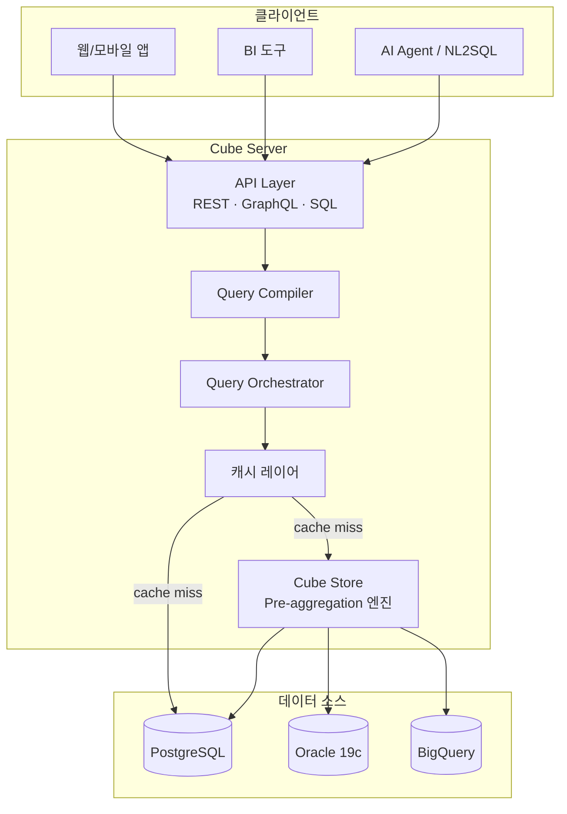
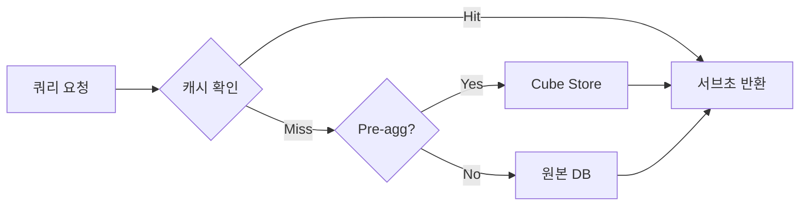
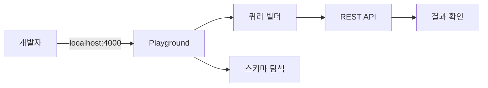
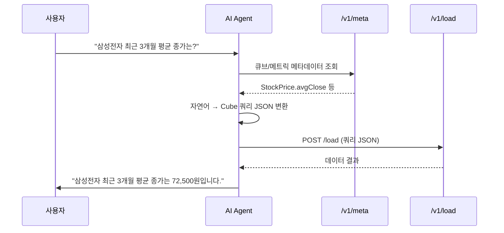

# Cube.js 개념 및 사용 가이드

---

## 1. 개요

### Cube.js란 무엇인가

Cube.js는 **Headless BI** 플랫폼이자 **시맨틱 레이어(Semantic Layer)** 엔진이다.
데이터 웨어하우스 위에 비즈니스 메트릭(Measure)과 차원(Dimension)을 코드로 정의하고,
REST / GraphQL / SQL API를 통해 모든 애플리케이션에 일관된 데이터를 제공한다.

### 핵심 가치

| 가치 | 설명 |
|------|------|
| **SSOT** | 메트릭 정의를 한 곳에서 관리. 대시보드마다 다른 계산식 문제 해소 |
| **Headless** | 특정 시각화 도구에 종속되지 않음. React, Tableau, Metabase 등 어디서든 소비 |
| **캐싱** | Pre-aggregation과 Cube Store로 대규모 데이터도 서브초 응답 |
| **거버넌스** | 접근 제어, 멀티테넌시, 감사 로그를 API 레벨에서 제공 |

### 라이선스

- **Cube Core**: MIT 라이선스 (오픈소스)
- **Cube Cloud**: 매니지드 서비스 (유료). 모니터링, 자동 스케일링, 팀 협업 기능 추가

---

## 2. 아키텍처



### 주요 컴포넌트

- **Cube Store**: Rust로 작성된 고성능 분석 엔진. Pre-aggregation 결과를 Parquet으로 저장하여 원본 DB 부하 최소화
- **API Layer**: REST(4000), GraphQL(4000), SQL API(15432, Postgres 호환)
- **캐싱**: In-memory(TTL 6시간) + Pre-aggregation(Cube Store 물리 저장) + Refresh Key(변경 감지)



---

## 3. 핵심 개념

### 3-1. Data Model (큐브 정의)

큐브(Cube)는 시맨틱 레이어의 기본 단위로, 하나의 테이블을 감싸고 measures/dimensions/joins를 선언한다.

**JavaScript 방식:**

```javascript
cube(`StockPrice`, {
  sql: `SELECT * FROM stock_price_1d`,
  title: `일봉 시세`,
  measures: {
    count: { type: `count` },
    avgClose: { sql: `close_price`, type: `avg`, title: `평균 종가` },
  },
  dimensions: {
    ticker: { sql: `ticker`, type: `string`, title: `종목코드` },
    tradeDate: { sql: `trade_date`, type: `time`, title: `거래일` },
  },
});
```

**YAML 방식:**

```yaml
cubes:
  - name: StockPrice
    sql: "SELECT * FROM stock_price_1d"
    measures:
      - name: avgClose
        sql: close_price
        type: avg
    dimensions:
      - name: ticker
        sql: ticker
        type: string
```

JavaScript는 동적 로직에 유리하고, YAML은 가독성이 높다.

### 3-2. Measures (측정값)

| 타입 | SQL 대응 | 타입 | SQL 대응 |
|------|----------|------|----------|
| `count` | `COUNT(*)` | `countDistinct` | `COUNT(DISTINCT)` |
| `sum` | `SUM()` | `countDistinctApprox` | DB별 HLL |
| `avg` | `AVG()` | `runningTotal` | window function |
| `min` / `max` | `MIN()` / `MAX()` | | |

**계산된 Measure** -- 다른 measure를 참조:

```javascript
measures: {
  totalAssets: { sql: `total_assets`, type: `sum` },
  totalLiabilities: { sql: `total_liabilities`, type: `sum` },
  debtRatio: {
    sql: `${totalLiabilities} / NULLIF(${totalAssets}, 0)`,
    type: `number`,
    title: `부채비율`,
  },
},
```

**필터된 Measure** -- 조건부 집계:

```javascript
measures: {
  kospiCount: {
    sql: `ticker`, type: `count`, title: `KOSPI 종목 수`,
    filters: [{ sql: `${CUBE}.market = 'KOSPI'` }],
  },
},
```

### 3-3. Dimensions (차원)

| 타입 | 예시 | 타입 | 예시 |
|------|------|------|------|
| `string` | 종목명, 시장구분 | `boolean` | 거래정지 여부 |
| `number` | PER, PBR | `geo` | 위도/경도 |
| `time` | 거래일, 공시일 | | |

```javascript
cube(`StockInfo`, {
  sql: `SELECT * FROM stock_info`,
  dimensions: {
    ticker: { sql: `ticker`, type: `string`, primaryKey: true },
    companyName: { sql: `company_name`, type: `string`, title: `회사명` },
    market: { sql: `market`, type: `string`, title: `시장구분` },
    listedDate: { sql: `listed_date`, type: `time`, title: `상장일` },
    // 계산된 dimension
    marketCapBillion: { sql: `market_cap / 100000000`, type: `number`, title: `시가총액(억)` },
  },
});
```

**서브쿼리 Dimension** -- 다른 큐브의 measure를 dimension으로 참조:

```javascript
dimensions: {
  latestClose: {
    sql: `${StockPrice.avgClose}`, type: `number`, subQuery: true, title: `최근 종가`,
  },
},
```

### 3-4. Joins (조인)

| 타입 | 관계 | 설명 |
|------|------|------|
| `belongsTo` | N:1 | fan-out 없음 (가장 안전) |
| `hasMany` | 1:N | fan-out 주의 |
| `hasOne` | 1:1 | LEFT JOIN |

```javascript
cube(`StockPrice`, {
  sql: `SELECT * FROM stock_price_1d`,
  joins: {
    StockInfo: {
      relationship: `belongsTo`,
      sql: `${CUBE}.ticker = ${StockInfo}.ticker`,
    },
  },
  // ...measures, dimensions...
});

cube(`ConsensusEstimates`, {
  sql: `SELECT * FROM consensus_estimates`,
  joins: {
    StockInfo: {
      relationship: `belongsTo`,
      sql: `${CUBE}.stock_code = ${StockInfo}.ticker`,
    },
  },
  measures: {
    avgTargetPrice: { sql: `target_price`, type: `avg`, title: `평균 목표주가` },
    analystCount: { sql: `analyst_count`, type: `max`, title: `추정 기관수` },
  },
  dimensions: {
    stockCode: { sql: `stock_code`, type: `string` },
    estimateDate: { sql: `estimate_date`, type: `time` },
  },
});
```

### 3-5. Pre-aggregations (사전 집계)

자주 사용되는 쿼리 패턴을 미리 집계하여 Cube Store에 저장한다.

```javascript
preAggregations: {
  dailySummary: {
    type: `rollup`,
    measures: [avgClose, avgVolume],
    dimensions: [ticker],
    timeDimension: tradeDate,
    granularity: `day`,
    partitionGranularity: `month`,
    refreshKey: {
      every: `1 hour`,
      sql: `SELECT MAX(trade_date) FROM stock_price_1d`,
    },
    buildRangeStart: { sql: `SELECT DATE '2020-01-01'` },
    buildRangeEnd: { sql: `SELECT CURRENT_DATE` },
  },
},
```

**타입**: `rollup`(기본), `rollupJoin`(크로스 큐브), `rollupLambda`(배치+실시간 결합), `originalSql`(원본 캐싱).
**갱신**: 주기 기반(`every: '1 hour'`), SQL 기반(`sql: 'SELECT MAX(updated_at)...'`), 또는 결합.

### 3-6. Segments (세그먼트)

재사용 가능한 필터 조건이다.

```javascript
segments: {
  kospiOnly: { sql: `${CUBE}.market = 'KOSPI'`, title: `KOSPI 종목` },
  largeCap: { sql: `${CUBE}.market_cap >= 10000000000000`, title: `대형주` },
},
```

API 호출 시: `"segments": ["StockInfo.kospiOnly", "StockInfo.largeCap"]`

---

## 4. 데이터 소스 연결

### 4-1. 지원 DB 목록

| 카테고리 | DB |
|----------|-----|
| **관계형** | PostgreSQL, MySQL, MS SQL, Oracle, MariaDB, SQLite |
| **클라우드 DW** | BigQuery, Snowflake, Redshift, Athena, Databricks |
| **분석 엔진** | ClickHouse, Druid, Trino/Presto, DuckDB |

### 4-2. Oracle 연결 설정

Oracle은 community-supported 드라이버를 사용한다. Oracle 19c는 node-oracledb 6.x가 공식 지원한다.

```bash
CUBEJS_DB_TYPE=oracle
CUBEJS_DB_HOST=oracle-host.example.com
CUBEJS_DB_PORT=1521
CUBEJS_DB_NAME=ORCL
CUBEJS_DB_USER=cube_reader
CUBEJS_DB_PASS=<비밀값>
LD_LIBRARY_PATH=/opt/oracle/instantclient_19_20
```

`package.json`에 `"oracledb": "^6.3.0"` 추가 필요. Instant Client 19.x 설치 필수.

### 4-3. PostgreSQL 연결 설정

```bash
CUBEJS_DB_TYPE=postgres
CUBEJS_DB_HOST=bip-postgres
CUBEJS_DB_PORT=5432
CUBEJS_DB_NAME=stockdb
CUBEJS_DB_USER=cube_reader
CUBEJS_DB_PASS=<비밀값>
# SSL: CUBEJS_DB_SSL=true
```

### 4-4. 기타 DB

```bash
# BigQuery
CUBEJS_DB_TYPE=bigquery
CUBEJS_DB_BQ_PROJECT_ID=my-project
CUBEJS_DB_BQ_KEY_FILE=/path/to/keyfile.json

# Snowflake
CUBEJS_DB_TYPE=snowflake
CUBEJS_DB_SNOWFLAKE_ACCOUNT=abc12345.us-east-1
CUBEJS_DB_SNOWFLAKE_WAREHOUSE=COMPUTE_WH
```

---

## 5. API

### 5-1. REST API

#### 쿼리 실행: `POST /cubejs-api/v1/load`

```bash
curl -X POST http://localhost:4000/cubejs-api/v1/load \
  -H "Content-Type: application/json" \
  -H "Authorization: Bearer <API_TOKEN>" \
  -d '{
    "query": {
      "measures": ["StockPrice.avgClose"],
      "dimensions": ["StockPrice.ticker", "StockInfo.companyName"],
      "timeDimensions": [{
        "dimension": "StockPrice.tradeDate",
        "dateRange": ["2026-01-01", "2026-03-31"],
        "granularity": "month"
      }],
      "filters": [{
        "member": "StockInfo.market",
        "operator": "equals",
        "values": ["KOSPI"]
      }],
      "order": { "StockPrice.avgClose": "desc" },
      "limit": 10
    }
  }'
```

**응답:**

```json
{
  "data": [
    {
      "StockPrice.ticker": "005930",
      "StockInfo.companyName": "삼성전자",
      "StockPrice.avgClose": 72500,
      "StockPrice.tradeDate.month": "2026-01-01T00:00:00.000"
    }
  ],
  "lastRefreshTime": "2026-04-18T06:30:00.000Z",
  "annotation": {
    "measures": {
      "StockPrice.avgClose": { "title": "평균 종가", "type": "number" }
    }
  }
}
```

#### 쿼리 필드

| 필드 | 설명 | 필드 | 설명 |
|------|------|------|------|
| `measures` | 집계 측정값 | `order` | 정렬 (`asc`/`desc`) |
| `dimensions` | 그룹화 차원 | `limit` / `offset` | 페이지네이션 |
| `filters` | 필터 조건 | `segments` | 세그먼트 |
| `timeDimensions` | 시간 차원 | | |

**필터 연산자**: `equals`, `notEquals`, `contains`, `notContains`, `gt`, `gte`, `lt`, `lte`, `set`, `notSet`, `inDateRange`, `beforeDate`, `afterDate`

**메타데이터**: `GET /cubejs-api/v1/meta` -- 모든 큐브의 measures/dimensions/segments 반환. NL2SQL 에이전트 활용.

### 5-2. GraphQL API

데이터 모델로부터 스키마를 자동 생성한다.

```graphql
query {
  cube {
    stockPrice(
      where: { StockInfo: { market: { equals: "KOSPI" } } }
      orderBy: { avgClose: desc }
      limit: 5
    ) {
      ticker
      avgClose
      StockInfo { companyName }
    }
  }
}
```

### 5-3. SQL API (Postgres 호환)

```bash
# 활성화: CUBEJS_PG_SQL_PORT=15432
psql -h localhost -p 15432 -U cube
```

```sql
SELECT ticker, AVG(close_price) AS avg_close
FROM StockPrice
WHERE "StockInfo.market" = 'KOSPI'
GROUP BY 1 ORDER BY avg_close DESC LIMIT 10;
```

BI 도구(Metabase, Tableau, DBeaver)에서 Postgres 커넥터로 직접 연결 가능.

---

## 6. Docker 컨테이너 설치

### 6-1. 기본 설치 (PostgreSQL)

```yaml
version: "3.8"

services:
  cube:
    image: cubejs/cube:v0.36
    container_name: bip-cube
    ports:
      - "4000:4000"    # REST/GraphQL + Playground
      - "15432:15432"  # SQL API
    environment:
      CUBEJS_API_SECRET: "${CUBEJS_API_SECRET}"
      CUBEJS_DEV_MODE: "true"
      CUBEJS_DB_TYPE: "postgres"
      CUBEJS_DB_HOST: "bip-postgres"
      CUBEJS_DB_PORT: "5432"
      CUBEJS_DB_NAME: "stockdb"
      CUBEJS_DB_USER: "${CUBEJS_DB_USER}"
      CUBEJS_DB_PASS: "${CUBEJS_DB_PASS}"
      CUBEJS_PG_SQL_PORT: "15432"
      CUBEJS_CUBESTORE_HOST: "cubestore"
      CUBEJS_CACHE_AND_QUEUE_DRIVER: "memory"
    volumes:
      - ./cube/schema:/cube/conf/schema
      - ./cube/cube.js:/cube/conf/cube.js
    networks:
      - bip-network
    restart: unless-stopped
    healthcheck:
      test: ["CMD", "curl", "-f", "http://localhost:4000/readyz"]
      interval: 30s
      timeout: 10s
      retries: 3

  cubestore:
    image: cubejs/cubestore:v0.36
    container_name: bip-cubestore
    environment:
      CUBESTORE_REMOTE_DIR: "/cube/data"
    volumes:
      - cubestore_data:/cube/data
    networks:
      - bip-network
    restart: unless-stopped

volumes:
  cubestore_data:

networks:
  bip-network:
    external: true
```

`.env` (비밀값은 플레이스홀더만):
```bash
CUBEJS_API_SECRET=<플레이스홀더-32자-이상-랜덤-문자열>
CUBEJS_DB_USER=cube_reader
CUBEJS_DB_PASS=<플레이스홀더>
```

### 6-2. Oracle 19c 연결 설치

**Dockerfile.oracle:**
```dockerfile
FROM cubejs/cube:v0.36

RUN apt-get update && apt-get install -y libaio1 wget unzip \
    && rm -rf /var/lib/apt/lists/*

RUN mkdir -p /opt/oracle && cd /opt/oracle \
    && wget https://download.oracle.com/otn_software/linux/instantclient/1920000/instantclient-basic-linux.x64-19.20.0.0.0dbru.zip \
    && unzip instantclient-basic-linux.x64-19.20.0.0.0dbru.zip && rm *.zip

ENV LD_LIBRARY_PATH=/opt/oracle/instantclient_19_20:$LD_LIBRARY_PATH
RUN npm install oracledb@6.3.0
```

**docker-compose.oracle.yml:**
```yaml
version: "3.8"

services:
  cube-oracle:
    build:
      context: .
      dockerfile: Dockerfile.oracle
    container_name: bip-cube-oracle
    ports:
      - "4000:4000"
      - "15432:15432"
    environment:
      CUBEJS_API_SECRET: "${CUBEJS_API_SECRET}"
      CUBEJS_DEV_MODE: "true"
      CUBEJS_DB_TYPE: "oracle"
      CUBEJS_DB_HOST: "${ORACLE_DB_HOST}"
      CUBEJS_DB_PORT: "1521"
      CUBEJS_DB_NAME: "${ORACLE_DB_SID}"
      CUBEJS_DB_USER: "${ORACLE_DB_USER}"
      CUBEJS_DB_PASS: "${ORACLE_DB_PASS}"
      CUBEJS_CUBESTORE_HOST: "cubestore"
      CUBEJS_PG_SQL_PORT: "15432"
    volumes:
      - ./cube/schema:/cube/conf/schema
    networks:
      - bip-network
    depends_on:
      - cubestore

  cubestore:
    image: cubejs/cubestore:v0.36
    container_name: bip-cubestore
    environment:
      CUBESTORE_REMOTE_DIR: "/cube/data"
    volumes:
      - cubestore_data:/cube/data
    networks:
      - bip-network

volumes:
  cubestore_data:

networks:
  bip-network:
    external: true
```

### 6-3. 시작 및 확인

```bash
# 실행
docker compose -f docker-compose.cube.yml up -d    # PostgreSQL
docker compose -f docker-compose.oracle.yml up -d   # Oracle

# 헬스체크
curl http://localhost:4000/readyz

# 메타데이터 확인
curl http://localhost:4000/cubejs-api/v1/meta \
  -H "Authorization: Bearer <API_TOKEN>" | jq '.cubes | length'

# Playground: 브라우저에서 http://localhost:4000 접속
# (CUBEJS_DEV_MODE=true 일 때 활성화)
```



---

## 7. 시맨틱 모델 작성법

### 7-1. 파일 구조

```
cube/
  schema/
    cubes/
      StockInfo.js
      StockPrice.js
      FinancialStatements.js
      ConsensusEstimates.js
    views/
      StockOverview.js         # 여러 큐브를 결합한 읽기 전용 뷰
  cube.js                      # 커스텀 설정 (보안, 리프레시 등)
```

### 7-2. 기본 큐브 작성 (매출 분석)

```javascript
cube(`FinancialStatements`, {
  sql: `SELECT * FROM financial_statements WHERE sj_div = 'IS'`,
  title: `손익계산서`,

  measures: {
    totalRevenue: { sql: `revenue`, type: `sum`, title: `매출액` },
    operatingProfit: { sql: `operating_profit`, type: `sum`, title: `영업이익` },
    netIncome: { sql: `net_income`, type: `sum`, title: `당기순이익` },
    operatingMargin: {
      sql: `${operatingProfit} / NULLIF(${totalRevenue}, 0) * 100`,
      type: `number`,
      title: `영업이익률(%)`,
    },
  },

  dimensions: {
    ticker: { sql: `ticker`, type: `string` },
    fiscalYear: { sql: `fiscal_year`, type: `string`, title: `회계연도` },
    filingDate: { sql: `filing_date`, type: `time`, title: `공시일` },
  },
});
```

### 7-3. 조인 정의

```javascript
// View: 여러 큐브를 결합한 읽기 전용 인터페이스
view(`StockOverview`, {
  description: `종목 종합 뷰`,
  includes: [
    StockInfo.ticker,
    StockInfo.companyName,
    StockInfo.market,
    StockPrice.avgClose,
    StockPrice.avgVolume,
    ConsensusEstimates.avgTargetPrice,
  ],
});
```

### 7-4. Pre-aggregation 설정

```javascript
preAggregations: {
  dailyByTicker: {
    type: `rollup`,
    measures: [avgClose, avgVolume, count],
    dimensions: [ticker],
    timeDimension: tradeDate,
    granularity: `day`,
    partitionGranularity: `month`,
    refreshKey: { every: `1 hour` },
  },
},
```

### 7-5. 보안 컨텍스트 (멀티테넌시)

```javascript
// cube.js
module.exports = {
  contextToAppId: ({ securityContext }) =>
    `CUBEJS_APP_${securityContext.role}`,

  queryRewrite: (query, { securityContext }) => {
    if (securityContext.role === 'analyst') {
      query.filters.push({
        member: 'StockInfo.market',
        operator: 'equals',
        values: securityContext.allowedMarkets,
      });
    }
    return query;
  },

  scheduledRefreshContexts: async () => [
    { securityContext: { role: 'admin' } },
  ],
};
```

---

## 8. Cube와 NL2SQL 연동

### Agent가 Cube REST API를 호출하는 패턴



### 메트릭 메타데이터를 LLM 프롬프트에 주입

```python
import requests

meta = requests.get(
    "http://localhost:4000/cubejs-api/v1/meta",
    headers={"Authorization": f"Bearer {API_TOKEN}"}
).json()

def build_metric_context(meta):
    lines = []
    for cube in meta["cubes"]:
        lines.append(f"## {cube['name']} ({cube.get('title', '')})")
        for m in cube["measures"]:
            lines.append(f"  Measure: {m['name']} - {m.get('title', '')} ({m['type']})")
        for d in cube["dimensions"]:
            lines.append(f"  Dim: {d['name']} - {d.get('title', '')} ({d['type']})")
    return "\n".join(lines)

system_prompt = f"""주식 데이터 분석 에이전트입니다.
자연어 질문을 Cube.js 쿼리 JSON으로 변환하세요.

사용 가능한 메트릭:
{build_metric_context(meta)}
"""
```

Agent는 LLM이 생성한 Cube 쿼리 JSON으로 `/v1/load`를 호출하고, 결과를 다시 LLM에 전달하여 자연어 답변을 생성한다.

---

## 9. BIP 경험과의 매핑

### WrenAI MDL vs Cube Data Model

| 항목 | WrenAI MDL | Cube.js |
|------|-----------|---------|
| **정의 언어** | JSON/YAML (MDL) | JavaScript / YAML |
| **모델 단위** | Model | Cube |
| **측정값** | Metric (calculated field) | Measure |
| **조인** | Relationship | Join (belongsTo/hasMany/hasOne) |
| **캐싱** | 없음 (DB 직접 쿼리) | Pre-aggregation + Cube Store |
| **SQL 생성** | LLM이 SQL 직접 생성 | Cube가 최적화된 SQL 생성 |
| **보안** | Thread 레벨 | queryRewrite + JWT |

### 전환 매핑

| WrenAI | Cube 환경 대응 |
|--------|---------------|
| SQL Pairs (41개) | Few-shot Examples (자연어 → Cube 쿼리 JSON) |
| Instructions (전역 규칙) | Agent System Prompt |
| MDL Model | `/cubejs-api/v1/meta`에서 자동 추출 |
| Deploy (동기화) | `cube/schema/` 파일 저장 (hot-reload) |
| Gold View | Cube View (`view()` 정의) |

**SQL Pairs 전환 예시:**

```
# WrenAI
Q: "삼성전자 PER은?"  →  SQL: SELECT per FROM v_stock_valuation WHERE ticker='005930.KS'

# Cube Agent
Q: "삼성전자 PER은?"  →  {"measures":["StockValuation.per"],"filters":[{"member":"StockInfo.ticker","operator":"equals","values":["005930"]}]}
```

---

## 10. 주의사항 및 한계

| 항목 | 설명 |
|------|------|
| **Oracle 드라이버** | Community-supported. 버그 수정이 느릴 수 있음. Instant Client 필수 (이미지 ~200MB 추가) |
| **Pre-agg 스토리지** | 데이터 양에 비례하여 디스크 증가. 운영 환경 최소 50GB 권장. `partitionGranularity` 적절히 설정 |
| **실시간 충돌** | 캐싱은 배치 분석에 최적화. 장중 실시간 시세는 `refreshKey.every: '10 second'`(DB 부하 증가) 또는 Cube 우회 직접 조회 |
| **메모리** | 기본 1GB 힙. 복잡한 스키마는 `NODE_OPTIONS=--max-old-space-size=4096` |
| **동시 쿼리** | `CUBEJS_CONCURRENCY` 환경변수로 큐 크기 조정 |
| **스키마 변경** | 개발 모드: hot-reload. 운영: 컨테이너 재시작 필요 |
| **보안** | `CUBEJS_DEV_MODE=true`는 운영에서 반드시 비활성화 (Playground 노출) |

---

## 11. 참고

| 리소스 | URL |
|--------|-----|
| 공식 문서 | <https://cube.dev/docs> |
| GitHub | <https://github.com/cube-js/cube> |
| 데이터 모델 레퍼런스 | <https://cube.dev/docs/reference/data-model> |
| REST API 레퍼런스 | <https://cube.dev/docs/reference/rest-api> |
| Pre-aggregation 가이드 | <https://cube.dev/docs/product/caching/using-pre-aggregations> |
| Docker 배포 | <https://cube.dev/docs/product/deployment/core> |
| Oracle 드라이버 | <https://cube.dev/docs/product/configuration/data-sources/oracle> |

> **BIP 프로젝트 관련 문서:** `docs/guide_wrenai.md`, `docs/nl2sql_project_plan.md`, `docs/wrenai_technical_guide.md`, `docs/data_architecture_review.md`

---

## 변경 이력

| 날짜 | 내용 |
|------|------|
| 2026-04-18 | 초안 작성 |
| 2026-04-22 | 문서 헤더 정리 (작성일/대상 제거) |
