# Cube.js 개념 및 사용 가이드

> **공식 문서:** <https://cube.dev/docs>

---

## 1. 개요 — Cube.js는 왜 필요한가?

### 비유로 이해하기

Cube.js를 한마디로 설명하면 **"BI 도구를 위한 메트릭 표준화 레이어"** 다.
조금 더 친근한 비유를 들면 다음과 같다.

> 회사에 영업, 재무, 마케팅 팀이 각자 엑셀로 "매출"을 계산한다고 상상해보자.
> 영업팀은 부가세 포함, 재무팀은 부가세 제외, 마케팅팀은 환불 차감 전 금액으로 계산한다.
> 회의에서 "지난달 매출 얼마야?" 라고 물으면 세 명이 모두 다른 숫자를 말한다.
>
> Cube.js는 이 회사에 **"매출의 정의는 이거다"** 라고 못박아두는 사전(Dictionary)이다.
> 한 번 정의하면 영업/재무/마케팅이 어떤 도구로 보든 같은 숫자가 나온다.

### 실제 문제 시나리오

같은 회사에서 다음과 같은 일이 흔히 벌어진다.

| 상황 | 발생하는 문제 |
|------|--------------|
| Tableau 대시보드의 "월 매출" | `SUM(amount)` |
| Metabase 대시보드의 "월 매출" | `SUM(amount) WHERE status='paid'` |
| 임원용 PPT 매출 표 | `SUM(amount * 0.9)` (마진 차감) |
| 모바일 앱 통계 화면 | 또 다른 계산식 |

결과: 임원이 "이 달 매출 12억이라며 왜 대시보드는 14억이야?" 하고 묻는다.
한쪽이 틀린 게 아니라 **정의가 통일되지 않은** 것이다.

### Cube.js가 해결하는 것

Cube.js는 데이터 웨어하우스 위에 비즈니스 메트릭(Measure)과 차원(Dimension)을 코드로 정의한다.
정의는 한 곳에 있고(Single Source of Truth), 모든 클라이언트는 REST/GraphQL/SQL API로 같은 정의를 참조한다.

이를 **Headless BI** 또는 **시맨틱 레이어(Semantic Layer)** 라고 부른다.
"Headless"는 시각화 도구(머리)와 메트릭 정의(몸통)를 분리한다는 의미다.

### 핵심 가치 요약

| 가치 | 설명 |
|------|------|
| **SSOT** | 메트릭 정의를 한 곳에서 관리. 대시보드마다 다른 계산식 문제 해소 |
| **Headless** | 특정 시각화 도구에 종속되지 않음. React, Tableau, Metabase 등 어디서든 소비 |
| **캐싱** | Pre-aggregation과 Cube Store로 대규모 데이터도 서브초 응답 |
| **거버넌스** | 접근 제어, 멀티테넌시, 감사 로그를 API 레벨에서 제공 |

### 라이선스

- **Cube Core**: Apache 2.0 라이선스 (오픈소스). 자체 호스팅 가능
- **Cube Cloud**: 매니지드 서비스 (유료). 모니터링, 자동 스케일링, 팀 협업 기능 추가

> 💡 **실무 팁**: BIP처럼 단일 조직 내부 분석용이라면 Cube Core로 충분하다.
> Cube Cloud는 여러 팀이 협업하거나 SLA가 필요한 SaaS형 서비스에 적합하다.

---

## 2. 핵심 가치 — 왜 직접 SQL 쓰지 않고 Cube를 거치는가?

"우리는 SQL 잘 쓰는데 굳이 또 다른 추상화 레이어가 필요한가?" 라는 질문을 자주 받는다.
다음 4가지 시나리오로 답할 수 있다.

### 시나리오 1: BI 도구마다 다른 SQL → 데이터 불일치

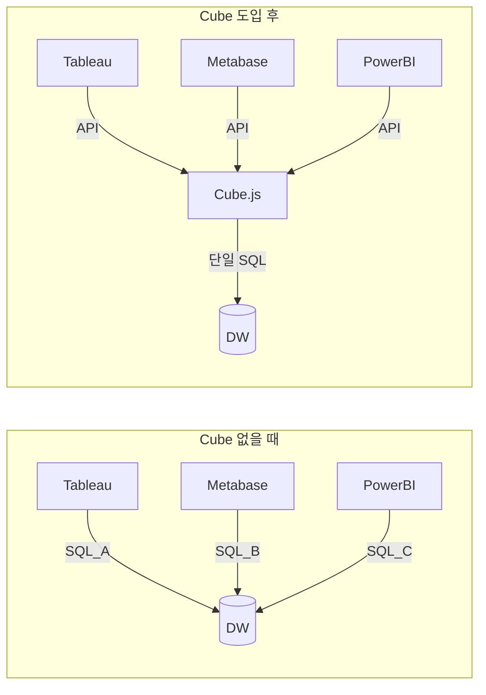

Cube가 없으면 도구마다 SQL을 다시 작성해야 하고, 작성자마다 정의가 달라진다.
Cube를 도입하면 모든 도구가 같은 메트릭 정의를 호출한다.

### 시나리오 2: 분석가 따라 다른 정의 → "매출이 얼마야?" 답이 여러 개

분석가 A는 환불 포함, 분석가 B는 환불 제외, 분석가 C는 부가세 포함으로 매출을 계산한다.
신규 분석가가 들어오면 또 다른 정의를 만든다.

Cube에서는 `revenue` measure를 한 번 정의하고, 모두 그것을 사용한다.
정의를 바꾸려면 한 줄만 수정하면 모든 대시보드가 같이 업데이트된다.

### 시나리오 3: API 클라이언트가 SQL 직접 작성 → 보안/성능 위험

웹/모바일 앱이 직접 DB에 SQL을 쏘면 다음 위험이 있다.

- **SQL Injection**: 클라이언트 입력이 그대로 SQL이 됨
- **풀스캔 쿼리**: `SELECT *` 같은 무분별한 조회로 DB 다운
- **무한 JOIN**: 8개 테이블 조인이 클라이언트 코드에 박혀 있음

Cube를 거치면 클라이언트는 JSON 쿼리만 보내고, Cube가 안전한 SQL을 생성한다.

### 시나리오 4: 모바일/웹/내부도구 동일 메트릭 필요 → 또 SQL 작성

같은 "오늘의 매출"을 모바일 앱, 웹 대시보드, 내부 어드민 페이지에서 각각 보여줘야 한다.
SQL을 3번 작성하면 3번 다 다르게 작성될 수 있다.

Cube에서는 `Orders.totalRevenue`를 한 번 정의하고, 세 클라이언트 모두 같은 measure를 호출한다.

> ⚠️ **함정**: "우리는 작은 팀이라 괜찮다"고 생각하기 쉽지만,
> 메트릭 불일치는 팀 규모가 작을수록 빠르게 자라난다.
> 분석가 2명이 한 달만 일해도 정의가 달라지기 시작한다.

---

## 3. 아키텍처 — Cube가 어떻게 동작하는가?

### 전체 흐름

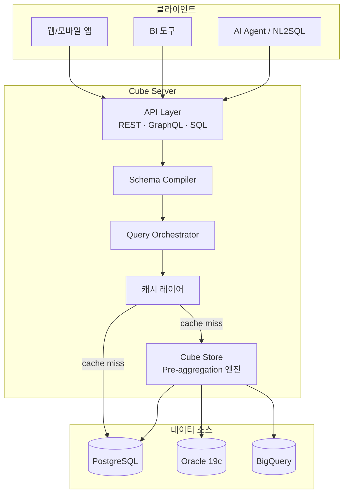

### 단계별 동작 설명

쿼리가 들어오는 순간부터 결과가 반환되기까지 다음 5단계를 거친다.

**1단계 — 사용자 쿼리 수신**

클라이언트는 SQL이 아닌 **JSON 쿼리** 또는 **GraphQL** 형식으로 요청을 보낸다.

```json
{ "measures": ["Orders.revenue"], "dimensions": ["Orders.status"] }
```

API Layer가 인증(JWT) 후 쿼리를 받는다.

**2단계 — Schema Compiler가 모델 참조**

Cube는 메모리에 시맨틱 모델(큐브 정의)을 로드해두고 있다.
요청에서 언급된 `Orders.revenue` measure를 찾아 어떤 SQL로 변환할지 결정한다.

**3단계 — 캐시 확인 (Cache Layer)**

같은 쿼리가 최근에 실행됐다면 결과가 in-memory 캐시에 있다. 있으면 바로 반환(서브초).

**4단계 — Pre-aggregation 확인 (Cube Store)**

캐시 미스 시 Pre-aggregation이 정의된 쿼리인지 확인한다.
정의되어 있다면 Cube Store에 저장된 미리 집계된 결과를 사용한다(원본 DB 부하 0).

**5단계 — 원본 DB 쿼리 (최후의 수단)**

위 모두 미스면 Query Orchestrator가 SQL을 생성하여 원본 DB에 쿼리한다.
결과는 캐시에 저장되어 다음 요청에서 재사용된다.

### 캐시 흐름 다이어그램

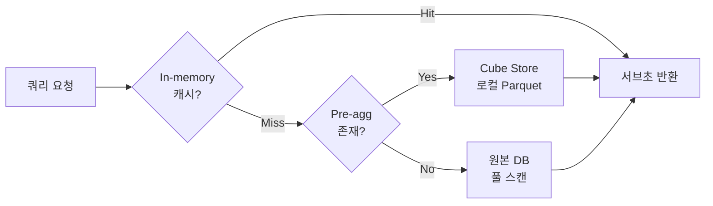

이 3단 캐시 구조 덕분에 Cube가 추가 레이어임에도 불구하고 직접 DB 쿼리보다 빠르다.

### 주요 컴포넌트 역할

| 컴포넌트 | 역할 | 비유 |
|----------|------|------|
| **API Layer** | REST(4000), GraphQL(4000), SQL API(15432) | 식당의 주문 받는 직원 |
| **Schema Compiler** | 큐브 모델을 SQL로 변환 | 메뉴판의 레시피 해석 |
| **Query Orchestrator** | 실제 DB에 쿼리 실행 | 주방장 |
| **Cache Layer** | In-memory 캐시 (TTL 6시간) | 자주 나가는 음식의 미리 만든 분량 |
| **Cube Store** | Rust로 작성된 분석 엔진. Pre-aggregation을 Parquet으로 저장 | 냉장고에 보관된 반찬 |

> 💡 **실무 팁**: Cube Store는 별도 컨테이너로 띄우는 것이 좋다.
> Cube 서버 재시작 시 캐시가 날아가지 않고, 수평 확장도 가능하다.

---

## 4. 핵심 개념 — 각 개념을 비유와 함께

Cube의 데이터 모델은 6가지 기본 개념으로 구성된다. 각각을 비유로 이해하자.

### 4-1. Data Model (큐브) — "엑셀 시트의 정의서"와 같다

#### Why — 왜 큐브로 묶는가

엑셀 파일을 떠올려보자. "주문" 시트, "고객" 시트, "상품" 시트가 각각 있다.
한 시트 안에는 그 주제와 관련된 모든 컬럼과 계산식이 들어 있다.

Cube의 큐브(Cube)는 정확히 이 "한 시트"에 해당한다.
하나의 비즈니스 객체(주문, 고객, 상품)와 그 객체의 측정값/차원을 한 단위로 묶는다.

#### What — 큐브의 구조

큐브는 다음 요소를 포함한다.

- **sql** — 어떤 테이블/뷰를 기반으로 하는가
- **measures** — 어떤 숫자를 계산하는가 (매출, 주문 수)
- **dimensions** — 어떤 기준으로 자르는가 (날짜, 카테고리)
- **joins** — 다른 큐브와 어떻게 연결되는가

#### How — JavaScript 방식

> 아래는 일봉 시세 테이블을 큐브로 정의하는 예시다. measure로 평균 종가를, dimension으로 종목코드와 거래일을 노출한다.

```javascript
cube(`StockPrice`, {
  sql: `SELECT * FROM stock_price_1d`,
  title: `일봉 시세`,
  measures: {
    count: { type: `count` },
    avgClose: { sql: `close_price`, type: `avg`, title: `평균 종가` },
  },
  dimensions: {
    ticker: { sql: `ticker`, type: `string`, title: `종목코드` },
    tradeDate: { sql: `trade_date`, type: `time`, title: `거래일` },
  },
});
```

#### How — YAML 방식

> 같은 정의를 YAML로 작성하면 가독성이 더 높다. 동적 로직이 필요 없으면 YAML을 권장한다.

```yaml
cubes:
  - name: StockPrice
    sql: "SELECT * FROM stock_price_1d"
    measures:
      - name: avgClose
        sql: close_price
        type: avg
    dimensions:
      - name: ticker
        sql: ticker
        type: string
```

> 💡 **실무 팁**: JavaScript는 환경변수나 조건부 로직(예: `if (env === 'prod') ...`) 같은 동적 정의에 유리하다. YAML은 정적 정의에 깔끔하다. BIP처럼 환경별 차이가 적으면 YAML로 시작해도 충분하다.

### 4-2. Measures — "계산되는 숫자"

#### Why — 왜 measure가 필요한가

"이번 달 매출", "고유 고객 수", "평균 주문 단가"처럼 데이터를 보는 사람이 궁금해하는 것은 결국 **숫자 한 개**다.
그 숫자를 만드는 계산식이 measure다.

일반인 표현으로는 **"측정값"** 이라고 부른다.

#### What — 기본 타입

| 타입 | SQL 대응 | 타입 | SQL 대응 |
|------|----------|------|----------|
| `count` | `COUNT(*)` | `countDistinct` | `COUNT(DISTINCT)` |
| `sum` | `SUM()` | `countDistinctApprox` | DB별 HLL |
| `avg` | `AVG()` | `runningTotal` | window function |
| `min` / `max` | `MIN()` / `MAX()` | | |

#### How — 계산된 Measure (다른 measure 참조)

> 부채비율처럼 두 measure를 조합한 비율은 직접 계산식을 쓴다. `${...}` 문법으로 다른 measure를 참조한다.

```javascript
measures: {
  totalAssets: { sql: `total_assets`, type: `sum` },
  totalLiabilities: { sql: `total_liabilities`, type: `sum` },
  debtRatio: {
    sql: `${totalLiabilities} / NULLIF(${totalAssets}, 0)`,
    type: `number`,
    title: `부채비율`,
  },
},
```

#### How — 필터된 Measure (조건부 집계)

> "KOSPI 종목만 카운트" 같은 조건부 집계는 filters로 표현한다. WHERE를 추가하지 않고 measure 자체에 조건을 박는다.

```javascript
measures: {
  kospiCount: {
    sql: `ticker`, type: `count`, title: `KOSPI 종목 수`,
    filters: [{ sql: `${CUBE}.market = 'KOSPI'` }],
  },
},
```

> ⚠️ **함정 — count vs countDistinct**:
> `count` 타입은 `COUNT(*)`로 row 수를 센다. 같은 사용자가 10번 주문하면 10으로 센다.
> "고유 사용자 수"를 원한다면 반드시 `countDistinct`를 사용해야 한다.
> 이를 헷갈리면 모든 대시보드가 부풀려진 숫자를 보여준다.

### 4-3. Dimensions — "데이터를 자르는 기준"

#### Why — 왜 dimension이 필요한가

"매출" 한 숫자만 알아도 의미는 부족하다. "어느 카테고리의 매출?", "어느 달의 매출?", "어느 지역의 매출?" 처럼
**자르는 기준**이 있어야 비로소 분석이 된다.

피벗 테이블의 행/열 헤더가 dimension이다.

#### What — 타입별 dimension

| 타입 | 예시 | 타입 | 예시 |
|------|------|------|------|
| `string` | 종목명, 시장구분 | `boolean` | 거래정지 여부 |
| `number` | PER, PBR | `geo` | 위도/경도 |
| `time` | 거래일, 공시일 | | |

#### How — 기본 dimension 정의

> 시가총액 컬럼(원 단위)을 사용자에게는 "억 단위"로 보여주고 싶을 때, dimension에서 SQL 표현식을 직접 쓸 수 있다.

```javascript
cube(`StockInfo`, {
  sql: `SELECT * FROM stock_info`,
  dimensions: {
    ticker: { sql: `ticker`, type: `string`, primaryKey: true },
    companyName: { sql: `company_name`, type: `string`, title: `회사명` },
    market: { sql: `market`, type: `string`, title: `시장구분` },
    listedDate: { sql: `listed_date`, type: `time`, title: `상장일` },
    // 계산된 dimension
    marketCapBillion: { sql: `market_cap / 100000000`, type: `number`, title: `시가총액(억)` },
  },
});
```

#### How — 서브쿼리 Dimension

> 한 큐브의 dimension에서 다른 큐브의 measure를 가져오고 싶을 때 `subQuery: true`를 사용한다. 예: 종목 정보 행에 "최근 평균 종가"를 붙이고 싶을 때.

```javascript
dimensions: {
  latestClose: {
    sql: `${StockPrice.avgClose}`, type: `number`, subQuery: true, title: `최근 종가`,
  },
},
```

#### Time Dimension의 특별함

`time` 타입 dimension은 일반 dimension과 다르게 자동 그룹핑 기능이 있다.
같은 컬럼을 day/week/month/quarter/year로 자유롭게 자를 수 있다.

```json
{
  "timeDimensions": [{
    "dimension": "StockPrice.tradeDate",
    "granularity": "month",
    "dateRange": ["2026-01-01", "2026-03-31"]
  }]
}
```

이 한 줄 변경만으로 일별 → 월별 집계가 자동 변환된다. SQL을 다시 작성하지 않아도 된다.

> 💡 **실무 팁**: 시계열 분석이 많은 도메인(주식, IoT, 로그)에서는 모든 큐브에 time dimension을 하나씩 넣는 것을 원칙으로 삼자.

### 4-4. Joins — "Cube 간의 관계 정의"

#### Why — 왜 직접 SQL JOIN 안 쓰는가

SQL JOIN을 직접 쓰면 다음 문제가 생긴다.

- 같은 JOIN을 매 쿼리마다 다시 작성 → 실수 발생
- JOIN 방향 헷갈림 (LEFT vs INNER) → 결과 누락
- Many-to-Many 관계에서 fanout 발생 → 합계 부풀림

Cube의 join은 큐브 간 관계를 **선언적으로** 미리 정의한다.
사용자는 "어떤 measure와 dimension을 묶고 싶다"만 말하면 Cube가 알아서 SQL JOIN을 생성한다.

#### What — 관계 타입 3종

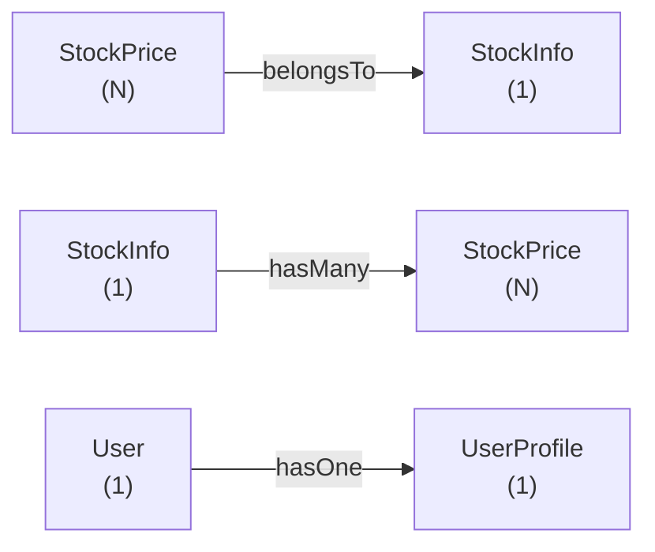

| 타입 | 관계 | 설명 |
|------|------|------|
| `belongsTo` | N:1 | fan-out 없음 (가장 안전) |
| `hasMany` | 1:N | fan-out 주의 |
| `hasOne` | 1:1 | LEFT JOIN |

#### How — 조인 정의

> 시세 큐브가 종목 정보 큐브를 참조하도록 belongsTo로 연결한다. 시세는 종목당 여러 개(N), 종목 정보는 하나(1)이므로 N:1 관계다.

```javascript
cube(`StockPrice`, {
  sql: `SELECT * FROM stock_price_1d`,
  joins: {
    StockInfo: {
      relationship: `belongsTo`,
      sql: `${CUBE}.ticker = ${StockInfo}.ticker`,
    },
  },
  // ...measures, dimensions...
});

cube(`ConsensusEstimates`, {
  sql: `SELECT * FROM consensus_estimates`,
  joins: {
    StockInfo: {
      relationship: `belongsTo`,
      sql: `${CUBE}.stock_code = ${StockInfo}.ticker`,
    },
  },
  measures: {
    avgTargetPrice: { sql: `target_price`, type: `avg`, title: `평균 목표주가` },
    analystCount: { sql: `analyst_count`, type: `max`, title: `추정 기관수` },
  },
  dimensions: {
    stockCode: { sql: `stock_code`, type: `string` },
    estimateDate: { sql: `estimate_date`, type: `time` },
  },
});
```

> ⚠️ **함정 — Many-to-Many fanout**:
> "주문" ↔ "태그" 같은 M:N 관계를 단순히 `hasMany`로 연결하면 한 주문이 태그 수만큼 중복되어 매출 합계가 N배로 부풀려진다.
> 해결: 중간 테이블을 별도 큐브로 만들고, 양쪽에 `belongsTo`로 연결한다.
> 또는 measure 정의 시 `countDistinct`를 사용하여 중복을 흡수한다.

### 4-5. Pre-aggregations — "미리 계산된 결과 캐시"

#### Why — 왜 필요한가

"어제 매출이 얼마였어?" 같은 단순 질문도 수억 행 테이블에서 매번 GROUP BY를 돌리면 5~30초 걸린다.
대시보드를 새로고침할 때마다 이 쿼리가 나가면 DB가 죽는다.

Pre-aggregation은 **"자주 묻는 질문의 답을 미리 만들어두는 것"** 이다.
미리 만든 요약 테이블을 Cube Store(Parquet)에 저장해두고, 사용자 쿼리가 들어오면 즉시 반환한다.

#### What — 빠른 이유 (다이어그램)

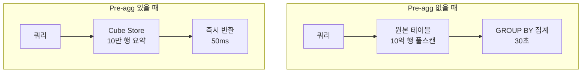

#### How — Pre-aggregation 정의

> 일별 종목 평균 종가/거래량을 월 단위로 파티셔닝하여 Cube Store에 저장한다. refreshKey로 1시간마다 새 데이터가 있는지 확인한다.

```javascript
preAggregations: {
  dailySummary: {
    type: `rollup`,
    measures: [avgClose, avgVolume],
    dimensions: [ticker],
    timeDimension: tradeDate,
    granularity: `day`,
    partitionGranularity: `month`,
    refreshKey: {
      every: `1 hour`,
      sql: `SELECT MAX(trade_date) FROM stock_price_1d`,
    },
    buildRangeStart: { sql: `SELECT DATE '2020-01-01'` },
    buildRangeEnd: { sql: `SELECT CURRENT_DATE` },
  },
},
```

#### Pre-aggregation 타입

| 타입 | 설명 | 사용 시점 |
|------|------|-----------|
| `rollup` | 가장 일반적. measure + dimension + timeDimension 조합으로 미리 집계 | 대부분의 대시보드 |
| `rollupJoin` | 여러 큐브의 rollup을 결합 | 크로스 큐브 분석 |
| `rollupLambda` | 배치(과거)+실시간(최근) 결합 | 실시간 + 과거 동시 조회 |
| `originalSql` | 원본 SQL 결과 자체를 캐싱 | 복잡한 SQL 표현식 가속화 |

#### 갱신 정책 설계

`refreshKey`는 **"어떤 조건일 때 캐시를 다시 만들 것인가"** 를 정의한다.

```javascript
// 주기 기반: 1시간마다 무조건 갱신
refreshKey: { every: '1 hour' }

// SQL 기반: MAX(updated_at)이 바뀌었을 때만 갱신
refreshKey: { sql: 'SELECT MAX(updated_at) FROM orders' }

// 결합: 1시간마다 SQL 체크하고, 결과가 바뀌었으면 갱신
refreshKey: { every: '1 hour', sql: 'SELECT MAX(updated_at) FROM orders' }
```

> ⚠️ **함정 — Pre-agg 갱신 폭주**:
> `refreshKey: { every: '1 minute' }`로 너무 자주 갱신하면 원본 DB가 1분마다 풀스캔당해 죽는다.
> SQL 기반으로 "정말 데이터가 바뀌었을 때만" 갱신하도록 설계하자.

> 💡 **실무 팁**: Pre-agg 설계 순서:
> 1. 일단 안 만들고 시작 (premature optimization 금지)
> 2. 느린 쿼리가 나타나면 Playground에서 해당 쿼리를 빌드
> 3. Cube가 "이 쿼리에 맞는 pre-agg를 추천"해준다 → 그것을 적용

### 4-6. Segments — "재사용 가능한 필터"

#### Why — 왜 필요한가

"VIP 고객", "신규 가입자", "대형주", "관심종목" 같은 조건을 매 쿼리마다 다시 쓰는 것은 번거롭다.
또한 "VIP 고객의 정의"가 바뀌었을 때 모든 쿼리를 찾아 수정해야 한다.

Segment는 이런 자주 쓰는 WHERE 조건을 한 번 이름 붙여 정의해두는 것이다.

#### How — Segment 정의

> 시가총액 10조 이상을 "대형주"로, KOSPI 시장만 따로 "kospiOnly"로 정의한다. 사용자는 이 이름을 호출만 하면 된다.

```javascript
segments: {
  kospiOnly: { sql: `${CUBE}.market = 'KOSPI'`, title: `KOSPI 종목` },
  largeCap: { sql: `${CUBE}.market_cap >= 10000000000000`, title: `대형주` },
},
```

#### How — API에서 호출

```json
{
  "measures": ["StockPrice.avgClose"],
  "segments": ["StockInfo.kospiOnly", "StockInfo.largeCap"]
}
```

> 💡 **실무 팁**: 비즈니스 정의(VIP 기준, 대형주 기준)가 자주 바뀌는 도메인일수록 segment의 가치가 크다.

---

## 5. 데이터 소스 연결

### 5-1. 지원 DB 목록

Cube는 27개 이상의 DB를 지원한다. 카테고리별로 분류하면 다음과 같다.

| 카테고리 | DB | 특징 |
|----------|-----|------|
| **관계형(RDB)** | PostgreSQL, MySQL, MS SQL, Oracle, MariaDB, SQLite | 트랜잭션 DB. 작은~중간 규모 |
| **클라우드 DW** | BigQuery, Snowflake, Redshift, Athena, Databricks | 대규모 분석. 컬럼 스토리지 |
| **분석 엔진** | ClickHouse, Druid, Trino/Presto, DuckDB | 초고속 OLAP |
| **시계열** | Druid, ClickHouse | IoT/로그 데이터 |

### 5-2. PostgreSQL 연결 — BIP의 기본 옵션

> Cube가 PostgreSQL에 연결하기 위한 최소 환경변수다. SSL이 필요하면 `CUBEJS_DB_SSL=true` 추가.

```bash
CUBEJS_DB_TYPE=postgres
CUBEJS_DB_HOST=bip-postgres
CUBEJS_DB_PORT=5432
CUBEJS_DB_NAME=stockdb
CUBEJS_DB_USER=cube_reader
CUBEJS_DB_PASS=<비밀값>
# SSL: CUBEJS_DB_SSL=true
```

> 💡 **실무 팁**: Cube 전용 읽기 전용 계정(`cube_reader`)을 만들고, 분석에 필요한 테이블만 SELECT 권한 부여하자.
> BIP에서는 `nl2sql_exec` 계정처럼 민감 테이블이 차단된 계정을 권장한다.

### 5-3. Oracle 19c 연결 — Community Driver

Oracle은 community-supported 드라이버를 사용한다. Oracle 19c는 node-oracledb 6.x가 공식 지원한다.

> Cube에서 Oracle을 쓰려면 Instant Client 19.x를 컨테이너에 설치하고 `oracledb` npm 패키지를 추가해야 한다.

```bash
CUBEJS_DB_TYPE=oracle
CUBEJS_DB_HOST=oracle-host.example.com
CUBEJS_DB_PORT=1521
CUBEJS_DB_NAME=ORCL
CUBEJS_DB_USER=cube_reader
CUBEJS_DB_PASS=<비밀값>
LD_LIBRARY_PATH=/opt/oracle/instantclient_19_20
```

`package.json`에 `"oracledb": "^6.3.0"` 추가 필요.

> ⚠️ **함정 — Oracle 드라이버는 community-supported**:
> Cube 공식 팀이 직접 유지보수하지 않으므로 버그 픽스가 느릴 수 있다.
> 운영 전에 반드시 자체 환경에서 호환성 테스트(특수 데이터 타입, 한글, NUMBER 정밀도 등)를 거쳐야 한다.

### 5-4. BigQuery / Snowflake

> 클라우드 DW는 인증이 더 복잡하다. BigQuery는 서비스 계정 키 파일, Snowflake는 계정/웨어하우스 정보가 필요하다.

```bash
# BigQuery
CUBEJS_DB_TYPE=bigquery
CUBEJS_DB_BQ_PROJECT_ID=my-project
CUBEJS_DB_BQ_KEY_FILE=/path/to/keyfile.json

# Snowflake
CUBEJS_DB_TYPE=snowflake
CUBEJS_DB_SNOWFLAKE_ACCOUNT=abc12345.us-east-1
CUBEJS_DB_SNOWFLAKE_WAREHOUSE=COMPUTE_WH
```

---

## 6. API — 어떻게 데이터를 가져오는가

Cube는 3가지 API를 동시에 제공한다. 같은 쿼리를 어느 API로 보내든 같은 결과를 얻는다.

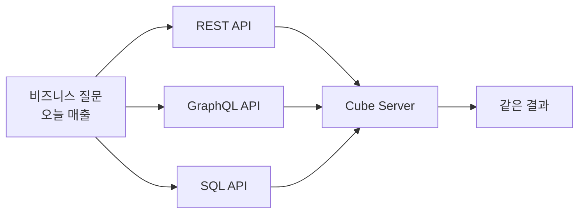

### 6-1. REST API — 가장 일반적

#### Why — 언제 쓰나

대부분의 웹/모바일 앱과 AI Agent가 사용한다. JSON으로 쿼리를 보내고 JSON으로 받는다.

#### How — 쿼리 실행

엔드포인트: `POST /cubejs-api/v1/load`

> 측정값과 차원, 시간 범위, 필터, 정렬, 제한을 한 JSON에 담아 보낸다. 응답은 데이터 + 메타정보(annotation)를 포함한다.

```bash
curl -X POST http://localhost:4000/cubejs-api/v1/load \
  -H "Content-Type: application/json" \
  -H "Authorization: Bearer <API_TOKEN>" \
  -d '{
    "query": {
      "measures": ["StockPrice.avgClose"],
      "dimensions": ["StockPrice.ticker", "StockInfo.companyName"],
      "timeDimensions": [{
        "dimension": "StockPrice.tradeDate",
        "dateRange": ["2026-01-01", "2026-03-31"],
        "granularity": "month"
      }],
      "filters": [{
        "member": "StockInfo.market",
        "operator": "equals",
        "values": ["KOSPI"]
      }],
      "order": { "StockPrice.avgClose": "desc" },
      "limit": 10
    }
  }'
```

#### 응답 구조

> 응답에는 데이터 외에도 마지막 갱신 시각, 메트릭 메타정보(annotation)가 포함된다. 클라이언트가 표 헤더나 단위를 자동 표시할 때 이 메타를 활용한다.

```json
{
  "data": [
    {
      "StockPrice.ticker": "005930",
      "StockInfo.companyName": "삼성전자",
      "StockPrice.avgClose": 72500,
      "StockPrice.tradeDate.month": "2026-01-01T00:00:00.000"
    }
  ],
  "lastRefreshTime": "2026-04-18T06:30:00.000Z",
  "annotation": {
    "measures": {
      "StockPrice.avgClose": { "title": "평균 종가", "type": "number" }
    }
  }
}
```

#### 쿼리 필드 정리

| 필드 | 설명 | 필드 | 설명 |
|------|------|------|------|
| `measures` | 집계 측정값 | `order` | 정렬 (`asc`/`desc`) |
| `dimensions` | 그룹화 차원 | `limit` / `offset` | 페이지네이션 |
| `filters` | 필터 조건 | `segments` | 세그먼트 |
| `timeDimensions` | 시간 차원 | | |

**필터 연산자**: `equals`, `notEquals`, `contains`, `notContains`, `gt`, `gte`, `lt`, `lte`, `set`, `notSet`, `inDateRange`, `beforeDate`, `afterDate`

#### 메타데이터 엔드포인트

`GET /cubejs-api/v1/meta` — 모든 큐브의 measures/dimensions/segments 반환.
NL2SQL 에이전트가 LLM 프롬프트에 주입할 메타정보를 가져올 때 사용한다.

### 6-2. GraphQL API

#### Why — 언제 REST보다 나은가

- 클라이언트가 필요한 필드만 골라서 받고 싶을 때
- 한 요청으로 여러 큐브 조합 데이터를 받고 싶을 때
- TypeScript 타입 자동 생성을 원할 때

#### How — 자동 스키마 생성

> Cube는 데이터 모델로부터 GraphQL 스키마를 자동 생성한다. 별도 스키마 작성이 필요 없다.

```graphql
query {
  cube {
    stockPrice(
      where: { StockInfo: { market: { equals: "KOSPI" } } }
      orderBy: { avgClose: desc }
      limit: 5
    ) {
      ticker
      avgClose
      StockInfo { companyName }
    }
  }
}
```

### 6-3. SQL API — BI 도구에서 직접

#### Why — 언제 쓰나

Tableau, Metabase, DBeaver 같은 BI 도구는 대부분 SQL DB 커넥터를 통해 연결한다.
Cube의 SQL API는 **Postgres wire protocol** 호환이라 BI 도구가 "Cube를 PostgreSQL로 인식"한다.

#### How — 연결 및 쿼리

> SQL API 포트(15432)에 psql/Tableau/Metabase 등 어떤 Postgres 클라이언트로든 접속 가능하다. 큐브가 테이블처럼 보인다.

```bash
# 활성화: CUBEJS_PG_SQL_PORT=15432
psql -h localhost -p 15432 -U cube
```

```sql
SELECT ticker, AVG(close_price) AS avg_close
FROM StockPrice
WHERE "StockInfo.market" = 'KOSPI'
GROUP BY 1 ORDER BY avg_close DESC LIMIT 10;
```

> 💡 **실무 팁**: BI 도구를 새로 도입할 때는 SQL API가 가장 빠르다.
> Tableau/Metabase는 PostgreSQL 커넥터로 그대로 연결되고, Cube의 메트릭이 자동으로 보인다.

---

## 7. Docker 컨테이너 설치 — 실전

### 7-1. 가장 단순한 시작 (개발용 + PostgreSQL)

#### Why — 왜 이 구성으로 시작하는가

Cube + Cube Store 두 컨테이너만 띄우면 메트릭 정의부터 캐싱까지 전부 동작한다.
개발 환경에서는 이 구성으로 충분하고, 운영 시에 Cube Store를 수평 확장하면 된다.

#### How — docker-compose.yml 전체

> Cube 서버(포트 4000) + Cube Store를 함께 띄운다. 환경변수로 PostgreSQL 연결 정보, API Secret, dev mode를 지정한다.

```yaml
version: "3.8"

services:
  cube:
    image: cubejs/cube:v0.36
    container_name: bip-cube
    ports:
      - "4000:4000"    # REST/GraphQL + Playground
      - "15432:15432"  # SQL API
    environment:
      CUBEJS_API_SECRET: "${CUBEJS_API_SECRET}"
      CUBEJS_DEV_MODE: "true"
      CUBEJS_DB_TYPE: "postgres"
      CUBEJS_DB_HOST: "bip-postgres"
      CUBEJS_DB_PORT: "5432"
      CUBEJS_DB_NAME: "stockdb"
      CUBEJS_DB_USER: "${CUBEJS_DB_USER}"
      CUBEJS_DB_PASS: "${CUBEJS_DB_PASS}"
      CUBEJS_PG_SQL_PORT: "15432"
      CUBEJS_CUBESTORE_HOST: "cubestore"
      CUBEJS_CACHE_AND_QUEUE_DRIVER: "memory"
    volumes:
      - ./cube/schema:/cube/conf/schema
      - ./cube/cube.js:/cube/conf/cube.js
    networks:
      - bip-network
    restart: unless-stopped
    healthcheck:
      test: ["CMD", "curl", "-f", "http://localhost:4000/readyz"]
      interval: 30s
      timeout: 10s
      retries: 3

  cubestore:
    image: cubejs/cubestore:v0.36
    container_name: bip-cubestore
    environment:
      CUBESTORE_REMOTE_DIR: "/cube/data"
    volumes:
      - cubestore_data:/cube/data
    networks:
      - bip-network
    restart: unless-stopped

volumes:
  cubestore_data:

networks:
  bip-network:
    external: true
```

#### 환경변수 한 줄씩 의미

| 환경변수 | 의미 |
|----------|------|
| `CUBEJS_API_SECRET` | JWT 발급/검증용 비밀값. 반드시 32자 이상 랜덤 |
| `CUBEJS_DEV_MODE` | true 시 Playground UI 활성화. **운영에서는 false** |
| `CUBEJS_DB_*` | 원본 DB 연결 정보 |
| `CUBEJS_PG_SQL_PORT` | SQL API 포트(15432). BI 도구 직접 연결용 |
| `CUBEJS_CUBESTORE_HOST` | Cube Store 컨테이너 호스트명 |
| `CUBEJS_CACHE_AND_QUEUE_DRIVER` | `memory`(개발) / `redis`(운영) |

#### `.env` (비밀값은 플레이스홀더만)

```bash
CUBEJS_API_SECRET=<플레이스홀더-32자-이상-랜덤-문자열>
CUBEJS_DB_USER=cube_reader
CUBEJS_DB_PASS=<플레이스홀더>
```

> ⚠️ **함정 — 비밀값 커밋 금지**:
> `.env` 파일을 절대 git에 커밋하지 말고, `.env.example`에는 플레이스홀더만 둔다.
> BIP의 `docs/security_governance.md` 규칙도 동일.

### 7-2. Oracle 19c 연결 설치

#### Why — 추가 설정이 필요한 이유

Oracle은 native client library(Instant Client)가 컨테이너 안에 있어야 한다.
또한 `oracledb` npm 패키지를 추가로 설치해야 한다.

#### How — Dockerfile.oracle

> Cube 공식 이미지에 Instant Client 19.20을 설치하고 oracledb 6.3.0을 추가한다. LD_LIBRARY_PATH 설정 필수.

```dockerfile
FROM cubejs/cube:v0.36

RUN apt-get update && apt-get install -y libaio1 wget unzip \
    && rm -rf /var/lib/apt/lists/*

RUN mkdir -p /opt/oracle && cd /opt/oracle \
    && wget https://download.oracle.com/otn_software/linux/instantclient/1920000/instantclient-basic-linux.x64-19.20.0.0.0dbru.zip \
    && unzip instantclient-basic-linux.x64-19.20.0.0.0dbru.zip && rm *.zip

ENV LD_LIBRARY_PATH=/opt/oracle/instantclient_19_20:$LD_LIBRARY_PATH
RUN npm install oracledb@6.3.0
```

#### How — docker-compose.oracle.yml

> Oracle 연결용 docker-compose. CUBEJS_DB_TYPE을 oracle로 두고 위 Dockerfile을 빌드한다.

```yaml
version: "3.8"

services:
  cube-oracle:
    build:
      context: .
      dockerfile: Dockerfile.oracle
    container_name: bip-cube-oracle
    ports:
      - "4000:4000"
      - "15432:15432"
    environment:
      CUBEJS_API_SECRET: "${CUBEJS_API_SECRET}"
      CUBEJS_DEV_MODE: "true"
      CUBEJS_DB_TYPE: "oracle"
      CUBEJS_DB_HOST: "${ORACLE_DB_HOST}"
      CUBEJS_DB_PORT: "1521"
      CUBEJS_DB_NAME: "${ORACLE_DB_SID}"
      CUBEJS_DB_USER: "${ORACLE_DB_USER}"
      CUBEJS_DB_PASS: "${ORACLE_DB_PASS}"
      CUBEJS_CUBESTORE_HOST: "cubestore"
      CUBEJS_PG_SQL_PORT: "15432"
    volumes:
      - ./cube/schema:/cube/conf/schema
    networks:
      - bip-network
    depends_on:
      - cubestore

  cubestore:
    image: cubejs/cubestore:v0.36
    container_name: bip-cubestore
    environment:
      CUBESTORE_REMOTE_DIR: "/cube/data"
    volumes:
      - cubestore_data:/cube/data
    networks:
      - bip-network

volumes:
  cubestore_data:

networks:
  bip-network:
    external: true
```

#### 트러블슈팅 — 흔한 문제

| 증상 | 원인 | 해결 |
|------|------|------|
| `ORA-12541: TNS:no listener` | DB 호스트/포트 오류 또는 방화벽 | `telnet host 1521`로 확인 |
| `DPI-1047: Cannot locate Oracle Client library` | Instant Client 미설치 또는 LD_LIBRARY_PATH 누락 | `RUN ldconfig` 추가 |
| `ORA-01017: invalid username/password` | 계정 잠김 또는 비밀번호 오타 | DB에서 `ALTER USER ... ACCOUNT UNLOCK` |
| 한글 깨짐 | NLS_LANG 미설정 | `ENV NLS_LANG=KOREAN_KOREA.AL32UTF8` |

### 7-3. 프로덕션 배포

#### Why — 개발 구성과 무엇이 다른가

운영에서는 다음을 추가/변경한다.

- `CUBEJS_DEV_MODE=false` (Playground 비활성화)
- Redis로 캐시 분리 (in-memory 대신)
- Cube Store를 별도 호스트에 배치 (수평 확장)
- TLS 적용 (HTTPS, DB SSL)
- 모니터링 (Prometheus, OpenTelemetry)

#### 캐시 스토리지 분리

```yaml
environment:
  CUBEJS_CACHE_AND_QUEUE_DRIVER: "redis"
  CUBEJS_REDIS_URL: "redis://redis:6379"
```

#### Cube Store 분리

운영에서는 Cube Store를 자체 클러스터로 배포한다 (router + workers).
디스크 IOPS가 핵심 성능 지표.

### 7-4. 시작 및 확인

```bash
# 실행
docker compose -f docker-compose.cube.yml up -d    # PostgreSQL
docker compose -f docker-compose.oracle.yml up -d   # Oracle

# 헬스체크
curl http://localhost:4000/readyz

# 메타데이터 확인
curl http://localhost:4000/cubejs-api/v1/meta \
  -H "Authorization: Bearer <API_TOKEN>" | jq '.cubes | length'

# Playground: 브라우저에서 http://localhost:4000 접속
# (CUBEJS_DEV_MODE=true 일 때 활성화)
```

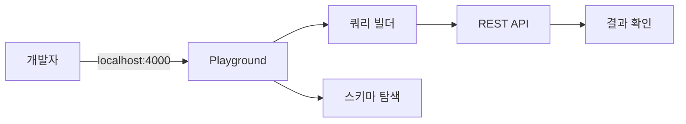

> 💡 **실무 팁 — Playground가 핵심 학습 도구**:
> Playground는 단순한 GUI가 아니라 "어떤 쿼리에 어떤 SQL이 생성되는지" 보여주는 디버거다.
> 쿼리를 만들고 "Generated SQL" 탭을 보면 Cube가 어떻게 동작하는지 즉시 이해된다.

---

## 8. 시맨틱 모델 작성법 — 실전 가이드

### 8-1. 모델 파일 구조

#### Why — 파일을 어떻게 나눠야 하는가

큐브 하나당 파일 하나를 권장한다. 변경 추적과 코드 리뷰가 쉬워진다.
View(여러 큐브를 결합한 읽기 전용 인터페이스)는 별도 디렉토리로 분리한다.

#### What — 권장 디렉토리 구조

```
cube/
  schema/
    cubes/
      StockInfo.js
      StockPrice.js
      FinancialStatements.js
      ConsensusEstimates.js
    views/
      StockOverview.js         # 여러 큐브를 결합한 읽기 전용 뷰
  cube.js                      # 커스텀 설정 (보안, 리프레시 등)
```

#### 파일 명명 규칙

- 큐브 이름은 PascalCase (`StockInfo`)
- 파일명은 큐브명과 일치 (`StockInfo.js`)
- View는 명사구 + Overview/Summary (`StockOverview`)

> 💡 **실무 팁**: Cube는 `schema/` 디렉토리를 자동으로 스캔한다. 새 파일을 추가하면 dev mode에서는 hot-reload되고, 운영에서는 컨테이너 재시작이 필요하다.

### 8-2. 첫 큐브 만들기 — 단계별

#### 시나리오: 손익계산서 분석 큐브

> 매출/영업이익/당기순이익을 measure로, 종목코드/회계연도/공시일을 dimension으로 정의한다. 영업이익률은 두 measure의 비율로 계산한다.

```javascript
cube(`FinancialStatements`, {
  sql: `SELECT * FROM financial_statements WHERE sj_div = 'IS'`,
  title: `손익계산서`,

  measures: {
    totalRevenue: { sql: `revenue`, type: `sum`, title: `매출액` },
    operatingProfit: { sql: `operating_profit`, type: `sum`, title: `영업이익` },
    netIncome: { sql: `net_income`, type: `sum`, title: `당기순이익` },
    operatingMargin: {
      sql: `${operatingProfit} / NULLIF(${totalRevenue}, 0) * 100`,
      type: `number`,
      title: `영업이익률(%)`,
    },
  },

  dimensions: {
    ticker: { sql: `ticker`, type: `string` },
    fiscalYear: { sql: `fiscal_year`, type: `string`, title: `회계연도` },
    filingDate: { sql: `filing_date`, type: `time`, title: `공시일` },
  },
});
```

#### 한 줄씩 설명

- `sql:` — 큐브가 기반으로 하는 테이블/뷰. WHERE를 미리 적용하면 IS만 필터링됨
- `title:` — UI에서 보일 한글 이름 (Playground/BI 도구에 노출)
- `measures.totalRevenue` — `revenue` 컬럼을 SUM
- `measures.operatingMargin` — 두 measure를 조합 (직접 계산식)
- `dimensions.fiscalYear` — string 타입. `2025`처럼 연도 자체를 카테고리로 사용
- `dimensions.filingDate` — time 타입. day/month/year 자유 그룹핑 가능

> ⚠️ **함정 — sj_div 필터 누락**:
> `financial_statements`에는 BS(재무상태표), IS(손익계산서), CF(현금흐름표)가 한 테이블에 섞여 있다.
> 큐브 SQL에서 `WHERE sj_div = 'IS'`를 빠뜨리면 잘못된 데이터 합산이 발생한다.
> BIP의 "삼성전자 자본총계 4.4조" 같은 오류가 이 누락에서 나왔다.

### 8-3. 조인 연결하기

#### Why — View를 따로 만드는 이유

View는 여러 큐브를 결합한 읽기 전용 인터페이스다. 사용자(분석가/BI 도구)에게는 단일 객체처럼 보인다.

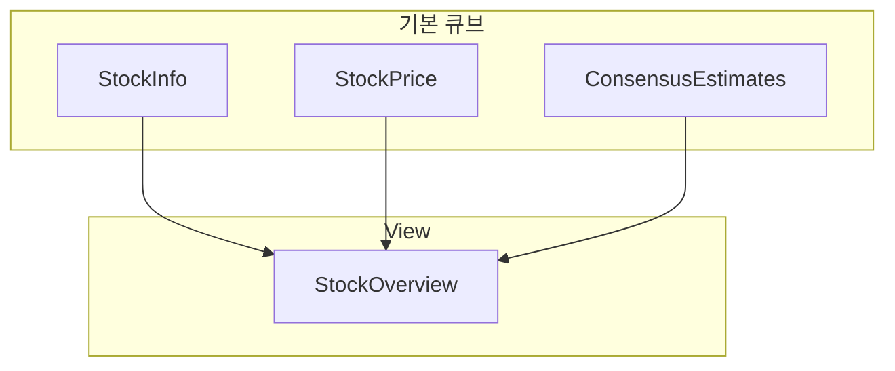

#### How — View 정의

> 종목 정보 + 평균 시세 + 컨센서스를 하나의 "종목 종합 뷰"로 묶는다. 분석가는 이 View 하나만 보면 된다.

```javascript
view(`StockOverview`, {
  description: `종목 종합 뷰`,
  includes: [
    StockInfo.ticker,
    StockInfo.companyName,
    StockInfo.market,
    StockPrice.avgClose,
    StockPrice.avgVolume,
    ConsensusEstimates.avgTargetPrice,
  ],
});
```

> 💡 **실무 팁**: 분석가에게는 View만 노출하고 원본 큐브는 가리는 것이 좋다.
> 분석가가 큐브를 직접 다루면 잘못된 JOIN 조합으로 데이터 불일치가 발생할 수 있다.

### 8-4. Pre-aggregation 추가

#### When — 언제 pre-agg를 추가할까

다음 신호가 보이면 추가를 고려한다.

- 같은 쿼리가 5초 이상 걸린다
- 여러 사용자가 동시에 같은 대시보드를 본다
- 원본 DB의 부하가 높다
- 일/주/월 단위 집계가 자주 사용된다

#### How — Pre-aggregation 정의

> 종목별 일별 평균 종가/거래량을 월 단위로 파티션하여 캐싱한다. 1시간마다 갱신.

```javascript
preAggregations: {
  dailyByTicker: {
    type: `rollup`,
    measures: [avgClose, avgVolume, count],
    dimensions: [ticker],
    timeDimension: tradeDate,
    granularity: `day`,
    partitionGranularity: `month`,
    refreshKey: { every: `1 hour` },
  },
},
```

#### 갱신 정책 설계 가이드

| 데이터 특성 | 권장 refreshKey |
|------------|-----------------|
| 일배치 (장 마감 후 1회) | `every: '1 hour'` + SQL `MAX(trade_date)` |
| 시간 단위 갱신 | `every: '5 minute'` |
| 거의 변경 없음 (마스터 데이터) | `every: '1 day'` |
| 실시간 시세 | Pre-agg 사용 안 함 (또는 매우 짧게) |

### 8-5. 보안 컨텍스트 (멀티테넌시)

#### Why — 사용자별로 다른 데이터를 보여주려면

같은 Cube 인스턴스를 여러 사용자(혹은 조직)가 공유할 때, 각자 자기 데이터만 봐야 한다.
Cube의 `queryRewrite`는 모든 쿼리에 자동으로 필터를 추가한다.

#### How — cube.js 전역 설정

> 사용자 역할에 따라 자동으로 필터를 추가한다. analyst 역할이면 자신에게 허용된 시장의 종목만 본다.

```javascript
// cube.js
module.exports = {
  contextToAppId: ({ securityContext }) =>
    `CUBEJS_APP_${securityContext.role}`,

  queryRewrite: (query, { securityContext }) => {
    if (securityContext.role === 'analyst') {
      query.filters.push({
        member: 'StockInfo.market',
        operator: 'equals',
        values: securityContext.allowedMarkets,
      });
    }
    return query;
  },

  scheduledRefreshContexts: async () => [
    { securityContext: { role: 'admin' } },
  ],
};
```

> ⚠️ **함정 — JWT 없이 securityContext 사용 금지**:
> 클라이언트가 자기 role을 직접 보내는 것이 아니라, Cube가 JWT를 검증하여 securityContext를 만든다.
> JWT를 거치지 않으면 사용자가 자신을 admin으로 사칭할 수 있다.

---

## 9. Cube와 NL2SQL — Agent에서 어떻게 쓰는가

### 9-1. 자연어 → Cube API 흐름

#### Why — Cube가 NL2SQL에 좋은 이유

- 메트릭 정의가 표준화되어 있어 LLM이 헷갈리지 않음
- LLM이 SQL을 직접 쓰지 않고 JSON 쿼리만 만들면 됨 → 구문 오류 적음
- Cube가 안전한 SQL을 생성 → SQL Injection 위험 없음
- Pre-agg 캐시로 응답 속도 빠름

#### How — Agent 호출 시퀀스

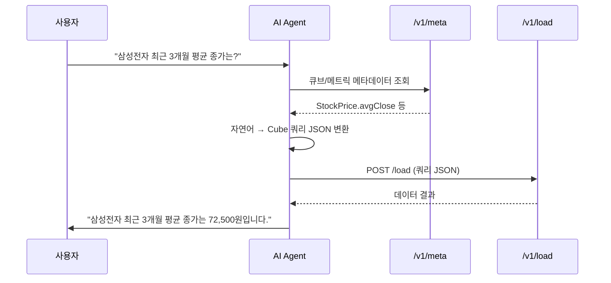

### 9-2. 메트릭 메타데이터를 LLM 프롬프트에 주입

> Cube의 /v1/meta 엔드포인트에서 큐브/measure/dimension 목록을 가져와 LLM 프롬프트에 system 메시지로 주입한다. LLM은 이 목록만 보고 어떤 메트릭이 있는지 안다.

```python
import requests

meta = requests.get(
    "http://localhost:4000/cubejs-api/v1/meta",
    headers={"Authorization": f"Bearer {API_TOKEN}"}
).json()

def build_metric_context(meta):
    lines = []
    for cube in meta["cubes"]:
        lines.append(f"## {cube['name']} ({cube.get('title', '')})")
        for m in cube["measures"]:
            lines.append(f"  Measure: {m['name']} - {m.get('title', '')} ({m['type']})")
        for d in cube["dimensions"]:
            lines.append(f"  Dim: {d['name']} - {d.get('title', '')} ({d['type']})")
    return "\n".join(lines)

system_prompt = f"""주식 데이터 분석 에이전트입니다.
자연어 질문을 Cube.js 쿼리 JSON으로 변환하세요.

사용 가능한 메트릭:
{build_metric_context(meta)}
"""
```

Agent는 LLM이 생성한 Cube 쿼리 JSON으로 `/v1/load`를 호출하고, 결과를 다시 LLM에 전달하여 자연어 답변을 생성한다.

### 9-3. LangGraph Agent에서 Cube를 도구로 등록

LangGraph Agent에서는 Cube API 호출을 하나의 도구(tool)로 정의한다.

```python
@tool
def cube_query(measures: list, dimensions: list = None,
               filters: list = None, time_range: str = None):
    """Cube.js에 메트릭 쿼리를 보낸다."""
    payload = {"query": {"measures": measures}}
    if dimensions: payload["query"]["dimensions"] = dimensions
    if filters: payload["query"]["filters"] = filters
    # ...
    return requests.post(LOAD_URL, json=payload, headers=...).json()
```

LangGraph가 LLM에게 "이 도구를 호출하면 Cube에서 데이터를 받을 수 있다"고 알려주면, LLM이 자율적으로 호출한다.

### 9-4. BIP에서 검증한 한계

> ⚠️ **함정 — 팩트-팩트 JOIN 제약**:
> Cube는 두 팩트 테이블(예: 시세 + 거래량)을 직접 JOIN하는 것을 지원하지 않는다.
> 반드시 한쪽이 dimension 테이블이어야 한다.
> BIP에서 "시세 + 컨센서스"를 직접 join하려다 발견했고, 결국 dimension 큐브(StockInfo)를 중간에 두는 구조로 우회했다.

---

## 10. dbt와 비교 — 언제 어느 쪽?

### 두 도구의 위치

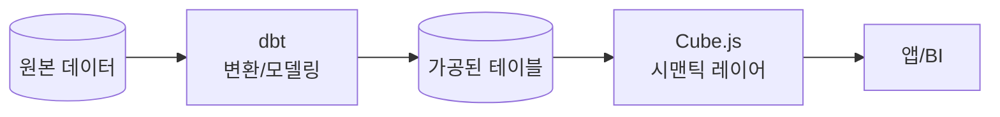

dbt와 Cube는 경쟁 관계가 아니라 **보완 관계**다. dbt가 데이터를 변환해 깨끗한 테이블을 만들면, Cube가 그 테이블 위에서 메트릭을 정의한다.

### 비교표

| 항목 | Cube | dbt |
|------|------|-----|
| **목적** | 메트릭 정의 + API 노출 | 데이터 변환(ELT의 T) |
| **정의 방식** | JS/YAML 큐브 | SQL + Jinja |
| **실행 방식** | 런타임에 API 요청마다 SQL 생성 | 배치 작업으로 테이블 생성 |
| **산출물** | 메트릭 API (REST/GraphQL/SQL) | DW의 테이블/뷰 |
| **캐싱** | Pre-aggregation, Cube Store | 없음 (테이블 자체가 결과) |
| **사용 주체** | 앱/BI/AI Agent | 데이터 엔지니어/분석가 |
| **실시간성** | 좋음 (쿼리당 응답) | 낮음 (배치 갱신) |

### 어떤 상황에 어느 쪽?

| 상황 | 추천 |
|------|------|
| Raw 데이터를 정제해 마트 만들기 | dbt |
| 마트 위에 메트릭 정의하고 BI/앱에 노출 | Cube |
| 둘 다 필요 | dbt + Cube 조합 |
| 가공이 SQL 한 두 줄로 끝나는 단순한 경우 | Cube만으로도 가능 |

> 💡 **실무 팁**: BIP처럼 데이터 파이프라인이 이미 Airflow + DAG로 마트를 만들고 있다면, 그 위에 Cube만 얹으면 된다.
> 별도 dbt 도입 없이도 시맨틱 레이어 가치를 빠르게 얻을 수 있다.

---

## 11. 주의사항 및 한계

### 11-1. Oracle 드라이버는 community-supported

Cube 공식 팀이 직접 유지보수하지 않는다. 버그 픽스가 느릴 수 있다.
또한 Instant Client 설치로 컨테이너 이미지가 ~200MB 증가한다.

> ⚠️ 운영 전에 반드시 자체 환경에서 호환성 테스트를 거치자.

### 11-2. 팩트-팩트 JOIN 제약

두 팩트 테이블을 직접 join할 수 없다. 반드시 dimension 테이블을 거쳐야 한다.
BIP에서 "시세 + 컨센서스" 직접 join 시도 시 발견.

### 11-3. Pre-aggregation 갱신 비용

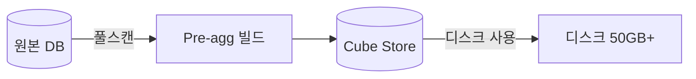

- 데이터 양에 비례하여 디스크 증가. 운영 환경 최소 50GB 권장
- `partitionGranularity`를 적절히 설정하지 않으면 빌드 시간 폭주
- 너무 많은 pre-agg 정의 시 빌드 큐가 밀림

### 11-4. 실시간 데이터 — 캐싱과 충돌

장중 실시간 시세 같은 데이터는 캐싱이 부담이다.

| 옵션 | 트레이드오프 |
|------|-------------|
| `refreshKey.every: '10 second'` | DB 부하 증가 |
| Pre-agg 사용 안 함 | 응답 느려짐 |
| Cube 우회 직접 조회 | Cube 가치 일부 포기 |

### 11-5. 메모리 / 동시성

| 항목 | 설정 |
|------|------|
| **메모리** | 기본 1GB 힙. 복잡한 스키마는 `NODE_OPTIONS=--max-old-space-size=4096` |
| **동시 쿼리** | `CUBEJS_CONCURRENCY` 환경변수로 큐 크기 조정 |
| **스키마 변경** | 개발 모드: hot-reload. 운영: 컨테이너 재시작 필요 |
| **보안** | `CUBEJS_DEV_MODE=true`는 운영에서 반드시 비활성화 (Playground 노출) |

### 11-6. WrenAI MDL과의 비교 (BIP 경험)

| 항목 | WrenAI MDL | Cube.js |
|------|-----------|---------|
| **정의 언어** | JSON/YAML (MDL) | JavaScript / YAML |
| **모델 단위** | Model | Cube |
| **측정값** | Metric (calculated field) | Measure |
| **조인** | Relationship | Join (belongsTo/hasMany/hasOne) |
| **캐싱** | 없음 (DB 직접 쿼리) | Pre-aggregation + Cube Store |
| **SQL 생성** | LLM이 SQL 직접 생성 | Cube가 최적화된 SQL 생성 |
| **보안** | Thread 레벨 | queryRewrite + JWT |

#### 전환 매핑

| WrenAI | Cube 환경 대응 |
|--------|---------------|
| SQL Pairs (41개) | Few-shot Examples (자연어 → Cube 쿼리 JSON) |
| Instructions (전역 규칙) | Agent System Prompt |
| MDL Model | `/cubejs-api/v1/meta`에서 자동 추출 |
| Deploy (동기화) | `cube/schema/` 파일 저장 (hot-reload) |
| Gold View | Cube View (`view()` 정의) |

**SQL Pairs 전환 예시:**

```
# WrenAI
Q: "삼성전자 PER은?"  →  SQL: SELECT per FROM v_stock_valuation WHERE ticker='005930.KS'

# Cube Agent
Q: "삼성전자 PER은?"  →  {"measures":["StockValuation.per"],"filters":[{"member":"StockInfo.ticker","operator":"equals","values":["005930"]}]}
```

---

## 12. 참고

| 리소스 | URL |
|--------|-----|
| 공식 문서 | <https://cube.dev/docs> |
| GitHub | <https://github.com/cube-js/cube> |
| 데이터 모델 레퍼런스 | <https://cube.dev/docs/reference/data-model> |
| REST API 레퍼런스 | <https://cube.dev/docs/reference/rest-api> |
| Pre-aggregation 가이드 | <https://cube.dev/docs/product/caching/using-pre-aggregations> |
| Docker 배포 | <https://cube.dev/docs/product/deployment/core> |
| Oracle 드라이버 | <https://cube.dev/docs/product/configuration/data-sources/oracle> |

> **BIP 프로젝트 관련 문서:** `docs/guide_wrenai.md`, `docs/nl2sql_project_plan.md`, `docs/wrenai_technical_guide.md`, `docs/data_architecture_review.md`

---

## 변경 이력

| 날짜 | 내용 |
|------|------|
| 2026-04-18 | 초안 작성 |
| 2026-04-22 | 문서 헤더 정리 (작성일/대상 제거) |
| 2026-04-29 | 설명 위주로 전면 재작성 (비유, Why-What-How 구조, 함정 포인트 추가) |
