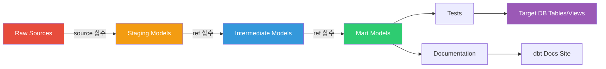
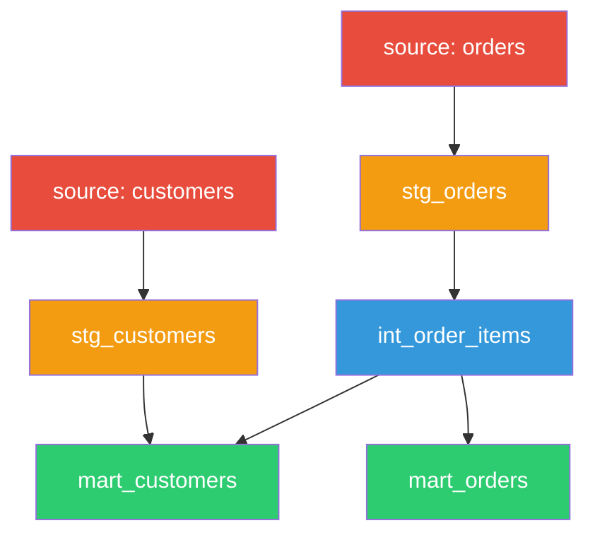
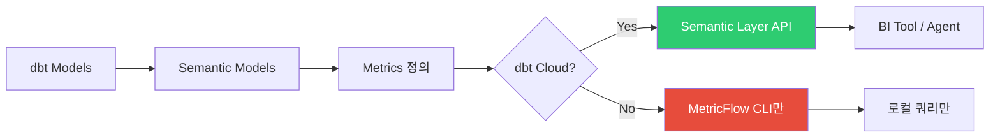
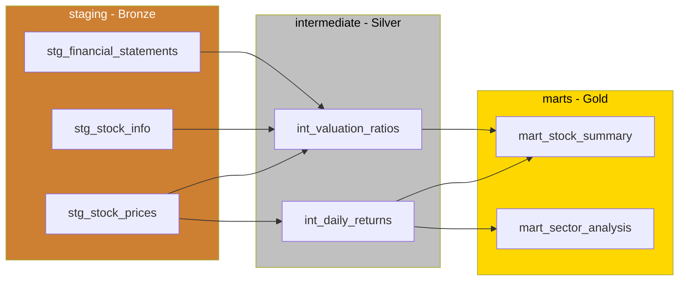
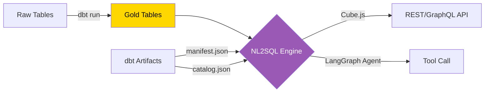
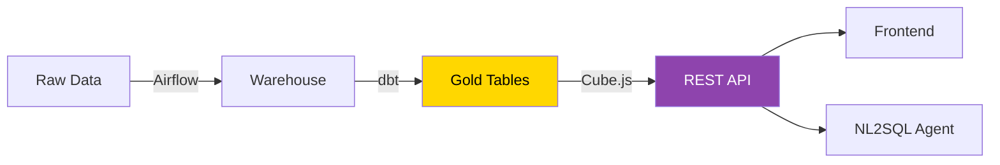

# dbt Core 개념 및 사용 가이드

## 1. 개요

### dbt란 무엇인가

dbt(data build tool)는 ELT 파이프라인에서 **T(Transform)** 를 담당하는 데이터 변환 도구다. 데이터 엔지니어와 애널리틱스 엔지니어가 SQL SELECT 문만으로 데이터 웨어하우스 내의 데이터를 변환하고, 테스트하고, 문서화할 수 있게 해준다.

### 핵심 철학: Analytics as Code

dbt의 핵심 철학은 **"Analytics as Code"** 다.

- SQL 변환 로직을 **코드**로 관리 (Git 버전 관리)
- 테스트, 문서, 배포를 소프트웨어 엔지니어링 방식으로 수행
- 데이터 품질을 CI/CD 파이프라인에 통합
- 모든 변환의 **계보(lineage)** 를 자동 추적

### dbt Core vs dbt Cloud

| 항목 | dbt Core | dbt Cloud |
|------|----------|-----------|
| 라이선스 | Apache 2.0 (오픈소스) | 유료 SaaS |
| 실행 방식 | CLI (로컬/컨테이너) | 웹 IDE + 스케줄러 |
| Semantic Layer API | 불가 (CLI만) | 제공 |
| 스케줄링 | 외부 필요 (Airflow 등) | 내장 |
| 비용 | 무료 | Developer 무료, Team $100/seat/월 |

### dbt의 역할

dbt는 데이터를 **추출하거나 적재하지 않는다**. 이미 웨어하우스에 적재된 raw 데이터를 SELECT 문으로 변환하여 새로운 테이블/뷰를 생성하는 것이 전부다.

```
[Extract] → [Load] → [Transform (dbt)] → [Serve]
  Airbyte    Airflow     dbt Core       Cube/API
```

---

## 2. 아키텍처

### 전체 동작 흐름



### 동작 방식

1. 개발자가 SQL 모델 파일을 작성한다
2. dbt가 Jinja 템플릿을 컴파일하여 순수 SQL로 변환한다
3. 모델 간 `ref()` 참조를 분석하여 DAG(방향 비순환 그래프)를 구성한다
4. DAG 순서에 따라 SQL을 데이터베이스에 실행하여 테이블/뷰를 생성한다

### Jinja + SQL 템플릿 엔진

dbt는 Jinja2 템플릿 엔진을 SQL 위에 얹어 **변수, 조건문, 반복문, 매크로** 를 사용할 수 있게 한다.

```sql
-- Jinja 조건문 예시
SELECT
    order_id,
    amount,
    
        amount * 1.1 AS amount_with_tax
    
        amount AS amount_with_tax
    
FROM {{ ref('stg_orders') }}
```

### DAG 기반 의존성 관리



---

## 3. 핵심 개념

### 3-1. Models

모델은 dbt의 기본 단위다. **SQL 파일 하나가 하나의 모델**이며, 실행하면 데이터베이스에 테이블 또는 뷰가 생성된다.

#### ref() 함수

모델 간 참조에는 `ref()` 함수를 사용한다. dbt가 이를 분석하여 실행 순서(DAG)를 자동 결정한다.

```sql
-- models/marts/mart_daily_returns.sql
SELECT
    sp.ticker,
    sp.trade_date,
    sp.close_price,
    sp.close_price / LAG(sp.close_price) OVER (
        PARTITION BY sp.ticker ORDER BY sp.trade_date
    ) - 1 AS daily_return,
    si.market_cap
FROM {{ ref('stg_stock_prices') }} sp
LEFT JOIN {{ ref('stg_stock_info') }} si
    ON sp.ticker = si.ticker
```

#### Materialization (구체화 방식)

| 방식 | 설명 | 용도 |
|------|------|------|
| `view` | CREATE VIEW (기본값) | 경량 변환, 자주 변경되는 로직 |
| `table` | CREATE TABLE AS | 자주 조회되는 집계 테이블 |
| `incremental` | INSERT/MERGE (신규분만) | 대용량 팩트 테이블 |
| `ephemeral` | CTE로 인라인 삽입 | 중간 단계, DB에 생성 안 됨 |

```sql
-- models/marts/mart_stock_summary.sql
{{ config(materialized='incremental', unique_key='ticker || trade_date') }}

SELECT
    ticker,
    trade_date,
    close_price,
    volume,
    CURRENT_TIMESTAMP AS updated_at
FROM {{ ref('stg_stock_prices') }}


WHERE trade_date > (SELECT MAX(trade_date) FROM {{ this }})

```

모델 설정은 `dbt_project.yml`에서 일괄 지정하거나 모델 파일 내 `config()` 블록으로 개별 지정한다 (7-2절 참고).

### 3-2. Sources

소스는 dbt 외부에서 적재된 raw 테이블을 참조하는 방법이다. `source()` 함수로 참조하며, freshness 체크를 통해 데이터 적시성을 모니터링할 수 있다.

```yaml
# models/staging/_sources.yml
version: 2
sources:
  - name: stockdb
    database: stockdb
    schema: public
    freshness:
      warn_after: { count: 24, period: hour }
      error_after: { count: 48, period: hour }
    loaded_at_field: updated_at
    tables:
      - name: stock_price_1d
        description: "일봉 시세 데이터"
      - name: stock_info
        description: "종목 메타데이터"
```

```sql
-- models/staging/stg_stock_prices.sql
SELECT ticker, trade_date, open_price, high_price, low_price, close_price, volume
FROM {{ source('stockdb', 'stock_price_1d') }}
WHERE trade_date >= '2020-01-01'
```

freshness 체크: `dbt source freshness`

### 3-3. Tests

dbt 테스트는 데이터 품질을 검증한다. 실패 시 빌드를 중단할 수 있다.

#### Schema Tests (YAML 정의)

```yaml
# models/staging/_schema.yml
version: 2
models:
  - name: stg_stock_prices
    description: "정제된 일봉 시세"
    columns:
      - name: ticker
        tests: [not_null]
      - name: trade_date
        tests: [not_null]
    tests:
      - unique:
          column_name: "ticker || '-' || trade_date"
  - name: stg_stock_info
    columns:
      - name: ticker
        tests: [unique, not_null]
      - name: market
        tests:
          - accepted_values:
              values: ['KOSPI', 'KOSDAQ', 'NYSE', 'NASDAQ']
```

#### Custom Tests (SQL 기반)

`tests/` 디렉토리에 SQL 파일로 작성한다. 쿼리 결과가 0행이면 통과, 1행 이상이면 실패다.

```sql
-- tests/assert_positive_close_price.sql
SELECT *
FROM {{ ref('stg_stock_prices') }}
WHERE close_price <= 0
```

```bash
dbt test                          # 전체 테스트
dbt test --select stg_stock_prices  # 특정 모델만
```

### 3-4. Documentation

YAML의 `description` 필드에 모델/컬럼 설명을 작성하면, `dbt docs generate`로 `catalog.json`, `manifest.json`이 생성되고 `dbt docs serve`로 모델 DAG 시각화, 컬럼 설명, 테스트 결과를 포함한 문서 사이트를 확인할 수 있다.

### 3-5. Seeds

Seeds는 CSV 파일을 데이터베이스 테이블로 로드하는 기능이다. 참조 데이터(코드 테이블, 매핑 테이블)에 적합하다. `seeds/market_codes.csv`를 만들고 `dbt seed`를 실행하면 테이블이 생성되며, 모델에서 `{{ ref('market_codes') }}`로 참조한다.

### 3-6. Snapshots

스냅샷은 **SCD Type 2 (Slowly Changing Dimension)** 를 구현한다. 시간에 따라 변하는 데이터의 이력을 추적한다.

```sql
-- snapshots/snap_stock_info.sql

{{ config(target_schema='snapshots', unique_key='ticker',
          strategy='timestamp', updated_at='updated_at') }}
SELECT ticker, company_name, sector, market_cap, updated_at
FROM {{ source('stockdb', 'stock_info') }}

```

`dbt snapshot` 실행 시 `dbt_valid_from`, `dbt_valid_to` 컬럼이 자동 추가되어 변경 이력이 보존된다.

### 3-7. Macros

매크로는 Jinja로 작성하는 **재사용 가능한 SQL 함수**다.

```sql
-- macros/cents_to_won.sql

    ROUND({{ column_name }} * 1350, 0)

```

모델에서 `{{ cents_to_won('close_price_usd') }}` 형태로 호출한다.

#### 패키지

외부 매크로 패키지를 `packages.yml`로 설치할 수 있다 (`dbt deps` 실행).

```yaml
# packages.yml
packages:
  - package: dbt-labs/dbt_utils
    version: "1.3.0"
  - package: dbt-labs/codegen
    version: "0.12.1"
```

---

## 4. dbt Semantic Layer (MetricFlow)

### 4-1. MetricFlow란

MetricFlow는 dbt에 통합된 **중앙 메트릭 정의 프레임워크**다. 비즈니스 메트릭(매출, 수익률 등)을 YAML로 한 번 정의하면 일관된 방식으로 쿼리할 수 있다.



### 4-2. Semantic Models

Semantic Model은 메트릭 계산의 기반이 되는 논리적 데이터 모델이다.

```yaml
# models/semantic/sem_stock_daily.yml
semantic_models:
  - name: stock_daily
    defaults:
      agg_time_dimension: trade_date
    model: ref('mart_stock_daily')
    entities:
      - name: stock
        type: primary
        expr: ticker
      - name: market
        type: foreign
        expr: market_code
    measures:
      - name: total_volume
        agg: sum
        expr: volume
      - name: avg_close
        agg: average
        expr: close_price
      - name: trade_count
        agg: count
        expr: ticker
    dimensions:
      - name: trade_date
        type: time
        type_params:
          time_granularity: day
      - name: market_code
        type: categorical
```

**구성 요소:**

| 요소 | 설명 | 종류 |
|------|------|------|
| entities | 조인 키 정의 | primary, foreign, natural |
| measures | 집계 가능한 수치 | sum, count, average, min, max, count_distinct |
| dimensions | 필터/그룹 기준 | categorical, time |

### 4-3. Metrics

메트릭은 measure를 조합하여 비즈니스 지표를 정의한다.

```yaml
# models/semantic/metrics_stock.yml
metrics:
  - name: daily_avg_close
    description: "일별 평균 종가"
    type: simple
    type_params:
      measure: avg_close
    filter: |
      {{ Dimension('stock__market_code') }} = 'KOSPI'

  - name: cumulative_volume
    description: "누적 거래량"
    type: cumulative
    type_params:
      measure: total_volume
      window: 30
      grain_to_date: month
```

**메트릭 유형:**

| 유형 | 설명 |
|------|------|
| `simple` | 단일 measure 직접 참조 |
| `derived` | 여러 메트릭 조합 (수식) |
| `cumulative` | 기간 누적 |
| `ratio` | 두 measure의 비율 |

### 4-4. 한계

MetricFlow의 현실적 제약을 이해해야 한다.

| 기능 | dbt Core | dbt Cloud |
|------|----------|-----------|
| Semantic Model 정의 | O | O |
| Metric 정의 | O | O |
| MetricFlow CLI 쿼리 | O | O |
| **Semantic Layer API** | **불가** | **제공** |
| BI 도구 연동 (Tableau 등) | 불가 | 제공 |
| Agent Tool 호출 | 불가 | 제공 |

> dbt Core만으로는 정의한 메트릭을 API로 서빙할 수 없다. API 서빙이 필요하면 **Cube.js** 같은 별도 도구를 함께 사용해야 한다.

---

## 5. 데이터 소스 연결

### 5-1. 지원 어댑터 목록

| 어댑터 | 설치 명령 | 유지 주체 |
|--------|-----------|-----------|
| PostgreSQL | `pip install dbt-postgres` | dbt Labs (공식) |
| Snowflake | `pip install dbt-snowflake` | dbt Labs (공식) |
| BigQuery | `pip install dbt-bigquery` | dbt Labs (공식) |
| Redshift | `pip install dbt-redshift` | dbt Labs (공식) |
| Databricks | `pip install dbt-databricks` | Databricks (공식) |
| Oracle | `pip install dbt-oracle` | Oracle (커뮤니티) |
| SQL Server | `pip install dbt-sqlserver` | 커뮤니티 |
| Spark | `pip install dbt-spark` | dbt Labs |

### 5-2. Oracle 연결 설정

```yaml
# profiles.yml (Oracle)
bip_pipeline:
  target: dev
  outputs:
    dev:
      type: oracle
      host: oracle-host.example.com
      port: 1521
      user: "{{ env_var('ORACLE_USER') }}"
      pass: "{{ env_var('ORACLE_PASSWORD') }}"
      database: ORCL
      service: orcl_service
      schema: ANALYTICS
      threads: 4
```

dbt-oracle 1.7+ 에서 Oracle 19c 이상을 공식 지원한다. `python-oracledb` (thin 모드)를 사용하면 Oracle Instant Client 없이도 연결 가능하다.

### 5-3. PostgreSQL 연결 설정

```yaml
# profiles.yml (PostgreSQL)
bip_pipeline:
  target: dev
  outputs:
    dev:
      type: postgres
      host: localhost
      port: 5432
      user: "{{ env_var('POSTGRES_USER') }}"
      pass: "{{ env_var('POSTGRES_PASSWORD') }}"
      dbname: stockdb
      schema: public
      threads: 4

    prod:
      type: postgres
      host: bip-postgres
      port: 5432
      user: "{{ env_var('POSTGRES_USER') }}"
      pass: "{{ env_var('POSTGRES_PASSWORD') }}"
      dbname: stockdb
      schema: analytics
      threads: 8
```

---

## 6. Docker 컨테이너 설치

### 6-1. dbt Core Docker 설치

#### Dockerfile

```dockerfile
# Dockerfile.dbt
FROM python:3.11-slim

RUN apt-get update && apt-get install -y --no-install-recommends \
    git \
    && rm -rf /var/lib/apt/lists/*

# dbt Core + PostgreSQL 어댑터
RUN pip install --no-cache-dir \
    dbt-core==1.9.* \
    dbt-postgres==1.9.*

# 작업 디렉토리
WORKDIR /dbt

# profiles.yml 위치 지정
ENV DBT_PROFILES_DIR=/dbt

# 프로젝트 파일 복사
COPY dbt_project/ /dbt/

# 기본 명령
ENTRYPOINT ["dbt"]
CMD ["run"]
```

#### docker-compose.yml

```yaml
# docker-compose.dbt.yml
version: "3.8"

services:
  dbt:
    build:
      context: .
      dockerfile: Dockerfile.dbt
    container_name: bip-dbt
    volumes:
      - ./dbt_project:/dbt
      - ./profiles.yml:/dbt/profiles.yml:ro
    environment:
      POSTGRES_USER: ${POSTGRES_USER}
      POSTGRES_PASSWORD: ${POSTGRES_PASSWORD}
    networks:
      - bip-network
    depends_on:
      - postgres
    profiles:
      - dbt

  postgres:
    image: postgres:16-alpine
    container_name: bip-postgres
    environment:
      POSTGRES_DB: stockdb
      POSTGRES_USER: ${POSTGRES_USER}
      POSTGRES_PASSWORD: ${POSTGRES_PASSWORD}
    ports:
      - "5432:5432"
    volumes:
      - pgdata:/var/lib/postgresql/data
    networks:
      - bip-network

volumes:
  pgdata:

networks:
  bip-network:
    driver: bridge
```

```bash
# 실행 방법
docker compose -f docker-compose.dbt.yml run --rm dbt run    # 모델 빌드
docker compose -f docker-compose.dbt.yml run --rm dbt test   # 테스트
docker compose -f docker-compose.dbt.yml run --rm dbt docs generate  # 문서 생성
```

### 6-2. Oracle 연결 Docker 설정

Oracle 연결에는 `python-oracledb` (thin 모드) 또는 Oracle Instant Client가 필요하다. Dockerfile에서 `dbt-oracle`과 `oracledb`를 추가 설치하고, 필요 시 `libaio1`을 포함한다.

```dockerfile
# Dockerfile.dbt-oracle (PostgreSQL 버전과 차이점만)
RUN pip install --no-cache-dir dbt-core==1.9.* dbt-oracle==1.9.* oracledb
# (선택) Oracle Instant Client - thick 모드 필요 시
# COPY instantclient_21_x/ /opt/oracle/instantclient/
# ENV LD_LIBRARY_PATH=/opt/oracle/instantclient
```

docker-compose에서는 `ORACLE_USER`, `ORACLE_PASSWORD` 환경 변수를 전달하고, 외부 Oracle DB는 `extra_hosts`로 연결한다.

### 6-3. Airflow와 연동

#### 방법 1: BashOperator

```python
# airflow/dags/dag_dbt_run.py
from airflow import DAG
from airflow.operators.bash import BashOperator
from datetime import datetime

with DAG("dbt_daily_transform", schedule_interval="0 7 * * *",
         start_date=datetime(2026, 1, 1), catchup=False) as dag:
    dbt_deps = BashOperator(task_id="dbt_deps", bash_command="cd /dbt && dbt deps")
    dbt_run  = BashOperator(task_id="dbt_run",  bash_command="cd /dbt && dbt run --target prod")
    dbt_test = BashOperator(task_id="dbt_test", bash_command="cd /dbt && dbt test --target prod")
    dbt_deps >> dbt_run >> dbt_test
```

#### 방법 2: Cosmos (Astronomer)

Cosmos(`astronomer-cosmos`)는 dbt 프로젝트를 Airflow DAG로 자동 변환하는 통합 패키지다. 모델 단위로 task가 생성되어 세밀한 재시도와 모니터링이 가능하다. `DbtTaskGroup`을 사용하면 dbt 모델 DAG가 Airflow task로 1:1 매핑된다.

---

## 7. 프로젝트 구조

### 7-1. 디렉토리 구조

```
dbt_project/
├── dbt_project.yml       # 프로젝트 설정
├── profiles.yml          # DB 연결 (보통 ~/.dbt/)
├── packages.yml          # 외부 패키지
├── models/
│   ├── staging/          # Bronze: raw 정제 (_sources.yml, _schema.yml, stg_*.sql)
│   ├── intermediate/     # Silver: 비즈니스 로직 조합 (int_*.sql)
│   ├── marts/            # Gold: 최종 소비 테이블 (mart_*.sql)
│   └── semantic/         # MetricFlow 정의 (sem_*.yml, metrics_*.yml)
├── tests/                # 커스텀 SQL 테스트
├── seeds/                # CSV 참조 데이터
├── snapshots/            # SCD Type 2 이력 추적
├── macros/               # 재사용 SQL 함수
└── docs/                 # doc blocks
```

### 7-2. dbt_project.yml 예시

```yaml
# dbt_project.yml
name: bip_pipeline
version: "1.0.0"
config-version: 2
profile: bip_pipeline

model-paths: ["models"]
test-paths: ["tests"]
seed-paths: ["seeds"]
macro-paths: ["macros"]
snapshot-paths: ["snapshots"]

clean-targets:
  - target
  - dbt_packages

models:
  bip_pipeline:
    staging:
      +materialized: view
      +schema: staging
    intermediate:
      +materialized: ephemeral
    marts:
      +materialized: table
      +schema: analytics

seeds:
  bip_pipeline:
    +schema: seeds
```

### 7-3. Medallion 패턴 적용



**네이밍 컨벤션:**

| 레이어 | 접두사 | 예시 | 규칙 |
|--------|--------|------|------|
| Staging | `stg_` | `stg_stock_prices` | 소스별 1:1 매핑, 타입 캐스팅/리네이밍만 |
| Intermediate | `int_` | `int_daily_returns` | 비즈니스 로직 조합, 여러 stg 조인 |
| Marts | `mart_` | `mart_stock_summary` | 최종 소비용, 도메인별 그룹핑 |

---

## 8. dbt와 NL2SQL 연동

dbt는 데이터 변환과 메트릭 정의를 담당하고, NL2SQL 엔진(Cube, Agent 등)이 이를 활용하여 자연어 쿼리를 처리하는 구조다.



### 활용 방식

1. **dbt가 Gold Table 생성**: mart 레이어의 테이블을 dbt가 주기적으로 빌드
2. **메타데이터 전달**: `manifest.json`(모델 정의, 컬럼 설명)과 `catalog.json`(실제 스키마)을 Agent 컨텍스트로 활용
3. **Semantic Layer API** (dbt Cloud 전용): Agent가 dbt Semantic Layer API를 Tool로 호출하여 메트릭 쿼리 실행

dbt Core에서는 Semantic Layer API를 사용할 수 없으므로, Cube.js REST API를 Agent Tool로 호출하는 방식을 권장한다.

---

## 9. Cube.js vs dbt 비교

| 항목 | dbt Core | Cube.js |
|------|----------|---------|
| 역할 | 데이터 변환 + 메트릭 정의 | 메트릭 정의 + API 서빙 |
| 실행 방식 | 배치 (SQL 변환, 스케줄 실행) | 실시간 (API 요청 시 쿼리) |
| API 제공 | CLI만 (Cloud에서만 API) | REST / GraphQL / SQL API |
| 캐싱 | 없음 (테이블 구체화로 대체) | Pre-aggregation 캐싱 |
| Oracle 지원 | dbt-oracle (Oracle 공식 유지) | node-oracledb (커뮤니티) |
| 메트릭 정의 | YAML (MetricFlow) | JavaScript (cube.js 파일) |
| 데이터 변환 | 핵심 기능 (SQL 모델링) | 없음 (쿼리만) |
| 문서화 | 내장 (dbt docs) | 별도 구성 필요 |
| 테스트 | 내장 (schema + custom tests) | 없음 |

### 함께 쓰기: dbt + Cube 하이브리드

가장 강력한 조합은 **dbt(변환) + Cube(API 서빙)** 이다.



- dbt: 스케줄 기반으로 데이터 변환, 테스트, 문서화
- Cube: Gold Table 위에 메트릭 정의, 캐싱, API 서빙
- NL2SQL Agent: Cube API를 Tool로 호출하여 자연어 쿼리 처리

---

## 10. BIP 경험과의 매핑

현재 BIP-Pipeline에서 Airflow DAG가 수행하는 역할과 dbt의 대응 관계를 정리한다.

| 현재 (Airflow DAG) | dbt 대응 |
|---------------------|----------|
| `dag_daily_loader` (주가 수집) | Extract/Load - dbt 범위 밖 |
| SQL 변환 로직 (Python 내 SQL) | `models/` 디렉토리의 SQL 모델 |
| 데이터 품질 체크 (수동) | `tests/` 자동 테스트 |
| 테이블 설명 (OM에 수동 등록) | YAML description (자동 생성) |
| DAG lineage (OM 연동) | dbt lineage (자동 추적) |
| `indicator_context_snapshot` 생성 | `models/marts/mart_indicator_context.sql` |

### 마이그레이션 검토 포인트

1. **점진적 도입**: 기존 Airflow DAG의 변환 로직만 dbt로 분리하고, 오케스트레이션은 Airflow가 유지
2. **Cosmos 활용**: Airflow + dbt 통합 시 Cosmos 패키지로 모델별 task 자동 생성
3. **하이브리드 구성**: dbt(변환/테스트/문서) + Cube(API 서빙) + Airflow(스케줄링)

---

## 11. 주의사항

1. **dbt Semantic Layer API는 dbt Cloud 유료 전용**이다. dbt Core만으로는 메트릭을 API로 서빙할 수 없다. API 서빙이 필요하면 Cube.js 등 별도 도구를 사용해야 한다.

2. **dbt Core만으로는 실시간 API 서빙 불가**하다. dbt는 배치 변환 도구이므로, 실시간 쿼리 API가 필요하면 Cube.js, Metriql 등을 별도 구성해야 한다.

3. **Oracle 어댑터는 커뮤니티 지원**이다. Oracle이 직접 유지하지만, dbt Labs 공식 어댑터 대비 기능 격차나 버전 지연이 있을 수 있다.

4. **profiles.yml에 비밀값 직접 기재 금지**. 반드시 `env_var()` 함수로 환경 변수를 참조해야 한다.

5. **incremental 모델 주의**: `is_incremental()` 조건을 잘못 설정하면 데이터 누락이나 중복이 발생할 수 있다. unique_key 설정을 반드시 확인해야 한다.

6. **dbt run과 dbt test 분리**: `dbt build` 명령은 모델 빌드와 테스트를 함께 실행하지만, 프로덕션에서는 분리 실행하여 실패 지점을 명확히 파악하는 것이 좋다.

## 12. 참고

- 공식 문서: <https://docs.getdbt.com>
- GitHub: <https://github.com/dbt-labs/dbt-core>
- dbt-oracle: <https://github.com/oracle/dbt-oracle>
- MetricFlow: <https://docs.getdbt.com/docs/build/about-metricflow>
- Cosmos (Airflow + dbt): <https://github.com/astronomer/astronomer-cosmos>
- dbt 패키지 허브: <https://hub.getdbt.com>
- Cube.js 공식: <https://cube.dev/docs>
