# dbt Core 개념 및 사용 가이드

> **공식 문서:** https://docs.getdbt.com

---

## 1. 개요 — dbt는 왜 필요한가?

### 한 줄 비유

> **dbt는 "ETL의 T(Transform)를 SQL과 Git으로 관리하는 도구"다.**
>
> 더 구체적으로는, **소프트웨어 엔지니어가 코드를 다루듯 데이터 분석가가 SQL을 다룰 수 있게 해주는 프레임워크**다.
> 데이터 변환 로직을 Git에 코드로 올리고, 변경 이력을 추적하고, 자동 테스트를 돌리고, 문서를 자동 생성한다.

### 실제 문제 시나리오 — 왜 이게 필요한가

dbt가 없으면 회사에서 흔히 벌어지는 일은 이렇다.

- 분석가 A가 "월간 매출"을 계산하는 SQL을 짜서 자기 노트북에 보관한다.
- 분석가 B가 같은 지표를 봐야 하는데 A의 SQL을 모른다 → 다시 짠다.
- 두 사람의 정의가 살짝 다르다 (A는 환불 포함, B는 제외) → 회의에서 "내 매출은 12억인데 너는 11억이네?"
- 어느 날 데이터 변환 SQL이 틀려서 잘못된 숫자가 대시보드에 올라간다.
- 누가, 언제, 왜 그 SQL을 바꿨는지 아무도 모른다.

이 모든 문제의 근원은 **변환 로직이 코드로 관리되지 않기 때문**이다.

### dbt가 해결하는 것

dbt는 위 문제를 다음 4가지 메커니즘으로 푼다.

1. **변환 로직을 Git에 코드로 보관** → 누가 언제 바꿨는지 추적, PR 리뷰 가능
2. **`ref()` 함수로 의존성 자동 추적** → "어떤 모델을 먼저 돌려야 하는가"를 dbt가 알아서 결정
3. **Schema test로 자동 검증** → 매일 빌드 후 자동으로 데이터 품질 점검
4. **YAML description = 문서** → SQL이 곧 문서, 코드와 문서가 어긋나지 않음

### "Analytics as Code" 철학

dbt의 핵심 철학은 **"Analytics as Code"** 다. 이 한 마디에 담긴 의미는 이렇다.

| 소프트웨어 엔지니어링 관행 | dbt에서의 적용 |
|---|---|
| 모든 코드는 Git에 들어간다 | SQL 모델도 Git에 |
| 코드 리뷰 (PR) | dbt 모델도 PR 리뷰 |
| 단위 테스트 | dbt schema test / data test |
| CI/CD | dbt 모델 빌드도 CI 파이프라인에 |
| 함수의 인라인 docstring | YAML description |
| 패키지 의존성 관리 | `packages.yml` |

> **요컨대, "분석 SQL도 일반 소프트웨어처럼 다루자"는 것이 dbt의 본질이다.**

### dbt Core vs dbt Cloud — 명확히 구분하자

dbt는 두 가지 형태로 제공되며, 본 가이드에서 다루는 것은 주로 **Core**다.

| 항목 | dbt Core | dbt Cloud |
|------|----------|-----------|
| 라이선스 | Apache 2.0 (오픈소스, 무료) | 유료 SaaS |
| 실행 방식 | CLI (로컬/Docker/Airflow에서) | 웹 IDE + 매니지드 스케줄러 |
| Semantic Layer **API** | **불가** (CLI만) | **제공** (BI/Agent 연동 가능) |
| 스케줄링 | 외부 도구 필요 (Airflow, cron) | 내장 |
| 비용 | 무료 | Developer 무료, Team $100/seat/월 |
| 호스팅 | 직접 관리 | dbt Labs 호스팅 |

> **함정 ⚠️**
> "dbt만 깔면 메트릭 API가 나온다"고 오해하기 쉽다. 사실 **API 서빙 기능은 dbt Cloud 유료 플랜 전용**이다.
> dbt Core 사용자가 메트릭을 API로 서빙하려면 Cube.js 같은 별도 도구를 함께 써야 한다 (10절 참고).

### dbt가 하지 않는 것

이것 또한 명확히 알아야 한다. dbt는 **데이터를 추출하거나 적재하지 않는다**.

```
[Extract]   →   [Load]   →   [Transform (dbt)]   →   [Serve]
 Airbyte/        Airflow        dbt Core               Cube/API/BI
 Fivetran        Singer
```

- **E (Extract):** Airbyte, Fivetran, 직접 작성한 Python 등이 담당
- **L (Load):** 같은 도구 또는 Airflow가 담당
- **T (Transform):** ★ 이 부분만 dbt가 담당 ★
- **Serve:** Cube, FastAPI, Tableau 등이 담당

> dbt는 이미 웨어하우스에 들어 있는 raw 데이터를 SELECT 문으로 변환하는 데 특화된 도구다. EL 단계는 dbt의 책임이 아니다.

---

## 2. 핵심 가치 — 왜 SQL 그냥 안 쓰고 dbt 거치나?

"SQL을 그냥 매일 cron으로 돌리면 되지, 왜 dbt를 거치나?" — 합리적인 질문이다. 실무에서 마주치는 문제 4가지를 보자.

### 시나리오 1: 같은 변환을 두 번 짜는 문제

분석가 A가 작성한 SQL이 어느 노트에 묻혀 있고, 분석가 B는 그걸 모른 채 비슷한 SQL을 다시 짠다. **변환 로직이 코드로 공유되지 않기 때문**이다.

> **dbt 해결책:** 모든 변환은 `models/` 디렉토리의 SQL 파일 하나가 된다. Git에 올라가고, 모두가 같은 파일을 본다. 정의를 바꾸려면 PR을 올려야 한다.

### 시나리오 2: 의존성을 사람이 외우는 문제

`mart_customer_revenue.sql`을 돌리려면 `int_orders.sql`이 먼저 돌아야 하고, 그 전에 `stg_orders.sql`이 먼저 돌아야 한다. SQL 파일이 100개쯤 되면 **누가 누구에게 의존하는지 사람이 외우거나 README에 적어두는 수밖에 없다**.

> **dbt 해결책:** SQL 안에서 다른 모델을 참조할 때 `{{ ref('stg_orders') }}`라고 적는다. dbt가 이 `ref()`를 분석해 **DAG(방향 비순환 그래프)** 를 자동으로 만든다. `dbt run` 한 번이면 dbt가 알아서 올바른 순서로 모델을 빌드한다.

### 시나리오 3: 변환 결과를 검증하지 않는 문제

자정에 `daily_etl.sql`이 적재 실패해서 다음날 대시보드에 빈 화면이 뜨거나, 더 무서운 경우 NULL이 채워진 채로 통과한다. **자동 검증이 없으면 잘못된 데이터가 그대로 흘러간다**.

> **dbt 해결책:** YAML 한 줄로 테스트를 정의한다. `tests: [unique, not_null]` — 이것만 적어도 매일 빌드 후 dbt가 자동으로 PK 중복과 NULL을 검사한다. 비즈니스 규칙은 SQL로 작성한 custom test로 검증한다.

### 시나리오 4: 문서가 코드와 어긋나는 문제

테이블 설명을 Confluence에 적어두는데, SQL은 계속 바뀌고 Confluence는 안 업데이트된다. **3개월 뒤 문서가 거짓말을 하고 있다**.

> **dbt 해결책:** description은 SQL과 같은 디렉토리 YAML에 있다. 컬럼을 바꾸면 같은 PR에서 description도 바꾼다. `dbt docs generate`로 항상 코드와 일치하는 카탈로그가 생성된다.

### 정리표 — dbt가 주는 가치

| 문제 | dbt의 해결 메커니즘 |
|------|--------------------|
| 변환 로직 공유 안 됨 | Git에 SQL 모델 코드 |
| 의존성 외우기 | `ref()` 함수 + 자동 DAG |
| 검증 누락 | schema test + custom test |
| 문서 불일치 | YAML description + `dbt docs` |
| 어떤 모델이 어디에 영향? | lineage 자동 추적 |
| 환경 분리 (dev/prod) | profiles.yml + target |

---

## 3. 아키텍처 — dbt가 어떻게 동작하는가?

### 큰 그림

dbt가 동작하는 전체 흐름을 한눈에 보자.

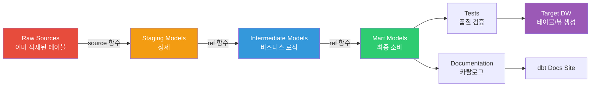

### dbt run 실행 시 일어나는 일

`dbt run` 명령어 하나에 dbt 내부에서 일어나는 일을 단계별로 따라가 보자.

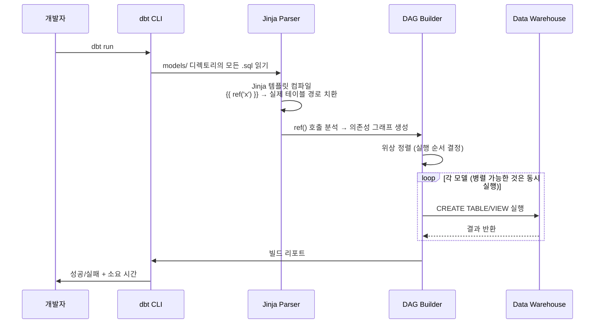

### Jinja + SQL 템플릿 — 왜 SQL에 Jinja를 얹나?

> **이 코드가 하는 일:** 환경(dev/prod)에 따라 다른 계산식을 적용하는 SQL이다. 순수 SQL로는 환경 분기를 표현할 수 없어서 Jinja를 쓴다.

```sql
-- Jinja 조건문 예시
SELECT
    order_id,
    amount,
    
        amount * 1.1 AS amount_with_tax
    
        amount AS amount_with_tax
    
FROM {{ ref('stg_orders') }}
```

dbt가 위 SQL을 prod 타겟으로 컴파일하면 다음과 같이 변환된다.

```sql
-- 컴파일된 결과 (prod)
SELECT
    order_id,
    amount,
    amount * 1.1 AS amount_with_tax
FROM "stockdb"."analytics"."stg_orders"
```

이렇게 `{{ ref('stg_orders') }}`가 실제 DB 경로 `"stockdb"."analytics"."stg_orders"`로 치환되고, 조건문이 펼쳐진다.

> **실무 팁 💡**
> `target/compiled/` 디렉토리에 컴파일된 최종 SQL이 저장된다. 디버깅 시 항상 이 폴더를 먼저 확인하자.

### DAG 기반 의존성 관리

`ref()` 함수가 만들어내는 DAG는 다음과 같이 시각화된다.

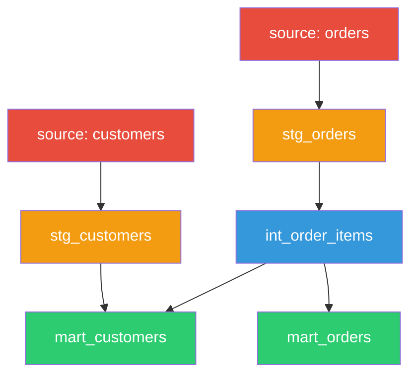

dbt는 이 DAG를 분석해서:

- **위상 정렬**로 실행 순서를 결정한다 (stg → int → mart 순서)
- 의존하지 않는 모델은 **병렬 실행**한다 (`threads` 설정에 따라)
- 어떤 모델이 실패하면 **다운스트림 모델은 자동 스킵**한다

> **함정 ⚠️**
> 직접 SQL에 `FROM stockdb.public.stg_orders`라고 하드코딩하지 말 것. 그러면 dbt가 의존성을 인식하지 못하고, dev/prod 환경 전환도 안 된다. 반드시 `{{ ref('stg_orders') }}`를 써라.

---

## 4. 핵심 개념 — 각 개념을 비유와 함께

dbt에는 7가지 핵심 개념이 있다. 하나씩 비유와 함께 살펴보자.

### 4-1. Models — "변환 SQL의 단위"

> **비유:** 한 모델 = 한 SELECT 문 = 한 테이블/뷰. 함수 하나가 한 가지 일을 하는 것처럼, 모델 하나가 한 변환을 책임진다.

모델은 dbt의 가장 기본 단위다. **하나의 `.sql` 파일이 하나의 모델**이며, 실행하면 데이터베이스에 테이블 또는 뷰가 생성된다.

#### ref() 함수 — 모델 참조의 표준

> **이 코드가 하는 일:** 정제된 일봉 시세(`stg_stock_prices`)와 종목 정보(`stg_stock_info`)를 조인하여 일별 수익률을 계산하는 mart 모델이다. `ref()`로 다른 모델을 참조한다.

```sql
-- models/marts/mart_daily_returns.sql
SELECT
    sp.ticker,
    sp.trade_date,
    sp.close_price,
    sp.close_price / LAG(sp.close_price) OVER (
        PARTITION BY sp.ticker ORDER BY sp.trade_date
    ) - 1 AS daily_return,
    si.market_cap
FROM {{ ref('stg_stock_prices') }} sp
LEFT JOIN {{ ref('stg_stock_info') }} si
    ON sp.ticker = si.ticker
```

`ref()`가 하는 일을 정리하면:

1. dbt에게 "이 모델은 `stg_stock_prices`에 의존한다"고 선언
2. 컴파일 시점에 환경에 맞는 실제 경로로 치환 (dev면 `dev_schema.stg_stock_prices`, prod면 `analytics.stg_stock_prices`)
3. DAG에 의존성 엣지(edge)를 추가

#### Materialization — 모델을 어떻게 물리화할 것인가

같은 SELECT 문이라도 어떤 형태로 DB에 만들지 선택할 수 있다. 이것이 **materialization**이다.

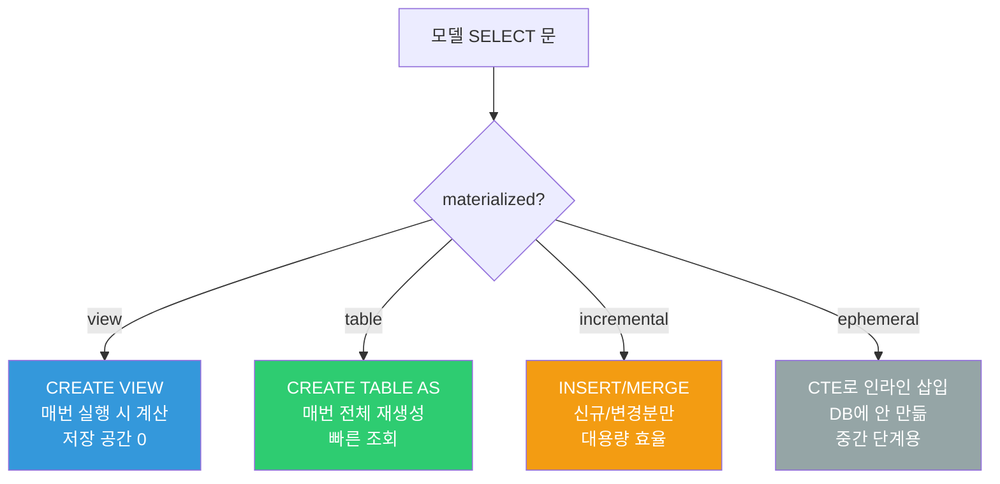

| 방식 | 어떻게 만들어지나 | 언제 쓰나 |
|------|-------------------|-----------|
| `view` | `CREATE VIEW` (기본값) | 자주 변경되는 로직, 작은 데이터, 항상 최신이 필요 |
| `table` | `CREATE TABLE AS SELECT` | 자주 조회되는 집계, 계산 비용이 높은 변환 |
| `incremental` | `INSERT/MERGE` (신규분만) | 대용량 팩트 테이블, 매일 늘어나는 로그 |
| `ephemeral` | CTE로 다른 모델에 인라인 | 중간 단계, DB에 별도 객체 안 만들고 싶을 때 |

#### Incremental Materialization — 대용량의 핵심

> **이 코드가 하는 일:** 일봉 시세를 incremental로 적재한다. 첫 실행 시 전체를 만들고, 이후엔 마지막 trade_date 이후 신규분만 INSERT한다.

```sql
-- models/marts/mart_stock_summary.sql
{{ config(materialized='incremental', unique_key='ticker || trade_date') }}

SELECT
    ticker,
    trade_date,
    close_price,
    volume,
    CURRENT_TIMESTAMP AS updated_at
FROM {{ ref('stg_stock_prices') }}


WHERE trade_date > (SELECT MAX(trade_date) FROM {{ this }})

```

`` 블록이 핵심이다. 첫 실행에서는 이 블록이 비활성화되어 전체를 빌드하고, 이후 실행에서는 활성화되어 신규분만 가져온다.

> **함정 ⚠️**
> `unique_key`를 잘못 설정하면 INSERT는 잘 되는데 중복 행이 누적된다. 반드시 PK 후보를 정확히 지정해라. dbt는 `unique_key`를 기준으로 MERGE를 수행한다.

> **실무 팁 💡**
> 첫 빌드는 `--full-refresh` 플래그를 줘서 전체 재생성하고, 이후 자동 incremental로 돌리는 패턴이 일반적이다. 데이터 손상 의심 시에도 `--full-refresh`로 복구한다.

모델 설정은 `dbt_project.yml`에서 일괄 지정하거나, 모델 파일 내 `config()` 블록으로 개별 지정한다 (8-3절 참고).

### 4-2. Sources — "원본 데이터 등록"

> **비유:** dbt 프로젝트의 "출입국 신고서". 외부에서 들어온 데이터(raw 테이블)를 dbt에게 정식으로 등록하는 행위.

#### 왜 sources가 필요한가

원본 테이블을 그냥 `FROM stockdb.public.stock_price_1d` 라고 직접 참조해도 SQL은 동작한다. 하지만 그러면 dbt는 다음을 모른다.

- 이 테이블이 dbt 외부에서 적재된 raw 데이터인지
- 마지막으로 언제 적재됐는지
- 어떤 모델이 이 raw 테이블을 쓰고 있는지

`sources`로 등록하면 dbt가 raw 테이블을 **공식 입구**로 인식하고 lineage에 포함시킨다.

#### YAML 정의

> **이 코드가 하는 일:** `stockdb.public` 스키마의 raw 테이블 2개를 dbt source로 등록한다. freshness 임계값을 설정해 24시간 이상 미적재 시 경고, 48시간 시 에러를 발생시킨다.

```yaml
# models/staging/_sources.yml
version: 2
sources:
  - name: stockdb
    database: stockdb
    schema: public
    freshness:
      warn_after: { count: 24, period: hour }
      error_after: { count: 48, period: hour }
    loaded_at_field: updated_at
    tables:
      - name: stock_price_1d
        description: "일봉 시세 데이터"
      - name: stock_info
        description: "종목 메타데이터"
```

#### source() 함수로 참조

> **이 코드가 하는 일:** raw 테이블 `stock_price_1d`를 `source()` 함수로 참조하여 staging 모델을 만든다. 직접 `FROM stockdb.public.stock_price_1d`를 쓰지 않는 이유는 lineage 추적과 환경 전환을 위해서다.

```sql
-- models/staging/stg_stock_prices.sql
SELECT ticker, trade_date, open_price, high_price, low_price, close_price, volume
FROM {{ source('stockdb', 'stock_price_1d') }}
WHERE trade_date >= '2020-01-01'
```

#### Freshness 체크

```bash
dbt source freshness   # 등록된 source의 최근 적재 시간 점검
```

이 명령어를 매일 새벽 빌드 전에 돌리면 EL 단계 실패를 조기에 감지할 수 있다.

> **실무 팁 💡**
> Airflow에서 EL 작업 직후, dbt 빌드 직전에 `dbt source freshness`를 끼워 넣자. 새벽에 EL이 실패했는데 그걸 모르고 변환을 돌리는 사고를 막을 수 있다.

### 4-3. Tests — "데이터 품질 자동 검증"

> **비유:** 단위 테스트의 데이터 버전. SQL을 짤 때 "이 컬럼은 절대 NULL이 아니다", "이 PK는 유일해야 한다"는 약속을 코드로 명시한다.

#### 왜 테스트가 중요한가 — 시나리오

자정에 적재 작업이 부분 실패해서 `stg_stock_prices`의 절반이 NULL인 채로 통과했다. 다음 모델 `mart_daily_returns`는 그걸 받아서 NULL 수익률을 계산했다. **다음날 아침 대시보드가 빈 채로 떴고, 비즈니스팀은 회의를 못 했다.**

자동 테스트가 있었다면 빌드 단계에서 `not_null` 테스트가 실패해 전체 파이프라인이 멈췄을 것이고, 잘못된 데이터가 다운스트림으로 흘러가지 않았을 것이다.

#### Schema Tests — YAML로 선언

dbt가 기본 제공하는 테스트 4종은 다음과 같다.

| 테스트 | 검증 내용 |
|--------|----------|
| `unique` | 컬럼 값이 유일한가 (PK 중복 검사) |
| `not_null` | 컬럼에 NULL이 없는가 |
| `accepted_values` | 컬럼 값이 허용된 목록에 속하는가 |
| `relationships` | FK가 다른 테이블의 PK에 존재하는가 (FK 무결성) |

> **이 코드가 하는 일:** `stg_stock_prices`의 ticker, trade_date에 not_null 검사를 적용하고, (ticker, trade_date) 조합의 유일성을 검증한다. `stg_stock_info`의 market 컬럼은 4개 값만 허용한다.

```yaml
# models/staging/_schema.yml
version: 2
models:
  - name: stg_stock_prices
    description: "정제된 일봉 시세"
    columns:
      - name: ticker
        tests: [not_null]
      - name: trade_date
        tests: [not_null]
    tests:
      - unique:
          column_name: "ticker || '-' || trade_date"
  - name: stg_stock_info
    columns:
      - name: ticker
        tests: [unique, not_null]
      - name: market
        tests:
          - accepted_values:
              values: ['KOSPI', 'KOSDAQ', 'NYSE', 'NASDAQ']
```

#### Custom Tests — 비즈니스 규칙을 SQL로

기본 4종으로 표현 안 되는 규칙은 SQL로 직접 작성한다.

> **이 코드가 하는 일:** 종가가 0 이하인 행을 찾는 SQL. dbt 규칙에 따라 결과가 0행이면 통과, 1행 이상이면 테스트 실패다. "종가는 항상 양수여야 한다"는 비즈니스 규칙을 코드로 표현한다.

```sql
-- tests/assert_positive_close_price.sql
SELECT *
FROM {{ ref('stg_stock_prices') }}
WHERE close_price <= 0
```

#### 테스트 실행

```bash
dbt test                              # 전체 테스트
dbt test --select stg_stock_prices    # 특정 모델만
dbt build                             # run + test 함께
```

> **함정 ⚠️**
> `dbt build`는 모델 빌드와 테스트를 함께 실행해서 편하지만, 실패 지점이 모델 빌드인지 테스트인지 헷갈릴 수 있다. 운영에서는 `dbt run` 후 `dbt test`로 분리해서 단계별로 모니터링하는 것을 권장한다.

### 4-4. Documentation — "SQL과 동기화된 문서"

> **비유:** Sphinx/JSDoc의 데이터 버전. 코드 옆에 description을 적어두면 자동으로 카탈로그 사이트가 만들어진다.

#### description 필드

YAML의 `description` 필드에 모델/컬럼 설명을 작성한다. 이것이 카탈로그에 그대로 노출된다.

```yaml
models:
  - name: mart_daily_returns
    description: |
      종목별 일일 수익률을 계산한 mart 테이블.
      LAG 함수로 전일 대비 변화율을 산출하며, KOSPI/KOSDAQ만 포함한다.
    columns:
      - name: ticker
        description: "Yahoo 포맷 티커 (예: 005930.KS)"
      - name: daily_return
        description: "전일 종가 대비 변화율 (소수). 첫 거래일은 NULL."
```

#### Doc Blocks — 긴 설명을 별도 파일로

긴 설명이나 마크다운이 필요하면 별도 `.md` 파일로 분리한다.

```markdown

티커는 Yahoo Finance 포맷을 따른다.
- 한국: `{종목코드}.KS` (KOSPI), `{종목코드}.KQ` (KOSDAQ)
- 미국: `{심볼}` (예: AAPL, MSFT)

```

YAML에서 참조:

```yaml
columns:
  - name: ticker
    description: "{{ doc('ticker_format') }}"
```

#### dbt docs 명령어

```bash
dbt docs generate   # catalog.json + manifest.json 생성
dbt docs serve      # 로컬 웹서버에서 카탈로그 사이트 띄우기 (http://localhost:8080)
```

생성되는 카탈로그 사이트는 다음을 포함한다.

- 모델별 description, 컬럼 설명
- 테스트 결과 표시
- DAG 시각화 (lineage 탐색)
- raw SQL과 컴파일된 SQL 비교

### 4-5. Seeds — "참조 데이터 (CSV → 테이블)"

> **비유:** Django의 fixture, Rails의 seed. 작은 정적 데이터(코드 매핑, 환율 테이블)를 CSV로 보관하고 DB에 로드한다.

#### 언제 seeds를 쓰나

- 시장 코드 → 시장명 매핑 (`KOSPI` → `유가증권시장`)
- 통화 코드 → 환율 (테스트용)
- 섹터 코드 → 섹터명
- 휴장일 캘린더

> 큰 데이터(수백만 행)에는 적합하지 않다. CSV 한 줄씩 INSERT하므로 느리다. 보통 수천 행 이하의 정적 lookup 테이블에 쓴다.

#### 사용법

```csv
# seeds/market_codes.csv
code,name,country
KOSPI,유가증권시장,KR
KOSDAQ,코스닥시장,KR
NYSE,New York Stock Exchange,US
NASDAQ,NASDAQ,US
```

```bash
dbt seed   # CSV를 테이블로 로드
```

모델에서 다른 ref()와 똑같이 참조한다.

```sql
SELECT
    si.ticker,
    mc.name AS market_name
FROM {{ ref('stg_stock_info') }} si
LEFT JOIN {{ ref('market_codes') }} mc ON si.market = mc.code
```

### 4-6. Snapshots — "변경 이력 추적 (SCD Type 2)"

> **비유:** 사진 찍어 보관하는 행위. 매일 같은 자리에서 사진을 찍어두면 "그 사람이 작년에 어떻게 생겼는지"를 안다. SCD Type 2가 정확히 그것이다.

#### 언제 snapshots를 쓰나

원본 테이블이 **현재 값만 보관**하고, dbt가 **변경 이력을 보존**해야 하는 상황.

- 종목 정보 (회사명 변경, 섹터 재분류 이력)
- 고객 정보 (주소 변경, 등급 변경)
- 상품 가격 변동 이력

#### 동작 원리

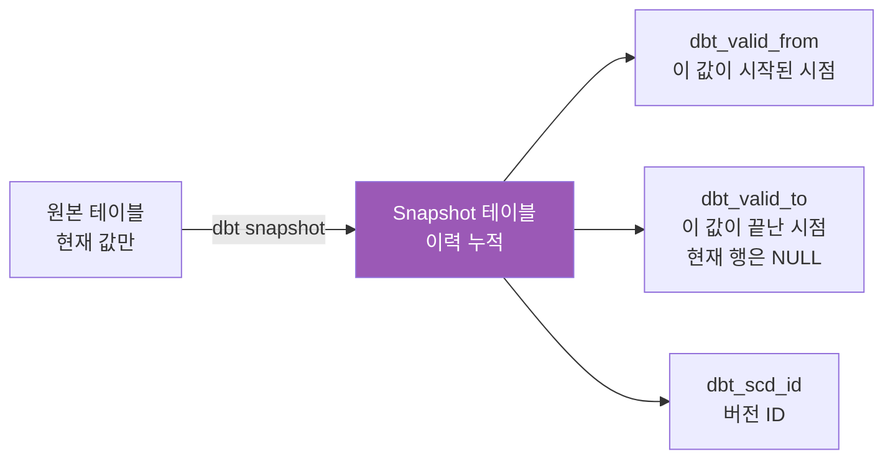

#### 정의

> **이 코드가 하는 일:** stock_info 테이블의 변경을 매일 스냅샷한다. ticker가 같은데 다른 컬럼 값이 바뀌면 새 행을 INSERT하고, 이전 행의 dbt_valid_to를 채운다.

```sql
-- snapshots/snap_stock_info.sql

{{ config(target_schema='snapshots', unique_key='ticker',
          strategy='timestamp', updated_at='updated_at') }}
SELECT ticker, company_name, sector, market_cap, updated_at
FROM {{ source('stockdb', 'stock_info') }}

```

`dbt snapshot` 실행 시 자동 추가되는 컬럼:

| 컬럼 | 의미 |
|------|------|
| `dbt_valid_from` | 이 버전이 시작된 시각 |
| `dbt_valid_to` | 이 버전이 끝난 시각 (현재 행은 NULL) |
| `dbt_scd_id` | 버전을 구분하는 해시 ID |

> **함정 ⚠️**
> snapshot은 dbt run에 포함되지 않는다. 별도로 `dbt snapshot`을 호출해야 한다. Airflow DAG 짤 때 누락되기 쉽다.

### 4-7. Macros — "재사용 가능한 SQL 함수"

> **비유:** Python의 함수, Excel의 사용자 정의 함수. 자주 쓰는 SQL 패턴을 한 번 정의하고 여러 모델에서 호출한다.

#### 매크로 정의

> **이 코드가 하는 일:** USD 가격을 KRW로 환산하는 매크로. 환율 1350을 곱해 반올림한다. 컬럼 이름만 인자로 받고, SQL 표현식을 반환한다.

```sql
-- macros/cents_to_won.sql

    ROUND({{ column_name }} * 1350, 0)

```

#### 호출

```sql
SELECT
    ticker,
    {{ cents_to_won('close_price_usd') }} AS close_price_krw
FROM {{ ref('stg_us_stock_prices') }}
```

컴파일 결과:

```sql
SELECT
    ticker,
    ROUND(close_price_usd * 1350, 0) AS close_price_krw
FROM "stockdb"."analytics"."stg_us_stock_prices"
```

#### 외부 패키지 — dbt_utils

매크로를 직접 만들기 전에, **거의 다 있는** dbt_utils 패키지부터 확인하자.

```yaml
# packages.yml
packages:
  - package: dbt-labs/dbt_utils
    version: "1.3.0"
  - package: dbt-labs/codegen
    version: "0.12.1"
```

```bash
dbt deps   # 패키지 설치
```

dbt_utils가 제공하는 유용한 매크로:

- `dbt_utils.surrogate_key([컬럼들])` — 여러 컬럼을 해시한 surrogate key
- `dbt_utils.pivot()` / `unpivot()` — 피벗 SQL 자동 생성
- `dbt_utils.date_spine()` — 날짜 시리즈 테이블 (캘린더 dim)
- `dbt_utils.star()` — 특정 컬럼 제외하고 모두 SELECT

> **실무 팁 💡**
> 자주 쓰는 변환 패턴이 보이면 매크로로 추출하자. 단, **너무 일찍 추상화하면** 오히려 가독성이 떨어진다. 같은 패턴이 3번 나오면 그때 매크로로 빼는 정도가 적당하다.

---

## 5. dbt Semantic Layer (MetricFlow) — 메트릭 정의 표준

### 5-1. MetricFlow란 — 왜 추가됐나

dbt 모델만으로는 **메트릭 정의가 흩어진다**. 같은 "월간 매출"이 dashboard마다 다른 SQL로 정의되어 있고, BI 도구마다 또 다른 변형이 있다.

MetricFlow는 dbt 1.6+에 통합된 **중앙 메트릭 정의 프레임워크**다. **메트릭의 정의를 코드 한 곳에 모아 두고, 모든 도구가 같은 정의를 사용**하게 만든다.

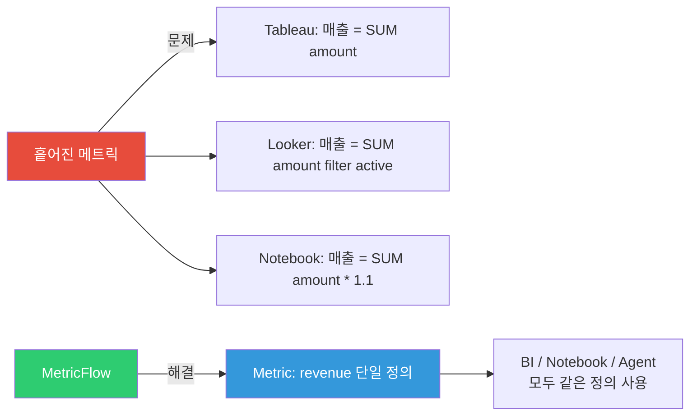

### 5-2. semantic_models YAML — 메트릭의 기반

Semantic Model은 **메트릭 계산의 기반이 되는 논리적 데이터 모델**이다. 일반 dbt 모델이 SQL이라면, semantic model은 그 위에 의미(semantic)를 얹는다.

#### 구성 요소 3가지

| 요소 | 역할 | 종류 |
|------|------|------|
| **entities** | 조인 키 (PK/FK) | primary, foreign, natural |
| **measures** | 집계 가능한 수치 | sum, count, average, min, max, count_distinct |
| **dimensions** | 필터/그룹 기준 (집계 안 됨) | categorical, time |

> **이 코드가 하는 일:** `mart_stock_daily` 모델 위에 semantic model을 정의한다. 종목(stock)과 시장(market)을 entity로, 거래량/평균종가를 measure로, 거래일과 시장코드를 dimension으로 등록한다.

```yaml
# models/semantic/sem_stock_daily.yml
semantic_models:
  - name: stock_daily
    defaults:
      agg_time_dimension: trade_date
    model: ref('mart_stock_daily')
    entities:
      - name: stock
        type: primary
        expr: ticker
      - name: market
        type: foreign
        expr: market_code
    measures:
      - name: total_volume
        agg: sum
        expr: volume
      - name: avg_close
        agg: average
        expr: close_price
      - name: trade_count
        agg: count
        expr: ticker
    dimensions:
      - name: trade_date
        type: time
        type_params:
          time_granularity: day
      - name: market_code
        type: categorical
```

### 5-3. Metrics — 비즈니스 지표 정의

Measure는 단순 집계 수치이고, **Metric은 그 위에 비즈니스 의미를 얹은 지표**다.

#### 메트릭 4가지 유형

| 유형 | 설명 | 예시 |
|------|------|------|
| `simple` | 단일 measure 직접 참조 | "총 매출 = sum(amount)" |
| `derived` | 여러 메트릭의 수식 | "이익률 = revenue - cost / revenue" |
| `cumulative` | 기간 누적 | "30일 누적 거래량" |
| `ratio` | 두 measure의 비율 | "전환율 = orders / visits" |

> **이 코드가 하는 일:** KOSPI 종목만 필터링한 평균 종가 메트릭과, 30일 누적 거래량 메트릭을 정의한다. simple/cumulative 두 가지 유형 예시.

```yaml
# models/semantic/metrics_stock.yml
metrics:
  - name: daily_avg_close
    description: "일별 평균 종가"
    type: simple
    type_params:
      measure: avg_close
    filter: |
      {{ Dimension('stock__market_code') }} = 'KOSPI'

  - name: cumulative_volume
    description: "누적 거래량"
    type: cumulative
    type_params:
      measure: total_volume
      window: 30
      grain_to_date: month
```

#### MetricFlow 쿼리 예시

```bash
mf query --metrics daily_avg_close --group-by trade_date__day
```

이 명령어 하나로 정의된 메트릭이 SQL로 컴파일되어 실행된다.

### 5-4. dbt Semantic Layer API의 한계 — 매우 중요

MetricFlow의 현실적 제약을 명확히 알아야 한다.

| 기능 | dbt Core | dbt Cloud |
|------|----------|-----------|
| Semantic Model 정의 | O | O |
| Metric 정의 | O | O |
| MetricFlow CLI 쿼리 | O | O |
| **Semantic Layer API** (REST/GraphQL) | **불가** | **제공** |
| BI 도구 연동 (Tableau, Looker 등) | 불가 | 제공 |
| Agent Tool 호출 | 불가 | 제공 |

> **함정 ⚠️**
> dbt Core에서 메트릭을 정의하는 것은 가능하지만, **외부 도구(BI/Agent)에서 API로 호출하는 것은 불가능**하다. 이게 가장 흔한 오해다.
> API 서빙이 필요하면:
> - **유료**: dbt Cloud + Semantic Layer
> - **오픈소스**: Cube.js를 dbt 위에 얹어 사용

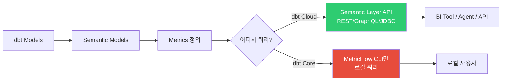

---

## 6. 데이터 소스 연결 (Adapter 시스템)

### dbt가 다양한 DW를 지원하는 방식

dbt는 **adapter 패턴**으로 데이터 웨어하우스 연결을 추상화한다. 각 DW 별로 별도의 어댑터 패키지가 있고, dbt Core는 어댑터를 통해 SQL을 실행한다.

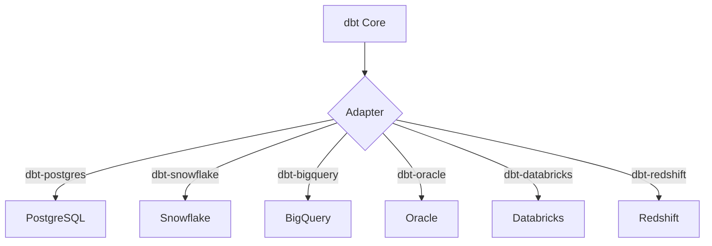

### 지원 어댑터

| 어댑터 | 설치 명령 | 유지 주체 |
|--------|-----------|-----------|
| PostgreSQL | `pip install dbt-postgres` | dbt Labs (공식) |
| Snowflake | `pip install dbt-snowflake` | dbt Labs (공식) |
| BigQuery | `pip install dbt-bigquery` | dbt Labs (공식) |
| Redshift | `pip install dbt-redshift` | dbt Labs (공식) |
| Databricks | `pip install dbt-databricks` | Databricks (공식) |
| **Oracle** | `pip install dbt-oracle` | **Oracle (커뮤니티)** |
| SQL Server | `pip install dbt-sqlserver` | 커뮤니티 |
| Spark | `pip install dbt-spark` | dbt Labs |

> **함정 ⚠️**
> Oracle 어댑터는 Oracle이 직접 유지하지만, **dbt Labs 공식 어댑터가 아니다**. 새 dbt 버전 출시 후 Oracle 어댑터가 호환되기까지 시간이 걸릴 수 있다. 프로덕션에서는 어댑터 버전과 dbt-core 버전을 같이 핀(pin)으로 묶는 것이 안전하다.

### profiles.yml — 연결 설정의 중앙

`profiles.yml`은 dbt의 DB 연결 정보를 담는 파일이다. 보통 `~/.dbt/profiles.yml` 또는 프로젝트 루트에 둔다.

#### Oracle 연결

> **이 코드가 하는 일:** Oracle DB에 연결하는 dev 타겟을 정의한다. 비밀값은 `env_var()`로 환경 변수에서 읽어온다 (절대 평문 기재 금지).

```yaml
# profiles.yml (Oracle)
bip_pipeline:
  target: dev
  outputs:
    dev:
      type: oracle
      host: oracle-host.example.com
      port: 1521
      user: "{{ env_var('ORACLE_USER') }}"
      pass: "{{ env_var('ORACLE_PASSWORD') }}"
      database: ORCL
      service: orcl_service
      schema: ANALYTICS
      threads: 4
```

dbt-oracle 1.7+ 에서 Oracle 19c 이상을 공식 지원한다. `python-oracledb` (thin 모드)를 사용하면 Oracle Instant Client 없이도 연결 가능하다.

#### PostgreSQL 연결 — 가장 단순

> **이 코드가 하는 일:** PostgreSQL의 dev/prod 두 타겟을 정의한다. dev는 로컬 localhost, prod는 컨테이너 네트워크의 `bip-postgres` 호스트를 본다. `--target prod` 인자로 전환한다.

```yaml
# profiles.yml (PostgreSQL)
bip_pipeline:
  target: dev
  outputs:
    dev:
      type: postgres
      host: localhost
      port: 5432
      user: "{{ env_var('POSTGRES_USER') }}"
      pass: "{{ env_var('POSTGRES_PASSWORD') }}"
      dbname: stockdb
      schema: public
      threads: 4

    prod:
      type: postgres
      host: bip-postgres
      port: 5432
      user: "{{ env_var('POSTGRES_USER') }}"
      pass: "{{ env_var('POSTGRES_PASSWORD') }}"
      dbname: stockdb
      schema: analytics
      threads: 8
```

> **실무 팁 💡**
> `threads`는 dbt가 병렬로 실행할 모델 수를 제한한다. PostgreSQL은 4-8, Snowflake/BigQuery는 16-32까지 늘릴 수 있다. DW의 동시 쿼리 제한을 보고 결정한다.

---

## 7. Docker 컨테이너 설치 — 실전

### 7-1. 왜 Docker로 설치하나?

dbt를 로컬에 직접 설치하면:

- Python 버전 충돌 (dbt 1.9는 Python 3.9-3.12)
- 어댑터 버전 충돌 (특히 dbt-oracle)
- 팀원마다 환경이 달라짐 → "내 PC에선 돌아가는데?"

Docker로 격리하면 이 문제들이 사라진다.

### 7-2. dbt Core Docker 설치

#### Dockerfile

> **이 코드가 하는 일:** Python 3.11 베이스에 dbt-core 1.9 + dbt-postgres 1.9를 설치하는 Dockerfile. dbt 프로젝트 디렉토리를 `/dbt`로 마운트하고 `DBT_PROFILES_DIR`로 profiles.yml 위치를 지정한다.

```dockerfile
# Dockerfile.dbt
FROM python:3.11-slim

RUN apt-get update && apt-get install -y --no-install-recommends \
    git \
    && rm -rf /var/lib/apt/lists/*

# dbt Core + PostgreSQL 어댑터
RUN pip install --no-cache-dir \
    dbt-core==1.9.* \
    dbt-postgres==1.9.*

# 작업 디렉토리
WORKDIR /dbt

# profiles.yml 위치 지정
ENV DBT_PROFILES_DIR=/dbt

# 프로젝트 파일 복사
COPY dbt_project/ /dbt/

# 기본 명령
ENTRYPOINT ["dbt"]
CMD ["run"]
```

#### docker-compose.yml

> **이 코드가 하는 일:** dbt 서비스와 PostgreSQL을 함께 띄우는 compose 파일. `profiles` 섹션의 `dbt` 라벨로 dbt 서비스는 평소엔 안 띄우고 명시적으로만 실행된다.

```yaml
# docker-compose.dbt.yml
version: "3.8"

services:
  dbt:
    build:
      context: .
      dockerfile: Dockerfile.dbt
    container_name: bip-dbt
    volumes:
      - ./dbt_project:/dbt
      - ./profiles.yml:/dbt/profiles.yml:ro
    environment:
      POSTGRES_USER: ${POSTGRES_USER}
      POSTGRES_PASSWORD: ${POSTGRES_PASSWORD}
    networks:
      - bip-network
    depends_on:
      - postgres
    profiles:
      - dbt

  postgres:
    image: postgres:16-alpine
    container_name: bip-postgres
    environment:
      POSTGRES_DB: stockdb
      POSTGRES_USER: ${POSTGRES_USER}
      POSTGRES_PASSWORD: ${POSTGRES_PASSWORD}
    ports:
      - "5432:5432"
    volumes:
      - pgdata:/var/lib/postgresql/data
    networks:
      - bip-network

volumes:
  pgdata:

networks:
  bip-network:
    driver: bridge
```

```bash
# 실행 방법
docker compose -f docker-compose.dbt.yml run --rm dbt run    # 모델 빌드
docker compose -f docker-compose.dbt.yml run --rm dbt test   # 테스트
docker compose -f docker-compose.dbt.yml run --rm dbt docs generate  # 문서 생성
```

### 7-3. Oracle 연결 Docker — 진짜 어려운 부분

Oracle 연결은 dbt 도입 시 가장 골치 아픈 부분 중 하나다. 이유는:

1. Oracle Instant Client (C 라이브러리) 의존성
2. 라이선스 동의 절차
3. 아키텍처별 (x86_64 vs arm64) 바이너리 분리

#### thin 모드 vs thick 모드

| 모드 | 설명 | 장점 | 단점 |
|------|------|------|------|
| **thin** | 순수 Python 구현 | Instant Client 불필요, Docker 단순 | 일부 고급 기능 제한 |
| **thick** | Oracle Instant Client 사용 | 모든 기능 지원 | C 라이브러리 설치 복잡 |

> **실무 팁 💡**
> Oracle 19c 이상을 쓰고 있고 일반적인 read/write만 필요하다면 **thin 모드**를 써라. Docker 이미지 크기가 절반 이하로 줄고 빌드 시간도 짧다.

```dockerfile
# Dockerfile.dbt-oracle (PostgreSQL 버전과 차이점만)
RUN pip install --no-cache-dir dbt-core==1.9.* dbt-oracle==1.9.* oracledb
# (선택) Oracle Instant Client - thick 모드 필요 시
# COPY instantclient_21_x/ /opt/oracle/instantclient/
# ENV LD_LIBRARY_PATH=/opt/oracle/instantclient
```

docker-compose에서는 `ORACLE_USER`, `ORACLE_PASSWORD` 환경 변수를 전달하고, 외부 Oracle DB는 `extra_hosts`로 연결한다.

### 7-4. Airflow와 연동 — 실무 패턴

dbt를 Airflow에서 트리거하는 방법은 두 가지다.

#### 방법 1: BashOperator — 단순하지만 한계

> **이 코드가 하는 일:** 매일 07:00에 dbt deps → run → test 순서로 실행하는 Airflow DAG. 각 단계를 별도 task로 분리해 실패 지점을 명확히 한다.

```python
# airflow/dags/dag_dbt_run.py
from airflow import DAG
from airflow.operators.bash import BashOperator
from datetime import datetime

with DAG("dbt_daily_transform", schedule_interval="0 7 * * *",
         start_date=datetime(2026, 1, 1), catchup=False) as dag:
    dbt_deps = BashOperator(task_id="dbt_deps", bash_command="cd /dbt && dbt deps")
    dbt_run  = BashOperator(task_id="dbt_run",  bash_command="cd /dbt && dbt run --target prod")
    dbt_test = BashOperator(task_id="dbt_test", bash_command="cd /dbt && dbt test --target prod")
    dbt_deps >> dbt_run >> dbt_test
```

**한계:** 모델 100개를 task 3개로 묶기 때문에 한 모델 실패 시 전체 재실행이 비효율적이다.

#### 방법 2: Cosmos — dbt 모델 = Airflow task

Cosmos(`astronomer-cosmos`)는 dbt 프로젝트를 Airflow DAG로 자동 변환하는 통합 패키지다.

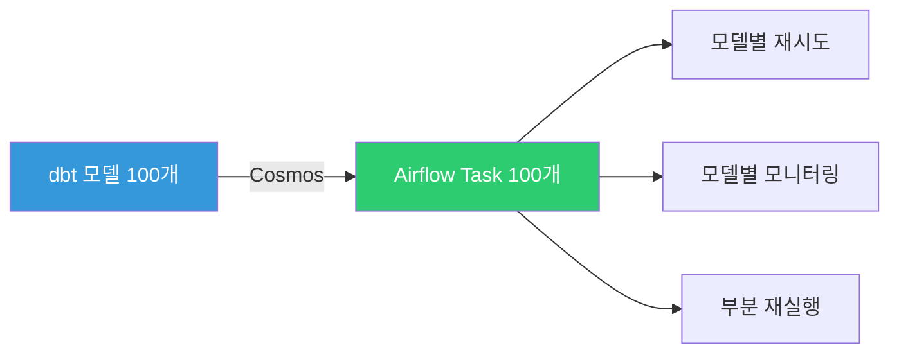

**장점:**

- 모델 단위로 task가 생성되어 세밀한 재시도와 모니터링 가능
- 한 모델 실패 시 그 모델만 재실행
- Airflow UI에서 dbt DAG가 그대로 시각화됨
- `DbtTaskGroup`으로 dbt 모델 DAG가 Airflow task로 1:1 매핑

> **실무 팁 💡**
> 모델이 30개 이상이고 운영 안정성이 중요하면 Cosmos를 권장한다. 모델 5-10개 수준의 작은 프로젝트는 BashOperator로 충분하다.

---

## 8. 프로젝트 구조 — 실전 베스트

### 8-1. 표준 디렉토리 구조

```
dbt_project/
├── dbt_project.yml       # 프로젝트 설정 (이름, 어댑터, materialization 기본값)
├── profiles.yml          # DB 연결 (보통 ~/.dbt/)
├── packages.yml          # 외부 패키지 의존성
├── models/
│   ├── staging/          # ★ Bronze: raw 정제 (_sources.yml, _schema.yml, stg_*.sql)
│   ├── intermediate/     # ★ Silver: 비즈니스 로직 조합 (int_*.sql)
│   ├── marts/            # ★ Gold: 최종 소비 테이블 (mart_*.sql, dim_*, fct_*)
│   └── semantic/         # MetricFlow 정의 (sem_*.yml, metrics_*.yml)
├── tests/                # 커스텀 SQL 테스트
├── seeds/                # CSV 참조 데이터
├── snapshots/            # SCD Type 2 이력 추적
├── macros/               # 재사용 SQL 함수
└── docs/                 # doc blocks (긴 markdown 설명)
```

### 8-2. Medallion 패턴 적용 — Bronze/Silver/Gold

dbt 커뮤니티의 표준 layering 패턴이 Medallion 아키텍처와 1:1로 매핑된다.

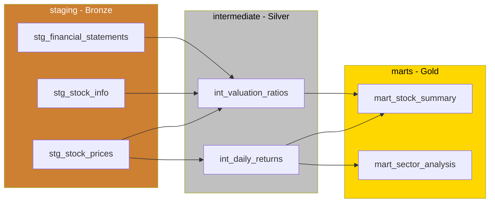

**각 레이어의 역할:**

| 레이어 | 접두사 | 책임 | 규칙 |
|--------|--------|------|------|
| **Staging** | `stg_` | 소스 정제 | 소스별 1:1 매핑, 타입 캐스팅/리네이밍만, 비즈니스 로직 금지 |
| **Intermediate** | `int_` | 비즈니스 로직 조합 | 여러 stg 조인, 윈도우 함수, ephemeral materialization 권장 |
| **Marts** | `mart_`, `dim_`, `fct_` | 최종 소비 | 도메인별 그룹핑 (finance, marketing 등), table materialization 권장 |

> **함정 ⚠️**
> staging 모델에 비즈니스 로직(JOIN, 복잡한 계산)을 넣지 마라. staging은 "raw 데이터를 깨끗이 닦는" 단계다. 한 번 오염되면 전체 레이어 구조가 무너진다.

### 8-3. dbt_project.yml — 한 줄씩 읽기

> **이 코드가 하는 일:** 프로젝트 설정 파일. 모델 경로, 레이어별 materialization 기본값, 스키마 분리를 정의한다. `+materialized: view`처럼 `+` 접두사가 붙은 키는 dbt 설정이다.

```yaml
# dbt_project.yml
name: bip_pipeline                # 프로젝트 이름
version: "1.0.0"                  # 버전
config-version: 2                 # 설정 포맷 버전 (현재 2 고정)
profile: bip_pipeline             # profiles.yml에서 사용할 프로필 이름

# 디렉토리 경로 (기본값 그대로)
model-paths: ["models"]
test-paths: ["tests"]
seed-paths: ["seeds"]
macro-paths: ["macros"]
snapshot-paths: ["snapshots"]

# dbt clean 명령이 지울 디렉토리
clean-targets:
  - target
  - dbt_packages

# 모델별 기본 설정 (디렉토리 단위로 일괄 지정)
models:
  bip_pipeline:
    staging:
      +materialized: view         # Bronze는 view (가벼움)
      +schema: staging            # 별도 스키마에 격리
    intermediate:
      +materialized: ephemeral    # Silver는 CTE로 인라인 (DB에 안 만듦)
    marts:
      +materialized: table        # Gold는 table (조회 빠름)
      +schema: analytics          # 분석가가 보는 스키마

seeds:
  bip_pipeline:
    +schema: seeds                # CSV 데이터는 별도 스키마
```

이 설정의 의미:

- staging 모델은 모두 view로 만들고 staging 스키마에 둔다
- intermediate 모델은 모두 ephemeral (DB에 별도 객체 안 만듦)
- mart 모델은 모두 table로 만들고 analytics 스키마에 둔다
- 각 모델 파일에서 개별 override 가능

---

## 9. dbt와 NL2SQL — Agent에서 어떻게 쓰는가

### 큰 그림

dbt가 변환과 메트릭 정의를 담당하고, NL2SQL Agent가 그 결과물을 자연어 쿼리에 활용하는 구조다.

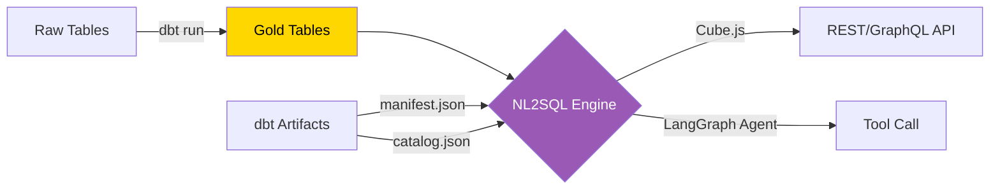

### 활용 방식 3가지

1. **dbt가 Gold Table 생성** — mart 레이어의 테이블을 dbt가 주기적으로 빌드. NL2SQL은 잘 정제된 Gold만 본다.
2. **메타데이터 전달** — dbt가 만드는 `manifest.json`(모델 정의, 컬럼 설명, lineage)과 `catalog.json`(실제 스키마, row count)을 Agent의 컨텍스트로 활용. Agent가 "어떤 테이블이 있고, 어떤 컬럼이 무슨 의미인지" 안다.
3. **Semantic Layer API** (dbt Cloud 전용) — Agent가 dbt Semantic Layer API를 Tool로 호출하여 정의된 메트릭을 일관되게 쿼리.

> **함정 ⚠️**
> dbt Core에서는 Semantic Layer API를 사용할 수 없으므로, 메트릭 API가 필요하면 **Cube.js REST API를 Agent Tool로 호출하는 방식**을 권장한다.

### dbt artifacts를 Agent 컨텍스트로

`dbt docs generate` 결과물인 두 JSON 파일을 Agent가 활용한다.

| 파일 | 내용 | Agent 활용 |
|------|------|-----------|
| `manifest.json` | 모델 정의, lineage, description, test 정보 | 테이블/컬럼 의미를 LLM 프롬프트에 주입 |
| `catalog.json` | 실제 스키마, 컬럼 타입, row count | "어떤 컬럼이 있는지" 조회 |

---

## 10. Cube.js vs dbt — 언제 어느 쪽?

### 한 줄 정리

> **dbt는 "변환의 도구", Cube는 "API 서빙의 도구"다.** 둘은 경쟁이 아니라 보완 관계다.

### 시나리오별 선택 가이드

| 상황 | 추천 |
|------|------|
| 데이터 변환만 필요, BI는 별도 | **dbt 단독** |
| 변환은 끝났고 API 서빙만 필요 | **Cube 단독** |
| 변환 + 메트릭 + API 모두 필요 | **dbt + Cube 하이브리드** |
| 작은 프로젝트, 팀이 SQL에 익숙 | **dbt 단독** (Cube 오버킬) |
| 멀티 BI 도구 + Agent 연동 | **dbt + Cube 하이브리드** |

### 비교표

| 항목 | dbt Core | Cube.js |
|------|----------|---------|
| **역할** | 데이터 변환 + 메트릭 정의 | 메트릭 정의 + API 서빙 |
| **실행 방식** | 배치 (SQL 변환, 스케줄 실행) | 실시간 (API 요청 시 쿼리) |
| **API 제공** | CLI만 (Cloud에서만 API) | REST / GraphQL / SQL API |
| **캐싱** | 없음 (테이블 구체화로 대체) | Pre-aggregation 캐싱 |
| **Oracle 지원** | dbt-oracle (Oracle 공식 유지) | node-oracledb (커뮤니티) |
| **메트릭 정의** | YAML (MetricFlow) | JavaScript (cube.js 파일) |
| **데이터 변환** | 핵심 기능 (SQL 모델링) | 없음 (쿼리만) |
| **문서화** | 내장 (dbt docs) | 별도 구성 필요 |
| **테스트** | 내장 (schema + custom tests) | 없음 |

### 함께 쓰기: dbt + Cube 하이브리드

가장 강력한 조합은 **dbt(변환) + Cube(API 서빙)** 이다. 각자 잘하는 일을 한다.

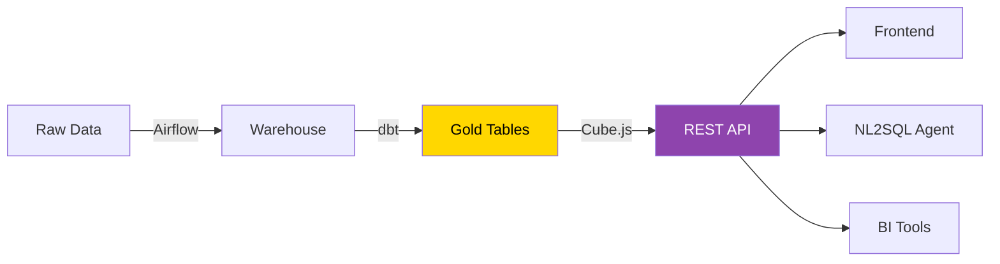

**역할 분담:**

- **dbt:** 스케줄 기반 데이터 변환, 테스트, 문서화 (배치)
- **Cube:** Gold Table 위에 메트릭 정의, 캐싱, REST API 서빙 (실시간)
- **NL2SQL Agent:** Cube API를 Tool로 호출하여 자연어 쿼리 처리

> **실무 팁 💡**
> 둘 다 메트릭을 정의할 수 있어서 처음엔 헷갈린다. 원칙은 **"변환은 dbt, 서빙용 메트릭은 Cube"**. dbt에서 mart 테이블까지 만들고, Cube에서 그 위에 cube/measure를 얹는다.

---

## 11. BIP 경험과의 매핑

### 현재 BIP-Pipeline의 상황

현재 BIP-Pipeline에서 Airflow DAG가 dbt의 역할을 일부 대체하고 있다. 변환 로직이 Python DAG 내부 SQL로 흩어져 있다.

| 현재 (Airflow DAG) | dbt 대응 | 이전 효과 |
|---------------------|----------|-----------|
| `dag_daily_loader` (주가 수집) | Extract/Load - dbt 범위 밖 | 변경 없음 |
| SQL 변환 로직 (Python 내 SQL) | `models/` 디렉토리의 SQL 모델 | 코드 가독성, lineage 자동 |
| 데이터 품질 체크 (수동) | `tests/` 자동 테스트 | 자정 빌드 후 자동 검증 |
| 테이블 설명 (OM에 수동 등록) | YAML description (자동 생성) | 코드와 문서 동기화 |
| DAG lineage (OM 연동) | dbt lineage (자동 추적) | 컬럼 레벨 lineage |
| `indicator_context_snapshot` 생성 | `models/marts/mart_indicator_context.sql` | 의존성 명시 |

### 마이그레이션 검토 포인트

dbt를 즉시 전면 도입하기보다는 다음 단계로 점진 도입하는 것이 안전하다.

1. **점진적 도입** — 기존 Airflow DAG의 변환 로직만 dbt로 분리하고, 오케스트레이션은 Airflow가 유지. EL은 그대로 두고 T만 dbt로 옮긴다.
2. **Cosmos 활용** — Airflow + dbt 통합 시 Cosmos 패키지로 모델별 task 자동 생성. 기존 Airflow 운영 노하우를 살린다.
3. **하이브리드 구성** — dbt(변환/테스트/문서) + Cube(API 서빙) + Airflow(스케줄링)로 역할 분리.
4. **OM 연동 유지** — dbt manifest를 OpenMetadata에 ingest해서 기존 카탈로그를 풍부화.

> **실무 팁 💡**
> 한 번에 다 바꾸려 하지 말고, 새 mart를 만들 때만 dbt로 작성하는 식으로 점진 도입하는 것이 위험을 최소화한다.

---

## 12. 주의사항

dbt 도입 시 자주 마주치는 함정들을 정리한다.

### 12-1. dbt Semantic Layer API는 dbt Cloud 유료 전용

dbt Core만으로는 메트릭을 API로 서빙할 수 없다. API 서빙이 필요하면 Cube.js 등 별도 도구를 사용해야 한다. 이걸 모르고 dbt Core를 도입했다가 **"메트릭 API가 안 되네?"** 라며 당황하는 사례가 흔하다.

### 12-2. dbt Core만으로는 실시간 API 서빙 불가

dbt는 배치 변환 도구이므로, 실시간 쿼리 API가 필요하면 Cube.js, Metriql 등을 별도 구성해야 한다. dbt 자체는 SQL을 컴파일해서 DW에 실행하고 끝나는 도구다.

### 12-3. Oracle 어댑터는 커뮤니티 지원

Oracle이 직접 유지하지만, dbt Labs 공식 어댑터 대비 기능 격차나 버전 지연이 있을 수 있다. 새 dbt 버전 출시 후 Oracle 어댑터가 호환되기까지 시간이 걸릴 수 있으므로, 운영에서는 어댑터/dbt-core 버전을 핀(pin)으로 묶어라.

### 12-4. profiles.yml에 비밀값 직접 기재 금지

반드시 `env_var()` 함수로 환경 변수를 참조해야 한다. 평문으로 기재하면 Git에 비밀값이 흘러간다.

```yaml
# 잘못된 예
pass: "my_real_password"

# 올바른 예
pass: "{{ env_var('POSTGRES_PASSWORD') }}"
```

### 12-5. Incremental 모델 함정

`is_incremental()` 조건을 잘못 설정하면 데이터 누락이나 중복이 발생할 수 있다.

- `unique_key` 누락 → 같은 PK가 여러 번 INSERT (중복)
- `WHERE` 조건이 너무 좁음 → 신규분 누락
- `WHERE` 조건이 너무 넓음 → 같은 행 재INSERT (중복)

**유사 시 대응:** `dbt run --full-refresh`로 전체 재생성 후 다시 incremental로 복귀.

### 12-6. dbt run과 dbt test 분리

`dbt build` 명령은 모델 빌드와 테스트를 함께 실행하지만, 프로덕션에서는 분리 실행하여 실패 지점을 명확히 파악하는 것이 좋다. Airflow에서는 `dbt run` task → `dbt test` task로 나눠라.

### 12-7. snapshot은 dbt run에 포함 안 됨

별도로 `dbt snapshot` 호출이 필요하다. Airflow DAG 짤 때 빠뜨리기 쉬운 부분이다.

### 12-8. ref()를 직접 SQL 경로로 우회하지 말 것

`{{ ref('stg_orders') }}` 대신 `FROM stockdb.public.stg_orders`라고 하드코딩하면:

- dbt가 의존성을 인식 못 함
- dev/prod 환경 전환 안 됨
- lineage 끊김

---

## 13. 참고

### 공식 문서

- 공식 문서: <https://docs.getdbt.com>
- GitHub: <https://github.com/dbt-labs/dbt-core>
- dbt-oracle: <https://github.com/oracle/dbt-oracle>
- MetricFlow: <https://docs.getdbt.com/docs/build/about-metricflow>
- Cosmos (Airflow + dbt): <https://github.com/astronomer/astronomer-cosmos>
- dbt 패키지 허브: <https://hub.getdbt.com>
- Cube.js 공식: <https://cube.dev/docs>

### BIP 내부 문서

- `docs/wrenai_technical_guide.md` — Wren AI 기술 가이드 (NL2SQL 엔진 비교)
- `docs/data_architecture_review.md` — BIP 전체 데이터 아키텍처
- `docs/metadata_governance.md` — 메타데이터 거버넌스 (dbt 도입 시 영향 범위)

### 추천 학습 순서

1. dbt Fundamentals (공식 무료 코스): https://courses.getdbt.com
2. Jaffle Shop 예제 프로젝트로 손에 익히기
3. dbt-utils 패키지 매크로 둘러보기
4. Medallion 패턴(Bronze/Silver/Gold) 적용 실습
5. Cosmos로 Airflow 통합 (운영 단계)

---

## 변경 이력

| 날짜 | 내용 |
|------|------|
| 2026-04-18 | 초안 작성 |
| 2026-04-19 | 표준 포맷 정리 |
| 2026-04-29 | 설명 위주로 전면 재작성 (비유, Why-What-How, 함정/실무 팁 박스, 시나리오 추가, 13 섹션 구조) |
