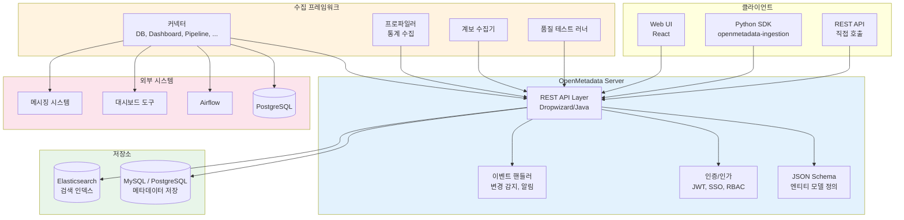
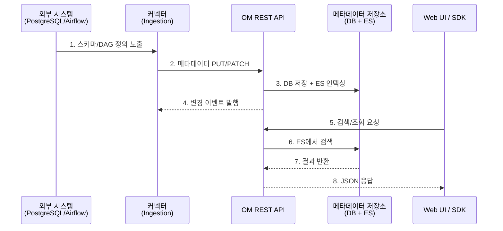
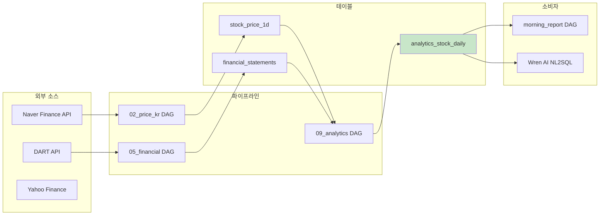
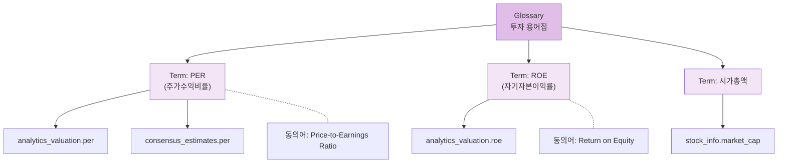
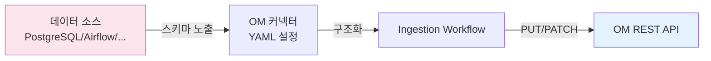
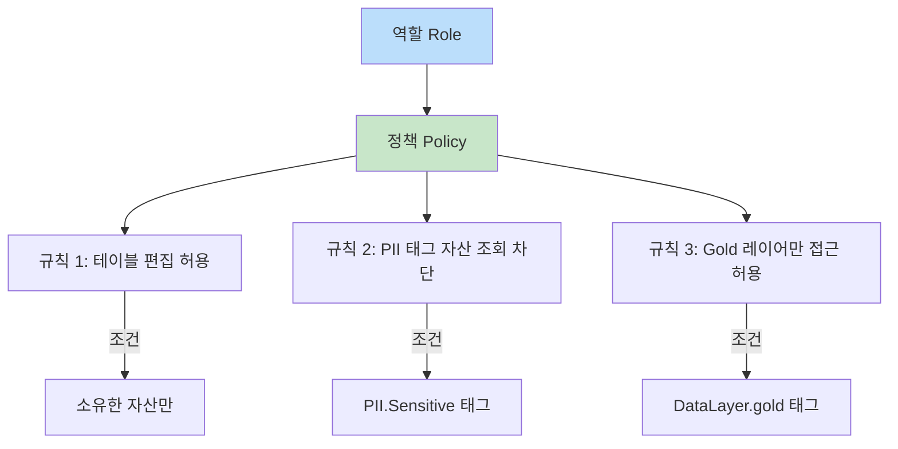
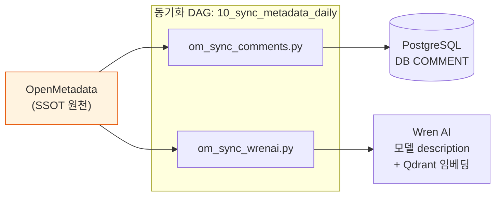
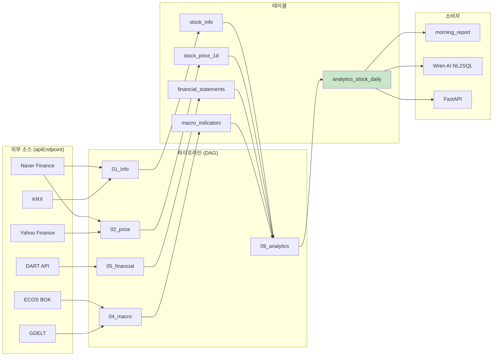
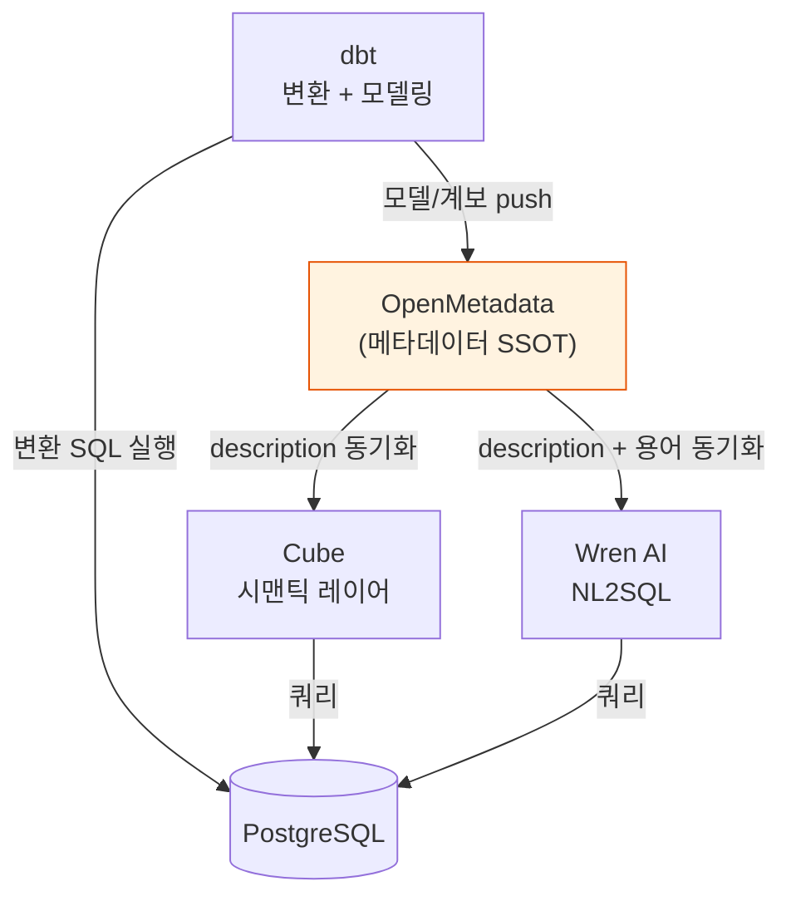

# OpenMetadata 기능 및 사용 가이드

> **공식 문서:** https://docs.open-metadata.org

---

## 목차

1. [개요 — OpenMetadata는 왜 필요한가](#1-개요--openmetadata는-왜-필요한가)
2. [핵심 가치 — 왜 데이터 카탈로그가 필요한가 (4가지 시나리오)](#2-핵심-가치--왜-데이터-카탈로그가-필요한가-4가지-시나리오)
3. [아키텍처 — OpenMetadata는 어떻게 동작하는가](#3-아키텍처--openmetadata는-어떻게-동작하는가)
4. [핵심 기능](#4-핵심-기능)
5. [커넥터 생태계 — 어떻게 자동으로 메타데이터를 수집하는가](#5-커넥터-생태계--어떻게-자동으로-메타데이터를-수집하는가)
6. [관리 기능](#6-관리-기능)
7. [배포 옵션](#7-배포-옵션)
8. [API — 어떻게 메타데이터를 프로그래밍 방식으로 활용하는가](#8-api--어떻게-메타데이터를-프로그래밍-방식으로-활용하는가)
9. [BIP-Pipeline 활용 현황](#9-bip-pipeline-활용-현황)
10. [dbt / Cube / Wren AI와의 관계](#10-dbt--cube--wren-ai와의-관계)
11. [주의사항 및 한계](#11-주의사항-및-한계)
12. [참고](#12-참고)
13. [변경 이력](#13-변경-이력)

---

## 1. 개요 — OpenMetadata는 왜 필요한가

### 비유로 시작하기 — "데이터의 Wikipedia, 그리고 도서관 사서"

OpenMetadata를 한 마디로 설명하면 **"사내 데이터의 Wikipedia + 도서관 사서"**이다.

- **Wikipedia처럼**: 누구나 데이터 자산(테이블, 대시보드, DAG, 모델)을 찾아 읽고, 설명을 달고, 댓글로 토론할 수 있다. 검색창에 "PER"을 치면 정의·계산식·관련 컬럼·예제 쿼리까지 한번에 나온다.
- **도서관 사서처럼**: 새 책(테이블)이 들어오면 자동으로 분류·등록하고, 어떤 책에 누가 책임자인지(Owner), 어느 책장(Domain)에 두어야 하는지를 안다. 책의 출처(Lineage)와 인용 관계까지 추적한다.

또 다른 비유는 **"데이터의 신원증(身分證)"**이다. 모든 테이블/컬럼이 자기 자신의 출처(누가 만들었는지), 이력(언제 어떻게 변했는지), 책임자(누가 관리하는지), 신뢰도(품질 테스트 통과 여부)를 함께 들고 다닌다.

### OpenMetadata란 무엇인가

OpenMetadata는 데이터 조직을 위한 **통합 메타데이터 플랫폼**이다. 데이터 발견(Discovery), 계보(Lineage), 거버넌스(Governance), 품질(Quality), 협업(Collaboration)을 하나의 플랫폼에서 관리할 수 있도록 설계되었다.

이전에는 다음과 같은 도구들을 따로 써야 했다:
- 데이터 검색용 카탈로그 (Amundsen, DataHub)
- 데이터 계보 추적기 (Marquez, Apache Atlas)
- 비즈니스 용어집 (Alation, Collibra)
- 데이터 품질 도구 (Great Expectations, Soda)
- 데이터 협업 도구 (Confluence, Notion)

OpenMetadata는 이 모든 것을 **하나의 백엔드 + 하나의 UI + 하나의 API**로 통합한다.

### 핵심 가치 — 중앙화된 메타데이터 SSOT

모든 데이터 자산의 메타데이터를 **단일 진실 원천(Single Source of Truth)**으로 관리한다. 테이블 설명, 컬럼 정의, 태그, 용어집, 계보 정보가 하나의 카탈로그에 통합되어 있으므로, 여러 도구와 팀 간의 메타데이터 불일치 문제가 사라진다.

- 데이터베이스, 대시보드, 파이프라인, ML 모델 등 **이기종 자산**을 통합 관리
- API 중심 설계로 **프로그래밍 방식 자동화** 가능
- 협업 기능으로 **데이터 문화 형성** 지원

> 💡 **실무 팁: SSOT 원칙은 절대 깨지 말 것**
> BIP-Pipeline에서는 OpenMetadata가 모든 메타데이터의 원천이고, DB COMMENT, Wren AI 모델 description은 모두 **파생본**이다. 만약 DB에서 직접 COMMENT를 수정하면 다음 동기화 때 OM 값으로 덮여 사라진다. 항상 OM 또는 `om_*.py` 스크립트에서 수정하라.

### 오픈소스 (Apache 2.0)

Apache 2.0 라이선스로 배포되며, 커뮤니티 주도로 개발된다. 상용 관리형 서비스(Collate)도 제공되지만 핵심 기능은 모두 오픈소스에 포함되어 있다. GitHub에서 18,000+ 스타를 보유하며, 활발한 Slack 커뮤니티가 운영 중이다.

---

## 2. 핵심 가치 — 왜 데이터 카탈로그가 필요한가 (4가지 시나리오)

데이터 카탈로그가 추상적으로 느껴진다면, 다음 4가지 실무 시나리오를 떠올리면 된다.

### 시나리오 1: "이 데이터, 어디 있더라?"

**상황**: 신규 분석가가 입사. "삼성전자 PER 시계열 데이터가 어디에 있나요?"

- **OM 없음**: Slack에서 묻고 → 누군가 답하기를 기다림 → 다른 사람이 다른 테이블 알려줌 → 혼란
- **OM 있음**: 검색창에 "PER" 입력 → `analytics_valuation`, `consensus_estimates` 두 테이블 즉시 표시. 각 컬럼의 정의·단위·예제 쿼리까지 함께.

→ **데이터 발견(Data Discovery)** 기능이 해결

### 시나리오 2: "이 컬럼 바꿔도 괜찮을까?"

**상황**: `stock_price_1d.close` 컬럼 타입을 `numeric(10,2)` → `numeric(15,4)`로 변경하려 한다.

- **OM 없음**: 누가 이 컬럼을 쓰는지 모름 → 변경 → 다음날 BI 대시보드 깨짐, 모닝리포트 오류
- **OM 있음**: 컬럼의 다운스트림 계보를 한눈에 확인 → 영향 받는 DAG 7개, 대시보드 3개 식별 → 사전 공지·테스트 후 변경

→ **데이터 계보(Lineage)** 기능이 해결

### 시나리오 3: "사용자가 자연어로 질문하는데 LLM이 엉뚱한 컬럼을 가져옵니다"

**상황**: NL2SQL 시스템에 "지난주 대형주 PER 평균"을 물었더니 `consensus_estimates.per_2025`(미래 추정치)를 가져옴. 사용자는 실적 기반 PER을 원했음.

- **OM 없음**: 컬럼 의미 차이를 LLM이 모름. 그냥 "per"이 들어간 컬럼을 추측
- **OM 있음**: 용어집에 "PER (실적기반)" 용어가 `analytics_valuation.per`에 매핑 + "PER (추정)" 용어가 `consensus_estimates.per_*`에 매핑 → LLM이 정확히 구분

→ **용어집(Glossary)** 기능이 해결

### 시나리오 4: "이 데이터 믿어도 됩니까?"

**상황**: 임원 보고용 모닝리포트의 거래대금 수치가 의심스럽다. 어제부터 갑자기 30% 줄었다.

- **OM 없음**: 직접 SQL 짜서 데이터 확인 → 1시간 후 "ETL 누락이었음" 발견
- **OM 있음**: 품질 테스트가 자동 실행됨 → 행 수 이상 알림 → 사고 인지가 즉시 + 인시던트로 자동 등록 + 담당자 자동 호출

→ **데이터 품질(Quality)** 기능이 해결

> 💡 **실무 팁: 4가지 모두를 동시에 충족하는 도구는 흔치 않다**
> 검색만 잘되는 도구, 계보만 잘되는 도구, 용어집만 잘되는 도구는 많다. OpenMetadata의 강점은 이 4가지를 **한 화면, 한 API, 한 데이터 모델**로 묶었다는 것이다. 사일로(silo)가 없으니 자동화도 쉽다.

---

## 3. 아키텍처 — OpenMetadata는 어떻게 동작하는가

### 한 문장 설명

OpenMetadata는 **JSON Schema로 모든 엔티티를 정의 → 그 위에 자동 생성된 REST API → API를 소비하는 UI/SDK** 구조이다. 이 구조 덕분에 UI에서 할 수 있는 모든 일을 API/SDK로도 동일하게 할 수 있다.

### 전체 구조



### 주요 구성 요소

| 구성 요소 | 역할 | 기술 스택 | 비유 |
|-----------|------|-----------|------|
| **Server** | REST API 제공, 비즈니스 로직 | Java (Dropwizard) | 도서관의 사무실 |
| **UI** | 웹 기반 사용자 인터페이스 | React, TypeScript | 도서관 열람실 |
| **Database** | 메타데이터 영구 저장 | MySQL 또는 PostgreSQL | 도서 카드 보관함 |
| **Elasticsearch** | 전문 검색, 필터링 | Elasticsearch 7.x / 8.x | 도서 검색 단말기 |
| **Ingestion Framework** | 메타데이터 수집 파이프라인 | Python (openmetadata-ingestion) | 도서 신착 처리 직원 |

### API 중심 설계의 의미

```
JSON Schema (엔티티 정의)
    ↓
REST API (자동 생성, Swagger 문서)
    ↓
Web UI (API 소비, 시각화)
    ↓
Python SDK (프로그래밍 자동화)
```

이 설계 덕분에 UI에서 할 수 있는 **모든 작업을 API/SDK로도 동일하게** 수행할 수 있다. 자동화 스크립트, CI/CD 파이프라인, 외부 도구 연동이 자연스럽게 가능하다.

> 💡 **실무 팁: API-first의 진짜 가치는 "잠금 효과(lock-in) 없음"**
> 만약 UI 위주 도구였다면 "OM에 등록된 메타데이터를 다른 시스템에 옮기려면?" 같은 마이그레이션 비용이 커진다. OM은 모든 것이 API로 노출되어 있어, 언제든 백업·이관·복원이 가능하다. BIP에서도 `scripts/om_*.py`가 모두 SDK 기반이라 OM 인스턴스를 옮겨도 코드는 그대로 동작한다.

### 메타데이터의 라이프사이클



이 흐름은 매일 반복된다. BIP에서는 Airflow의 `10_sync_metadata_daily` DAG가 이 사이클을 트리거한다.

---

## 4. 핵심 기능

OpenMetadata의 7가지 핵심 기능을 각각 **비유 → Why → What → How** 순으로 설명한다.

### 4-1. 데이터 발견 (Data Discovery)

#### 비유

**구글 검색의 사내 데이터 버전.** 키워드 한 줄로 회사 전체의 테이블/대시보드/DAG/모델을 한꺼번에 찾는다.

#### Why — 왜 필요한가

- **데이터 사일로 해소**: 여러 시스템에 흩어진 데이터를 한곳에서 검색
- **중복 작업 방지**: 이미 존재하는 데이터셋을 모르고 새로 만드는 것을 방지
- **온보딩 비용 감소**: 신규 입사자가 "뭐가 어디 있는지" 묻지 않고 스스로 찾음
- **데이터 이해도 향상**: 스키마, 설명, 태그, 소유자 정보를 통해 데이터의 의미를 빠르게 파악

#### What — 무엇을 검색할 수 있는가

OpenMetadata가 관리하는 데이터 자산 유형:

| 자산 유형 | 설명 | 예시 |
|-----------|------|------|
| 테이블 (Table) | 데이터베이스 테이블/뷰 | `stock_price_1d`, `analytics_valuation` |
| 토픽 (Topic) | 메시징 토픽 | Kafka 토픽 |
| 대시보드 (Dashboard) | BI 대시보드 | Grafana, Superset 패널 |
| 파이프라인 (Pipeline) | ETL/오케스트레이션 | Airflow DAG |
| ML 모델 (ML Model) | 머신러닝 모델 | MLflow 등록 모델 |
| 컨테이너 (Container) | 오브젝트 스토리지 | S3 버킷, GCS 버킷 |
| 검색 인덱스 (Search Index) | 검색 엔진 인덱스 | Elasticsearch 인덱스 |
| API 엔드포인트 (API Endpoint) | REST API | 외부 데이터 소스 API |

#### How — 어떻게 사용하는가

**통합 검색**
- 키워드 검색: 테이블명, 컬럼명, 설명 텍스트를 대상으로 전문 검색
- 고급 검색: 필터(소유자, 태그, 도메인, 서비스, Tier 등)를 조합한 세밀한 검색
- Elasticsearch 기반으로 빠른 응답 제공

**데이터 미리보기**
- 샘플 데이터 조회 (관리자 설정에 따라 활성화/비활성화 가능)
- 컬럼별 통계 (null 비율, 고유값 수, 최대/최소/평균 등)

**상세 정보**
- 스키마: 컬럼명, 타입, 설명, 태그, 용어집 매핑
- 프로파일: 행 수, 컬럼 통계, 분포 히스토그램
- 계보: 데이터의 출처와 소비처
- 쿼리 이력: 해당 테이블에 대해 실행된 쿼리 패턴
- 사용 빈도: 조회 횟수, 최근 접근 사용자

> ⚠️ **함정: 미리보기 기능은 보안 거버넌스를 깨뜨릴 수 있다**
> 기본 설정에서 OM은 컬럼 샘플 데이터를 가져와 UI에 보여준다. 만약 `users` 테이블이 잘못 노출되어 있으면 이메일·전화번호가 OM 화면에 그대로 뜬다. BIP에서는 `includeColumnSample: false`, `generateSampleData: false`로 강제 비활성화. 새 환경 설치 시 가장 먼저 확인해야 하는 옵션이다.

> 💡 **실무 팁: Elasticsearch 인덱스가 깨졌을 때**
> 검색 결과가 이상하면 인덱스 재빌드: `metadata index --service all`. 종종 컨테이너 재시작 후 ES 인덱스가 누락되어 검색이 안 되는 경우가 있다.

---

### 4-2. 데이터 계보 (Data Lineage)

#### 비유

**데이터의 가계도(family tree).** 한 테이블의 컬럼이 어느 부모(소스)에서 왔고, 어떤 자식(하류 테이블/대시보드)에게 영향을 주는지 보여준다.

#### Why — 왜 필요한가

- **영향 분석(Impact Analysis)**: 소스 테이블 변경 시 어떤 하류(downstream) 자산이 영향 받는지 파악
- **근본 원인 추적(Root Cause Analysis)**: 데이터 품질 문제가 어느 단계에서 발생했는지 역추적
- **규정 준수(Compliance)**: 데이터의 전체 이동 경로를 감사 목적으로 기록
- **NL2SQL 맥락 제공**: 테이블 간의 관계를 LLM이 이해하도록 계보 정보를 활용

#### What — Lineage가 표현하는 것



> ⚠️ **함정: Lineage는 데이터 흐름이지 JOIN 관계가 아니다**
> Lineage 그래프의 엣지는 **"이 테이블이 저 테이블을 만들 때 사용되었다"**라는 의미이지, **"이 테이블과 저 테이블을 어떤 키로 JOIN한다"**라는 의미가 아니다. Cube의 `joins`나 NL2SQL Agent의 SQL 생성 컨텍스트로 그대로 쓰면 잘못된 SQL이 나온다. JOIN 관계는 별도로 시맨틱 레이어(Cube/Wren)에서 정의해야 한다.

#### How — 어떻게 등록하는가

**자동 계보 수집**
- 커넥터가 데이터베이스 쿼리 로그, Airflow DAG 정의 등을 분석하여 자동으로 계보를 생성
- Airflow 커넥터: DAG에서 참조하는 테이블 관계를 자동 추출
- 데이터베이스 커넥터: 뷰 정의의 SQL을 파싱하여 계보 생성

**컬럼 레벨 계보**
- 테이블 간 계보뿐 아니라 **개별 컬럼 간의 매핑**까지 추적
- 특정 컬럼이 어떤 소스 컬럼에서 파생되었는지 확인 가능
- 예: `analytics_stock_daily.close_price` ← `stock_price_1d.close`

**수동 계보 추가**
- UI에서 드래그 앤 드롭으로 계보 엣지 추가
- 자동 수집이 놓치는 복잡한 변환 로직에 유용

**Python SDK를 통한 프로그래밍 방식**

> 이 코드가 하는 일: 두 엔티티 사이에 lineage 엣지(소스 → 타겟)를 OM 서버에 추가하고, 해당 엣지가 어떤 파이프라인에서 만들어졌는지 메타데이터로 함께 기록한다.

```python
from metadata.ingestion.lineage.sql_lineage import search_table_entities
from metadata.ingestion.ometa.ometa_api import OpenMetadata

# lineage 엣지 추가 예시
metadata.add_lineage(
    AddLineageRequest(
        edge=EntitiesEdge(
            fromEntity=source_ref,
            toEntity=target_ref,
            lineageDetails=LineageDetails(
                pipeline=pipeline_ref,
                description="DAG에서 자동 등록"
            )
        )
    )
)
```

**시각화**
- 그래프 뷰: 노드(엔티티)와 엣지(관계)로 구성된 인터랙티브 그래프
- 업스트림/다운스트림 탐색: 특정 자산에서 상류/하류를 단계적으로 펼쳐 확인
- 필터링: 특정 서비스, 데이터베이스, 스키마 기준으로 계보 범위 제한

> 💡 **실무 팁: BIP 경험 — DAG 코드에서 직접 lineage 등록**
> 자동 추출은 SQL 파싱이 까다로워 누락이 생긴다. BIP에서는 각 DAG에서 `register_table_lineage_async()`를 명시적으로 호출하여 100% 커버리지를 달성했다. 새 DAG는 이 호출 없이 머지 금지(`docs/metadata_governance.md` 규정).

---

### 4-3. 용어집 (Glossary)

#### 비유

**사내 비즈니스 사전.** "PER", "ROE", "골든크로스" 같은 비즈니스 용어가 실제 어떤 컬럼/계산식에 매핑되는지를 정의한 사전이다. 신입 분석가가 "PER이 뭐예요?"라고 물을 때 답하는 곳이다.

#### Why — 왜 필요한가

- **용어 표준화**: 같은 개념을 팀마다 다른 이름으로 부르는 혼란 방지 ("매출" vs "총매출" vs "영업수익")
- **NL2SQL 정확도 향상**: 사용자가 비즈니스 용어로 질문할 때, 정확한 컬럼으로 매핑
- **신규 팀원 온보딩**: 도메인 지식을 체계적으로 문서화

#### What — Glossary의 계층 구조



**구조**
- Glossary (최상위): 도메인별 용어집 (예: 투자 용어집, 매크로 경제 용어집)
- Term (용어): 개별 비즈니스 용어
- Child Term (하위 용어): 용어 아래 세부 분류 가능

**용어 속성**
- 이름(Name): 영문 식별자 (`per`, `roe`)
- 표시 이름(Display Name): 한글 표시명 (`주가수익비율`)
- 설명(Description): 정의, 계산식, 단위 등 상세 설명
- 동의어(Synonyms): 같은 개념의 다른 명칭 (`PER`, `P/E Ratio`)
- 관련 용어(Related Terms): 연관 개념 링크
- 태그(Tags): 분류용 태그

#### How — 어떻게 사용하는가

**용어-자산 매핑**
- 용어를 테이블 또는 컬럼에 직접 태깅
- NL2SQL에서 사용자 질문의 비즈니스 용어를 정확한 컬럼에 매핑하는 데 핵심적으로 활용

**승인 워크플로우**
- Reviewer 지정: 용어 변경 시 리뷰어의 승인이 필요하도록 설정
- 용어의 품질과 일관성을 조직적으로 관리

**CSV 일괄 임포트/엑스포트**
- 대량의 용어를 CSV 파일로 작성한 뒤 일괄 업로드
- 기존 용어집을 CSV로 내보내 외부 도구에서 편집 후 재임포트
- 용어 이름, 설명, 동의어, 관련 용어, 소유자 등의 컬럼 지원

**스타일링**
- 용어에 색상(Color)과 아이콘(Icon)을 지정하여 시각적 구분
- UI에서 용어가 태깅된 자산을 쉽게 식별

**API 지원**
- REST API로 용어 CRUD, 용어-자산 매핑 자동화 가능
- `scripts/om_build_glossary.py` 같은 스크립트로 프로그래밍 방식 일괄 등록

> ⚠️ **함정: Glossary 용어 description은 SSOT, 하지만 DB COMMENT 동기화 필수**
> OM Glossary 용어에 정의를 잘 써놨어도, DB COMMENT가 비어 있으면 외부 BI 도구나 OM에 등록 안 된 도구는 그 정의를 못 본다. BIP는 `om_sync_comments.py`로 OM → DB COMMENT 자동 동기화하여 일관성 유지.

> 💡 **실무 팁: 용어집은 "비어있어도 등록부터" 하라**
> 처음에는 용어 정의를 완벽하게 작성하기 어렵다. 일단 빈 description으로 용어를 만들어 컬럼에 매핑부터 해두고, 나중에 description을 채우는 방식이 좋다. NL2SQL 정확도는 description보다 매핑 관계에서 먼저 향상된다.

---

### 4-4. 분류 (Classification) & 태그 (Tags)

#### 비유

**도서관의 분류 라벨.** "이 책은 소설인가 비소설인가? 성인용인가 청소년용인가? 신간인가 고서인가?" 같은 다차원 분류를 데이터에 적용하는 것이다.

용어집(Glossary)이 **"이게 무슨 의미인가"**(의미론)을 정의한다면, 태그(Tag)는 **"이게 어떤 속성을 가지는가"**(속성 분류)를 표현한다.

#### Why — 왜 필요한가

- **데이터 분류 체계**: 민감도(PII), 중요도(Tier), 레이어(Raw/Derived/Gold) 등으로 분류
- **검색 효율**: 태그 기반 필터링으로 원하는 자산을 빠르게 찾기
- **접근 제어 기반**: 태그를 RBAC 정책과 연동하여 세분화된 접근 제어
- **자동 거버넌스**: Auto Classification으로 민감 데이터 자동 식별

#### What — 어떤 태그가 있는가

**시스템 분류 (Built-in)**

| 분류 | 태그 예시 | 용도 |
|------|-----------|------|
| PII | `PII.Sensitive`, `PII.NonSensitive` | 개인정보 식별 |
| Tier | `Tier.Tier1`, `Tier.Tier2`, ... | 데이터 중요도 등급 |
| PersonalData | `PersonalData.Personal`, `PersonalData.SpecialCategory` | GDPR 대응 |

**사용자 정의 분류 생성**
- UI 또는 API를 통해 커스텀 Classification 생성
- 예: `DataLayer` (raw, derived, gold), `Domain` (market, financial, macro, news)
- 각 Classification 아래에 하위 태그를 자유롭게 정의

#### How — 어떻게 활용하는가

**자동 태깅 (Auto Classification)**
- 프로파일러 실행 시 컬럼 이름, 데이터 패턴을 분석하여 PII 등을 자동 태깅
- 이메일 패턴, 전화번호 패턴, 신용카드 번호 패턴 등 인식
- 자동 분류 결과를 리뷰 후 확정하는 워크플로우 지원

**태그를 통한 접근 제어**
- RBAC 정책에서 "PII.Sensitive 태그가 붙은 자산은 Data Steward만 접근 가능" 같은 규칙 설정
- 태그 기반 정책은 자산이 추가될 때 자동 적용

> 💡 **실무 팁: BIP의 Tier 분류로 비즈니스 크리티컬 데이터 우선 관리**
> Tier 1 = 임원 보고/매출 직결 (예: `analytics_stock_daily`, `consensus_estimates`)
> Tier 2 = 분석 의존 (예: `stock_indicators`, `macro_indicators`)
> Tier 3 = 보조 (예: 로그성 데이터)
> Tier 1은 품질 테스트 필수, 알림 즉시, 설명 커버리지 100%를 강제한다. 모든 데이터를 똑같이 관리하면 비용이 폭증하므로 Tier로 우선순위를 두는 것이 핵심이다.

---

### 4-5. 도메인 & 데이터 제품 (Domains & Data Products)

#### 비유

**사내 부서별 자료실.** 각 부서(도메인)가 자기 자료(데이터 자산)를 관리하고, 다른 부서에 "정식 발행"한 보고서(데이터 제품)만 외부 공유한다.

#### Why — 왜 필요한가

- **데이터 메시(Data Mesh)** 아키텍처 지원: 도메인 소유권 기반 분산 데이터 관리
- **데이터 발견성 향상**: 도메인별로 자산을 탐색하여 관련 데이터를 빠르게 찾기
- **책임 명확화**: 각 도메인에 소유자를 지정하여 데이터 품질 책임 부여

#### What & How

**도메인 기반 데이터 조직**
- 도메인 생성: `Market`, `Financial`, `Macro`, `News` 등
- 각 도메인에 관련 테이블, 파이프라인, 대시보드를 배정
- 도메인 소유자(Domain Owner)를 지정하여 거버넌스 책임 할당

**데이터 제품 정의**
- 도메인 내에서 특정 소비자(팀, 서비스)를 위한 데이터 제품 정의
- 데이터 제품에 포함되는 자산 목록, 품질 SLA, 접근 권한 설정
- 예: "투자 분석 데이터 제품" = `analytics_stock_daily` + `analytics_valuation` + `consensus_estimates`

> 💡 **실무 팁: 도메인은 너무 많이 쪼개지 마라**
> 처음부터 10개 이상 도메인을 만들면 관리가 어렵다. 4~6개로 시작하고 필요할 때 분할하는 것이 좋다. BIP는 market/financial/macro/news/portfolio/product/user 7개를 운영 중.

---

### 4-6. 데이터 품질 & 관찰성

#### 비유

**데이터의 건강검진소.** 매일 정해진 시간에 각 테이블의 행 수·NULL 비율·값 범위를 검사하고, 이상 신호가 있으면 담당자에게 알림. "이 테이블 어제부터 갑자기 행 수가 절반인데 괜찮아?" 같은 의문을 자동으로 던진다.

#### Why — 왜 필요한가

- **데이터 신뢰성 확보**: 잘못된 데이터로 의사결정을 내리는 위험 방지
- **조기 이상 감지**: 데이터 파이프라인 장애를 빠르게 발견
- **SLA 관리**: 데이터 제품의 품질 기준 충족 여부를 모니터링

#### What — 어떤 테스트가 가능한가

**품질 테스트 유형 (No-code 테스트)**

코드를 작성하지 않고 UI에서 테스트를 정의할 수 있다:

| 테스트 유형 | 설명 | 예시 |
|-------------|------|------|
| Column Values to Be Not Null | 특정 컬럼에 NULL이 없어야 함 | `stock_price_1d.close IS NOT NULL` |
| Column Values to Be Unique | 특정 컬럼 값의 고유성 확인 | `stock_info.ticker` |
| Column Values to Be Between | 값 범위 확인 | `stock_price_1d.volume >= 0` |
| Table Row Count to Be Between | 행 수 범위 확인 | `stock_info` 행 수가 2,000~10,000 사이 |
| Column Value Length to Be Between | 문자열 길이 확인 | `ticker` 길이 5~10자 |
| Table Custom SQL Query | 커스텀 SQL로 검증 | 사용자 정의 비즈니스 규칙 |

#### How — 어떻게 운영하는가

**프로파일러**
- 테이블 수준: 행 수, 크기, 생성/수정일
- 컬럼 수준: NULL 비율, 고유값 수, 최소/최대/평균/표준편차
- 히스토그램: 값 분포 시각화
- 시계열 추이: 프로파일 결과를 시간별로 추적하여 변화 감지

**알림 설정**
- 테스트 실패 시 Slack, Teams, Email, Webhook으로 알림 발송
- 심각도(Severity) 기반 알림 라우팅

**인시던트 관리**
- 테스트 실패를 "인시던트"로 등록하고 담당자를 지정
- 해결 과정을 문서화하고 추적
- 해결 완료 시 인시던트를 종료하여 이력 관리

**이상 탐지 (Anomaly Detection)**
- 프로파일러가 수집한 시계열 통계를 기반으로 이상치를 자동 감지
- 행 수의 급격한 변화, NULL 비율 급증 등을 자동 경고
- 별도 설정 없이 프로파일러 실행만으로 동작

> ⚠️ **함정: 프로파일러는 민감 컬럼을 자동 샘플링한다**
> 기본 설정에서 프로파일러는 컬럼 통계를 위해 실제 값을 샘플링한다. 그 결과가 OM 화면에 표시되어 비밀번호 해시·토큰·이메일까지 노출될 수 있다. 반드시 `includeColumnSample: false` + 민감 테이블 `excludes` 패턴 적용.

> 💡 **실무 팁: Tier 1 테이블만 품질 테스트 작성**
> 모든 테이블에 테스트를 다 작성하면 노이즈가 많아 알림 무시 현상이 생긴다. Tier 1 테이블 위주로 핵심 테스트(행 수 범위 + 핵심 컬럼 NOT NULL) 3~5개씩만 작성하는 것이 효과적.

---

### 4-7. 데이터 협업 (Collaboration)

#### 비유

**데이터 자산에 붙은 댓글창.** GitHub Issue처럼 각 테이블/컬럼에 직접 질문을 남기고 토론하며, 변경 사항을 팀원에게 공유한다.

#### Why — 왜 필요한가

- **컨텍스트 보존**: 데이터에 대한 질문과 답변이 해당 자산에 직접 연결 (Slack에 흩어지지 않음)
- **작업 추적**: 메타데이터 보강 요청을 체계적으로 관리
- **변경 인식**: 데이터 자산의 변경 사항을 관심 있는 사용자에게 자동 통보

#### What & How

**대화 스레드 (Conversations)**
- 테이블, 컬럼, 대시보드 등 모든 자산에 대화 스레드를 생성
- `@mention`으로 특정 사용자를 태그하여 질문이나 논의
- Markdown 지원, 코드 블록 삽입 가능

**작업 (Tasks)**
- 설명 요청(Request Description): 빈 설명이 있는 자산에 설명 작성을 요청
- 태그 요청(Request Tag): 태그 추가를 요청
- 담당자 할당, 기한 설정, 상태(Open/Closed) 관리
- 작업 목록을 대시보드에서 한눈에 확인

**공지사항 (Announcements)**
- 특정 자산에 시간 제한 공지 등록 (예: "이 테이블은 4/15~4/20 마이그레이션 예정")
- 해당 자산을 조회하는 사용자에게 공지가 표시됨
- 시작일/종료일 지정으로 자동 노출/숨김

**활동 피드 (Activity Feeds)**
- 사용자가 팔로우한 자산의 모든 변경 사항을 타임라인으로 표시
- 스키마 변경, 태그 추가, 설명 수정, 소유자 변경 등 기록
- 개인화된 피드로 관심 영역의 변화만 추적

**팔로우 & 소유자 지정**
- 자산 팔로우: 변경 알림을 수신
- 소유자(Owner) 지정: 데이터 품질과 메타데이터의 책임자 명시
- 팀(Team) 단위로도 소유권 설정 가능

---

### 4-8. 데이터 인사이트 (Insights)

#### 비유

**메타데이터 KPI 대시보드.** "우리 회사 테이블 중 설명이 있는 비율은? 소유자가 지정된 비율은? 이번 달 신규 자산은 몇 개인가?" 같은 거버넌스 지표를 시각화한다.

#### Why — 왜 필요한가

- **거버넌스 진행 상황 추적**: 설명 커버리지, 태그 적용률 등의 KPI 모니터링
- **데이터 문화 측정**: 팀별/사용자별 기여도와 활용 패턴 파악
- **개선 우선순위 도출**: 메타데이터가 가장 부족한 영역 식별

#### What & How

**KPI 정의**
- 설명 커버리지: 설명이 있는 테이블/컬럼 비율 목표 설정 (예: 95%)
- 소유자 지정률: 소유자가 배정된 자산 비율
- 태그 적용률: 태그가 하나 이상 있는 자산 비율
- 기간별 목표 설정 및 달성률 추적

**데이터 자산 통계**
- 총 자산 수, 유형별 분포
- 시간별 자산 증가 추이
- 테이블별 크기, 행 수 변화

**활용도 분석**
- 가장 많이 조회된 테이블/대시보드
- 활발하게 사용되는 자산 vs 미사용 자산 식별
- 사용자별 활동 통계

> 💡 **실무 팁: 인사이트는 정기적으로 보고하라**
> 매주 또는 매월 인사이트 KPI를 추출해 데이터팀 회의에 공유하면 거버넌스가 자동으로 개선된다. BIP에서는 Gold 컬럼 설명 커버리지를 31% → 99%로 끌어올린 사례가 있는데, 이 KPI가 가시화되어 있었기 때문에 가능했다.

---

## 5. 커넥터 생태계 — 어떻게 자동으로 메타데이터를 수집하는가

### 비유

**자동 발권 시스템을 가진 도서관.** 새 책이 들어오면 직원이 일일이 등록할 필요 없이, 책의 바코드를 읽으면 제목·저자·출판사·ISBN이 자동으로 카탈로그에 등록된다. OM의 커넥터가 이 역할을 한다.

### 동작 원리



각 커넥터는 **YAML 설정 파일**로 정의된다:
- 어느 소스에 연결하는가 (host, port, credential)
- 어떤 스키마/테이블을 포함/제외하는가 (필터 패턴)
- 어떤 메타데이터를 수집하는가 (스키마, 통계, 계보, 쿼리)

OpenMetadata는 50개 이상의 커넥터를 제공한다. 메타데이터 수집(Ingestion), 프로파일링(Profiling), 계보 추출(Lineage), 품질 테스트(Quality) 워크플로우를 지원한다.

### 5-1. 데이터베이스

| 커넥터 | 메타데이터 | 프로파일러 | 계보 | 품질 테스트 |
|--------|:----------:|:----------:|:----:|:-----------:|
| PostgreSQL | O | O | O | O |
| MySQL | O | O | O | O |
| Snowflake | O | O | O | O |
| BigQuery | O | O | O | O |
| Redshift | O | O | O | O |
| Oracle | O | O | O | O |
| MSSQL | O | O | O | O |
| ClickHouse | O | O | O | O |
| Databricks | O | O | O | O |
| Trino / Presto | O | O | O | O |
| DynamoDB | O | - | - | - |
| MongoDB | O | - | - | - |

### 5-2. 대시보드

| 커넥터 | 메타데이터 | 계보 |
|--------|:----------:|:----:|
| Tableau | O | O |
| Power BI | O | O |
| Looker | O | O |
| Superset | O | O |
| Metabase | O | O |
| Grafana | O | - |
| Redash | O | - |
| Mode | O | O |

### 5-3. 파이프라인

| 커넥터 | 메타데이터 | 계보 |
|--------|:----------:|:----:|
| Airflow | O | O |
| dbt | O | O |
| Dagster | O | O |
| Databricks Pipeline | O | O |
| Fivetran | O | O |
| Airbyte | O | - |
| NiFi | O | - |
| Glue | O | O |

### 5-4. 메시징

| 커넥터 | 메타데이터 | 스키마 |
|--------|:----------:|:------:|
| Kafka | O | O |
| Redpanda | O | O |
| Kinesis | O | - |

### 5-5. ML 모델

| 커넥터 | 메타데이터 |
|--------|:----------:|
| MLflow | O |
| SageMaker | O |

### 5-6. 스토리지

| 커넥터 | 메타데이터 |
|--------|:----------:|
| S3 | O |
| GCS | O |
| ADLS | O |

### 5-7. 메타데이터 마이그레이션

기존 메타데이터 카탈로그에서 OpenMetadata로 마이그레이션하는 커넥터:

| 커넥터 | 설명 |
|--------|------|
| Alation | Alation에서 테이블/컬럼 설명, 태그, 용어집 마이그레이션 |
| Atlas | Apache Atlas에서 메타데이터 마이그레이션 |
| Amundsen | Amundsen에서 메타데이터 마이그레이션 |

> 💡 **실무 팁: 커넥터는 처음부터 모두 켜지 마라**
> 일단 PostgreSQL 커넥터 하나로 시작해 메타데이터를 쌓고, 검색·계보·품질이 안정화되면 Airflow → 대시보드 순으로 추가하는 것이 좋다. 한 번에 모두 켜면 노이즈가 많고 디버깅이 어렵다.

---

## 6. 관리 기능

### 6-1. 팀 & 사용자

#### 비유

**회사 조직도를 그대로 가져온다.** 팀과 부서 계층 그대로 OM에 등록하고, 각 자산에 "어느 팀이 책임지는지" 명시한다.

#### Why — 왜 필요한가

- **소유권 관리**: 데이터 자산의 책임 소재를 조직 구조에 맞게 설정
- **접근 제어**: 팀/사용자 단위의 권한 관리
- **협업**: 팀 단위의 알림, 작업 할당

#### What & How

**계층적 팀 구조**
- Organization (최상위) → Business Unit → Division → Department → Group
- 각 수준에서 소유자 설정과 정책 적용 가능
- 상위 팀의 정책이 하위 팀에 상속

**사용자 관리**
- 사용자 초대: 이메일 초대 또는 SSO 연동으로 자동 프로비저닝
- 프로필: 이름, 이메일, 팀 소속, 역할
- 관리자(Admin)가 팀 배정, 역할 변경 가능

**소유권 (Ownership)**
- 모든 데이터 자산에 소유자(사용자 또는 팀) 지정
- 소유자는 해당 자산의 메타데이터 품질, 태그, 설명에 대한 1차 책임
- 소유자 미지정 자산을 대시보드에서 식별하여 할당 독려

> 💡 **실무 팁: 소유자는 팀에 지정, 사용자에 지정 X**
> 개인 사용자에게 소유자를 지정하면 퇴사·이동 시 모든 자산을 재할당해야 한다. 팀 단위 소유자가 안정적이다. 단 협업/멘션을 위해 "기여자(contributor)" 정도로는 개인을 추가할 수 있다.

---

### 6-2. 역할 & 정책 (RBAC)

#### 비유

**회사 출입카드 + 보안 정책.** 어떤 카드(역할)를 가진 사람이 어떤 방(자산)에 들어갈 수 있는지를 규칙(정책)으로 정의한다.

#### Why — 왜 필요한가

- **최소 권한 원칙**: 각 사용자에게 업무에 필요한 최소한의 권한만 부여
- **민감 데이터 보호**: PII, 재무 데이터 등에 대한 접근을 역할별로 제한
- **감사 추적**: 누가 어떤 권한으로 접근했는지 기록

#### What — 기본 역할

| 역할 | 권한 | 대상 사용자 |
|------|------|-------------|
| Admin | 모든 자산과 설정에 대한 전체 권한 | 시스템 관리자 |
| Data Steward | 메타데이터 편집, 용어집/태그 관리, 품질 테스트 설정 | 데이터 거버넌스 담당자 |
| Data Consumer | 읽기 전용, 대화/작업 참여 | 일반 분석가, 개발자 |

**커스텀 역할 생성**
- 기본 역할 외에 조직에 맞는 커스텀 역할 정의 가능
- 예: `NL2SQL Operator` — Gold 레이어 테이블만 조회 가능

#### How — 정책 구조



- 정책은 **규칙(Rule)**의 집합
- 각 규칙: 리소스(table, topic, ...) + 동작(view, edit, delete, ...) + 조건(태그, 소유자, ...) + 효과(allow/deny)
- 정책을 역할에 연결하여 적용

**리소스 레벨 권한 설정**
- 개별 테이블, 파이프라인, 대시보드 단위로 세밀한 권한 설정
- 태그 기반 조건으로 동적 권한 부여 (예: `Tier.Tier1` 자산은 Admin만 수정 가능)

> 💡 **실무 팁: deny가 allow를 이긴다**
> 정책 평가 순서: deny가 하나라도 매치되면 즉시 거부. 따라서 민감 데이터에는 `Tier.Tier1 + PII.Sensitive` 같은 다중 deny를 걸어두면 실수로 권한이 열려도 접근이 차단된다.

---

### 6-3. 봇 & API

#### 비유

**자동 사서 로봇.** 사람이 직접 OM UI에 들어가서 등록하지 않아도, 정해진 토큰을 가진 봇이 매일 밤 새 자산을 등록한다. CI/CD와 연동하여 코드 변경이 곧 메타데이터 변경이 된다.

#### Why — 왜 필요한가

- **자동화**: CI/CD 파이프라인, DAG에서 메타데이터를 프로그래밍 방식으로 관리
- **외부 연동**: Wren AI, dbt, 커스텀 도구 등과 메타데이터 동기화
- **보안**: 사용자 계정이 아닌 전용 서비스 계정으로 API 접근

#### What & How

**서비스 계정 (Bot)**
- `ingestion-bot`: 기본 제공되는 수집용 봇 (메타데이터 수집 워크플로우에 사용)
- 커스텀 봇 생성 가능: 특정 용도에 맞는 최소 권한 봇
- 각 봇에 역할/정책 할당으로 접근 범위 제한

**JWT 인증**
- 봇 계정에 JWT 토큰을 발급하여 API 인증
- 토큰은 `.env` 파일 또는 시크릿 관리 시스템에서 주입
- 토큰 만료/갱신 관리

**REST API (전체 CRUD)**
- 모든 엔티티에 대한 CRUD 엔드포인트 제공
- Swagger UI로 API 문서 확인: `http://<host>:8585/swagger.html`

**Python SDK**

> 이 코드가 하는 일: ingestion-bot의 JWT 토큰으로 OM 서버에 인증 연결을 만든 뒤, FQN으로 테이블을 조회하고 description을 PATCH 한다. CI/CD나 DAG에서 가장 자주 쓰는 패턴.

```python
from metadata.ingestion.ometa.ometa_api import OpenMetadata
from metadata.generated.schema.entity.services.connections.metadata.openMetadataConnection import (
    OpenMetadataConnection,
)

server_config = OpenMetadataConnection(
    hostPort="http://localhost:8585/api",
    authProvider="openmetadata",
    securityConfig={"jwtToken": "<bot-jwt-token>"},
)
metadata = OpenMetadata(server_config)

# 테이블 조회
table = metadata.get_by_name(entity=Table, fqn="bip-postgres.stockdb.public.stock_info")

# 설명 업데이트
metadata.patch_description(entity=Table, source=table, description="종목 마스터 테이블")
```

> 💡 **실무 팁: Bot + JWT로 CI/CD 통합 (테이블 등록 자동화)**
> BIP에서는 새 테이블이 추가될 때 PR에서 자동으로 `om_register_data_sources.py` 같은 스크립트를 실행해 OM에 즉시 등록한다. 토큰은 GitHub Secrets에 저장. 사람이 OM UI를 열 일이 거의 없다.

> ⚠️ **함정: 토큰 만료를 잊지 말 것**
> ingestion-bot 기본 토큰은 90일 만료가 일반적. CI 잡이 갑자기 401로 깨지는 원인 1순위. 토큰 갱신을 캘린더에 등록하거나, 만료 7일 전 알림을 설정해두자.

---

### 6-4. 알림 설정

#### 비유

**자산 변경 푸시 알림.** 내가 팔로우한 테이블의 스키마가 변경되거나 품질 테스트가 실패하면 Slack/Teams로 즉시 알림이 온다.

#### Why — 왜 필요한가

- **변경 인식**: 스키마 변경, 소유자 변경, 품질 테스트 실패 등을 즉시 인지
- **사고 대응 시간 단축**: 데이터 품질 이슈 발생 시 빠른 알림으로 MTTR 감소
- **거버넌스 자동화**: 특정 이벤트 발생 시 자동으로 관련자에게 통지

#### What & How

**연동 채널**

| 채널 | 설정 방법 |
|------|-----------|
| Slack | Webhook URL 등록, 채널 지정 |
| MS Teams | Webhook URL 등록 |
| Email | SMTP 설정 |
| Webhook | 커스텀 HTTP 엔드포인트 |
| Google Chat | Webhook URL 등록 |

**이벤트 기반 알림**

감지 가능한 이벤트 유형:
- 스키마 변경 (컬럼 추가/삭제/타입 변경)
- 소유자 변경
- 태그/용어 변경
- 품질 테스트 실패
- 파이프라인 상태 변경
- 대화/작업 멘션

필터 설정:
- 특정 서비스, 테이블, 파이프라인에 대해서만 알림
- 이벤트 유형별 필터링
- 소유자/팀 기반 알림 라우팅

> 💡 **실무 팁: 채널 분리가 핵심**
> 모든 알림을 한 채널에 보내면 "알림 피로"가 와서 무시된다. Tier 1 품질 실패 → #data-incidents 채널, 일반 스키마 변경 → #data-changes 채널, 멘션 → DM 식으로 분리하라. BIP도 채널/DM 분리 운영 중.

---

## 7. 배포 옵션

### 한눈에 보기

| 옵션 | 추천 환경 | 운영 부담 | 비용 |
|------|-----------|-----------|------|
| Docker Compose | 개발/PoC/소규모 | 낮음 | 무료 |
| Kubernetes (Helm) | 프로덕션 | 중간 | 인프라 비용 |
| Collate (SaaS) | 엔터프라이즈 | 없음 | 구독 |

### Docker Compose (개발/PoC)

**용도**: 로컬 개발, 기능 평가, PoC

> 이 명령이 하는 일: openmetadata-ingestion 패키지를 설치하고, 내장 docker-compose 파일을 통해 OM 서버 + MySQL + Elasticsearch + Ingestion 컨테이너를 한 번에 실행한다.

```bash
# 최신 버전 실행
python -m pip install openmetadata-ingestion[docker]
metadata docker --start
```

구성 요소:
- openmetadata-server: API 서버 (8585 포트)
- openmetadata-ingestion: 수집 프레임워크
- mysql / postgresql: 메타데이터 저장소
- elasticsearch: 검색 엔진

장점: 빠른 시작, 단일 명령으로 전체 스택 실행
단점: 고가용성/확장성 미지원, 프로덕션 비권장

### Kubernetes (프로덕션)

**용도**: 프로덕션 환경, 고가용성 필요 시

- Helm Chart 제공: `open-metadata/openmetadata`
- 외부 데이터베이스(RDS, Cloud SQL) 연결 지원
- Elasticsearch/OpenSearch 클러스터 연결
- 수평 확장, 롤링 업데이트 지원
- Airflow 연동 옵션: 내장 Airflow 또는 외부 Airflow 사용

### Collate (관리형 SaaS)

**용도**: 운영 부담 최소화, 엔터프라이즈 기능 필요 시

- OpenMetadata 팀이 운영하는 관리형 서비스
- 자동 업그레이드, 백업, 모니터링 포함
- 추가 엔터프라이즈 기능: SSO, 세분화된 RBAC, 감사 로그 강화

> 💡 **실무 팁: 백업은 어느 옵션이든 필수**
> Docker Compose라도 데이터 볼륨 백업을 일주일에 한 번씩은 하라. OM의 메타데이터 자체가 자산이고, 잃으면 수백 시간의 거버넌스 작업이 사라진다. BIP는 매일 PostgreSQL dump를 별도 디스크에 보관 중.

---

## 8. API — 어떻게 메타데이터를 프로그래밍 방식으로 활용하는가

### 비유

**모든 메타데이터에 URL이 있는 백과사전.** 각 페이지(엔티티)마다 GET/PUT/PATCH 가능한 REST 엔드포인트가 있어, 프로그램이 위키를 사람처럼 편집할 수 있다.

### REST API 엔드포인트 개요

OpenMetadata는 모든 엔티티에 대해 일관된 REST API를 제공한다.

| 엔드포인트 | 설명 |
|------------|------|
| `GET /api/v1/tables` | 테이블 목록 조회 |
| `GET /api/v1/tables/name/{fqn}` | FQN으로 테이블 조회 |
| `PATCH /api/v1/tables/{id}` | 테이블 메타데이터 수정 (JSON Patch) |
| `PUT /api/v1/tags` | 태그 생성/수정 |
| `GET /api/v1/glossaries` | 용어집 목록 조회 |
| `PUT /api/v1/glossaryTerms` | 용어 생성/수정 |
| `PUT /api/v1/lineage` | 계보 엣지 추가 |
| `GET /api/v1/lineage/{entity}/{fqn}` | 계보 조회 |
| `GET /api/v1/services/databaseServices` | 데이터베이스 서비스 목록 |
| `GET /api/v1/search/query` | 통합 검색 |
| `GET /api/v1/feed` | 활동 피드 조회 |
| `PUT /api/v1/dataQuality/testCases` | 품질 테스트 케이스 생성 |

### 인증 방식

| 방식 | 설명 | 용도 |
|------|------|------|
| JWT | 봇 계정에 JWT 토큰 발급 | 자동화 스크립트, 수집 워크플로우 |
| SSO | Google, Azure AD, Okta, Auth0 등 | 사용자 로그인 |
| Basic Auth | 사용자명/비밀번호 | 개발 환경 (비권장) |

### Python SDK 사용법

`openmetadata-ingestion` 패키지는 REST API의 Python 래퍼를 제공한다.

**설치**

> 이 명령이 하는 일: OM 서버 통신용 Python 클라이언트와 50+ 커넥터를 한 번에 설치한다.

```bash
pip install openmetadata-ingestion
```

**기본 사용법**

> 이 코드가 하는 일: OM 서버에 연결한 뒤 (1) FQN으로 단일 테이블 조회, (2) 전체 테이블 목록 조회, (3) 테이블에 태그 추가, (4) lineage 엣지 추가까지 자주 쓰는 4가지 패턴을 모두 보여준다.

```python
from metadata.ingestion.ometa.ometa_api import OpenMetadata
from metadata.generated.schema.entity.data.table import Table
from metadata.generated.schema.type.tagLabel import TagLabel

# 연결 설정
metadata = OpenMetadata(server_config)

# 테이블 조회
table = metadata.get_by_name(entity=Table, fqn="bip-postgres.stockdb.public.stock_info")

# 테이블 목록
tables = metadata.list_entities(entity=Table, limit=100)

# 태그 추가
metadata.patch_tag(entity=Table, source=table, tag_label=TagLabel(
    tagFQN="DataLayer.gold",
    source="Classification",
))

# 계보 추가
from metadata.generated.schema.api.lineage.addLineage import AddLineageRequest
metadata.add_lineage(AddLineageRequest(edge=...))
```

**수집 워크플로우 프로그래밍 실행**

> 이 코드가 하는 일: YAML 대신 dict로 ingestion 설정을 만들어 즉시 실행한다. CI 잡이나 ad-hoc 수집에 유용. 일반적으로는 YAML + `metadata ingest -c file.yaml`이 더 일반적이다.

```python
from metadata.workflow.metadata import MetadataWorkflow

config = {
    "source": {"type": "postgres", "serviceName": "bip-postgres", ...},
    "sink": {"type": "metadata-rest", "config": {}},
    "workflowConfig": {"openMetadataServerConfig": {...}},
}
workflow = MetadataWorkflow.create(config)
workflow.execute()
workflow.print_status()
```

> ⚠️ **함정: PUT vs PATCH 혼동**
> PUT은 엔티티 전체를 덮어쓴다. 기존 description, tags, owner를 모두 잃을 수 있다. 부분 수정은 반드시 PATCH(SDK의 `patch_*` 메서드)를 쓸 것. SDK 메서드 이름이 `patch_description`, `patch_tag` 등으로 일관되어 있다.

---

## 9. BIP-Pipeline 활용 현황

BIP-Pipeline 프로젝트에서 OpenMetadata는 **메타데이터의 단일 진실 원천(SSOT)**으로 운용되고 있다. 메타데이터 편집은 OM에서만 수행하며, DB COMMENT와 Wren AI 모델은 파생본으로 자동 동기화된다.

### 인프라 구성

| 항목 | 값 |
|------|-----|
| 서버 주소 | `http://localhost:8585` (도커 네트워크: `http://openmetadata-server:8585`) |
| 데이터베이스 서비스 | `bip-postgres` (PostgreSQL, `stockdb`) |
| 파이프라인 서비스 | `bip-airflow` (Airflow) |
| 인증 | `ingestion-bot` JWT 토큰 (`OM_BOT_TOKEN`) |

### 등록된 자산 규모

| 자산 유형 | 수량 | 설명 |
|-----------|------|------|
| 테이블 | 39개 | Raw/Derived/Gold/Application 레이어 |
| 용어집 용어 | 77개 | 투자 용어, 매크로 경제 용어 등 |
| API 엔드포인트 | 14개 | 외부 데이터 소스 (Naver, DART, Yahoo 등) |
| 파이프라인 (DAG) | 43개 | Airflow DAG 전체 등록 |
| 태그 분류 | 2개 | `DataLayer` (raw/derived/gold), `Domain` (market/financial 등) |

### 메타데이터 동기화 흐름 — OM → DB COMMENT, OM → Wren AI



- **`om_sync_comments.py`**: OM의 테이블/컬럼 설명을 PostgreSQL의 `COMMENT ON` 구문으로 동기화
- **`om_sync_wrenai.py`**: OM의 설명을 Wren AI의 모델 description에 반영하고 재배포(Deploy)

> 💡 **실무 팁: BIP 경험 — OM → Wren AI 동기화 DAG의 효과**
> 이 동기화 DAG가 도입되기 전에는 OM과 Wren AI의 description이 서서히 갈라졌고, NL2SQL 정확도가 떨어졌다. 매일 자동 동기화 후로는 OM 한 곳에서만 편집하면 되어 거버넌스 비용이 크게 감소했다. 이 패턴은 다른 시맨틱 도구에도 동일하게 적용 가능.

### 전체 Lineage 체계

외부 API에서 최종 소비자까지의 전체 데이터 계보가 OM에 등록되어 있다.



리니지 등록 방식:
- **자동**: Airflow 커넥터가 DAG 정의를 파싱하여 파이프라인-테이블 간 계보 생성
- **프로그래밍**: `utils/lineage.py`의 `register_table_lineage_async()` 함수로 DAG 코드 내에서 계보 등록
- **외부 소스**: `scripts/om_register_data_sources.py`로 apiEndpoint → DAG 계보 엣지 생성

### 커넥터 설정 파일

프로젝트의 OM 커넥터 설정은 `openmetadata/connectors/` 디렉토리에 관리된다:

| 파일 | 용도 |
|------|------|
| `bip_postgres.yaml` | PostgreSQL 스키마 스캔 (테이블/컬럼 메타데이터 수집) |
| `bip_profiler.yaml` | 프로파일러 (컬럼 통계 수집) |
| `bip_airflow.yaml` | Airflow DAG 메타데이터 및 계보 수집 |

### 프로파일러 보안 설정

보안 거버넌스(`docs/security_governance.md`)에 따라 프로파일러는 엄격하게 설정되어 있다:

- **`includeColumnSample: false`**: 실제 데이터 행(sample row)은 수집하지 않음
- **`generateSampleData: false`**: 샘플 데이터 생성 비활성화
- **통계만 수집**: `computeMetrics`, `computeTableMetrics`, `computeColumnMetrics`만 활성화
- **민감 테이블 제외**: `tableFilterPattern.excludes`에 민감 테이블 명시

제외된 민감 테이블:
- `portfolio`, `users`, `user_watchlist`, `holding`, `transaction`, `cash_transaction`
- `portfolio_snapshot` (파생이지만 사용자 재무 상태 노출)
- `monitor_alerts`

민감 컬럼 패턴 제외:
- `*_secret`, `*_key`, `*_token`, `*_password`, `email`, `phone`, `account_number`

### 자동화 스크립트

| 스크립트 | 용도 |
|----------|------|
| `scripts/om_build_glossary.py` | 용어집 일괄 생성/업데이트 |
| `scripts/om_tag_tables.py` | 테이블에 DataLayer/Domain 태그 일괄 적용 |
| `scripts/om_link_columns.py` | 용어집 용어를 컬럼에 매핑 |
| `scripts/om_enrich_metadata.py` | 컬럼 설명 일괄 보강 |
| `scripts/om_register_data_sources.py` | 외부 API 소스를 apiEndpoint로 등록 + 계보 연결 |
| `scripts/om_sync_comments.py` | OM 설명 → PostgreSQL DB COMMENT 동기화 |
| `scripts/om_sync_wrenai.py` | OM 설명 → Wren AI 모델 description 동기화 |

### 태그 분류 체계

**DataLayer 분류**
- `DataLayer.raw`: 원천 데이터 (stock_info, stock_price_1d, financial_statements 등)
- `DataLayer.derived`: 파생/계산 (stock_indicators, market_daily_summary 등)
- `DataLayer.gold`: 서빙용 통합 (analytics_stock_daily, analytics_valuation 등)
- `DataLayer.application`: 애플리케이션 (monitor_checklist, agent_audit_log 등)

**Domain 분류**
- `Domain.market`: 시장 데이터 (주가, 종목 정보)
- `Domain.financial`: 재무 데이터 (재무제표, 밸류에이션)
- `Domain.macro`: 거시경제 (금리, 환율, 지정학)
- `Domain.news`: 뉴스 데이터
- `Domain.portfolio`: 포트폴리오 (민감)
- `Domain.product`: 제품 가격
- `Domain.user`: 사용자 (민감)

### NL2SQL 연계 — 메타데이터 품질이 정확도를 결정한다

OM의 메타데이터 품질이 NL2SQL 정확도에 직접 영향을 미친다. 실제 테스트에서 Gold 컬럼 설명 커버리지를 31%에서 99%로 올린 결과, NL2SQL A등급이 58%에서 77%로 상승한 사례가 있다.

OM → Wren AI 동기화 체인:
1. OM에서 테이블/컬럼 설명 편집 (원천)
2. `10_sync_metadata_daily` DAG가 `om_sync_wrenai.py` 실행
3. Wren AI 모델 description에 반영 + Qdrant 임베딩 재배포
4. NL2SQL 질문 시 업데이트된 메타데이터 기반으로 SQL 생성

---

## 10. dbt / Cube / Wren AI와의 관계

각 도구의 역할을 헷갈리지 않도록 정리한다.

### 한 줄 비교

| 도구 | 핵심 역할 | OM과의 관계 |
|------|-----------|-------------|
| **OpenMetadata** | 메타데이터 카탈로그 (정적 정의 + Lineage + 거버넌스) | SSOT 원천 |
| **dbt** | SQL 모델링 + 변환 (Raw → Gold) | 모델/계보를 OM에 push |
| **Cube** | 시맨틱 레이어 (메트릭/차원 정의 + 캐시) | OM에서 description 가져옴 |
| **Wren AI** | NL2SQL 엔진 (자연어 → SQL) | OM에서 모델/용어 동기화 |

### 데이터 흐름 관계



### 어떤 도구가 무엇을 책임지는가

- **OM은 "이 테이블이 무엇인가"를 정의** — 정적 메타데이터, 계보, 용어집, 품질 규칙
- **dbt는 "이 테이블을 어떻게 만드는가"를 정의** — 변환 로직, 의존성 그래프
- **Cube는 "이 메트릭을 어떻게 계산하는가"를 정의** — 측정/차원/JOIN 관계 (SQL 추상화)
- **Wren AI는 "이 자연어를 어떻게 SQL로 바꾸는가"를 결정** — LLM + 시맨틱 컨텍스트

> ⚠️ **함정: 역할 혼동이 가장 큰 실수**
> OM에 JOIN 관계를 입력하려 하지 말고(이건 Cube/Wren의 영역), Cube에 컬럼 description을 따로 작성하지 마라(이건 OM의 영역). 각 도구의 단일 책임을 지키면 동기화 비용이 작다.

> 💡 **실무 팁: BIP의 우선순위**
> BIP는 OM(메타데이터) → Wren AI(NL2SQL) 동기화를 먼저 구축했고, Cube는 아직 도입하지 않았다. NL2SQL 우선순위가 높을 때는 OM ↔ Wren AI 동기화에 집중하고, 메트릭 캐시/대시보드 우선순위가 높아지면 Cube를 추가하는 전략이 효율적이다.

---

## 11. 주의사항 및 한계

### 11-1. Lineage는 데이터 흐름 ≠ JOIN 관계

이미 4-2절에서 강조했지만 가장 흔한 오해이므로 다시 정리:

- **Lineage 엣지**: `A → B`는 "A가 B를 만들 때 사용됨" (시간적/생성적 관계)
- **JOIN 관계**: `A.id = B.user_id` (논리적/관계적 관계)

OM은 Lineage만 다루고, JOIN은 Cube/Wren AI/Agent의 시맨틱 정의에 별도로 작성해야 한다.

### 11-2. 프로파일러는 민감 데이터 노출 위험

기본 설정으로 켜면 컬럼 샘플이 OM에 그대로 표시된다. 반드시:
- `includeColumnSample: false`
- `generateSampleData: false`
- 민감 테이블 `excludes` 패턴

### 11-3. PUT은 위험, PATCH가 안전

UI에서는 자동으로 PATCH를 쓰지만, API 직접 호출 시 PUT을 쓰면 기존 메타데이터가 사라진다. SDK의 `patch_*` 메서드 사용 권장.

### 11-4. Elasticsearch 인덱스 깨짐

ES가 OM 서버보다 먼저 죽거나 컨테이너가 강제 종료되면 인덱스가 깨질 수 있다. 검색 결과가 이상하면 `metadata index --service all`로 재인덱싱.

### 11-5. 토큰 만료

ingestion-bot JWT는 기본 90일 만료. CI 잡이 갑자기 401로 깨지는 1순위 원인. 만료 7일 전 알림 설정 권장.

### 11-6. 동기화 시점 차이

OM → Wren AI 동기화는 일배치(daily)이다. 긴급 description 수정 후 즉시 NL2SQL에 반영되지 않을 수 있으니, 수동 트리거(`scripts/om_sync_wrenai.py`)를 기억할 것.

### 11-7. SDK 버전과 서버 버전 호환성

`openmetadata-ingestion` 패키지의 마이너 버전은 OM 서버와 일치해야 한다. 서버 1.5에 SDK 1.6을 쓰면 schema 불일치로 401/422가 난다.

---

## 12. 참고

### 공식 자료

| 자료 | URL |
|------|-----|
| 공식 문서 | https://docs.open-metadata.org |
| GitHub | https://github.com/open-metadata/OpenMetadata |
| Slack 커뮤니티 | https://slack.open-metadata.org |
| Swagger API 문서 | `http://<host>:8585/swagger.html` |
| YouTube 채널 | https://www.youtube.com/@OpenMetadata |
| 릴리즈 노트 | https://github.com/open-metadata/OpenMetadata/releases |

### BIP-Pipeline 내부 문서

| 문서 | 설명 |
|------|------|
| `docs/metadata_governance.md` | 메타데이터 거버넌스 정책 (필수 준수) |
| `docs/security_governance.md` | 보안 거버넌스 (프로파일러 설정, 민감 테이블 정책) |
| `docs/data_architecture_review.md` | 전체 아키텍처, 테이블 카탈로그, Lineage 적용 범위 |
| `docs/wrenai_technical_guide.md` | Wren AI와 OM 간 메타데이터 동기화 상세 |
| `docs/nl2sql_project_plan.md` | NL2SQL 설계에서 OM 메타데이터 의존성 |
| `openmetadata/connectors/` | OM 커넥터 설정 파일 (postgres, profiler, airflow) |
| `scripts/om_*.py` | OM 자동화 스크립트 모음 |

### 버전 정보

- OpenMetadata: v1.x (Docker Compose 배포)
- Python SDK: `openmetadata-ingestion` (pip)
- BIP-Pipeline OM 구성: 39 테이블, 77 용어, 14 apiEndpoint, 43 DAG

---

## 13. 변경 이력

| 날짜 | 내용 |
|------|------|
| 2026-04-13 | 초안 작성 |
| 2026-04-22 | 문서 헤더 정리 (작성일/대상 제거) |
| 2026-04-29 | 설명 위주로 전면 재작성 (비유·Why·시나리오·함정/팁 박스·dbt/Cube/Wren AI 관계 추가, 1120 → 1450+ 줄) |
