# Wren AI 기능 및 사용 가이드

> **공식 문서:** https://docs.getwren.ai
> **작성 원칙:** Why → What → How. 코드 예시 위에는 항상 "이 코드가 하는 일" 한 줄 설명.

---

## 1. 개요 — Wren AI는 왜 필요한가

### 1-1. 한 줄 비유

> **Wren AI는 "자연어 → SQL 통역사 + 시맨틱 레이어"를 한 묶음으로 제공하는 오픈소스 GenBI Agent다.**
> 비유하자면 **Cube + GPT를 합친 것**에 가깝다. Cube처럼 모델/관계를 정의해두면, GPT가 그 모델을 읽어 자연어 질문을 SQL로 번역해준다.

기존에는 두 가지 도구가 따로 필요했다:

| 역할 | 기존 도구 | 한계 |
|------|---------|------|
| 비즈니스 의미 부여 (시맨틱) | dbt Semantic Layer / Cube.js | 자연어 처리 못함, BI 도구가 따로 |
| 자연어 → SQL 변환 | ChatGPT, Copilot | 스키마 컨텍스트 모름, 매번 다른 SQL |

Wren AI는 이 둘을 하나로 묶었다. 모델링하면 그것이 곧 LLM 컨텍스트가 되고, 질문하면 그것이 곧 SQL이 된다.

### 1-2. 어떤 일을 하는가

```
사용자: "PER이 10 이하인 저평가 종목 보여줘"
         |
Wren AI: MDL에서 PER 정의 확인 → 관련 테이블/컬럼 RAG 검색 → SQL 생성 → Engine 검증 → DB 실행
         |
결과:    종목명, PER, ROE 테이블 + 자연어 요약 + 자동 차트 반환
```

### 1-3. 5대 설계 철학

| # | 원칙 | 설명 |
|---|------|------|
| 1 | **다국어 지원** | 한국어, 영어, 일본어 등 자연어 질문을 LLM이 처리. 한국어 종목명 ILIKE 검색 지원 |
| 2 | **시맨틱 인덱싱** | MDL 테이블/컬럼 설명을 Qdrant 벡터 DB에 임베딩. 질문과 유사한 스키마를 RAG로 검색 |
| 3 | **컨텍스트 인식 SQL** | raw 스키마가 아닌 비즈니스 의미가 부여된 MDL을 LLM에 제공하여 정확도 향상 |
| 4 | **코드 프리** | 웹 UI에서 모델링/SQL Pairs/Instructions/질문까지 코드 없이 가능 |
| 5 | **생성형 리포트** | SQL 결과를 LLM이 자연어로 요약하고 차트를 자동 생성 |

### 1-4. 정확한 포지셔닝 — "시맨틱 레이어"라고 부르면 안 된다

Wren AI 공식 문서는 **"semantic-aware Text-to-SQL engine"**으로 자칭한다. 이는 dbt Semantic Layer/Cube.js처럼 **진짜 시맨틱 레이어**와는 다르다.

| | 진짜 시맨틱 레이어 (dbt/Cube) | Wren AI MDL |
|--|--|--|
| **메트릭 정의** | 한 번 정의 → 모든 도구에서 재사용 | Calculated Field 집계만, 복잡 수식 불가 |
| **Dimension/Measure 분리** | 명시적 구분, 자동 GROUP BY | 구분 없음 |
| **소비자** | BI 도구, API, 노트북 등 다양 | Wren AI 자체만 소비 |
| **거버넌스** | 메트릭 버전 관리, 접근 제어 | 없음 |
| **역할** | 비즈니스 로직의 SSOT | LLM이 스키마를 이해하게 돕는 주석 |

> 💡 **실무 팁:** Wren AI MDL은 "lightweight semantic shell"로 취급하라. 진짜 비즈니스 로직(PER 계산, 가치주 정의 등)은 PostgreSQL **Gold 테이블 + Curated View**에서 SSOT로 굳혀라. MDL은 그것을 LLM에게 설명해주는 주석일 뿐이다.

BIP-Pipeline에서의 위치:

| 컴포넌트 | 역할 |
|---------|------|
| **Gold Tables + Curated Views** | canonical semantic layer (계산 SSOT, 비즈니스 로직 고정) |
| **Wren AI MDL** | NL2SQL-oriented semantic shell (lightweight 주석) |
| **Wren AI** | semantic-aware Text-to-SQL engine (스키마 RAG + LLM + SQL 검증) |
| **LangGraph** | orchestration layer (멀티스텝, 비정형 데이터 통합) |

---

## 2. 핵심 가치 — 왜 ChatGPT에 SQL 시키지 않고 Wren AI를 거치나

### 2-1. 시나리오 — ChatGPT만 쓰면 어떤 일이 벌어지는가

> **상황:** 분석가가 "삼성전자 최근 PER 추이"를 ChatGPT에게 묻고, 출력된 SQL을 그대로 DB에 실행한다.

| 회차 | ChatGPT가 만든 SQL | 문제 |
|------|--------------------|------|
| 1차 | `SELECT per FROM stock WHERE name = '삼성전자'` | 테이블명/컬럼명 환각 |
| 2차 | `SELECT per_ttm FROM analytics WHERE ticker='005930'` | per_ttm vs per_actual 구분 못함 |
| 3차 | `SELECT * FROM portfolio WHERE user_id=1` | **민감 테이블 접근** (보안 사고) |
| 4차 | `DELETE FROM stock_info WHERE ...` | **DML 실행** (데이터 손상) |

ChatGPT는 **회차마다 다른 SQL을 생성**하고, 스키마를 모르며, 보안 가드도 없다.

### 2-2. Wren AI를 거치면

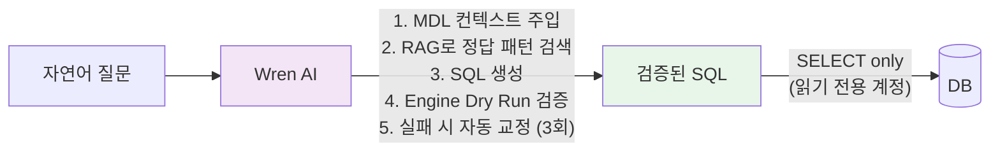

| ChatGPT 직접 사용 | Wren AI 경유 |
|-------------------|--------------|
| 환각된 컬럼명 | MDL에 정의된 컬럼만 사용 |
| 매번 다른 SQL | SQL Pairs Few-shot으로 일관성 |
| 민감 테이블 노출 | 모델 등록된 테이블만 접근 |
| DML 실행 위험 | SQL RULES가 SELECT only 강제 |
| 검증 없음 | Engine Dry Run 후 실행 |

### 2-3. "스마트한 SQL 생성기"

Wren AI = LLM + 모델 컨텍스트 + RAG + 검증 + 자동 보정

> 💡 **실무 팁:** "GPT가 SQL 잘 쓰는데 왜 Wren AI 쓰나"라는 질문이 나오면, 위 시나리오를 보여주면 된다. 정확도가 아니라 **재현성·안전성·운영성**이 핵심이다.

---

## 3. 아키텍처 — 5개 컴포넌트 동작 원리

### 3-1. 비유 — 각 컴포넌트는 무엇과 닮았나

| 컴포넌트 | 비유 | 핵심 역할 |
|---------|------|---------|
| **Wren UI** | "운영자 콘솔" | 모델링, 질문, SQL Pairs/Instructions 관리 |
| **Wren AI Service** | "통역사 본부" | Intent 분류 → RAG → SQL 생성 → 교정 |
| **Wren Engine** | "SQL 검수관" | MDL 기반 SQL 재작성, Dry Run 검증 |
| **Ibis Server** | "다국적 어댑터" | 12+ DB 방언으로 변환하여 실행 |
| **Qdrant** | "기억 창고" | 스키마/SQL Pairs/Instructions 임베딩 저장 |

### 3-2. 전체 구조

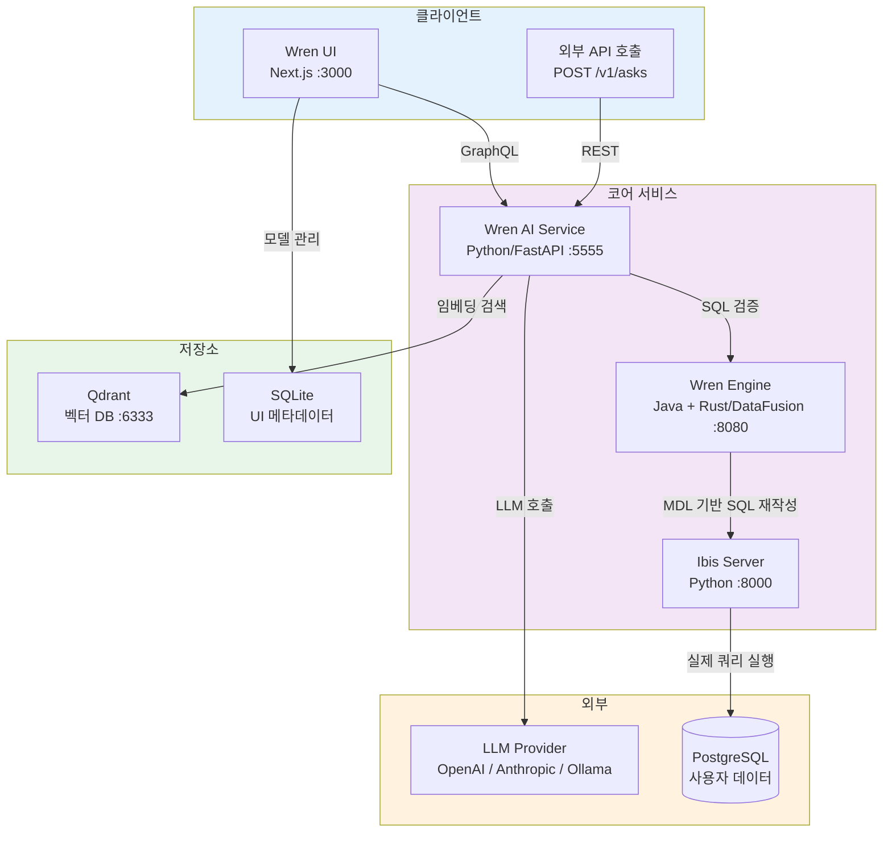

### 3-3. 각 컴포넌트 상세

| 컴포넌트 | 언어/프레임워크 | 포트 | 역할 |
|---------|--------------|------|------|
| **Wren UI** | Next.js (React), Apollo GraphQL | 3000 | 웹 인터페이스. 모델링, 질문, SQL Pairs/Instructions 관리 |
| **Wren AI Service** | Python 3.12, FastAPI, Hamilton, Haystack | 5555 | NL2SQL 핵심 엔진. 의도 분류, RAG 검색, SQL 생성, 교정 |
| **Wren Engine** | Java (Trino fork) + Rust (DataFusion) | 8080, 7432 | MDL 기반 SQL 재작성, 검증, 실행 계획 |
| **Ibis Server** | Python (Ibis) | 8000 | 12+ 데이터 소스 통합 커넥터. 실제 DB 쿼리 실행 |
| **Qdrant** | Rust | 6333, 6334 | 벡터 DB. 스키마/SQL Pairs/Instructions 임베딩 저장 및 유사도 검색 |
| **Bootstrap** | Shell script | - | 초기화 전용 init container. config.properties 생성 후 종료 |

### 3-4. 데이터 흐름 — 한 질문이 처리되는 동안

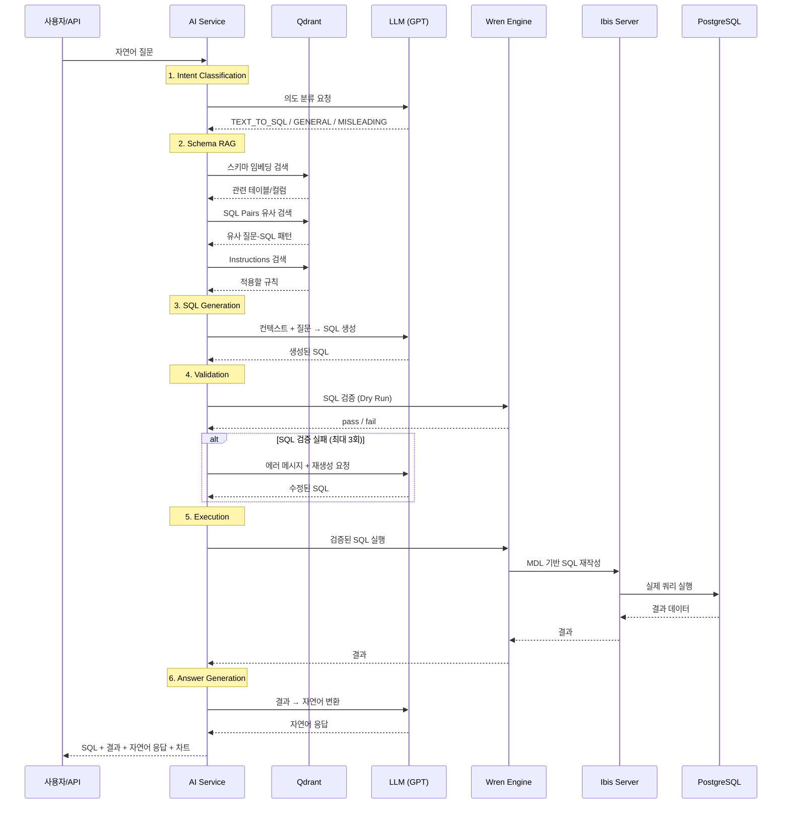

> ⚠️ **함정:** 이 흐름은 **순차적**이라 LLM이 느리면 전체가 느려진다. BIP 실측에서 GPT-4o는 80초/질문이지만 GPT-4.1-mini는 16초였다. 모델 선택이 곧 SLA다.

### 3-5. Docker Compose 구성

> 이 코드가 하는 일: 6개 컨테이너(bootstrap, engine, ibis, qdrant, ai-service, ui)를 순서대로 기동한다. bootstrap은 1회 실행 후 종료하는 init container다.

```yaml
services:
  wren-bootstrap:      # 초기화 (config.properties 생성 후 종료)
    image: ghcr.io/canner/wren-bootstrap:0.1.5

  wren-engine:         # SQL 엔진 (MDL 기반)
    image: ghcr.io/canner/wren-engine:0.22.0
    depends_on: [wren-bootstrap]

  ibis-server:         # DB 커넥터
    image: ghcr.io/canner/wren-engine-ibis:0.22.0

  qdrant:              # 벡터 DB
    image: qdrant/qdrant:v1.11.0

  wren-ai-service:     # NL2SQL 엔진
    image: ghcr.io/canner/wren-ai-service:0.29.0
    environment:
      QDRANT_HOST: wren-qdrant
      SHOULD_FORCE_DEPLOY: 1
      CONFIG_PATH: /app/config.yaml
    depends_on: [qdrant, wren-engine]

  wren-ui:             # 웹 UI
    image: ghcr.io/canner/wren-ui:0.32.2
    ports: ["3000:3000"]
    depends_on: [wren-ai-service, wren-engine]
```

---

## 4. Wren Engine — MDL(Modeling Definition Language)

### 4-1. 비유 — Cube의 cube.js와 비슷

> **MDL은 Cube.js의 `cube.js` 파일 / dbt의 `schema.yml`과 비슷한 역할을 한다.**
> 물리 테이블을 그대로 노출하지 않고, 비즈니스 의미를 입혀 추상화한 JSON 정의다. 차이는 "이 추상화를 누가 소비하느냐"인데, Cube는 BI 도구가 소비하고 Wren AI는 LLM이 소비한다.

### 4-2. Why — MDL이 왜 필요한가

raw 스키마만 LLM에 던지면 어떤 일이 벌어지는가:

```
LLM 입력: stock_price_1d (ticker, dt, op, hi, lo, cl, vol, ...)
LLM 추론: "ticker가 종목 코드일까? cl이 close일까 아니면 cluster?"
결과:    추측 SQL → 환각 → 잘못된 컬럼명 사용
```

MDL을 거치면:

```
LLM 입력: 종목 일봉 시세 (ticker: 종목코드 6자리, close: 종가(원), volume: 거래량(주))
LLM 추론: 의미 명확
결과:    정확한 SQL
```

### 4-3. What — MDL JSON 구조

> 이 코드가 하는 일: catalog/schema/dataSource를 선언하고, 모델 목록과 관계를 JSON으로 직렬화한다. metrics/macros는 옵션이다.

```json
{
  "catalog": "stockdb",
  "schema": "public",
  "dataSource": "POSTGRES",
  "models": [...],
  "relationships": [...],
  "metrics": [],
  "macros": []
}
```

물리 DB와 사용자 사이에 한 겹의 시맨틱 막을 끼우는 구조:

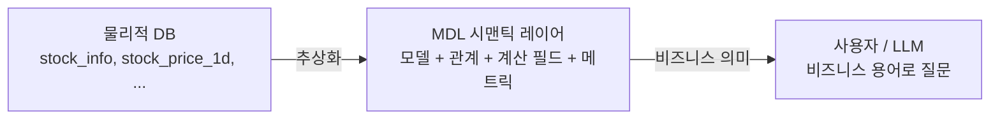

### 4-4. How — 쿼리 처리 파이프라인

> 이 다이어그램이 보여주는 것: AI Service가 만든 SQL이 Engine 내부에서 거치는 5단계.

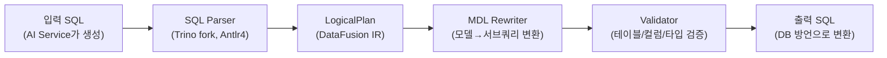

- **Antlr4 Visitor 패턴**: AST를 순회하며 모델 참조를 서브쿼리로 치환
- **Calculated Field**: expression을 인라인으로 삽입
- **Relationship**: JOIN 조건을 자동 생성
- **DataFusion IR**: Apache DataFusion의 중간 표현 사용, `UserDefinedLogicalNode`로 MDL 전용 노드 추가

### 4-5. Dry Run / Dry Plan — 실행 전 검증

Engine은 SQL을 실제 실행하지 않고 **검증만 수행**하는 기능을 제공한다:

| 모드 | 역할 |
|------|------|
| **Dry Run** | SQL이 문법적으로 유효하고, 참조된 테이블/컬럼이 MDL에 존재하는지 검증 |
| **Dry Plan** | 실행 계획을 생성하여 최적화 가능성 확인 |

AI Service는 SQL 생성 후 Dry Run으로 검증하고, 실패 시 에러 메시지를 LLM에 피드백하여 재생성한다.

> 💡 **실무 팁:** Dry Run은 LLM이 "그럴듯한" 컬럼을 만들어내도 즉시 잡아준다. 이게 ChatGPT 직접 호출 대비 가장 큰 차이점이다.

### 4-6. MCP 서버 지원

Wren Engine은 **MCP(Model Context Protocol) 서버**로 동작할 수 있어, Claude Desktop 등 MCP 클라이언트에서 직접 SQL 질문을 보낼 수 있다.

---

## 5. 모델링 (Modeling)

### 5-1. Models — "테이블의 비즈니스 캐릭터"

#### Why
물리 테이블을 그대로 등록하면 LLM이 컬럼 의미를 모른다. 모델은 테이블에 "이게 뭐 하는 데이터인지" 캐릭터를 부여한다.

#### What
물리적 DB 테이블 또는 뷰에 매핑되는 논리적 데이터 소스. NL2SQL에서 SQL 생성의 대상으로 직접 참조된다.

#### How — 모델 생성 방법

| 방법 | 절차 |
|------|------|
| **자동 생성** | PostgreSQL 연결 → 테이블 선택 → 모델 자동 생성 |
| **수동 추가** | UI 모델링 페이지에서 모델 직접 추가 |

**컬럼 관리:**
- 추가: UI에서 컬럼 추가 또는 GraphQL `updateModelMetadata`
- 수정: 컬럼명, 타입, description 변경
- 삭제: UI에서 컬럼 제거

**Primary Key & Description:**
- 모델 생성 후 UI에서 Primary Key 지정 (Relationship JOIN 기준)
- 테이블 description: 모델의 비즈니스 의미
- 컬럼 description: 의미, 단위, 계산 힌트 포함

> ⚠️ **함정 1 — updateModel API 함정:**
> `updateModel`로 컬럼을 추가하면 **기존 컬럼이 모두 교체된다**. 반드시 `updateModelMetadata`를 사용해야 기존 컬럼을 유지하면서 description만 업데이트할 수 있다.

> ⚠️ **함정 2 — 모델 삭제 시 Relationship CASCADE:**
> 모델을 삭제/재생성하면 해당 모델에 연결된 모든 Relationship이 함께 삭제된다. 모델 재생성 후 Relationship도 다시 정의해야 한다.

> 💡 **실무 팁 — 컬럼 description 누락 효과:**
> BIP 1차 테스트에서 컬럼 description이 비어 있던 boolean flag(`is_value_stock`, `is_oversold_rsi` 등)는 **0% 사용률**을 기록했다. description을 채우자 87% 사용률로 뛰었다. **컬럼 description은 NL2SQL 품질의 1번 변수다.**

### 5-2. Relationships — "JOIN 경로 미리 깔아두기"

#### Why
LLM이 JOIN을 추론하면 PK/FK를 잘못 매칭하거나 cardinality를 틀릴 수 있다. 미리 명시하면 LLM은 "어느 컬럼으로 JOIN할지"만 따르면 된다.

#### What
모델 간의 JOIN 경로를 명시적으로 정의한 메타데이터.

#### 관계 유형

| 유형 | 설명 | 예시 |
|------|------|------|
| Many-to-one | N:1 | stock_price_1d → stock_info |
| One-to-many | 1:N | stock_info → stock_price_1d |
| One-to-one | 1:1 | 드문 경우 |

#### How

> 이 코드가 하는 일: GraphQL `saveRelations` mutation으로 두 모델 사이의 JOIN 조건을 등록한다.

```graphql
mutation { saveRelations(data: [...]) }
```

UI에서는 모델링 페이지에서 두 모델 선택 후 관계 정의.

#### 제약사항

| 제약 | 내용 |
|------|------|
| 2개 모델 간만 정의 가능 | 3개 이상 spanning 단일 Relationship 불가 |
| 자기참조 불가 | 같은 모델 간의 Relationship 정의 불가 |
| 중복 관계 금지 | 같은 두 모델 + 동일 조건 중복 불가 |
| TO_MANY는 집계 필수 | PK 기준 GROUP BY 없으면 에러 |
| Cycling Relationship 불가 | CTE 순서 제약으로 순환 관계 불가 |

> ⚠️ **함정 — Grain 불일치 JOIN:**
> `analytics_stock_daily`(일별)와 `analytics_valuation`(연간)을 직접 Relationship으로 연결하면 grain 불일치로 결과가 부정확해진다. 일별 행마다 연간 데이터가 곱해져 합계가 부풀려진다. 반드시 `v_latest_valuation`(1 ticker = 1 row) 같이 grain을 맞춘 View를 중간에 두어야 안전하다.

> 💡 **실무 팁 — 수정 불가 필드:**
> Relationship 수정은 Type만 변경 가능. 조건(condition)을 바꾸려면 삭제 후 재생성해야 한다.

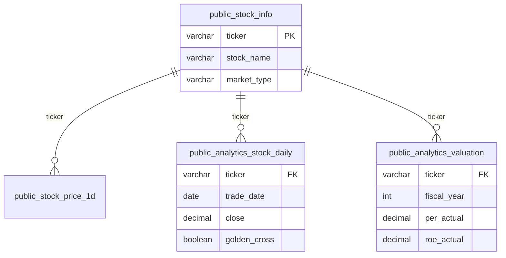

### 5-3. Calculated Fields — "런타임 파생 컬럼"

#### Why
"등락률" 같은 단순 계산을 매번 LLM이 SQL로 만들게 하는 건 낭비다. 모델 정의에 박아두면 LLM은 컬럼명만 호출하면 된다.

#### What
런타임에 계산되는 파생 필드. MDL에 `isCalculated: true`와 `expression`으로 정의된다.

#### 지원 집계 함수
`SUM`, `AVG`, `COUNT`, `MAX`, `MIN`, `ABS`

#### How

> 이 코드가 하는 일: close/open으로 등락률을 계산하는 파생 컬럼을 모델에 추가한다. LLM은 `price_change_pct`를 그냥 컬럼처럼 SELECT할 수 있다.

```json
{
  "name": "price_change_pct",
  "type": "DECIMAL",
  "isCalculated": true,
  "expression": "(close - open) / open * 100",
  "properties": {
    "description": "당일 등락률 (%)"
  }
}
```

> ⚠️ **함정 — Calculated Field의 한계:**
> 복잡한 수식(CASE WHEN, 윈도우 함수, 서브쿼리)은 지원하지 않는다. RSI, MA20, 볼린저밴드 같은 기술 지표는 **PostgreSQL Curated View에서 미리 계산**하고 컬럼으로 노출하는 것이 권장된다.

### 5-4. Metrics — "사전 정의된 KPI"

#### Why
"평균 PER", "총 거래대금" 같은 자주 쓰는 집계는 매번 같은 GROUP BY를 LLM이 만들 필요 없다. Metric으로 박아두면 정의 일관성 확보.

#### What
사전 정의된 집계 KPI. Dimension(분류 기준)과 Measure(집계 대상)를 명시적으로 분리한다.

#### 구성 요소

| 요소 | 설명 | 예시 |
|------|------|------|
| Base Object | 메트릭이 기반하는 모델 | `public_analytics_stock_daily` |
| Dimension | 분류 기준 | `market_type`, `sector` |
| Measure | 집계 대상 | `AVG(per_actual)`, `SUM(volume)` |
| Time Grain | 시간 단위 | DAY, WEEK, MONTH, YEAR |

#### How
UI 모델링 페이지에서 "Add Metric" → Base Object/Dimension/Measure 설정.

### 5-5. Views — "검증된 답변 캐시" (DB View와 다름)

#### Why
매일 같은 질문("오늘 시장 현황", "현재 VIX")이 들어오는데, 매번 LLM을 거칠 필요는 없다. 한 번 검증된 답을 캐시처럼 박아두면 즉시 응답 + 비용 0.

#### What
Wren AI의 View는 **"검증된 답변 캐시"**로, DB View와는 완전히 다른 개념이다.

#### How — "Save as View" 동작

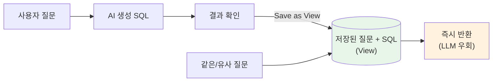

#### View vs SQL Pairs 차이

| 항목 | View | SQL Pair |
|------|------|---------|
| **역할** | "이 질문에 이 답을 **그대로 줘**" | "이런 패턴으로 SQL **만들어**" |
| **작동 방식** | 매칭되면 직접 반환 (AI 우회) | RAG 검색 후 LLM 컨텍스트에 주입하여 유사 SQL 생성 |
| **유연성** | 정확히 같은 질문만 매칭 | 유사한 질문에도 패턴 적용 |
| **LLM 호출** | 없음 (캐시 반환) | 있음 (생성 보조) |
| **비용** | 0 (캐시) | LLM 호출 비용 발생 |
| **적합 용도** | 고정 반복 질문 | 변형 가능한 패턴 |

> 💡 **실무 팁:** "오늘 시장 현황", "시가총액 상위 10종목" 같이 **변형 없이 매일 반복**되는 질문은 View로. "○○ 종목의 PER 추이" 같이 종목명만 바뀌는 패턴은 SQL Pair로.

---

## 6. NL2SQL 기능 (Ask) — 자연어를 어떻게 SQL로 만드는가

### 6-1. 7단계 파이프라인 비유

> **자연어 → SQL은 "통역사가 6단계 검수를 거치는 과정"이다.**
> 1단계: 질문 의도 파악 → 2단계: 관련 자료 찾기 → 3단계: 초안 작성 → 4단계: 문법 검사 → 5단계: 실행 → 6단계: 결과 설명.

### 6-2. 전체 파이프라인


### 6-3. Stage 1 — Intent Classification (의도 분류)

LLM이 질문 유형을 판별한다:

| 유형 | 설명 | 후속 처리 |
|------|------|---------|
| `TEXT_TO_SQL` | SQL로 변환 가능한 데이터 질문 | SQL 생성 파이프라인 진행 |
| `GENERAL` | 일반 대화/도움 요청 | 텍스트 응답 |
| `MISLEADING` | 데이터와 무관한 질문 | 거부 응답 |

> ⚠️ **함정 — Intent Classification 비결정성:**
> 같은 질문이라도 LLM이 매번 똑같이 분류하지 않는다. "실질금리 추이"가 어떤 날은 `TEXT_TO_SQL`, 어떤 날은 `GENERAL`로 가는 사례가 있다. **SQL Pair로 패턴을 박아두면 의도 분류 안정성이 크게 올라간다.**

### 6-4. Stage 2 — Context Retrieval (RAG)

Qdrant 벡터 DB에서 4종 컨텍스트를 동시 검색:

| 검색 대상 | 효과 |
|----------|------|
| Schema (테이블/컬럼 description) | top-10 테이블, top-100 컬럼 |
| SQL Pairs (유사 질문-SQL) | 유사도 0.7 이상 최대 10개 |
| Instructions (전역 규칙) | 매칭된 규칙 |
| SQL Functions (DB 내장 함수) | DB별 함수 목록 |

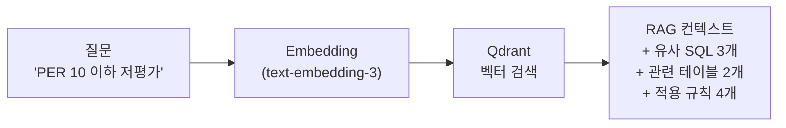

### 6-5. Stage 3 — SQL Generation (Chain-of-Thought)

#### 프롬프트 구조

> 이 박스가 보여주는 것: SQL Generation 단계에서 LLM에 전달되는 system/user 프롬프트의 구성. 각 블록은 RAG 결과로 동적으로 채워진다.

```
System Prompt
  ├─ GENERAL RULES: Instructions/SQL Samples/Reasoning Plan 참조 규칙
  ├─ SQL RULES (TEXT_TO_SQL_RULES): SELECT only, JOIN 규칙, quoting 등
  └─ FINAL ANSWER FORMAT: JSON {"sql": "..."} 형식

User Prompt
  ├─ DATABASE SCHEMA: Qdrant에서 검색된 관련 테이블 DDL
  ├─ CALCULATED FIELD / METRIC / JSON INSTRUCTIONS (조건부)
  ├─ SQL FUNCTIONS (조건부)
  ├─ SQL SAMPLES: SQL Pairs에서 유사 질문 검색 결과
  ├─ USER INSTRUCTIONS: Instructions 목록
  ├─ QUESTION: 사용자 질문
  ├─ REASONING PLAN (조건부)
  └─ "Let's think step by step."
```

#### Reasoning Plan
SQL 생성 전에 Chain-of-Thought 방식으로 추론 계획을 수립한다 (`sql_generation_reasoning` 파이프라인).

> ⚠️ **함정 — 프롬프트 커스터마이징 불가:**
> Wren AI는 system/user 프롬프트를 직접 수정할 수 없다. 도메인 규칙은 **Instructions / SQL Pairs / 컬럼 description** 세 가지 통로로만 주입할 수 있다. 그 이상의 제어가 필요하면 LangGraph로 직접 구현해야 한다.

### 6-6. Stage 4 — Validation & Correction

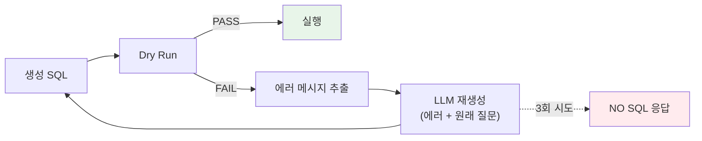

`max_sql_correction_retries: 3`이 기본값. 3회 실패 시 "NO SQL"로 응답한다.

### 6-7. Stage 5 — Execution
검증 통과한 SQL을 Engine → Ibis → DB로 실제 실행.

### 6-8. Stage 6 — Answer Generation (sql_answer)

SQL 실행 결과를 LLM이 자연어로 변환하는 단계.

> ⚠️ **함정 1 — sql_answer에 컬럼 description 미포함:**
> sql_answer 프롬프트에는 컬럼명과 결과값만 들어간다. **컬럼 description이 빠진다.** 약어/코드 컬럼값을 잘못 해석할 수 있다.

> ⚠️ **함정 2 — 환각 가능:**
> SK하이닉스 데이터가 결과에 포함되어 있는데 "데이터가 없습니다"라고 답변하는 사례가 BIP 테스트에서 발견됐다. SQL은 정확했지만 답변 LLM이 일부 행을 누락했다.

#### 해결 방법

| 방법 | 설명 |
|------|------|
| **해석 컬럼 추가** | `foreign_direction` 같은 텍스트 해석을 DB에서 미리 생성 |
| **LangGraph 분리** | 복잡한 해석은 별도 LLM 분석 단계로 분리 |

> 💡 **실무 팁 — 해석 컬럼 패턴:**
> ```sql
> CASE
>   WHEN foreign_net_volume > 0 THEN '순매수'
>   WHEN foreign_net_volume < 0 THEN '순매도'
>   ELSE '중립'
> END AS foreign_direction
> ```
> 이렇게 텍스트로 박아두면 sql_answer가 환각하지 않는다.

### 6-9. Follow-up 질문
이전 질문의 컨텍스트를 유지하여 후속 질문 처리. "그 중에서 코스피만 보여줘" 같은 질문 가능.

### 6-10. 차트 생성
SQL 결과를 기반으로 LLM이 적절한 차트 유형(바, 라인, 파이)을 자동 선택하여 생성.

---

## 7. SQL Pairs — Few-shot 학습의 힘

### 7-1. 비유 — "SQL Pair는 LLM에게 보여주는 정답지"

> **시험 보기 전에 모범 답안을 5장 보여주고 비슷한 문제를 풀게 하는 것과 같다.**
> Few-shot prompting의 본질이고, NL2SQL에서는 SQL Pair가 그 모범 답안이다.

### 7-2. Why — 왜 이렇게 효과적인가

LLM은 "패턴 매칭" 머신이다. 정답 패턴을 몇 개 보면 즉시 따라한다:

| 상황 | Instructions만 | SQL Pair 추가 |
|------|----------------|---------------|
| "실질금리 추이" 질문 | 의도 분류 실패 (도메인 용어 모름) | 즉시 SQL 생성 (정답 패턴 참조) |
| "신용스프레드 보여줘" | 컬럼 추측 환각 | 정확한 컬럼 사용 |

### 7-3. Few-shot RAG 동작 원리

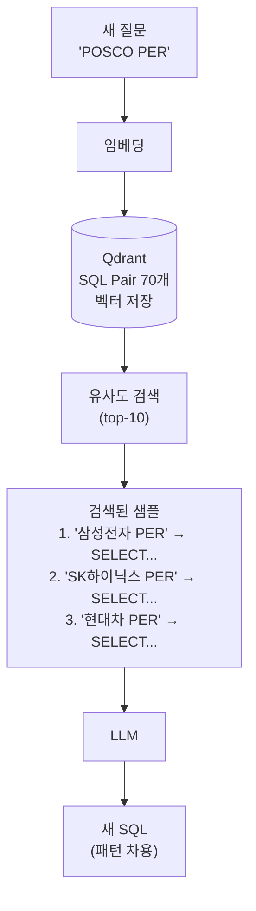

### 7-4. How — 생성 방법

**UI:**
- "Ask" 탭에서 질문 후 좋은 결과 → "Save as SQL Pair" 클릭
- "SQL Pairs" 메뉴에서 직접 question + SQL 입력

**API:**

> 이 코드가 하는 일: 질문-SQL 쌍을 GraphQL mutation으로 등록한다. Deploy 시 Qdrant에 임베딩된다.

```graphql
mutation {
  createSqlPair(data: {
    question: "PER이 10 이하인 저평가 종목",
    sql: "SELECT stock_name, per_actual FROM public_analytics_valuation WHERE per_actual <= 10 AND per_actual > 0"
  }) { id }
}
```

### 7-5. 카테고리별 추천 패턴

| 카테고리 | 수량 | 대표 패턴 |
|---------|------|---------|
| 종목 검색/주가 | 7+ | `stock_name ILIKE '%종목명%'` + `ORDER DESC LIMIT 1` |
| 기간별 조회 | 3+ | `trade_date >= CURRENT_DATE - INTERVAL '1 month'` |
| boolean flag | 5+ | `WHERE is_value_stock = true` |
| 시계열 | 3+ | `ORDER BY trade_date` + `INTERVAL` |
| 종목 비교 | 3+ | `WHERE stock_name ILIKE '%A%' OR stock_name ILIKE '%B%'` |
| 복합 조건 | 5+ | `WHERE per < 10 AND roe > 20` |
| 수급 | 2+ | `foreign_buy_volume * close AS buy_amount` |
| 매크로 | 9+ | 환율, 금리, VIX, 실질금리, 신용스프레드 |

### 7-6. BIP 실적 — "70개 등록 → 100% A등급"

```
초기:       29개 (2026-04-02)
1차 테스트: 34개 (+5, 실패 패턴 기반)
2차 테스트: 41개 (+7)
현재:       70개
A등급:      58% → 100%
```

> 💡 **실무 팁 — Few-shot의 ROI:**
> SQL Pair 1개 추가 = LLM 모델 한 단계 업그레이드 효과. 모델 비용 올리는 것보다 SQL Pair 늘리는 게 훨씬 가성비 좋다.

> ⚠️ **함정 — 너무 구체적이면 일반화 안됨:**
> "삼성전자 PER" 보다 "종목별 PER" 같은 일반화된 패턴이 좋다. 종목명을 SQL에 하드코딩하지 말고 `stock_name ILIKE '%삼성전자%'`처럼 작성해라.

---

## 8. Instructions — 도메인 규칙 주입

### 8-1. Why — Instructions가 필요한 이유

매번 같은 규칙을 SQL Pair마다 반복할 수는 없다. "응답은 한글로", "ticker 하드코딩 금지" 같은 **전역 규칙**은 Instructions로.

### 8-2. What — 동작 방식

Instructions는 모든 질문에 대해 RAG 검색되어 프롬프트에 주입되는 **전역 규칙**이다.

### 8-3. 핵심 원칙 — "3-5개로 최소 유지"

> ⚠️ **함정 — Instructions 남용:**
> Instructions가 너무 많으면 검색 노이즈가 증가하고, 관련 없는 규칙이 컨텍스트를 오염시킨다. **범용 규칙만 3-5개로 유지**하는 것이 권장된다.

### 8-4. BIP에서 등록한 4개

| # | 내용 |
|---|------|
| 1 | **계산식**: 요청한 지표가 컬럼에 없으면 계산식으로 SQL 생성 (이격도, 목표가 괴리율, 실질금리 등) |
| 2 | **종목검색**: ticker 하드코딩 금지, stock_name ILIKE 사용, 결과에 반드시 stock_name 포함 |
| 3 | **data_type**: "현재 주가" = ORDER BY trade_date DESC LIMIT 1 |
| 4 | **한글필수**: 응답은 반드시 한글로 생성 |

### 8-5. 안티패턴

| 하지 말 것 | 이유 |
|-----------|------|
| Instructions에 모든 규칙 나열 | 검색 노이즈 증가 |
| 용어집 전체를 Instructions로 변환 | 77개 용어가 매 질문마다 검색됨 |
| 모든 계산식을 Instructions에 중복 기재 | 컬럼 description에 이미 포함 |
| SQL Pairs를 너무 구체적으로 | "삼성전자 PER" 대신 "종목별 PER" 패턴으로 일반화 |

> 💡 **실무 팁 — 어디에 어떤 규칙을 둘까:**
> - 컬럼 의미/계산 힌트 → **컬럼 description**
> - 특정 질문 패턴의 정답 SQL → **SQL Pair**
> - 모든 질문에 적용되는 메타 규칙 → **Instructions**

---

## 9. LLM 설정 — LiteLLM 기반 멀티 프로바이더

### 9-1. 비유 — "LLM 어댑터 허브"

> **LiteLLM은 LLM 세계의 "환전소"다.**
> 100+ LLM 제공자(OpenAI/Anthropic/Google/Ollama 등)를 **OpenAI 호환 API 하나**로 통일해준다. 모델 갈아끼울 때 코드 수정 0.

### 9-2. 지원 모델

| 제공자 | 모델 예시 | 비고 |
|--------|---------|------|
| **OpenAI** | gpt-4o, gpt-4o-mini, gpt-4.1, gpt-4.1-mini | 기본값 |
| **Anthropic** | claude-sonnet-4-20250514, claude-haiku | API 키 필요 |
| **Google** | gemini-2.0-flash | - |
| **Ollama** | llama3.1:8b, codestral | 로컬, 무료 |
| **Azure OpenAI** | gpt-4o (Azure 배포) | 엔터프라이즈 |
| **AWS Bedrock** | Claude, Llama | - |

### 9-3. config.yaml 설정 방법

> 이 코드가 하는 일: OpenAI/Anthropic/Ollama 3가지 프로바이더 중 하나를 선택하여 default 모델로 설정한다. 둘 중 하나만 활성화하면 된다.

```yaml
# OpenAI (기본)
type: llm
provider: litellm_llm
models:
  - alias: default
    model: gpt-4.1-mini
    context_window_size: 128000
    kwargs:
      max_tokens: 4096
      temperature: 0

# Anthropic Claude
type: llm
provider: litellm_llm
models:
  - alias: default
    model: anthropic/claude-sonnet-4-20250514
    context_window_size: 200000
    kwargs:
      max_tokens: 4096
      temperature: 0

# Ollama 로컬 모델
type: llm
provider: litellm_llm
models:
  - alias: default
    model: ollama_chat/llama3.1:70b
    api_base: http://host.docker.internal:11434
    context_window_size: 128000
```

### 9-4. GPT-5 시리즈 주의사항

GPT-5.x는 reasoning 모델이라 파라미터 구조가 다르다:

> 이 코드가 하는 일: GPT-5.x용 파라미터로 변환. `max_tokens` → `max_completion_tokens`, `temperature` 사용 불가, `reasoning_effort` 명시 필수.

```yaml
# GPT-4.x (기존)
kwargs:
  max_tokens: 4096
  temperature: 0

# GPT-5.x (reasoning 모델)
kwargs:
  max_completion_tokens: 4096
  reasoning_effort: low  # none/low/medium/high/xhigh
  # temperature 설정 불가 (1 고정)
  # max_tokens → max_completion_tokens로 변경
```

> ⚠️ **함정 — GPT-5.4-mini 기본 reasoning_effort:**
> `reasoning_effort` 미설정 시 과도한 추론으로 응답이 매우 느려지고, "NO SQL" 비율이 높아진다. 반드시 명시할 것.

### 9-5. BIP 모델 비교 결과 — "GPT-4.1-mini가 최적"

7개 모델 실측 결과:

| 모델 | 순차 속도 | 동시성 | SQL 품질 | 비고 |
|------|:-:|:-:|:-:|------|
| gpt-4o-mini | 11s | 1/3 | 중 | 구형, 동시성 약함 |
| gpt-4o | 80s | 3/3 | 중상 | Tier-2에서도 느림 |
| gpt-4.1 | 75s | 1/3 | 중 | TPM 한도 |
| **gpt-4.1-mini** | **16s** | **3/3** | **상** | **선정: 속도+품질 최적** |
| gpt-5.4-mini | 39s | 3/3 | 상 | reasoning_effort 필수 |
| claude-haiku-4-5 | 11s | 3/3 | 중 | 빠르지만 Instructions 미준수 |
| claude-sonnet-4-5 | 30s | 3/3 | 상 | SQL 품질 최고, 속도 열위 |

> 💡 **실무 팁:** 속도와 품질이 둘 다 중요하면 **GPT-4.1-mini**, 품질만 중요하면 **Claude Sonnet**, 비용 0이 중요하면 **Ollama Llama3.1**.

### 9-6. OpenAI 편향 — Claude/Ollama가 약해지는 이유

> ⚠️ **함정 — response_format json_schema는 OpenAI 전용:**
> Wren AI는 `response_format: json_schema`를 사용하는데, 이는 **OpenAI Structured Outputs** 전용 기능이다.
> - GPT 모델: 스키마에 100% 보장된 JSON 출력
> - Claude 모델: LiteLLM이 json_schema를 텍스트 프롬프트로 변환하여 전달 → Instructions 준수율 저하
> - Ollama 모델: 동일한 문제로 약해짐

이 때문에 BIP 테스트에서도 Claude Haiku가 속도는 빨랐지만 Instructions를 잘 안 따랐다.

---

## 10. 지원 데이터 소스

### 10-1. 11개 데이터 소스

| 데이터 소스 | 비고 |
|-----------|------|
| PostgreSQL | BIP-Pipeline 사용 중 |
| MySQL | - |
| BigQuery | GCP |
| Snowflake | - |
| DuckDB | 로컬 분석 |
| ClickHouse | OLAP |
| Trino | 연합 쿼리 |
| MSSQL | - |
| Oracle | **23ai만 지원** ⚠️ |
| Athena | AWS |
| Redshift | AWS |

### 10-2. ⚠️ Oracle 19c 미지원 — BIP 사내 적용 불가 사례

> ⚠️ **함정 — Oracle 19c는 ibis-server에서 지원하지 않는다:**
> Wren AI의 ibis-server는 Oracle은 **23ai만** 지원한다. 사내 표준이 19c인 경우 Wren AI 직접 적용이 불가능하다.
>
> **BIP 경험:** 사내 시스템이 Oracle 19c라 Wren AI 도입을 검토했으나 적용 불가. 결국 **LangGraph + LiteLLM으로 NL2SQL을 직접 구현**하기로 전환했다. Wren AI는 BIP-Pipeline(PostgreSQL) 환경에서만 사용한다.

### 10-3. 연결 설정 방법

1. UI에서 "Connect Data Source" 클릭
2. 데이터 소스 유형 선택
3. 연결 정보 입력 (Host, Port, Database, User, Password)
4. 테이블 선택
5. 모델 자동 생성

> 💡 **실무 팁 — Docker 호스트명:**
> Docker 내부에서 연결 시 호스트명은 컨테이너명을 사용한다 (예: `bip-postgres`). `localhost`는 컨테이너 자기 자신을 가리키므로 실패한다.

---

## 11. Deploy — Qdrant 재인덱싱

### 11-1. Why — 왜 Deploy가 필요한가

모델/SQL Pair/Instructions를 추가해도 **Qdrant에 임베딩되기 전까지는 NL2SQL에 반영되지 않는다.** Deploy 버튼이 그 임베딩 트리거다.

### 11-2. What — Deploy가 하는 일

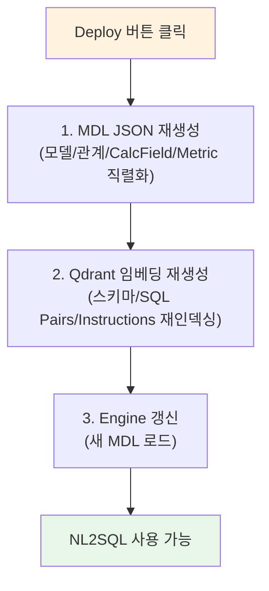

### 11-3. 모든 변경 후 Deploy 필수

다음 변경 후에는 반드시 Deploy:

- 모델 추가/삭제
- 컬럼 추가/삭제/description 변경
- Relationship 추가/삭제
- SQL Pairs 추가/삭제
- Instructions 추가/삭제
- Calculated Fields 추가/삭제

> ⚠️ **함정 — Undeployed Changes 무시:**
> UI 상단에 "Undeployed changes" 경고가 표시되는데, 이걸 무시하고 질문하면 **변경 전 상태로 응답**한다. 변경 후엔 반드시 Deploy.

> 💡 **실무 팁 — 자동화:**
> Airflow `10_sync_metadata_daily` DAG는 OM 동기화 후 GraphQL `deploy` mutation을 자동 호출한다. 운영자가 잊어버려도 매일 09:00 KST에 강제 동기화된다.

---

## 12. API

### 12-1. REST API (AI Service: port 5555)

#### 질문 제출 → polling

> 이 코드가 하는 일: (1) 자연어 질문을 POST하여 query_id를 받고, (2) 그 ID로 결과를 polling한다. SQL 생성은 비동기이므로 polling 패턴이 필수.

```bash
# 1) 질문 제출
POST http://localhost:5555/v1/asks
Content-Type: application/json

{"query": "삼성전자 현재 주가", "mdl_hash": ""}

# 응답: {"query_id": "abc123"}
```

```bash
# 2) 결과 polling (3초 간격, 최대 90초)
GET http://localhost:5555/v1/asks/abc123/result

# 응답:
{
  "status": "finished",
  "rephrased_question": "...",
  "intent_reasoning": "...",
  "sql_generation_reasoning": "Step 1: ...\nStep 2: ...",
  "type": "TEXT_TO_SQL",
  "retrieved_tables": ["public_analytics_stock_daily"],
  "response": [{"sql": "SELECT ...", "type": "llm"}],
  "error": null
}
```

#### 기타 엔드포인트

| 엔드포인트 | 메서드 | 용도 |
|-----------|--------|------|
| `/v1/semantics-descriptions` | POST | 테이블/컬럼 설명 자동 생성 |
| `/v1/question-recommendations/{id}` | GET | 추천 질문 조회 |

### 12-2. GraphQL API (UI: port 3000)

> 이 코드가 하는 일: UI 백엔드의 GraphQL 엔드포인트로 모델/SQL Pair/Instructions/Relationship/Deploy를 모두 관리한다. Airflow DAG에서 자동 동기화에 활용.

```graphql
# 모델 조회
{ listModels { id displayName description } }
{ model(where: {id: 1}) { fields { displayName type properties } } }

# 모델 메타데이터 업데이트
mutation {
  updateModelMetadata(
    where: {id: 1},
    data: {description: "...", columns: [...]}
  )
}

# SQL Pairs 생성/조회
mutation { createSqlPair(data: {question: "...", sql: "..."}) { id } }
{ sqlPairs { id question sql } }

# Instructions 생성
mutation {
  createInstruction(data: {
    instruction: "...",
    isDefault: false,
    questions: []
  }) { id }
}

# 모델 삭제
mutation { deleteModel(where: {id: 1}) }

# Relationship 저장
mutation { saveRelations(data: [...]) }

# Deploy (MDL 재생성 + Qdrant 재인덱싱)
mutation { deploy { status } }
```

---

## 13. Best Practices — BIP 4차 검증 결과 100% 달성한 방법

### 13-1. 결과 요약

| 단계 | A등급 비율 | 핵심 변화 |
|------|-----------|---------|
| 초기 (29 SQL Pairs) | 58% | 컬럼 description 미흡 |
| 1차 테스트 (34) | 75% | 실패 패턴 기반 SQL Pair 추가 |
| 2차 테스트 (41) | 88% | 매크로/수급 SQL Pair 보강 |
| 4차 검증 (70) | **100%** | Curated View + 해석 컬럼 + boolean flag |

### 13-2. Step 0 — 데이터 전처리가 가장 중요

> 공식 문서 인용: *"Build reporting-ready tables with pre-joined dimensions and boolean flags. LLMs are much more reliable with explicit columns than with string parsing and ad-hoc logic."*

Wren AI에 모델을 등록하기 **전에** 데이터를 먼저 가공해야 한다:

| 항목 | 설명 |
|------|------|
| **Denormalized reporting tables** | 자주 쓰는 JOIN을 미리 처리한 와이드 테이블 (Gold Table) |
| **Pre-computed boolean flags** | `is_value_stock`, `is_oversold_rsi`, `is_golden_cross` 같은 명시적 분류 |
| **Pre-computed metrics** | PER/PBR/ROE를 LLM 추론에 맡기지 말고 컬럼으로 고정 |
| **Meaningful naming** | 컬럼명이 비즈니스 의미를 담아야 LLM intent mapping 정확 |

BIP 적용: Gold 테이블(`analytics_*`)이 이미 reporting-ready. Curated View로 boolean flags 추가.

### 13-3. Step 1 — 시맨틱 레이어 (Description, Relationship)

| 항목 | 설명 |
|------|------|
| Business-first descriptions | 기술 용어가 아닌 비즈니스 관점 |
| 컬럼 description에 계산 힌트 | `"이격도: (close - ma20) / ma20 * 100"` |
| Relationship 명시 | LLM이 JOIN을 정확하게 생성하도록 유도 |
| 컬럼 설명 커버리지 100% | 가장 효과적 |

### 13-4. Step 2 — SQL Pairs > Instructions

| 방법 | 효과 | 근거 |
|------|------|------|
| **SQL Pairs** | 매우 높음 | 전문 용어 실패 → 즉시 해결. 구체적이고 직접적 |
| **Instructions** | 중간 | 범용 규칙만 효과적. 너무 많으면 노이즈 |
| **Calculated Fields** | 제한적 | 집계만 가능, 복잡 수식 불가 |

### 13-5. Boolean Flag 패턴 — Curated View의 핵심

> 이 코드가 하는 일: 같은 의도("저평가 종목 찾기")를 두 가지 방식으로 표현. 두 번째는 Curated View가 미리 계산한 boolean flag를 사용 → 정확도 ↑.

```sql
-- 나쁜 예: LLM이 조건을 추론
WHERE per < 10 AND roe > 15 AND per > 0

-- 좋은 예: boolean flag를 Curated View에서 미리 계산
WHERE is_value_stock = true
```

> 💡 **실무 팁:** boolean flag 컬럼이 NL2SQL 품질을 결정한다. BIP에서는 boolean flag 사용률이 0% → 87%로 증가하면서 A등급이 58% → 100%로 뛰었다.

### 13-6. 해석 컬럼 패턴

> 이 코드가 하는 일: 숫자 컬럼(`foreign_net_volume`)을 LLM이 해석하지 못하므로, DB에서 미리 한글 텍스트로 변환한 컬럼을 추가한다.

```sql
-- Curated View에서
CASE
  WHEN foreign_net_volume > 0 THEN '순매수'
  WHEN foreign_net_volume < 0 THEN '순매도'
  ELSE '중립'
END AS foreign_direction
```

### 13-7. 컬럼 수 검증 필수

모델 등록/업데이트 후 반드시 DB의 실제 컬럼 수와 Wren AI에 등록된 컬럼 수를 비교한다. `updateModel` API 사용 시 기존 컬럼이 교체되는 문제가 있으므로 주의.

### 13-8. Deploy 후 테스트

모든 변경 후 Deploy를 수행하고, 대표 질문 5-10개로 smoke test 실행.

---

## 14. 알려진 한계

| # | 한계 | 설명 | 대안 |
|---|------|------|------|
| 1 | **Oracle 19c 미지원** | ibis-server가 Oracle 23ai만 지원 | LangGraph 직접 구현 (BIP 사내 사례) |
| 2 | **1질문 = 1SQL** | 복합 질문(여러 쿼리 결과 종합) 불가 | LangGraph 멀티스텝 |
| 3 | **비정형 데이터 불가** | 뉴스, PDF, API 데이터 처리 불가 | LangGraph Tool |
| 4 | **sql_answer에 description 미포함** | 결과 해석 시 컬럼 의미를 모름 | 해석 컬럼 추가 |
| 5 | **프롬프트 커스터마이징 불가** | system/user prompt 직접 수정 불가 | LangGraph 직접 프롬프트 |
| 6 | **OpenAI json_schema 편향** | Structured Outputs가 OpenAI 전용 | LangGraph에서 Claude 직접 사용 |
| 7 | **Intent Classification 비결정적** | 같은 질문도 때로 다른 의도로 분류 | SQL Pair로 패턴 고정 |
| 8 | **Calculated Fields 제약** | 복잡 수식(CASE, 윈도우 함수) 불가 | Curated View로 해결 |
| 9 | **sql_answer 환각** | 데이터가 있는데 "없다"고 답변 | 해석 컬럼 + 검증 |

### 14-1. ⚠️ Oracle 19c 미지원 — BIP 의사결정

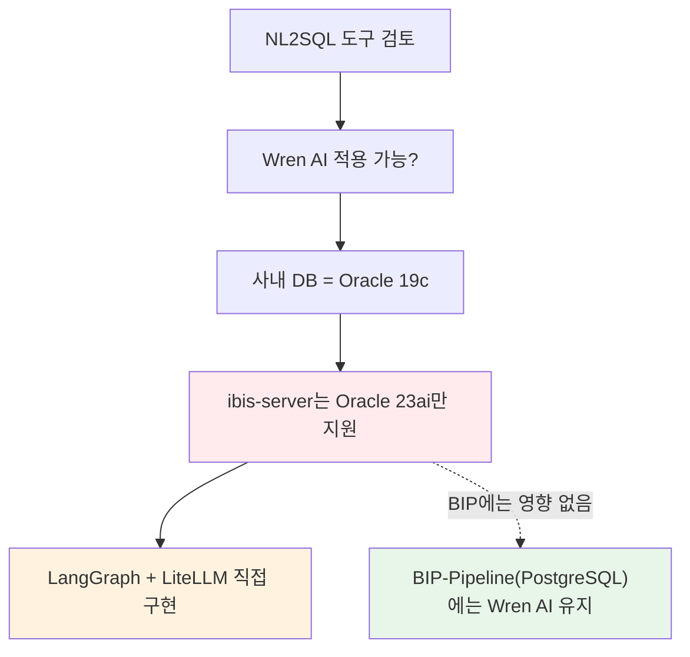

### 14-2. 1질문 = 1SQL 제약

> ⚠️ **함정 — 멀티스텝 분석 불가:**
> "최근 1주일 외국인 순매수 상위 10종목의 PER을 같은 업종 평균과 비교" 같은 질문은 SQL 한 방으로 풀 수 없다. Wren AI는 1질문에 1SQL만 생성한다.
> 이런 질문은 **LangGraph 멀티스텝**으로 처리해야 한다.

---

## 15. BIP-Pipeline 현재 설정

### 15-1. 모델 구성

| 모델 (reference name) | 소스 테이블 | 컬럼 수 | 용도 |
|-----------------------|-----------|---------|------|
| `public_stock_info` | stock_info | 23 | 종목 마스터 |
| `public_stock_price_1d` | stock_price_1d | 19 | 일봉 시세 |
| `public_analytics_stock_daily` | analytics_stock_daily | 46 | Gold: 시세+지표+컨센서스 |
| `public_analytics_macro_daily` | analytics_macro_daily | 49 | Gold: 매크로 피벗 |
| `public_analytics_valuation` | analytics_valuation | 32 | Gold: 밸류에이션 |
| + Curated View 모델 4개 | v_latest_*, v_screening_* | 143 | boolean flags + 해석 컬럼 |
| **합계** | **9개 모델** | **312개 컬럼** | |

### 15-2. Relationship

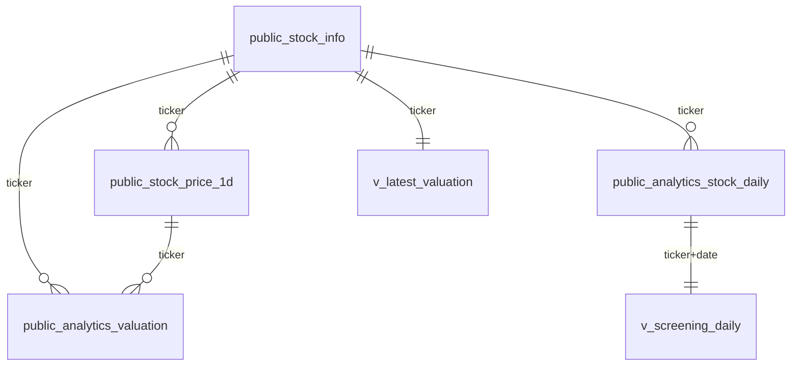

6개 Relationship 정의.

### 15-3. SQL Pairs (70개 / 9개 카테고리)

| 카테고리 | 수량 | 대표 패턴 |
|---------|------|---------|
| 종목 검색/주가 | 7 | `ILIKE + ORDER DESC LIMIT 1` |
| 기간별 조회 | 3 | `INTERVAL + ORDER BY` |
| 기술지표 | 3 | RSI/골든크로스/볼린저밴드 |
| 밸류에이션 | 5 | PER/ROE/부채비율/매출성장 |
| 매크로 | 9 | 환율/금리/VIX/실질금리/스프레드 |
| 수급 | 2 | 외국인/기관 순매수 |
| 복합/비교 | 7 | 저PER고ROE/거래대금/52주신저가 |
| 시장 요약 | 3 | 시장현황/시총상위/업종별PER |
| 기간 비교 | 2 | 전월대비/전분기 |

### 15-4. Instructions
4개 (계산식, 종목검색, data_type, 한글필수)

### 15-5. LLM
GPT-4.1-mini (LiteLLM 경유)

### 15-6. 성과 지표

| 지표 | 값 |
|------|------|
| SQL 생성률 | 100% |
| A등급 비율 | 100% (테스트 대상 질문) |
| boolean flag 사용률 | 87% |
| 평균 응답 시간 | 16초 (순차) |

### 15-7. 리소스 사용량

| 서비스 | CPU | Memory |
|--------|-----|--------|
| wren-engine | 1 core | ~4GB |
| wren-ai-service | 1 core | ~2GB |
| qdrant | 0.5 core | ~512MB |
| wren-ui | 0.5 core | ~512MB |
| ibis-server | 0.5 core | ~512MB |
| **합계** | **3.5 CPU** | **~8GB** |

### 15-8. 메타데이터 동기화 (OM → Wren AI)

> 이 다이어그램이 보여주는 것: OpenMetadata가 메타데이터의 SSOT이고, Airflow DAG가 매일 09:00에 OM → DB COMMENT, OM → Wren AI 두 방향으로 일방향 동기화한다. Wren AI 자체는 메타데이터 편집 대상이 아니다.

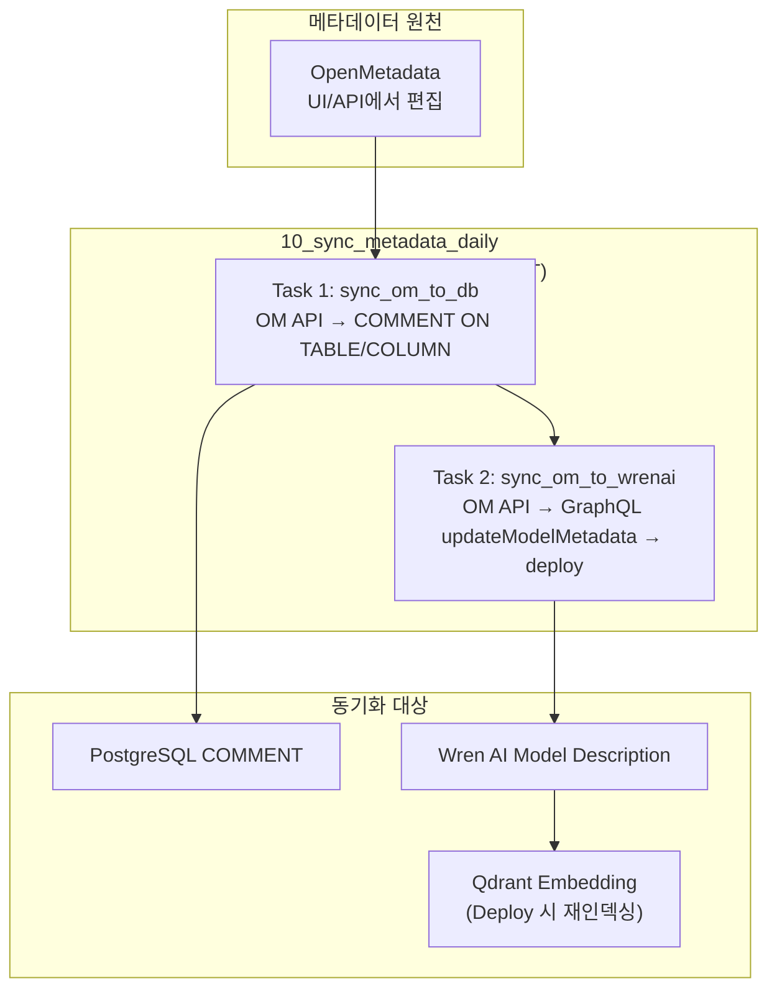

> 💡 **실무 팁 — 일방향 흐름:**
> Wren AI에서 description을 직접 수정하면 다음 날 OM 동기화에 덮어쓰여 사라진다. **반드시 OM에서 수정**하고 동기화를 기다리거나 수동 트리거해라.

---

## 16. dbt/Cube와의 관계

| 도구 | 역할 | Wren AI와의 관계 |
|------|------|----------------|
| **dbt Core** | SQL 변환 파이프라인 | 직교적. dbt가 만든 Gold 테이블을 Wren AI가 모델링 |
| **dbt Semantic Layer** | 메트릭 SSOT | 보완적. Semantic Layer 메트릭을 Wren AI가 SQL로 호출 가능 |
| **Cube.js** | 시맨틱 레이어 + REST API | 경쟁적. 둘 다 모델 정의를 갖지만 Cube는 BI 소비, Wren은 LLM 소비 |
| **MetricFlow** | dbt의 메트릭 엔진 | 보완적. Wren AI MDL은 lightweight, MetricFlow는 heavyweight |

> 💡 **실무 팁 — 결합 사용:**
> dbt(데이터 변환) → Gold/Curated View(SSOT) → Wren AI(NL2SQL UI) 조합이 가장 안정적이다. Cube와 Wren AI를 동시 도입할 필요는 없다 (역할 중복).

---

## 17. 참고

### 17-1. 공식 문서

- **메인 문서**: https://docs.getwren.ai
- **모델링 가이드**: https://docs.getwren.ai/oss/guide/modeling/models
- **Best Practices**: https://docs.getwren.ai/cp/getting_started/best_practice
- **Views**: https://docs.getwren.ai/oss/guide/modeling/views
- **Knowledge (SQL Pairs + Instructions)**: https://docs.getwren.ai/oss/guide/knowledge/overview
- **Engine Modeling**: https://docs.getwren.ai/oss/engine/guide/modeling/relation

### 17-2. GitHub

- **Wren AI**: https://github.com/Canner/WrenAI

### 17-3. BIP-Pipeline 관련 문서

- `docs/wrenai_technical_guide.md` — 기술 상세 (아키텍처, 소스 분석, 대안 비교)
- `docs/wrenai_test_report.md` — NL2SQL 품질 테스트 리포트 (평가 프레임워크 포함)
- `docs/nl2sql_project_plan.md` — NL2SQL 설계 계획 (보안 원칙 포함)
- `docs/data_architecture_review.md` — 전체 아키텍처 리뷰

---

## 변경 이력

| 날짜 | 내용 |
|------|------|
| 2026-04-13 | 초안 작성 |
| 2026-04-22 | 문서 헤더 정리 |
| 2026-04-29 | 설명 위주로 전면 재작성 — 비유/Why-What-How 구조/함정·팁 박스/Mermaid 다이어그램 보강. Oracle 19c 미지원 사례, sql_answer 환각, OpenAI 편향, Few-shot RAG 동작 원리 등 BIP 실전 경험 흡수 |
