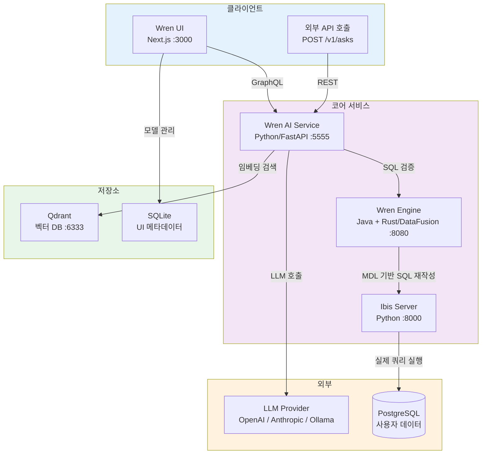
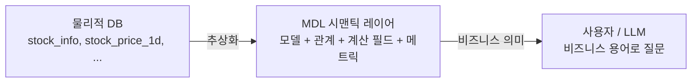
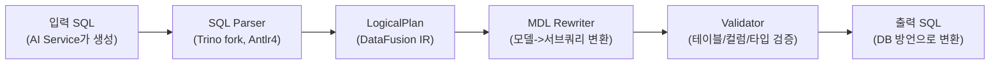
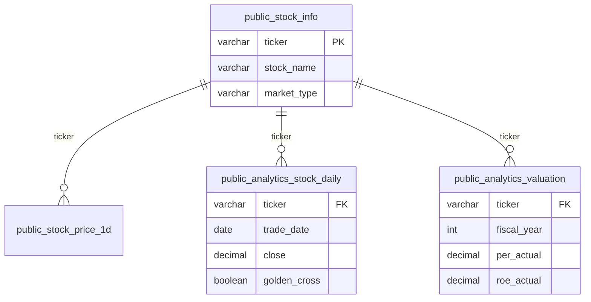
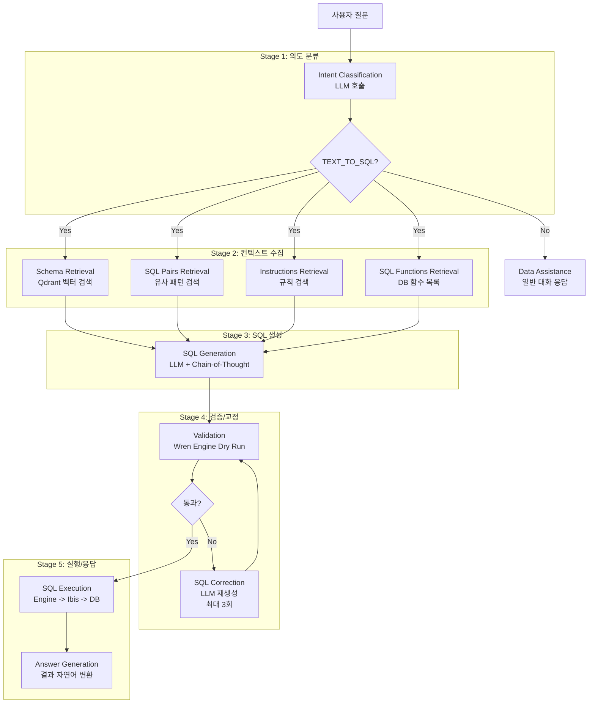
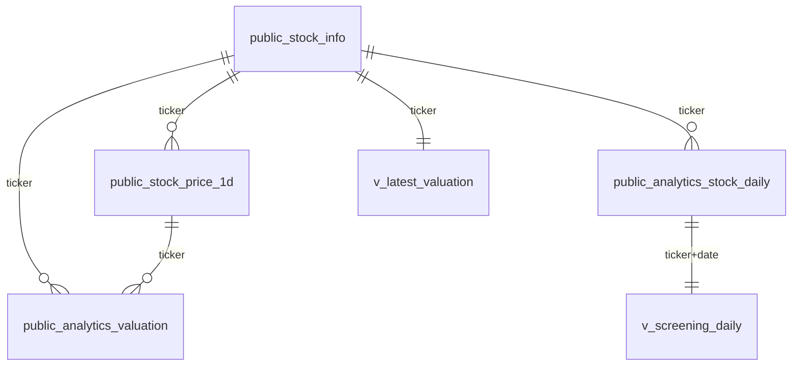
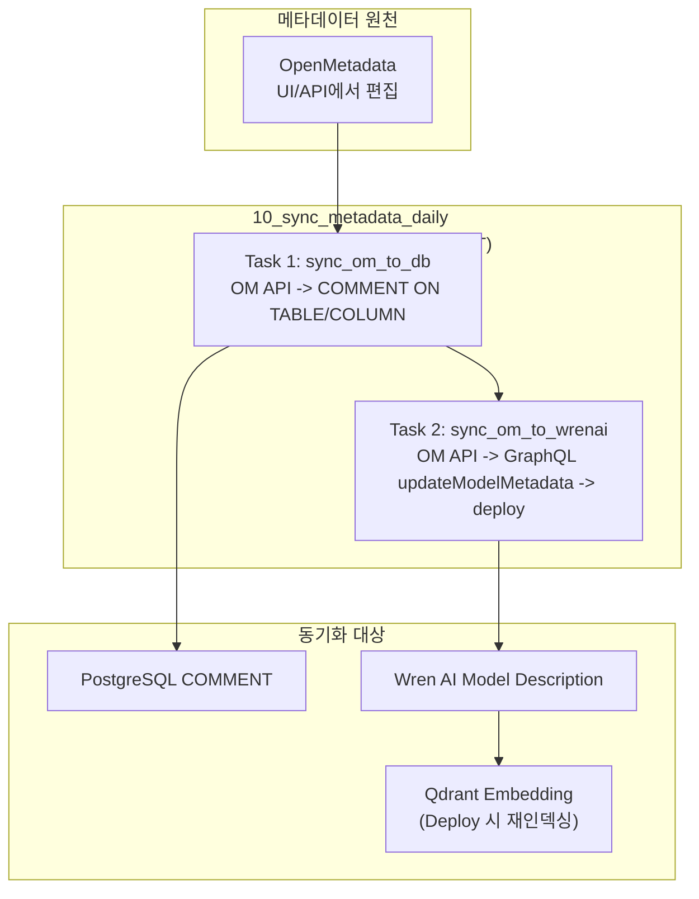

# Wren AI 기능 및 사용 가이드

> **공식 문서 기반:** https://docs.getwren.ai
> **BIP-Pipeline 실전 경험 포함**
> **최종 갱신:** 2026-04-13
> **Wren AI 버전:** Engine 0.22.0 / AI Service 0.29.0 / UI 0.32.2

---

## 1. 개요

### 1-1. Wren AI란?

Wren AI는 오픈소스 **GenBI(Generative Business Intelligence) Agent**이자 **Text-to-SQL 엔진**이다.
자연어 질문을 SQL 쿼리로 변환하고, 결과를 실행하여 자연어 응답과 차트로 반환한다.

```
사용자: "PER이 10 이하인 저평가 종목 보여줘"
         |
Wren AI: MDL에서 PER 정의 확인 -> 관련 테이블/컬럼 선택 -> SQL 생성 -> 실행
         |
결과:    종목명, PER, ROE 등 테이블 + 자연어 요약 반환
```

### 1-2. 5대 설계 철학

| # | 원칙 | 설명 |
|---|------|------|
| 1 | **다국어 지원** | 한국어, 영어, 일본어 등 자연어 질문을 LLM이 처리. 한국어 종목명 ILIKE 검색 지원 |
| 2 | **시맨틱 인덱싱** | MDL에 정의된 테이블/컬럼 설명을 Qdrant 벡터 DB에 임베딩. 질문과 유사한 스키마를 RAG로 검색 |
| 3 | **컨텍스트 인식 SQL** | raw 스키마가 아닌 비즈니스 의미가 부여된 MDL을 LLM에 제공하여 정확도 향상 |
| 4 | **코드 프리** | 웹 UI에서 모델링, SQL Pairs 등록, Instructions 설정, 질문까지 코드 없이 가능 |
| 5 | **생성형 리포트** | SQL 결과를 LLM이 자연어로 요약하고 차트를 자동 생성 |

### 1-3. Wren AI의 정확한 포지셔닝

Wren AI는 **"semantic-aware Text-to-SQL engine"**이다. 시맨틱 레이어(dbt Semantic Layer, Cube.js)와는 다르다.

| | 진짜 시맨틱 레이어 (dbt/Cube) | Wren AI MDL |
|--|--|--|
| **메트릭 정의** | 한 번 정의하면 모든 도구에서 재사용 | Calculated Field 집계만, 복잡 수식 불가 |
| **Dimension/Measure 분리** | 명시적 구분, 자동 GROUP BY | 구분 없음 |
| **소비자** | BI 도구, API, 노트북 등 다양 | Wren AI 자체만 소비 |
| **거버넌스** | 메트릭 버전 관리, 접근 제어 | 없음 |
| **역할** | 비즈니스 로직의 SSOT | LLM이 스키마를 이해하게 돕는 주석 |

BIP-Pipeline에서의 위치:

| 컴포넌트 | 역할 |
|---------|------|
| **Gold Tables + Curated Views** | canonical semantic layer (계산 SSOT, 비즈니스 로직 고정) |
| **Wren AI MDL** | NL2SQL-oriented semantic shell (lightweight 주석) |
| **Wren AI** | semantic-aware Text-to-SQL engine (스키마 RAG + LLM + SQL 검증) |
| **LangGraph** | orchestration layer (멀티스텝, 비정형 데이터 통합) |

---

## 2. 아키텍처

### 2-1. 전체 구조



### 2-2. 각 컴포넌트 역할

| 컴포넌트 | 언어/프레임워크 | 포트 | 역할 |
|---------|--------------|------|------|
| **Wren UI** | Next.js (React), Apollo GraphQL | 3000 | 웹 인터페이스. 모델링, 질문, SQL Pairs/Instructions 관리 |
| **Wren AI Service** | Python 3.12, FastAPI, Hamilton, Haystack | 5555 | NL2SQL 핵심 엔진. 의도 분류, RAG 검색, SQL 생성, 교정 |
| **Wren Engine** | Java (Trino fork) + Rust (DataFusion) | 8080, 7432 | MDL 기반 SQL 재작성, 검증, 실행 계획 |
| **Ibis Server** | Python (Ibis) | 8000 | 12+ 데이터 소스 통합 커넥터. 실제 DB 쿼리 실행 |
| **Qdrant** | Rust | 6333, 6334 | 벡터 DB. 스키마/SQL Pairs/Instructions 임베딩 저장 및 유사도 검색 |
| **Bootstrap** | Shell script | - | 초기화 전용 init container. config.properties 생성 후 종료 |

### 2-3. 데이터 흐름


### 2-4. Docker Compose 구성

```yaml
services:
  wren-bootstrap:      # 초기화 (config.properties 생성 후 종료)
    image: ghcr.io/canner/wren-bootstrap:0.1.5

  wren-engine:         # SQL 엔진 (MDL 기반)
    image: ghcr.io/canner/wren-engine:0.22.0
    depends_on: [wren-bootstrap]

  ibis-server:         # DB 커넥터
    image: ghcr.io/canner/wren-engine-ibis:0.22.0

  qdrant:              # 벡터 DB
    image: qdrant/qdrant:v1.11.0

  wren-ai-service:     # NL2SQL 엔진
    image: ghcr.io/canner/wren-ai-service:0.29.0
    environment:
      QDRANT_HOST: wren-qdrant
      SHOULD_FORCE_DEPLOY: 1
      CONFIG_PATH: /app/config.yaml
    depends_on: [qdrant, wren-engine]

  wren-ui:             # 웹 UI
    image: ghcr.io/canner/wren-ui:0.32.2
    ports: ["3000:3000"]
    depends_on: [wren-ai-service, wren-engine]
```

---

## 3. Wren Engine

### 3-1. MDL (Modeling Definition Language)

MDL은 Wren AI의 **시맨틱 레이어 정의 언어**로, 물리적 DB 스키마와 사용자 사이에 비즈니스 의미를 부여하는 추상화 계층이다.



MDL JSON 구조:

```json
{
  "catalog": "stockdb",
  "schema": "public",
  "dataSource": "POSTGRES",
  "models": [...],
  "relationships": [...],
  "metrics": [],
  "macros": []
}
```

### 3-2. 쿼리 처리 파이프라인



- **Antlr4 Visitor 패턴**: AST를 순회하며 모델 참조를 서브쿼리로 치환
- **Calculated Field**: expression을 인라인으로 삽입
- **Relationship**: JOIN 조건을 자동 생성
- **DataFusion IR**: Apache DataFusion의 중간 표현 사용, `UserDefinedLogicalNode`로 MDL 전용 노드 추가

### 3-3. Dry Run / Dry Plan

Engine은 SQL을 실제 실행하지 않고 **검증만 수행**하는 기능을 제공한다:

- **Dry Run**: SQL이 문법적으로 유효하고, 참조된 테이블/컬럼이 MDL에 존재하는지 검증
- **Dry Plan**: 실행 계획을 생성하여 최적화 가능성 확인

AI Service는 SQL 생성 후 Dry Run으로 검증하고, 실패 시 에러 메시지를 LLM에 피드백하여 재생성한다.

### 3-4. MCP 서버 지원

Wren Engine은 **MCP(Model Context Protocol) 서버**로 동작할 수 있어, Claude Desktop 등 MCP 클라이언트에서 직접 SQL 질문을 보낼 수 있다.

---

## 4. 모델링 (Modeling)

### 4-1. Models

**무엇:** 물리적 DB 테이블 또는 뷰에 매핑되는 논리적 데이터 소스. NL2SQL에서 SQL 생성의 대상으로 직접 참조된다.

**모델 생성 방법:**

1. **데이터 소스 연결 시**: PostgreSQL 연결 후 테이블 선택하면 자동으로 모델 생성
2. **모델링 페이지**: UI에서 수동으로 모델 추가

**컬럼 관리:**

- 추가: UI에서 컬럼 추가 또는 GraphQL `updateModelMetadata`
- 수정: 컬럼명, 타입, description 변경
- 삭제: UI에서 컬럼 제거

**Primary Key 설정:**

- 모델 생성 후 UI에서 Primary Key 지정
- Relationship 정의 시 JOIN 조건의 기준

**Description 설정:**

- 테이블 description: 모델의 비즈니스 의미 설명
- 컬럼 description: 각 컬럼의 의미, 단위, 계산 힌트 포함 가능

**주의사항 (BIP 경험):**

> **updateModel API로 컬럼 추가 시 기존 컬럼이 교체된다.** `updateModelMetadata`를 사용해야 기존 컬럼을 유지하면서 description만 업데이트할 수 있다.

> **모델 삭제/재생성 시 해당 모델에 연결된 Relationship이 CASCADE 삭제된다.** 모델을 재생성한 후 Relationship도 다시 정의해야 한다.

### 4-2. Relationships

**무엇:** 모델 간의 JOIN 경로를 명시적으로 정의. LLM이 JOIN SQL을 정확하게 생성하도록 가이드한다.

**관계 유형:**

| 유형 | 설명 | 예시 |
|------|------|------|
| Many-to-one | N:1 관계 | stock_price_1d -> stock_info (여러 일봉이 하나의 종목 참조) |
| One-to-many | 1:N 관계 | stock_info -> stock_price_1d |
| One-to-one | 1:1 관계 | 드문 경우 |

**생성 방법:**

- UI: 모델링 페이지에서 두 모델 선택 후 관계 정의
- API: GraphQL `saveRelations` mutation

**제약사항:**

| 제약 | 내용 |
|------|------|
| 2개 모델 간만 정의 가능 | 3개 이상 테이블을 spanning하는 단일 Relationship 불가 |
| 자기참조 불가 | 같은 모델 간의 Relationship 정의 불가 |
| 중복 관계 금지 | 같은 두 모델 간 동일 조건의 관계를 중복 정의 불가 |
| TO_MANY는 집계 필수 | Primary Key 기준 GROUP BY 없으면 에러 |
| Cycling Relationship 불가 | CTE 순서 제약으로 순환 관계 불가 |

**BIP 경험 -- Grain 불일치 JOIN 주의:**

> `analytics_stock_daily`(일별) 와 `analytics_valuation`(연간)을 직접 Relationship으로 연결하면 grain 불일치로 결과가 부정확해진다. 반드시 `v_latest_valuation`(1 ticker = 1 row)처럼 grain을 맞춘 View를 중간에 두어야 안전하다.

**관리:** 수정은 Type만 변경 가능. 조건(condition)을 바꾸려면 삭제 후 재생성해야 한다.



### 4-3. Calculated Fields

**무엇:** 런타임에 계산되는 파생 필드. MDL에 `isCalculated: true`와 `expression`으로 정의된다.

**지원 집계 함수:** `SUM`, `AVG`, `COUNT`, `MAX`, `MIN`, `ABS`

**생성 방법:**

- UI: 모델의 컬럼 목록에서 "Add Calculated Field" 클릭
- MDL JSON: `isCalculated: true` + `expression` 추가

**예시:**

```json
{
  "name": "price_change_pct",
  "type": "DECIMAL",
  "isCalculated": true,
  "expression": "(close - open) / open * 100",
  "properties": {
    "description": "당일 등락률 (%)"
  }
}
```

**제약:** 복잡한 수식(CASE WHEN, 윈도우 함수 등)은 지원하지 않는다. 복잡한 계산은 PostgreSQL **Curated View**에서 미리 계산하고 컬럼으로 노출하는 것이 권장된다.

### 4-4. Metrics

**무엇:** 사전 정의된 집계 KPI. Dimension(분류 기준)과 Measure(집계 대상)를 명시적으로 분리한다.

**구성 요소:**

| 요소 | 설명 | 예시 |
|------|------|------|
| Base Object | 메트릭이 기반하는 모델 | `public_analytics_stock_daily` |
| Dimension | 분류 기준 | `market_type`, `sector` |
| Measure | 집계 대상 | `AVG(per_actual)`, `SUM(volume)` |
| Time Grain | 시간 단위 | DAY, WEEK, MONTH, YEAR |

**생성 방법:** UI 모델링 페이지에서 "Add Metric" 클릭 후 Base Object, Dimension, Measure 설정

### 4-5. Views

**무엇:** Wren AI의 View는 **"검증된 답변 캐시"**로, DB View와는 완전히 다른 개념이다.

**"Save as View" 동작:**

1. 사용자가 질문하면 AI가 SQL 생성 후 결과 반환
2. 사용자가 결과 확인 후 "Save as View" 클릭
3. 질문 + SQL이 View로 저장됨
4. 이후 같은/유사 질문이 들어오면 저장된 View에서 직접 반환 (AI 재생성 우회)

**View vs SQL Pairs 비교:**

| 항목 | View | SQL Pair |
|------|------|---------|
| **역할** | "이 질문에 이 답을 **그대로 줘**" | "이런 패턴으로 SQL **만들어**" |
| **작동 방식** | 매칭되면 직접 반환 (AI 우회) | RAG 검색 후 LLM 컨텍스트에 주입하여 유사 SQL 생성 |
| **유연성** | 정확히 같은 질문만 매칭 | 유사한 질문에도 패턴 적용 |
| **LLM 호출** | 없음 (캐시 반환) | 있음 (생성 보조) |
| **비용** | 0 (캐시) | LLM 호출 비용 발생 |
| **적합 용도** | 고정 반복 질문 ("오늘 시장 현황") | 변형 가능한 패턴 ("종목별 PER 조회") |

**사용 시기:** 매일 같은 질문이 반복되는 고정 FAQ (예: "시가총액 상위 10종목", "현재 VIX")

---

## 5. NL2SQL 기능 (Ask)

### 5-1. 질문 방법

UI에서 자연어로 질문을 입력하거나, REST API(`POST /v1/asks`)로 질문을 제출한다.

**Intent Classification (의도 분류):**

LLM이 질문 유형을 판별한다:

| 유형 | 설명 | 후속 처리 |
|------|------|---------|
| `TEXT_TO_SQL` | SQL로 변환 가능한 데이터 질문 | SQL 생성 파이프라인 진행 |
| `GENERAL` | 일반 대화/도움 요청 | 텍스트 응답 |
| `MISLEADING` | 데이터와 무관한 질문 | 거부 응답 |

**Reasoning Plan 생성:** SQL 생성 전에 Chain-of-Thought 방식으로 추론 계획을 수립한다. 이 과정은 `sql_generation_reasoning` 파이프라인에서 처리된다.

### 5-2. SQL 생성 파이프라인



**Stage별 상세:**

- **Schema RAG (Qdrant 검색)**: 질문을 임베딩하여 관련 테이블(top-10), 컬럼(top-100) 검색
- **SQL Pairs Retrieval**: 유사도 0.7 이상인 SQL Pairs를 최대 10개 반환
- **SQL Generation**: 시스템 프롬프트(SQL RULES) + 사용자 프롬프트(DATABASE SCHEMA + SQL SAMPLES + INSTRUCTIONS + QUESTION) 구조로 LLM 호출
- **SQL Correction**: Dry Run 실패 시 에러 메시지를 LLM에 전달하여 최대 3회 재생성 (`max_sql_correction_retries: 3`)

**프롬프트 구조 (소스 코드 분석):**

```
System Prompt
  +-- GENERAL RULES: Instructions/SQL Samples/Reasoning Plan 참조 규칙
  +-- SQL RULES (TEXT_TO_SQL_RULES): SELECT only, JOIN 규칙, quoting 등
  +-- FINAL ANSWER FORMAT: JSON {"sql": "..."} 형식

User Prompt
  +-- DATABASE SCHEMA: Qdrant에서 검색된 관련 테이블 DDL
  +-- CALCULATED FIELD / METRIC / JSON INSTRUCTIONS (조건부)
  +-- SQL FUNCTIONS (조건부)
  +-- SQL SAMPLES: SQL Pairs에서 유사 질문 검색 결과
  +-- USER INSTRUCTIONS: Instructions 목록
  +-- QUESTION: 사용자 질문
  +-- REASONING PLAN (조건부)
  +-- "Let's think step by step."
```

### 5-3. 답변 생성 (sql_answer)

SQL 실행 결과를 LLM이 자연어로 변환하는 단계이다.

**한계:**

> **sql_answer 프롬프트에 컬럼 description이 포함되지 않는다.** LLM은 컬럼명과 결과값만 보고 해석하므로, 약어나 코드 형태의 컬럼값을 잘못 해석할 수 있다.

> **환각 가능성이 있다.** SK하이닉스 데이터가 결과에 포함되어 있는데 "데이터가 없습니다"라고 답변하는 사례가 발견되었다 (BIP 테스트).

**해결 방법:**

- **해석 컬럼(Interpretation Column) 추가**: `foreign_direction` 같은 해석 텍스트를 DB에서 미리 생성하여 LLM이 올바르게 읽을 수 있도록 한다
- 복잡한 해석이 필요한 경우 LangGraph 에이전트에서 별도 LLM 분석 수행

### 5-4. Follow-up 질문

이전 질문의 컨텍스트를 유지하여 후속 질문을 처리한다. "그 중에서 코스피만 보여줘" 같은 질문이 가능하다.

### 5-5. 차트 생성

SQL 결과를 기반으로 LLM이 적절한 차트 유형(바, 라인, 파이 등)을 자동 선택하여 생성한다.

---

## 6. SQL Pairs

### 6-1. 개념

SQL Pairs는 **질문-SQL 쌍을 Few-shot 예시로 Qdrant에 저장**하는 기능이다. 유사한 질문이 들어오면 RAG로 검색되어 LLM 컨텍스트에 주입된다.

### 6-2. 생성 방법

**UI:**
- "Ask" 탭에서 질문 후 좋은 결과가 나오면 "Save as SQL Pair" 클릭
- "SQL Pairs" 메뉴에서 직접 question + SQL 입력

**API:**
```graphql
mutation {
  createSqlPair(data: {
    question: "PER이 10 이하인 저평가 종목",
    sql: "SELECT stock_name, per_actual FROM public_analytics_valuation WHERE per_actual <= 10 AND per_actual > 0"
  }) { id }
}
```

### 6-3. 효과

SQL Pairs는 **SQL 정확도 향상의 가장 효과적인 수단**이다.

- 전문 용어("실질금리", "신용스프레드")로 의도 분류 실패하던 질문이 SQL Pair 추가만으로 즉시 해결
- Instructions보다 구체적이고 직접적인 효과

### 6-4. 카테고리별 추천

| 카테고리 | 수량 | 대표 패턴 |
|---------|------|---------|
| 종목 검색/주가 | 7+ | `stock_name ILIKE '%종목명%'` + `ORDER DESC LIMIT 1` |
| 기간별 조회 | 3+ | `trade_date >= CURRENT_DATE - INTERVAL '1 month'` |
| boolean flag | 5+ | `WHERE is_value_stock = true`, `WHERE is_oversold_rsi = true` |
| 시계열 | 3+ | `ORDER BY trade_date` + `INTERVAL` |
| 종목 비교 | 3+ | `WHERE stock_name ILIKE '%A%' OR stock_name ILIKE '%B%'` |
| 복합 조건 | 5+ | `WHERE per < 10 AND roe > 20` |
| 수급 | 2+ | `foreign_buy_volume * close AS buy_amount` |
| 매크로 | 9+ | 환율, 금리, VIX, 실질금리, 신용스프레드 |

### 6-5. BIP 실적

```
초기:       29개 (2026-04-02)
1차 테스트: 34개 (+5, 실패 패턴 기반)
2차 테스트: 41개 (+7)
현재:       70개
A등급:      58% -> 100%
```

---

## 7. Instructions

### 7-1. 개념

Instructions는 **LLM에 전역으로 적용되는 규칙**이다. 모든 질문에 대해 검색되어 프롬프트에 주입된다.

### 7-2. 3-5개로 최소 유지

Instructions가 너무 많으면 검색 노이즈가 증가하고 관련 없는 규칙이 컨텍스트를 오염시킨다. **범용 규칙만 3-5개로 유지**하는 것이 권장된다.

### 7-3. BIP에서 등록한 4개

| # | 내용 |
|---|------|
| 1 | **계산식**: 요청한 지표가 컬럼에 없으면 계산식으로 SQL 생성 (이격도, 목표가 괴리율, 실질금리 등) |
| 2 | **종목검색**: ticker 하드코딩 금지, stock_name ILIKE 사용, 결과에 반드시 stock_name 포함 |
| 3 | **data_type**: "현재 주가" = ORDER BY trade_date DESC LIMIT 1 |
| 4 | **한글필수**: 응답은 반드시 한글로 생성 |

**안티패턴:**

| 하지 말 것 | 이유 |
|-----------|------|
| Instructions에 모든 규칙 나열 | 검색 노이즈 증가 |
| 용어집 전체를 Instructions로 변환 | 77개 용어가 매 질문마다 검색됨 |
| 모든 계산식을 Instructions에 중복 기재 | 컬럼 description에 이미 포함 |
| SQL Pairs를 너무 구체적으로 | "삼성전자 PER" 대신 "종목별 PER" 패턴으로 일반화 |

---

## 8. LLM 설정

### 8-1. LiteLLM 기반 멀티 프로바이더

Wren AI는 **LiteLLM**을 통해 100+ LLM 제공자를 통일된 API로 호출한다.

### 8-2. 지원 모델

| 제공자 | 모델 예시 | 비고 |
|--------|---------|------|
| **OpenAI** | gpt-4o, gpt-4o-mini, gpt-4.1, gpt-4.1-mini | 기본값 |
| **Anthropic** | claude-sonnet-4-20250514, claude-haiku | API 키 필요 |
| **Google** | gemini-2.0-flash | - |
| **Ollama** | llama3.1:8b, codestral | 로컬, 무료 |
| **Azure OpenAI** | gpt-4o (Azure 배포) | 엔터프라이즈 |
| **AWS Bedrock** | Claude, Llama | - |

### 8-3. config.yaml 설정 방법

```yaml
# OpenAI (기본)
type: llm
provider: litellm_llm
models:
  - alias: default
    model: gpt-4.1-mini
    context_window_size: 128000
    kwargs:
      max_tokens: 4096
      temperature: 0

# Anthropic Claude
type: llm
provider: litellm_llm
models:
  - alias: default
    model: anthropic/claude-sonnet-4-20250514
    context_window_size: 200000
    kwargs:
      max_tokens: 4096
      temperature: 0

# Ollama 로컬 모델
type: llm
provider: litellm_llm
models:
  - alias: default
    model: ollama_chat/llama3.1:70b
    api_base: http://host.docker.internal:11434
    context_window_size: 128000
```

### 8-4. GPT-5 시리즈 주의사항

GPT-5.x는 reasoning 모델로, 파라미터 구조가 다르다:

```yaml
# GPT-4.x (기존)
kwargs:
  max_tokens: 4096
  temperature: 0

# GPT-5.x (reasoning 모델)
kwargs:
  max_completion_tokens: 4096
  reasoning_effort: low  # none/low/medium/high/xhigh
  # temperature 설정 불가 (1 고정)
  # max_tokens -> max_completion_tokens로 변경
```

> GPT-5.4-mini는 `reasoning_effort` 미설정 시 과도한 추론으로 느려지고, "NO SQL" 비율이 높아진다.

### 8-5. BIP 모델 비교 결과

7개 모델 실측 후 **GPT-4.1-mini** 선정:

| 모델 | 순차 속도 | 동시성 | SQL 품질 | 비고 |
|------|:-:|:-:|:-:|------|
| gpt-4o-mini | 11s | 1/3 | 중 | 구형, 동시성 약함 |
| gpt-4o | 80s | 3/3 | 중상 | Tier-2에서도 느림 |
| gpt-4.1 | 75s | 1/3 | 중 | TPM 한도 |
| **gpt-4.1-mini** | **16s** | **3/3** | **상** | **선정: 속도+품질 최적** |
| gpt-5.4-mini | 39s | 3/3 | 상 | reasoning_effort 필수 |
| claude-haiku-4-5 | 11s | 3/3 | 중 | 빠르지만 Instructions 미준수 |
| claude-sonnet-4-5 | 30s | 3/3 | 상 | SQL 품질 최고, 속도 열위 |

### 8-6. OpenAI 편향

Wren AI는 `response_format: json_schema`를 사용하는데, 이것은 **OpenAI Structured Outputs** 전용 기능이다. GPT 모델은 스키마에 100% 보장된 JSON을 출력하지만, Claude 모델은 LiteLLM이 json_schema를 텍스트 프롬프트로 변환하여 전달하므로 Instructions 준수율이 낮아질 수 있다.

---

## 9. 지원 데이터 소스

### 9-1. 11개 데이터 소스

| 데이터 소스 | 비고 |
|-----------|------|
| PostgreSQL | BIP-Pipeline 사용 중 |
| MySQL | - |
| BigQuery | GCP |
| Snowflake | - |
| DuckDB | 로컬 분석 |
| ClickHouse | OLAP |
| Trino | 연합 쿼리 |
| MSSQL | - |
| Oracle | - |
| Athena | AWS |
| Redshift | AWS |

### 9-2. 연결 설정 방법

1. UI에서 "Connect Data Source" 클릭
2. 데이터 소스 유형 선택
3. 연결 정보 입력 (Host, Port, Database, User, Password)
4. 테이블 선택
5. 모델 자동 생성

> Docker 내부에서 연결 시 호스트명은 컨테이너명을 사용한다 (예: `bip-postgres`).

---

## 10. Deploy

### 10-1. Deploy 버튼의 역할

Deploy를 누르면 다음이 수행된다:

1. **MDL JSON 재생성**: 현재 모델/관계/Calculated Fields/Metrics 정보를 MDL로 직렬화
2. **Qdrant 임베딩 재생성**: 모든 스키마, SQL Pairs, Instructions를 벡터 DB에 재인덱싱
3. **Engine 갱신**: 새 MDL을 Engine에 로드

### 10-2. 모든 변경 후 Deploy 필수

다음 변경 후에는 반드시 Deploy를 실행해야 변경사항이 NL2SQL에 반영된다:

- 모델 추가/삭제
- 컬럼 추가/삭제/description 변경
- Relationship 추가/삭제
- SQL Pairs 추가/삭제
- Instructions 추가/삭제
- Calculated Fields 추가/삭제

### 10-3. Undeployed Changes 표시

UI 상단에 "Undeployed changes" 경고가 표시되면 Deploy가 필요하다는 의미이다.

---

## 11. API

### 11-1. REST API (AI Service: port 5555)

**질문 제출:**

```bash
# 1) 질문 제출
POST http://localhost:5555/v1/asks
Content-Type: application/json

{"query": "삼성전자 현재 주가", "mdl_hash": ""}

# 응답: {"query_id": "abc123"}
```

**결과 조회 (polling):**

```bash
# 2) 결과 polling (3초 간격, 최대 90초)
GET http://localhost:5555/v1/asks/abc123/result

# 응답:
{
  "status": "finished",
  "rephrased_question": "...",
  "intent_reasoning": "...",
  "sql_generation_reasoning": "Step 1: ...\nStep 2: ...",
  "type": "TEXT_TO_SQL",
  "retrieved_tables": ["public_analytics_stock_daily"],
  "response": [{"sql": "SELECT ...", "type": "llm"}],
  "error": null
}
```

**기타 엔드포인트:**

| 엔드포인트 | 메서드 | 용도 |
|-----------|--------|------|
| `/v1/semantics-descriptions` | POST | 테이블/컬럼 설명 자동 생성 |
| `/v1/question-recommendations/{id}` | GET | 추천 질문 조회 |

### 11-2. GraphQL API (UI: port 3000)

```graphql
# 모델 조회
{ listModels { id displayName description } }
{ model(where: {id: 1}) { fields { displayName type properties } } }

# 모델 메타데이터 업데이트
mutation {
  updateModelMetadata(
    where: {id: 1},
    data: {description: "...", columns: [...]}
  )
}

# SQL Pairs 생성/조회
mutation { createSqlPair(data: {question: "...", sql: "..."}) { id } }
{ sqlPairs { id question sql } }

# Instructions 생성
mutation {
  createInstruction(data: {
    instruction: "...",
    isDefault: false,
    questions: []
  }) { id }
}

# 모델 삭제
mutation { deleteModel(where: {id: 1}) }

# Relationship 저장
mutation { saveRelations(data: [...]) }

# Deploy (MDL 재생성 + Qdrant 재인덱싱)
mutation { deploy { status } }
```

---

## 12. Best Practices (BIP 경험 기반)

### Step 0: 데이터 전처리가 가장 중요

> Build reporting-ready tables with pre-joined dimensions and boolean flags.
> LLMs are much more reliable with explicit columns than with string parsing and ad-hoc logic.

Wren AI에 모델을 등록하기 **전에** 데이터를 먼저 가공해야 한다:

1. **Denormalized reporting tables**: 자주 쓰는 JOIN을 미리 처리한 와이드 테이블 (Gold Table)
2. **Pre-computed boolean flags**: `is_value_stock`, `is_oversold_rsi`, `is_golden_cross` 같은 명시적 분류 컬럼
3. **Pre-computed metrics**: PER/PBR/ROE를 LLM 추론에 맡기지 말고 컬럼으로 고정
4. **Meaningful naming**: 컬럼명이 비즈니스 의미를 담아야 LLM이 intent mapping을 잘 함

BIP 적용: Gold 테이블(`analytics_*`)이 이미 reporting-ready. Curated View로 boolean flags 추가.

### Step 1: 시맨틱 레이어 (Description, Relationship)

- **Business-first descriptions**: 기술 용어가 아닌 비즈니스 관점 설명
- 컬럼 description에 **계산 힌트** 포함: `"이격도: (close - ma20) / ma20 * 100"`
- Relationship을 명시적으로 정의하여 LLM이 JOIN을 정확하게 생성하도록 유도
- 컬럼 설명 커버리지 100% 달성이 가장 효과적

### Step 2: SQL Pairs > Instructions

| 방법 | 효과 | 근거 |
|------|------|------|
| **SQL Pairs** | 매우 높음 | 전문 용어 실패 -> 즉시 해결. 구체적이고 직접적 |
| **Instructions** | 중간 | 범용 규칙만 효과적. 너무 많으면 노이즈 |
| **Calculated Fields** | 제한적 | 집계만 가능, 복잡 수식 불가 |

### Boolean flag 패턴

LLM이 복잡한 조건을 추론하는 것보다 boolean 컬럼을 직접 필터링하는 것이 훨씬 정확하다:

```sql
-- 나쁜 예: LLM이 조건을 추론
WHERE per < 10 AND roe > 15 AND per > 0

-- 좋은 예: boolean flag를 Curated View에서 미리 계산
WHERE is_value_stock = true
```

### 해석 컬럼 패턴

sql_answer가 컬럼 description을 참조하지 않으므로, 해석이 필요한 값은 별도 컬럼으로 제공:

```sql
-- Curated View에서
CASE
  WHEN foreign_net_volume > 0 THEN '순매수'
  WHEN foreign_net_volume < 0 THEN '순매도'
  ELSE '중립'
END AS foreign_direction
```

### 컬럼 수 검증 필수

모델 등록/업데이트 후 반드시 DB의 실제 컬럼 수와 Wren AI에 등록된 컬럼 수를 비교한다. `updateModel` API 사용 시 기존 컬럼이 교체되는 문제가 있으므로 주의.

### Deploy 후 테스트

모든 변경 후 Deploy를 수행하고, 대표 질문 5-10개로 smoke test를 실행한다.

---

## 13. 알려진 한계

| # | 한계 | 설명 | 대안 |
|---|------|------|------|
| 1 | **1질문 = 1SQL** | 복합 질문(여러 쿼리 결과 종합)은 처리 불가 | LangGraph 멀티스텝 |
| 2 | **비정형 데이터 불가** | 뉴스, PDF, API 데이터 처리 불가 | LangGraph Tool |
| 3 | **sql_answer에 description 미포함** | 결과 해석 시 컬럼 의미를 모름 | 해석 컬럼 추가 |
| 4 | **프롬프트 커스터마이징 불가** | system/user prompt 직접 수정 불가 | LangGraph 직접 프롬프트 |
| 5 | **OpenAI json_schema 편향** | Structured Outputs가 OpenAI 전용 | LangGraph에서 Claude 직접 사용 |
| 6 | **Intent Classification 비결정적** | 같은 질문도 때로 다른 의도로 분류 | SQL Pair로 패턴 고정 |
| 7 | **Calculated Fields 제약** | 복잡 수식(CASE, 윈도우 함수) 불가 | Curated View로 해결 |
| 8 | **환각 가능** | 데이터가 있는데 "없다"고 답변 | 해석 컬럼 + 검증 |

---

## 14. BIP-Pipeline 현재 설정

### 14-1. 모델 구성

| 모델 (reference name) | 소스 테이블 | 컬럼 수 | 용도 |
|-----------------------|-----------|---------|------|
| `public_stock_info` | stock_info | 23 | 종목 마스터 |
| `public_stock_price_1d` | stock_price_1d | 19 | 일봉 시세 |
| `public_analytics_stock_daily` | analytics_stock_daily | 46 | Gold: 시세+지표+컨센서스 |
| `public_analytics_macro_daily` | analytics_macro_daily | 49 | Gold: 매크로 피벗 |
| `public_analytics_valuation` | analytics_valuation | 32 | Gold: 밸류에이션 |
| + Curated View 모델 4개 | v_latest_*, v_screening_* | 143 | boolean flags + 해석 컬럼 |
| **합계** | **9개 모델** | **312개 컬럼** | |

### 14-2. Relationship



6개 Relationship 정의.

### 14-3. SQL Pairs

70개, 9개 카테고리:

| 카테고리 | 수량 | 대표 패턴 |
|---------|------|---------|
| 종목 검색/주가 | 7 | `ILIKE + ORDER DESC LIMIT 1` |
| 기간별 조회 | 3 | `INTERVAL + ORDER BY` |
| 기술지표 | 3 | RSI/골든크로스/볼린저밴드 |
| 밸류에이션 | 5 | PER/ROE/부채비율/매출성장 |
| 매크로 | 9 | 환율/금리/VIX/실질금리/스프레드 |
| 수급 | 2 | 외국인/기관 순매수 |
| 복합/비교 | 7 | 저PER고ROE/거래대금/52주신저가 |
| 시장 요약 | 3 | 시장현황/시총상위/업종별PER |
| 기간 비교 | 2 | 전월대비/전분기 |

### 14-4. Instructions

4개 (계산식, 종목검색, data_type, 한글필수)

### 14-5. LLM

GPT-4.1-mini (LiteLLM 경유)

### 14-6. 성과 지표

| 지표 | 값 |
|------|------|
| SQL 생성률 | 100% |
| A등급 비율 | 100% (테스트 대상 질문) |
| boolean flag 사용률 | 87% |
| 평균 응답 시간 | 16초 (순차) |

### 14-7. 리소스 사용량

| 서비스 | CPU | Memory |
|--------|-----|--------|
| wren-engine | 1 core | ~4GB |
| wren-ai-service | 1 core | ~2GB |
| qdrant | 0.5 core | ~512MB |
| wren-ui | 0.5 core | ~512MB |
| ibis-server | 0.5 core | ~512MB |
| **합계** | **3.5 CPU** | **~8GB** |

### 14-8. 메타데이터 동기화 (OM -> Wren AI)



---

## 15. 참고

### 공식 문서

- **메인 문서**: https://docs.getwren.ai
- **모델링 가이드**: https://docs.getwren.ai/oss/guide/modeling/models
- **Best Practices**: https://docs.getwren.ai/cp/getting_started/best_practice
- **Views**: https://docs.getwren.ai/oss/guide/modeling/views
- **Knowledge (SQL Pairs + Instructions)**: https://docs.getwren.ai/oss/guide/knowledge/overview
- **Engine Modeling**: https://docs.getwren.ai/oss/engine/guide/modeling/relation

### GitHub

- **Wren AI**: https://github.com/Canner/WrenAI

### BIP-Pipeline 관련 문서

- `docs/wrenai_technical_guide.md` -- 기술 상세 (아키텍처, 소스 분석, 대안 비교)
- `docs/wrenai_test_report.md` -- NL2SQL 품질 테스트 리포트 (평가 프레임워크 포함)
- `docs/nl2sql_project_plan.md` -- NL2SQL 설계 계획 (보안 원칙 포함)
- `docs/data_architecture_review.md` -- 전체 아키텍처 리뷰
