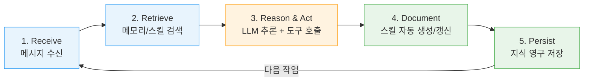
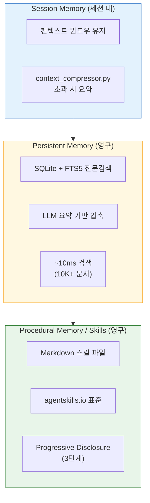
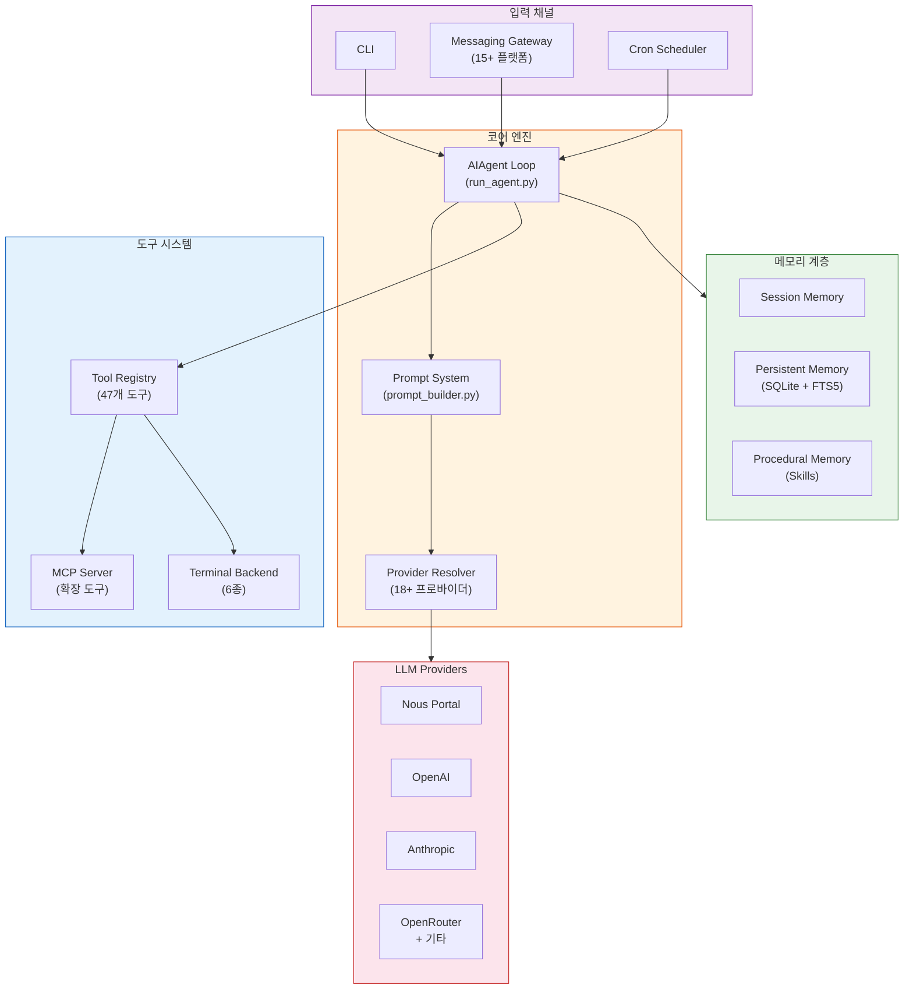

# Hermes Agent 조사 보고서

> Nous Research의 자기 개선형 오픈소스 AI 에이전트 | 2026-04-13 조사

---

| 항목 | 수치 |
|------|------|
| GitHub Stars | 69.9K |
| Built-in Tools | 40+ |
| Bundled Skills | 118 |
| 지원 LLM | 200+ |
| 플랫폼 | 15+ |
| 라이선스 | MIT |

---

## 목차

1. [개요](#1-개요)
2. [핵심 학습 루프 (Closed Learning Loop)](#2-핵심-학습-루프-closed-learning-loop)
3. [메모리 아키텍처 (3계층)](#3-메모리-아키텍처-3계층)
4. [스킬 시스템](#4-스킬-시스템)
5. [코어 아키텍처](#5-코어-아키텍처)
6. [실행 환경 & 플랫폼](#6-실행-환경--플랫폼)
7. [다른 에이전트와 비교](#7-다른-에이전트와-비교)
8. [BIP 프로젝트 관점 시사점](#8-bip-프로젝트-관점-시사점)
9. [웹앱 / Open WebUI 연동](#9-웹앱--open-webui-연동)
10. [BIP에 Hermes를 도입한다면?](#10-bip에-hermes를-도입한다면)
11. [비용 구조](#11-비용-구조)
12. [참고 자료](#12-참고-자료)

---

## 1. 개요

### Hermes Agent란?

Nous Research가 개발한 **자기 개선형(Self-Improving) 오픈소스 AI 에이전트**이다.
2026년 2월 출시되었으며, 현재 v0.7.0 (2026-04-03 기준)까지 릴리스되었다.

**핵심 차별점**은 **내장 학습 루프(Built-in Learning Loop)**에 있다.
작업 완료 후 자동으로 스킬을 생성/개선하고, 세션 간 지식을 유지하며,
사용할수록 더 똑똑해진다.

IDE 종속 코파일럿이나 단순 챗봇 래퍼가 아닌,
**인프라 위에서 독립적으로 실행되는 자율 에이전트**이다.
로컬 머신, VPS, 클라우드 환경 어디서든 동작하며,
다양한 메시징 플랫폼과 연동하여 사용자와 상호작용한다.

### Nous Research

Hermes, Nomos, Psyche 언어 모델을 개발한 AI 연구 조직이다.
오픈소스 LLM 생태계에서 높은 인지도를 가지고 있으며,
Hermes Agent는 이들의 에이전트 프레임워크 제품에 해당한다.

GitHub 조직: [github.com/NousResearch](https://github.com/NousResearch)

**호환 제공자:**

| 프로바이더 | 특징 |
|-----------|------|
| Nous Portal | 자체 추론 엔드포인트 |
| OpenRouter | 200+ 모델 라우팅 |
| OpenAI | GPT-4o, o1 등 |
| Anthropic | Claude 3.5/4 계열 |
| z.ai | xAI Grok 모델 |
| Kimi / Moonshot | 중국어 특화 |
| 커스텀 엔드포인트 | OpenAI 호환 API 모두 가능 |

---

## 2. 핵심 학습 루프 (Closed Learning Loop)

Hermes Agent의 가장 중요한 차별점은 5단계 학습 루프이다.
작업을 수행하면서 동시에 학습하고, 학습 결과를 다음 작업에 자동 적용한다.
이것이 단순 챗봇 래퍼와의 근본적 차이이다.



### 각 단계 상세

| 단계 | 이름 | 동작 |
|------|------|------|
| 1 | **Receive** | 사용자 메시지를 수신한다. CLI, Telegram, Discord 등 어떤 채널이든 동일한 포맷으로 정규화된다. |
| 2 | **Retrieve** | Persistent Memory와 Skill 저장소를 FTS5 전문검색으로 조회한다. 관련 컨텍스트와 이전에 성공한 절차를 프롬프트에 주입한다. |
| 3 | **Reason & Act** | LLM이 컨텍스트를 기반으로 추론하고, 필요한 도구를 호출한다. 멀티 스텝 작업은 자동으로 분해된다. |
| 4 | **Document** | 작업 완료 후 에이전트가 해당 작업 과정을 리플렉션한다. 5+ 도구 호출이 필요한 복잡 작업이면 자동으로 스킬 문서를 생성하거나 기존 스킬을 갱신한다. |
| 5 | **Persist** | 대화 기록, 학습된 사실, 생성/수정된 스킬을 SQLite와 스킬 파일에 영구 저장한다. |

### 자기 개선 효과

| 지표 | 수치 |
|------|------|
| 연구 작업 완료 속도 | 자동 생성 스킬 사용 시 **40% 향상** (프롬프트 튜닝 없이) |
| 스킬 자동 생성 조건 | 5+ 도구 호출이 필요한 복잡 작업 완료 시 |
| 반복 작업 효율 | 점진적 향상 (사용자 선호 형식 학습) |
| 리플렉션 토큰 오버헤드 | 일반 에이전트 대비 **15~25% 추가** |

### 학습 루프가 없는 에이전트와의 차이

일반 에이전트는 매 세션마다 동일한 출발점에서 시작한다.
같은 유형의 작업을 반복해도 효율이 개선되지 않는다.

Hermes는 학습 루프를 통해 다음을 달성한다:

- **작업 절차의 재활용**: 한번 성공한 워크플로우를 스킬로 저장하여 유사 작업에 자동 적용
- **사용자 선호 학습**: 응답 형식, 코드 스타일, 분석 깊이 등을 기억하여 맞춤 응답
- **오류 패턴 회피**: 실패한 접근법을 기록하여 동일 실수를 반복하지 않음

---

## 3. 메모리 아키텍처 (3계층)

Hermes의 메모리는 인간의 기억 체계에서 영감을 받은 3계층 구조이다.



### 계층별 상세

| 계층 | 역할 | 기술 | 지속성 |
|------|------|------|--------|
| **Session Memory** | 현재 대화 컨텍스트 | 컨텍스트 윈도우 내 유지, `context_compressor.py`로 초과 시 요약 | 세션 내 |
| **Persistent Memory** | 세션 간 장기 기억 (대화, 사실, 선호도) | SQLite + FTS5 전문검색, LLM 요약 기반 압축, ~10ms 검색 (10K+ 문서) | 영구 |
| **Procedural Memory (Skills)** | 방법론 기억 -- "어떻게 했는지" 절차 저장 | Markdown 스킬 파일, agentskills.io 표준, Progressive Disclosure (3단계) | 영구 |

### 핵심 혁신: Procedural Memory

전통적 에이전트가 **사실(facts)**을 기억하는 반면, Hermes는 **방법(methods)**을 기억한다.
성공한 워크플로우를 재사용 가능한 절차로 변환하여 유사 문제 발생 시 자동 로드한다.

예시:

- "Python 프로젝트 셋업" 스킬: venv 생성 -> requirements.txt 설치 -> 테스트 실행 절차
- "데이터 분석 리포트" 스킬: 데이터 로드 -> 전처리 -> 시각화 -> 마크다운 보고서 생성

### 캐시 인식 설계

시스템 프롬프트 스냅샷을 세션 초기화 시 고정하여,
고빈도 모델 호출이 캐시된 컨텍스트 윈도우를 효율적으로 사용한다.
이는 Anthropic의 prompt caching 기능과 자연스럽게 연동되어
반복 호출 시 비용을 절감한다.

### Context Compression

컨텍스트 윈도우 초과 시 `context_compressor.py`가 동작한다:

1. 오래된 대화를 LLM으로 요약
2. 요약본을 Persistent Memory에 저장
3. 현재 윈도우에는 요약본 + 최근 대화만 유지
4. 핵심 정보 손실 최소화

---

## 4. 스킬 시스템

### 스킬 디렉터리 구조

```
my-skill/
  SKILL.md          # YAML frontmatter + 절차 내용
  scripts/          # 실행 스크립트
  references/       # 참조 문서
  assets/           # 이미지 등
```

[agentskills.io](https://agentskills.io) 오픈 표준을 준수한다.

### SKILL.md 예시

```yaml
---
name: deploy-docker-app
description: Docker 기반 애플리케이션 배포 절차
version: 1.2.0
tags: [docker, deployment, devops]
triggers:
  - "Docker로 배포"
  - "컨테이너 배포"
---

## 절차

1. Dockerfile 유효성 검증
2. docker-compose.yml 구성 확인
3. 이미지 빌드 및 태깅
4. 헬스체크 포트 확인
5. 배포 및 상태 모니터링
```

### Progressive Disclosure (3단계)

| 레벨 | 로드 범위 | 토큰 비용 | 사용 시점 |
|------|-----------|-----------|-----------|
| **Level 0** | 스킬 이름 + 설명 목록만 | 최소 | 매 대화 시작 시 자동 로드 |
| **Level 1** | 특정 스킬 전체 내용 로드 | 중간 | 관련 스킬 감지 시 자동 로드 |
| **Level 2** | 스킬 내 특정 참조 파일 로드 | 필요분만 | 실행 단계에서 필요 시 |

필요할 때만 상세 로드하여 토큰을 절약한다.
118개 스킬 전체를 Level 0으로 로드해도 토큰 소모가 적고,
실제로 사용하는 스킬만 Level 1/2로 확장된다.

### 스킬 생명주기

| 단계 | 설명 |
|------|------|
| **자동 생성** | 5+ 도구 호출 복잡 작업 완료 후 에이전트가 자동으로 `SKILL.md` 생성 |
| **자기 개선** | 사용 중 모순/확장 정보 발견 시 스킬 문서 자동 패치 |
| **공유** | agentskills.io Skills Hub를 통해 커뮤니티 공유 (보안 스캔 통과 필수) |
| **검색** | FTS5 전문검색으로 ~10ms 내 관련 스킬 조회 |

### 번들 스킬 카테고리

총 **118개** (96 기본 + 22 선택), 26+ 카테고리:

| 카테고리 | 예시 스킬 |
|----------|-----------|
| 개발 | Git 워크플로우, 코드 리뷰, CI/CD 파이프라인 |
| 데이터 | CSV 분석, SQL 쿼리, 데이터 시각화 |
| DevOps | Docker 배포, 서버 모니터링, 로그 분석 |
| 리서치 | 웹 리서치, 논문 분석, 기술 비교 |
| 문서 | 마크다운 작성, API 문서화, README 생성 |
| 시스템 | 파일 관리, 프로세스 모니터링, 디스크 정리 |

---

## 5. 코어 아키텍처

### 5개 주요 서브시스템

| 서브시스템 | 핵심 파일 | 역할 |
|-----------|-----------|------|
| **AIAgent Loop** | `run_agent.py` (~9,200줄) | 중앙 오케스트레이션 -- 프로바이더 선택, 프롬프트 구성, 도구 실행, 영속성 |
| **Prompt System** | `prompt_builder.py`, `context_compressor.py` | 성격 파일 + 메모리 + 스킬 + 컨텍스트 문서 조립, Anthropic 캐시 최적화 |
| **Provider Resolver** | 공유 런타임 | (provider, model) 튜플 -> 자격증명 + API 모드 매핑 (18+ 프로바이더) |
| **Tool System** | 자기등록 레지스트리 | 47개 도구 / 20개 도구셋, 6개 터미널 백엔드 (local, Docker, SSH, Daytona, Modal, Singularity) |
| **Messaging Gateway** | 장기 실행 프로세스 | 14개 플랫폼 어댑터, 통합 세션 라우팅, 인가 |

### 아키텍처 다이어그램



### 데이터 플로우

| 경로 | 흐름 |
|------|------|
| **CLI** | `user input` -> `HermesCLI.process_input()` -> `AIAgent.run_conversation()` -> API call -> tool dispatch -> response -> DB persist |
| **Gateway** | `platform event` -> adapter -> auth -> session resolve -> `AIAgent.run_conversation()` -> platform delivery |
| **Cron** | `scheduler tick` -> job load -> fresh AIAgent -> skill inject -> response -> state update |

### 프롬프트 구성 순서

`prompt_builder.py`가 시스템 프롬프트를 다음 순서로 조립한다:

1. **성격 파일 (Personality)** -- 에이전트의 기본 행동 지침
2. **프로필 설정** -- 사용자별 커스텀 지시사항
3. **도구 목록** -- 현재 활성화된 도구 설명
4. **스킬 목록 (Level 0)** -- 전체 스킬의 이름과 설명
5. **관련 스킬 (Level 1)** -- 현재 대화와 관련된 스킬 전체 내용
6. **메모리 검색 결과** -- Persistent Memory에서 관련 정보 검색
7. **컨텍스트 문서** -- 사용자가 지정한 참조 파일

### 설계 원칙

| 원칙 | 설명 |
|------|------|
| **Prompt Stability** | 대화 중 시스템 프롬프트 변경 불가. 세션 초기에 스냅샷을 고정한다. |
| **Observable Execution** | 모든 도구 호출이 사용자에게 가시적. 숨겨진 행동 없음. |
| **Interruptible** | 진행 중인 작업을 언제든 중단 가능. |
| **Platform-Agnostic Core** | 코어 로직과 플랫폼 어댑터를 완전히 분리한다. |
| **Loose Coupling** | 레지스트리 기반 느슨한 결합. 도구/프로바이더를 동적으로 추가/제거한다. |
| **Profile Isolation** | 여러 프로필을 동시에 실행 가능. 메모리와 스킬이 프로필별로 격리된다. |

---

## 6. 실행 환경 & 플랫폼

### 터미널 백엔드 (6개)

| 백엔드 | 용도 | 격리 수준 |
|--------|------|-----------|
| **Local** | 로컬 머신 직접 실행 | 없음 (호스트 직접) |
| **Docker** | 컨테이너 격리 | 컨테이너 레벨 |
| **SSH** | 원격 서버 접속 실행 | 네트워크 분리 |
| **Daytona** | 클라우드 개발환경 | VM 레벨 |
| **Modal** | 서버리스 함수 실행 | 함수 레벨 |
| **Singularity** | HPC 컨테이너 (학술/연구) | 컨테이너 레벨 |

### 메시징 플랫폼 (15+)

| 카테고리 | 플랫폼 | 비고 |
|----------|--------|------|
| 기본 | CLI, Telegram, Discord, Slack | 공식 1순위 지원 |
| 메신저 | WhatsApp, Signal, Matrix, Mattermost | 브릿지 기반 |
| 기타 | Email, SMS, DingTalk, Feishu | 아시아권 포함 |
| 특수 | WeCom, BlueBubbles, Home Assistant | IoT/엔터프라이즈 |

### 설치

```bash
# 원라인 설치
curl -fsSL https://raw.githubusercontent.com/NousResearch/hermes-agent/main/scripts/install.sh | bash

# 설치 후 초기 설정
hermes config --provider openrouter --model claude-3.5-sonnet
```

**지원 환경:** Linux, macOS, WSL2, Termux (Android)

**최소 사양:** 2코어, 8GB RAM, $5/월 VPS

**권장 사양:** 4코어, 16GB RAM (대규모 스킬 라이브러리 운용 시)

---

## 7. 다른 에이전트와 비교

| 항목 | Hermes Agent | Claude Code | OpenClaw |
|------|-------------|-------------|----------|
| **철학** | 자기 개선하는 에이전트 | 코드 생성 전문가 | 다중 플랫폼 연결 |
| **학습 루프** | 내장 스킬 자동 생성/개선 | 부분적 메모리 파일 수동 | 없음 |
| **메모리** | 3계층 (세션/영구/절차적) | CLAUDE.md + auto memory | 없음 |
| **플랫폼** | 15+ (Telegram, Slack 등) | 터미널/IDE/웹 | 50+ |
| **도구** | 47개 + MCP 서버 | 파일/터미널/웹 | 플러그인 기반 |
| **코드 품질** | 범용 (모델 의존) | 최상 (프론티어 모델 특화) | 범용 |
| **강점** | 자율 학습, 스킬 생태계 | 코딩 품질, 프론티어 모델 | 플랫폼 커버리지 |
| **약점** | 코딩 전문성 부족 | 플랫폼 제한 | 학습 능력 없음 |
| **GitHub Stars** | ~70K | N/A (Anthropic 제품) | ~345K |
| **라이선스** | MIT | 상용 | Apache 2.0 |

### 핵심 차이 요약

- **Hermes**: "범용 자율 에이전트" -- 다양한 작업을 스스로 학습하며 개선
- **Claude Code**: "코딩 전문가" -- 소프트웨어 개발에 최적화, 프론티어 모델의 코딩 능력 극대화
- **OpenClaw**: "플랫폼 커넥터" -- 최대한 많은 서비스/플랫폼과 연결하는 데 집중

---

## 8. BIP 프로젝트 관점 시사점

### 참고 가능한 개념

| Hermes 개념 | BIP 적용 가능성 |
|-------------|-----------------|
| **스킬 시스템** | 체크리스트 에이전트의 반복 분석 패턴을 "스킬"로 저장하면 프롬프트 토큰 절약 + 일관성 확보 가능 |
| **Progressive Disclosure** | 현재 모든 체크리스트 항목을 한 번에 LLM에 전달하는데, 레벨별 로딩으로 토큰 최적화 가능 |
| **Procedural Memory** | "환율 방향성 판정법", "유가 영향 분석법" 같은 반복 절차를 스킬 문서로 관리하면 방향성 오판 문제 구조적 해결 |
| **Cron 스케줄링** | Hermes의 자연어 크론 스케줄링이 Airflow DAG보다 유연할 수 있음 (단, 엔터프라이즈 안정성은 Airflow가 우위) |

### 현재 BIP와의 차이

| 관점 | BIP | Hermes |
|------|-----|--------|
| 아키텍처 | **파이프라인 중심** (Airflow DAG, 정해진 흐름) | **에이전트 중심** (자율 판단) |
| 학습 | Haiku ReAct 방식 (스킬 저장/재활용 없음) | 학습 루프 내장 (스킬 자동 생성) |
| 패턴 인식 | 뉴스 다이제스트 파이프라인 (수동 설계) | "반복 작업 학습" 자동화 |
| 멀티 플랫폼 | 텔레그램 + 이메일 | 15+ 플랫폼 게이트웨이 |
| DB | PostgreSQL (39개 테이블) | SQLite (로컬 파일) |
| 감사 | agent_audit_log 테이블 | 없음 (자체 구현 필요) |

### 도입 시 고려사항

| 항목 | 상세 |
|------|------|
| 리플렉션 오버헤드 | 토큰 15~25% 추가 -- 비용 민감 환경에서 부담 |
| 월 API 비용 | $15~$400+ -- BIP 현재 ~$5/월 대비 크게 증가 |
| 코딩 전문 작업 | Claude Code/Cursor가 더 적합 (Hermes 공식 인정) |
| DB 통합 | SQLite 기반 -- PostgreSQL 중심의 BIP 인프라와 통합 시 추가 작업 필요 |
| 예측 가능성 | 자율 에이전트의 행동이 BIP 거버넌스(보안, 감사 로그) 요구사항과 충돌 가능 |

---

## 9. 웹앱 / Open WebUI 연동

### Hermes Agent -- 웹 연동 (최상)

OpenAI 호환 API 서버를 노출하므로, **아무 프론트엔드와 바로 연결** 가능하다.

| 방식 | 설명 | 난이도 |
|------|------|--------|
| **Open WebUI** | 공식 연동 문서 제공. `OPENAI_API_BASE_URL`만 설정하면 완료 | 쉬움 |
| **hermes-webui** | [전용 웹 UI](https://github.com/nesquena/hermes-webui) -- CLI과 동일한 기능을 브라우저에서 제공 | 쉬움 |
| **hermes-workspace** | [네이티브 워크스페이스](https://github.com/outsourc-e/hermes-workspace) -- 채팅 + 터미널 + 메모리 + 스킬 인스펙터 | 보통 |
| **기타** | LobeChat, LibreChat, NextChat, ChatBox 등 OpenAI 포맷 지원 프론트엔드 모두 가능 | 쉬움 |

### Open WebUI 연동 설정 예시

```bash
# Hermes Agent를 OpenAI 호환 서버로 기동
hermes serve --port 8080

# Open WebUI에서 설정
# Settings > Connections > OpenAI API
# Base URL: http://localhost:8080/v1
# API Key: (설정한 키)
```

### Deep Agents -- 웹 연동 (제한적)

| 방식 | 설명 |
|------|------|
| **deep-agents-ui** | [LangChain 공식 전용 UI](https://github.com/langchain-ai/deep-agents-ui) |
| **Open WebUI** | 직접 연동 불가. OpenAI 호환 래퍼를 별도 구현해야 연결 가능 |

LangChain/LangGraph 기반이라 범용 프론트엔드와 바로 붙는 구조는 아니다.

---

## 10. BIP에 Hermes를 도입한다면?

### 현재 BIP 구조 vs Hermes 도입 구조

**현재 BIP:**

```
Airflow (스케줄링/모니터링)
  -> BIP-Agents (LLM + MCP)
      -> checklist_agent
      -> preopen_analyzer
      -> stock_screener
  -> 텔레그램 / 이메일
```

**Hermes 최상단:**

```
Hermes Agent (오케스트레이션 + 학습 + 웹 UI)
  -> BIP-Agents (도구로 호출)
  -> Airflow (스케줄링만)
  -> 웹 / 텔레그램 / Slack
```

### 3가지 선택지

| 옵션 | 설명 | 장점 | 단점 | 리스크 |
|------|------|------|------|--------|
| **A. 개념만 차용** (추천) | 현재 구조 유지하면서 Hermes의 좋은 아이디어를 BIP에 점진적으로 적용 | 안정적, 기존 투자 보존, 점진적 개선 | 웹 UI/멀티플랫폼은 직접 구현 필요 | 낮음 |
| **B. 인터페이스 레이어** | Hermes를 사용자 대화 창구로, 실제 분석은 BIP-Agents가 처리 | 웹 UI 즉시 확보, 학습 루프 활용 | Hermes-BIP 연동 개발 필요, 이중 인프라 | 중간 |
| **C. 전면 교체** | BIP-Agents를 Hermes 프레임워크로 마이그레이션 | 통합된 아키텍처, 학습 루프 네이티브 | 기존 코드 폐기, 거버넌스 재구축, SQLite-PostgreSQL 불일치 | 높음 |

### 옵션 A: 차용 가능한 Hermes 개념

| 개념 | BIP 적용 방안 | 구현 난이도 |
|------|---------------|-------------|
| **스킬 시스템** | 체크리스트 에이전트의 반복 분석 패턴을 스킬 문서로 저장 (환율 방향성 판정, 유가 분석 등) | 낮음 |
| **Procedural Memory** | "어떻게 했는지"를 기억 -- 현재 auto memory는 "무엇을" 기억 | 중간 |
| **Progressive Disclosure** | 프롬프트에 스킬 전체를 넣지 않고 레벨별 로딩으로 토큰 절약 | 낮음 |
| **웹 UI** | 기존 React-FastAPI에 채팅 인터페이스 추가 (Hermes 불필요) | 중간 |
| **뉴스 다이제스트** | 이미 BIP에서 구현 완료 (Hermes의 "반복 작업 학습"과 유사) | 완료 |

### 옵션 B: Hermes를 인터페이스 레이어로 쓸 때

```
사용자  <-->  Hermes (대화/웹UI/학습)
                 |
          OpenAI 호환 API
                 |
          BIP-Agents API (실제 분석)
                 |
          Airflow + PostgreSQL + MCP
```

구체적 연동 방식:

- Hermes가 BIP-Agents의 `/api/checklist/analyze`, `/api/screener/daily` 등을 도구로 호출
- 사용자는 "오늘 시장 어때?" 같은 자연어로 질문하면 Hermes가 판단해서 적절한 BIP API 호출
- 학습 루프로 자주 묻는 질문의 응답 패턴을 스킬로 저장
- Hermes의 Cron 스케줄러로 정기 리포트 생성을 트리거할 수도 있으나, Airflow의 안정성이 더 높음

### 옵션 C: 전면 교체 (비추천)

전면 교체 시 마이그레이션 범위:

| 현재 BIP 구성요소 | 마이그레이션 작업 |
|-------------------|-------------------|
| Airflow DAG 43개 | Hermes Cron으로 재작성 |
| PostgreSQL 39개 테이블 | SQLite 또는 외부 DB 연동 구현 |
| agent_audit_log | 커스텀 감사 시스템 구축 |
| security_governance | 보안 정책 재구현 |
| MCP 도구 | Hermes Tool로 래핑 |
| 텔레그램 봇 | Hermes Gateway 전환 |

### Hermes 도입 시 잃는 것

| 항목 | 상세 |
|------|------|
| **Airflow 안정성** | 스케줄링/재시도/모니터링 UI -- Hermes cron은 이만큼 성숙하지 않음 |
| **PostgreSQL 인프라** | Hermes는 SQLite 기반, 기존 39개 테이블과 통합 어려움 |
| **감사 로그/보안** | `agent_audit_log`, `security_governance` 등 다시 구축 필요 |
| **토큰 비용** | 리플렉션 오버헤드 15~25% 증가 (BIP 현재 ~$5/월 -> ~$20+/월) |
| **예측 가능성** | 자율 에이전트의 행동이 규칙 기반보다 불확실 |
| **OpenMetadata 통합** | OM 메타데이터/리니지와의 연동 재구축 필요 |

---

## 11. 비용 구조

### 인프라 비용

| 항목 | 수치 | 비고 |
|------|------|------|
| 최소 호스팅 | $5/월 VPS (2코어, 8GB RAM) | DigitalOcean, Vultr 등 |
| 권장 호스팅 | $10~20/월 VPS (4코어, 16GB RAM) | 대규모 스킬 운용 시 |
| 스토리지 | 최소 10GB | SQLite + 스킬 파일 |

### API 비용

| 사용 패턴 | 예상 월 비용 | 모델 |
|-----------|-------------|------|
| 가벼운 사용 (하루 10~20회) | $15~$30 | Haiku/GPT-4o-mini 급 |
| 중간 사용 (하루 50~100회) | $50~$150 | Sonnet/GPT-4o 급 |
| 헤비 사용 (하루 200+회) | $200~$400+ | Opus/o1 급 |

### 오버헤드

| 항목 | 수치 |
|------|------|
| 리플렉션 토큰 오버헤드 | 15~25% 추가 (학습 루프 때문) |
| FTS5 검색 지연 | ~10ms (10K+ 문서 기준) |
| 스킬 로딩 (Level 0) | < 500 토큰 (118개 스킬) |
| 스킬 로딩 (Level 1) | 1,000~5,000 토큰 (스킬당) |

### BIP 현재 비용과 비교

| 항목 | BIP 현재 | Hermes 도입 시 |
|------|----------|---------------|
| 인프라 | Docker Compose (기존 서버) | 추가 VPS $5~20/월 |
| API 비용 | ~$5/월 (Haiku 위주) | $20~150/월 (리플렉션 포함) |
| 총 비용 | ~$5/월 | $25~170/월 |

---

## 12. 참고 자료

| 자료 | 링크 | 비고 |
|------|------|------|
| GitHub 저장소 | [NousResearch/hermes-agent](https://github.com/nousresearch/hermes-agent) | 69.9K stars, MIT |
| 공식 문서 | [hermes-agent.nousresearch.com/docs](https://hermes-agent.nousresearch.com/docs/) | 설치/설정/API 가이드 |
| 아키텍처 상세 | [Developer Guide - Architecture](https://hermes-agent.nousresearch.com/docs/developer-guide/architecture) | 서브시스템 설계 |
| Complete Guide | [NxCode, 2026](https://www.nxcode.io/resources/news/hermes-agent-complete-guide-self-improving-ai-2026) | 종합 리뷰 |
| OpenClaw 비교 분석 | [MindStudio Blog](https://www.mindstudio.ai/blog/what-is-hermes-agent-openclaw-alternative) | 경쟁 제품 비교 |
| Self-Improving AI Agent | [DEV Community](https://dev.to/arshtechpro/hermes-agent-a-self-improving-ai-agent-that-runs-anywhere-2b7d) | 커뮤니티 리뷰 |
| agentskills.io | [agentskills.io](https://agentskills.io) | 스킬 오픈 표준/허브 |
| Nous Research GitHub | [github.com/NousResearch](https://github.com/NousResearch) | 조직 전체 저장소 |

---

## 변경 이력

| 날짜 | 작성자 | 변경 내용 |
|------|--------|-----------|
| 2026-04-13 | yeji | 초안 작성 -- Hermes Agent v0.7.0 기준 조사 |
| 2026-04-26 | yeji | 포맷 재정비 -- Mermaid 다이어그램 3개 추가, 테이블 정리, 목차 추가, 깨진 서식 전면 수정, 섹션별 상세 보강 |
