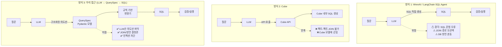
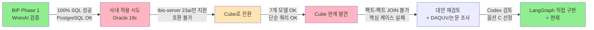
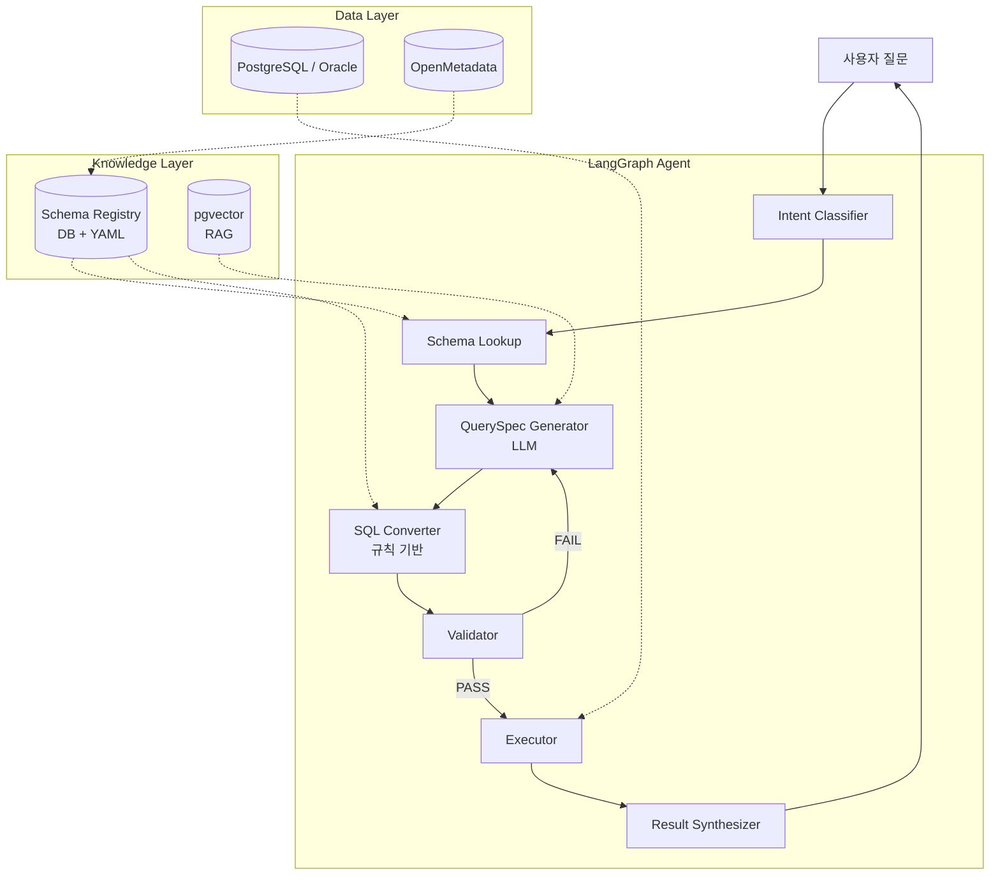
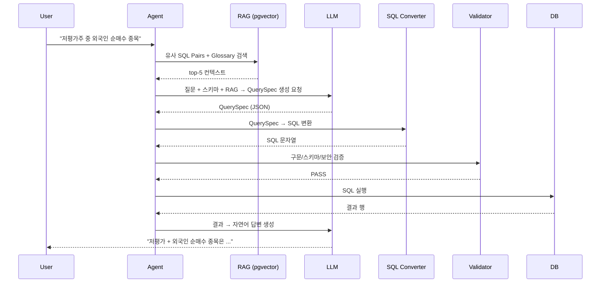
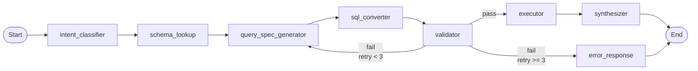
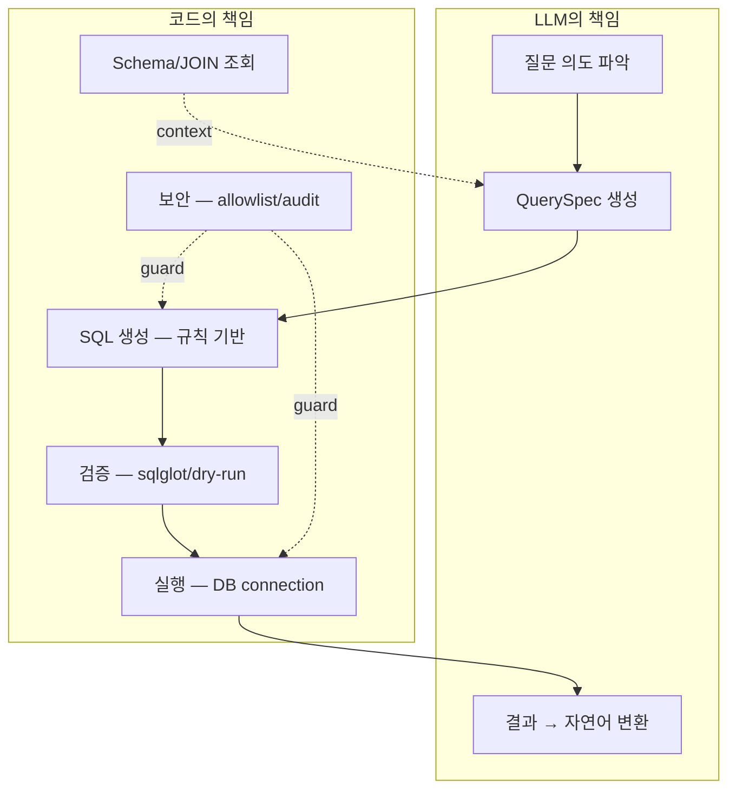

# LangGraph NL2SQL Agent 설계 문서

> **위치:** `BIP-Agents/langgraph/nl2sql/`
> **상위 문서:** `docs/nl2sql_implementation_plan_v2.md` (§11 — v3 방향 전환)

---

## 1. 개요

### 1-1. 목적

WrenAI를 대체할 자체 NL2SQL 엔진을 LangGraph 기반으로 구축한다. 사내 Oracle 19c 환경 호환과 복합 쿼리(팩트-팩트 JOIN)를 동시에 만족하는 것이 목표.

### 1-2. 핵심 컨셉 — LLM이 SQL을 직접 쓰지 않는다

기존 NL2SQL 도구들의 한계와 우리 접근법의 차이:



**핵심 아이디어:**

| 책임 | 누가 |
|------|:-:|
| 질문의 의도 파악 ("뭘 보고 싶은지") | **LLM** |
| 구조화된 명세(QuerySpec) 생성 | **LLM** |
| JOIN 경로 결정 | **코드 (Schema Registry)** |
| SQL 문법 생성 | **코드 (SQL Converter)** |
| DB 방언 처리 | **코드 (Converter)** |
| 보안/검증 | **코드 (Validator)** |
| 결과 → 자연어 변환 | **LLM** |

LLM이 결정하는 영역을 최소화하여 **환각의 위험 표면적을 줄인다.** 논문 "Querying Databases with Function Calling" (arXiv 2502.00032)의 핵심 통찰과 일치.

### 1-3. 진화 과정 (왜 이 방향인가)



각 전환의 근거는 `nl2sql_implementation_plan_v2.md` §11에 의사결정 이력으로 기록되어 있다.

### 1-4. 설계 원칙

```
1. LLM에게 SQL을 직접 쓰게 하지 않는다.
   → LLM은 "비즈니스 의도(QuerySpec)"만 구조화한다.
   → SQL 생성은 규칙 기반 변환기가 담당한다.

2. 시맨틱 레이어는 DB에 둔다.
   → Gold View + Curated View가 메트릭/계산식의 SSOT.
   → Cube/dbt 같은 별도 도구를 두지 않는다.

3. 메타데이터는 자동 추출.
   → DB COMMENT + OpenMetadata API에서 자동 동기화.
   → JOIN 관계만 YAML로 수동 관리 (10개 미만).

4. 검증은 결정론.
   → sqlglot 구문 검증 + DB dry-run.
   → 실패 시 LLM에게 에러 메시지 피드백 → 재생성 (3회).

5. Agent는 멀티스텝.
   → 1질문=1SQL 제약 없음.
   → 복합 질문은 Agent가 분해 + 조합.
```

### 1-5. 참고한 외부 자료

| 자료 | 적용한 패턴 |
|------|------|
| **WrenAI** | SQL Pairs(Few-shot), Description, 자동 보정 3회 |
| **DAQUV/QUVI** | SMQ(중간 표현) 방식, SafeGuard 노드 |
| **논문 "Querying Databases with Function Calling" (arXiv 2502.00032)** | Function Calling 방식이 SQL 직접 생성보다 안정적 |
| **Codex 검토** | QuerySpec 3단 IR 설계, OM + YAML 조합 |

---

## 2. 아키텍처

### 2-1. 전체 구조



### 2-2. 데이터 흐름



### 2-3. 모듈 구조

```
BIP-Agents/langgraph/nl2sql/
├── __init__.py
├── query_spec.py          # QuerySpec Pydantic 모델
├── sql_converter.py       # QuerySpec → SQL 변환기 (규칙 기반)
├── schema_registry.py     # 스키마 레지스트리 (DB COMMENT + YAML)
├── validator.py           # SQL 검증 (sqlglot + dry-run + allowlist)
├── joins.yaml             # JOIN 관계 정의 (수동, 11개)
├── agent.py               # LangGraph Agent (예정)
├── rag.py                 # 벡터 검색 (예정)
└── tests/
    └── evaluation_set.yaml  # 평가셋 23개 (WrenAI 비교용)
```

---

## 3. 핵심 컴포넌트

### 3-1. QuerySpec — 중간 표현

**LLM이 생성하는 구조화된 쿼리 명세.** SQL이 아니라 "비즈니스 의도"를 구조화한 IR(Intermediate Representation).

```python
class QuerySpec(BaseModel):
    tables: list[str]                    # 조회 테이블
    select: list[str]                    # SELECT 컬럼
    filters: list[Filter] = []           # WHERE 조건
    aggregations: list[Aggregation] = [] # SUM/AVG/COUNT
    group_by: list[str] = []             # GROUP BY
    order_by: list[OrderBy] = []         # ORDER BY
    limit: int = 20                      # LIMIT
    time_scope: Optional[TimeScope] = None  # 시간 필터
```

**예시:**

```python
# 질문: "저평가주 중 외국인 순매수 종목 시총 상위 10개"
QuerySpec(
    tables=["v_valuation_signals__v1", "v_flow_signals__v1", "stock_info"],
    select=["stock_name", "per_actual", "foreign_direction", "market_value"],
    filters=[
        Filter(column="is_value_stock", op=FilterOp.EQ, value=True),
        Filter(column="is_foreign_net_buy", op=FilterOp.EQ, value=True),
    ],
    order_by=[OrderBy(column="market_value", direction=OrderDirection.DESC)],
    limit=10,
)
```

**왜 SQL이 아니라 QuerySpec인가?**

| LLM이 SQL 직접 생성 | LLM이 QuerySpec 생성 |
|:-:|:-:|
| SQL 문법 알아야 함 | "뭘 보고 싶은지"만 표현 |
| JOIN 경로 LLM이 결정 | 변환기가 자동 처리 |
| DB 방언 처리 LLM 의존 | 변환기가 처리 |
| SQL 인젝션 위험 | Pydantic 검증 |
| 환각 가능성 높음 | 구조화로 차단 |

### 3-2. SQL Converter — 규칙 기반 SQL 생성

**QuerySpec을 SQL로 변환하는 결정론적 엔진.** LLM 호출 없음.

```python
class SQLConverter:
    def convert(self, spec: QuerySpec) -> str:
        return f"""
        SELECT {self._build_select(spec)}
        FROM {self._build_from(spec)}     # JOIN 자동 처리
        WHERE {self._build_where(spec)}
        ORDER BY {self._build_order_by(spec)}
        LIMIT {spec.limit}
        """
```

**핵심 기능:**

| 기능 | 설명 |
|------|------|
| **JOIN 자동 생성** | `tables` 목록 → `joins.yaml`에서 경로 탐색 → JOIN 절 생성 |
| **컬럼 alias 처리** | `stock_name` → `vs.stock_name` (테이블 자동 식별) |
| **DB 방언 처리** | PostgreSQL: `LIMIT N`, Oracle: `FETCH FIRST N ROWS ONLY` |
| **시간 필터 변환** | `last_7d` → `CURRENT_DATE - INTERVAL '7 days'` |
| **SQL 인젝션 방지** | 모든 값을 `_quote_value()`로 escape |

**예시 변환:**

```sql
-- QuerySpec → SQL Converter 출력
SELECT vs.stock_name, vs.per_actual, fs.foreign_direction, si.market_value
FROM v_valuation_signals__v1 vs
JOIN v_flow_signals__v1 fs ON vs.ticker = fs.ticker
JOIN stock_info si ON vs.ticker = si.ticker
WHERE vs.is_value_stock = true
  AND fs.is_foreign_net_buy = true
ORDER BY si.market_value DESC
LIMIT 10
```

### 3-3. Schema Registry — 스키마 메타데이터

**DB COMMENT + JOIN YAML을 통합 관리하는 레지스트리.**

```python
class SchemaRegistry:
    tables: dict[str, TableInfo]   # 테이블/컬럼/설명 (DB 자동 추출)
    joins: list[JoinInfo]          # JOIN 관계 (YAML 수동)

    async def load_from_db(self, dsn): ...     # DB COMMENT → tables
    def load_joins(self, yaml_path): ...        # joins.yaml → joins
    def find_join_path(self, tables): ...       # 다중 테이블 JOIN 경로
    def get_schema_prompt(self, tables): ...    # LLM 프롬프트용 요약
```

**joins.yaml 예시:**

```yaml
joins:
  - tables: ["stock_info", "v_valuation_signals__v1"]
    on: "ticker"
    type: "one_to_many"

  - tables: ["v_technical_signals__v1", "v_flow_signals__v1"]
    on: "ticker, trade_date"   # 같은 grain끼리 직접 JOIN
    type: "one_to_one"

  - tables: ["v_valuation_signals__v1", "v_flow_signals__v1"]
    on: "ticker"
    type: "many_to_many"
    note: "grain 불일치 (연도 vs 일자) — 최신 행 필터 권장"
```

**왜 OpenMetadata Lineage로 안 되는가?**
- Lineage = 데이터 흐름 (이 테이블이 어디서 왔는지)
- JOIN 관계 = 어떤 컬럼끼리 연결하는지 (별개 메타)
- OM에는 JOIN 정보가 없으므로 YAML로 보완

### 3-4. Validator — SQL 검증

**3단계 검증 + 자동 보정.**

```python
class SQLValidator:
    def validate_syntax(self, sql) -> ValidationResult:
        # 1. SELECT only 확인
        # 2. 금지 키워드 (INSERT, UPDATE, DELETE, DROP 등)
        # 3. sqlglot 파싱

    def validate_tables(self, sql) -> ValidationResult:
        # 4. allowlist 확인 (8개 테이블만 허용)

    async def validate_with_db(self, sql, dsn) -> ValidationResult:
        # 5. EXPLAIN 실행 (스키마 검증)
```

**ALLOWED_TABLES (NL2SQL 대상):**

```python
ALLOWED_TABLES = {
    "stock_info",
    "analytics_stock_daily",
    "analytics_valuation",
    "analytics_macro_daily",
    "v_valuation_signals__v1",
    "v_technical_signals__v1",
    "v_flow_signals__v1",
    "v_latest_valuation",
}
```

민감 테이블(portfolio, holding, transaction 등)은 allowlist에 없으므로 SQL이 생성되어도 차단됨.

### 3-5. LangGraph Agent (예정)

**노드 구성:**



**State 정의 (예시):**

```python
class NL2SQLState(TypedDict):
    question: str
    intent: str                           # text_to_sql / general / clarify
    schema_context: str                   # RAG 결과
    query_spec: Optional[QuerySpec]
    sql: Optional[str]
    validation_error: Optional[str]
    retry_count: int
    rows: Optional[list[dict]]
    answer: Optional[str]
```

---

## 4. 평가 전략

### 4-1. 평가셋 (`tests/evaluation_set.yaml`)

WrenAI Phase 1에서 100% 달성한 동일한 질문을 사용 → **순수한 NL2SQL 엔진 비교**.

| 카테고리 | 질문 수 | 예시 |
|---------|:------:|------|
| 기본 조회 | 5 | 삼성전자 PER, 코스피 시총 상위 5 |
| Boolean flag | 5 | 저평가주, 과매도 종목 |
| 비교 분석 | 2 | 삼성전자 vs SK하이닉스 |
| data_type 활용 | 2 | 잠정 실적, 추정치 비교 |
| **복합 JOIN** | **8** | **저평가 + 외국인 매수, 과매도 + 저평가** |
| **합계** | **23** | |

### 4-2. WrenAI 결과와 비교 (기준선)

| 지표 | WrenAI Phase 1 | LangGraph Agent (목표) |
|------|:-:|:-:|
| SQL 생성률 | 100% (15/15) | ≥ 95% |
| DB 실행률 | 100% (15/15) | ≥ 95% |
| Boolean flag 사용 | 87% (7/8) | ≥ 80% |
| 복합 JOIN 성공 | ✅ | **✅ (필수)** |
| 평균 응답 속도 | 10s | ≤ 15s |

**복합 JOIN 성공이 핵심 KPI.** Cube에서 실패한 영역.

### 4-3. 자동 평가 스크립트

```bash
# 사용 예시 (구현 예정)
python -m nl2sql.tests.run_evaluation \
  --dataset tests/evaluation_set.yaml \
  --baseline reports/wrenai_phase1_results.json \
  --output reports/agent_evaluation.json
```

---

## 5. WrenAI/Cube와의 비교

### 5-1. 기능 비교

| 항목 | WrenAI | Cube | LangGraph Agent (이 설계) |
|------|:-:|:-:|:-:|
| SQL 생성 방식 | LLM 직접 | Cube API | **LLM → QuerySpec → 변환기** |
| 시맨틱 레이어 | MDL (경량) | Cube model | **DB View (Gold/Curated)** |
| 복합 JOIN | ✅ | ❌ 제약 | **✅** |
| Oracle 19c | ❌ 23ai만 | ✅ | **✅** |
| 멀티스텝 쿼리 | ❌ | ❌ | **✅** |
| 비정형 RAG 확장 | ❌ | ❌ | **✅** |
| 자동 보정 | ✅ 3회 | ❌ | **✅ 3회** |
| 사내 LLM 사용 | ⚠️ LiteLLM | - | **✅ 자유** |
| 관리 UI | ✅ | ✅ | ❌ (코드 관리) |
| 구현 비용 | 0 | 0 | 2-3주 |

### 5-2. 책임 경계



**원칙:** LLM이 결정하는 영역을 최소화한다. SQL의 위험한 부분(JOIN, 보안, 방언)은 결정론으로 처리.

---

## 6. BIP 경험 이식

### 6-1. WrenAI에서 배운 것

| BIP 자산 | LangGraph Agent에서 활용 |
|---------|----------------|
| Gold Table 3종 | 그대로 사용 (DB 시맨틱 레이어) |
| Curated View 4종 | 그대로 사용 |
| Boolean flag (is_value_stock 등) | LLM이 QuerySpec 필터로 활용 |
| 해석 컬럼 (foreign_direction) | sql_answer 환각 방지에 그대로 유효 |
| SQL Pairs 70개 | 벡터 DB에 임베딩 → Few-shot |
| Instructions 4개 | Agent System Prompt |
| OM Glossary 77개 | 벡터 DB에 임베딩 |
| 4-layer 보안 | Validator + DB role + audit log 그대로 |
| 평가셋 15개 | tests/evaluation_set.yaml에 통합 |

### 6-2. WrenAI에서 안 됐던 것 → 이번에 해결

| WrenAI 한계 | LangGraph Agent에서 |
|-----------|----------------|
| 1질문=1SQL | Agent 멀티스텝 |
| sql_answer 환각 | Result Synthesizer 직접 제어 |
| 프롬프트 커스터마이징 불가 | 완전 제어 |
| OpenAI json_schema 편향 | LLM 자유 선택 |
| Oracle 19c 미지원 | 직결 가능 |
| 비정형 RAG 불가 | RAG Tool 확장 |

---

## 7. 진행 현황 (2026-04-26)

### 완료

- [x] QuerySpec Pydantic 모델 (`query_spec.py`)
- [x] SQL Converter 뼈대 (`sql_converter.py`)
- [x] Schema Registry 뼈대 (`schema_registry.py`)
- [x] Validator 뼈대 (`validator.py`)
- [x] joins.yaml (11개 JOIN 관계)
- [x] 평가셋 정의 (23개 질문)

### 진행 예정

- [ ] SQL Converter 단위 테스트 (실데이터)
- [ ] Schema Registry DB 연결 테스트
- [ ] LangGraph Agent 노드 구성 (`agent.py`)
- [ ] 벡터 DB (pgvector) 구축 + 임베딩 적재 (`rag.py`)
- [ ] Agent 통합 + 자동 보정 루프
- [ ] 평가셋 23개 실행 → WrenAI 결과 비교
- [ ] FastAPI 라우트 추가 (`api.py`)

---

## 8. 알려진 리스크 (Codex 검토)

| 리스크 | 대응 |
|-------|------|
| **팬아웃/중복 집계** | JOIN 시 grain 검증, COUNT DISTINCT 명시적 사용 |
| **시점 의미** | "최근/이번 분기" → TimeScope 정책 고정 |
| **비가산 지표** | 비율/평균 재집계 방지, 사전 계산된 컬럼 우선 |
| **Oracle/PG 차이** | dialect 분기 처리 (Converter 내부) |
| **검증 과신** | sqlglot은 의미까지 보장 안 함 → 평가셋 결과 검증 필수 |
| **모호한 질문** | clarify(되묻기) 정책 (Phase 4) |
| **표현 한계** | 서브쿼리/윈도우 함수 → fallback to direct SQL (allowlist 한정) |

---

## 9. 참고

| 항목 | 위치 |
|------|------|
| 상위 의사결정 문서 | `docs/nl2sql_implementation_plan_v2.md` §11 |
| WrenAI 결과 (비교 기준선) | `docs/wrenai_test_report.md` |
| Curated View 패턴 | `docs/nl2sql_enterprise_playbook.md` |
| 코드 위치 | `BIP-Agents/langgraph/nl2sql/` |
| 평가셋 | `BIP-Agents/langgraph/nl2sql/tests/evaluation_set.yaml` |
| **DAQUV/QUVI** (참고 솔루션) | https://docs.daquv.com |
| **논문** | arXiv:2502.00032 — Querying Databases with Function Calling |

---

## 변경 이력

| 날짜 | 내용 |
|------|------|
| 2026-04-26 | 초안 작성 (Cube 탈락 → LangGraph 직접 구현 결정 후 상세 설계) |
| 2026-04-26 | §1 개요 강화 — 핵심 컨셉 다이어그램 + 진화 과정 다이어그램 추가 |
