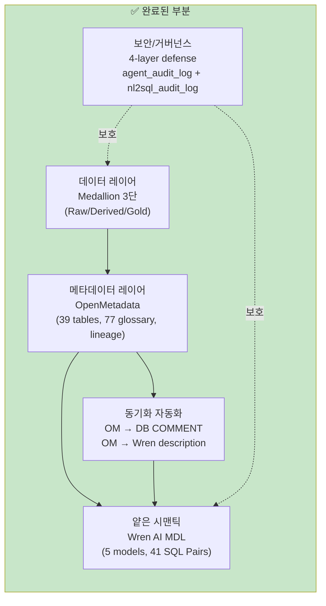
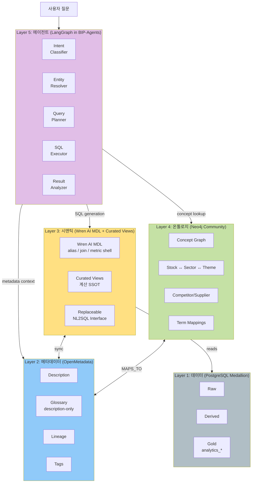
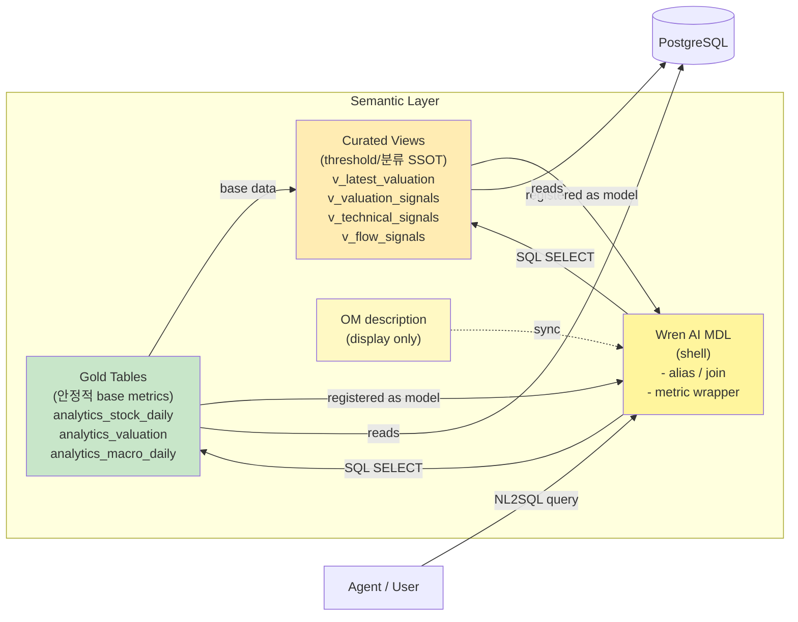
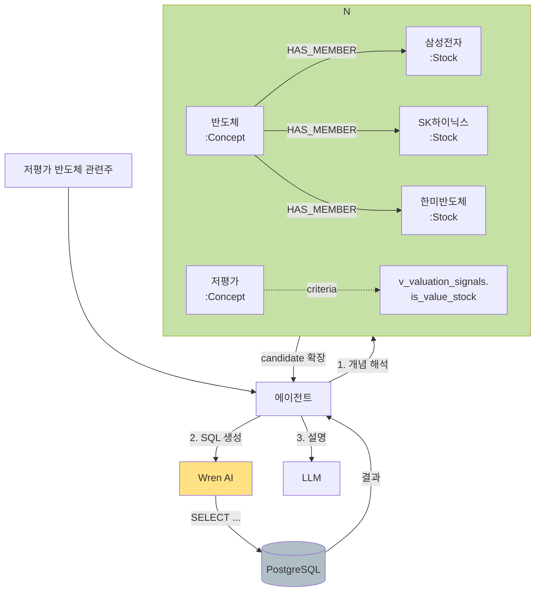
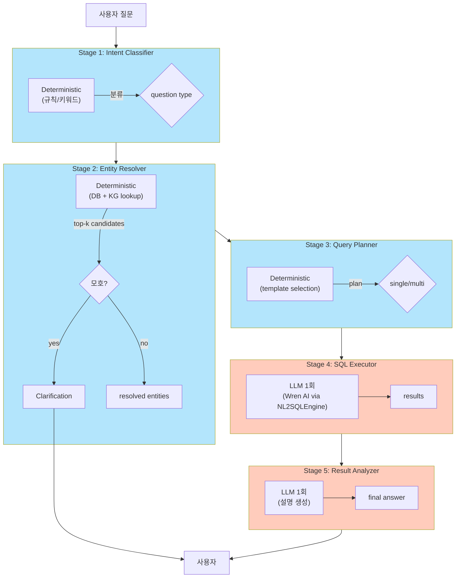
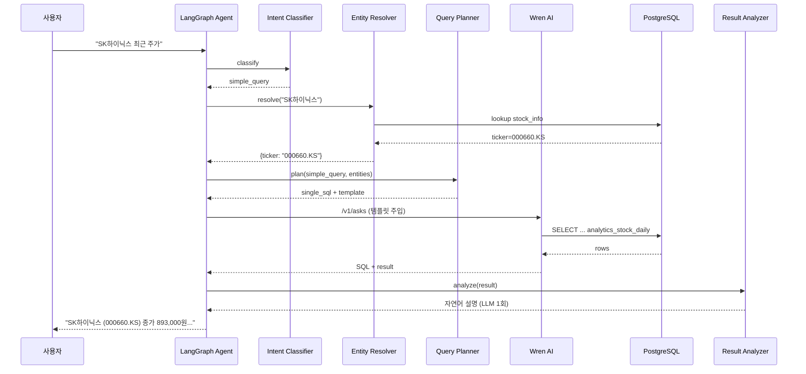
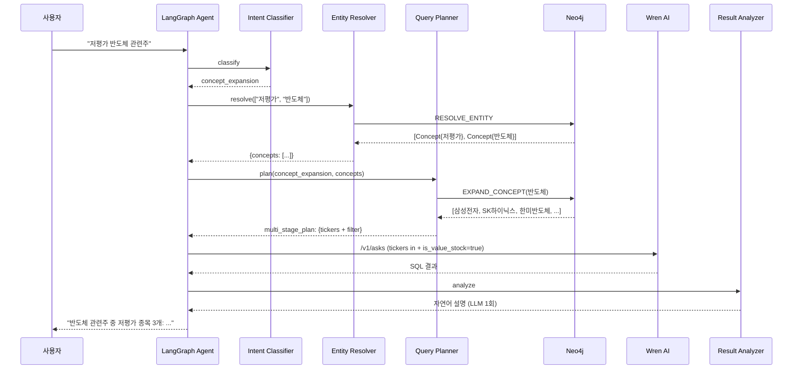
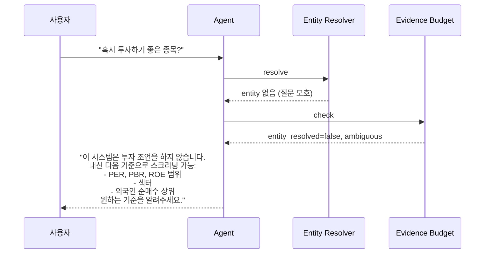

# BIP-Pipeline NL2SQL 아키텍처 v2 (Final Target)

> **작성일:** 2026-04-05
> **작성자:** Claude Code + Codex Adversarial Review (7+회 반복)
> **문서 지위:** `docs/nl2sql_project_plan.md`의 후속판. 현재까지 구현된 내용 + 최종 목표 아키텍처를 통합한 단일 소스.
> **관련 문서:**
> - `docs/data_architecture_review.md` — 데이터 아키텍처 이슈 트래커, 결정 로그
> - `docs/nl2sql_semantic_layer_guide.md` — 시맨틱 레이어/온톨로지 개념 학습 자료
> - `docs/wrenai_technical_guide.md` — Wren AI 내부 구조
> - `docs/wrenai_test_report.md` — NL2SQL 품질 테스트 프레임워크
> - `docs/security_governance.md` — 보안 불변 조건 (LLM raw 금지, nl2sql_exec, 4-layer, audit)
> - `docs/metadata_governance.md` — 메타데이터/리니지/용어 관리 절차

---

## 목차

1. [문서 목적 및 맥락](#1-문서-목적-및-맥락)
2. [현재 구현 상태 (베이스라인)](#2-현재-구현-상태-베이스라인)
3. [최종 목표 아키텍처 개요](#3-최종-목표-아키텍처-개요)
4. [레이어별 상세 설계](#4-레이어별-상세-설계)
5. [컴포넌트 책임 경계 매트릭스](#5-컴포넌트-책임-경계-매트릭스)
6. [핵심 아키텍처 원칙](#6-핵심-아키텍처-원칙)
7. [에이전트 실행 흐름](#7-에이전트-실행-흐름)
8. [보안·거버넌스 통합](#8-보안거버넌스-통합)
9. [대체재 검토 및 기각 이유](#9-대체재-검토-및-기각-이유)
10. [리스크 및 완화 방안](#10-리스크-및-완화-방안)

---

## 1. 문서 목적 및 맥락

### 1-1. 목적

BIP-Pipeline NL2SQL 시스템의 **최종 목표 아키텍처**를 단일 문서로 통합한다. 현재까지 구현된 부분(데이터 레이어, 메타데이터 카탈로그, 얕은 시맨틱 레이어)과 앞으로 추가될 부분(풍부한 시맨틱 레이어, 온톨로지, 에이전트 오케스트레이션)을 한 곳에서 본다.

### 1-2. 배경: 프로토타입 → 엔터프라이즈 이전 맥락

이 프로젝트는 개인 투자 데이터라는 **작은 규모**로 운영되지만, 본래 목적은 **사내 업무 데이터에 적용할 NL2SQL 아키텍처의 사전 검증용**이다. 따라서 솔로 개발자 관점의 "경량화/효율성"보다는 다음을 우선한다:

- 엔터프라이즈 규모로 확장 가능한 **구조적 원칙**
- 각 레이어의 **독립 검증 가능성** (A/B test, 감사, 교체)
- 복합 질문에 대한 **정확도와 제어 가능성**
- **거버넌스** (보안, 감사, 리니지)

그 결과 단일 LLM + tool use 같은 경량 MVP 대신, **5개 레이어 아키텍처 (Data → Metadata → Semantic → Ontology → Agent)**로 풀 스택을 구축한다.

### 1-3. 설계 원칙 요약 (Codex 적대적 검토 반영)

1. **deterministic-first, LLM-last** — 결정 가능한 것은 결정론 노드로, LLM은 설명·생성에만
2. **계산 SSOT 중복 금지** — 복잡 수식은 한 곳(Curated View)에만
3. **KG는 planner, SQL은 answer** — Neo4j는 개념 확장/entity 해석용, 수치 계산은 Wren AI/PostgreSQL
4. **Wren AI replaceability** — NL2SQL 엔진을 추상화 레이어 뒤에 두고 언제든 교체 가능하게
5. **Evidence budget → clarification** — 근거 부족 시 답변 대신 질문 반환
6. **Wren 위에 SQL Generator 이중화 금지** — Wren이 이미 intent/retrieval/sql/correction 수행

---

## 2. 현재 구현 상태 (베이스라인)

### 2-1. 이미 완료된 레이어



**구체 수치:**

| 레이어 | 상태 |
|---|---|
| Gold 테이블 | `analytics_stock_daily` (1,914,342행), `analytics_macro_daily` (437행), `analytics_valuation` (7,609행) |
| OpenMetadata | 39 tables, 77 glossary terms, 9 apiService, 14 apiEndpoint, 67 lineage edges |
| Wren AI | Engine 0.22.0 / AI Service 0.29.0 / UI 0.32.2 (gpt-4o-mini), 5 models, 41 SQL Pairs, 3 Instructions |
| 보안 | `nl2sql_exec` 전용 DB role, allowlist/denylist 검증, 39개 통합 테스트 PASS |
| 감사 | `agent_audit_log` + `nl2sql_audit_log` 양쪽 경로 활성, BIP-Agents checklist audit 연결 완료 |
| LangGraph | BIP-Agents에 `morning_pulse` (멀티노드), `checklist_agent` (4단계 결정론+1 LLM) 운영 중 |

### 2-2. 현재 한계 (왜 확장이 필요한가)

1. **시맨틱 레이어의 얕음**
   - Wren AI Calculated Fields는 집계 함수(SUM/AVG/COUNT/MAX/MIN/ABS)만 지원
   - 복잡한 수식 (`(target_price - close) / close * 100`, `close - ma20 / ma20 * 100`)은 컬럼 description 문자열로만 존재 → LLM이 매번 해석
   - 비즈니스 메트릭(PER, PBR, ROE)이 고정된 "규칙"이 아니라 매번 생성되는 SQL 안에 흩어짐

2. **온톨로지 부재**
   - "삼성전자 isA 반도체기업 partOf KOSPI competitor SK하이닉스" 같은 개념 관계 정의 없음
   - "저평가 반도체 관련주" 같은 개념 확장이 매번 하드코딩 되거나 LLM 추측에 의존
   - 77개 OM Glossary 용어가 개별적으로 저장되어 있지만 관계가 없음

3. **1질문 = 1SQL 구조적 한계**
   - Wren AI는 단일 SQL만 생성
   - 복합 질문 ("외국인 순매수 상위 중 RSI 과매도", "골든크로스 발생 후 1개월 수익률")은 단일 SQL로 불가
   - 멀티스텝 추론, 결과 비교, 이벤트 탐지 → 모두 에이전트 레이어 필요

4. **OM Glossary → Wren AI 자동 전파 불가**
   - Wren AI에 glossary 개념 자체가 없음
   - 현재는 description 문자열 끝에 용어 정의를 append하는 우회만 가능

5. **의미론 결손** (Codex 리뷰에서 강조)
   - `stock_metadata` 잔존 (ISS-001)
   - 일봉의 3중 timestamp 혼란 (ISS-002)
   - `market_value` 단위 불명확 (ISS-003)
   - `sector/industry` 컬럼 부재
   - 이 상태로 온톨로지를 올리면 "불완전한 의미를 정교하게 저장하는 시스템" 됨

---

## 3. 최종 목표 아키텍처 개요

### 3-1. 5-Layer 아키텍처



### 3-2. 레이어 책임 요약

| Layer | 컴포넌트 | 핵심 책임 | 구현 상태 |
|-------|---------|---------|---------|
| **1. 데이터** | PostgreSQL (Medallion) | Raw → Derived → Gold, ACID 보장, 실제 데이터 | ✅ 완료 |
| **2. 메타데이터** | OpenMetadata | 테이블/컬럼 설명, 용어집, 리니지, 태그, 거버넌스 | ✅ 완료 (역할 축소 예정) |
| **3. 시맨틱** | Wren AI MDL + Curated Views + OM description | SQL 생성 인터페이스, 계산식 고정, 관계 정의 | ⚠️ 부분 완료 (Phase 1 보강) |
| **4. 온톨로지** | Neo4j Community + YAML sidecar | 개념 관계 그래프, entity 확장, planner context | 🔲 Phase 2 |
| **5. 에이전트** | LangGraph in BIP-Agents | 질문 이해, 멀티스텝 오케스트레이션, 설명 생성 | 🔲 Phase 3 |

---

## 4. 레이어별 상세 설계

### 4-1. Layer 1: 데이터 (Medallion Architecture)

**이미 완료되었음.** 변경사항은 Phase 1A 의미론 하드닝 과정에서의 정리 정도.

```
Raw:
  stock_info, stock_price_1d, financial_statements,
  consensus_estimates, macro_indicators, news, ...

Derived:
  stock_indicators, market_daily_summary, sector_daily_performance

Gold (분석용 pre-joined):
  analytics_stock_daily    (시세 + 지표 + 컨센서스 와이드)
  analytics_macro_daily    (거시지표 피벗)
  analytics_valuation      (종목별 밸류에이션 종합)
```

**Phase 1A 변경 예정:**
- `stock_metadata` 제거 (ISS-001)
- `stock_price_1d.trade_date DATE` 컬럼 추가, timestamp 의미 명확화 (ISS-002)
- `market_value` 단위 COMMENT 명시 (ISS-003)
- `stock_info.sector`, `industry` 컬럼 추가 (ISS-004)

### 4-2. Layer 2: 메타데이터 (OpenMetadata) — 역할 축소

Codex 리뷰 핵심 지적: **OM은 "description/glossary only"로 역할 축소**. 계산식이나 runtime 의미론은 OM에 두지 않는다.

**OM의 남은 역할:**

| 역할 | 내용 |
|------|------|
| 테이블/컬럼 description | 설명 텍스트 원천 (Wren AI로 sync) |
| Glossary 용어집 | 77 terms + 추가 — 설명 원천 (runtime 쿼리엔 Neo4j 사용) |
| Lineage | API → DAG → Table → Consumer 추적 |
| Tags | DataLayer (raw/derived/gold), Domain, SourceType, SecurityLevel |
| 감사 이력 | OM 내부 changelog |

**OM에서 빼는 것:**
- 계산식 설명 (Curated View에 COMMENT로 고정)
- 단위 변환 정보 (View 컬럼명에 내장 예: `market_value_krw`)
- 분류 로직 (View boolean 컬럼에 고정)

**동기화 플로우:**
```
OM (편집/원천)
  ├→ om_sync_comments.py → PostgreSQL COMMENT
  ├→ om_sync_wrenai.py → Wren AI model description
  └→ (Phase 2) om_sync_neo4j.py → Neo4j Term nodes
```

### 4-3. Layer 3: 시맨틱 (Wren AI + Curated Views)

#### Wren AI 공식 모델링 권장 (2026-04-06 확인)

Wren AI Best Practices 문서의 **Step 0 — Data Preprocessing** 핵심:

> **Build reporting-ready tables** with pre-joined dimensions and boolean flags.
> LLMs are much more reliable with **explicit columns** (booleans, fiscal periods, status flags)
> than with **string parsing and ad-hoc logic**.

| 공식 권장 | BIP 적용 |
|----------|---------|
| Denormalized reporting tables | Gold 테이블 (analytics_*) = 이미 pre-joined |
| Pre-computed boolean flags | Curated View에 `is_value_stock` 등 추가 |
| Pre-computed metrics | Gold에 안정적 metrics, View에 threshold 분류 |
| 명시적 Relationship (2개 모델 간만) | stock_info 허브 + grain 일치 View |
| 도메인별 별도 프로젝트 | 메인 + 상세 원본(선택) |
| Multi-table JOIN 2-3개 이상 신중 | View로 pre-join하여 0-1 JOIN 유도 |

**결론:** Gold 방식이 Wren AI 공식 권장과 이미 일치. Domain 전환 불필요. **Gold 유지 + PostgreSQL Curated View 보강**이 정답.

#### 용어 정의 — "View"의 3가지 의미 (혼동 주의)

이 프로젝트에서 "View"는 세 가지 다른 것을 가리킬 수 있다. 문서에서는 반드시 접두어를 붙여 구분한다.

| 용어 | 정의 | 용도 | Relationship |
|------|------|------|:---:|
| **PostgreSQL Curated View** | `CREATE VIEW v_*` — DB의 물리적 가상 테이블. 계산 SSOT. | 시맨틱 레이어의 계산/분류 고정. Wren AI에 **Model**로 등록. | ✅ (Model이므로) |
| **Wren AI UI View** | Wren AI UI에서 "Save as View"로 저장되는 **trusted query result**. | 자주 쓰는 질문의 SQL 결과를 재사용하는 용도. 시맨틱 모델링 용도 아님. | ❌ |
| **Wren Engine MDL view** | MDL JSON의 `views` 섹션에 `statement` SQL로 정의되는 named query. | 엔진 레벨 가상 테이블. 쿼리 가능하지만 Relationship/Calculated Field 미지원. | ❌ |

**핵심 원칙:**

> **PostgreSQL Curated View는 Wren AI에 Model로 등록한다** (View 아님).
> Wren AI Views는 semantic foundation이 아닌 saved/trusted result 용도.
> Relationship은 Model 간에만 정의 가능. View에는 Relationship을 걸 수 없다.

근거: Wren AI 공식 엔진 문서 Model vs View 비교표에서 `Relationship columns: Model=Supported, View=Not supported`.

참고:
- https://docs.getwren.ai/oss/guide/modeling/models
- https://docs.getwren.ai/oss/guide/modeling/views
- https://docs.getwren.ai/oss/engine/guide/modeling/view

참고: https://docs.getwren.ai/cp/getting_started/best_practice

#### 핵심 원칙

`View = truth, MDL = alias/join/metric shell, OM = description only`

**하이브리드 전략 (Codex 검증 완료):**

| 대상 | 어디에 | 이유 |
|------|--------|------|
| `per_actual`, `net_margin`, `debt_ratio` 같은 안정적 계산값 | **Gold 직접** | grain에 자연스럽고 기준 변경 가능성 낮음 |
| `golden_cross`, `death_cross` 같은 이벤트 flag | **Gold 직접** | 계산 로직이 확정적, 변경 안 됨 |
| `is_value_stock`, `is_growth_stock` 같은 threshold 분류 | **Curated View** | 임계값이 바뀔 수 있음, 버전드 View로 유지보수 |
| `foreign_buy_amount` (= volume × close) 같은 단순 산술 | **View 권장** | 중복만 피하면 어디든 OK |



#### 4-3-1. Grain 불일치 해결 — `v_latest_valuation`

**문제:** `analytics_stock_daily` (일별 grain) ↔ `analytics_valuation` (연별 grain)을 `ticker`만으로 JOIN하면 many-to-many 크로스가 발생하여 의미적으로 틀린 SQL이 만들어짐.

**해결:** `v_latest_valuation` 뷰로 1 ticker = 1 row 스냅샷을 만들어 grain을 일치시킴:

```sql
CREATE VIEW v_latest_valuation AS
SELECT av.*
FROM analytics_valuation av
INNER JOIN (
    SELECT ticker, MAX(fiscal_year) AS max_year
    FROM analytics_valuation
    GROUP BY ticker
) latest ON av.ticker = latest.ticker AND av.fiscal_year = latest.max_year;

COMMENT ON VIEW v_latest_valuation IS
    '종목별 최신 연도 밸류에이션 스냅샷 (1 ticker = 1 row). '
    'analytics_stock_daily와 안전하게 JOIN 가능 (grain 일치).';
```

**Relationship 구조 (grain 안전):**

```
stock_info ↔ analytics_stock_daily       (ticker, Many-to-One)
stock_info ↔ v_latest_valuation          (ticker, One-to-One)  ← 🆕
stock_info ↔ stock_price_1d              (ticker, One-to-Many)
analytics_stock_daily ↔ v_latest_valuation (ticker, Many-to-One) ← 🆕
```

**⚠️ 금지:** `analytics_stock_daily ↔ analytics_valuation` 직접 Relationship — grain 불일치로 의미 오류 SQL 생성 위험.

#### 4-3-2. Curated Views — Threshold/분류 SSOT

변동 가능한 threshold 기반 boolean 분류는 **모두 View에 고정**한다. Wren AI MDL이나 OM description에 같은 로직이 있으면 **SSOT 위반 → 금지**.

```sql
-- v_valuation_signals__v1.sql
CREATE VIEW v_valuation_signals__v1 AS
SELECT
    ticker, stock_name, fiscal_year,
    per_actual, pbr_actual, roe_actual,

    -- threshold 분류 (여기에만 존재, Gold에 넣지 않음)
    (per_actual > 0 AND per_actual < 10 AND pbr_actual < 1)     AS is_value_stock,
    (per_actual > 0 AND per_actual < 10 AND roe_actual > 15)    AS is_value_growth,
    (revenue_growth > 20 AND operating_margin > 10)              AS is_growth_stock,

    -- 파생 계산
    ROUND((net_income * 100.0 / NULLIF(revenue, 0))::numeric, 2) AS net_margin_pct,
    ROUND((total_liabilities * 100.0 / NULLIF(total_equity, 0))::numeric, 2) AS debt_ratio_pct,
    market_value * 100000000 AS market_value_krw
FROM analytics_valuation;
```

```sql
-- v_technical_signals__v1.sql
CREATE VIEW v_technical_signals__v1 AS
SELECT
    ticker, trade_date, stock_name,
    close, rsi14, macd, bb_pctb, bb_lower, bb_upper,

    -- threshold 분류
    (rsi14 IS NOT NULL AND rsi14 < 30)                           AS is_oversold_rsi,
    (rsi14 IS NOT NULL AND rsi14 > 70)                           AS is_overbought_rsi,
    (close < bb_lower AND bb_lower IS NOT NULL)                  AS is_bollinger_squeeze,
    (volume_ratio > 3 AND volume_ma20 IS NOT NULL)               AS is_volume_spike,

    -- 파생 계산
    ROUND(((close - ma20) * 100.0 / NULLIF(ma20, 0))::numeric, 2) AS disparity_20d,
    close * volume AS trading_value
FROM analytics_stock_daily;
```

```sql
-- v_flow_signals__v1.sql
CREATE VIEW v_flow_signals__v1 AS
SELECT
    ticker, trade_date, stock_name,
    foreign_buy_volume, institution_buy_volume, individual_buy_volume,

    -- 금액 환산
    foreign_buy_volume * close     AS foreign_buy_amount,
    institution_buy_volume * close AS institution_buy_amount,

    -- 수급 강도
    CASE WHEN volume > 0 THEN
        ROUND((foreign_buy_volume * 100.0 / volume)::numeric, 2)
    END AS foreign_ratio_pct
FROM analytics_stock_daily;
```

**View 네이밍 규율:**
- `v_<domain>_<subject>__v<major>` 형식
- Breaking change → 새 버전 생성 (`v_valuation_signals__v2`)
- 호환 변경 → COMMENT diff로 추적
- **Gold 테이블의 안정적 metrics(per_actual, golden_cross 등)는 View로 이동하지 않음** (하이브리드)

**4-3-2. Wren AI MDL — Shell 역할**

Wren AI MDL에는 **계산식을 넣지 않는다.** 단지 다음만:
- 테이블 alias + relationships (JOIN 경로)
- 집계 메트릭 wrapper (Wren AI가 지원하는 SUM/AVG/COUNT/MAX/MIN)
- 컬럼 description (OM에서 sync, 계산식 설명은 View에 위임)
- SQL Pairs (학습용 예시)
- Instructions (도메인 규칙, 최소)

**4-3-3. Replaceable NL2SQL Interface**

Wren AI는 **교체 가능한 컴포넌트**로 설계한다. LangGraph의 tool 인터페이스는 "NL2SQL Engine"이라는 추상화로 감싸서, 내부 구현을 Wren AI → Vanna AI → 자체 Claude tool-use 등으로 교체할 수 있게 한다.

```python
# Phase 3에서 구현
class NL2SQLEngine(Protocol):
    def generate_sql(self, question: str, context: dict) -> SQLResult: ...
    def validate(self, sql: str) -> ValidationResult: ...
    def execute(self, sql: str) -> QueryResult: ...

class WrenAIEngine(NL2SQLEngine): ...  # 기본 구현
class VannaEngine(NL2SQLEngine): ...   # 향후 대체재
class ClaudeToolUseEngine(NL2SQLEngine): ...  # 엔터프라이즈 대안
```

**4-3-4. Consistency Check (자동)**

세 경로(View/MDL/OM)가 어긋나지 않도록 CI/DAG가 매일 검증:

```
- OM description 해시 vs Wren MDL description 해시 일치?
- View column 이름이 MDL에 존재?
- OM glossary term이 Wren Instruction에 반영됨?
- View의 boolean 컬럼이 SQL Pairs에 예시 존재?
```

불일치 시 DAG 실패 + Slack/Email 경보.

### 4-4. Layer 4: 온톨로지 (Neo4j Community)

**Codex 핵심 재정의:** `KG는 planner/context layer, answer는 SQL`

온톨로지는 답변을 생성하는 엔진이 아니라, 에이전트가 질문을 해석할 때 **concept 확장과 entity 해석에만** 사용한다. 실제 수치 계산은 여전히 PostgreSQL + Wren AI가 담당.



**4-4-1. 스키마 (Neo4j Node/Relationship)**

**Node Labels:**

| Label | 속성 | 용도 |
|-------|------|------|
| `Concept` | name, type, aliases, description | 추상 개념 (반도체, 저평가, 고배당) |
| `Stock` | ticker, name, market, sector | 개별 종목 |
| `Sector` | name, classification_system | 섹터 (KRX/GICS) |
| `Theme` | name, description | 투자 테마 (HBM, AI, 전기차) |
| `Term` | name, definition, om_glossary_id | OM Glossary에서 import된 용어 |
| `Table` | name, schema | DB 테이블 (Wren AI 모델 대응) |
| `Column` | name, table_name, unit, data_type | DB 컬럼 (용어 매핑 대상) |

**Relationship Types:**

| Type | 의미 | 예 |
|------|------|---|
| `IS_A` | 상위 개념 | `HBM` → `반도체` |
| `PART_OF` | 부분-전체 | `반도체 후공정` → `반도체` |
| `BELONGS_TO` | 소속 | `삼성전자` → `KOSPI` |
| `HAS_MEMBER` | 포함 | `반도체` → `삼성전자` |
| `COMPETITOR` | 경쟁 | `삼성전자` ↔ `SK하이닉스` (양방향) |
| `SUPPLIER` | 공급 | `한미반도체` → `SK하이닉스` |
| `RELATED_TO` | 관련 (약한 신호) | `환율` → `수출주` |
| `MAPS_TO` | 개념 ↔ DB 매핑 | `저평가주` → `v_valuation_signals.is_value_stock` |

**4-4-2. Edge 메타데이터 (규율)**

모든 edge는 다음 속성을 지원 (필수/선택 구분):

| 속성 | 필수? | 설명 |
|------|------|------|
| `source` | 필수 | KRX 분류, DART 보고서, 수동 등 |
| `as_of_date` | 필수 | 관계가 유효한 시점 |
| `confidence` | 자동 추출 엣지만 | 0.0~1.0 |
| `manual_reviewed` | 논쟁/고임팩트 엣지만 | boolean |
| `valid_from` / `valid_to` | 변하는 관계만 (COMPETITOR, SUPPLIER) | 시간 범위 |

Codex 권고: **전 관계에 강제하지 말 것. 강제하면 authoring 포기 발생.**

**4-4-3. 저장소 구조**

```
ontology/
├── concepts/
│   ├── sectors/semiconductor.yaml
│   ├── themes/hbm.yaml
│   └── styles/value_stock.yaml
├── stocks/
│   └── kr/samsung_electronics.yaml
├── relationships/
│   ├── competitor_edges.yaml
│   └── supplier_edges.yaml
└── schema.yaml                     # 노드/관계 스키마 정의 (validator용)

ontology_notes/                     # 선택적 개념 노트 (사람 생각정리용)
└── *.md                            # sync 대상 아님
```

**Sync 방향:** `YAML → Neo4j` (단방향, Git이 authoring source of truth)

**4-4-4. Cypher 생성 전략**

Codex 핵심 권고: `free-form Cypher generation 지양 → template + slot fill`

LLM이 Cypher를 자유 생성하면 신뢰도 낮음. 대신:

```python
# Phase 3 구현 예
class CypherTemplates:
    EXPAND_CONCEPT = """
    MATCH (c:Concept {name: $concept_name})
    OPTIONAL MATCH (c)<-[:IS_A|PART_OF*1..3]-(sub:Concept)
    MATCH (sub|c)-[:HAS_MEMBER]->(s:Stock)
    RETURN DISTINCT s.ticker, s.name
    """

    FIND_COMPETITORS = """
    MATCH (s:Stock {ticker: $ticker})-[:COMPETITOR]-(c:Stock)
    RETURN c.ticker, c.name
    """

    RESOLVE_ENTITY = """
    MATCH (n) WHERE n.name = $name OR $name IN n.aliases
    RETURN labels(n), n.name, n.ticker
    LIMIT 5
    """
```

에이전트는 자연어 질문 → 템플릿 선택 → 슬롯 채우기. 자유 Cypher는 비상용.

**4-4-5. 도메인 지식 수집 전략 (Codex 권고)**

| 순위 | 출처 | 신뢰도 | 용도 |
|---|---|---|---|
| 1 | KRX 업종 분류, DART 사업보고서 (주요 종속회사/매출처/원재료) | 높음 | `HAS_MEMBER`, `SUPPLIER`, `BELONGS_TO` |
| 2 | WiseReport/FnGuide 경쟁사 비교표 | 중간 | `COMPETITOR` |
| 3 | 네이버 금융 테마주 | 약한 신호 | `RELATED_TO` (confidence < 0.7) |

**절대 원칙:** 모든 edge에 `source`와 `as_of_date` 기록. 나중에 신뢰도 재평가 가능.

### 4-5. Layer 5: 에이전트 (LangGraph in BIP-Agents)

Codex 핵심 재정의: `5단계 개념 분리 유지, LLM 호출은 2회로 제한, deterministic-first 패턴`

**4-5-1. 5단계 구조 (개념적)**



**핵심:** 5단계 **개념 분리는 유지**하되, **Stage 4, 5만 LLM 호출**. Stage 1-3은 결정론 (규칙 기반).

**4-5-2. 각 Stage 상세**

| Stage | 구현 | 실패 시 |
|-------|------|---------|
| **1. Intent Classifier** | 정규식/키워드 기반 분류기. `simple_query`, `comparison`, `concept_expansion`, `time_series`, `unknown` | `unknown` → Stage 5로 직행하여 LLM이 자연어 응답 |
| **2. Entity Resolver** | `삼성` → `삼성전자` (시총 1위 자동 선택). DB 직접 lookup + Neo4j `RESOLVE_ENTITY` 템플릿 | 모호 시 top-k 후보 + clarification 반환 |
| **3. Query Planner** | 질문 유형 + 해석된 엔티티 기반으로 `single_sql` / `multi_sql_compare` / `kg_expand_then_sql` 라우팅 | 라우팅 실패 시 `single_sql` 기본 |
| **4. SQL Executor** | NL2SQLEngine (기본 Wren AI) 호출. multi_sql이면 N회. | SQL 검증 실패 2회 → Stage 5로 에스컬레이트 |
| **5. Result Analyzer** | LLM 1회 호출로 결과를 자연어로 설명. Evidence budget 체크. | 근거 부족 → clarification 반환 |

**4-5-3. Evidence Budget (Codex 권고)**

"모른다"를 말하도록 강제하는 메커니즘:

```python
class EvidenceBudget:
    entity_resolved: bool
    sql_success_count: int
    result_row_count: int
    kg_support_found: bool
    om_glossary_match: bool

    def is_sufficient(self) -> bool:
        return (
            self.entity_resolved
            and self.sql_success_count >= 1
            and self.result_row_count > 0
            and (self.kg_support_found or self.om_glossary_match)
        )

    def missing_evidence(self) -> list[str]:
        # 부족한 항목 반환 → clarification 질문 생성용
```

근거 부족 시 에이전트는 답변 대신 "왜 답변할 수 없는지" + "사용자가 제공할 수 있는 추가 정보"를 요청.

**4-5-4. 에이전트 배포 위치**

**BIP-Agents 레포에 통합**. 별도 서비스 신설 X.

```
BIP-Agents/langgraph/
├── morning_pulse/     # 기존 모닝 브리핑
├── checklist/         # 기존 체크리스트 에이전트 (4단계)
└── nl2sql/            # 신규 NL2SQL 에이전트 (5단계)
    ├── intent_classifier.py
    ├── entity_resolver.py
    ├── query_planner.py
    ├── sql_executor.py
    ├── result_analyzer.py
    ├── evidence_budget.py
    ├── graph.py       # LangGraph StateGraph 정의
    └── api.py         # FastAPI 엔드포인트
```

**이점:**
- 기존 감사 경로 (`record_agent_audit()`) 재사용
- LangGraph 운영 인프라 재사용
- MCP tool 인프라 공유

### 4-6. 투자 판단 경계 (Codex 경고)

Codex가 특별히 강조한 점: **"추천: 지금 투자하기 좋은 종목"은 질의응답이 아니라 투자판단 엔진**이다. 이 경계를 명확히 한다.

| 단계 | 허용 | 금지 |
|------|------|------|
| Fact Retrieval | 데이터 조회 | — |
| Scoring | 규칙/점수 기반 순위 | LLM의 주관 판단 |
| Narrative | 결과의 자연어 설명 | 투자 조언/추천 |

에이전트는 `factual retrieval → rule-based scoring → narrative explanation`만 수행. "추천" 요청 시에는 **"이 시스템은 투자 조언을 하지 않습니다"** 고지 + 사용자가 지정한 기준으로 스크리닝 결과만 반환.

---

## 5. 컴포넌트 책임 경계 매트릭스

| 책임 | PostgreSQL | OpenMetadata | Wren AI | Curated Views | Neo4j | LangGraph |
|------|:---:|:---:|:---:|:---:|:---:|:---:|
| 실제 데이터 저장 | ✅ | — | — | — | — | — |
| 테이블 스키마 | ✅ | — | — | — | — | — |
| 계산식/boolean 분류 | — | — | — | ✅ SSOT | — | — |
| 단위 변환 | — | — | — | ✅ | — | — |
| 테이블/컬럼 description | — | ✅ 원천 | 동기화 | — | — | — |
| 비즈니스 용어집 | — | ✅ 원천 (description only) | — | — | ✅ (runtime) | — |
| Lineage | — | ✅ | — | — | — | — |
| 관계 정의 (JOIN) | ✅ (FK) | — | ✅ (MDL) | — | — | — |
| 개념 관계 (IS_A, COMPETITOR) | — | — | — | — | ✅ | — |
| Entity 해석 (삼성→삼성전자) | — | — | — | — | ✅ lookup | ✅ orchestration |
| 개념 확장 (반도체 관련주) | — | — | — | — | ✅ | — |
| NL → SQL 변환 | — | — | ✅ | — | — | — |
| SQL 검증 (4-layer) | ✅ (role) | — | — | ✅ (allowlist) | — | ✅ (validator) |
| 멀티 SQL 오케스트레이션 | — | — | — | — | — | ✅ |
| 결과 자연어 설명 | — | — | — | — | — | ✅ (LLM) |
| 감사 기록 | ✅ (write) | — | — | — | — | ✅ (write) |
| 보안 정책 (민감 테이블) | ✅ (GRANT) | ✅ (tag) | ✅ (allowlist) | — | — | ✅ (filter) |

---

## 6. 핵심 아키텍처 원칙

### 원칙 1: Deterministic-First, LLM-Last
**정의:** 규칙/결정론으로 해결할 수 있는 것은 LLM에 맡기지 않는다.
**적용:** 에이전트 5단계 중 1-3단계는 deterministic, 4-5단계만 LLM. 체크리스트 에이전트의 성공 패턴(`parser/collector/signal/explainer` 중 explainer만 LLM)과 동일.

### 원칙 2: 계산 SSOT 중복 금지
**정의:** 한 계산식은 한 곳에만 존재한다.
**적용:** 복잡 수식은 Curated View에만. Wren AI MDL이나 OM description에 같은 수식이 있으면 consistency check DAG가 실패 발생.

### 원칙 3: KG는 Planner, SQL은 Answer
**정의:** Neo4j는 질문 해석(entity 해석, 개념 확장)용, 수치 계산은 PostgreSQL/Wren AI.
**적용:** "저평가 반도체 관련주" → Neo4j가 "반도체" 확장 → 후보 ticker 리스트 → Wren AI가 `v_valuation_signals.is_value_stock` 필터링.

### 원칙 4: Wren AI Replaceability
**정의:** NL2SQL 엔진은 교체 가능한 컴포넌트로 추상화.
**적용:** `NL2SQLEngine` Protocol 뒤에 감싸서 Wren AI → Vanna AI → Claude tool-use 등으로 교체 가능. 엔터프라이즈 이관 시 리스크 최소화.

### 원칙 5: Evidence Budget → Clarification
**정의:** 근거 부족 시 답변 대신 질문 반환.
**적용:** entity resolved? sql success? result row > 0? KG/OM 근거? → 하나라도 부족하면 "모른다" + 명확화 요청.

### 원칙 6: Wren AI 위에 SQL Generator 이중화 금지
**정의:** Wren AI가 이미 intent/retrieval/sql/correction을 수행하므로 그 위에 또 LLM SQL 생성 단계를 두지 않는다.
**적용:** 에이전트의 Stage 4는 Wren AI 호출로 위임. 직접 SQL은 fallback만.

### 원칙 7: 감사 Fail-Closed
**정의:** 감사 기록 실패 시 실행 결과를 반환하지 않는다.
**적용:** `execute_safe_sql`이 `audit_persisted=False`면 status=error. 이미 39개 통합 테스트로 검증됨.

---

## 7. 에이전트 실행 흐름

### 7-1. 예시 1: "SK하이닉스 최근 주가"



**LLM 호출: 1회 (Result Analyzer만)**

### 7-2. 예시 2: "저평가 반도체 관련주"



**LLM 호출: 1회 (Result Analyzer만). Neo4j가 concept 확장 담당.**

### 7-3. 예시 3: 근거 부족 (Evidence Budget 작동)



**LLM 호출: 0회. 결정론적 거부.**

---

## 8. 보안·거버넌스 통합

### 8-1. 기존 4-Layer 방어 (완료)

상세: `docs/security_governance.md`

```
Layer 1 (문법/패턴): SELECT-only, DDL/DML 금지, 위험 패턴 차단
Layer 2 (Allowlist): sqlglot AST 파싱 → 허용 테이블만
Layer 3 (DB Role): nl2sql_exec 계정, 민감 테이블 GRANT 없음
Layer 4 (Curated Views): Phase 1A에서 Gold/View만으로 allowlist 축소
```

### 8-2. 신규 레이어별 보안 요구사항

**Neo4j 보안:**
- `nl2sql_read_only` Neo4j user (Bolt 3.0 Auth)
- 민감 개념(portfolio, user) 노드는 Neo4j에 생성 금지
- Cypher 템플릿 외 자유 쿼리 차단

**LangGraph 보안:**
- 에이전트 tool 호출은 전부 `agent_audit_log`에 기록
- Evidence Budget 거부 이벤트도 감사 기록
- 감사 실패 시 결과 반환 금지 (fail-closed)

### 8-3. 감사 기록 범위

```
agent_audit_log:
  - Stage 1 (Intent): classification 결과
  - Stage 2 (Entity): resolved entities, ambiguity flag
  - Stage 3 (Planner): selected template/route
  - Stage 4 (SQL): generated SQL, Wren AI response
  - Stage 5 (Analyzer): final answer summary (raw 데이터 제외)

nl2sql_audit_log:
  - Wren AI 호출 원본 (SQL, validation, execution)
```

---

## 9. 대체재 검토 및 기각 이유

Codex 2회 리뷰에서 확인된 대체재 검토 결과.

### 9-1. 시맨틱 레이어 대체재

| 대체재 | 기각 이유 |
|--------|---------|
| **dbt Semantic Layer** | metrics 중심이라 NL2SQL용 ad hoc column semantics에 과도 |
| **Cube.js** | 별도 semantic serving 제품 운영 부담, 스프롤 |
| **Python dataclass 기반 자체 메트릭** | Wren AI 대체 시 자체 NL2SQL 플랫폼 구축하는 셈 |

**선택:** Wren AI MDL + PostgreSQL Curated View 조합 (Codex 권장)

### 9-2. 온톨로지/그래프 스토어 대체재

| 대체재 | 기각 이유 |
|--------|---------|
| **Apache AGE (PG extension)** | 성숙도 부족, 버전 호환 이슈 이력 |
| **Memgraph** | 생태계 작음 (Neo4j의 1/10), 솔로 개발자에게 해결책 검색 어려움 |
| **ArangoDB** | 문서+그래프 통합이 꼭 필요할 때만. AQL 비표준 |
| **PostgreSQL recursive CTE** | 재작업 낭비 (사용자 명시적 거부). 수십만 노드 한계 |
| **Protégé / WebProtégé** | 학술적, 솔로 프로젝트에 과도 |

**선택:** Neo4j Community Edition (Codex 기본값 권장, 엔터프라이즈 이전 시 유효)

### 9-3. 온톨로지 Authoring UI 대체재

| 대체재 | 기각 이유 |
|--------|---------|
| **Obsidian (주 도구로)** | 양방향 링크가 typed edge와 1:1 대응 X, 산업 온톨로지 authoring 주류 사례 없음 |
| **Obsidian (보조)** | 가능하지만 도구 수 증가 부담. 가치 < 비용 |
| **Notion** | DB 구조가 그래프 semantic 부족 |

**선택:** YAML in Git + Neo4j Browser (Codex 권장, 옵션 D: `YAML primary + MD sidecar` 가능)

### 9-4. 에이전트 프레임워크 대체재

| 대체재 | 기각 이유 |
|--------|---------|
| **단일 Claude Sonnet + tool use** | 엔터프라이즈 감사/A-B test/독립 검증 어려움 (솔로 MVP엔 OK) |
| **CrewAI / AutoGen** | LangGraph 대비 생태계 작음, 감사 통합 어려움 |
| **자체 state machine** | 재발명 |

**선택:** LangGraph (BIP-Agents에 이미 있음, 감사 인프라 재사용)

---

## 10. 리스크 및 완화 방안

### 10-1. 기술적 리스크

| 리스크 | 가능성 | 영향 | 완화 |
|--------|:---:|:---:|------|
| Wren AI가 복잡한 Cypher 호환 쿼리 생성 불가 | 높음 | 중 | NL2SQLEngine 추상화로 교체 가능. Cypher는 템플릿 생성 |
| Neo4j Text2Cypher 신뢰도 부족 | 높음 | 중 | Free-form 금지, 템플릿+slot fill, guardrail |
| Curated View와 Wren MDL 계산식 중복 | 중 | 높음 | CI consistency check DAG 필수 |
| 온톨로지 authoring 부담으로 데이터 입력 포기 | 높음 | 높음 | `source/as_of_date`만 필수, 나머지 optional |
| LangGraph 5단계 LLM 호출 폭발 | 중 | 중 | Stage 1-3 결정론 강제, LLM은 4-5만 |
| 의미론 결손 잔존 시 에이전트 오답 | 매우 높음 | 매우 높음 | **Phase 1A에서 먼저 해결** |

### 10-2. 운영적 리스크

| 리스크 | 완화 |
|--------|------|
| 솔로 개발자가 3개 시맨틱 경로 유지 어려움 | Consistency check DAG + 자동 sync DAG |
| Neo4j 컨테이너 운영 부담 | Community Edition, offline dump/load, 기존 Docker Compose 재사용 |
| 엔터프라이즈 이관 시 LLM 비용 폭증 | Phase 4에서 비용 모니터링 대시보드, prompt caching |
| 민감 테이블 노출 사고 | 이미 구축된 4-layer 방어 + 감사, Phase별 검증 유지 |

### 10-3. 거버넌스 리스크

| 리스크 | 완화 |
|--------|------|
| 추천 질문이 투자 조언으로 오해 | "투자 조언 아님" 고지 + rule-based scoring만 |
| 온톨로지 오류가 복제 (경쟁사 잘못 지정) | `manual_reviewed` flag + 주기 검토 |
| 에이전트 감사 누락 | Fail-closed 원칙, 감사 실패 시 결과 반환 금지 |

---

## 부록 A: 컴포넌트 버전 (2026-04-05 기준)

```
PostgreSQL:           15 (pgvector/pgvector:pg15)
OpenMetadata Server:  1.12.3
Airflow:              2.9.2
Wren AI Engine:       0.22.0
Wren AI Service:      0.29.0
Wren AI UI:           0.32.2
Qdrant:               v1.11.0
Ibis Server:          0.22.0
Neo4j:                5.15-community (Phase 2 예정)
Python:               3.12
LangGraph:            최신 (BIP-Agents 레포)
```

## 부록 B: 결정 로그 요약

| 날짜 | 결정 | 근거 |
|------|------|------|
| 2026-04-05 | 5-Layer 아키텍처 확정 | Codex 적대적 리뷰 7회 반복 결과 |
| 2026-04-05 | Wren AI replaceable | 엔터프라이즈 이관 리스크 |
| 2026-04-05 | Neo4j Community 바로 도입 (PG CTE 우회 X) | 재작업 낭비 회피 |
| 2026-04-05 | Obsidian 주 도구 X (YAML primary) | 양방향 링크 ≠ typed edge |
| 2026-04-05 | 5단계 에이전트 개념 분리 + LLM 2회 제한 | Codex "deterministic-first, LLM-last" |
| 2026-04-05 | Wren 위 SQL Generator 중복 금지 | Codex 이중화 지적 |
| 2026-04-05 | Curated View = 계산 SSOT | Codex 원칙 |
| 2026-04-05 | Evidence Budget → clarification | Codex 권고 |

---

*이 문서는 BIP-Pipeline NL2SQL 시스템의 최종 목표 아키텍처를 정의하는 단일 소스입니다. 설계 원칙과 레이어 경계가 변경되면 이 문서를 먼저 업데이트한 후 구현에 반영합니다. Phase별 실행 계획은 `docs/nl2sql_roadmap_v2.md`를 참조하세요.*
