# NL2SQL 개념 및 용어 레퍼런스

> **목적:** NL2SQL과 데이터 레이어 분야의 핵심 개념을 벤더 중립적·교육적으로 정리한 레퍼런스 문서
>
> **독자:** 팀 전체, 신규 합류자, 외부 협업자
>
> **범위:** 학술/산업 표준 개념 정리. BIP 구현 세부사항은 별도 문서 참조
>
> **작성일:** 2026-04-12

---

## 1. 개요

NL2SQL과 데이터 레이어 분야는 용어가 **업계/학계/벤더마다 다르게 쓰이고** 있다. 같은 단어가 다른 의미로 사용되기도 한다. 이 문서는 정식으로 통용되는 정의를 정리해 팀 내 혼동을 방지하고, NL2SQL 시스템 설계에 필요한 핵심 개념을 한곳에 모은다.

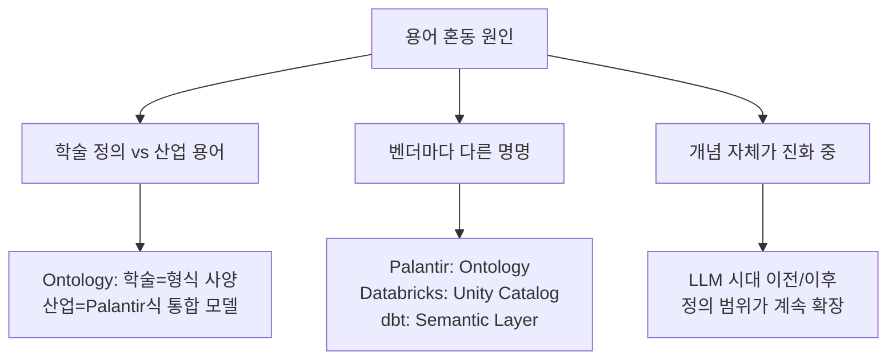

---

## 2. NL2SQL이란

**NL2SQL(Natural Language to SQL)**은 자연어 질문을 SQL 쿼리로 변환하는 기술이다. Text-to-SQL과 동의어이며, 2023년 이후 LLM 기반 구현이 실용적 수준에 도달했다.

### 2-1. Text-to-SQL의 현실: 학술 85-93% vs 실무 20-50%

| 환경 | 정확도 |
|------|--------|
| 학술 벤치마크 (Spider, WikiSQL) | 85~93% |
| 실제 기업 환경 | **20~50%** |
| 도메인 특화 데이터 (금융, 의료 등) | 더 낮음 |

학술 벤치마크는 단순하고 정리된 스키마를 사용한다. 실제 환경은 전혀 다르다.

### 2-2. 왜 틀리는가

**단위 혼동:** DB에 `market_value`가 억원 단위로 저장되어 있는데, LLM이 원 단위로 해석하여 `WHERE market_value >= 1000000000000`을 생성한다.

**용어 모호성:** "투자의견 좋은 종목"에서 rating이 1~5 중 높은 것이 좋은지 LLM이 모른다.

**올바른 실행, 틀린 결과:** SQL 문법은 정상이지만 단위 불일치로 계산 결과가 잘못되는 경우. SQL이 실행된다고 결과가 맞는 것은 아니다.

**도메인 특화 규칙:** 재무제표 유형 구분(BS/IS/CF), 티커 포맷(005930 vs 005930.KS), 시장별 거래 시간 등 도메인 고유 규칙을 LLM이 알지 못한다.

### 2-3. 품질 결정 요인

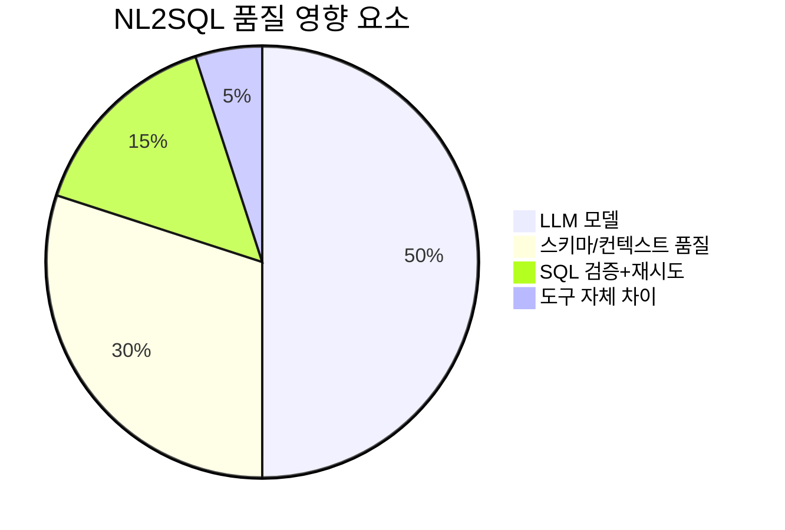

도구 자체보다 **LLM과 컨텍스트가 품질을 결정**한다. BIRD 벤치마크 참고:

| 접근법 | 정확도 | 비고 |
|-------|:-:|------|
| GPT-4 + CoT | ~65% | 프롬프트만 최적화 |
| DAIL-SQL (Few-shot 최적화) | ~70% | 예시 선택 전략 |
| DIN-SQL (분해 전략) | ~72% | 질문 서브태스크 분해 |
| SQLCoder (fine-tuned) | ~68% | 전용 모델 |
| MAC-SQL (멀티 에이전트) | ~75% | 에이전트 협업 |

---

## 3. 핵심 용어 정의

### 3-1. Semantic Layer (시맨틱 레이어)

**Gartner IT Glossary:**
> "A business representation of corporate data that helps end users access data autonomously using common business terms."

원본 데이터 위에 **비즈니스 의미를 부여한 추상화 층**이다. Metric, Dimension, Entity, Relationship을 중앙에서 정의하고, 여러 도구(BI, API, 노트북)가 동일한 정의를 재사용한다. 전통적으로 **정형 데이터(SQL DB)에 한정**된다.

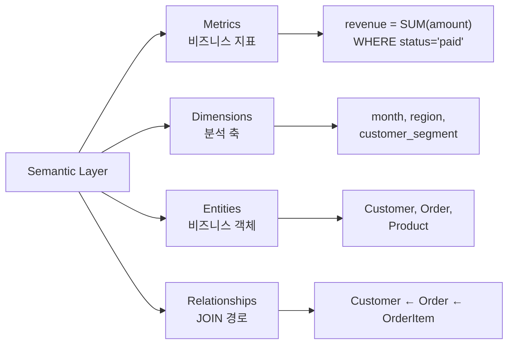

**구성 요소:**

| 구성요소 | 설명 | 예시 |
|----------|------|------|
| **메트릭(Metric)** | 계산 로직이 있는 비즈니스 지표 | PER = 시총 / 순이익 |
| **디멘션(Dimension)** | 분류/필터 기준 | 시장, 섹터, 대형주 여부 |
| **관계(Relationship)** | 테이블 간 JOIN 조건 | ticker 기반 조인 |
| **필터(Filter)** | 자주 쓰는 조건 | 활성 종목 = is_active = TRUE |
| **단위(Unit)** | 값의 단위 정의 | market_value: 억원 |

**대표 도구:** dbt Semantic Layer (MetricFlow), Cube.dev, AtScale, LookML (Looker)

**표준:** 없음 (벤더마다 YAML 스키마 다름)

---

### 3-2. Knowledge Graph (지식그래프)

**Hogan et al. (2021), ACM Computing Surveys:**
> "A knowledge graph is a graph of data intended to accumulate and convey knowledge of the real world, whose nodes represent entities of interest and whose edges represent relations between these entities."

**Google (2012):**
> "A network of real-world entities and the relationships between them."

엔티티(노드) + 관계(엣지)로 구성된 **그래프 구조**로, 정형/비정형 구분 없이 통합 가능하며 **추론(inference)**이 가능하다.

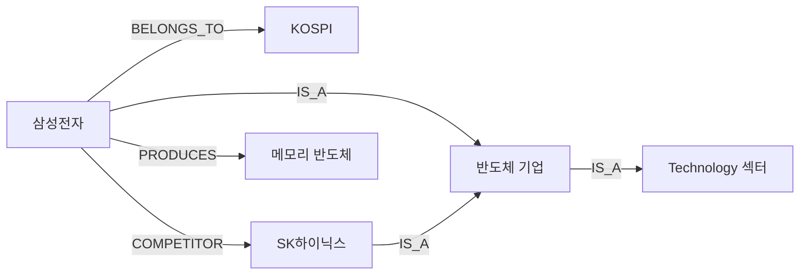

**표준:** W3C RDF (데이터 모델), W3C SPARQL (쿼리 언어), Property Graph / Cypher (Neo4j)

**대표 구현:** Google Knowledge Graph, Wikidata, Neo4j, Amazon Neptune

---

### 3-3. Ontology (온톨로지)

**Gruber (1993):**
> "An explicit specification of a conceptualization."

**Studer et al. (1998):**
> "A formal, explicit specification of a shared conceptualization."

도메인의 개념, 속성, 관계, 제약조건의 **형식적 정의**이다. Knowledge Graph의 **스키마** 역할을 한다.

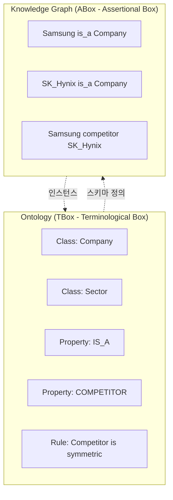

**학술적 구분:**
- **Ontology = TBox (스키마):** "Company는 Organization의 하위 개념"
- **Knowledge Graph = Ontology + ABox (데이터):** "Samsung은 Company이다"

**표준:** W3C OWL (Web Ontology Language), W3C RDFS, W3C SKOS

---

### 3-4. Data Fabric (데이터 패브릭)

**Gartner (2019):**
> "A design concept that serves as an integrated layer of data and connecting processes. It utilizes continuous analytics over existing, discoverable and inferenced metadata assets to support the design, deployment and utilization of integrated and reusable data across all environments."

**아키텍처 패턴**이지 구체 제품이 아니다. 메타데이터 기반 이기종 데이터 통합을 지향하며, Active metadata + AI/ML 기반 자동화를 강조한다.

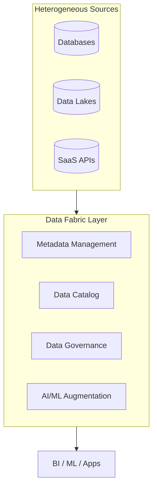

**대표 벤더:** IBM Cloud Pak for Data, Informatica, Talend, Denodo

---

### 3-5. Data Mesh (데이터 메시)

**Dehghani (2019):**
> "A sociotechnical approach to building a decentralized data architecture by leveraging a domain-oriented, self-serve design."

중앙 레이어가 **아니라** 분산 모델이다. 조직 설계 + 데이터 아키텍처의 결합이며, 기술 스택이 아니라 **원칙**이다.

**4가지 원칙:**
1. **Domain-oriented ownership:** 도메인 팀이 자기 데이터를 책임
2. **Data as a product:** 데이터를 프로덕트처럼 취급
3. **Self-serve data platform:** 도메인 팀이 독립적으로 운영
4. **Federated computational governance:** 분산된 거버넌스

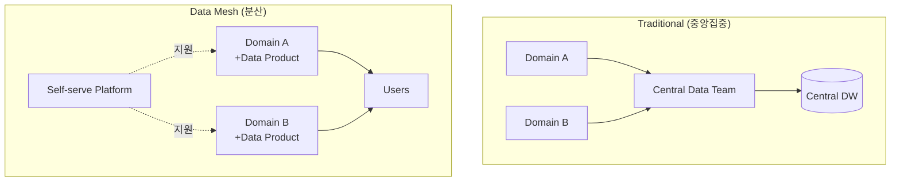

---

### 3-6. KG vs Ontology vs Semantic Layer 관계

세 개념은 서로 다른 층위에 있다.

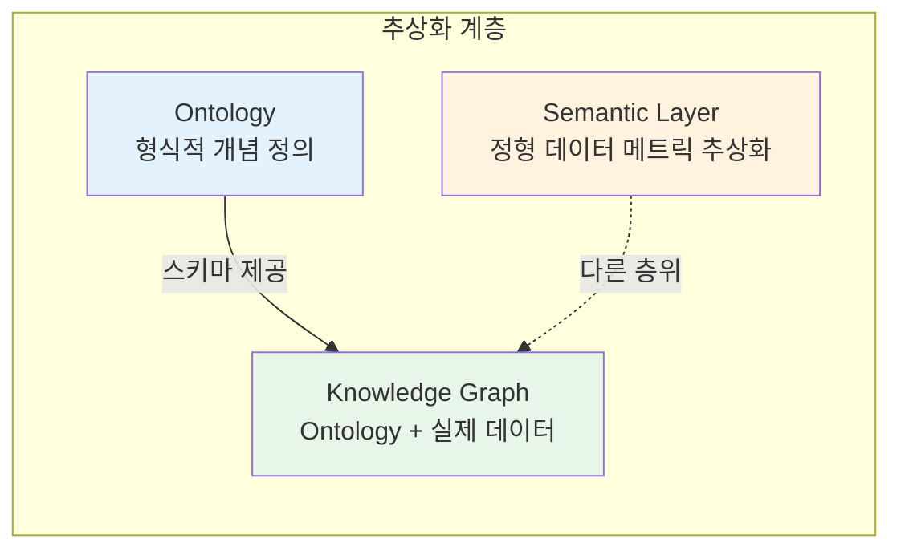

| 구분 | Semantic Layer | Knowledge Graph | Ontology |
|------|:-:|:-:|:-:|
| **주 대상** | 정형 DB | 정형+비정형+관계 | 개념 정의 (스키마) |
| **데이터 포함** | 정의만 | 인스턴스 포함 | 스키마만 |
| **추론 기능** | 없음 | 제한적 | 형식적 |
| **쿼리 언어** | SQL (내부) | SPARQL / Cypher | SPARQL (OWL) |
| **표준** | 없음 | W3C RDF | W3C OWL |
| **대표 도구** | dbt, Cube.dev | Neo4j, Neptune | Protege, TopBraid |
| **전형적 질문** | "월 매출 얼마?" | "삼성 경쟁사는?" | "Company란 무엇인가?" |

---

## 4. Medallion Architecture (Bronze - Silver - Gold)

데이터 레이크하우스에서 널리 사용되는 **3계층 데이터 아키텍처**이다.

```
Bronze  →  Silver  →  Gold
(원본)     (정제)     (서빙)
```

| 레이어 | 역할 | 특징 |
|--------|------|------|
| **Bronze** | 원본 데이터 그대로 저장 | 수집한 raw 데이터. 변환 없음 |
| **Silver** | 정제/정규화된 데이터 | 중복 제거, 단위 통일, 파생 컬럼 계산 |
| **Gold** | 분석 목적에 최적화 | 여러 테이블을 미리 JOIN. 비즈니스 질문에 즉답 가능 |

**Gold 레이어의 NL2SQL 이점:** 복잡한 다중 JOIN을 사전 처리하여 LLM이 단순한 WHERE/집계만 생성하면 되도록 한다. 이는 NL2SQL 정확도를 크게 높이는 핵심 전략이다.

---

## 5. NL2SQL 엔진 비교

### 5-1. 3가지 아키텍처 패턴

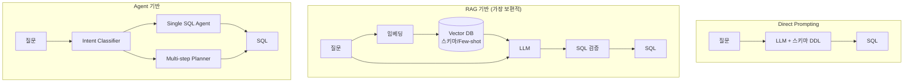

### 5-2. 도구 비교

| 도구 | 방식 | 셀프호스팅 | 관리 UI | SQL 검증 | 시맨틱 레이어 |
|------|------|:-:|:-:|:-:|:-:|
| **Wren AI** | RAG + LLM + Engine 검증 | O | O | O (3회 재시도) | MDL (경량) |
| **Vanna AI** | RAG + LLM (Python 라이브러리) | O | X | X | X |
| **Defog AI** | Fine-tuned 모델(SQLCoder) + RAG | O | O | O | X |
| **DataHerald** | RAG + LLM + 검증 (API 서버) | O | O | O | X |
| **LangChain SQL Agent** | 프레임워크 | O | X | 직접 구현 | 직접 구현 |
| **LlamaIndex NL2SQL** | 프레임워크 | O | X | 직접 구현 | 직접 구현 |

### 5-3. 도구 유형 분류

| 유형 | 도구 | 특징 |
|------|------|------|
| 라이브러리 (코드 통합용) | Vanna.ai, LangChain, LlamaIndex | 직접 import해서 사용 |
| 완성형 앱 (설치형 UI) | Wren AI, Chat2DB, DB-GPT | Docker 설치, 브라우저로 사용 |
| 클라우드 서비스 (관리형) | Snowflake Cortex, BigQuery Gemini | 클라우드 종속, 별도 설치 불필요 |

---

## 6. 시맨틱 레이어 도구 비교

### 6-1. dbt Core vs Cube.js

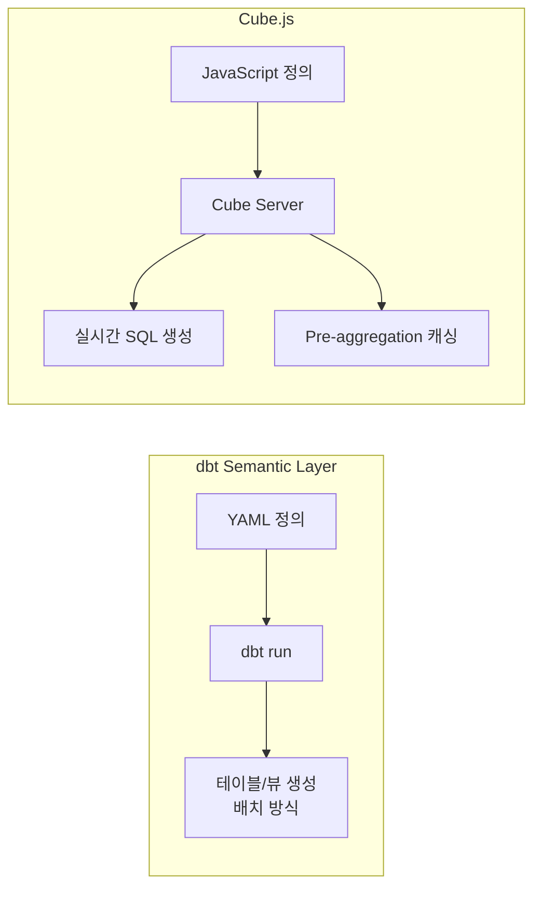

| | dbt Core | Cube.js |
|--|---------|---------|
| **정의 방식** | YAML | JavaScript/YAML |
| **실행 방식** | 배치 (SQL 변환) | 실시간 API |
| **산출물** | 테이블/뷰 | REST/GraphQL API |
| **캐싱** | 없음 | pre-aggregation |
| **적합 상황** | ETL 중심 | API 서빙 중심 |

### 6-2. 엔터프라이즈 시맨틱 레이어

| 플랫폼 | 시맨틱 레이어 | 특징 |
|--------|------------|------|
| **Palantir Foundry** | Ontology | Object + 관계 + 액션. 비정형 포함 가장 포괄적 |
| **Databricks** | Unity Catalog + AI/BI | Delta Lake 통합, AI 중심 |
| **Snowflake** | Semantic Views (2024~) | SQL 네이티브 |
| **Google BigQuery** | LookML (Looker) | Google Cloud 종속 |
| **Microsoft Fabric** | OneLake + Semantic Model | Office 생태계 통합 |

**Palantir Foundry** 구조:

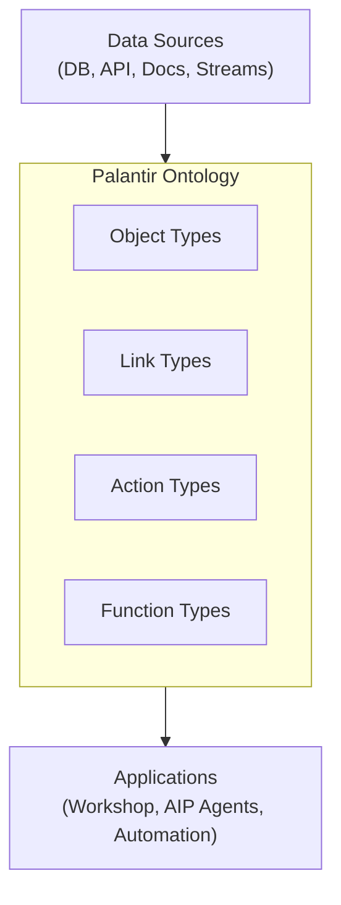

모든 데이터를 Object로 추상화하고, Action이 핵심 차별점이다 (쿼리 + 실행). AIP(AI Platform)는 Ontology 위에서 LLM 에이전트가 동작한다.

**Databricks** 구조: Delta Lake가 정형/반정형/비정형 통합 저장, Unity Catalog가 메타데이터 + 거버넌스, AI/BI Genie가 NL2SQL + 시각화를 담당한다.

---

## 7. 비정형 데이터 통합 전략

### 3가지 접근법

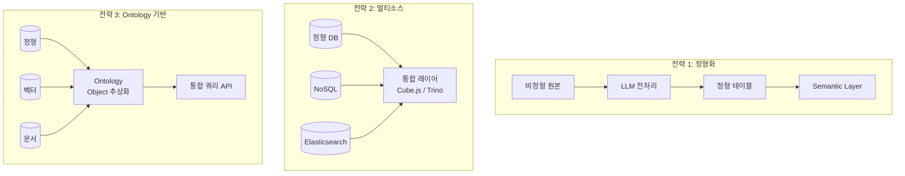

| 전략 | 장점 | 단점 | 대표 도구 |
|------|------|------|---------|
| **정형화** | 기존 시맨틱 레이어 재사용, 쿼리 단순 | 전처리 비용, 원본 정보 손실 | LLM + PostgreSQL |
| **멀티소스** | 원본 유지, 도구 통합 | 도구 호환성, 쿼리 복잡도 | Cube.js, Trino |
| **Ontology** | 가장 포괄적, 추론 가능 | 구축 복잡, 학습 곡선 높음 | Palantir, Neo4j |

---

## 8. 용어 사용 가이드

### 권장 용법

| 상황 | 권장 용어 | 피해야 할 용어 |
|------|---------|--------------|
| 정형 DB 메트릭 정의 | Semantic Layer | Ontology |
| 엔티티 관계/추론 | Knowledge Graph | Semantic Layer |
| 개념의 형식적 정의 | Ontology | Knowledge Graph |
| 정형+비정형 통합 레이어 | Knowledge Graph 또는 Palantir 스타일 Ontology | Semantic Layer |
| 메타데이터 허브 | Data Catalog / Metadata Hub | Knowledge Graph |

### 피해야 할 비표준 용어

- **Context Layer** -- 비표준, LLM 에이전트 커뮤니티에서만 일부 사용
- **Knowledge Layer** -- 비표준
- **AI Layer** -- 너무 광범위
- **Smart Data Layer** -- 마케팅 용어

---

## 9. 공식 참고 문헌

### 필독 논문

1. **Hogan, A., Blomqvist, E., Cochez, M., et al. (2021).**
   "Knowledge Graphs." *ACM Computing Surveys*, 54(4), Article 71.
   https://dl.acm.org/doi/10.1145/3447772 -- KG 분야의 표준 서베이

2. **Gruber, T. R. (1993).**
   "A translation approach to portable ontology specifications." *Knowledge Acquisition*, 5(2), 199-220.
   -- Ontology의 고전적 정의

3. **Noy, N. F., & McGuinness, D. L. (2001).**
   "Ontology Development 101: A Guide to Creating Your First Ontology."
   Stanford Knowledge Systems Laboratory Technical Report.
   -- 실무 관점의 온톨로지 구축

4. **Paulheim, H. (2017).**
   "Knowledge graph refinement: A survey of approaches and evaluation methods." *Semantic Web*, 8(3), 489-508.
   -- KG 정제 기법

### W3C 표준

| 표준 | URL | 용도 |
|------|-----|------|
| RDF 1.1 | https://www.w3.org/TR/rdf11-concepts/ | 데이터 모델 |
| OWL 2 | https://www.w3.org/TR/owl2-overview/ | 온톨로지 언어 |
| SPARQL 1.1 | https://www.w3.org/TR/sparql11-query/ | 쿼리 언어 |
| SKOS | https://www.w3.org/TR/skos-reference/ | 분류체계/용어집 |
| SHACL | https://www.w3.org/TR/shacl/ | 데이터 검증 |

### 서적

1. **Fensel, D. et al. (2020).** *Knowledge Graphs: Methodology, Tools and Selected Use Cases.* Springer.
2. **Barrasa, J. & Webber, J. (2023).** *Building Knowledge Graphs: A Practitioner's Guide.* O'Reilly.
3. **Hitzler, P. et al. (2010).** *Foundations of Semantic Web Technologies.* Chapman & Hall/CRC.
4. **Dehghani, Z. (2022).** *Data Mesh: Delivering Data-Driven Value at Scale.* O'Reilly.
5. **Kimball, R. & Ross, M. (2013).** *The Data Warehouse Toolkit (3rd ed.).* Wiley.

### 벤더 공식 문서

- **Palantir Foundry Ontology:** https://www.palantir.com/docs/foundry/ontology/overview/
- **dbt Semantic Layer:** https://docs.getdbt.com/docs/build/about-metricflow
- **Cube.dev:** https://cube.dev/docs
- **Databricks Unity Catalog:** https://docs.databricks.com/en/data-governance/unity-catalog/
- **Google Knowledge Graph API:** https://developers.google.com/knowledge-graph

### 산업 레퍼런스

- **schema.org** -- https://schema.org/ (사실상 표준 어휘)
- **Wikidata** -- https://www.wikidata.org/ (최대 오픈 KG)
- **DBpedia** -- https://www.dbpedia.org/ (Wikipedia 기반 KG)
- **Gartner:** "Data Fabric Architecture Is Key to Modernizing Data Management and Integration"
- **Dehghani 원문 (2019):** https://martinfowler.com/articles/data-monolith-to-mesh.html

---

*이 문서는 벤더 중립적 레퍼런스입니다. 프로젝트별 구현 세부사항은 별도 설계 문서를 참조하세요.*
