# NL2SQL 및 데이터 레이어 개념/용어 레퍼런스

> **목적:** 벤더 중립적으로 업계/학계의 정식 용어와 개념을 정리한다. BIP 구현 세부사항은 `docs/bip_target_architecture.md` 참조.
>
> **독자:** 팀 전체, 신규 합류자, 외부 협업자
>
> **작성일:** 2026-04-11

---

## 1. 용어 정립의 필요성

NL2SQL과 데이터 레이어 분야는 용어가 **업계/학계/벤더마다 다르게 쓰이고** 있다. 심지어 같은 단어가 다른 의미로 사용되기도 한다. 이 문서는 정식으로 통용되는 정의를 정리해 팀 내 혼동을 방지한다.

### 용어 혼동의 원인

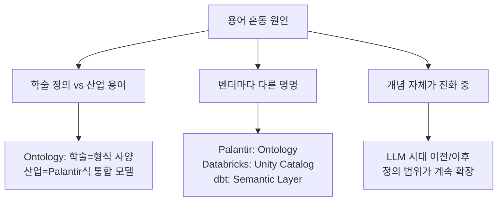

---

## 2. 정식 정의 (업계/학계 표준)

### 2-1. Semantic Layer (시맨틱 레이어)

**공식 정의 (Gartner IT Glossary):**
> "A business representation of corporate data that helps end users access data autonomously using common business terms."

**핵심 특징:**
- 원본 데이터 위에 **비즈니스 의미를 부여한 추상화 층**
- Metric, Dimension, Entity, Relationship을 **중앙에서 정의**
- 여러 도구(BI, API, 노트북)가 **동일한 정의를 재사용**
- **정형 데이터(SQL DB)에 한정**된 것이 전통적 정의

**구성 요소:**

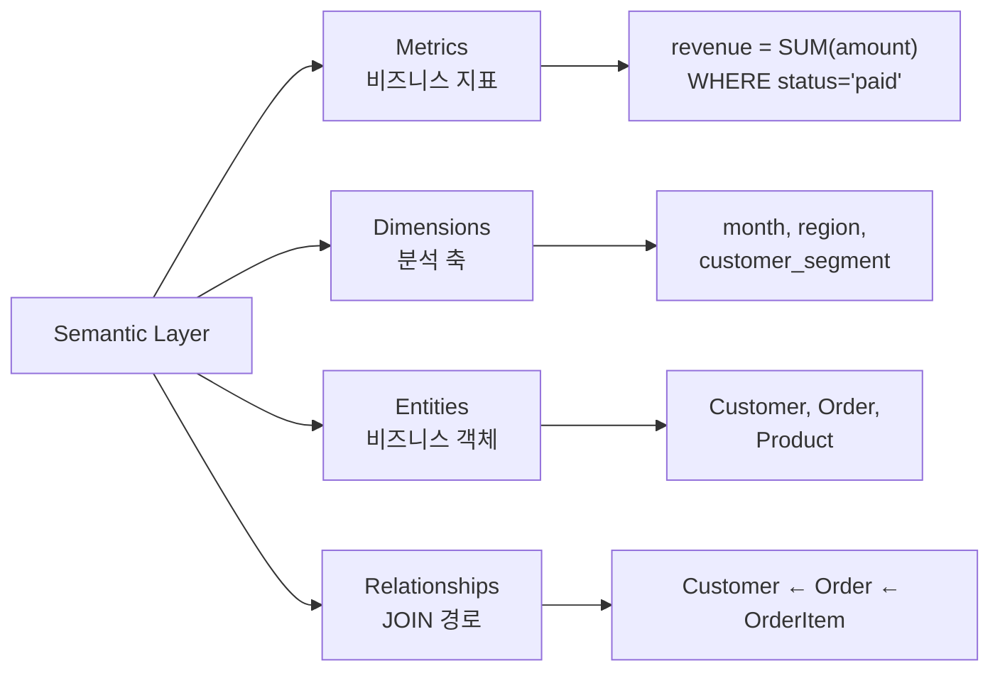

**대표 도구:**
- dbt Semantic Layer (MetricFlow)
- Cube.dev
- AtScale
- LookML (Looker)

**표준:** 없음 (벤더마다 YAML 스키마 다름)

**공식 참고:**
- Gartner IT Glossary
- Kimball Group의 차원 모델링 (The Data Warehouse Toolkit)

---

### 2-2. Knowledge Graph (지식그래프)

**공식 정의 (Hogan et al., 2021, ACM Computing Surveys):**
> "A knowledge graph is a graph of data intended to accumulate and convey knowledge of the real world, whose nodes represent entities of interest and whose edges represent relations between these entities."

**Google 정의 (2012):**
> "A network of real-world entities and the relationships between them."

**핵심 특징:**
- 엔티티(노드) + 관계(엣지)로 구성된 **그래프 구조**
- 정형/비정형 구분 없이 통합 가능
- **추론(inference)** 가능: 명시되지 않은 관계도 규칙 기반으로 도출
- 산업에서 가장 많이 쓰이는 용어

**구조:**

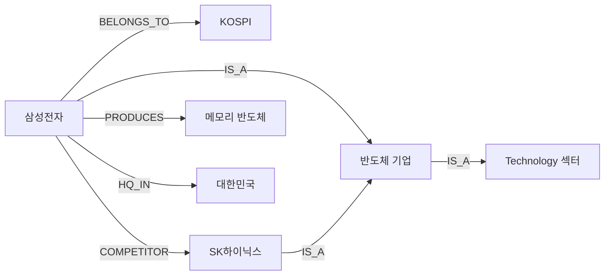

**표준:**
- **W3C RDF** (Resource Description Framework) — 데이터 모델
- **W3C SPARQL** — 쿼리 언어
- **Property Graph** (Neo4j Cypher) — 상용에서 더 많이 사용

**대표 구현:**
- Google Knowledge Graph (비공개)
- Wikidata (최대 오픈 KG)
- Neo4j, Amazon Neptune, GraphDB, TigerGraph

**공식 참고:**
- Hogan, A. et al. (2021). "Knowledge Graphs." ACM Computing Surveys, 54(4).
- W3C Semantic Web Standards: https://www.w3.org/standards/semanticweb/

---

### 2-3. Ontology (온톨로지)

**공식 정의 (Tom Gruber, 1993):**
> "An explicit specification of a conceptualization."

**확장 정의 (Studer et al., 1998):**
> "A formal, explicit specification of a shared conceptualization."

**핵심 특징:**
- 도메인의 개념, 속성, 관계, 제약조건의 **형식적 정의**
- Knowledge Graph의 **스키마** 역할
- 학술적으로 가장 엄격한 정의
- Formal semantics로 추론 가능

**Knowledge Graph와의 관계 (중요):**

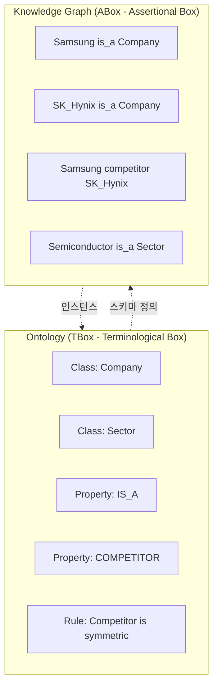

**학술적 구분:**
- **Ontology = TBox (스키마)**: "Company는 Organization의 하위 개념"
- **Knowledge Graph = Ontology + ABox (데이터)**: "Samsung은 Company이다"

**표준:**
- **W3C OWL** (Web Ontology Language) — 가장 공식적
- **W3C RDFS** (RDF Schema) — OWL의 부분집합
- **W3C SKOS** (Simple Knowledge Organization System) — 분류체계/용어집

**공식 참고:**
- Gruber, T. R. (1993). "A translation approach to portable ontology specifications." Knowledge Acquisition, 5(2).
- W3C OWL 2 Primer: https://www.w3.org/TR/owl2-primer/
- Noy, N. F., & McGuinness, D. L. (2001). "Ontology Development 101: A Guide to Creating Your First Ontology." Stanford KSL.

---

### 2-4. Data Fabric (데이터 패브릭)

**공식 정의 (Gartner, 2019):**
> "A design concept that serves as an integrated layer of data and connecting processes. It utilizes continuous analytics over existing, discoverable and inferenced metadata assets to support the design, deployment and utilization of integrated and reusable data across all environments."

**핵심 특징:**
- **아키텍처 패턴**이지 구체 제품이 아님
- 메타데이터 기반 이기종 데이터 통합
- Active metadata + AI/ML 기반 자동화 강조
- Gartner가 2019년부터 푸시한 개념

**구성 요소:**

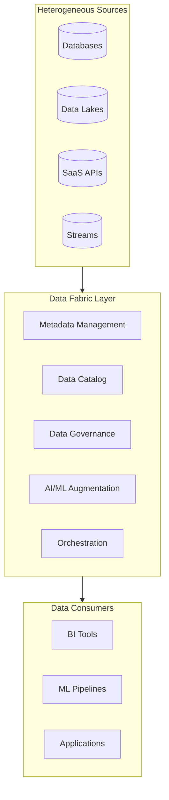

**대표 벤더:**
- IBM Cloud Pak for Data
- Informatica Intelligent Data Management
- Talend, Denodo

**공식 참고:**
- Gartner: "Data Fabric Architecture Is Key to Modernizing Data Management and Integration"

---

### 2-5. Data Mesh (데이터 메시)

**공식 정의 (Zhamak Dehghani, 2019):**
> "A sociotechnical approach to building a decentralized data architecture by leveraging a domain-oriented, self-serve design."

**4가지 원칙:**
1. **Domain-oriented ownership**: 도메인 팀이 자기 데이터를 책임
2. **Data as a product**: 데이터를 프로덕트처럼 취급
3. **Self-serve data platform**: 도메인 팀이 독립적으로 운영
4. **Federated computational governance**: 분산된 거버넌스

**핵심 특징:**
- 중앙 레이어가 **아니라** 분산 모델
- 조직 설계 + 데이터 아키텍처의 결합
- **기술 스택이 아니라 원칙**

**기존 중앙집중 vs Data Mesh:**

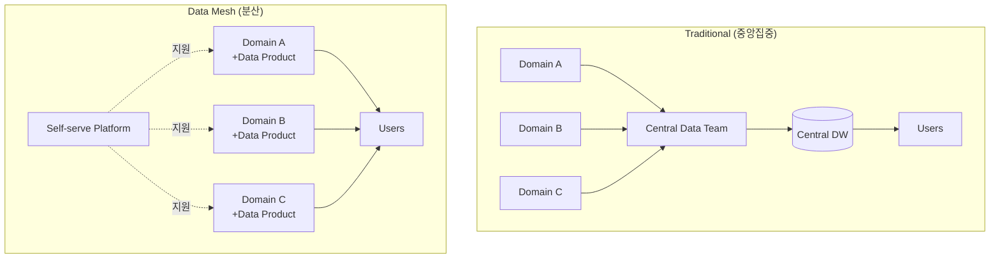

**공식 참고:**
- Dehghani, Z. (2022). "Data Mesh: Delivering Data-Driven Value at Scale." O'Reilly.
- 원문 아티클 (2019): https://martinfowler.com/articles/data-monolith-to-mesh.html

---

## 3. Knowledge Graph vs Ontology vs Semantic Layer — 관계 정리

세 개념은 서로 다른 층위에 있다.

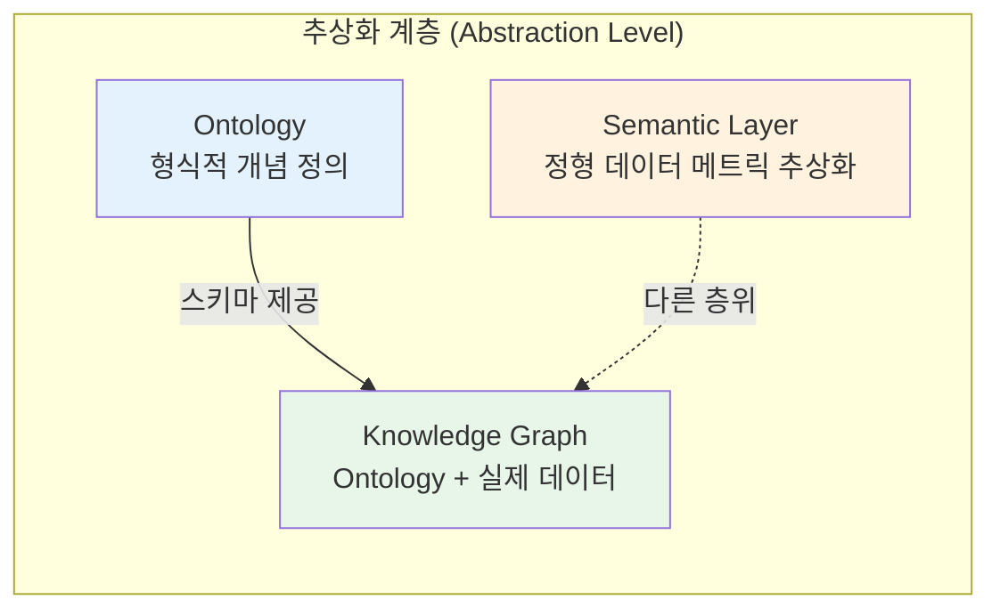

| 구분 | Semantic Layer | Knowledge Graph | Ontology |
|------|:-:|:-:|:-:|
| **주 대상** | 정형 DB | 정형+비정형+관계 | 개념 정의 (스키마) |
| **데이터 포함** | ❌ (정의만) | ✅ (인스턴스 포함) | ❌ (스키마만) |
| **추론 기능** | ❌ | ✅ (제한적) | ✅ (형식적) |
| **쿼리 언어** | SQL (내부) | SPARQL / Cypher | SPARQL (OWL) |
| **표준** | 없음 | W3C RDF | W3C OWL |
| **대표 도구** | dbt, Cube.dev | Neo4j, Neptune | Protégé, TopBraid |
| **전형적 질문** | "월 매출 얼마?" | "삼성 경쟁사는?" | "Company란 무엇인가?" |

---

## 4. NL2SQL 엔진

### 4-1. 정의

자연어 질문을 SQL로 변환하는 시스템. 크게 3가지 아키텍처 패턴이 있다.

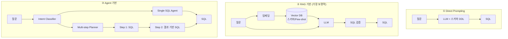

### 4-2. 주요 NL2SQL 엔진 비교

| 도구 | 방식 | 셀프호스팅 | 관리 UI | SQL 검증 | 시맨틱 레이어 |
|------|------|:-:|:-:|:-:|:-:|
| **Wren AI** | RAG + LLM + Engine 검증 | ✅ | ✅ | ✅ (3회 재시도) | MDL (경량) |
| **Vanna AI** | RAG + LLM (Python 라이브러리) | ✅ | ❌ | ❌ | ❌ |
| **Defog AI** | Fine-tuned 모델(SQLCoder) + RAG | ✅ | ✅ | ✅ | ❌ |
| **DataHerald** | RAG + LLM + 검증 (API 서버) | ✅ | ✅ | ✅ | ❌ |
| **LangChain SQL Agent** | 프레임워크 | ✅ | ❌ | 직접 구현 | 직접 구현 |
| **LlamaIndex NL2SQL** | 프레임워크 | ✅ | ❌ | 직접 구현 | 직접 구현 |

### 4-3. NL2SQL 품질 결정 요인

도구 자체보다 **LLM과 컨텍스트가 품질을 결정**한다.

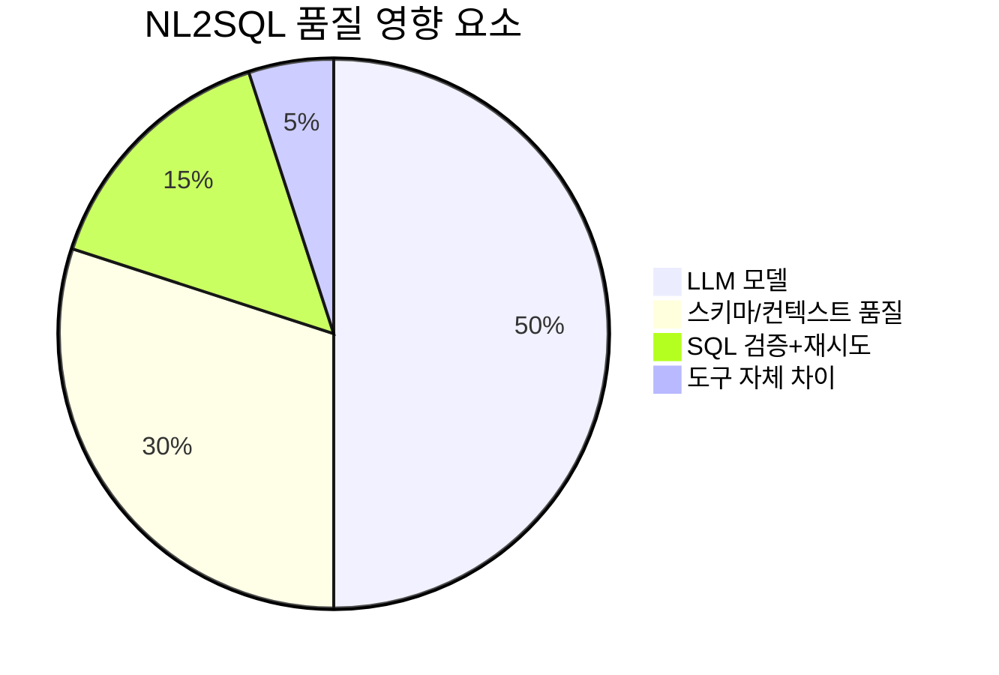

**Text-to-SQL 벤치마크 (BIRD):**

| 접근법 | 정확도 | 비고 |
|-------|:-:|------|
| GPT-4 + CoT | ~65% | 프롬프트만 잘 짜도 |
| DAIL-SQL (Few-shot 최적화) | ~70% | 예시 선택 전략 |
| DIN-SQL (분해 전략) | ~72% | 질문 서브태스크 분해 |
| SQLCoder (fine-tuned) | ~68% | 전용 모델 |
| MAC-SQL (멀티 에이전트) | ~75% | 에이전트 협업 |

---

## 5. 시맨틱 레이어 도구

### 5-1. 셀프호스팅 가능한 도구

| 도구 | 라이선스 | 방식 | 데이터 소스 | API |
|------|---------|------|-----------|-----|
| **dbt Core (MetricFlow)** | Apache 2.0 | YAML 정의 + SQL 변환 | SQL DB | CLI |
| **Cube.dev** | MIT | JavaScript 정의 + API 서버 | 27+ 소스 | REST/GraphQL/SQL |
| **Apache Superset** | Apache 2.0 | UI 기반 시맨틱 | SQL DB | Superset Embedded |

### 5-2. dbt vs Cube.js 비교

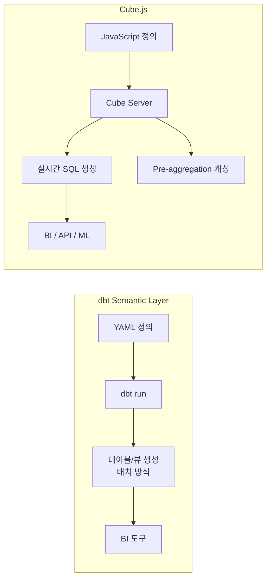

| | dbt Core | Cube.js |
|--|---------|---------|
| **정의 방식** | YAML | JavaScript/YAML |
| **실행 방식** | 배치 (SQL 변환) | 실시간 API |
| **산출물** | 테이블/뷰 | REST/GraphQL API |
| **캐싱** | ❌ | ✅ pre-aggregation |
| **적합 상황** | ETL 중심 | API 서빙 중심 |

### 5-3. 엔터프라이즈 시맨틱 레이어

| 플랫폼 | 시맨틱 레이어 | 특징 |
|--------|------------|------|
| **Palantir Foundry** | Ontology | Object + 관계 + 액션, 가장 포괄적 |
| **Databricks** | Unity Catalog + AI/BI | Delta Lake 통합, AI 중심 |
| **Snowflake** | Semantic Views (2024~) | SQL 네이티브 |
| **Google BigQuery** | LookML (Looker) | Google Cloud 종속 |
| **Microsoft Fabric** | OneLake + Semantic Model | Office 생태계 통합 |

---

## 6. 엔터프라이즈 사례 분석

### 6-1. Palantir Foundry — Ontology 중심

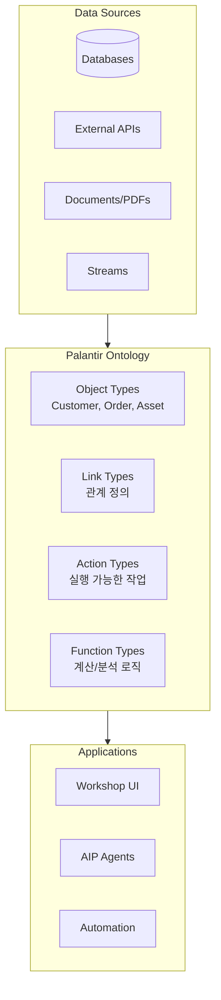

**특징:**
- 모든 데이터를 Object로 추상화
- 비정형 데이터도 Object로 등록 가능
- Action이 핵심 차별점 (쿼리 + 실행)
- AIP(AI Platform): Ontology 위에서 LLM 에이전트 동작

**공식 참고:** https://www.palantir.com/docs/foundry/ontology/overview/

### 6-2. Databricks — Unity Catalog + AI/BI Genie

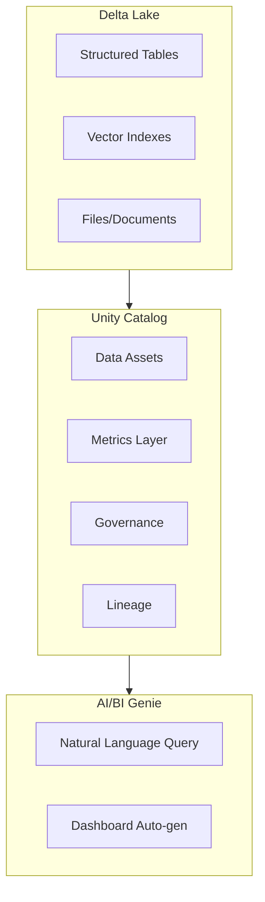

**특징:**
- Delta Lake가 정형/반정형/비정형 통합 저장
- Unity Catalog가 메타데이터 + 거버넌스
- AI/BI Genie가 NL2SQL + 시각화

### 6-3. Google Knowledge Graph

**특징:**
- 2012년 공개 (검색 품질 개선 목적)
- 수십억 개 엔티티, 수천억 개 관계
- schema.org 어휘 사용
- 내부적으로 Bigtable + 그래프 구조

**공식 참고:** https://blog.google/products/search/introducing-knowledge-graph-things-not/

---

## 7. 비정형 데이터 통합 전략

### 7-1. 3가지 접근법

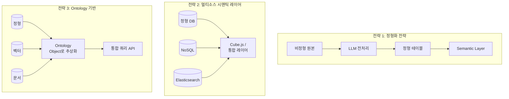

### 7-2. 비교

| 전략 | 장점 | 단점 | 대표 도구 |
|------|------|------|---------|
| **정형화** | 기존 시맨틱 레이어 재사용, 쿼리 단순 | 전처리 비용, 원본 정보 손실 | LLM + PostgreSQL |
| **멀티소스** | 원본 유지, 도구 통합 | 도구 호환성, 쿼리 복잡도 | Cube.js, Trino |
| **Ontology** | 가장 포괄적, 추론 가능 | 구축 복잡, 학습 곡선 높음 | Palantir, Neo4j |

---

## 8. 용어 사용 가이드

### 8-1. 팀 내 권장 용법

| 상황 | 권장 용어 | 피해야 할 용어 |
|------|---------|--------------|
| 정형 DB 메트릭 정의 | Semantic Layer | Ontology |
| 종목-섹터-경쟁사 관계 | Knowledge Graph | Semantic Layer |
| 개념의 형식적 정의 | Ontology | Knowledge Graph |
| 정형+비정형 통합 레이어 | Knowledge Graph (포괄) 또는 Palantir 스타일 Ontology | Semantic Layer |
| 메타데이터 허브 | Data Catalog / Metadata Hub | Knowledge Graph |

### 8-2. 피해야 할 모호한 용어

- **Context Layer** — 비표준, LLM 에이전트 커뮤니티에서만 일부 사용
- **Knowledge Layer** — 비표준
- **AI Layer** — 너무 광범위
- **Smart Data Layer** — 마케팅 용어

---

## 9. 공식 참고 문헌

### 9-1. 필독 논문

1. **Hogan, A., Blomqvist, E., Cochez, M., et al. (2021).**
   "Knowledge Graphs." *ACM Computing Surveys*, 54(4), Article 71.
   https://dl.acm.org/doi/10.1145/3447772
   → KG 분야의 표준 서베이

2. **Gruber, T. R. (1993).**
   "A translation approach to portable ontology specifications." *Knowledge Acquisition*, 5(2), 199-220.
   → Ontology의 고전적 정의

3. **Noy, N. F., & McGuinness, D. L. (2001).**
   "Ontology Development 101: A Guide to Creating Your First Ontology."
   Stanford Knowledge Systems Laboratory Technical Report.
   → 실무 관점의 온톨로지 구축

4. **Paulheim, H. (2017).**
   "Knowledge graph refinement: A survey of approaches and evaluation methods." *Semantic Web*, 8(3), 489-508.
   → KG 정제 기법

### 9-2. 공식 표준 (W3C)

| 표준 | URL | 용도 |
|------|-----|------|
| RDF 1.1 | https://www.w3.org/TR/rdf11-concepts/ | 데이터 모델 |
| OWL 2 | https://www.w3.org/TR/owl2-overview/ | 온톨로지 언어 |
| SPARQL 1.1 | https://www.w3.org/TR/sparql11-query/ | 쿼리 언어 |
| SKOS | https://www.w3.org/TR/skos-reference/ | 분류체계/용어집 |
| SHACL | https://www.w3.org/TR/shacl/ | 데이터 검증 |

### 9-3. 산업 레퍼런스

- **schema.org** — https://schema.org/ (사실상 표준 어휘)
- **Wikidata** — https://www.wikidata.org/ (최대 오픈 KG)
- **DBpedia** — https://www.dbpedia.org/ (Wikipedia 기반 KG)

### 9-4. 서적

1. **Fensel, D., Şimşek, U., Angele, K., et al. (2020).**
   *Knowledge Graphs: Methodology, Tools and Selected Use Cases.* Springer.

2. **Barrasa, J. & Webber, J. (2023).**
   *Building Knowledge Graphs: A Practitioner's Guide.* O'Reilly.

3. **Hitzler, P., Krötzsch, M., & Rudolph, S. (2010).**
   *Foundations of Semantic Web Technologies.* Chapman & Hall/CRC.

4. **Dehghani, Z. (2022).**
   *Data Mesh: Delivering Data-Driven Value at Scale.* O'Reilly.

5. **Kimball, R. & Ross, M. (2013).**
   *The Data Warehouse Toolkit: The Definitive Guide to Dimensional Modeling (3rd ed.).* Wiley.

### 9-5. 벤더 공식 문서

- **Palantir Foundry Ontology:** https://www.palantir.com/docs/foundry/ontology/overview/
- **dbt Semantic Layer:** https://docs.getdbt.com/docs/build/about-metricflow
- **Cube.dev:** https://cube.dev/docs
- **Databricks Unity Catalog:** https://docs.databricks.com/en/data-governance/unity-catalog/
- **Google Knowledge Graph API:** https://developers.google.com/knowledge-graph

---

## 10. 용어 빠른 참조

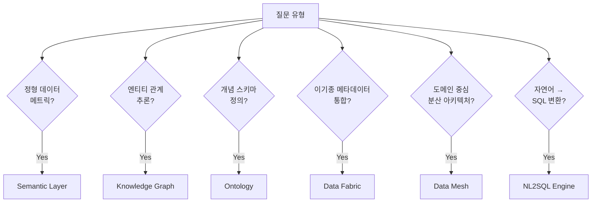

---

*이 문서는 벤더 중립적으로 작성되었습니다. BIP 구현 맥락은 `docs/bip_target_architecture.md`를 참조하세요.*
