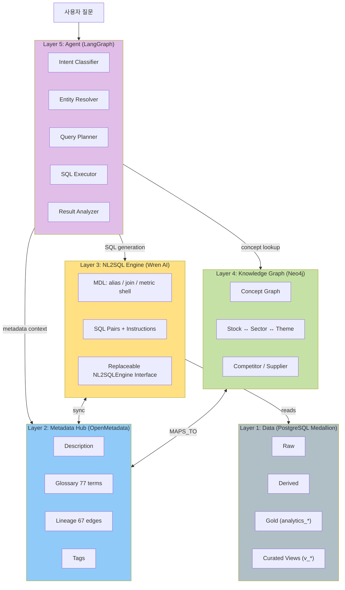
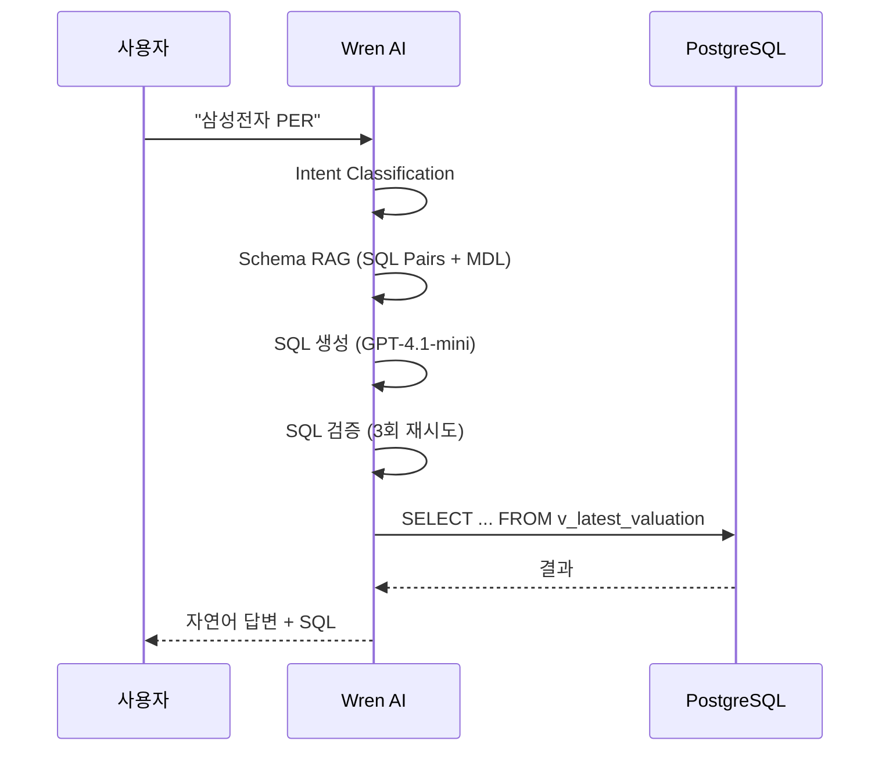
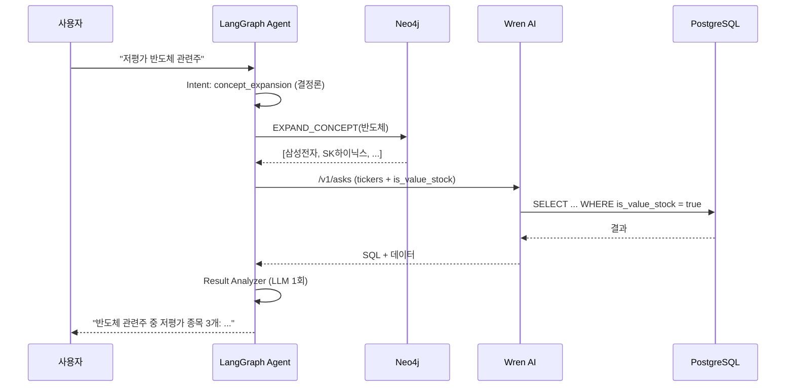
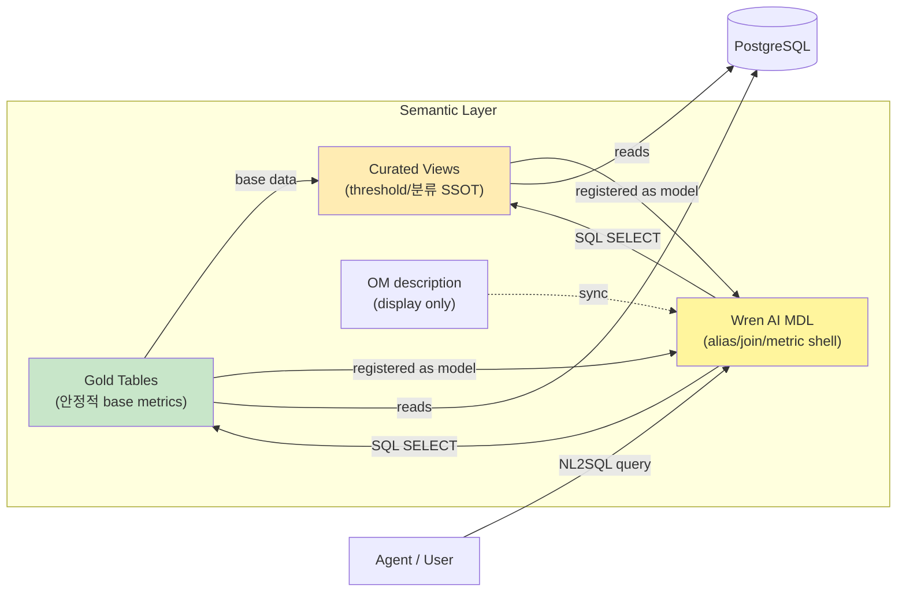
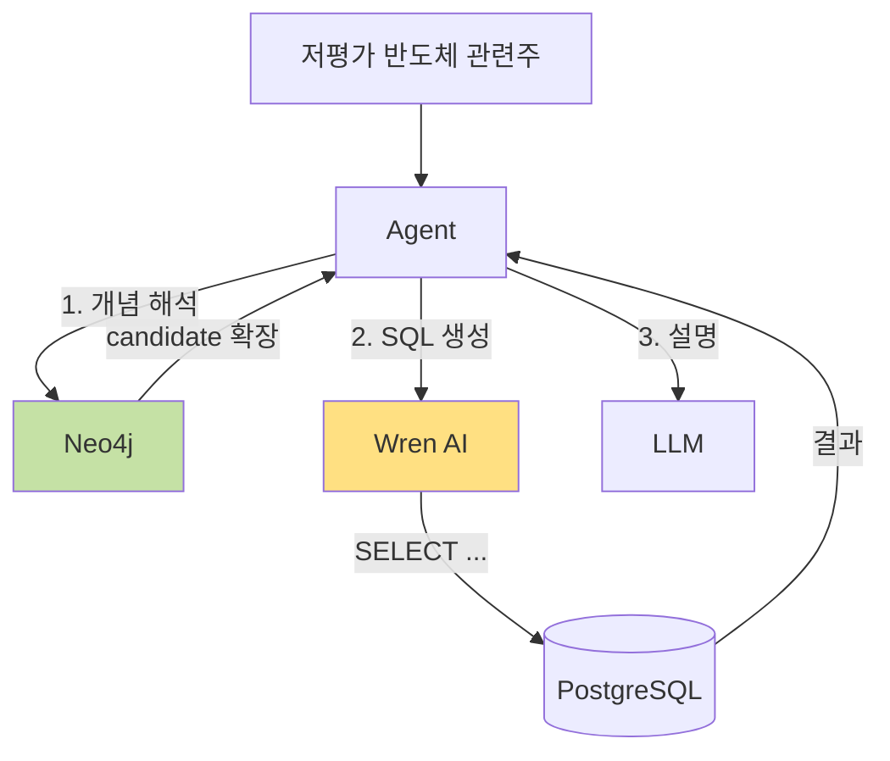
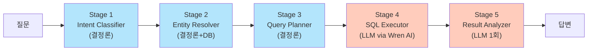
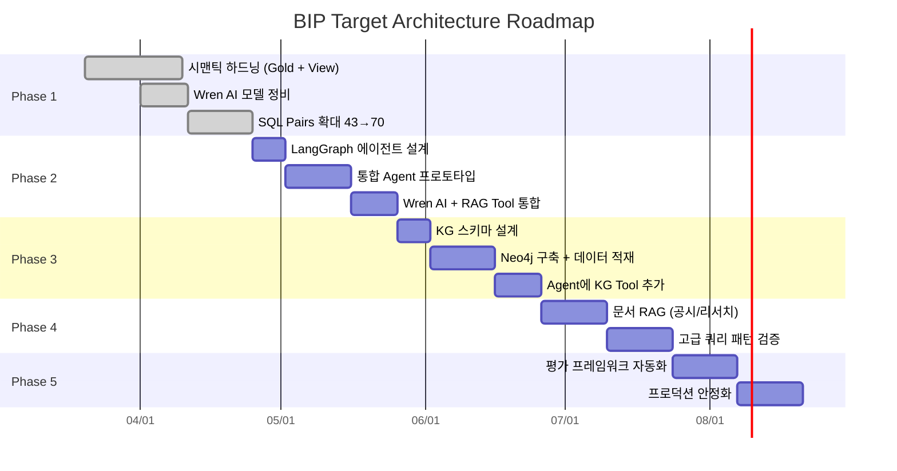
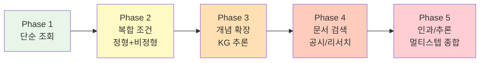

# BIP-Pipeline NL2SQL 설계 및 아키텍처

> **작성일:** 2026-04-12
> **통합 원본:** `nl2sql_project_plan.md`, `nl2sql_architecture_v2.md`, `bip_target_architecture.md`
> **관련 문서:**
> - `docs/security_governance.md` — 보안 불변 조건
> - `docs/metadata_governance.md` — 메타데이터/리니지/용어 관리 절차
> - `docs/wrenai_technical_guide.md` — Wren AI 내부 구조
> - `docs/wrenai_test_report.md` — NL2SQL 품질 테스트 프레임워크

---

## 1. 개요

### 1-1. 목표

자연어 질문을 SQL로 변환하여 주식 데이터를 동적으로 조회하는 시스템을 구축한다. 개인 투자 데이터를 대상으로 하지만, **사내 업무 데이터에 적용할 NL2SQL 아키텍처의 사전 검증**이 본래 목적이다.

### 1-2. 질문 유형별 커버리지

| 유형 | 예시 질문 | 필요한 것 | Phase |
|------|----------|---------|:-----:|
| **단순 조회** | "삼성전자 현재 PER" | NL2SQL | 1 |
| **복합 조건** | "저평가 반도체 관련주 중 외국인 순매수" | NL2SQL + 시맨틱 | 1-2 |
| **개념 기반 검색** | "삼성전자 경쟁사들의 밸류에이션 비교" | Knowledge Graph | 3 |
| **시계열/이벤트** | "골든크로스 발생 후 1개월 수익률" | 멀티스텝 쿼리 | 2 |
| **정형+비정형** | "삼성전자 실적 발표 후 시장 반응" | SQL + News RAG | 2 |
| **인과/추론** | "금리 인상이 포트폴리오에 미친 영향" | KG + 멀티스텝 + 분석 | 3-5 |
| **맥락 필요** | "지금 방어주로 피난할 종목" | 전체 통합 | 5 |

단일 도구(NL2SQL/RAG/KG)로는 모든 유형을 답할 수 없으므로 **통합 아키텍처(NL2SQL + KG + RAG + Agent)** 가 필요하다.

---

## 2. 전체 아키텍처

### 2-1. 5-Layer 구조



### 2-2. 아키텍처 포지셔닝

| 컴포넌트 | 역할 | 분류 |
|---------|------|------|
| **Gold Tables + Curated Views** | 비즈니스 로직 SSOT (PER 계산, boolean 플래그, 단위 변환) | **canonical semantic layer** |
| **Wren AI MDL** | LLM이 스키마를 이해하도록 돕는 주석 (description, relationship) | **NL2SQL semantic shell** |
| **Wren AI** | 스키마 RAG + LLM + SQL 검증 + 관리 UI | **semantic-aware Text-to-SQL engine** |
| **LangGraph** (Phase 2) | 멀티스텝 쿼리, 비정형 데이터, KG 통합 | **orchestration layer** |

> **핵심:** Wren AI는 "시맨틱 레이어"가 아니라 "NL2SQL 엔진"이다. 진짜 시맨틱 레이어는 PostgreSQL Gold Tables + Curated Views에 위치한다.

---

## 3. 기술 스택

| 컴포넌트 | 역할 | 버전/제품 | 포트 |
|---------|------|---------|:----:|
| PostgreSQL | 메인 DB (stockdb) | 15+ | 5432 |
| Airflow | ETL 오케스트레이션 | 2.x | 8080 |
| OpenMetadata | 메타데이터 카탈로그 | latest | 8585 |
| Wren AI Engine | SQL 실행/검증 | 0.22.0 | - |
| Wren AI Service | NL2SQL LLM 파이프라인 | 0.29.0 | - |
| Wren AI UI | 관리 인터페이스 | 0.32.2 | 3000 |
| GPT-4.1-mini | NL2SQL LLM 모델 | OpenAI | - |
| Neo4j (Phase 3) | Knowledge Graph | Community 5.15 | 7474/7687 |
| LangGraph (Phase 2) | Agent 오케스트레이션 | BIP-Agents 내 | - |
| pgvector | 뉴스 임베딩 벡터 저장 | PG extension | - |

---

## 4. 데이터 흐름

### 4-1. 단순 질문 흐름 (Phase 1)



### 4-2. 복합 질문 흐름 (Phase 2 목표)



---

## 5. 레이어별 상세 설계

### 5-1. Data Layer (Medallion Architecture)

```
Raw:
  stock_info, stock_price_1d, financial_statements,
  consensus_estimates, macro_indicators, news, ...

Derived:
  stock_indicators, market_daily_summary, sector_daily_performance

Gold (분석용 pre-joined):
  analytics_stock_daily    (시세 + 지표 + 컨센서스 와이드, 1,914,342행)
  analytics_macro_daily    (거시지표 피벗, 437행)
  analytics_valuation      (종목별 밸류에이션 종합, 7,609행)

Curated Views (threshold/분류 SSOT):
  v_latest_valuation       (1 ticker = 1 row 스냅샷)
  v_valuation_signals      (is_value_stock, is_growth_stock 등)
  v_technical_signals      (is_oversold_rsi, is_volume_spike 등)
  v_flow_signals           (외국인/기관 수급 강도)
```

**하이브리드 전략:**

| 대상 | 위치 | 이유 |
|------|------|------|
| `per_actual`, `golden_cross` 등 안정적 metrics | Gold 직접 | 기준 변경 가능성 낮음 |
| `is_value_stock`, `is_growth_stock` 등 threshold 분류 | Curated View | 임계값이 바뀔 수 있음 |
| `foreign_buy_amount` 등 단순 산술 | View 권장 | 중복만 피하면 OK |

**View 네이밍:** `v_<domain>_<subject>__v<major>`. Breaking change 시 새 버전 생성.

### 5-2. Metadata Hub (OpenMetadata)

OM은 **description/glossary only**로 역할 한정. 계산식이나 runtime 의미론은 OM에 두지 않는다.

| 역할 | 내용 |
|------|------|
| 테이블/컬럼 description | 설명 텍스트 원천 (Wren AI로 sync) |
| Glossary 용어집 | 77 terms — 설명 원천 |
| Lineage | API → DAG → Table → Consumer 추적 (67 edges) |
| Tags | DataLayer, Domain, SourceType, SecurityLevel |

**동기화 플로우:**
```
OM (편집/원천)
  ├→ om_sync_comments.py → PostgreSQL COMMENT
  ├→ om_sync_wrenai.py → Wren AI model description
  └→ (Phase 3) om_sync_neo4j.py → Neo4j Term nodes
```

**OM에서 빼는 것:** 계산식 설명 (View COMMENT에 고정), 단위 변환 (컬럼명에 내장).

### 5-3. Semantic Layer (Gold + View = 정형 SSOT)

> **원칙:** `View = truth, MDL = alias/join/metric shell, OM = description only`

Gold 방식이 Wren AI 공식 권장(pre-joined reporting tables, boolean flags, pre-computed metrics)과 이미 일치. **Gold 유지 + PostgreSQL Curated View 보강**이 정답.



**Grain 불일치 해결:** `v_latest_valuation` 뷰로 1 ticker = 1 row 스냅샷을 만들어 grain 일치. `analytics_stock_daily ↔ analytics_valuation` 직접 Relationship 금지.

**PostgreSQL Curated View "View"의 3가지 의미:**

| 용어 | 정의 | Relationship |
|------|------|:---:|
| PostgreSQL Curated View | `CREATE VIEW v_*` — DB 가상 테이블, 계산 SSOT | ✅ (Model로 등록) |
| Wren AI UI View | "Save as View"로 저장된 trusted query result | ❌ |
| Wren Engine MDL view | MDL JSON의 named query | ❌ |

> **PostgreSQL Curated View는 Wren AI에 Model로 등록한다.** Relationship은 Model 간에만 가능.

### 5-4. NL2SQL Engine (Wren AI)

**Wren AI 현재 구성:**
- 9개 모델, 309개 컬럼 (DB와 100% 일치)
- 6개 Relationship (View → stock_info 포함)
- 70개 SQL Pairs (6개 카테고리)
- 4개 Instructions (계산식/종목검색/data_type/한글필수)
- LLM: GPT-4.1-mini

**MDL에는 계산식을 넣지 않는다.** 포함하는 것:
- 테이블 alias + relationships (JOIN 경로)
- 집계 메트릭 wrapper (SUM/AVG/COUNT/MAX/MIN)
- 컬럼 description (OM에서 sync)
- SQL Pairs (학습용 예시)
- Instructions (도메인 규칙, 최소)

**Replaceable NL2SQL Interface:**

```python
class NL2SQLEngine(Protocol):
    def generate_sql(self, question: str, context: dict) -> SQLResult: ...
    def validate(self, sql: str) -> ValidationResult: ...
    def execute(self, sql: str) -> QueryResult: ...

class WrenAIEngine(NL2SQLEngine): ...   # 기본 구현
class VannaEngine(NL2SQLEngine): ...    # 향후 대체재
```

**Consistency Check (자동):**
- OM description 해시 vs Wren MDL description 해시 일치 여부
- View column이 MDL에 존재하는지
- View boolean 컬럼이 SQL Pairs에 예시 존재하는지
- 불일치 시 DAG 실패 + 경보

### 5-5. Knowledge Graph (Neo4j — Phase 3 예정)

**핵심 재정의:** KG는 planner/context layer. 수치 계산은 SQL이 담당.



**Node Labels:**

| Label | 용도 |
|-------|------|
| `Concept` | 추상 개념 (반도체, 저평가, 고배당) |
| `Stock` | 개별 종목 |
| `Sector` | 섹터 (KRX/GICS) |
| `Theme` | 투자 테마 (HBM, AI, 전기차) |
| `Term` | OM Glossary에서 import된 용어 |

**주요 Relationship:** `IS_A`, `BELONGS_TO`, `HAS_MEMBER`, `COMPETITOR`, `SUPPLIER`, `RELATED_TO`, `MAPS_TO`

**Cypher 생성 전략:** free-form Cypher 지양. **템플릿 + slot fill** 방식:

```python
EXPAND_CONCEPT = """
MATCH (c:Concept {name: $concept_name})
OPTIONAL MATCH (c)<-[:IS_A|PART_OF*1..3]-(sub:Concept)
MATCH (sub|c)-[:HAS_MEMBER]->(s:Stock)
RETURN DISTINCT s.ticker, s.name
"""
```

**저장소:** `YAML → Neo4j` 단방향 sync. Git이 authoring source of truth.

### 5-6. Agent Layer (LangGraph — Phase 2 예정)

**5단계 구조 (deterministic-first):**



Stage 1-3은 결정론, Stage 4-5만 LLM 호출 (최대 2회).

| Stage | 구현 | 실패 시 |
|-------|------|---------|
| 1. Intent Classifier | 정규식/키워드 분류 | `unknown` → Stage 5 직행 |
| 2. Entity Resolver | DB lookup + Neo4j | 모호 시 clarification 반환 |
| 3. Query Planner | 유형+엔티티 기반 라우팅 | 기본값 `single_sql` |
| 4. SQL Executor | NL2SQLEngine (Wren AI) | 2회 실패 → 에스컬레이트 |
| 5. Result Analyzer | LLM 자연어 설명 | 근거 부족 → clarification |

**Evidence Budget:** entity resolved + sql success + result rows > 0 + KG/OM 근거 → 하나라도 부족하면 답변 대신 명확화 요청.

**투자 판단 경계:** 에이전트는 `factual retrieval → rule-based scoring → narrative explanation`만 수행. "추천" 요청 시 투자 조언 불가 고지.

---

## 6. 컴포넌트 책임 경계

| 책임 | PostgreSQL | OM | Wren AI | Views | Neo4j | LangGraph |
|------|:---:|:---:|:---:|:---:|:---:|:---:|
| 데이터 저장 | ✅ | — | — | — | — | — |
| 계산식/boolean 분류 | — | — | — | ✅ SSOT | — | — |
| 테이블/컬럼 description | — | ✅ 원천 | sync | — | — | — |
| 비즈니스 용어집 | — | ✅ 원천 | — | — | ✅ runtime | — |
| Lineage | — | ✅ | — | — | — | — |
| 관계 정의 (JOIN) | FK | — | ✅ MDL | — | — | — |
| 개념 관계 (IS_A 등) | — | — | — | — | ✅ | — |
| Entity 해석 | — | — | — | — | ✅ lookup | ✅ orch |
| NL → SQL 변환 | — | — | ✅ | — | — | — |
| SQL 검증 (4-layer) | ✅ role | — | — | ✅ allowlist | — | ✅ validator |
| 멀티 SQL 오케스트레이션 | — | — | — | — | — | ✅ |
| 결과 자연어 설명 | — | — | — | — | — | ✅ LLM |
| 감사 기록 | ✅ write | — | — | — | — | ✅ write |

---

## 7. 보안 아키텍처

### 7-1. 4-Layer 방어

```
Layer 1 (문법/패턴): SELECT-only, DDL/DML 금지, 위험 패턴 차단
Layer 2 (Allowlist):  sqlglot AST 파싱 → 허용 테이블만
Layer 3 (DB Role):    nl2sql_exec 계정, 민감 테이블 GRANT 없음
Layer 4 (Curated):    Gold/View만으로 allowlist 구성
```

### 7-2. 민감 테이블 (NL2SQL/LLM 접근 금지)

- Raw: `portfolio`, `users`, `user_watchlist`, `holding`, `transaction`, `cash_transaction`
- Derived: `portfolio_snapshot`
- 운영: `monitor_alerts`

### 7-3. 보안 불변 조건

1. **LLM은 raw 데이터 값을 절대 보지 않는다** — type_summary만 전달
2. **NL2SQL 실행은 `nl2sql_exec` 전용 role만 사용** — 민감 테이블 GRANT 없음
3. **감사 Fail-Closed** — 감사 기록 실패 시 결과 반환 금지
4. **4-layer 중 어느 하나가 뚫려도 다음 레이어에서 차단**

### 7-4. 감사 기록

```
agent_audit_log: Intent/Entity/Planner/SQL/Analyzer 전 단계
nl2sql_audit_log: Wren AI 호출 원본 (SQL, validation, execution)
```

### 7-5. Phase별 추가 보안

- **Neo4j:** `nl2sql_read_only` user, 민감 노드 생성 금지, Cypher 템플릿 외 자유 쿼리 차단
- **LangGraph:** Evidence Budget 거부 이벤트도 감사 기록

---

## 8. 현재 상태 (Phase 1 완료 — 2026-04-12)

### 8-1. 완료 항목

| 항목 | 상태 | 수량 |
|------|:----:|------|
| Gold 테이블 | ✅ | 3종 |
| Curated View | ✅ | 4종 |
| Wren AI 모델 | ✅ | 9개, 309 컬럼 (DB 100% 일치) |
| Relationship | ✅ | 6개 |
| SQL Pairs | ✅ | **70개** (6 카테고리) |
| Instructions | ✅ | 4개 |
| LLM 모델 | ✅ | **GPT-4.1-mini** (7개 모델 비교 후 선정) |
| 보안 4-layer | ✅ | 39개 통합 테스트 PASS |
| 감사 로그 | ✅ | nl2sql_audit_log + agent_audit_log |
| OM 메타데이터 | ✅ | 39 테이블, 77 용어, 전체 lineage |
| 품질 테스트 자동화 | ✅ | scripts/wren_nl2sql_phase1_test.py |

### 8-2. 품질 지표 추이

| 지표 | 1차 (04-02) | 2차 (04-03) | 3차 (04-07) | **4차 (04-12)** |
|------|:-:|:-:|:-:|:-:|
| SQL 생성률 | 75% | 85% | 100% | **100%** |
| DB 실행률 | - | - | - | **100%** |
| Boolean flag 활용 | - | - | 0% | **87%** |
| 평균 속도 | 11s | 11s | 16s | **10s** |
| SQL Pairs | 29 | 34 | 43 | **70** |

### 8-3. 현재 한계

| 한계 | 원인 |
|------|------|
| Calculated Fields 제약 | Wren AI는 집계 함수(SUM/AVG/COUNT 등)만 지원 |
| 온톨로지 부재 | "경쟁사", "반도체 관련주" 등 개념 확장 불가 |
| 1질문 = 1SQL | 멀티스텝 추론/비교 불가 |
| OM Glossary → Wren AI 자동 전파 불가 | Wren AI에 glossary 개념 없음 |
| 약칭 매핑 실패 (현차→현대차) | Entity Resolution 기능 없음 |
| sql_answer 환각 | Wren AI 답변 생성 커스터마이징 불가 |

---

## 9. 최종 목표 아키텍처 (Phase 2-5 로드맵)

### 9-1. Gantt 차트



### 9-2. Phase 상세

| Phase | 목표 | 핵심 산출물 | 검증 질문 예시 |
|:-----:|------|-----------|-------------|
| **2** | 통합 Agent | LangGraph 5단계, Wren AI Tool, News RAG Tool | "외국인 매수 상위 종목의 뉴스 요약" |
| **3** | Knowledge Graph | Neo4j 구축, Agent에 KG Tool 추가 | "삼성전자 경쟁사 밸류에이션" |
| **4** | 문서 RAG | 공시/리서치 임베딩 + Agent Tool | "삼성전자 최근 공시 요약" |
| **5** | 평가 + 프로덕션 | 골든셋, 정기 품질 테스트, 신뢰도 스코어 | 전체 유형 자동 검증 |

### 9-3. 갭 분석

| 항목 | 현재 | 목표 | 갭 |
|------|-----|------|:--:|
| NL2SQL 엔진 | Wren AI 운영 중 | 유지 + 보강 | 소 |
| 정형 시맨틱 | Gold + View | SQL Pairs 100개 | 소 |
| 에이전트 | 체크리스트/모니터 독립 | 통합 Agent | 대 |
| Knowledge Graph | 없음 | Neo4j + 도메인 KG | 대 |
| 비정형 통합 | 뉴스 임베딩만 | Agent Tool로 통합 | 중 |
| 문서 RAG | 없음 | 공시/리서치 RAG | 대 |

---

## 10. 의사결정 기록

### 10-1. 왜 Wren AI를 선택했는가

Wren AI, Vanna AI, Defog AI, DataHerald, LangChain SQL Agent 비교 후 선택.

| 선택 근거 | 설명 |
|---------|------|
| 관리 UI | SQL Pairs/Instructions를 비개발자도 관리 가능 |
| SQL 검증 내장 | 3회 재시도 + 보정 파이프라인 |
| Intent Classification | Qdrant RAG 기반 유사 질문 검색 |
| 추상화 가능 | `NL2SQLEngine` 인터페이스로 감싸면 교체 가능 |

**한계:** 1질문=1SQL, 비정형 불가, 프롬프트 커스터마이징 불가, OpenAI 편향 → LangGraph로 보완.

### 10-2. 왜 GPT-4.1-mini를 선택했는가

7개 모델 비교 (상세: `docs/wrenai_test_report.md`). SQL 생성률 100%, boolean flag 활용 87%, 평균 10s의 최적 균형.

### 10-3. 왜 dbt/Cube를 안 쓰는가

| 대체재 | 기각 이유 |
|--------|---------|
| dbt Semantic Layer | 소비자가 Wren AI 하나뿐이라 재사용 가치 낮음. Airflow가 이미 dbt 역할 수행 |
| Cube.js | 별도 semantic serving 운영 부담, 스프롤 |
| Python dataclass 자체 메트릭 | 자체 NL2SQL 플랫폼 구축하는 셈 |

### 10-4. 왜 Palantir 스타일을 안 쓰는가

| 이유 | 설명 |
|------|------|
| 구축 비용 | Ontology 우선 설계는 비즈니스 가치 검증이 늦음 |
| 경험적 설계 | Agent 먼저 만들어 한계 경험 후 KG 설계가 실용적 |
| Stack 적합성 | PostgreSQL 중심 스택에서 Ontology 전면 도입은 과잉 |

### 10-5. 왜 Agent First → KG Second인가

Palantir와 반대 순서지만 자원 제약하에서 합리적. Agent 운영 후 실제로 필요한 개념 관계만 KG에 추가.

### 10-6. Wren AI = "시맨틱 레이어"가 아니라 "NL2SQL 엔진"

- Wren AI MDL은 LLM이 스키마를 이해하도록 돕는 **주석 레이어(semantic shell)**
- 비즈니스 로직 SSOT는 Gold Tables + Curated Views (canonical semantic layer)
- Wren AI는 스키마 RAG + LLM + SQL 검증을 수행하는 **Text-to-SQL 엔진**
- 비정형 데이터를 아우르는 통합 역할은 **Agent + Knowledge Graph**

---

## 11. 발견된 한계와 Phase 2 해결 방안

| 문제 | 원인 | Phase 2 해결 방안 |
|------|------|-----------------|
| 약칭 매핑 실패 (현차→현대차) | Entity Resolution 없음 | LangGraph Entity Resolver 노드 |
| 종목명 영문 번역 | Instructions 간헐적 미준수 | Entity Resolver + 한글 강제 |
| sql_answer 환각 | Wren AI 답변 생성 커스터마이징 불가 | LangGraph Result Synthesizer |
| 1질문=1SQL 제약 | Wren AI 구조적 한계 | LangGraph 멀티스텝 쿼리 |
| 개념 확장 불가 | 온톨로지 부재 | Neo4j Knowledge Graph (Phase 3) |
| OM Glossary 전파 불가 | Wren AI glossary 미지원 | description append 우회 유지 |

---

## 12. 아키텍처 불변 조건

### 12-1. 보안

- 민감 테이블(portfolio, holding 등)은 NL2SQL/LLM 접근 금지
- `nl2sql_exec` 전용 DB role 사용
- 모든 LLM/Agent 호출은 `agent_audit_log` 기록
- 4-layer 검증 필수, 감사 실패 시 결과 반환 금지 (fail-closed)

### 12-2. 거버넌스

- OpenMetadata가 메타데이터 SSOT
- 스키마 변경 시 OM → DB COMMENT → Wren AI 동기화 필수
- 신규 DAG는 `register_table_lineage_async` 호출 필수

### 12-3. 결정론 우선

- 규칙/결정론으로 해결할 수 있는 것은 LLM에 맡기지 않음
- LLM은 설명/종합/불확실성 해소에만 사용
- 정확한 숫자 계산은 절대 LLM에 맡기지 않음

### 12-4. Grain 일관성

- Gold 테이블은 명확한 Grain 정의 필수
- Grain 불일치 JOIN 금지 (daily ↔ annual 직접 JOIN 금지)
- 중간 View로 Grain 변환 후 결합

### 12-5. 계산 SSOT 중복 금지

- 한 계산식은 한 곳(Curated View)에만 존재
- Wren AI MDL이나 OM description에 같은 수식이 있으면 SSOT 위반

### 12-6. Wren AI 위에 SQL Generator 이중화 금지

- Wren AI가 이미 intent/retrieval/sql/correction 수행
- 에이전트의 Stage 4는 Wren AI 호출로 위임, 직접 SQL은 fallback만

---

## 13. 성공 기준

### 13-1. 기술 지표

| 지표 | 현재 (Phase 1) | 목표 |
|------|:-:|:-:|
| NL2SQL A등급 비율 | 77% | 90% |
| SQL Pairs | 70개 | 100+ |
| 복합 질문 성공률 | — | 70% |
| 평균 응답 시간 | 10s | <20s |
| Agent 환각 비율 | — | <5% |

### 13-2. 질문 커버리지



### 13-3. 리스크 대응

| 리스크 | 영향 | 완화 |
|--------|-----|------|
| Agent 환각 | 잘못된 수치/결론 | 결정론 우선, LLM은 설명만, "모른다" 응답 |
| LLM 비용 증가 | 운영 비용 | SQL Pairs 캐시, View 정답 고정, 배칭 |
| KG 유지보수 부담 | 데이터 stale | 자동 구축 파이프라인, 정기 검증 |
| Wren AI 락인 | 교체 어려움 | `NL2SQLEngine` 추상화, MDL YAML 백업 |
| 의미론 결손 잔존 | 에이전트 오답 | Phase 1에서 해결 완료 |
| 추천 질문 오해 | 투자 조언 위험 | "투자 조언 아님" 고지 + rule-based만 |

---

## 14. 참고 문서

| 문서 | 내용 |
|------|------|
| `docs/security_governance.md` | 보안 불변 조건, 민감 테이블, 4-layer 방어 |
| `docs/metadata_governance.md` | 메타데이터/리니지/용어 관리 절차 |
| `docs/wrenai_technical_guide.md` | Wren AI 설치, 아키텍처, 내부 구조 |
| `docs/wrenai_test_report.md` | LLM 모델 비교, 품질 테스트 프레임워크 |
| `docs/data_architecture_review.md` | 전체 아키텍처 리뷰, 이슈 트래커 |
| `docs/data_modeling_guide.md` | Gold/View 설계 가이드 |
| `docs/nl2sql_project_plan.md` | NL2SQL 구현 계획 (원본) |
| `docs/nl2sql_architecture_v2.md` | NL2SQL 아키텍처 v2 (원본) |
| `docs/bip_target_architecture.md` | 최종 목표 아키텍처 (원본) |

---

*이 문서는 3개 원본 문서를 통합한 단일 레퍼런스이다. 최종 갱신: 2026-04-12.*
