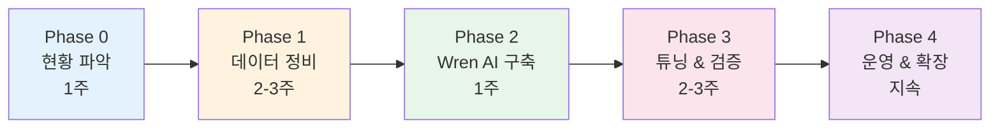
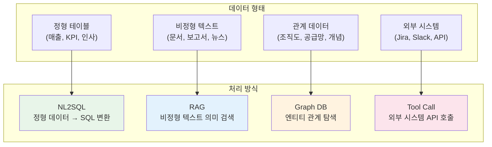
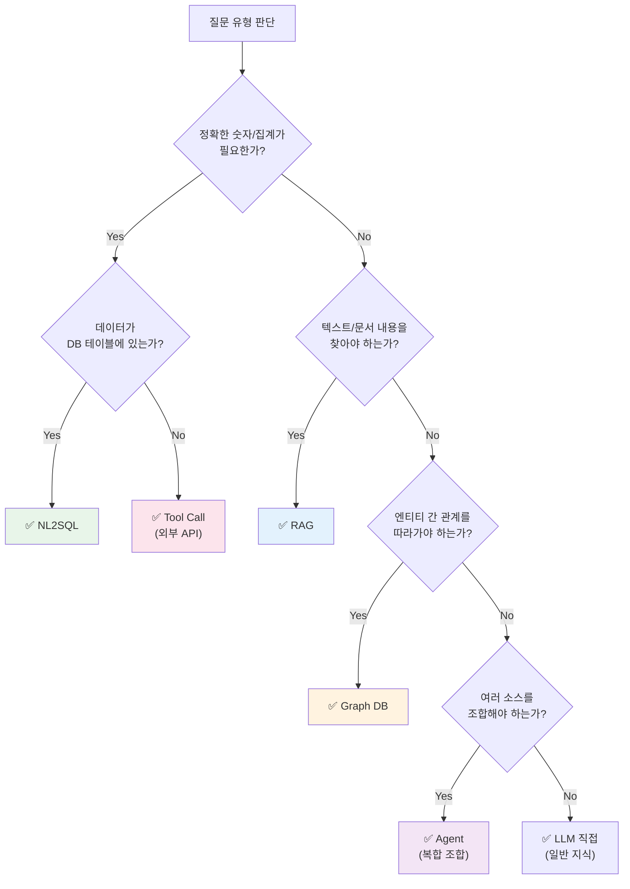
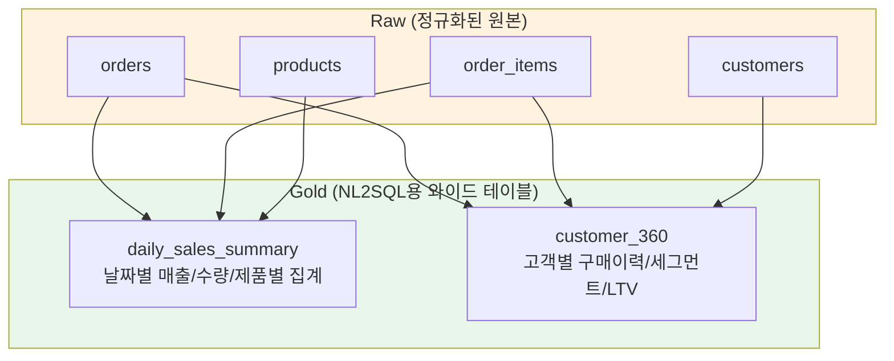
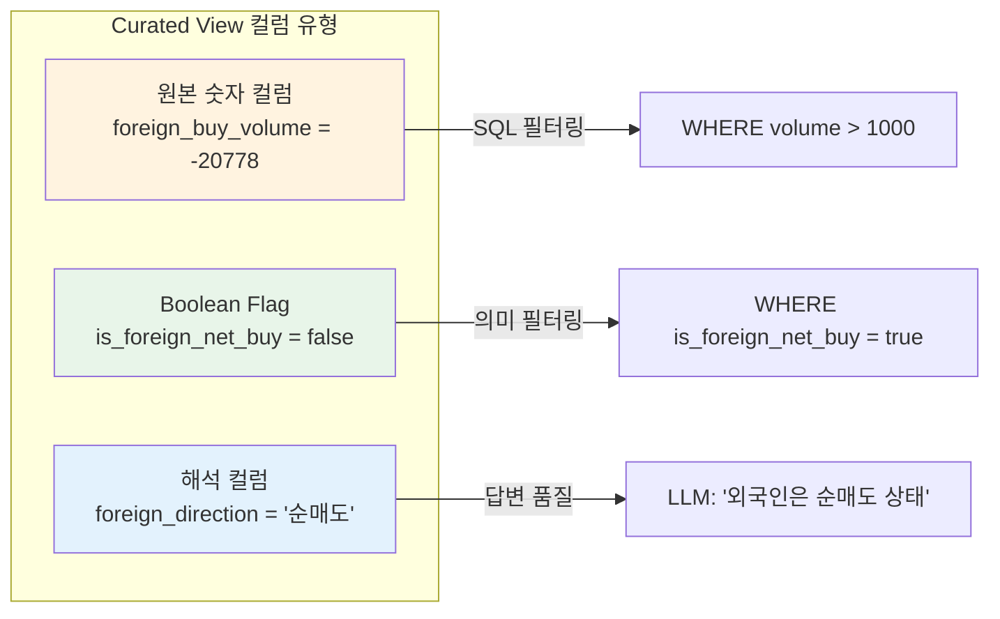
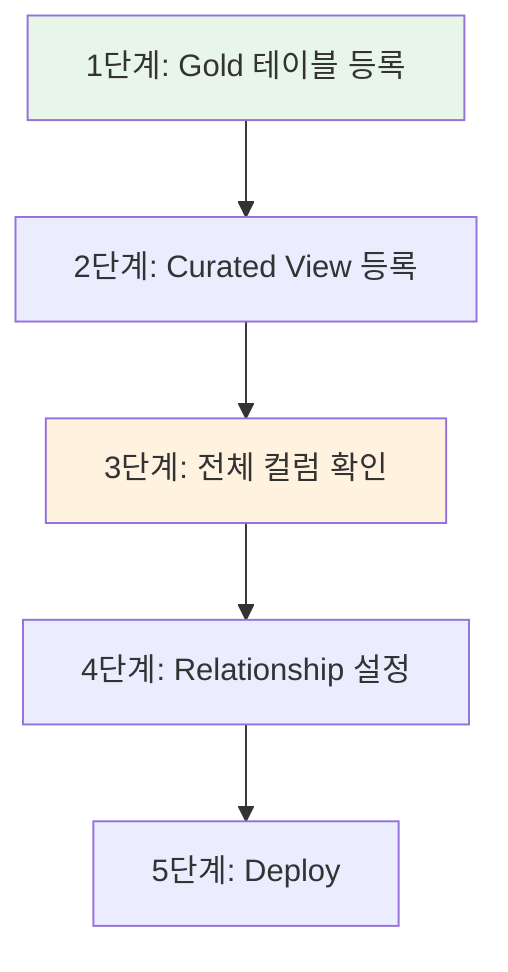
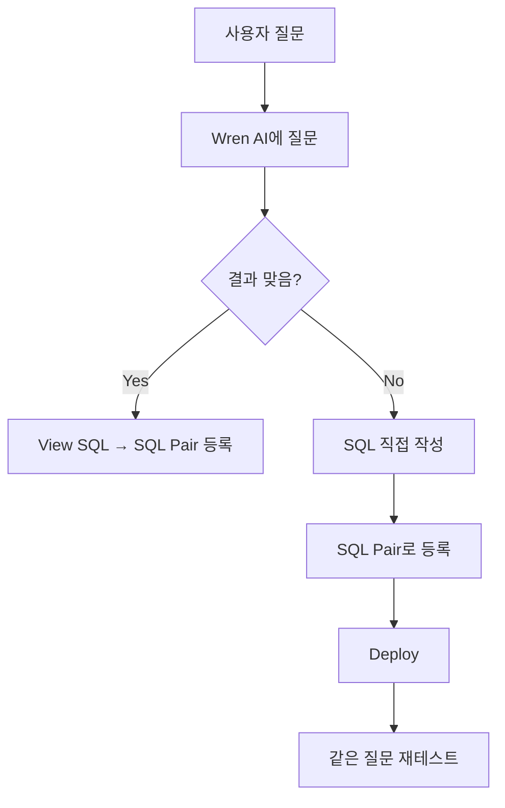
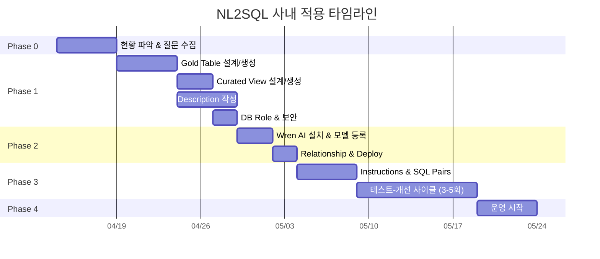

# NL2SQL 사내 적용 플레이북

> **목적:** BIP-Pipeline 구축 경험을 바탕으로, 사내 업무 데이터에 NL2SQL을 적용할 때의 단계별 실행 가이드.
>
> **전제:** Wren AI + PostgreSQL 기반. 다른 DB/도구도 원리는 동일.
>
> **핵심 교훈:** NL2SQL 품질은 LLM이 아니라 **데이터 정비 품질**이 결정한다. (LLM 50%, 스키마/컨텍스트 30%, SQL 검증 15%, 도구 5%)

---

## 전체 로드맵



> **가장 중요한 단계는 Phase 1 (데이터 정비)이다.** Phase 2~3은 기계적 작업에 가깝지만, Phase 1을 잘못하면 나머지가 다 틀어진다.

---

## 사전 지식: 데이터/질문 유형별 처리 방식 분류

Phase 0에서 현황을 파악하기 전에, **어떤 데이터/질문을 어떤 방식으로 처리해야 하는지** 판단 기준을 먼저 이해해야 한다. 이 분류를 잘못하면 NL2SQL로 풀 수 없는 것을 NL2SQL에 넣거나, SQL로 간단히 풀 수 있는 것을 RAG로 처리하는 비효율이 발생한다.

### 4가지 처리 방식



### 판단 결정 트리



### 방식별 상세 비교

| 기준 | NL2SQL | RAG | Graph DB | Tool Call |
|------|:-:|:-:|:-:|:-:|
| **데이터 형태** | 정형 테이블 | 비정형 텍스트 | 관계/그래프 | 외부 시스템 |
| **정확도** | 100% (결정론적) | 중간 (확률적) | 높음 (구조적) | 높음 (API 의존) |
| **질문 키워드** | "얼마" "몇 개" "상위 N" "비교" | "관련 내용" "찾아줘" "요약" | "관련된" "소속" "경쟁사" "상위 조직" | "지금" "현재" "실시간" |
| **응답 형태** | 숫자, 테이블 | 텍스트 단락 | 엔티티 목록, 경로 | 다양 |
| **응답 속도** | ~10s | ~5s | ~1s | API 의존 |
| **구축 난이도** | 중 (데이터 정비 핵심) | 낮음 (임베딩만) | 높음 (스키마 설계) | 낮음 (API 래퍼) |
| **유지 비용** | 중 (SQL Pairs 관리) | 낮음 (문서 업데이트) | 중 (관계 갱신) | 낮음 |

### 실무 질문 분류 예시

#### 일반 사내 업무

| 질문 | 방식 | 이유 |
|------|:----:|------|
| "이번 분기 매출 얼마야?" | NL2SQL | 정확한 숫자, DB 테이블 |
| "매출 상위 5개 팀" | NL2SQL | 집계 + 정렬 |
| "전월 대비 매출 증감률" | NL2SQL | 시계열 비교 계산 |
| "VIP 고객 중 이탈 위험자" | NL2SQL | boolean flag 활용 가능 |
| "지난 회의에서 결정된 사항" | RAG | 회의록(비정형) 검색 |
| "ISO 인증 절차 알려줘" | RAG | 사내 규정 문서 검색 |
| "이 제품 관련 클레임 내용" | RAG | 클레임 보고서 검색 |
| "김철수 팀장의 결재선" | Graph DB | 조직도 관계 탐색 |
| "A프로젝트와 관련된 부서들" | Graph DB | 프로젝트-부서 관계 |
| "이 부서의 하위 조직 전체" | Graph DB | 계층 구조 탐색 |
| "Jira 미해결 티켓 몇 개?" | Tool Call | 외부 시스템 API |
| "지금 Jenkins 빌드 상태" | Tool Call | 실시간 외부 시스템 |
| "Slack에서 최근 공유된 링크" | Tool Call | 외부 시스템 API |
| "매출 하락 팀의 관련 클레임 요약" | **Agent** | NL2SQL(매출) + RAG(클레임) |
| "김철수 팀 이번 분기 성과 + 관련 보고서" | **Agent** | Graph(팀원) + NL2SQL(성과) + RAG(보고서) |

#### BIP 투자 도메인

| 질문 | 방식 | 이유 |
|------|:----:|------|
| "삼성전자 PER" | NL2SQL | 정형 데이터 조회 |
| "저평가주 찾아줘" | NL2SQL | boolean flag 필터링 |
| "삼성전자 실적 발표 관련 뉴스" | RAG | 뉴스(비정형) 검색 |
| "DART 공시 요약" | RAG | 공시 문서 검색 |
| "삼성전자 경쟁사는?" | Graph DB | COMPETITOR 관계 |
| "반도체 관련주 전체" | Graph DB | IS_A 섹터 관계 확장 |
| "한투 API 현재 체결가" | Tool Call | 외부 API 실시간 |
| "삼성전자 실적 발표 후 경쟁사 주가 반응" | **Agent** | Graph(경쟁사) → NL2SQL(주가) + RAG(뉴스) |

### 핵심 판단 원칙

**1. 정확한 숫자 → 반드시 NL2SQL**
> LLM이 직접 계산하면 틀린다. RAG로 "매출 3억"이라는 문서를 찾아도 최신값인지 보장 못 한다. DB가 SSOT(Single Source of Truth).

**2. "찾아줘" → RAG, "알려줘" → NL2SQL**
> "품질 보고서 찾아줘" → RAG (문서 검색)
> "불량률 알려줘" → NL2SQL (숫자 조회)

**3. "관련된"이 나오면 Graph DB를 의심**
> "관련 부서", "관련 프로젝트", "경쟁사", "상위 조직" — 이런 관계는 SQL JOIN으로 표현하기 어렵고 그래프 탐색이 자연스럽다.

**4. "지금/현재" → Tool Call**
> DB에 없는 실시간 데이터는 외부 API를 직접 호출해야 한다.

**5. 복합 질문 → Agent가 분배**
> 하나의 방식으로 풀리지 않으면 Agent가 질문을 분해하여 적합한 Tool을 순차/병렬 호출한다.

### Phase 0에서 이 기준으로 해야 할 일

사내 데이터를 대상으로 수집한 질문 유형(10-20개)을 위 기준에 따라 분류한다:

| # | 질문 예시 | 방식 | 대상 데이터 | 우선순위 |
|:-:|---------|:----:|-----------|:-------:|
| 1 | 이번 달 매출 | NL2SQL | sales_summary | Phase 1 |
| 2 | ISO 규정 검색 | RAG | 규정 문서 | Phase 2+ |
| 3 | 결재선 조회 | Graph DB | 조직도 | Phase 3+ |
| 4 | Jira 현황 | Tool Call | Jira API | Phase 2+ |

**Phase 1에서는 NL2SQL 대상만 집중한다.** RAG/Graph/Tool은 Phase 2 이후에 순차적으로 추가.

---

## Phase 0: 현황 파악 (1주)

### 0-1. 대상 데이터 인벤토리

**무엇:** NL2SQL로 질의할 대상 테이블/뷰를 식별한다.

**BIP 경험:** 처음에 39개 테이블 전체를 등록하려 했으나, 실제로 NL2SQL에 필요한 건 **Gold 테이블 3개 + Curated View 4개 = 7개**뿐이었다. 나머지는 Raw/Derived 데이터로, LLM이 직접 접근하면 오히려 혼란을 일으켰다.

**체크리스트:**
- [ ] 전체 테이블/뷰 목록 작성
- [ ] 각 테이블의 용도 분류 (Raw / Derived / Reporting / 민감)
- [ ] 사용자가 실제로 물어볼 질문 유형 10-20개 수집
- [ ] 해당 질문에 답하려면 어떤 테이블이 필요한지 매핑

**산출물:**

| 테이블 | 용도 | NL2SQL 대상 | 이유 |
|--------|------|:-:|------|
| orders | Raw | ❌ | 정규화된 원본, JOIN 필요 |
| order_items | Raw | ❌ | 단독으로 의미 없음 |
| daily_sales_summary | Reporting | ✅ | 미리 집계된 리포팅 테이블 |
| customer_segments | Derived | ✅ | 비즈니스 분류 포함 |
| users | 민감 | ❌ | 개인정보, LLM 접근 금지 |

### 0-2. 질문 유형 수집

**무엇:** 실제 사용자(현업)가 할 만한 질문을 수집한다.

**BIP 경험:** 개발자가 상상한 질문과 실제 사용자 질문이 달랐다. "삼성전자 PER"은 잘 되지만, 사용자는 "현차 PER"(약칭), "저평가주 찾아줘"(추상 개념)처럼 물었다.

**방법:**
1. 현업 담당자 인터뷰 (5-10명)
2. 기존 데이터 요청 이력 (Jira, Slack, 이메일) 분석
3. 기존 대시보드에서 자주 보는 지표 목록화

**산출물 예시:**

| # | 질문 예시 | 난이도 | 필요 테이블 |
|:-:|---------|:-----:|-----------|
| 1 | 이번 달 매출 얼마야? | 쉬움 | daily_sales_summary |
| 2 | 매출 상위 5개 제품 | 쉬움 | daily_sales_summary |
| 3 | 지난 분기 대비 매출 증감 | 중간 | daily_sales_summary (시계열) |
| 4 | VIP 고객 중 이탈 위험 있는 사람 | 어려움 | customer_segments + orders |
| 5 | 마케팅 캠페인별 ROI | 어려움 | campaigns + orders (복합 JOIN) |

### 0-3. 보안 요구사항 정리

**무엇:** LLM/NL2SQL이 접근해서는 안 되는 데이터를 식별한다.

**BIP 경험:** `portfolio`, `users`, `holding`, `transaction` 등 개인 재무 데이터를 민감 테이블로 분류하고, 전용 DB role(`nl2sql_exec`)로 접근을 차단했다. 이 작업을 Phase 2 이후에 했다가 보안 감사에서 지적받을 뻔했다.

**체크리스트:**
- [ ] 민감 테이블 목록 (개인정보, 급여, 인사, 재무 등)
- [ ] 민감 컬럼 목록 (주민번호, 연봉, 비밀번호 등)
- [ ] NL2SQL 전용 DB role 생성 계획
- [ ] 감사 로그 요구사항

---

## Phase 1: 데이터 정비 (2-3주)

> **이 단계가 전체 품질의 80%를 결정한다.**

### 1-1. Gold Table 설계

**무엇:** Raw 테이블을 pre-join하여 NL2SQL 친화적인 와이드 테이블을 만든다.

**왜 필요한가 (BIP 경험):**
- Raw 테이블은 정규화되어 있어서 LLM이 3-4개 테이블을 JOIN해야 하는데, **LLM의 JOIN 정확도가 매우 낮다**
- 특히 조건 필터 + JOIN이 동시에 있으면 실패율이 급증
- Gold 테이블에 미리 JOIN + 계산을 해두면 LLM은 **단일 테이블 SELECT만** 하면 된다

**설계 원칙:**



**핵심 규칙:**
1. **Grain(입도)을 명확히 정의**: "이 테이블의 1행은 무엇인가?" (날짜별 1행? 고객별 1행? 날짜+제품별 1행?)
2. **단위를 통일**: 금액은 모두 원 단위, 비율은 모두 %로 — BIP에서 시총이 "억원"과 "원"이 섞여있어서 PER 계산이 0으로 나왔던 경험
3. **미리 계산할 수 있는 건 컬럼으로**: 증감률, 비율, 누적합 등을 SQL에서 미리 계산
4. **이름을 직관적으로**: `col_a`가 아니라 `revenue`, `customer_count` — LLM은 컬럼명으로 의미를 추론

**BIP에서 만든 Gold 테이블 예시:**

| Gold 테이블 | Grain | 원본 테이블 | 미리 계산한 것 |
|-----------|-------|-----------|-------------|
| analytics_stock_daily | 종목×일자 | stock_price + indicators + flow | RSI, MACD, 이동평균, 수급 합산 |
| analytics_valuation | 종목×연도 | financial_statements + stock_info + consensus | PER, PBR, ROE, 성장률 |
| analytics_macro_daily | 일자 | 여러 매크로 API | 환율, 금리, 지수 — 한 행에 모두 |

### 1-2. Curated View 설계 (Boolean Flag)

**무엇:** Gold 테이블 위에 **boolean 플래그**를 추가한 View를 만든다.

**왜 필요한가 (BIP 경험):**
- "저평가주 찾아줘"라고 물으면 LLM은 `WHERE PER < 10 AND PBR < 1`을 스스로 만들어야 하는데, **기준이 맞는지 보장할 수 없다**
- `is_value_stock = true`라는 boolean 컬럼이 있으면 LLM은 **단순 필터링만** 하면 된다
- Boolean flag 사용률이 0% → 87%로 올라간 것이 Phase 1 최대 성과였다

**설계 패턴:**

```sql
-- 비즈니스 규칙을 boolean 컬럼으로 고정
CREATE VIEW v_customer_signals AS
SELECT
    c.*,
    -- 비즈니스 정의를 SQL로 고정
    (c.total_purchases >= 10 AND c.avg_order_value >= 50000) AS is_vip,
    (c.last_purchase_date < CURRENT_DATE - INTERVAL '90 days') AS is_churning,
    (c.total_purchases = 1 AND c.signup_date > CURRENT_DATE - INTERVAL '30 days') AS is_new,
    (c.return_rate > 0.3) AS is_high_return
FROM customer_360 c;
```

**BIP에서 만든 boolean 플래그:**

| View | 플래그 | 비즈니스 정의 |
|------|--------|------------|
| v_valuation_signals | is_value_stock | PER < 10 AND PBR < 1 |
| v_valuation_signals | is_growth_stock | 매출성장률 > 20% AND 영업이익 성장률 > 20% |
| v_technical_signals | is_oversold_rsi | RSI14 < 30 |
| v_technical_signals | is_volume_spike | 거래량 / 20일 평균 > 3배 |
| v_flow_signals | is_foreign_net_buy | 외국인 순매수량 > 0 |

### 1-3. 해석 컬럼 추가 (Interpretation Column)

**무엇:** 숫자 컬럼의 의미를 LLM이 오해할 수 있는 경우, **텍스트 해석 컬럼**을 View에 추가한다.

**왜 필요한가 (BIP 경험):**

Wren AI의 답변 생성(sql_answer) 파이프라인은 SQL 실행 결과만 LLM에 넘기고 **컬럼 description은 전달하지 않는다.** 따라서 description에 "음수는 정상값"이라고 아무리 상세히 적어도, 답변 생성 시 LLM은 그 정보를 모른 채 데이터만 보고 해석한다.

```
문제 상황:
  컬럼: foreign_buy_volume = -20,778
  Description: "양수=순매수, 음수=순매도. 음수는 정상값" (SQL 생성 시만 참조)
  LLM 답변: "음수값 -20,778은 이상치일 수 있습니다" ❌ (description 못 봄)

해결:
  컬럼 추가: foreign_direction = '순매도'
  LLM 답변: "외국인은 순매도 상태입니다" ✅ (텍스트를 직접 봄)
```

**이 패턴이 필요한 경우:**
- 양수/음수가 방향성을 가진 컬럼 (순매수/순매도, 유입/유출, 증가/감소)
- NULL이 특별한 의미를 가진 컬럼 ("데이터 없음" vs "0")
- 숫자 범위에 따라 해석이 달라지는 컬럼 (RSI 30 미만 = 과매도)

**설계 패턴:**

```sql
-- 숫자 → 텍스트 해석 컬럼 추가
CREATE VIEW v_flow_signals AS
SELECT
    *,
    -- 해석 컬럼: LLM이 답변 생성 시 직접 참조
    CASE
        WHEN foreign_buy_volume IS NULL THEN '데이터없음'
        WHEN foreign_buy_volume > 0 THEN '순매수'
        WHEN foreign_buy_volume < 0 THEN '순매도'
        ELSE '보합'
    END AS foreign_direction,
    CASE
        WHEN institution_buy_volume IS NULL THEN '데이터없음'
        WHEN institution_buy_volume > 0 THEN '순매수'
        WHEN institution_buy_volume < 0 THEN '순매도'
        ELSE '보합'
    END AS institution_direction
FROM analytics_stock_daily;
```

**사내 적용 예시:**

| 원본 컬럼 | 오해 가능성 | 해석 컬럼 | 값 |
|----------|-----------|---------|-----|
| net_amount (-500) | "손실?" | amount_direction | '지출' |
| balance_change (-100) | "오류?" | change_type | '감소' |
| temperature (38.5) | "높은?" | temp_status | '발열' |
| score (25) | "낮은?" | score_grade | 'F등급' |
| days_since_login (90) | "숫자만" | activity_status | '이탈위험' |

**핵심:** Boolean flag는 "어떤 종목이 해당되는지" 필터링용이고, 해석 컬럼은 "이 숫자가 무엇을 의미하는지" LLM의 답변 품질 향상용이다. 둘 다 Curated View에 추가하되 역할이 다르다.



### 1-4. 컬럼 Description 작성

**무엇:** 모든 대상 테이블/뷰의 컬럼에 비즈니스 설명을 작성한다.

**왜 필요한가 (BIP 경험):**
- `op_profit_growth`라는 컬럼명만으로 LLM이 "영업이익 성장률(%)"이라는 것을 정확히 알 수 없다
- description이 없으면 LLM이 잘못된 컬럼을 선택하거나 무시한다
- BIP에서 description 추가 전후로 SQL 정확도가 체감상 크게 달라졌다

**작성 규칙:**
1. **비즈니스 용어**로 작성 (기술 용어 X)
2. **단위** 명시 (원, %, 건, 명)
3. **계산식** 포함 (어떻게 계산된 컬럼인지)
4. **가능한 값** 예시 (enum, boolean)

**좋은 예 vs 나쁜 예:**

| 컬럼 | ❌ 나쁜 description | ✅ 좋은 description |
|------|-------------------|-------------------|
| revenue | 매출 | 연간 매출액 (원 단위). financial_statements에서 추출한 확정 실적 |
| is_value_stock | 저평가 여부 | PER 10 이하이면서 PBR 1 이하인 저평가 종목 여부 (boolean) |
| change_pct | 변동률 | 전일 대비 종가 변동률 (%). 양수=상승, 음수=하락 |
| data_type | 데이터 유형 | actual=확정 실적(연간), estimate=컨센서스 추정치, preliminary=잠정 실적(분기) |

### 1-4. DB COMMENT 반영

**무엇:** 작성한 description을 PostgreSQL의 `COMMENT ON COLUMN`으로 반영한다.

**왜:** DB 자체에 메타데이터가 있으면 어떤 도구에서든 참조 가능. OpenMetadata 같은 카탈로그와 동기화의 기반이 된다.

```sql
COMMENT ON TABLE daily_sales_summary IS '일별 매출 요약. Grain: 날짜×제품카테고리. 매일 00:30 KST 갱신.';
COMMENT ON COLUMN daily_sales_summary.revenue IS '해당 일자/카테고리 매출 합계 (원 단위)';
COMMENT ON COLUMN daily_sales_summary.is_promotion IS '프로모션 적용 여부 (boolean). 프로모션 기간 중이면 true';
```

### 1-5. NL2SQL 전용 DB Role 생성

**무엇:** NL2SQL이 사용할 최소 권한 DB 계정을 만든다.

**BIP 경험:** 처음에 관리자 계정으로 테스트하다가 보안 리뷰에서 지적받았다. 전용 role을 만들면 민감 테이블 접근이 DB 레벨에서 차단된다.

```sql
-- 전용 role 생성
CREATE ROLE nl2sql_reader LOGIN PASSWORD '...';

-- NL2SQL 대상 테이블만 GRANT
GRANT SELECT ON daily_sales_summary TO nl2sql_reader;
GRANT SELECT ON customer_360 TO nl2sql_reader;
GRANT SELECT ON v_customer_signals TO nl2sql_reader;

-- 민감 테이블은 GRANT 안 함 → 접근 자체가 불가
-- users, salaries, hr_records 등은 GRANT 없음
```

---

## Phase 2: Wren AI 구축 (1주)

### 2-1. Wren AI 설치

**BIP 경험:** Docker Compose로 5개 컨테이너 (UI, Engine, Ibis, AI Service, Qdrant). 설치 자체는 30분이면 되지만, DB 연결 설정에서 시간을 많이 소비.

**핵심 설정:**
- DB 연결: NL2SQL 전용 role 사용
- LLM: GPT-4.1-mini 추천 (속도/품질/비용 균형 최적)
- Qdrant: 재시작 시 `recreate_index: true`로 임베딩 재생성

### 2-2. 모델 등록 — 순서가 중요

**등록 순서:**



**BIP에서 겪은 실수들:**

| 실수 | 증상 | 원인 | 방지 |
|------|------|------|------|
| `fields: ["ticker"]`로만 등록 | boolean 플래그 0% 사용 | API 호출 시 컬럼 목록 누락 | **등록 후 반드시 컬럼 수 검증** |
| `updateModel`로 컬럼 추가 시도 | 기존 30개 컬럼 전부 삭제됨 | updateModel의 fields가 교체 방식 | **모델 삭제 후 재생성** |
| Relationship 설정 안 함 | Cross-model JOIN SQL 생성 불가 | 관계 미정의 | **모든 공유 키에 Relationship 설정** |
| 모델 삭제/재생성 | 기존 Relationship CASCADE 삭제 | FK 제약 | **재생성 후 Relationship 재설정** |

**컬럼 수 검증 (필수):**

```bash
# 등록 후 반드시 실행: Wren AI 컬럼 수 == DB 컬럼 수 확인
# 불일치하면 모델 삭제 후 전체 컬럼으로 재생성
```

### 2-3. Description 동기화

**무엇:** DB COMMENT → Wren AI 모델 description으로 동기화.

**BIP 경험:** Airflow DAG (`10_sync_metadata_daily`)로 자동화. 모델 재생성 시 description이 초기화되므로 동기화 재실행 필수.

### 2-4. Relationship 설정

**규칙:**
- 2개 모델 간에만 정의 가능 (3-way 불가)
- 공통 키 (예: `ticker`, `customer_id`)로 연결
- Grain이 다른 테이블은 **직접 Relationship 금지** → 중간 View로 grain 변환 후 연결

**BIP 예시:**

```
stock_info (종목 마스터)
  ↑ MANY_TO_ONE (ticker)
  ├── analytics_stock_daily (일별 시세)
  ├── v_latest_valuation (최신 밸류에이션 — grain 변환 View)
  ├── v_valuation_signals (밸류에이션 boolean)
  ├── v_technical_signals (기술적 boolean)
  └── v_flow_signals (수급 boolean)
```

### 2-5. Deploy

Wren AI UI에서 "Deploy" 클릭 → Qdrant 임베딩 재생성. **모든 모델/관계/description 변경 후 반드시 Deploy.**

---

## Phase 3: 튜닝 & 검증 (2-3주)

### 3-1. Instructions 등록

**무엇:** LLM에게 전역 규칙을 알려준다.

**BIP에서 등록한 4개 Instructions:**

| 규칙 | 왜 필요했나 |
|------|-----------|
| 종목명 한글 필수 + ETF 제외 | LLM이 "하이닉스"를 "Hynix"로 영문 번역, KODEX ETF를 잘못 매칭 |
| 계산식 힌트 (거래대금 = close × volume 등) | 컬럼에 없는 파생 지표를 SQL로 계산하도록 |
| data_type 설명 (actual/estimate/preliminary) | "연도별 실적"에서 data_type 필터를 잘못 걸어 데이터 누락 |
| 검색 결과에 stock_name 포함 | 티커만 반환하면 사용자가 어떤 종목인지 모름 |

**사내 적용 시 예상 Instructions:**

| 규칙 | 예시 |
|------|------|
| 날짜 범위 기본값 | "최근"이라고 하면 최근 30일로 해석 |
| 부서명 정확 매칭 | "개발팀" → 정확히 '개발팀'으로 검색, '개발1팀' 등 포함 금지 |
| 금액 단위 | 결과에 단위(원, 천원, 백만원) 명시 |
| NULL 처리 | 데이터 없으면 0이 아니라 "데이터 없음"으로 표시 |

> **주의: Instructions는 3-5개로 최소화.** 너무 많으면 LLM이 혼란. SQL Pairs가 더 효과적.

### 3-2. SQL Pairs 등록 — 가장 효과적인 튜닝 수단

**무엇:** 질문-SQL 쌍을 등록하여 Few-shot 예시로 활용.

**BIP 경험:** SQL Pairs 29개 → 70개로 늘리면서 A등급 비율이 58% → 100%로 향상. **가장 ROI가 높은 활동.**

**등록 전략:**



**카테고리별 목표:**

| 카테고리 | 목표 수량 | 예시 |
|---------|:-------:|------|
| 기본 조회 | 10-15개 | "이번 달 매출", "매출 상위 제품" |
| 시계열 | 10개 | "최근 3개월 매출 추이", "전월 대비 증감" |
| 비교 분석 | 10개 | "A팀 vs B팀 실적", "제품별 마진 비교" |
| 복합 조건 | 10개 | "매출 상위이면서 마진 높은 제품" |
| Boolean 활용 | 10개 | "VIP 고객 중 이탈 위험", "재구매 고객" |
| 집계/순위 | 10개 | "지역별 매출 순위", "월별 고객 수 추이" |
| **합계** | **60-70개** | |

### 3-3. 테스트-개선 사이클

**BIP 경험: 4차례 테스트 → 개선 사이클**

```
1차 (기본): 75% → SQL Pairs 추가
2차 (보강): 85% → Curated View 추가
3차 (LLM 변경): 100% SQL 생성 → boolean 0% 발견
4차 (컬럼 재등록): 100% SQL + 87% boolean
```

**테스트 방법:**

1. **15-20개 표준 질문 세트** 준비
2. API로 SQL 생성 → DB에서 실행 → 결과 검증
3. 실패 케이스 → SQL Pair 등록 또는 Instructions 추가
4. Deploy 후 재테스트
5. **3-5회 반복**하면 80-90% 정확도 달성

**자동화 스크립트 (BIP에서 사용):**

```bash
# scripts/wren_nl2sql_phase1_test.py
export PG_PASSWORD=<password>
export PG_HOST=localhost
python3 scripts/wren_nl2sql_phase1_test.py
# → reports/wren_phase1_results.json (결과 리포트)
```

### 3-4. 흔한 실패 패턴과 대응

**BIP에서 겪은 실패들:**

| 실패 패턴 | 증상 | 원인 | 해결 |
|----------|------|------|------|
| 약칭 매핑 | "현차 PER" → 0행 | LIKE '%현차%' 매칭 실패 | SQL Pair 또는 Phase 2 Entity Resolver |
| 영문 번역 | "셀트리온" → `'Celltrion'` | LLM이 한글→영문 변환 | Instructions에 "한글 필수" 규칙 |
| ETF/펀드 오매칭 | "하이닉스" → KODEX ETF | LIKE 패턴에 ETF 포함 | Instructions에 ETF 제외 규칙 |
| data_type 필터 | 특정 유형만 조회 | 컬럼 의미 모름 | description + Instructions |
| 답변 환각 | SQL 결과는 있는데 "없다"고 답변 | Wren AI sql_answer 파이프라인 한계 | 구조적 한계 (Phase 2 Agent에서 해결) |
| 0행 반환 | SQL은 맞지만 데이터 없음 | 데이터 수집 문제 (NL2SQL과 무관) | 데이터 파이프라인 점검 |

---

## Phase 4: 운영 & 확장 (지속)

### 4-1. 일상 운영

| 작업 | 주기 | 방법 |
|------|------|------|
| Description 동기화 | 매일 | Airflow DAG 자동 실행 |
| SQL Pairs 추가 | 주 1-2회 | 실패 케이스 수집 → SQL Pair 등록 |
| 품질 테스트 | 주 1회 | 자동화 스크립트 실행 |
| Deploy | 변경 시마다 | 모델/SQL Pairs/Instructions 변경 후 |

### 4-2. 확장 시 고려사항

**새 테이블 추가 시:**
1. Gold Table 또는 Curated View로 가공
2. 컬럼 description 작성
3. DB COMMENT 반영
4. Wren AI 모델 등록 (전체 컬럼 확인)
5. Relationship 설정
6. SQL Pairs 5-10개 추가
7. Deploy
8. 테스트

**새 비즈니스 규칙 추가 시:**
1. Curated View에 boolean 컬럼 추가
2. Description 작성
3. Wren AI 모델 재생성 (컬럼 추가)
4. SQL Pair 등록
5. Deploy

### 4-3. Phase 2 이후 (LangGraph 에이전트)

NL2SQL 단독으로 해결 불가능한 영역:

| 한계 | 해결 방향 |
|------|---------|
| 약칭 → 정식명 변환 | Entity Resolver 노드 |
| 멀티스텝 쿼리 | Query Planner 노드 |
| 비정형 데이터 (문서, 뉴스) | RAG Tool |
| 관계 추론 ("경쟁사는?") | Knowledge Graph Tool |
| 답변 품질 제어 | Result Synthesizer 노드 |

---

## 체크리스트 (전체)

### Phase 0 완료 조건
- [ ] 대상 테이블 인벤토리 작성
- [ ] 질문 유형 10-20개 수집
- [ ] 민감 테이블 목록 확정
- [ ] NL2SQL 전용 DB role 계획

### Phase 1 완료 조건
- [ ] Gold Table 설계 및 생성
- [ ] Curated View (boolean 플래그) 생성
- [ ] 모든 대상 컬럼에 description 작성
- [ ] DB COMMENT 반영
- [ ] NL2SQL 전용 DB role 생성 + GRANT

### Phase 2 완료 조건
- [ ] Wren AI 설치 + DB 연결
- [ ] 모델 등록 (전체 컬럼 확인)
- [ ] Relationship 설정
- [ ] Description 동기화
- [ ] Deploy 성공

### Phase 3 완료 조건
- [ ] Instructions 3-5개 등록
- [ ] SQL Pairs 60-70개 등록
- [ ] 표준 테스트 15-20개 통과 (90%+ 정확도)
- [ ] 자동화 테스트 스크립트 작성

---

## 타임라인 요약



---

## 참고

- `docs/nl2sql_design.md` — BIP NL2SQL 아키텍처 상세
- `docs/nl2sql_concepts.md` — NL2SQL/시맨틱 레이어/KG 개념 레퍼런스
- `docs/wrenai_technical_guide.md` — Wren AI 설정/운영 가이드
- `docs/wrenai_test_report.md` — BIP 품질 테스트 이력 (4차례 개선 과정)
- `docs/data_modeling_guide.md` — Gold/View/Grain 설계 원칙

---

*이 문서는 BIP-Pipeline 구축 경험(2026-03~04)을 기반으로 작성되었습니다. 실제 사내 적용 시 도메인에 맞게 조정이 필요합니다.*
