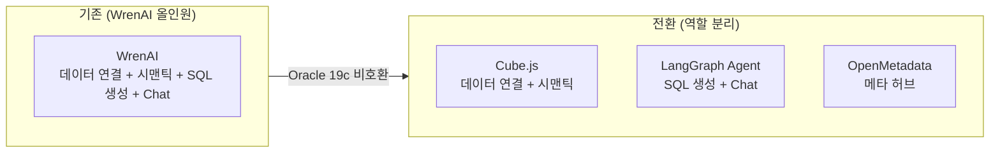
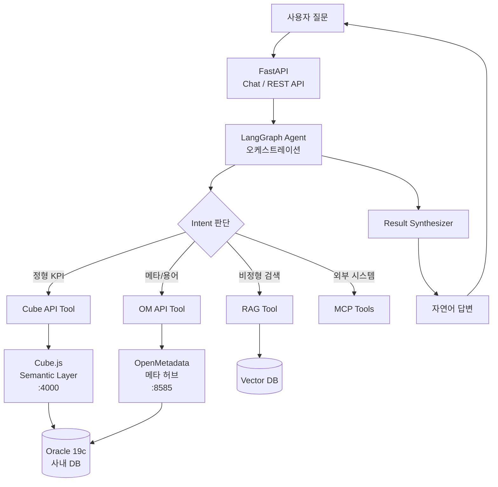
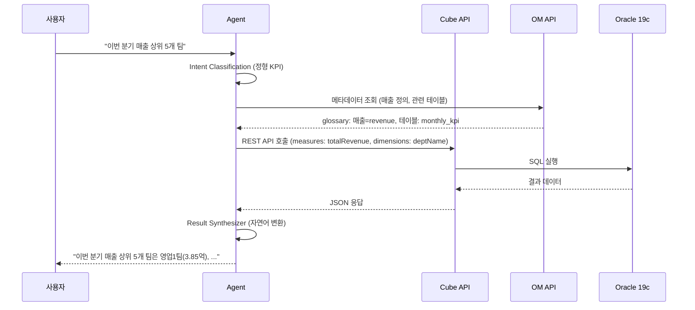
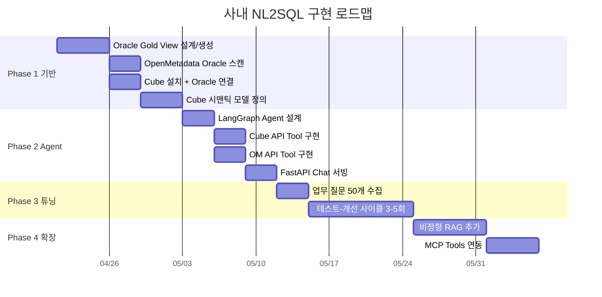
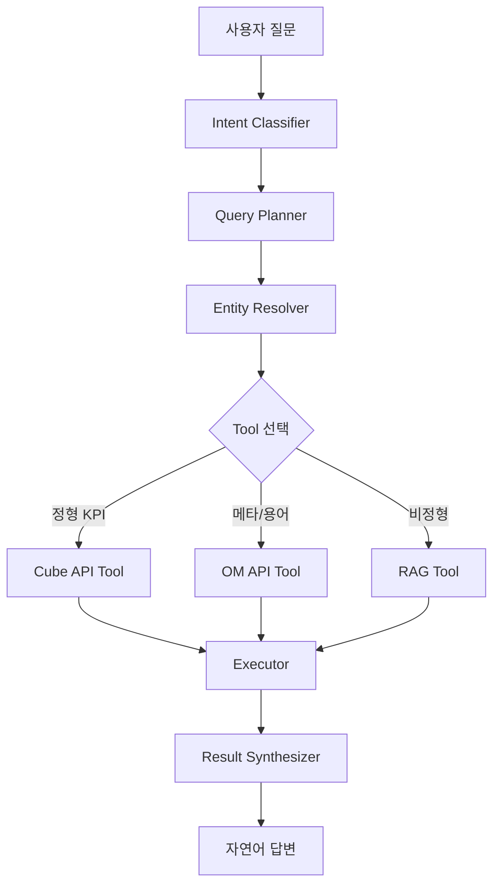
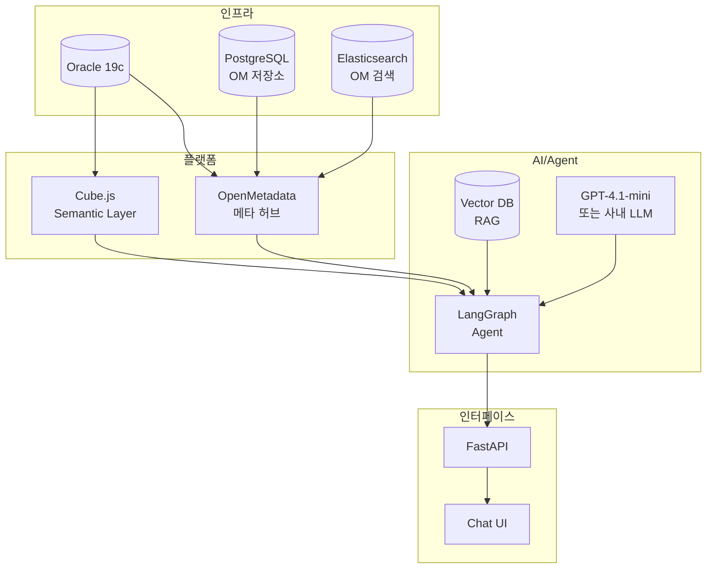

# NL2SQL 사내 적용 구현 계획 v2

> **WrenAI → OpenMetadata + Cube + LLM Agent 전환**
>
> BIP-Pipeline(사외 PostgreSQL)에서 WrenAI 기반 NL2SQL 검증 완료 후, 사내 Oracle 19c 환경 적용 시 WrenAI 호환성 문제 발생으로 아키텍처 전환

---

## 1. 배경

### 1-1. BIP-Pipeline에서 검증한 것

BIP-Pipeline(사외 프로젝트)에서 WrenAI 기반 NL2SQL 시스템을 구축하고 다음을 검증:

| 항목 | 결과 |
|------|------|
| Gold Table + Curated View 설계 | 품질의 80%를 결정하는 핵심 |
| Boolean flag 패턴 | 사용률 0% → 87% 향상 |
| 해석 컬럼(Interpretation Column) 패턴 | sql_answer 환각 해결 |
| LLM 모델 비교 (7개) | GPT-4.1-mini 선정 |
| SQL Pairs (70개) + Instructions (4개) | A등급 100% 달성 |
| 4-layer 보안 | 구문→allowlist→DB role→curated view |
| OM 메타데이터 동기화 | 39 테이블, 77 용어, 전체 lineage |

### 1-2. 사내 적용 시 발생한 문제

사내 DB는 **Oracle 19c**. WrenAI를 Docker Compose로 띄워 Oracle 연결 테스트 시:

```
IBIS_SERVER_ERROR
ORA-00942: table or view does not exist
```

- DB 연결 자체는 성공
- ibis-server 내부의 `get_db_version` 단계에서 실패
- **WrenAI OSS 문서상 Oracle 23ai 이상만 공식 지원**
- Oracle 19c에서는 내부 메타데이터 조회 로직이 호환되지 않음

### 1-3. 전환 결정

WrenAI가 했던 역할을 분리하여 **Oracle 19c 호환 가능한 조합**으로 재구성:



---

## 2. 아키텍처 전환 근거

### 2-1. WrenAI 역할 분해 → 대체 매핑

| WrenAI 역할 | 대체 컴포넌트 | Oracle 19c 호환 |
|------------|-------------|:-:|
| 데이터소스 연결 (ibis-server) | **Cube** (node-oracledb) | ✅ 공식 지원 |
| Semantic Layer (MDL) | **Cube** (메트릭/차원/조인) | ✅ |
| SQL 생성 (LLM + RAG) | **LangGraph Agent** | ✅ |
| SQL 검증 (Engine dry-run) | **Cube API** 레벨 검증 | ✅ |
| 답변 생성 (sql_answer) | **Agent** Result Synthesizer | ✅ |
| 관리 UI | **Cube Playground** + 커스텀 | ✅ |
| 메타데이터/용어 | **OpenMetadata** | ✅ 공식 지원 |

### 2-2. 대안 비교 후 선정

| 대안 | Semantic Layer | Oracle 19c | NL2SQL | 비정형 확장 | 선정 |
|------|:-:|:-:|:-:|:-:|:-:|
| **OM + Cube + Agent** | ✅ 명확 | ✅ 직결 가능 | Agent 구현 | ✅ 유연 | **✅ 선정** |
| OM + dbt + Agent | ✅ 강력 | ⚠️ 커뮤니티 | Agent 구현 | ✅ 유연 | 장기 검토 |
| OM + Vanna | ❌ 약함 | ✅ 직결 | Vanna 내장 | ❌ | 빠른 PoC용 |
| OM + MindsDB | ⚠️ 애매 | ⚠️ 문서만 | 내장 | ⚠️ | 보류 |

### 2-3. Oracle 19c 호환성 검증

```
Cube Oracle Driver
  └→ node-oracledb ^6.2.0
       └→ 공식 테스트 대상: Oracle 23, 21, 19, 12, 11.2
            └→ Oracle 19c 명시적 지원 ✅

OpenMetadata Oracle Connector
  └→ 공식 지원 ✅
```

**WrenAI 실패 원인:** ibis-server의 Oracle 처리 로직이 23ai 전용 (`get_db_version` 등)
**Cube가 되는 이유:** node-oracledb가 Oracle 19c를 직접 지원, Cube는 이 드라이버를 그대로 사용

---

## 3. 목표 아키텍처

### 3-1. 전체 구조



### 3-2. 컴포넌트별 역할

| 컴포넌트 | 역할 | 포트 |
|---------|------|:----:|
| **Oracle 19c** | 사내 원천 DB | 1521 |
| **Cube.js** | Semantic Layer — 메트릭/차원/조인 정의, REST/GraphQL API | 4000 |
| **OpenMetadata** | 메타데이터 허브 — glossary, lineage, description, ownership | 8585 |
| **LangGraph Agent** | NL2SQL 오케스트레이션 — 질문 분해, Tool 호출, 답변 합성 | - |
| **Vector DB** | 비정형 RAG — 문서/뉴스/보고서 임베딩 | - |
| **FastAPI** | Chat/API 서빙 | 8000 |
| **LLM** | GPT-4.1-mini 또는 사내 LLM | - |

### 3-3. 데이터 흐름



### 3-4. BIP 경험 이식 매핑

| BIP 패턴 | 사내 적용 |
|---------|---------|
| Gold Table (analytics_*) | Oracle View (v_sales_summary 등) |
| Curated View (boolean flag) | Cube Dimension (is_large_deal, is_profitable) |
| 해석 컬럼 (foreign_direction) | Cube Dimension (CASE WHEN → 텍스트) |
| SQL Pairs (70개) | Agent Few-shot 예시 |
| Instructions (4개) | Agent System Prompt |
| WrenAI MDL | Cube Data Model (JavaScript) |
| 4-layer 보안 | Oracle role + Cube 접근 제어 |
| OM 동기화 DAG | OM → Cube 메타 동기화 |
| sql_answer 환각 | Agent Result Synthesizer 직접 제어 |
| 1질문=1SQL 제약 | Agent 멀티스텝 쿼리 |

---

## 4. 구현 계획

### 4-1. Phase 로드맵



### 4-2. Phase 1: 기반 구축 (2주)

#### Oracle Gold View 설계

BIP 경험 기반으로 Oracle View 생성:

```sql
-- 매출 요약 Gold View (BIP의 analytics_stock_daily에 대응)
CREATE OR REPLACE VIEW v_sales_summary AS
SELECT
    s.sale_date,
    d.dept_name,
    s.product_name,
    s.category,
    s.total_amount,
    s.customer_name,
    s.region,
    -- Boolean flag (BIP 패턴)
    CASE WHEN s.total_amount >= 100000000 THEN 'Y' ELSE 'N' END AS is_large_deal,
    -- 해석 컬럼 (BIP 패턴)
    CASE
        WHEN s.total_amount >= 100000000 THEN '대형'
        WHEN s.total_amount >= 50000000 THEN '중형'
        ELSE '소형'
    END AS deal_size_label
FROM sales s
JOIN departments d ON s.dept_id = d.dept_id;
```

#### Cube 설치 + Oracle 연결

```yaml
# docker-compose.yml
services:
  cube:
    image: cubejs/cube:latest
    environment:
      CUBEJS_DB_TYPE: oracle
      CUBEJS_DB_HOST: <oracle-host>
      CUBEJS_DB_PORT: 1521
      CUBEJS_DB_NAME: <service-name>
      CUBEJS_DB_USER: <nl2sql-user>
      CUBEJS_DB_PASS: <password>
      CUBEJS_DEV_MODE: "true"
      CUBEJS_API_SECRET: <secret>
    ports:
      - "4000:4000"
    volumes:
      - ./model:/cube/conf/model
```

#### Cube 시맨틱 모델 정의

```javascript
// model/sales.js
cube('SalesSummary', {
  sql: `SELECT * FROM v_sales_summary`,

  measures: {
    totalAmount: { sql: `total_amount`, type: `sum`, title: '총 매출액' },
    dealCount: { type: `count`, title: '거래 건수' },
    avgDealSize: { sql: `total_amount`, type: `avg`, title: '평균 거래 금액' }
  },

  dimensions: {
    saleDate: { sql: `sale_date`, type: `time`, title: '거래일' },
    deptName: { sql: `dept_name`, type: `string`, title: '부서명' },
    category: { sql: `category`, type: `string`, title: '카테고리' },
    isLargeDeal: { sql: `is_large_deal`, type: `string`, title: '대형 거래 여부' },
    dealSizeLabel: { sql: `deal_size_label`, type: `string`, title: '거래 규모' }
  }
});
```

### 4-3. Phase 2: Agent 구축 (2주)

#### LangGraph Agent 설계



#### Cube API Tool 예시

```python
# Agent가 호출하는 Cube API Tool
import requests

def cube_query(measures: list, dimensions: list, filters: list = None):
    """Cube REST API를 호출하여 정형 데이터 조회"""
    query = {
        "measures": measures,
        "dimensions": dimensions,
        "filters": filters or [],
        "limit": 100
    }
    response = requests.post(
        "http://cube:4000/cubejs-api/v1/load",
        headers={"Authorization": CUBE_API_SECRET},
        json={"query": query}
    )
    return response.json()["data"]
```

### 4-4. Phase 3: 튜닝 & 검증 (2주)

BIP에서 검증된 테스트-개선 사이클 적용:

```
1. 업무 질문 50개 수집 (현업 인터뷰)
2. Agent로 질문 → 결과 검증
3. 실패 케이스 → Few-shot 예시 추가 또는 Cube 모델 보강
4. 3-5회 반복하여 80-90% 정확도 달성
```

### 4-5. Phase 4: 확장 (이후)

- 비정형 RAG (문서/보고서/회의록)
- MCP Tools (외부 시스템 API)
- Knowledge Graph (향후)

---

## 5. 보안 아키텍처

BIP 4-layer 패턴을 Oracle 환경에 적용:

| Layer | BIP (PostgreSQL) | 사내 (Oracle 19c) |
|:-----:|---------|---------|
| 1. 구문 검증 | sqlglot AST | Agent 내 검증 |
| 2. 테이블 allowlist | validator_config.py | Cube 모델에 등록된 것만 접근 |
| 3. DB role 격리 | nl2sql_exec (PG) | NL2SQL 전용 Oracle role (SELECT만) |
| 4. Curated View | View에서 민감 컬럼 제외 | 동일 |

```sql
-- Oracle NL2SQL 전용 조회 계정
CREATE USER nl2sql_reader IDENTIFIED BY <password>;
GRANT CREATE SESSION TO nl2sql_reader;
GRANT SELECT ON schema.v_sales_summary TO nl2sql_reader;
GRANT SELECT ON schema.v_dept_performance TO nl2sql_reader;
-- 민감 테이블은 GRANT 없음 → 접근 자체 불가
```

---

## 6. WrenAI 경험에서 배운 교훈

BIP에서 겪은 문제와 새 아키텍처에서의 해결:

| BIP 문제 | 원인 | 새 아키텍처 해결 |
|---------|------|----------------|
| sql_answer 환각 ("데이터 없다"고 거짓 답변) | sql_answer가 description 미참조 | Agent가 직접 답변 생성 → 완전 제어 |
| 1질문=1SQL 제약 | WrenAI 구조적 한계 | Agent 멀티스텝 쿼리 |
| 프롬프트 커스터마이징 불가 | WrenAI 소스 수정 불가 | Agent 프롬프트 완전 제어 |
| OpenAI json_schema 편향 | WrenAI 내부 구현 | Agent에서 LLM 자유 선택 |
| boolean flag 미사용 (0%) | Curated View 컬럼 미등록 | Cube Dimension으로 명시적 정의 |
| 해석 컬럼 필요 | sql_answer가 숫자만 보고 오해석 | Cube Dimension에 CASE WHEN 포함 |
| 약칭 매핑 실패 (현차→현대차) | Entity Resolution 없음 | Agent Entity Resolver 노드 |
| 종목명 영문 번역 | Instructions 간헐적 미준수 | Agent 프롬프트에서 강제 |

---

## 7. 리스크 및 대응

| 리스크 | 영향 | 대응 |
|-------|------|------|
| Cube Oracle 드라이버 community-supported | 공식 지원 없음 | node-oracledb가 19c 명시 지원, 드라이버 레벨 호환성 확보 |
| Oracle 운영 DB 부하 | NL2SQL 쿼리가 운영 영향 | 읽기 전용 replica 사용 또는 Cube pre-aggregation 캐싱 |
| Agent 환각 | 잘못된 수치/결론 | 결정론 우선(Cube 메트릭), LLM은 설명만 |
| LLM 비용 | 운영 비용 증가 | 캐싱, Few-shot 최적화, 사내 LLM 검토 |
| 사내 보안 정책 | 외부 LLM API 사용 불가 시 | 사내 LLM(Ollama 등) 대체, 또는 Azure OpenAI 사내 테넌트 |

---

## 8. 성공 기준

| 지표 | 목표 |
|------|:----:|
| Cube → Oracle 19c 연결 | 성공 |
| 시맨틱 모델 10개 이상 정의 | 10+ |
| Agent 정형 질의 정확도 | 80%+ |
| 업무 질문 50개 커버리지 | 80%+ |
| 평균 응답 시간 | <15s |
| 보안 감사 통과 | Pass |

---

## 9. 기술 스택 요약



---

## 10. 참고 문서

| 문서 | 내용 |
|------|------|
| `docs/nl2sql_design.md` | BIP NL2SQL 아키텍처 (WrenAI 기반) |
| `docs/nl2sql_enterprise_playbook.md` | 사내 적용 플레이북 (데이터 정비 가이드) |
| `docs/nl2sql_concepts.md` | NL2SQL/시맨틱 레이어/KG 개념 레퍼런스 |
| `docs/guide_cubejs.md` | Cube.js 상세 기능/사용 가이드 |
| `docs/guide_dbt.md` | dbt Core 상세 기능/사용 가이드 (장기 대안) |
| `docs/guide_openmetadata.md` | OpenMetadata 상세 기능/사용 가이드 |
| `docs/guide_wrenai.md` | WrenAI 가이드 (BIP 레퍼런스) |
| `docs/wrenai_test_report.md` | WrenAI 품질 테스트 이력 (교훈 참조) |

---

*이 문서는 BIP-Pipeline의 WrenAI 경험을 기반으로 사내 Oracle 19c 환경에 맞는 NL2SQL 아키텍처를 재설계한 것입니다.*

---

## 변경 이력

| 날짜 | 내용 |
|------|------|
| 2026-04-18 | 초안 작성 |
| 2026-04-22 | 문서 헤더 정리 |
