# NL2SQL 사내 적용 구현 계획 v2 — LangGraph + QuerySpec

> **목적:** 사내 Oracle 19c 환경에서 NL2SQL을 실제로 구축하는 **단계별 실행 가이드**. BIP-Pipeline 검증 경험 + WrenAI/Cube 후보 검토 + LangGraph 직접 구현 결정 이력을 단일 문서로 통합.
>
> **이 문서가 답하는 것:**
> - 어떤 아키텍처를 왜 골랐는가 (1장)
> - 무엇을, 언제, 어떻게 만들 것인가 (Phase 0–4)
> - 무엇을 검증해야 하는가 (체크리스트, 평가셋)
>
> **자매 문서:**
> - `docs/nl2sql_enterprise_playbook.md` — 데이터 정비 일반 가이드 (Phase 0~1은 본 문서와 거의 동일)
> - `docs/nl2sql_agent_design.md` — LangGraph Agent + QuerySpec 상세 설계
> - `docs/nl2sql_design.md` — BIP-Pipeline NL2SQL 아키텍처 (WrenAI 기반 레퍼런스)
> - `docs/seminar_semantic_layer.md` — 시맨틱 레이어 개념·도구 비교 세미나

---

## 1. 배경 — 왜 이 아키텍처인가

### 1-1. BIP-Pipeline에서 먼저 검증한 것

사내 적용 전 **사외 BIP-Pipeline(PostgreSQL)** 에서 WrenAI 기반 NL2SQL을 구축하여 다음을 검증했다.

| 항목 | 결과 | 의의 |
|------|------|------|
| Gold Table + Curated View 설계 | 품질의 80% 좌우 | 데이터 정비가 도구보다 중요 |
| Boolean flag 패턴 | 사용률 0% → 87% | 비즈니스 규칙을 SQL로 고정 |
| 해석 컬럼 (Interpretation Column) | sql_answer 환각 해결 | LLM이 숫자를 직접 해석하지 않게 |
| LLM 모델 비교 (7개) | GPT-4.1-mini 선정 | 속도·품질·비용 균형 |
| SQL Pairs 70개 + Instructions 4개 | A등급 100% | Few-shot이 가장 효과적 튜닝 수단 |
| 4-Layer 보안 | 구문→allowlist→DB role→curated | 단일 방어선 부족 |
| OM 메타데이터 동기화 | 39 테이블, 77 용어 | 메타 허브 단일화 가능성 |

**핵심 교훈:** "도구 50%, 데이터 정비 50%"가 아니라 **"데이터 정비 80% / 도구 20%"** 다. 도구 교체 시에도 Phase 0–1의 산출물은 그대로 재사용 가능.

### 1-2. 사내 환경 제약

| 제약 | 영향 |
|------|------|
| **Oracle 19c** | WrenAI ibis-server는 Oracle 23ai 전용 (`get_db_version` 등 19c와 호환 안 됨) |
| **외부 LLM API 제한 가능성** | OpenAI 직접 호출 불가, 사내 LLM(Azure OpenAI 사내 테넌트, 사내 LLaMA 등) 또는 LiteLLM 어댑터 필요 |
| **읽기 전용 정책** | 운영 DB에 대한 INSERT/UPDATE는 절대 금지, NL2SQL 전용 read-only role 필수 |
| **감사 요구사항** | 모든 LLM 호출 + 생성 SQL + 실행 결과를 감사 로그에 기록 |
| **민감 테이블** | 인사·재무·개인정보 테이블은 LLM 접근 자체 차단 (DB role 레벨) |

### 1-3. 후보 도구 검토 결과

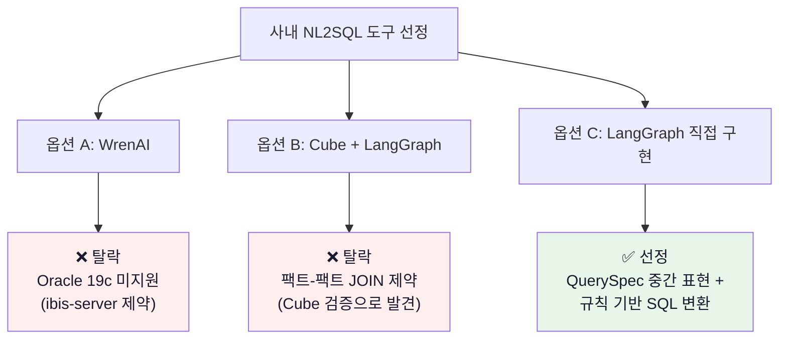

**옵션 A — WrenAI 직결**
- 장점: BIP에서 100% A등급 달성한 검증된 엔진
- 단점: Oracle 19c 미지원 (ibis-server가 23ai 전용 메타 조회). PostgreSQL 복제 추가 시 인프라 부담
- 결과: **탈락** (Oracle 19c가 사내 표준)

**옵션 B — OpenMetadata + Cube + LangGraph (이전 v2)**
- 장점: Cube가 Oracle 19c 지원 (node-oracledb 6.x), 시맨틱 레이어 분리 명확
- 단점: BIP에서 Cube 검증 결과 **팩트-팩트 JOIN 불가**. "저평가 + 외국인 순매수" 같은 핵심 사용 케이스 실패 (자세한 결과는 §13)
- 결과: **탈락** (Cube로는 해결 못 하는 질문이 너무 많음)

**옵션 C — LangGraph + QuerySpec 직접 구현 (현재 선정)**
- 장점: 시맨틱 레이어를 **DB View(Gold + Curated)** 로 두고, NL2SQL 변환 레이어를 자체 구현 → Oracle 19c 즉시 동작, 도구 락인 없음
- 단점: 자체 구현이라 초기 개발 부담. SQL Converter/Validator 품질이 곧 시스템 품질
- 결과: **선정** (Codex 검토에서도 "장기 도달점" 으로 동의, DAQUV/Function Calling 논문이 같은 방향)

### 1-4. 핵심 아이디어 — QuerySpec 중간 표현

**일반적인 NL2SQL:** LLM이 질문을 받아 SQL을 직접 생성 → 문법 오류, 컬럼 환각, 보안 검증 실패가 빈번.

**v3 접근:** LLM은 SQL을 만들지 않는다. **구조화된 쿼리 명세(QuerySpec)** 만 만든다. SQL 생성은 규칙 기반 변환기가 담당.

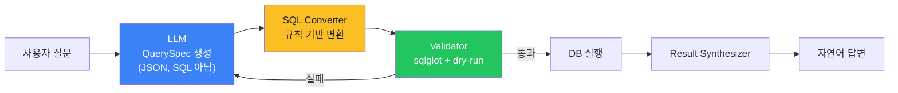

**왜 안정적인가:**

| 책임 | 누가 | 왜 |
|------|------|------|
| 질문 의도 파악 | LLM | 자연어 처리는 LLM의 강점 |
| QuerySpec 생성 (JSON) | LLM | 구조화된 출력 → Function Calling으로 안정성 보장 |
| SQL 문법 생성 | **규칙 기반 코드** | 결정론적 — 환각 불가 |
| 컬럼/테이블 검증 | **코드 + Validator** | 스키마는 코드가 안다 |
| 보안 검사 | **Validator + DB role** | 이중 방어 |
| 결과 → 자연어 | LLM | 자연어 생성은 LLM의 강점 |

> 💡 **핵심 통찰:** LLM이 결정하는 영역을 최소화하면 환각이 줄고, 결정론적 영역을 최대화하면 정확도가 올라간다. 영감 출처: DAQUV의 SMQ 개념, "Querying Databases with Function Calling" (arXiv 2502.00032).

---

## 2. 전체 로드맵

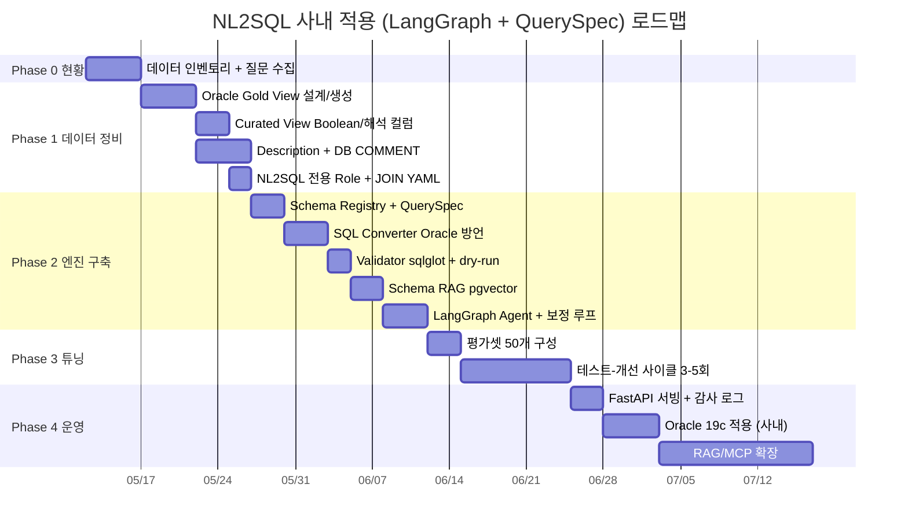

| Phase | 기간 | 핵심 산출물 |
|:-----:|:----:|----|
| 0 | 1주 | 대상 테이블 목록, 질문 50개, 보안 요구사항 |
| 1 | 2-3주 | Gold View · Curated View · Description · NL2SQL Role · joins.yaml |
| 2 | 2-3주 | Schema Registry · QuerySpec · SQL Converter · Validator · Schema RAG · LangGraph Agent |
| 3 | 2-3주 | 평가셋 50개, 정확도 80%+, 실패 패턴 분석 리포트 |
| 4 | 지속 | FastAPI 서빙, 감사 로그, 사내 LLM 연동, RAG/MCP 확장 |

> **가장 중요한 Phase는 1 (데이터 정비).** 도구를 v3로 바꿔도 Phase 0–1 산출물은 그대로 재사용. 반대로 Phase 1을 대충하면 Phase 2 엔진이 아무리 좋아도 정확도가 안 나옴.

---

## 3. 사전 지식 — 데이터/질문 유형 분류

Phase 0 진입 전, **어떤 질문을 NL2SQL로 처리할지** 판단 기준을 먼저 이해해야 한다. 이 분류를 잘못하면 NL2SQL로 풀 수 없는 것을 NL2SQL에 넣거나, 단순 SQL을 RAG로 처리하는 비효율이 발생한다.

### 3-1. 4가지 처리 방식

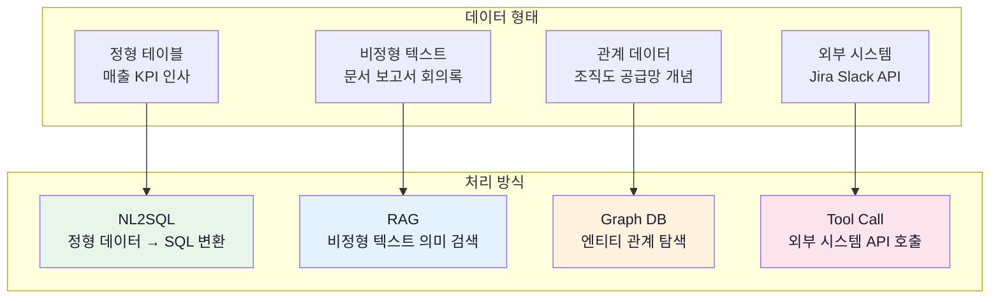

### 3-2. 판단 결정 트리

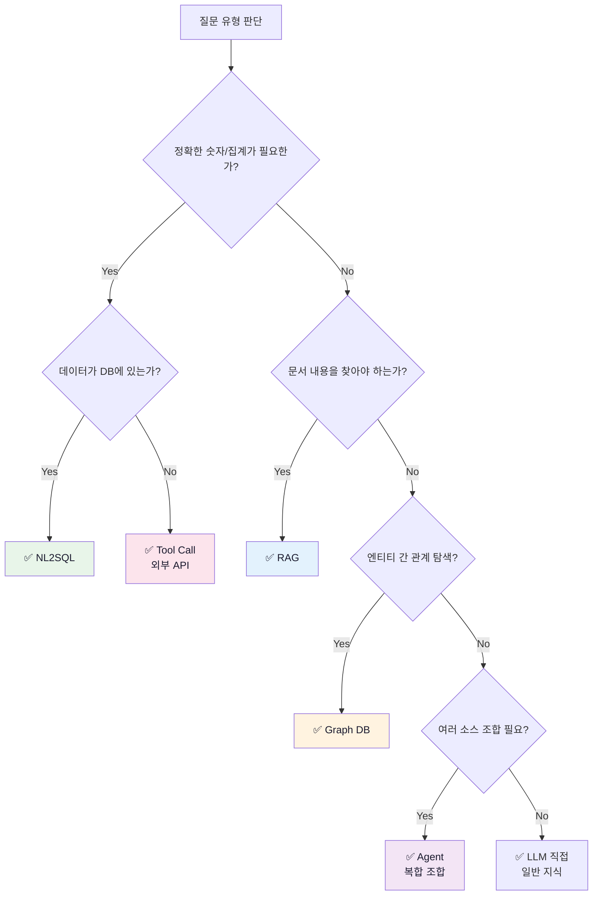

### 3-3. 핵심 판단 원칙

**1. 정확한 숫자 → 반드시 NL2SQL**
> LLM 직접 계산은 틀린다. RAG로 "매출 3억" 문서를 찾아도 최신값 보장 못 한다. **DB가 SSOT**.

**2. "찾아줘" → RAG, "알려줘" → NL2SQL**
> "품질 보고서 찾아줘" → RAG (문서 검색)
> "불량률 알려줘" → NL2SQL (숫자 조회)

**3. "관련된"이 나오면 Graph DB 의심**
> "관련 부서", "경쟁사", "상위 조직" — SQL JOIN으로 표현하기 어려움.

**4. "지금/현재" → Tool Call**
> DB에 없는 실시간 데이터는 외부 API 호출 필요.

**5. 복합 질문 → Agent가 분배**
> 하나의 방식으로 안 풀리면 LangGraph Agent가 질문을 분해해 적합한 Tool을 순차/병렬 호출.

### 3-4. 사내 질문 분류 예시

| 질문 | 방식 | 이유 | Phase |
|------|:----:|------|:-----:|
| "이번 분기 매출 얼마야?" | NL2SQL | 정확한 숫자, DB | 1 |
| "매출 상위 5개 팀" | NL2SQL | 집계 + 정렬 | 1 |
| "VIP 고객 중 이탈 위험자" | NL2SQL | boolean flag 활용 | 1 |
| "ISO 인증 절차 알려줘" | RAG | 사내 규정 문서 | 4 |
| "지난 회의에서 결정된 사항" | RAG | 회의록 검색 | 4 |
| "김철수 팀장 결재선" | Graph DB | 조직도 관계 | 5+ |
| "Jira 미해결 티켓 몇 개?" | Tool Call | 외부 시스템 | 4 |
| "매출 하락 팀의 클레임 요약" | **Agent** | NL2SQL + RAG | 4 |

> **Phase 1–3은 NL2SQL 대상에만 집중.** RAG/Graph/Tool은 Phase 4 이후에 LangGraph Agent의 추가 노드로 점진 확장.

---

## 4. Phase 0 — 현황 파악 (1주)

### 4-1. 대상 데이터 인벤토리

**목표:** NL2SQL로 질의할 대상 테이블/뷰를 식별한다.

**BIP 경험:** 처음에 39개 테이블 전체를 등록하려 했으나, 실제로 NL2SQL에 필요한 건 **Gold 테이블 3개 + Curated View 4개 = 7개**뿐이었다. 나머지 Raw/Derived 테이블은 LLM이 직접 접근하면 오히려 혼란을 일으켰다.

**체크리스트:**
- [ ] 전체 테이블/뷰 목록 작성
- [ ] 각 테이블의 용도 분류 (Raw / Derived / Reporting / 민감)
- [ ] 사용자가 실제로 물어볼 질문 유형 30-50개 수집
- [ ] 해당 질문에 답하려면 어떤 테이블이 필요한지 매핑

**산출물 예시:**

| 테이블 | 용도 | NL2SQL 대상 | 이유 |
|--------|------|:-:|------|
| ORDERS | Raw | ❌ | 정규화된 원본, JOIN 필요 |
| ORDER_ITEMS | Raw | ❌ | 단독으로 의미 없음 |
| V_DAILY_SALES_SUMMARY | Reporting | ✅ | 미리 집계된 와이드 뷰 |
| V_CUSTOMER_360 | Derived | ✅ | 비즈니스 분류 포함 |
| HR_EMPLOYEES | 민감 | ❌ | 인사 정보, LLM 차단 |
| FINANCE_SALARY | 민감 | ❌ | 급여, LLM 차단 |

### 4-2. 질문 유형 수집

**목표:** 실제 사용자(현업)가 할 만한 질문을 수집한다.

**BIP 경험:** 개발자가 상상한 질문과 실제 사용자 질문이 달랐다. "삼성전자 PER"은 잘 되지만, 사용자는 "현차 PER"(약칭), "저평가주 찾아줘"(추상 개념)처럼 물었다.

**방법:**
1. 현업 담당자 인터뷰 (5–10명)
2. 기존 데이터 요청 이력 (Jira, Slack, 이메일) 분석
3. 기존 대시보드에서 자주 보는 지표 목록화

**산출물 예시:**

| # | 질문 예시 | 난이도 | 필요 테이블 |
|:-:|---------|:-----:|-----------|
| 1 | 이번 달 매출 얼마야? | 쉬움 | V_DAILY_SALES_SUMMARY |
| 2 | 매출 상위 5개 제품 | 쉬움 | V_DAILY_SALES_SUMMARY |
| 3 | 지난 분기 대비 매출 증감 | 중간 | V_DAILY_SALES_SUMMARY (시계열) |
| 4 | VIP 고객 중 이탈 위험자 | 어려움 | V_CUSTOMER_360 + V_CUSTOMER_SIGNALS |
| 5 | 마케팅 캠페인별 ROI | 어려움 | V_CAMPAIGN_PERFORMANCE (복합 JOIN) |

> 💡 **실무 팁:** 50개 정도 모이면 평가셋(Phase 3) 그대로 활용 가능. 추후 정확도 측정의 기준이 되므로 **실제 표현 그대로** 수집하는 것이 중요.

### 4-3. 보안 요구사항 정리

**목표:** LLM/NL2SQL이 접근해서는 안 되는 데이터를 식별한다.

**BIP 경험:** `portfolio`, `users`, `holding` 등 개인 재무 데이터를 민감 테이블로 분류하고 전용 DB role(`nl2sql_exec`)로 접근을 차단했다. 이 작업을 Phase 2 이후에 했다가 보안 감사에서 지적받을 뻔했다.

**체크리스트:**
- [ ] 민감 테이블 목록 (개인정보, 급여, 인사, 재무 등)
- [ ] 민감 컬럼 목록 (주민번호, 연봉, 비밀번호 등)
- [ ] NL2SQL 전용 Oracle role 생성 계획
- [ ] 감사 로그 요구사항 (어디에, 무엇을, 얼마 보관)
- [ ] LLM 외부 호출 가능 여부 (Azure OpenAI 사내 테넌트? 사내 LLM?)

---

## 5. Phase 1 — 데이터 정비 (2-3주)

> **이 단계가 전체 품질의 80%를 결정한다. 도구를 바꿔도 이 산출물은 재사용된다.**

### 5-1. Oracle Gold View 설계

**목표:** Raw 테이블을 pre-join하여 NL2SQL 친화적인 와이드 View를 만든다.

**왜 필요한가 (BIP 경험):**
- Raw 테이블은 정규화되어 있어 LLM이 3–4개 테이블을 JOIN해야 하는데, **LLM의 JOIN 정확도가 매우 낮다**
- 조건 필터 + JOIN이 동시에 있으면 실패율 급증
- Gold View에 미리 JOIN + 계산을 해두면 LLM은 **단일 SELECT만** 하면 됨

**설계 원칙:**

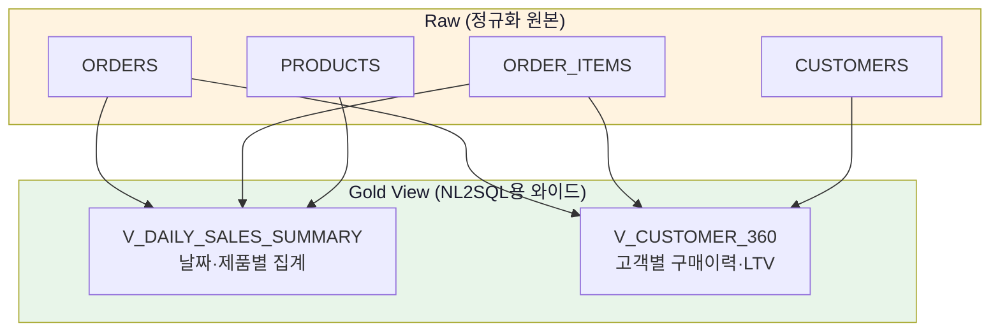

**핵심 규칙:**

1. **Grain(입도)을 명확히 정의** — "이 행은 무엇인가?" (날짜 1행? 고객 1행? 날짜+제품 1행?)
2. **단위 통일** — 금액은 모두 원, 비율은 모두 % (BIP에서 시총이 "억원"과 "원"이 섞여 PER이 0으로 나왔던 사례)
3. **미리 계산할 수 있는 건 컬럼으로** — 증감률, 비율, 누적합 등을 SQL에서 미리
4. **이름을 직관적으로** — `col_a`가 아니라 `revenue`, `customer_count` (LLM은 컬럼명으로 의미 추론)

**Oracle Gold View 예시:**

```sql
-- 매출 요약 Gold View (BIP의 analytics_stock_daily에 대응)
CREATE OR REPLACE VIEW V_DAILY_SALES_SUMMARY AS
SELECT
    s.SALE_DATE,
    d.DEPT_NAME,
    p.PRODUCT_NAME,
    p.CATEGORY,
    SUM(s.AMOUNT) AS TOTAL_AMOUNT,
    COUNT(DISTINCT s.ORDER_ID) AS ORDER_COUNT,
    COUNT(DISTINCT s.CUSTOMER_ID) AS CUSTOMER_COUNT,
    AVG(s.AMOUNT) AS AVG_DEAL_SIZE,
    -- 단위 통일: 모든 금액 원 단위
    SUM(s.AMOUNT - s.COST) AS PROFIT,
    -- 비율은 % (소수점 2자리)
    ROUND(SUM(s.AMOUNT - s.COST) / NULLIF(SUM(s.AMOUNT), 0) * 100, 2) AS PROFIT_MARGIN_PCT
FROM SALES s
JOIN DEPARTMENTS d ON s.DEPT_ID = d.DEPT_ID
JOIN PRODUCTS p ON s.PRODUCT_ID = p.PRODUCT_ID
WHERE s.STATUS = 'COMPLETED'
GROUP BY s.SALE_DATE, d.DEPT_NAME, p.PRODUCT_NAME, p.CATEGORY;

COMMENT ON TABLE V_DAILY_SALES_SUMMARY IS
  '일별·부서·제품별 매출 요약. Grain: 날짜×부서×제품. STATUS=COMPLETED만 집계.';
COMMENT ON COLUMN V_DAILY_SALES_SUMMARY.TOTAL_AMOUNT IS
  '총 매출 금액 (원 단위). 환불·취소 제외.';
COMMENT ON COLUMN V_DAILY_SALES_SUMMARY.PROFIT_MARGIN_PCT IS
  '순이익률 (%). PROFIT / TOTAL_AMOUNT × 100.';
```

> **이 View가 하는 일:** 4개 테이블을 미리 JOIN + 집계 + 단위 통일. LLM은 `SELECT * FROM V_DAILY_SALES_SUMMARY WHERE ...`만 하면 됨.

### 5-2. Curated View — Boolean Flag

**목표:** Gold View 위에 **boolean 플래그**를 추가한 View를 만든다.

**왜 필요한가 (BIP 경험):**
- "저평가주 찾아줘"라고 물으면 LLM은 `WHERE PER < 10 AND PBR < 1`을 스스로 만들어야 하는데, **기준이 맞는지 보장 못 함**
- `IS_VALUE_STOCK = 'Y'` boolean이 있으면 LLM은 **단순 필터링만** 하면 됨
- Boolean flag 사용률이 0% → 87%로 올라간 것이 BIP Phase 1 최대 성과

**설계 패턴:**

```sql
-- 비즈니스 규칙을 boolean 컬럼으로 고정
CREATE OR REPLACE VIEW V_CUSTOMER_SIGNALS AS
SELECT
    c.CUSTOMER_ID,
    c.NAME,
    c.TIER,
    c.TOTAL_PURCHASES,
    c.AVG_ORDER_VALUE,
    c.LAST_PURCHASE_DATE,
    c.RETURN_RATE,
    -- 비즈니스 정의를 SQL로 고정
    CASE WHEN c.TOTAL_PURCHASES >= 10 AND c.AVG_ORDER_VALUE >= 50000
         THEN 'Y' ELSE 'N' END AS IS_VIP,
    CASE WHEN c.LAST_PURCHASE_DATE < SYSDATE - 90
         THEN 'Y' ELSE 'N' END AS IS_CHURNING,
    CASE WHEN c.TOTAL_PURCHASES = 1 AND c.SIGNUP_DATE > SYSDATE - 30
         THEN 'Y' ELSE 'N' END AS IS_NEW,
    CASE WHEN c.RETURN_RATE > 0.3
         THEN 'Y' ELSE 'N' END AS IS_HIGH_RETURN
FROM V_CUSTOMER_360 c;

COMMENT ON COLUMN V_CUSTOMER_SIGNALS.IS_VIP IS
  'VIP 고객 여부. 누적 구매 10회 이상이면서 평균 객단가 5만원 이상.';
COMMENT ON COLUMN V_CUSTOMER_SIGNALS.IS_CHURNING IS
  '이탈 위험 여부. 마지막 구매일이 90일 전 이전.';
```

**사내 적용 예시 (Boolean 후보):**

| 도메인 | View | 플래그 | 비즈니스 정의 |
|--------|------|--------|------------|
| 영업 | V_SALES_SIGNALS | IS_LARGE_DEAL | 거래액 1억 이상 |
| 영업 | V_SALES_SIGNALS | IS_LOW_MARGIN | 마진율 5% 미만 |
| 고객 | V_CUSTOMER_SIGNALS | IS_VIP | 누적 구매 10회 + 객단가 5만원 |
| 고객 | V_CUSTOMER_SIGNALS | IS_CHURNING | 마지막 구매 90일 전 |
| 운영 | V_OPS_SIGNALS | IS_DELAYED | 납기 지연 7일 초과 |
| 운영 | V_OPS_SIGNALS | IS_LOW_STOCK | 재고 안전재고 미만 |

### 5-3. 해석 컬럼 (Interpretation Column)

**목표:** 숫자 컬럼의 의미를 LLM이 오해할 수 있는 경우 **텍스트 해석 컬럼**을 View에 추가한다.

**왜 필요한가 (BIP 경험):**

WrenAI의 답변 생성(sql_answer)은 SQL 실행 결과만 LLM에 넘기고 **컬럼 description은 전달하지 않는다.** 결과 LLM은 데이터만 보고 해석한다. v3에서도 Result Synthesizer가 같은 한계를 가질 수 있어, **데이터 자체에 텍스트 해석을 박아넣는** 것이 안전하다.

```
문제 상황:
  컬럼: NET_AMOUNT = -500,000
  Description: "음수=환불, 양수=결제. 음수는 정상값" (Synthesizer는 못 봄)
  LLM 답변: "음수값 -500,000은 이상치일 수 있습니다" ❌

해결:
  컬럼 추가: AMOUNT_DIRECTION = '환불'
  LLM 답변: "환불 거래입니다 (-500,000원)" ✅
```

**이 패턴이 필요한 경우:**
- 양수/음수가 방향성 (순매수/순매도, 유입/유출)
- NULL이 특별한 의미 ("데이터 없음" vs "0")
- 숫자 범위에 따라 해석이 달라지는 경우 (RSI 30 미만 = 과매도)

**설계 패턴 (Oracle):**

```sql
CREATE OR REPLACE VIEW V_FLOW_SIGNALS AS
SELECT
    *,
    -- 해석 컬럼 1: 방향성
    CASE
        WHEN FOREIGN_BUY_VOLUME IS NULL THEN '데이터없음'
        WHEN FOREIGN_BUY_VOLUME > 0 THEN '순매수'
        WHEN FOREIGN_BUY_VOLUME < 0 THEN '순매도'
        ELSE '보합'
    END AS FOREIGN_DIRECTION,
    -- 해석 컬럼 2: 등급
    CASE
        WHEN RSI_14 < 30 THEN '과매도'
        WHEN RSI_14 BETWEEN 30 AND 70 THEN '중립'
        WHEN RSI_14 > 70 THEN '과매수'
        ELSE '데이터없음'
    END AS RSI_LABEL
FROM V_DAILY_FLOW;
```

**핵심:** Boolean flag는 "어떤 행이 해당되는지" 필터링용, 해석 컬럼은 "이 숫자가 무엇을 의미하는지" 답변 품질용. **둘 다 필요하고 역할이 다르다.**

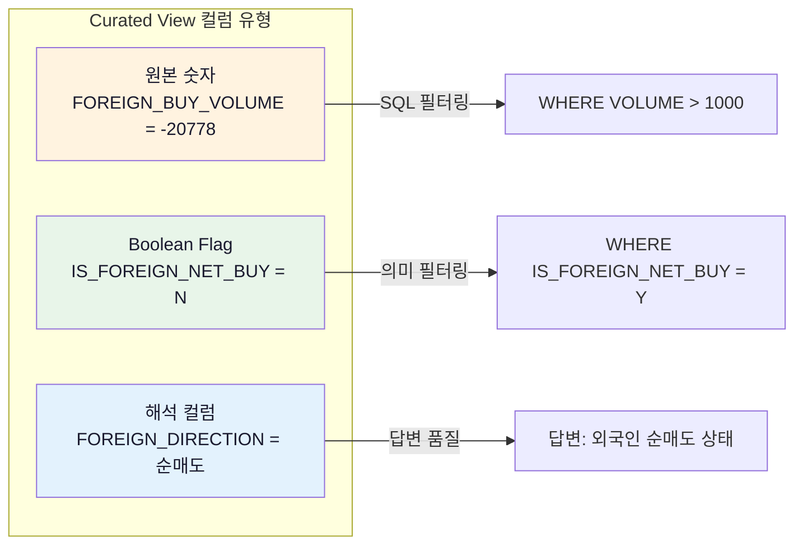

### 5-4. 컬럼 Description + DB COMMENT

**목표:** 모든 대상 테이블/뷰의 컬럼에 비즈니스 설명을 작성하고 Oracle COMMENT로 박아넣는다.

**왜 필요한가:**
- 컬럼명만으로 LLM이 정확한 의미를 알 수 없다 (`OP_PROFIT_GROWTH` → 분기? 연간? %?)
- description이 없으면 LLM이 잘못된 컬럼을 선택하거나 무시한다
- BIP에서 description 추가 전후 SQL 정확도가 체감상 크게 달라졌다

**작성 규칙:**

1. **비즈니스 용어**로 작성 (기술 용어 X)
2. **단위** 명시 (원, %, 건, 명)
3. **계산식** 포함 (어떻게 계산된 컬럼인지)
4. **가능한 값** 예시 (enum, boolean)

**좋은 예 vs 나쁜 예:**

| 컬럼 | ❌ 나쁜 description | ✅ 좋은 description |
|------|-------------------|-------------------|
| REVENUE | 매출 | 연간 매출액 (원 단위). FINANCIAL_STATEMENTS에서 추출한 확정 실적 |
| IS_VALUE_STOCK | 저평가 여부 | PER 10 이하이면서 PBR 1 이하인 저평가 종목 여부 (Y/N) |
| CHANGE_PCT | 변동률 | 전일 대비 종가 변동률 (%). 양수=상승, 음수=하락 |
| DATA_TYPE | 데이터 유형 | actual=확정 실적(연간), estimate=컨센서스 추정치, preliminary=잠정 실적(분기) |

**Oracle COMMENT 적용:**

```sql
COMMENT ON TABLE V_DAILY_SALES_SUMMARY IS
  '일별 매출 요약. Grain: 날짜×부서×제품. STATUS=COMPLETED만 집계. 매일 02:00 KST 갱신.';
COMMENT ON COLUMN V_DAILY_SALES_SUMMARY.TOTAL_AMOUNT IS
  '총 매출 금액 (원 단위). 환불·취소 제외.';
COMMENT ON COLUMN V_DAILY_SALES_SUMMARY.PROFIT_MARGIN_PCT IS
  '순이익률 (%). PROFIT / TOTAL_AMOUNT × 100. 소수점 2자리.';
```

### 5-5. NL2SQL 전용 Oracle Role

**목표:** NL2SQL이 사용할 최소 권한 Oracle 계정을 만든다.

**BIP 경험:** 처음에 관리자 계정으로 테스트하다 보안 리뷰에서 지적받았다. 전용 role을 만들면 민감 테이블 접근이 **DB 레벨에서 차단**된다.

```sql
-- 1. 전용 사용자 생성
CREATE USER NL2SQL_READER IDENTIFIED BY <password>
  DEFAULT TABLESPACE USERS
  TEMPORARY TABLESPACE TEMP
  PROFILE DEFAULT;

GRANT CREATE SESSION TO NL2SQL_READER;
GRANT SELECT_CATALOG_ROLE TO NL2SQL_READER;  -- 메타 조회용 (선택)

-- 2. NL2SQL 대상 View만 GRANT
GRANT SELECT ON BIP.V_DAILY_SALES_SUMMARY TO NL2SQL_READER;
GRANT SELECT ON BIP.V_CUSTOMER_360 TO NL2SQL_READER;
GRANT SELECT ON BIP.V_CUSTOMER_SIGNALS TO NL2SQL_READER;
GRANT SELECT ON BIP.V_FLOW_SIGNALS TO NL2SQL_READER;
GRANT SELECT ON BIP.V_OPS_SIGNALS TO NL2SQL_READER;

-- 3. 민감 테이블은 GRANT 안 함 → 접근 자체 불가
-- BIP.HR_EMPLOYEES, BIP.FINANCE_SALARY 등은 GRANT 없음

-- 4. (선택) 리소스 제한
ALTER PROFILE DEFAULT LIMIT
  CPU_PER_CALL 30000     -- 개별 쿼리 최대 5분
  LOGICAL_READS_PER_CALL 100000;
```

> **이 Role이 보장하는 것:** LLM이 SQL 인젝션을 시도하거나 환각으로 잘못된 테이블을 호출해도, **DB가 권한 없음(ORA-00942)으로 거부**한다. Validator의 allowlist는 1차 방어, DB role이 최종 방어선.

### 5-6. JOIN 관계 YAML

**목표:** 테이블 간 JOIN 키를 코드에서 참조 가능한 YAML로 명시화한다.

**왜 필요한가:**
- OM Lineage는 데이터 흐름을 표현하지만 JOIN 키는 표현 못 함
- Schema Registry가 LLM 프롬프트에 JOIN 정보를 주입해야 SQL Converter가 자동으로 JOIN 절을 생성 가능

**파일 위치:** `langgraph/nl2sql/joins.yaml`

```yaml
joins:
  # 마스터 ↔ 트랜잭션
  - tables: ["V_CUSTOMER_360", "V_CUSTOMER_SIGNALS"]
    on: "CUSTOMER_ID"
    type: "one_to_one"

  - tables: ["V_DAILY_SALES_SUMMARY", "V_CUSTOMER_360"]
    on: "CUSTOMER_ID"
    type: "many_to_one"
    note: "주문→고객 비정규 (sales는 customer 중복 등장)"

  # 같은 grain끼리 직접 JOIN 가능
  - tables: ["V_OPS_SIGNALS", "V_INVENTORY_SIGNALS"]
    on: "PRODUCT_ID, OPS_DATE"
    type: "one_to_one"

  # 다른 grain — 단일 키, 최신 행 필터 권장
  - tables: ["V_CUSTOMER_360", "V_CUSTOMER_LIFETIME_VALUE"]
    on: "CUSTOMER_ID"
    type: "many_to_many"
    note: "grain 불일치 (전체 vs 분기) — 최신 분기 필터 권장"
```

> 💡 **실무 팁:** JOIN 후보가 10–20개를 넘어가면 그래프 형태로 시각화 (Schema Registry가 자동 생성). 사용자가 보면서 누락된 관계를 채울 수 있다.

---

## 6. Phase 2 — NL2SQL 엔진 구축 (2-3주)

> **Phase 1 산출물(Gold View, Curated View, JOIN YAML, NL2SQL Role)을 입력으로 받아 LangGraph + QuerySpec 엔진을 구축한다.**

### 6-1. 모듈 구조

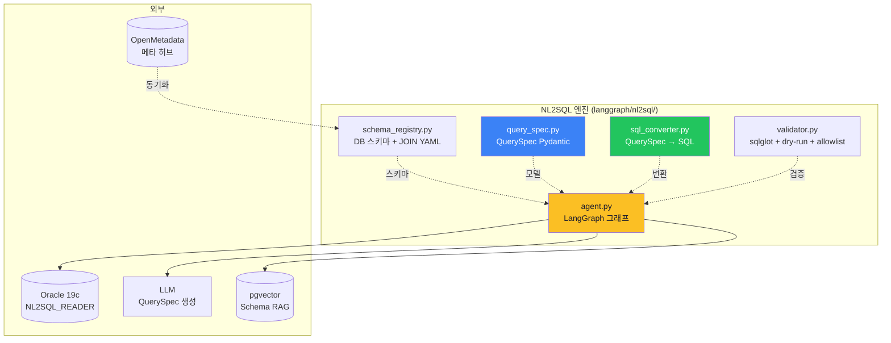

| 모듈 | 책임 | 핵심 기술 |
|------|------|---------|
| schema_registry | 테이블/컬럼/JOIN 메타 자동 로드 | asyncpg/cx_Oracle + YAML |
| query_spec | LLM 출력 구조 정의 | Pydantic |
| sql_converter | QuerySpec → SQL (방언 처리) | 자체 구현 |
| validator | 보안·구문·스키마 검증 | sqlglot + DB EXPLAIN |
| agent | 그래프 오케스트레이션 | LangGraph |

### 6-2. Schema Registry — DB COMMENT + YAML 자동 로드

**목표:** Phase 1에서 박아둔 DB COMMENT와 joins.yaml을 LLM 프롬프트용 스키마 요약으로 변환한다.

**핵심 로직:**

```python
# langgraph/nl2sql/schema_registry.py

from dataclasses import dataclass, field
import yaml
import asyncpg  # PostgreSQL
# import oracledb  # Oracle 19c

@dataclass
class ColumnInfo:
    name: str
    data_type: str
    description: str = ""

@dataclass
class TableInfo:
    name: str
    description: str = ""
    columns: list[ColumnInfo] = field(default_factory=list)

@dataclass
class JoinInfo:
    table_a: str
    table_b: str
    on: str  # "CUSTOMER_ID" 또는 "PRODUCT_ID, OPS_DATE"
    join_type: str = "one_to_many"
    note: str = ""

class SchemaRegistry:
    def __init__(self):
        self.tables: dict[str, TableInfo] = {}
        self.joins: list[JoinInfo] = []

    async def load_from_oracle(self, dsn: str, target_tables: list[str]):
        """Oracle COMMENTS에서 테이블/컬럼/설명 자동 추출"""
        # 테이블 + 설명
        rows = await fetch_oracle("""
            SELECT t.TABLE_NAME, c.COMMENTS
            FROM USER_TABLES t
            LEFT JOIN USER_TAB_COMMENTS c ON t.TABLE_NAME = c.TABLE_NAME
            WHERE t.TABLE_NAME IN :targets
        """, targets=target_tables)

        for r in rows:
            self.tables[r["TABLE_NAME"]] = TableInfo(
                name=r["TABLE_NAME"],
                description=r["COMMENTS"] or "",
            )

        # 컬럼 + 설명
        cols = await fetch_oracle("""
            SELECT c.TABLE_NAME, c.COLUMN_NAME, c.DATA_TYPE,
                   cc.COMMENTS
            FROM USER_TAB_COLUMNS c
            LEFT JOIN USER_COL_COMMENTS cc
              ON c.TABLE_NAME = cc.TABLE_NAME AND c.COLUMN_NAME = cc.COLUMN_NAME
            WHERE c.TABLE_NAME IN :targets
            ORDER BY c.TABLE_NAME, c.COLUMN_ID
        """, targets=target_tables)

        for r in cols:
            tbl = self.tables.get(r["TABLE_NAME"])
            if tbl:
                tbl.columns.append(ColumnInfo(
                    name=r["COLUMN_NAME"],
                    data_type=r["DATA_TYPE"],
                    description=r["COMMENTS"] or "",
                ))

    def load_joins_yaml(self, yaml_path: str):
        """joins.yaml 로드"""
        with open(yaml_path) as f:
            data = yaml.safe_load(f)
        for j in data["joins"]:
            self.joins.append(JoinInfo(
                table_a=j["tables"][0],
                table_b=j["tables"][1],
                on=j["on"],
                join_type=j.get("type", "one_to_many"),
                note=j.get("note", ""),
            ))

    def to_llm_prompt(self) -> str:
        """LLM에 주입할 스키마 요약 생성"""
        lines = []
        for tname, tbl in self.tables.items():
            lines.append(f"\n## {tname}")
            if tbl.description:
                lines.append(f"  설명: {tbl.description}")
            lines.append("  컬럼:")
            for c in tbl.columns:
                desc = f" — {c.description}" if c.description else ""
                lines.append(f"    - {c.name} ({c.data_type}){desc}")

        lines.append("\n## JOIN 관계")
        for j in self.joins:
            lines.append(f"  - {j.table_a} ↔ {j.table_b} ON {j.on} ({j.join_type})")

        return "\n".join(lines)

    def find_join_path(self, tables: list[str]) -> list[JoinInfo]:
        """N개 테이블 간 JOIN 경로 BFS 탐색"""
        # ... (생략, 실제 구현은 BIP-Agents/langgraph/nl2sql/schema_registry.py 참고)
```

> **이 모듈이 하는 일:** DB COMMENT가 곧 LLM 프롬프트의 일부가 됨. Phase 1의 description 작성이 여기서 빛을 발한다. `to_llm_prompt()` 출력이 LLM에게 주는 "스키마 설명서".

### 6-3. QuerySpec — LLM 출력 구조

**목표:** LLM이 SQL을 직접 만들지 않고, **구조화된 쿼리 명세**만 만들도록 강제한다.

**전체 모델 (Pydantic):**

```python
# langgraph/nl2sql/query_spec.py
from enum import Enum
from typing import Optional
from pydantic import BaseModel, Field

class FilterOp(str, Enum):
    EQ = "="; NEQ = "!="
    GT = ">"; GTE = ">="; LT = "<"; LTE = "<="
    LIKE = "LIKE"
    IN = "IN"; NOT_IN = "NOT IN"
    IS_NULL = "IS NULL"; IS_NOT_NULL = "IS NOT NULL"
    BETWEEN = "BETWEEN"

class OrderDirection(str, Enum):
    ASC = "asc"; DESC = "desc"

class AggFunc(str, Enum):
    SUM = "SUM"; AVG = "AVG"; COUNT = "COUNT"
    COUNT_DISTINCT = "COUNT_DISTINCT"
    MIN = "MIN"; MAX = "MAX"

class Filter(BaseModel):
    column: str
    op: FilterOp
    value: Optional[str | int | float | bool | list] = None

class OrderBy(BaseModel):
    column: str
    direction: OrderDirection = OrderDirection.DESC

class Aggregation(BaseModel):
    column: str
    func: AggFunc
    alias: Optional[str] = None

class TimeScope(BaseModel):
    column: str
    scope: str  # latest, last_7d, last_30d, this_quarter, this_year, YYYY-MM-DD~YYYY-MM-DD

class QuerySpec(BaseModel):
    """LLM이 생성하는 구조화된 쿼리 명세"""
    tables: list[str]                                    # 어떤 테이블
    select: list[str]                                    # 어떤 컬럼
    filters: list[Filter] = []                           # 어떤 조건
    aggregations: list[Aggregation] = []                 # 집계
    group_by: list[str] = []                             # 그룹핑
    order_by: list[OrderBy] = []                         # 정렬
    limit: int = 20                                      # 몇 개
    time_scope: Optional[TimeScope] = None               # 시간 범위
    original_question: Optional[str] = None              # 디버깅용
```

**LLM 출력 예시:**

```
질문: "VIP 고객 중 이탈 위험자 매출 상위 10명"

QuerySpec:
{
  "tables": ["V_CUSTOMER_360", "V_CUSTOMER_SIGNALS"],
  "select": ["NAME", "TIER", "TOTAL_PURCHASES", "LAST_PURCHASE_DATE"],
  "filters": [
    {"column": "IS_VIP", "op": "=", "value": "Y"},
    {"column": "IS_CHURNING", "op": "=", "value": "Y"}
  ],
  "order_by": [{"column": "TOTAL_PURCHASES", "direction": "desc"}],
  "limit": 10
}
```

> **왜 안정적인가:** LLM이 Pydantic 스키마에 맞춰 JSON을 생성해야 하므로 (Function Calling 또는 structured output), **문법 오류가 원천 차단**된다. 컬럼명/테이블명을 환각해도 다음 단계 Validator에서 거른다.

### 6-4. SQL Converter — Oracle 방언 처리

**목표:** QuerySpec을 Oracle 19c용 SQL로 결정론적 변환.

**핵심 로직 (PostgreSQL/Oracle 방언 분기):**

```python
# langgraph/nl2sql/sql_converter.py

class SQLConverter:
    def __init__(self, registry: SchemaRegistry, dialect: str = "oracle"):
        self.registry = registry
        self.dialect = dialect

    def convert(self, spec: QuerySpec) -> str:
        sql = f"SELECT {self._build_select(spec)}\nFROM {self._build_from(spec)}"
        if w := self._build_where(spec):    sql += f"\nWHERE {w}"
        if g := self._build_group_by(spec): sql += f"\nGROUP BY {g}"
        if o := self._build_order_by(spec): sql += f"\nORDER BY {o}"
        sql += f"\n{self._build_limit(spec)}"
        return sql

    def _build_from(self, spec: QuerySpec) -> str:
        """FROM + JOIN 자동 생성"""
        if len(spec.tables) == 1:
            return f"{spec.tables[0]} {self._alias(spec.tables[0])}"

        # JOIN 경로 탐색 (Schema Registry)
        joins = self.registry.find_join_path(spec.tables)
        first = spec.tables[0]
        result = f"{first} {self._alias(first)}"
        joined = {first}

        for j in joins:
            new_t = j.table_b if j.table_a in joined else j.table_a
            existing = j.table_a if j.table_a in joined else j.table_b
            on_clause = self._build_on(j, self._alias(existing), self._alias(new_t))
            result += f"\nJOIN {new_t} {self._alias(new_t)} ON {on_clause}"
            joined.add(new_t)
        return result

    def _build_limit(self, spec: QuerySpec) -> str:
        """방언 분기: PostgreSQL은 LIMIT, Oracle은 FETCH FIRST"""
        if self.dialect == "postgresql":
            return f"LIMIT {spec.limit}"
        else:  # oracle
            return f"FETCH FIRST {spec.limit} ROWS ONLY"

    def _time_scope_to_sql(self, ts: TimeScope) -> str:
        """시간 범위 방언 분기"""
        col = self._qualify(ts.column)
        if ts.scope.startswith("last_"):
            days = ts.scope.replace("last_", "").replace("d", "")
            if self.dialect == "postgresql":
                return f"{col} >= CURRENT_DATE - INTERVAL '{days} days'"
            else:  # oracle
                return f"{col} >= SYSDATE - {days}"
        elif ts.scope == "this_quarter":
            if self.dialect == "postgresql":
                return f"{col} >= DATE_TRUNC('quarter', CURRENT_DATE)"
            else:
                return f"{col} >= TRUNC(SYSDATE, 'Q')"
        # ... (this_year, latest, YYYY-MM-DD~YYYY-MM-DD 등)

    @staticmethod
    def _quote_value(value) -> str:
        """SQL 인젝션 방지 — 모든 문자열은 쿼팅 + 이스케이프"""
        if value is None: return "NULL"
        if isinstance(value, bool): return "'Y'" if value else "'N'"  # Oracle은 boolean 없음
        if isinstance(value, (int, float)): return str(value)
        return f"'{str(value).replace(\"'\", \"''\")}'"
```

**변환 예시:**

```
QuerySpec:
  tables: ["V_DAILY_SALES_SUMMARY"]
  select: ["DEPT_NAME", "TOTAL_AMOUNT"]
  filters: [{column: "PROFIT_MARGIN_PCT", op: ">", value: 10}]
  time_scope: {column: "SALE_DATE", scope: "this_quarter"}
  order_by: [{column: "TOTAL_AMOUNT", direction: "desc"}]
  limit: 5

→ Oracle SQL:
  SELECT vds.DEPT_NAME, vds.TOTAL_AMOUNT
  FROM V_DAILY_SALES_SUMMARY vds
  WHERE vds.PROFIT_MARGIN_PCT > 10
    AND vds.SALE_DATE >= TRUNC(SYSDATE, 'Q')
  ORDER BY vds.TOTAL_AMOUNT DESC
  FETCH FIRST 5 ROWS ONLY
```

> **이 변환기의 책임:** SQL의 문법 정확성 + 방언 호환성. **LLM이 환각해도 여기서 망가진 SQL이 나올 수 없다.**

### 6-5. Validator — 4-Layer 검증

**목표:** Converter가 생성한 SQL을 실행 전에 4단계로 검증.

```python
# langgraph/nl2sql/validator.py

ALLOWED_TABLES = {
    "V_DAILY_SALES_SUMMARY",
    "V_CUSTOMER_360",
    "V_CUSTOMER_SIGNALS",
    "V_FLOW_SIGNALS",
    "V_OPS_SIGNALS",
}

BLOCKED_KEYWORDS = {
    "INSERT", "UPDATE", "DELETE", "DROP", "ALTER", "CREATE",
    "TRUNCATE", "GRANT", "REVOKE", "EXEC", "EXECUTE",
}

@dataclass
class ValidationResult:
    is_valid: bool
    error: str = ""
    error_type: str = ""  # syntax / security / schema / dry_run

class SQLValidator:
    def validate(self, sql: str) -> ValidationResult:
        # Layer 1: 구문 + SELECT only
        if r := self._validate_syntax(sql):
            return r
        # Layer 2: allowlist (Validator 레벨)
        if r := self._validate_allowlist(sql):
            return r
        # Layer 3: sqlglot 파싱 (테이블/컬럼 추출 검증)
        if r := self._validate_sqlglot(sql):
            return r
        # Layer 4: DB dry-run (EXPLAIN PLAN)
        if r := self._validate_dry_run(sql):
            return r
        return ValidationResult(is_valid=True)

    def _validate_syntax(self, sql: str):
        sql_upper = sql.upper().strip()
        if not sql_upper.startswith("SELECT"):
            return ValidationResult(False, "SELECT 문만 허용", "security")
        for kw in BLOCKED_KEYWORDS:
            if kw in sql_upper.split():
                return ValidationResult(False, f"금지 키워드: {kw}", "security")

    def _validate_allowlist(self, sql: str):
        import sqlglot
        parsed = sqlglot.parse_one(sql, dialect="oracle")
        for tbl in parsed.find_all(sqlglot.exp.Table):
            if tbl.name.upper() not in ALLOWED_TABLES:
                return ValidationResult(
                    False, f"허용되지 않은 테이블: {tbl.name}", "security"
                )

    async def _validate_dry_run(self, sql: str):
        """DB EXPLAIN으로 실제 실행 가능성 확인"""
        try:
            await execute_oracle(f"EXPLAIN PLAN FOR {sql}")
            return None  # 통과
        except Exception as e:
            return ValidationResult(False, str(e), "dry_run")
```

**4-Layer 방어 전체:**

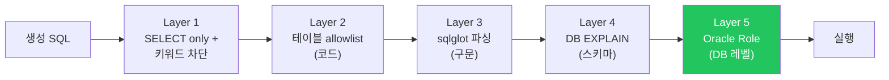

> 💡 **5번째 방어선이 가장 강력:** Validator를 모두 통과해도 NL2SQL_READER role이 GRANT 안 받은 테이블은 DB가 거부. **코드 버그가 있어도 데이터 유출 불가.**

### 6-6. Schema RAG — Few-shot 예시 검색

**목표:** 사용자 질문과 유사한 과거 SQL Pair를 벡터 검색해 LLM에 Few-shot으로 주입.

**왜 필요한가:**
- BIP에서 SQL Pairs 29개→70개로 늘리며 A등급 58%→100% 달성. **가장 ROI 높은 튜닝 수단.**
- 도메인 표현(약칭, 부서별 용어)은 description만으론 안 잡힘 → 실제 예시로 가르치는 것이 효과적.

**구조:**

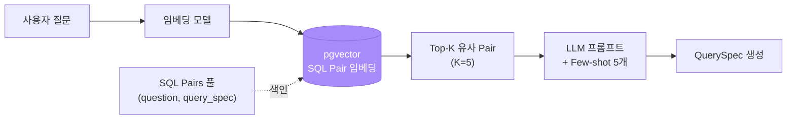

**SQL Pair 형식:**

```yaml
# tests/sql_pairs.yaml
pairs:
  - question: "이번 달 매출"
    query_spec:
      tables: ["V_DAILY_SALES_SUMMARY"]
      select: []
      aggregations: [{column: "TOTAL_AMOUNT", func: "SUM"}]
      time_scope: {column: "SALE_DATE", scope: "this_month"}

  - question: "VIP 고객 이탈 위험자 명단"
    query_spec:
      tables: ["V_CUSTOMER_360", "V_CUSTOMER_SIGNALS"]
      select: ["NAME", "LAST_PURCHASE_DATE"]
      filters:
        - {column: "IS_VIP", op: "=", value: "Y"}
        - {column: "IS_CHURNING", op: "=", value: "Y"}
      order_by: [{column: "TOTAL_PURCHASES", direction: "desc"}]
      limit: 50
```

**임베딩 적재 (pgvector 또는 사내 벡터 DB):**

```python
async def index_sql_pairs(pairs: list[dict]):
    for p in pairs:
        emb = embed(p["question"])  # 사내 임베딩 모델
        await db.execute(
            "INSERT INTO sql_pairs (question, query_spec, embedding) VALUES ($1, $2, $3)",
            p["question"], json.dumps(p["query_spec"]), emb,
        )

async def retrieve_pairs(question: str, k: int = 5) -> list[dict]:
    emb = embed(question)
    rows = await db.fetch(
        "SELECT question, query_spec FROM sql_pairs ORDER BY embedding <=> $1 LIMIT $2",
        emb, k,
    )
    return [dict(r) for r in rows]
```

> 💡 **Phase 3 튜닝 사이클의 핵심:** 실패한 질문 → 사람이 정답 QuerySpec 작성 → SQL Pair로 등록 → 다음번부터 자동으로 Few-shot 검색됨. **Pair가 늘수록 시스템이 똑똑해진다.**

### 6-7. LangGraph Agent — 노드 구성

**목표:** 위 모듈을 LangGraph 그래프로 묶어 멀티스텝 + 자동 보정 흐름을 구현.

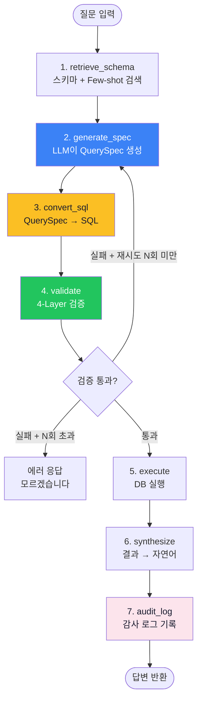

**노드 정의:**

```python
# langgraph/nl2sql/agent.py
from langgraph.graph import StateGraph, END
from typing import TypedDict

class AgentState(TypedDict):
    question: str
    schema_context: str
    few_shot: list[dict]
    spec: QuerySpec
    sql: str
    validation: ValidationResult
    rows: list
    answer: str
    retry_count: int

async def retrieve_schema(state: AgentState) -> AgentState:
    state["schema_context"] = registry.to_llm_prompt()
    state["few_shot"] = await retrieve_pairs(state["question"], k=5)
    return state

async def generate_spec(state: AgentState) -> AgentState:
    prompt = build_prompt(state["question"], state["schema_context"], state["few_shot"])
    state["spec"] = await llm.create(QuerySpec, prompt)  # Function Calling
    return state

def convert_sql(state: AgentState) -> AgentState:
    state["sql"] = converter.convert(state["spec"])
    return state

async def validate(state: AgentState) -> AgentState:
    state["validation"] = await validator.validate(state["sql"])
    return state

def should_retry(state: AgentState) -> str:
    if state["validation"].is_valid:
        return "execute"
    if state["retry_count"] >= 3:
        return "error"
    state["retry_count"] += 1
    return "regenerate"

async def execute(state: AgentState) -> AgentState:
    state["rows"] = await execute_oracle(state["sql"])
    return state

async def synthesize(state: AgentState) -> AgentState:
    state["answer"] = await llm.synthesize(state["question"], state["rows"])
    return state

async def audit_log(state: AgentState) -> AgentState:
    await record_agent_audit(
        question=state["question"],
        spec=state["spec"].model_dump(),
        sql=state["sql"],
        validation=state["validation"],
        result_count=len(state["rows"]),
    )
    return state

# 그래프 구축
g = StateGraph(AgentState)
g.add_node("retrieve_schema", retrieve_schema)
g.add_node("generate_spec", generate_spec)
g.add_node("convert_sql", convert_sql)
g.add_node("validate", validate)
g.add_node("execute", execute)
g.add_node("synthesize", synthesize)
g.add_node("audit_log", audit_log)

g.set_entry_point("retrieve_schema")
g.add_edge("retrieve_schema", "generate_spec")
g.add_edge("generate_spec", "convert_sql")
g.add_edge("convert_sql", "validate")
g.add_conditional_edges("validate", should_retry, {
    "execute": "execute",
    "regenerate": "generate_spec",
    "error": END,
})
g.add_edge("execute", "synthesize")
g.add_edge("synthesize", "audit_log")
g.add_edge("audit_log", END)

agent = g.compile()
```

> **자동 보정 루프의 의미:** Validator가 "컬럼 X가 V_FOO에 없음" 에러를 반환하면, LLM에게 그 에러 메시지를 컨텍스트로 다시 주고 재생성. **3회까지 재시도하고도 실패하면 "모르겠습니다" 응답.**

### 6-8. 감사 로그

**목표:** 모든 LLM 호출 + 생성 SQL + 실행 결과를 감사 가능한 형태로 보관.

**테이블 (BIP `agent_audit_log` 패턴 그대로):**

```sql
CREATE TABLE NL2SQL_AUDIT_LOG (
    AUDIT_ID NUMBER GENERATED ALWAYS AS IDENTITY PRIMARY KEY,
    REQUEST_ID VARCHAR2(64) NOT NULL,
    REQUEST_TS TIMESTAMP DEFAULT SYSTIMESTAMP,
    USER_ID VARCHAR2(64),
    QUESTION CLOB NOT NULL,
    GENERATED_SPEC CLOB,         -- QuerySpec JSON
    GENERATED_SQL CLOB,
    VALIDATION_PASSED CHAR(1),   -- Y/N
    VALIDATION_ERROR VARCHAR2(500),
    RETRY_COUNT NUMBER,
    EXECUTED_AT TIMESTAMP,
    ROW_COUNT NUMBER,
    ANSWER CLOB,
    LATENCY_MS NUMBER,
    LLM_MODEL VARCHAR2(64),
    LLM_TOKENS_INPUT NUMBER,
    LLM_TOKENS_OUTPUT NUMBER
);

CREATE INDEX IDX_NL2SQL_AUDIT_TS ON NL2SQL_AUDIT_LOG (REQUEST_TS);
CREATE INDEX IDX_NL2SQL_AUDIT_USER ON NL2SQL_AUDIT_LOG (USER_ID);
```

> **감사 요구사항이 강하면 90일/180일/1년 등 보관 정책 명시. CLOB로 저장하면 부피가 크므로 별도 tablespace 권장.**

---

## 7. Phase 3 — 튜닝 & 검증 (2-3주)

### 7-1. 평가셋 구성

**목표:** Phase 0에서 수집한 50개 질문을 자동 평가 가능한 형태로 정리.

**파일 위치:** `langgraph/nl2sql/tests/evaluation_set.yaml` (BIP 23개 패턴 그대로)

```yaml
# 카테고리별 분포
basic:                 # 단순 조회 (10-15개)
  - question: "이번 달 매출"
    expected_tables: ["V_DAILY_SALES_SUMMARY"]
    min_rows: 1

  - question: "매출 상위 5개 부서"
    expected_tables: ["V_DAILY_SALES_SUMMARY"]
    expected_rows: 5

boolean_flags:         # Boolean 활용 (10개)
  - question: "VIP 고객 명단"
    expected_tables: ["V_CUSTOMER_SIGNALS"]
    expected_filters: ["IS_VIP"]
    min_rows: 1

  - question: "이탈 위험 고객"
    expected_tables: ["V_CUSTOMER_SIGNALS"]
    expected_filters: ["IS_CHURNING"]

time_series:           # 시계열 (10개)
  - question: "최근 3개월 매출 추이"
    expected_tables: ["V_DAILY_SALES_SUMMARY"]
    expected_aggregations: ["SUM"]
    min_rows: 3

comparison:            # 비교 (10개)
  - question: "영업1팀 vs 영업2팀 실적"
    expected_tables: ["V_DAILY_SALES_SUMMARY"]
    expected_rows: 2

complex:               # 복합 (10개)
  - question: "VIP 중 이탈 위험자 매출 상위 10명"
    expected_tables: ["V_CUSTOMER_360", "V_CUSTOMER_SIGNALS"]
    expected_filters: ["IS_VIP", "IS_CHURNING"]
    expected_rows: 10
```

### 7-2. 평가 자동화 스크립트

```python
# scripts/run_evaluation.py
import asyncio, yaml
from langgraph.nl2sql.agent import agent

async def evaluate(eval_set_path: str):
    with open(eval_set_path) as f:
        cases = yaml.safe_load(f)

    results = []
    for category, items in cases.items():
        for case in items:
            try:
                result = await agent.ainvoke({"question": case["question"]})
                grade = grade_result(result, case)
                results.append({
                    "category": category,
                    "question": case["question"],
                    "grade": grade,                # A/B/F
                    "spec": result["spec"].model_dump(),
                    "sql": result["sql"],
                    "row_count": len(result["rows"]),
                })
            except Exception as e:
                results.append({"category": category, "question": case["question"],
                                "grade": "F", "error": str(e)})

    # 등급 분포 + 카테고리별 정확도 리포트
    print_report(results)
    save_json("reports/eval_results.json", results)

def grade_result(result, expected) -> str:
    """5차원 평가 (BIP 패턴):
    - 실행: SQL이 에러 없이 실행됐는가?
    - 의미: 예상 테이블/필터를 사용했는가?
    - 결과: 행 수가 예상 범위인가?
    - 효율: SQL이 불필요한 JOIN/스캔 없이 깔끔한가?
    - 의도: 답변이 질문에 직접 답하는가?
    """
    # ... 채점 로직
    return "A"  # 모두 만족
```

### 7-3. 테스트-개선 사이클

**BIP 검증된 사이클:**

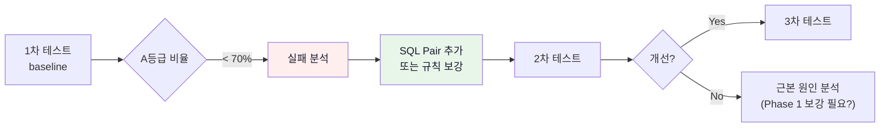

**BIP 실제 결과 (참고):**

| 차수 | 변경 | A등급 | 인사이트 |
|:---:|------|:---:|------|
| 1차 | baseline | 75% | LLM이 시간 표현("최근")을 자주 누락 |
| 2차 | SQL Pair 추가 (시계열 10개) | 85% | Boolean flag 0% 발견 — Curated View 등록 누락 |
| 3차 | LLM 변경 (gpt-4o-mini → 4.1-mini) | 100% SQL | 답변 품질에서 sql_answer 환각 발견 |
| 4차 | 컬럼 재등록 + 해석 컬럼 도입 | 100% SQL + 87% boolean | 종합 A등급 100% |

### 7-4. 흔한 실패 패턴 + 대응

| 실패 | 증상 | 원인 | 해결 |
|------|------|------|------|
| 약칭 매핑 | "현차" → 0행 | LIKE 매칭 실패 | SQL Pair에 약칭→정식명 예시 |
| 영문 번역 | "셀트리온" → `'Celltrion'` | LLM 자동 번역 | System prompt에 "한글 필수" |
| 잘못된 컬럼 | `WHERE PROFIT_RATE` (실제는 `PROFIT_MARGIN_PCT`) | Description 부족 | DB COMMENT 보강 |
| 시간 범위 누락 | "최근 매출" → WHERE 없음 | LLM이 모호 표현 무시 | TimeScope 강제 + Few-shot |
| 답변 환각 | SQL 결과 있는데 "없다"고 답변 | Synthesizer LLM 문제 | 해석 컬럼 추가 + 프롬프트 강화 |
| JOIN 환각 | 존재하지 않는 키로 JOIN | joins.yaml 미반영 | Schema Registry 재로드 |

### 7-5. WrenAI 결과 비교 (BIP 환경 벤치마크)

**목적:** v3 LangGraph 구현이 WrenAI(BIP에서 100% 달성한 엔진) 대비 어느 수준인지 객관 비교.

**방법:**
1. 동일한 평가셋 23개를 WrenAI(BIP) + LangGraph(v3) 양쪽에 실행
2. 5차원 채점 (실행/의미/결과/효율/의도)
3. 실패 패턴이 다른 부분을 분석 → v3 어느 모듈이 약한지 식별

**비교 매트릭스 예시:**

| 차원 | WrenAI | v3 | 차이 분석 |
|------|:-:|:-:|------|
| 실행 | 100% | ? | sqlglot 검증이 ibis-engine 대비 강함/약함 |
| 의미 | 100% | ? | Function Calling이 MDL+RAG 대비 |
| 결과 | 100% | ? | JOIN 자동 처리가 Wren Relationship 대비 |
| 효율 | A | ? | 불필요 컬럼/JOIN 발생 여부 |
| 의도 | 87% | ? | Synthesizer가 sql_answer 대비 |

> **이 비교가 끝나면 사내 적용 의사결정 자료로 활용.** "v3가 WrenAI 대비 X% 정확도, Oracle 19c는 v3로만 가능 → 채택" 형태로 보고.

---

## 8. Phase 4 — 운영 & 확장 (지속)

### 8-1. FastAPI 서빙

```python
# bip_agents/api/nl2sql.py
from fastapi import APIRouter, HTTPException
from langgraph.nl2sql.agent import agent

router = APIRouter(prefix="/nl2sql")

@router.post("/query")
async def query(req: QueryRequest):
    try:
        result = await agent.ainvoke({
            "question": req.question,
            "user_id": req.user_id,
        })
        return {
            "answer": result["answer"],
            "sql": result["sql"],
            "rows": result["rows"],
            "request_id": result["request_id"],
        }
    except Exception as e:
        raise HTTPException(500, str(e))
```

### 8-2. 일상 운영

| 작업 | 주기 | 방법 |
|------|------|------|
| Description 동기화 | 매일 | OM → DB COMMENT → Schema Registry reload |
| SQL Pair 추가 | 주 1-2회 | 실패 케이스 → 사람이 정답 작성 → 임베딩 재색인 |
| 평가셋 정확도 측정 | 주 1회 | `scripts/run_evaluation.py` 자동 실행 |
| 감사 로그 리뷰 | 월 1회 | 비정상 패턴(이상치 SQL, 과도 재시도) 점검 |

### 8-3. 확장 시 고려사항

**새 테이블/View 추가:**
1. Phase 1 단계대로 Gold/Curated View 생성
2. DB COMMENT 작성
3. `joins.yaml`에 관계 추가
4. NL2SQL_READER에 GRANT
5. SQL Pair 5–10개 추가
6. Schema Registry 재로드 → 평가셋 실행

**비정형 RAG 추가 (문서/회의록):**
- LangGraph Agent에 `rag_search` 노드 추가
- Intent Classifier로 라우팅 ("찾아줘"는 RAG, "알려줘"는 NL2SQL)

**MCP Tools 연동 (Jira/Slack):**
- LangGraph Agent에 `mcp_call` 노드 추가
- "지금/현재" 키워드 → MCP 라우팅

**사내 LLM 전환:**
- LiteLLM 어댑터로 모델 교체 (Function Calling 지원 모델 필수)
- 평가셋 재실행 → A등급 비율 비교

---

## 9. 보안 아키텍처

### 9-1. 5-Layer 방어 (BIP 4-Layer 확장)

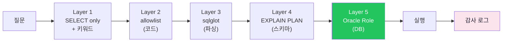

| Layer | 역할 | 차단 가능한 공격 |
|:----:|------|----------------|
| 1 | SELECT only + 키워드 | INSERT/DROP 시도 |
| 2 | 테이블 allowlist | 민감 테이블 SELECT 시도 |
| 3 | sqlglot 파싱 | 문법 우회 시도 |
| 4 | EXPLAIN PLAN | 존재하지 않는 컬럼 환각 |
| 5 | Oracle Role | 코드 버그/우회 시도 |

### 9-2. 감사 + 모니터링

| 항목 | 보관 기간 | 알람 조건 |
|------|:--------:|---------|
| 모든 질문 + SQL + 결과 | 90일 (또는 사내 정책) | - |
| Validator 차단 이벤트 | 1년 | 일 10건 이상 |
| 재시도 3회 초과 (실패) | 1년 | 일 5건 이상 |
| 응답 시간 > 30s | 90일 | 평균 > 15s 시 |

---

## 10. WrenAI 경험 → v3 해결 매핑

BIP에서 발견한 한계가 v3에서 어떻게 해결되는지 정리.

| BIP 문제 (WrenAI) | 원인 | v3 해결 |
|---------|------|----------|
| sql_answer 환각 ("데이터 없다") | sql_answer가 description 미참조 | Synthesizer를 LangGraph 노드로 직접 제어 + 해석 컬럼으로 데이터 자체에 텍스트 |
| 1질문=1SQL 제약 | WrenAI 구조 | Agent 멀티스텝 (retrieve → spec → sql → execute → 다음 질문 분기) |
| 프롬프트 커스터마이징 불가 | OSS 소스 수정 부담 | LangGraph 프롬프트 완전 제어 |
| OpenAI json_schema 편향 | WrenAI 내부 구현 | LiteLLM 어댑터로 어떤 LLM이든 |
| Boolean flag 미사용 (0%) | Curated View 컬럼 미등록 | Schema Registry가 DB COMMENT 자동 로드 → 누락 불가 |
| 약칭 매핑 실패 (현차→현대차) | Entity Resolution 없음 | Schema RAG가 Few-shot으로 학습 |
| 종목명 영문 번역 | Instructions 간헐적 미준수 | System prompt + Function Calling 강제 |
| 1질문에 RAG/MCP 통합 불가 | WrenAI 단일 도구 | LangGraph Tool 라우팅 노드 |

---

## 11. 리스크 및 대응

| 리스크 | 영향 | 대응 |
|-------|------|------|
| 자체 구현 → 초기 개발 부담 | 일정 지연 | 모듈 뼈대 이미 구축 (`BIP-Agents/langgraph/nl2sql/`). 단위 테스트로 점진적 강화 |
| SQL Converter 버그 | 잘못된 SQL 실행 | Validator 4-Layer + 감사 로그. 단위 테스트 커버리지 90%+ 목표 |
| 사내 LLM Function Calling 미지원 | QuerySpec 안정성 저하 | 사전 검증 필수. 미지원 시 JSON Schema 기반 prompt + 파싱 fallback |
| Oracle 운영 DB 부하 | NL2SQL이 운영 영향 | 읽기 전용 replica 사용 또는 Materialized View로 캐싱 |
| Agent 환각 | 잘못된 답변 | 결정론 우선(Validator 통과 안 하면 답변 거부) + Synthesizer 검증 |
| LLM 비용 | 운영 비용 증가 | Schema Context 최소화, Few-shot 5개로 제한, 자주 묻는 질문 캐시 |
| 사내 보안 정책 | 외부 LLM 불가 시 | 사내 Azure OpenAI 또는 사내 LLaMA. 평가셋으로 모델별 비교 후 결정 |

---

## 12. 성공 기준

| 지표 | 목표 |
|------|:----:|
| Phase 1 완료 (Gold View + Curated View 등록) | 5종 이상 |
| Schema Registry 자동 로드 | 성공 |
| QuerySpec 단위 테스트 | 90%+ 커버리지 |
| Oracle 19c 연결 + dry-run 검증 | 성공 |
| 평가셋 50개 정확도 (A등급) | 80%+ |
| WrenAI(BIP) 대비 정확도 격차 | 10% 이내 |
| 평균 응답 시간 | < 15s |
| 감사 로그 누락 | 0건 |
| 보안 감사 통과 | Pass |

---

## 13. 의사결정 이력 (2026-04 ~ 2026-05)

### 13-1. WrenAI Oracle 19c 검증 (2026-04-15)

```
docker compose 기반 WrenAI 띄우고 Oracle 19c 연결 시도
→ DB 연결 자체는 성공
→ ibis-server 내부 get_db_version 단계에서 ORA-00942
→ WrenAI OSS 문서: Oracle 23ai 이상만 공식 지원
→ 결론: WrenAI 직결 불가
```

### 13-2. Cube 검증 (2026-04-18 ~ 2026-04-25)

BIP PostgreSQL에 Cube를 연결하여 7개 시맨틱 모델을 구축하고 테스트한 결과, **복합 JOIN에서 치명적 제약**.

| 테스트 | 결과 |
|--------|:----:|
| 단순 조회 (`StockInfo.count`) | ✅ 11,382 |
| 단일 Cube 쿼리 (`삼성전자 종가`) | ✅ 224,500원 |
| Boolean flag (`저평가주 수`) | ✅ 1,676개 |
| 2-Cube JOIN (StockInfo 경유) | ✅ |
| **팩트-팩트 JOIN** (ValuationSignals + FlowSignals) | ❌ `Can't find join path` |
| **3-Cube JOIN** | ❌ |
| **저평가 + 외국인 순매수 종목** | ❌ |
| **과매도이면서 저평가 종목** | ❌ |

**원인:** 모든 Cube가 `StockInfo`로만 연결되어 있어 팩트-팩트 결합 불가. Cube의 JOIN 모델은 1:N 관계를 자동 구성하지만 N:N(팩트끼리) 결합은 별도 설계가 필요.

**결론:** WrenAI에서는 단일 SQL로 동작했던 핵심 사용 케이스가 Cube에서는 모두 실패. Cube 탈락.

### 13-3. LangGraph + QuerySpec 선정 (2026-04-26)

**Codex 검토 결과:** 옵션 A (WrenAI + 복제) → C (LangGraph) → B (WrenAI 포크) 순서 권장. 단기 안전성은 A, 장기 확장성은 C. 사내 Oracle 직결 + 비정형 RAG/MCP 확장을 고려하면 **C가 결국 도달점**.

**추가 조사:**

- **DAQUV (https://docs.daquv.com)**
  - NL → **SMQ(중간 표현)** → SQL 변환 (규칙 기반)
  - LLM은 SQL을 직접 만들지 않고 **메트릭/필터/그룹**만 구조화
  - SafeGuard: SQL 실행 실패 시 자동 수정·재시도

- **논문: "Querying Databases with Function Calling" (arXiv 2502.00032)**
  - Function Calling이 SQL 직접 생성보다 안정적
  - Claude 3.5 Sonnet 74.3%, GPT-4o-mini 73.7% 정확도
  - 구조화된 도구 호출 → SQL 문법 에러 원천 차단

**시사점:** LLM에게 SQL을 직접 쓰게 하지 말고 **구조화된 쿼리 명세(QuerySpec)** 를 만들게 하는 것이 정확도/안정성에서 유리. → 그대로 v3 아키텍처 채택.

### 13-4. v2 → v3 변경점 정리

| 항목 | v2 (Cube 기반) | v3 (LangGraph 직접) |
|------|:-:|:-:|
| 시맨틱 레이어 | Cube 모델 | **DB View (Gold + Curated)** |
| SQL 생성 | Cube API → Cube 내부 | **LLM → QuerySpec → 변환기** |
| 복합 JOIN | ❌ 제약 있음 | **✅ 자유** |
| 시맨틱 정의 | Cube model/*.js | **DB COMMENT + joins.yaml** |
| 메타 허브 | OM + Cube 이중화 | **OM 단일** |
| 인프라 | Cube 컨테이너 추가 | **추가 컨테이너 없음** |
| Oracle 19c | Cube → node-oracledb | **직접 cx_Oracle / oracledb** |

---

## 14. 진행 현황 (2026-05-11 기준)

**완료:**
- 아키텍처 결정 + 의사결정 이력 정리
- Cube 7개 모델 구축 + 한계 검증
- 평가셋 23개 정의 (`tests/evaluation_set.yaml`)
- JOIN 관계 YAML (`joins.yaml`, 11개)
- QuerySpec Pydantic 모델 (`query_spec.py`)
- SQL Converter 뼈대 (`sql_converter.py`, PostgreSQL/Oracle 방언 분기)
- Schema Registry 뼈대 (`schema_registry.py`)
- Validator 뼈대 (`validator.py`, 4-Layer)

**위치:** `BIP-Agents/langgraph/nl2sql/`

**진행 중:**
- SQL Converter 단위 테스트 (실데이터 검증)

**남은 작업:**
- LangGraph Agent 노드 구성 (`agent.py`)
- Schema RAG (pgvector + 임베딩 적재)
- 자동 보정 루프
- 평가셋 23개 실행 → WrenAI 결과와 비교
- FastAPI 서빙
- Oracle 19c 적용 (사내 환경)

---

## 15. 체크리스트 (전체)

### Phase 0 완료 조건
- [ ] 대상 테이블 인벤토리 작성 (Raw / Derived / Reporting / 민감 분류)
- [ ] 질문 유형 30-50개 수집
- [ ] 민감 테이블 목록 확정
- [ ] NL2SQL 전용 Oracle Role 계획
- [ ] LLM 외부 호출 가능성 확인 (사내 정책)

### Phase 1 완료 조건
- [ ] Oracle Gold View 5종 이상 생성
- [ ] Curated View (Boolean Flag) 생성
- [ ] 해석 컬럼 추가
- [ ] 모든 대상 컬럼에 description 작성
- [ ] DB COMMENT 반영
- [ ] NL2SQL_READER 생성 + GRANT
- [ ] joins.yaml 작성

### Phase 2 완료 조건
- [ ] Schema Registry — Oracle COMMENT 자동 로드
- [ ] QuerySpec 단위 테스트 90%+
- [ ] SQL Converter — Oracle 방언 단위 테스트
- [ ] Validator — 4-Layer 모두 통과
- [ ] Schema RAG — pgvector 또는 사내 벡터 DB 적재
- [ ] LangGraph Agent — 평가셋 1개 통과
- [ ] 자동 보정 루프 동작 확인
- [ ] 감사 로그 테이블 생성

### Phase 3 완료 조건
- [ ] 평가셋 50개 작성
- [ ] 자동 평가 스크립트 작성
- [ ] A등급 80%+ 달성
- [ ] 실패 패턴 분석 리포트 작성
- [ ] WrenAI(BIP) 대비 비교 완료

### Phase 4 완료 조건
- [ ] FastAPI 서빙
- [ ] 감사 로그 운영 모니터링
- [ ] 사내 LLM 연동 (해당 시)
- [ ] Oracle 19c 적용 + 보안 감사 통과

---

## 16. 참고 문서

| 문서 | 내용 |
|------|------|
| `docs/nl2sql_enterprise_playbook.md` | 데이터 정비 일반 가이드 (Phase 0–1 동일) |
| `docs/nl2sql_agent_design.md` | LangGraph Agent + QuerySpec 상세 설계 |
| `docs/nl2sql_design.md` | BIP-Pipeline NL2SQL 아키텍처 (WrenAI 기반) |
| `docs/nl2sql_concepts.md` | NL2SQL/시맨틱 레이어/KG 개념 레퍼런스 |
| `docs/seminar_semantic_layer.md` | 시맨틱 레이어 세미나 (개념·도구 비교) |
| `docs/guide_cubejs.md` | Cube.js 기능 가이드 |
| `docs/guide_dbt.md` | dbt Core 기능 가이드 |
| `docs/guide_openmetadata.md` | OpenMetadata 기능 가이드 |
| `docs/guide_wrenai.md` | WrenAI 기능 가이드 (BIP 레퍼런스) |
| `docs/wrenai_test_report.md` | BIP WrenAI 4차 테스트 이력 |
| `docs/data_modeling_guide.md` | Gold/View/Grain 설계 원칙 |

**외부 자료:**
- DAQUV docs: https://docs.daquv.com
- Function Calling 논문: https://arxiv.org/abs/2502.00032
- 토스 PANDA: https://toss.tech/article/da-assistant-panda
- LangGraph: https://langchain-ai.github.io/langgraph/

---

## 변경 이력

| 날짜 | 내용 |
|------|------|
| 2026-04-18 | 초안 작성 (OM + Cube + Agent 아키텍처) |
| 2026-04-22 | 문서 헤더 정리 |
| 2026-04-26 | v3 방향 전환 추가 (Cube 탈락 + LangGraph 직접 구현). DAQUV/논문 분석 반영 |
| 2026-05-11 | **enterprise_playbook 스타일로 전면 재작성**. Phase 0–4 단계별 구체화, QuerySpec/Converter/Validator 실제 코드 통합, Oracle 19c 방언 명시, 5-Layer 보안, 의사결정 이력 단일 위치 통합 |
