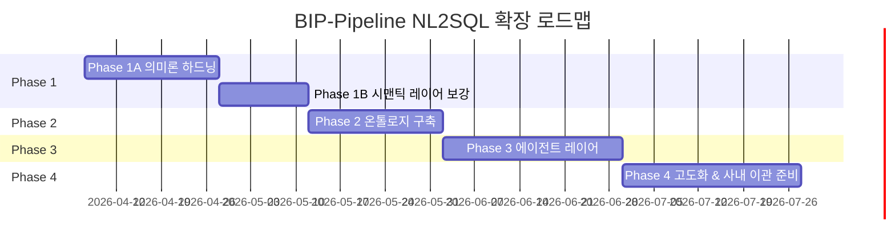
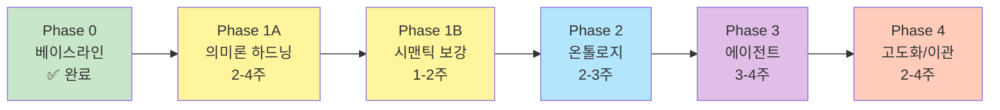

# BIP-Pipeline NL2SQL 로드맵 v2 (Phase별 실행 계획)

> **작성일:** 2026-04-05
> **선행 문서:** `docs/nl2sql_architecture_v2.md` (최종 목표 아키텍처)
> **문서 지위:** 실행 계획서. 각 Phase별 목표, 작업 목록, 산출물, 성공 기준, 기간 추정, 의존 관계를 정의.
> **배경:** 개인 투자 데이터로 사전 검증 후 사내 업무 데이터에 적용 예정. 따라서 "경량화"보다 **엔터프라이즈 확장성과 구조적 검증**이 우선.

---

## 목차

1. [로드맵 개요](#1-로드맵-개요)
2. [Phase 0: 베이스라인 (완료)](#2-phase-0-베이스라인-완료)
3. [Phase 1A: 의미론 하드닝](#3-phase-1a-의미론-하드닝-2-4주)
4. [Phase 1B: 시맨틱 레이어 보강](#4-phase-1b-시맨틱-레이어-보강-1-2주)
5. [Phase 2: 온톨로지 구축](#5-phase-2-온톨로지-구축-2-3주)
6. [Phase 3: 에이전트 레이어](#6-phase-3-에이전트-레이어-3-4주)
7. [Phase 4: 고도화 및 사내 이관 준비](#7-phase-4-고도화-및-사내-이관-준비-2-4주)
8. [전체 일정 및 의존 관계](#8-전체-일정-및-의존-관계)
9. [리스크 관리](#9-리스크-관리)

---

## 1. 로드맵 개요

### 1-1. 전체 Phase 요약

**총 기간:** 약 16주 (4개월), 솔로 개발자 기준. 엔터프라이즈 이관은 별도 일정.

### 1-2. Phase별 목표 한줄 요약

| Phase | 기간 | 핵심 목표 |
|-------|:---:|---------|
| **0. 베이스라인** | 완료 | 데이터 레이어, OM, Wren AI, 보안 4-layer 구축 완료 |
| **1A. 의미론 하드닝** | 2-4주 | 스키마 의미 결손(stock_metadata, timestamp, 단위, sector) 정리 + allowlist 축소 + 회귀 평가셋 |
| **1B. 시맨틱 레이어 보강** | 1-2주 | Curated View = 계산 SSOT + Wren MDL shell + Glossary 주입 + consistency check |
| **2. 온톨로지 구축** | 2-3주 | Neo4j Community + YAML sidecar + 개념 그래프 + Cypher 템플릿 |
| **3. 에이전트 레이어** | 3-4주 | LangGraph 5단계 (deterministic 3 + LLM 2) + Evidence Budget + NL2SQLEngine 추상화 |
| **4. 고도화 & 사내 이관 준비** | 2-4주 | 평가 프레임워크 + 비용 모니터링 + 사내 데이터 매핑 가이드 |

### 1-3. 각 Phase 종료 시 검증 항목

Codex 리뷰의 핵심: "각 레이어의 운영 부담과 실패 모드를 증거 기반으로 수집해 사내 적용 시 리스크 산정에 사용한다."

| Phase | 검증 산출물 |
|-------|----------|
| 1A | 의미론 이슈 해결 증명 리포트, allowlist 축소 diff, 회귀 평가셋 50개 PASS |
| 1B | Consistency check CI 녹색, Curated View 성능 측정, 3층 역할 분리 문서화 |
| 2 | 온톨로지 authoring 부담 측정 리포트, Cypher 템플릿 라이브러리, KG path 쿼리 p95 latency |
| 3 | 에이전트 LLM 호출 수 로그 (2회 제한 준수), Evidence Budget 동작 통계, Stage별 A/B test 환경 |
| 4 | NL2SQL 정확도 대시보드, LLM 비용 추적, 사내 데이터 이관 체크리스트 |

---

## 2. Phase 0: 베이스라인 (완료)

**이미 구축된 것** (자세한 내용은 `docs/data_architecture_review.md`, `docs/wrenai_technical_guide.md` 참조):

### 2-1. 데이터 레이어
- Medallion 3단 (Raw/Derived/Gold)
- Gold 테이블 3개 (`analytics_stock_daily` 1.9M행, `analytics_macro_daily` 437행, `analytics_valuation` 7,609행)
- Gold DAG KR/US 분리 (`09_analytics_stock_daily_kr/us`)

### 2-2. 메타데이터 레이어
- OpenMetadata 1.12.3 (39 tables, 77 glossary terms)
- Lineage: apiEndpoint(9) → DAG(43) → Table(39) → Consumer(2), 67 edges
- Tags: DataLayer, Domain, SourceType, SecurityLevel
- `10_sync_metadata_daily` DAG 자동 동기화

### 2-3. 얕은 시맨틱 레이어
- Wren AI (Engine 0.22.0 / AI Service 0.29.0 / UI 0.32.2, gpt-4o-mini)
- 5 models (Gold 3 + Raw 2), 41 SQL Pairs, 3 Instructions, 4 Relationships

### 2-4. 보안·거버넌스
- 4-Layer defense (Layer 1-3 활성, Layer 4는 Phase 1A에서 Curated View로 전환)
- `nl2sql_exec` 전용 role, 10개 테이블만 GRANT
- `nl2sql_audit_log` + `agent_audit_log` 양쪽 경로
- 39개 통합 테스트 PASS

### 2-5. 에이전트 (부분)
- `morning_pulse_langgraph` (멀티노드 모닝 브리핑)
- `checklist_agent` (4단계: parser/collector/signal/explainer, LLM 1회)
- BIP-Agents FastAPI 감사 경로 구축

---

## 3. Phase 1A: 의미론 하드닝 (2-4주)

### 3-1. 목표

Codex 1차 리뷰 핵심: **"의미 결손이 남은 상태로 상위 레이어를 쌓으면 쓰레기 in/쓰레기 out"**.
Phase 2 온톨로지, Phase 3 에이전트를 올리기 전에 **스키마 의미 자체를 정리**한다.

### 3-2. 작업 목록 (WBS)

**W1. 스키마 정리 (Week 1-2)**

| # | 작업 | 산출물 | 의존 |
|---|------|------|------|
| 1A-01 | `stock_metadata` 영향 분석 (downstream 확인) | 영향 리포트 | - |
| 1A-02 | `stock_metadata` DROP 또는 VIEW로 대체 | 마이그레이션 SQL | 1A-01 |
| 1A-03 | `stock_price_1d.trade_date DATE` 컬럼 추가 + 기존 데이터 backfill | 마이그레이션 SQL, DAG 업데이트 | - |
| 1A-04 | `timestamp/timestamp_ny/timestamp_kst` 의미 COMMENT 명시 | COMMENT DDL | 1A-03 |
| 1A-05 | `stock_info.market_value` 단위 COMMENT + view 이중화 (`market_value_krw`) | COMMENT DDL, View 컬럼 | - |
| 1A-06 | `stock_info.sector/industry` 컬럼 추가 + KRX 분류 데이터 채우기 | 마이그레이션 SQL, 수집 DAG | - |
| 1A-07 | OpenMetadata에 변경 반영 (description + tags) | OM sync | 1A-01~06 |

**W2. Allowlist 축소 (Week 2-3)**

| # | 작업 | 산출물 | 의존 |
|---|------|------|------|
| 1A-08 | 현재 Wren AI 모델 사용 패턴 분석 (어떤 테이블이 실제 쿼리에 사용되나) | 사용 통계 리포트 | - |
| 1A-09 | `NL2SQL_ALLOWLIST`를 Gold + 핵심 Raw (stock_info, stock_price_1d)로 축소 | `validator_config.py` diff | 1A-08 |
| 1A-10 | `postgres/nl2sql_role.sql` GRANT 재조정 | 마이그레이션 SQL | 1A-09 |
| 1A-11 | Wren AI 모델 목록 정리 (Gold 3 + 핵심 Raw 2 유지, 나머지 검토) | Wren AI UI 반영 | 1A-09 |
| 1A-12 | 39개 보안 통합 테스트 재실행 + 축소 후 녹색 유지 | 테스트 결과 | 1A-09~11 |

**W3. 회귀 평가셋 구축 (Week 3-4)**

| # | 작업 | 산출물 | 의존 |
|---|------|------|------|
| 1A-13 | NL2SQL 평가셋 스키마 정의 (question, expected_sql, expected_tables, notes) | `eval/nl2sql_eval_v1.yaml` | - |
| 1A-14 | 평가 케이스 50개 작성 (카테고리: 기본조회/기술지표/밸류에이션/매크로/수급/복합) | YAML 파일 | 1A-13 |
| 1A-15 | 자동 평가 스크립트 (Wren AI REST API + 정답 비교) | `scripts/nl2sql_eval.py` | 1A-13 |
| 1A-16 | 기준선 A등급 비율 측정 (현재 수준 기록) | 기준선 리포트 | 1A-14, 1A-15 |
| 1A-17 | 의미론 하드닝 후 재측정 (개선률 증명) | 비교 리포트 | 1A-12, 1A-16 |

**W4. Glossary 주입 (Week 4)**

| # | 작업 | 산출물 | 의존 |
|---|------|------|------|
| 1A-18 | `om_sync_wrenai.py` 확장: 컬럼에 링크된 Glossary term 정의를 description에 구조화 블록으로 append | 업데이트된 스크립트 | - |
| 1A-19 | description 블록 포맷 정의 (`## Definition`, `## Unit`, `## Synonyms`, `## Related Terms`) | 템플릿 | 1A-18 |
| 1A-20 | 77개 용어 → Wren AI 반영 + Deploy | Deployment log | 1A-18, 1A-19 |

### 3-3. 성공 기준

- [ ] `stock_metadata` 제거 또는 downstream 모두 `stock_info` 사용 확인
- [ ] `trade_date` 컬럼 존재 + 기존 timestamp와 일관성 검증
- [ ] `market_value` 단위 오해로 인한 과거 이슈 재발 방지 테스트 PASS
- [ ] `sector/industry` 컬럼 90% 이상 채워짐
- [ ] `NL2SQL_ALLOWLIST`가 Gold 중심으로 축소됨
- [ ] 회귀 평가셋 50개 구축 및 기준선 측정 완료
- [ ] 하드닝 후 A등급 비율이 기준선 대비 개선 (목표: +10%p 이상)
- [ ] 39개 보안 통합 테스트 여전히 PASS
- [ ] 77개 Glossary 용어가 Wren AI description에 구조화된 블록으로 반영됨

### 3-4. 기간 및 리스크

- **기간:** 2-4주 (Codex 권고)
- **주 리스크:**
  - `stock_metadata` downstream이 생각보다 많을 경우 (솔루션: 단계적 deprecation + VIEW 브리지)
  - `sector/industry` 데이터 수집 소스 결정 지연 (솔루션: KRX 분류부터 시작)
  - 기준선 측정 결과가 이미 높으면 개선 여지 불명확 (솔루션: 세부 카테고리별 측정)

---

## 4. Phase 1B: 시맨틱 레이어 보강 (1-2주)

### 4-1. 목표

Phase 1A에서 정리된 의미론 기반 위에 **3층 역할 분리 (View=truth, MDL=shell, OM=description)**를 확정한다. 계산 SSOT 중복을 automation으로 방지.

### 4-2. 작업 목록

**W1. Curated Views 작성**

| # | 작업 | 산출물 |
|---|------|------|
| 1B-01 | View 네이밍 규율 문서화 (`v_<domain>_<subject>__v<N>`) | `docs/curated_views_naming.md` |
| 1B-02 | `v_valuation_signals__v1` 작성 (is_value_stock, is_value_growth, is_high_dividend 등) | SQL 파일 |
| 1B-03 | `v_technical_signals__v1` (is_golden_cross, is_oversold_rsi, is_bollinger_squeeze) | SQL 파일 |
| 1B-04 | `v_flow_signals__v1` (foreign_buy_amount, institution_buy_amount, flow_intensity) | SQL 파일 |
| 1B-05 | `v_sector_summary__v1` (sector별 avg PER/ROE, 상승/하락 종목수) | SQL 파일 |
| 1B-06 | 각 View에 COMMENT 작성 (계산식은 COMMENT 안에 기재, SSOT 증명) | DDL |
| 1B-07 | Wren AI에 View 모델로 등록 + nl2sql_exec GRANT | Wren 모델 등록 |

**W2. Wren AI MDL 얇게 재정리**

| # | 작업 | 산출물 |
|---|------|------|
| 1B-08 | 기존 MDL에서 수식 형태 description 제거 (View로 이전 완료된 것) | MDL diff |
| 1B-09 | Wren Calculated Fields (집계만) 재검토 - 유지할 것만 | 수정된 MDL |
| 1B-10 | Relationships 4개 → 필요한 만큼 확장 (View ↔ Raw 연결) | MDL 업데이트 |
| 1B-11 | Metrics 정의 (집계 가능한 KPI만) | MDL 업데이트 |

**W3. Consistency Check 자동화**

| # | 작업 | 산출물 |
|---|------|------|
| 1B-12 | 일관성 검사 스크립트 작성 | `scripts/check_semantic_consistency.py` |
| 1B-13 | 검사 항목: OM description 해시 vs MDL description 해시, View 컬럼 vs MDL 컬럼, OM term vs View COMMENT | 스크립트 로직 |
| 1B-14 | Airflow DAG에 통합 (`10_sync_metadata_daily` 확장) | DAG 업데이트 |
| 1B-15 | 실패 시 알림 (Slack/Email) | 알림 설정 |

**W4. 평가셋 확장 및 재측정**

| # | 작업 | 산출물 |
|---|------|------|
| 1B-16 | 평가 케이스 50개 → 80개 확대 (복합 조건, View 컬럼 활용 질문 추가) | `eval/nl2sql_eval_v2.yaml` |
| 1B-17 | Wren AI SQL Pairs 확대 (41 → 80개 수준) | Wren AI DB |
| 1B-18 | 평가 재측정 + A등급 비율 기록 | 리포트 |

### 4-3. 성공 기준

- [ ] 계산식이 Curated View에만 존재 (MDL/OM에 중복 없음, consistency check 녹색)
- [ ] Wren AI가 View 컬럼을 정확히 참조하는 SQL 생성 (평가셋 검증)
- [ ] Consistency check DAG 매일 녹색 유지
- [ ] 평가셋 80개로 확대, A등급 비율 Phase 1A 대비 추가 개선

### 4-4. 기간 및 리스크

- **기간:** 1-2주
- **주 리스크:**
  - Curated View가 DAG 실행 순서와 충돌 (솔루션: View는 기본 materialized X, 성능 문제 시 MATERIALIZED VIEW 전환)
  - Wren AI가 View 컬럼 설명을 무시 (솔루션: SQL Pairs에 View 활용 예시 명시)

---

## 5. Phase 2: 온톨로지 구축 (2-3주)

### 5-1. 목표

Neo4j Community Edition을 **planner/context layer**로 도입한다. 개념 확장과 entity 해석에만 사용하고, 수치 계산은 여전히 PostgreSQL/Wren AI가 담당.

### 5-2. 작업 목록

**W1. Neo4j 기반 구축**

| # | 작업 | 산출물 |
|---|------|------|
| 2-01 | `docker-compose.neo4j.yml` 작성 (Community Edition, JVM 4GB, stock-network) | Docker Compose |
| 2-02 | 초기 스키마 제약 조건 (uniqueness constraint, index) Cypher 스크립트 | `ontology/schema.cypher` |
| 2-03 | Neo4j 읽기 전용 유저 `nl2sql_neo4j_reader` 생성 | 사용자 설정 |
| 2-04 | BIP-Pipeline `.env`에 Neo4j 연결 정보 추가 | env 파일 |
| 2-05 | Neo4j 백업/복구 스크립트 (offline dump/load) | `scripts/neo4j_backup.sh` |

**W2. YAML 저장소 + Sync 파이프라인**

| # | 작업 | 산출물 |
|---|------|------|
| 2-06 | `ontology/` 디렉토리 구조 초기화 (`concepts/`, `stocks/`, `relationships/`, `schema.yaml`) | 디렉토리 |
| 2-07 | YAML schema validator 작성 (jsonschema 또는 pydantic) | `scripts/validate_ontology_yaml.py` |
| 2-08 | `sync_yaml_to_neo4j.py` 작성 (MERGE 기반 멱등 업데이트, dry-run 모드) | 스크립트 |
| 2-09 | Git pre-commit hook 또는 DAG으로 sync 자동화 | hook/DAG |
| 2-10 | `om_sync_glossary_to_neo4j.py` (OM Glossary term → Neo4j Term node) | 스크립트 |

**W3. 도메인 지식 수집 및 1차 데이터 입력**

| # | 작업 | 산출물 |
|---|------|------|
| 2-11 | KRX 업종 분류 스크래핑/다운로드 | 원본 데이터 |
| 2-12 | DART 사업보고서에서 주요 종속회사/매출처/원재료 추출 | 원본 데이터 |
| 2-13 | Sector/Theme Concept 노드 YAML 작성 (약 30-50개) | `ontology/concepts/sectors/*.yaml` |
| 2-14 | Stock → Sector `HAS_MEMBER` 관계 1차 채우기 (Top 500 KOSPI/KOSDAQ) | `ontology/relationships/*.yaml` |
| 2-15 | Competitor 관계 작성 (WiseReport 경쟁사 비교표 기반) | YAML |
| 2-16 | 77개 OM Glossary → Term 노드 마이그레이션 | YAML + sync |

**W4. Cypher 템플릿 라이브러리**

| # | 작업 | 산출물 |
|---|------|------|
| 2-17 | 핵심 쿼리 템플릿 정의 (EXPAND_CONCEPT, FIND_COMPETITORS, RESOLVE_ENTITY, FIND_SECTOR_MEMBERS) | `ontology/cypher_templates.py` |
| 2-18 | 각 템플릿 단위 테스트 (실제 데이터로 결과 검증) | 테스트 파일 |
| 2-19 | 템플릿 카탈로그 문서 (에이전트가 참조할 "쿼리 책자") | `docs/cypher_template_catalog.md` |

### 5-3. 성공 기준

- [ ] Neo4j Community 컨테이너 안정 운영 (1주 이상 restart 없음)
- [ ] YAML validator로 스키마 어긋남 없음
- [ ] 주요 섹터(30개) + 주요 종목(500개) Neo4j 반영
- [ ] 77개 Term 노드 생성
- [ ] Cypher 템플릿 10개 이상, 각 p95 latency < 100ms
- [ ] `sync_yaml_to_neo4j.py` 멱등성 검증 (여러 번 실행해도 결과 동일)

### 5-4. 기간 및 리스크

- **기간:** 2-3주
- **주 리스크:**
  - 도메인 지식 수집이 예상보다 오래 걸림 (솔루션: Top 100 종목만 1차, 나머지는 Phase 3/4에서 점진 확장)
  - Cypher 템플릿 설계 경험 부족 (솔루션: GraphAcademy 무료 코스, 공식 예제 참고)
  - YAML authoring 부담 (솔루션: Claude Code가 직접 편집, validator가 즉시 피드백)

---

## 6. Phase 3: 에이전트 레이어 (3-4주)

### 6-1. 목표

LangGraph 5단계 에이전트 구축. **개념적 5단계 분리 유지 + LLM 호출은 2회로 제한** (Codex 권고). BIP-Agents 레포에 통합.

### 6-2. 작업 목록

**W1. NL2SQLEngine 추상화 + Stage 1-3 (Deterministic)**

| # | 작업 | 산출물 |
|---|------|------|
| 3-01 | `NL2SQLEngine` Protocol 정의 + `WrenAIEngine` 구현 | `BIP-Agents/langgraph/nl2sql/engines/` |
| 3-02 | Intent Classifier (규칙 기반) — 5개 유형 라우팅 | `intent_classifier.py` |
| 3-03 | Entity Resolver — DB lookup + Neo4j `RESOLVE_ENTITY` | `entity_resolver.py` |
| 3-04 | Entity Resolver의 top-k + clarification 메커니즘 | 테스트 포함 |
| 3-05 | Query Planner — 질문 유형별 템플릿/루트 선택 | `query_planner.py` |

**W2. Stage 4-5 (LLM) + Evidence Budget**

| # | 작업 | 산출물 |
|---|------|------|
| 3-06 | SQL Executor — NL2SQLEngine 호출 + 결과 수집 | `sql_executor.py` |
| 3-07 | Multi SQL 실행 경로 (비교 분석용) | 확장된 executor |
| 3-08 | Result Analyzer — LLM 호출로 자연어 설명 생성 | `result_analyzer.py` |
| 3-09 | Evidence Budget 클래스 + clarification 생성기 | `evidence_budget.py` |
| 3-10 | "투자 조언 거부" 가드 (추천 질문 유형 탐지 + 거부 + 대체 제안) | 가드 로직 |

**W3. LangGraph 통합 + 감사**

| # | 작업 | 산출물 |
|---|------|------|
| 3-11 | LangGraph StateGraph 정의 (5 nodes + clarification branch) | `graph.py` |
| 3-12 | 각 Stage의 `record_agent_audit()` 호출 (기존 패턴 재사용) | audit 통합 |
| 3-13 | FastAPI 엔드포인트 `/api/nl2sql/ask` (기존 BIP-Agents FastAPI 확장) | `api.py` |
| 3-14 | Airflow에서 호출하는 클라이언트 (optional) | bridge |

**W4. 통합 테스트 + 평가**

| # | 작업 | 산출물 |
|---|------|------|
| 3-15 | Phase 1 평가셋 80개를 에이전트 API로 실행 | 테스트 결과 |
| 3-16 | 복합 질문 평가셋 20개 추가 ("저평가 반도체 관련주", "외국인 순매수 + RSI 과매도") | `eval/nl2sql_eval_v3.yaml` |
| 3-17 | LLM 호출 수 로그 분석 (2회 제한 준수 검증) | 리포트 |
| 3-18 | Evidence Budget 동작 통계 (얼마나 자주 clarification 반환?) | 리포트 |
| 3-19 | 각 Stage 독립 A/B test 환경 구성 (교체 가능성 검증) | 테스트 환경 |

### 6-3. 성공 기준

- [ ] 에이전트 API가 Phase 1 평가셋 80개 통과 (A등급 비율 Phase 1B 이상)
- [ ] 복합 질문 20개 중 최소 14개 (70%) A등급
- [ ] 모든 질문에서 LLM 호출 수 ≤ 2회
- [ ] 근거 부족 질문 100%에서 clarification 반환 (evidence budget 작동)
- [ ] 투자 조언 요청 100% 거부 + 대체 제안
- [ ] 모든 Stage 호출이 `agent_audit_log`에 기록
- [ ] NL2SQLEngine 추상화로 Wren AI 비활성화 후 다른 엔진(모의)으로 교체 가능 증명

### 6-4. 기간 및 리스크

- **기간:** 3-4주
- **주 리스크:**
  - Intent Classifier 규칙이 실제 사용자 질문 다양성 커버 못 함 (솔루션: fallback to LLM 분류, 점진 규칙 보강)
  - Entity Resolver가 "삼성" → "삼성전자" 류 단순 케이스는 해결하지만 복잡 케이스 실패 (솔루션: top-k + user clarification 원칙 고수)
  - LangGraph 상태 관리 복잡도 (솔루션: 기존 checklist_agent 패턴 재사용)

---

## 7. Phase 4: 고도화 및 사내 이관 준비 (2-4주)

### 7-1. 목표

프로토타입을 **사내 업무 데이터에 적용 가능한 상태로** 만든다. 평가 프레임워크 완성, 비용 모니터링, 이관 가이드 작성.

### 7-2. 작업 목록

**W1. 시계열 이벤트 탐지 (선택적)**

| # | 작업 | 산출물 |
|---|------|------|
| 4-01 | 이벤트 탐지용 Curated View (`v_event_signals`) — 골든크로스, 데드크로스, 볼린저 돌파 | SQL |
| 4-02 | "이벤트 발생 후 N일 수익률" 쿼리 템플릿 (agent Query Planner에 추가) | 템플릿 |
| 4-03 | 시계열 평가 케이스 10개 추가 | `eval/nl2sql_eval_v4.yaml` |

**W2. 평가 프레임워크 완성**

| # | 작업 | 산출물 |
|---|------|------|
| 4-04 | 평가 리포트 자동 생성 스크립트 (weekly) | `scripts/nl2sql_eval_report.py` |
| 4-05 | 카테고리별 A/B/F 등급 대시보드 (markdown + chart) | 대시보드 |
| 4-06 | 회귀 감지 — 새 배포가 기존 평가셋 점수를 떨어뜨리면 알림 | CI integration |
| 4-07 | 실패 케이스 분석 리포트 (어떤 카테고리/패턴이 주로 실패하는지) | 리포트 |

**W3. 비용 및 성능 모니터링**

| # | 작업 | 산출물 |
|---|------|------|
| 4-08 | LLM 비용 추적 대시보드 (Anthropic/OpenAI 호출당 비용 + 일/주/월 누적) | Airflow DAG + Grafana |
| 4-09 | 에이전트 Stage별 p50/p95/p99 지연 측정 | 모니터링 |
| 4-10 | Neo4j/Wren AI/PostgreSQL 리소스 사용량 (CPU, mem, disk) 기록 | `dag_resource_monitor.py` |
| 4-11 | "운영 부담 리포트" (각 컴포넌트의 일주일 실패율, 재시작 횟수, 개발자 개입 시간) | 리포트 |

**W4. 사내 이관 가이드**

| # | 작업 | 산출물 |
|---|------|------|
| 4-12 | 사내 데이터 도메인 분석 체크리스트 | `docs/enterprise_migration_checklist.md` |
| 4-13 | BIP-Pipeline 설계 → 사내 데이터 적용 매핑 템플릿 | 가이드 문서 |
| 4-14 | 규모별 조정 포인트 (수만 행 vs 수억 행, 수십 명 vs 수천 명) | 문서 |
| 4-15 | 검증된 "운영 부담 증거" (Phase 1-3에서 수집한 데이터) | 종합 리포트 |
| 4-16 | 이관 시 주의사항 (민감 데이터, 규제, SLA) | 문서 |

### 7-3. 성공 기준

- [ ] 시계열 이벤트 탐지 10개 케이스 커버 (선택적)
- [ ] 자동 평가 리포트 매주 실행, 회귀 즉시 감지
- [ ] LLM 비용 대시보드 운영 (일간 집계)
- [ ] 각 컴포넌트 리소스 사용량 1주일 이상 기록
- [ ] 사내 이관 가이드 완성, 예상 작업량 추정

### 7-4. 기간 및 리스크

- **기간:** 2-4주
- **주 리스크:**
  - 시계열 이벤트 탐지가 Wren AI 단독으로 불가 → 에이전트의 Multi SQL Planner로 해결
  - 비용 모니터링이 Anthropic/OpenAI API 응답 형식 변경에 취약 → abstraction 유지

---

## 8. 전체 일정 및 의존 관계

### 8-1. 의존 관계 그래프

### 8-2. 예상 총 기간

- **최소 (낙관):** 10주 (1A: 2주, 1B: 1주, 2: 2주, 3: 3주, 4: 2주)
- **최대 (비관):** 17주 (1A: 4주, 1B: 2주, 2: 3주, 3: 4주, 4: 4주)
- **기대값:** 13주 (약 3개월)

### 8-3. 중간 의사결정 포인트

| 시점 | 의사결정 |
|------|---------|
| Phase 1A 종료 | 의미론 하드닝이 예상보다 오래 걸리면 Phase 1B 단축 여부 |
| Phase 1B 종료 | A등급 비율이 목표(85%)에 못 미치면 SQL Pairs 추가 vs Phase 2 진행 |
| Phase 2 종료 | Neo4j가 실제로 가치 창출하는지 (authoring 부담 vs 쿼리 품질 개선) — 사내 이관 시 유지/제거 결정의 근거 |
| Phase 3 종료 | LangGraph 오버헤드가 너무 크면 단일 모델 + tool use로 대체 가능한지 판단 |

---

## 9. 리스크 관리

### 9-1. Top 5 리스크

| # | 리스크 | 확률 | 영향 | 완화 전략 |
|---|-------|:---:|:---:|---------|
| R1 | Phase 1A에서 의미론 이슈가 생각보다 깊어서 3-4주로 안 됨 | 중 | 높음 | 우선순위 기반 분할 (stock_metadata 우선, sector는 부분 커버로 시작) |
| R2 | Neo4j text-to-Cypher 신뢰도 부족 | 높음 | 중 | Free-form 금지, 템플릿+slot fill, guardrail로 한정 |
| R3 | 온톨로지 authoring 부담으로 데이터 입력 포기 | 중 | 높음 | `source/as_of_date`만 필수, Claude Code가 직접 편집 |
| R4 | 에이전트 Evidence Budget이 너무 엄격해서 false negative (답할 수 있는데 clarification 반환) | 중 | 중 | 기준 threshold 실전 데이터로 조정, 평가셋으로 측정 |
| R5 | Phase 3 LLM 비용 폭증 | 중 | 중 | prompt caching, 결과 캐싱, gpt-4o-mini 우선 |

### 9-2. 중단 조건 (stop-the-line)

다음 중 하나라도 발생하면 **해당 Phase 즉시 중단 + 재평가**:

1. Phase 1A에서 의미론 정리가 downstream을 깨뜨려 기존 서비스 영향
2. Phase 2에서 Neo4j 운영 부담이 예상의 3배 이상
3. Phase 3에서 LLM 비용이 예산을 초과
4. 보안 통합 테스트(현재 39개) 깨짐
5. `agent_audit_log` 또는 `nl2sql_audit_log` 기록 실패 (fail-closed)

### 9-3. 성공 지표 (Overall KPI)

| 지표 | 현재 (2026-04-05) | Phase 1 후 | Phase 3 후 |
|------|:---:|:---:|:---:|
| NL2SQL A등급 비율 (80개 평가셋) | 77% | 85% | 90% |
| 복합 질문 커버리지 | 0% | 0% | 70% |
| 평균 LLM 호출 수 / 질문 | 1 (Wren AI 단일) | 1 | ≤ 2 |
| 민감 테이블 유출 | 0건 (이미 달성) | 0건 유지 | 0건 유지 |
| 감사 기록 완전성 | 100% | 100% | 100% |
| 의미론 이슈 (stock_metadata, timestamp, market_value, sector) | 🔴 미해결 | ✅ 해결 | ✅ 해결 |

---

## 부록 A: Phase별 산출물 체크리스트

**Phase 1A (의미론 하드닝)**
- [ ] `stock_metadata` 제거 또는 VIEW 브리지
- [ ] `stock_price_1d.trade_date` + timestamp 의미 문서화
- [ ] `market_value_krw` View 컬럼 또는 COMMENT
- [ ] `stock_info.sector/industry` + KRX 분류 데이터
- [ ] OM description 업데이트
- [ ] `NL2SQL_ALLOWLIST` Gold 중심 축소
- [ ] `nl2sql_role.sql` 재조정
- [ ] 보안 통합 테스트 39개 PASS 유지
- [ ] 회귀 평가셋 `eval/nl2sql_eval_v1.yaml` 50개
- [ ] 기준선/개선률 리포트
- [ ] `om_sync_wrenai.py` 구조화 블록 append 기능
- [ ] Glossary 77개 Wren AI 반영

**Phase 1B (시맨틱 레이어 보강)**
- [ ] `v_valuation_signals__v1`, `v_technical_signals__v1`, `v_flow_signals__v1`, `v_sector_summary__v1`
- [ ] View 네이밍/버전 규율 문서
- [ ] Wren AI MDL에서 수식 제거 (View로 이전)
- [ ] Consistency check 스크립트 + DAG 통합
- [ ] 평가셋 80개로 확대 + Wren AI SQL Pairs 80개

**Phase 2 (온톨로지)**
- [ ] `docker-compose.neo4j.yml` + 백업 스크립트
- [ ] `ontology/` YAML 디렉토리 + schema validator
- [ ] `sync_yaml_to_neo4j.py` + Git hook/DAG
- [ ] Concept 노드 30-50개 + Stock 노드 500개
- [ ] Competitor/Supplier 관계
- [ ] 77 Term 노드 (OM Glossary 마이그레이션)
- [ ] Cypher 템플릿 10개 이상 + 카탈로그 문서

**Phase 3 (에이전트)**
- [ ] `NL2SQLEngine` Protocol + `WrenAIEngine` 구현
- [ ] Intent Classifier (규칙)
- [ ] Entity Resolver (DB + Neo4j)
- [ ] Query Planner (템플릿 기반)
- [ ] SQL Executor + Multi SQL 경로
- [ ] Result Analyzer (LLM)
- [ ] Evidence Budget + Clarification 생성기
- [ ] LangGraph StateGraph
- [ ] FastAPI 엔드포인트 `/api/nl2sql/ask`
- [ ] 각 Stage `record_agent_audit()` 호출
- [ ] 복합 질문 평가셋 20개 (총 100개)
- [ ] LLM 2회 제한 검증 리포트
- [ ] 투자 조언 거부 가드

**Phase 4 (고도화/이관)**
- [ ] 시계열 이벤트 Curated View (선택)
- [ ] 자동 평가 리포트 스크립트
- [ ] 회귀 감지 CI
- [ ] LLM 비용 대시보드
- [ ] 컴포넌트 리소스 사용량 측정
- [ ] 사내 이관 체크리스트/가이드
- [ ] Phase 1-3 운영 부담 증거 종합 리포트

---

## 부록 B: 참고 문서

- `docs/nl2sql_architecture_v2.md` — 최종 목표 아키텍처 (이 로드맵의 설계 근거)
- `docs/data_architecture_review.md` — 이슈 트래커 (Phase 1A 작업 대상)
- `docs/security_governance.md` — 보안 불변 조건 (모든 Phase에서 준수)
- `docs/metadata_governance.md` — 메타데이터 갱신 절차
- `docs/wrenai_technical_guide.md` — Wren AI 구조 및 제약
- `docs/wrenai_test_report.md` — 평가 프레임워크 기반

---

*이 로드맵은 Phase별 실행 계획의 기준선입니다. 각 Phase 종료 시 실제 소요 시간, 성공 기준 달성 여부, 중간 의사결정 결과를 반영해 업데이트합니다. 로드맵이 크게 수정되면 `v3` 문서로 별도 관리합니다.*
