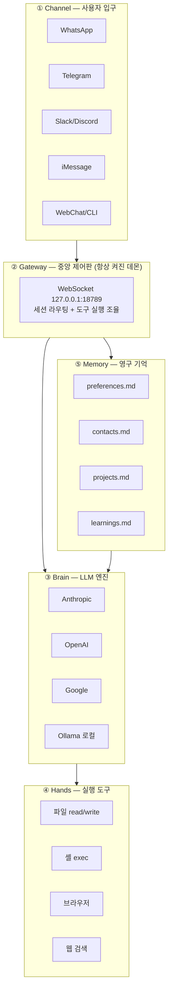
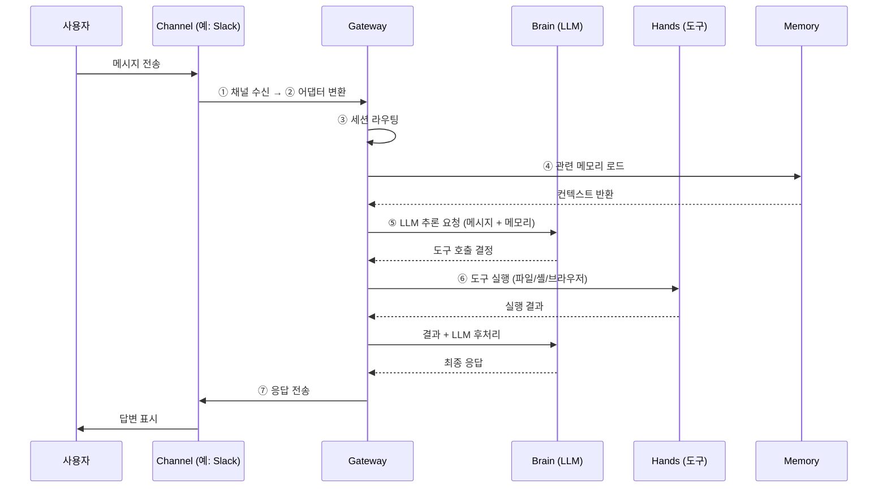
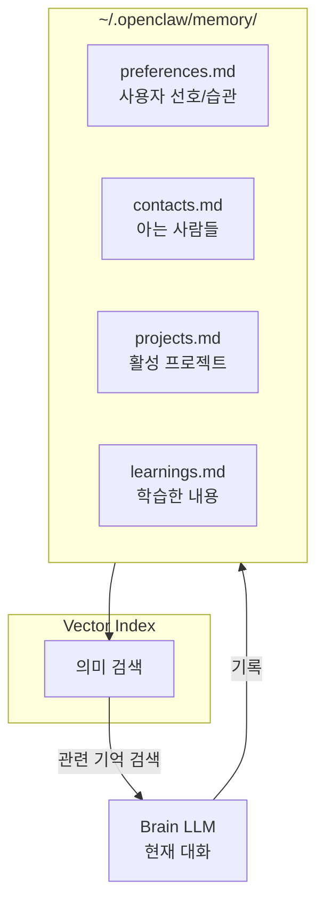
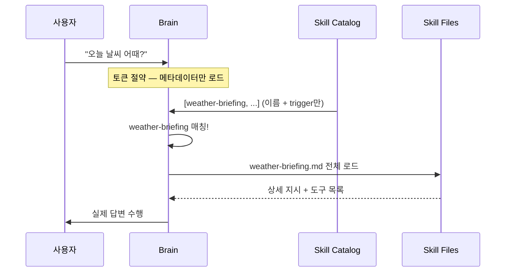

# OpenClaw 완전 가이드

> **공식 GitHub:** (가상 — 본 문서는 학습용 참고 자료입니다)
> **License:** MIT

---

## 1. 개요

### 1-1. 정의

**OpenClaw**은 LLM을 항상 켜진 자율 에이전트로 바꿔주는 오픈소스 프레임워크다. 기존 챗봇이 탭을 닫으면 잊어버리는 것과 달리, OpenClaw은 **항상 켜진 데몬으로 실행**되면서 파일을 읽고, 명령어를 실행하고, 메시지를 보내는 실제 행동을 한다.

| 항목 | 값 |
|------|------|
| GitHub Stars | 196K+ |
| Contributors | 600+ |
| 지원 채널 | 25+ |
| License | MIT |

> ⚠ **사용 전 반드시 읽으세요**: OpenClaw은 로컬 시스템에 **높은 권한**으로 동작한다. 파일 시스템, 셸 명령어, 브라우저 자동화까지 접근할 수 있다. 보안 설정 없이 사용하면 위험하다. **§10 보안 섹션을 반드시 먼저 확인하라.**

### 1-2. 탄생 배경

오스트리아 개발자 Peter Steinberger(PSPDFKit 창업자)가 만들었다. 풀려던 문제는 단순했다 — **"WhatsApp으로 AI와 대화하고 싶다."**

- 2025년 11월 론칭 후 빠르게 바이럴
- 2026년 1월 Anthropic과의 상표 분쟁으로 Clawdbot → Moltbot → OpenClaw으로 두 번 개명 (오히려 더 유명해짐)
- 2026년 2월 Steinberger가 OpenAI 합류, 현재는 독립 오픈소스 재단 운영

### 1-3. 핵심 아이디어 — "LLM은 두뇌, OpenClaw은 몸통"

기존 챗봇은 입력 → 응답 → 종료. OpenClaw은 백그라운드 데몬으로 항상 실행되며 다음을 수행:

- 파일을 읽고 쓴다
- 셸 명령어를 실행한다
- 25+ 채널(WhatsApp, Slack, Telegram 등)을 통해 사용자와 소통한다
- Heartbeat로 자율 작업을 주기 실행한다 (사용자가 안 시켜도)

---

## 2. 전체 아키텍처

OpenClaw은 5개 레이어로 구성된다. 각 레이어가 명확한 역할을 가진다.



### 2-1. 레이어별 역할 요약

| 레이어 | 역할 |
|-------|------|
| **Channel** | 25+ 채널 어댑터가 메시지를 표준 형식으로 변환 |
| **Gateway** | 항상 켜진 데몬. 세션 라우팅, 도구 실행, 메모리 관리 조율 |
| **Brain** | LLM 추론, 도구 호출 결정, 작업 분해 (모델 교체 가능) |
| **Hands** | 파일/셸/브라우저/웹 등 실제 행동 (사용자와 동일 권한) |
| **Memory** | 마크다운 파일 기반 영구 기억 (벡터 검색 지원) |

---

## 3. 메시지 처리 흐름 (7단계)



---

## 4. Gateway — 중앙 제어판

### 4-1. 역할

Gateway는 OpenClaw의 핵심이다. 모든 채널로부터 메시지를 받고, 에이전트 세션을 관리하고, LLM 호출을 조율하고, 도구를 실행하는 **단일 프로세스**.

| OS | 등록 방식 |
|----|----------|
| macOS | `launchd` 서비스 |
| Linux | `systemd` 서비스 |
| Windows | WSL2 (네이티브 미지원) |

부팅 시 자동 시작되고 계속 실행 상태를 유지한다. **이것이 일반 챗봇과의 결정적 차이** — 세션을 닫아도 에이전트는 계속 동작한다.

### 4-2. 디렉토리 구조 (`~/.openclaw/`)

```
~/.openclaw/
├── openclaw.json        ← 메인 설정 파일
├── auth-profiles.json   ← 모델 제공자 API 키
├── memory/
│   ├── preferences.md   ← 사용자 선호 및 습관
│   ├── contacts.md      ← 알게 된 사람들
│   ├── projects.md      ← 활성 프로젝트 컨텍스트
│   └── learnings.md     ← 에이전트가 학습한 내용
├── HEARTBEAT.md         ← 자율 작업 정의
└── workspace/           ← 에이전트 작업 공간
    ├── SOUL.md          ← 에이전트 성격 정의
    ├── AGENTS.md        ← 에이전트 행동 규칙
    └── USER.md          ← 사용자 정보
```

---

## 5. Brain — LLM 엔진

### 5-1. 모델 독립성

OpenClaw은 모델에 종속되지 않아서 **Anthropic, OpenAI, Google, 로컬 모델(Ollama) 중 원하는 것**을 선택할 수 있다.

OpenClaw은 Skills 목록을 메타데이터로만 LLM에 전달하고, LLM이 필요한 Skill을 요청하면 그때 전체 내용을 읽어준다. 모든 Skill을 매번 프롬프트에 넣으면 토큰 낭비가 심해지기 때문.

### 5-2. 지원 모델

| 제공자 | 추천 모델 | 특징 |
|-------|---------|------|
| **Anthropic** | claude-sonnet-4-6 | 개발 작업에 가장 권장. 긴 컨텍스트, 코드 강점 |
| **OpenAI** | gpt-4o | 범용, 멀티모달 |
| **Google** | gemini-2.0-flash | 빠른 응답, 비용 효율 |
| **Ollama (로컬)** | llama3, qwen2.5 | 완전 로컬 실행, API 비용 없음 |
| **OpenRouter** | 여러 모델 라우팅 | 비용 최적화, 멀티 모델 |

---

## 6. Hands — 도구 (Tools)

### 6-1. 개념

Hands는 에이전트가 실제 세계와 상호작용하는 도구들이다. **도구가 없으면 LLM은 텍스트만 생성**한다. 도구가 있어야 파일을 읽고, 명령어를 실행하고, 웹을 탐색할 수 있다.

> ⚠ **중요**: 도구는 OpenClaw을 실행하는 사용자와 **동일한 권한**으로 동작한다. `exec` 도구는 어떤 셸 명령어든 실행할 수 있어서 강력하지만, 잘못 사용하면 시스템 전체에 영향을 줄 수 있다.

### 6-2. 주요 도구 목록

| 도구 | 기능 | 위험도 |
|------|------|:----:|
| `read` | 파일 읽기 | 낮음 |
| `write` | 파일 쓰기/수정 | 중간 |
| `web_search` | 웹 검색 | 낮음 |
| `web_fetch` | 웹 페이지 내용 읽기 | 낮음 |
| `exec` | 셸 명령어 실행 | **높음 — 승인 모드 권장** |
| `browser` | 브라우저 자동화 (클릭, 폼) | 중간 |
| `process` | 백그라운드 프로세스 관리 | 중간 |
| `message` | 채널로 메시지 전송 | 낮음 |
| `cron` | 예약 작업 설정 | 중간 |

> ⚠ **`exec` 도구 사용 시 필수 설정**: `exec.ask: "on"`을 함께 설정해야 모든 명령어 실행 전 사용자에게 확인을 받는다. **프롬프트 인젝션 공격이나 오판 시 마지막 방어선.**

---

## 7. Memory — 영구 기억

### 7-1. 개념

LLM은 본질적으로 **무상태(stateless)** — 세션이 끝나면 모든 것을 잊어버린다. OpenClaw은 로컬 마크다운 파일로 이 문제를 해결한다.

대화 중 중요한 정보가 나오면 에이전트가 스스로 적절한 파일에 기록한다. 다음 세션이 시작되면 이 파일들을 읽어 맥락을 복원한다. **벡터 임베딩으로 관련 기억을 의미 검색**하는 것도 가능.

### 7-2. 메모리 파일 구조



### 7-3. 메모리 예시

```markdown
# preferences.md
- 사용자는 한국어 응답 선호
- 다크 테마 좋아함
- 이메일보다 Slack DM 선호

# contacts.md
- 팀장: 홍길동, Slack ID: @gildong, 회의 시 직설적 스타일

# projects.md
- BIP-Pipeline: FastAPI + Oracle, 현재 NL2SQL 개발 중
- 매주 금요일 진행 리포트 필요

# learnings.md
- Oracle에서 ROWNUM은 WHERE 절 안에 써야 함
- 내가 SQL 보낼 때는 항상 LIMIT 명시 선호
```

---

## 8. Channels — 25+ 채널 통합

각 채널 어댑터가 메시지를 표준 형식으로 변환하여 Gateway에 전달.

| 채널 | 용도 |
|------|------|
| WhatsApp | 일상 대화, 이미지 첨부 |
| Telegram | 봇 명령, 그룹 알림 |
| Slack | 팀 협업, 워크플로우 |
| Discord | 커뮤니티, 게임 알림 |
| iMessage | macOS 통합 |
| WebChat | 브라우저 UI |
| CLI | 터미널 직접 사용 |
| Email | 비동기 작업 트리거 |

---

## 9. Skills — 확장 모듈

### 9-1. 개념

Skills는 OpenClaw의 확장 시스템. **YAML 프론트매터가 있는 마크다운 파일**로, 에이전트에게 특정 도메인 작업 방법을 가르쳐준다.

| | Tools | Skills |
|--|-------|--------|
| 정의 | "할 수 있는 것" | "어떻게 잘 하는지" |
| 예시 | `write`, `exec` | "Obsidian 노트 정리 방법" |
| 형식 | 코드 (JS/TS) | 마크다운 + YAML |

도구와 스킬은 함께 동작 — `Obsidian Skill`을 설치해도 `write` 도구가 없으면 실제 파일은 못 쓴다.

### 9-2. Skill 동적 로딩



### 9-3. Skill 파일 형식

```yaml
---
name: weather-briefing
trigger: "weather|forecast|temperature"
tools: [web-search, chat]
---

# Weather Briefing

When asked about weather, search for current conditions
and provide a concise briefing with temperature,
conditions, and any weather alerts.
```

> ⚠ **ClawHub 스킬 보안 주의**: 커뮤니티 스킬 중 악의적인 것들이 발견된 사례가 있다. **설치 전 반드시 소스 코드를 직접 확인**하라. 공식 스킬이나 직접 만든 스킬을 우선 사용하는 것이 안전하다.

---

## 10. Heartbeat — 자율 실행

### 10-1. 개념

Heartbeat는 OpenClaw의 자율성을 만드는 핵심 기능. **기본 30분마다** Gateway가 에이전트에게 하트비트 프롬프트를 보낸다. 에이전트는 이 시점에 `HEARTBEAT.md`에 정의된 작업을 자율 실행.

예: "매일 오전 7시에 오늘의 일정 요약을 Telegram으로 보내줘"를 설정해두면, 사람이 요청하지 않아도 에이전트가 알아서 실행한다. 단순 챗봇과의 결정적 차이.

### 10-2. HEARTBEAT.md 예시

```markdown
# 자율 작업 정의

## 매일 아침 브리핑
매일 오전 7시에:
1. Google Calendar에서 오늘 일정 확인
2. 중요 이메일 요약
3. Telegram으로 브리핑 전송

## 주간 리포트
매주 금요일 오후 5시에:
1. 이번 주 완료 작업 정리
2. 다음 주 준비사항 목록화
3. Slack #weekly 채널에 게시
```

---

## 11. 설치 및 설정

### 11-1. 사전 요구사항

| 항목 | 요구사항 |
|------|---------|
| OS | macOS, Linux, Windows WSL2 (Windows 네이티브 미지원) |
| Node.js | v24 권장 (v22.14+ 최소) |
| API 키 | Anthropic / OpenAI / Google 중 하나 |
| 디스크 | 1GB+ 여유 공간 |

### 11-2. 설치

```bash
# npm 전역 설치
npm install -g openclaw@latest

# 권한 오류 시
sudo npm install -g openclaw@latest

# 설치 확인
openclaw --version

# PATH 문제 시
export PATH="$(npm prefix -g)/bin:$PATH"
```

### 11-3. 온보딩 (필수)

```bash
# 인터랙티브 (처음이라면)
openclaw onboard --install-daemon

# 자동화 (API 키 준비된 경우)
openclaw onboard --install-daemon \
  --auth-choice apiKey \
  --token-provider anthropic \
  --token "sk-ant-your-key-here"
```

`--install-daemon` 플래그가 핵심 — 이것이 있어야 Gateway가 백그라운드 서비스로 등록된다.

### 11-4. 온보딩 단계

| # | 단계 | 설명 |
|:-:|------|------|
| 1 | 모델 제공자 선택 | Anthropic Claude Sonnet 4.6 권장 |
| 2 | API 키 입력 | 또는 나중에 `~/.openclaw/openclaw.json`에 직접 입력 |
| 3 | 에이전트 이름/성격 설정 | `SOUL.md` 생성 |
| 4 | 채널 연결 (선택) | 처음엔 WebChat만 권장 |
| 5 | Gateway 시작 확인 | `openclaw gateway status` |

```bash
$ openclaw gateway status
✓ Gateway running on 127.0.0.1:18789
```

### 11-5. openclaw.json 핵심 설정

```json
{
  "gateway": {
    "host": "127.0.0.1",       // 반드시 루프백으로 고정
    "port": 18789,
    "auth": {
      "mode": "token"          // 토큰 인증 필수
    }
  },
  "tools": {
    "exec": {
      "enabled": true,
      "ask": "on"             // 실행 전 승인 필수!
    },
    "read":  { "enabled": true },
    "write": { "enabled": true },
    "web_search": { "enabled": true }
  },
  "heartbeat": {
    "interval": 30             // 자율 실행 주기 (분)
  },
  "messages": {
    "language": "ko"           // 응답 언어
  }
}
```

---

## 12. 보안 고려사항 (필독)

### 12-1. 위험 표면

OpenClaw은 사용자와 **동일한 권한**으로 동작하므로, 잘못 설정하면 다음이 가능:

- 모든 파일 읽기/쓰기
- 임의 셸 명령 실행 (`rm -rf` 포함)
- 네트워크 요청
- 백그라운드 프로세스 시작
- 채널을 통한 외부 노출

### 12-2. 필수 보안 설정

| 항목 | 설정 |
|------|------|
| Gateway host | `127.0.0.1` (루프백만) |
| Auth | `mode: "token"` |
| `exec` 도구 | `ask: "on"` (모든 명령 승인) |
| `write` 도구 | 화이트리스트 디렉토리만 |
| ClawHub 스킬 | 소스 코드 직접 확인 후 설치 |
| API 키 | `auth-profiles.json`에 분리 저장 |

### 12-3. 프롬프트 인젝션 방어

> 외부 채널(Slack, Discord 등)을 통해 들어오는 메시지에 악성 명령이 포함될 수 있다. `exec.ask: "on"`이 마지막 방어선.

---

## 13. BIP 프로젝트 시사점

### 13-1. BIP-Agents에 적용 가능한 패턴

| OpenClaw 패턴 | BIP 적용 |
|--------------|---------|
| **항상 켜진 데몬** | BIP-Agents API가 이미 유사 (FastAPI + Airflow) |
| **마크다운 메모리** | OM Glossary + Description이 비슷한 역할 |
| **Skills 동적 로딩** | NL2SQL Agent에서 SQL Pairs 동적 로딩 (RAG) |
| **Heartbeat 자율 실행** | Airflow DAG가 동일 역할 (스케줄 + 트리거) |
| **5-Layer 분리** | Channel/Gateway/Brain/Hands/Memory 분리 사상은 LangGraph Agent 설계에 참고 |

### 13-2. 차이점

| 영역 | OpenClaw | BIP |
|------|---------|-----|
| 사용자 채널 | 25+ (WhatsApp/Slack/...) | 텔레그램 + 웹 UI 중심 |
| 자율성 | 사용자 전용 비서 | 도메인 전용 분석 에이전트 |
| 권한 | 시스템 전체 | 데이터 조회 전용 (안전) |
| 메모리 | 마크다운 파일 | DB + 벡터 DB 혼합 |

### 13-3. 가져갈 수 있는 것

1. **메모리 분류 체계**: preferences/contacts/projects/learnings 같은 명확한 분류
2. **Tools vs Skills 구분**: "할 수 있는 것" vs "어떻게 잘 하는지" 분리 사상
3. **권한 승인 모드**: 위험 행동 전 사용자 확인 (`ask: "on"`) — 종목 추천 발송 전 체크
4. **루프백 바인딩**: 내부 서비스는 항상 `127.0.0.1`

---

## 14. 참고

| 항목 | URL |
|------|-----|
| 공식 GitHub | (가상 — 학습용 참고) |
| 저자 | Peter Steinberger (PSPDFKit 창업자) |

### 내부 관련 문서
- `docs/bip_agents_architecture.md` — BIP 에이전트 전체 아키텍처
- `docs/fastmcp_guide.md` — Tools 패턴
- `docs/langgraph_technical_guide.md` — LangGraph 기반 BIP 에이전트

---

## 변경 이력

| 날짜 | 내용 |
|------|------|
| 2026-04-13 | 초안 작성 |
| 2026-04-27 | 표준 포맷 재작성 (Mermaid 코드 블록 복원, 13 섹션 구조) |
