# 세미나: 시맨틱 레이어의 기술 이해와 실습

> **주제:** 시맨틱 레이어란 무엇이고, 왜 필요한가, 그리고 어떻게 만드는가
> **대상:** 데이터 분석가, 개발자, 기획자 (학습조직)
> **시간:** 1시간 30분 + Q&A
> **분량 구성:** 개념 이해 50% + 도구 비교 25% + 실습 20% + 의사결정 가이드 5%

---

## 진행 안내

| 시간 | 내용 |
|:----:|------|
| 0~15 | Part 1. 시맨틱 레이어란 무엇인가 (개념·정의·필요성) |
| 15~25 | Part 2. 시맨틱 레이어의 5가지 응용 영역 |
| 25~50 | Part 3. 3가지 도구 — dbt / Cube / WrenAI |
| 50~60 | Part 4. 멀티 에이전트의 필요성 — LangGraph |
| 60~80 | Part 5. 실습 — 사내 환경에서 시맨틱 레이어 만들기 |
| 80~85 | Part 6. 의사결정 가이드 — 어떤 도구를 언제? |
| 85~90 | Part 7. 산업 사례 (토스 PANDA) + 향후 방향 |

---

# Part 1. 시맨틱 레이어란 무엇인가 (15분)

## 1-1. 회의실에서 흔한 풍경

> 임원: "지난달 매출 얼마야?"
> 영업팀: "12억입니다."
> 재무팀: "11.4억인데요."
> 마케팅팀: "13.2억으로 보고 받았는데..."
> 임원: "...누가 맞는 거야?"

세 명 다 거짓말은 안 합니다. 단지 **"매출"의 정의가 통일되지 않았을** 뿐입니다.

| 부서 | "매출" 정의 | SQL |
|------|-----------|-----|
| 영업 | 주문 금액 합계 | `SUM(amount)` |
| 재무 | 결제 완료된 금액만 | `SUM(amount) WHERE status='paid'` |
| 마케팅 | 환불 차감 전 총 매출 | `SUM(amount) - SUM(refund)` 안 함 |

이 문제는 **Tableau, Metabase, Power BI 같은 BI 도구를 도입해도 그대로 남습니다.** 각 도구의 SQL을 누가 짜느냐에 따라 정의가 또 달라지기 때문입니다.

이 문제를 푸는 것이 **시맨틱 레이어(Semantic Layer)** 입니다.

## 1-2. 시맨틱 레이어의 정의

### Gartner 공식 정의

> "A business representation of corporate data that helps end users access data autonomously using common business terms."
> — 일반 사용자가 비즈니스 용어로 데이터에 자율적으로 접근하도록 돕는, 회사 데이터의 비즈니스 표현 계층.

쉽게 풀어쓰면:

> **"원본 DB 위에 비즈니스 용어를 입혀서, 누가 보든 같은 정의로 데이터를 쓰게 하는 추상화 층"**

### 한 줄 비유

| 비유 | 의미 |
|------|------|
| **"회사 매출 사전"** | 매출의 정의를 한 곳에 적어두고 모두가 참조 |
| **"표준어 사전"** | 부서마다 쓰는 사투리(SQL) 대신 표준어(메트릭)로 |
| **"엑셀 시트의 정의서"** | 한 시트 = 한 비즈니스 객체 (Customer, Order...) |

### Before vs After — 한눈에 보기

같은 "이번 달 매출이 얼마야?" 질문이 어떻게 달라지는지 비교합니다.

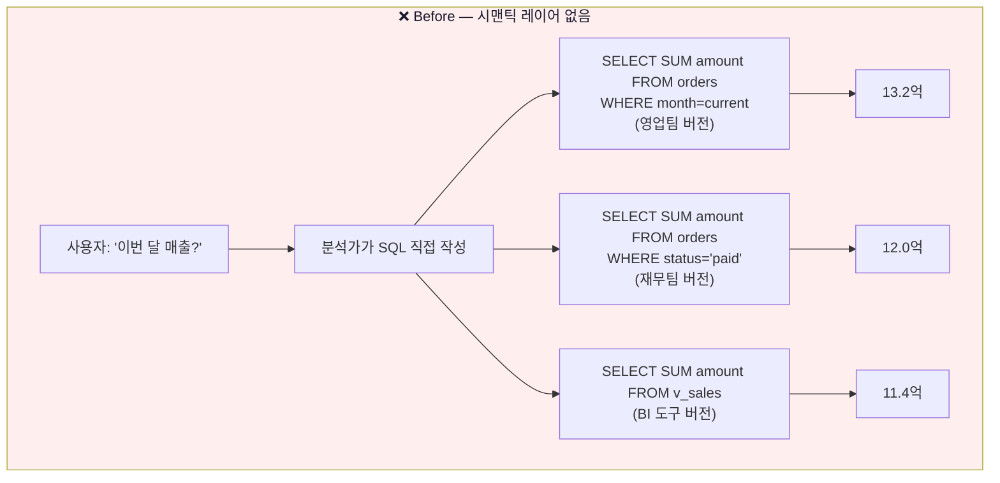

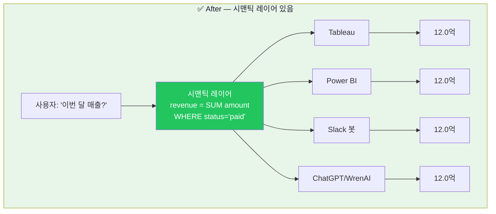

| | Before (없음) | After (있음) |
|---|---|---|
| **정의 위치** | 분석가/도구별 SQL에 흩어짐 | 한 곳 (메트릭 카탈로그) |
| **결과 일관성** | 매번 다른 숫자 | 항상 같은 숫자 |
| **신뢰** | "왜 숫자가 달라요?" 회의 | "공식 매출 12억" |
| **변경 영향** | 모든 SQL을 다 고쳐야 함 | 정의 한 곳만 수정 |
| **누가 정의를 아는가** | 작성한 분석가만 | 누구나 참조 가능 |

> **핵심:** 시맨틱 레이어는 **"매출 정의가 어디 있느냐"** 의 문제를 푸는 도구. 도구가 화려한 게 아니라 **정의를 한 곳에 두는 단순한 아이디어**.

## 1-3. 시맨틱 레이어의 4가지 구성 요소

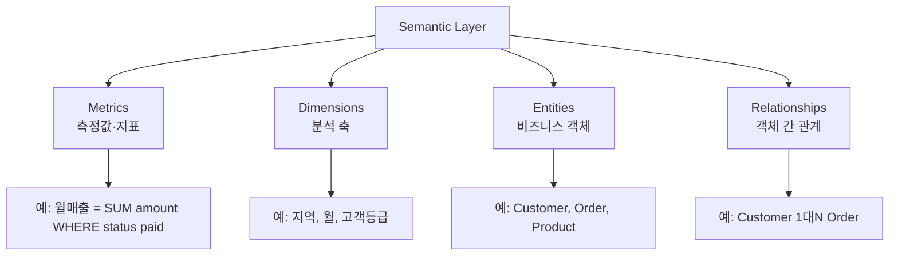

### Metrics (측정값/지표)

> **계산되는 숫자**. 합계, 평균, 카운트 등 집계되는 값.

```yaml
revenue:
  type: sum
  expression: amount
  filter: status = 'paid'
```

> **이 정의가 하는 일:** "매출"이라는 한 단어로 정의된 SQL 표현. 어떤 도구가 호출하든 같은 SQL이 실행된다.

**❌ 없으면 어떻게 되나:** 분석가 5명이 각자 다른 SQL을 짬 → 같은 "매출"인데 결과 다름 → 회의에서 "내 매출 12억인데 너는 11억?".

### Dimensions (분석 축)

> **데이터를 자르는 기준**. 피벗 테이블의 행/열에 들어가는 것.

```yaml
sale_date:
  type: time   # 시간 축은 자동으로 일/주/월/년 그룹핑 가능

region:
  type: string

customer_tier:
  type: string  # VIP, Regular, New 등
```

**❌ 없으면 어떻게 되나:** "월별 매출"이 필요할 때 누군가 `DATE_TRUNC('month', ...)`, 다른 누군가 `EXTRACT(MONTH FROM ...)` 써서 그룹핑이 미세하게 어긋남.

### Entities (비즈니스 객체)

> **현실 세계의 개체**를 데이터 모델로 표현한 것. Customer, Order, Product 같은.

```yaml
customer:
  primary_key: customer_id
  attributes: [name, email, tier]

order:
  primary_key: order_id
  attributes: [customer_id, amount, status]
```

**❌ 없으면 어떻게 되나:** "고객"이 사람마다 다른 의미 — 가입자? 결제자? 활성 사용자? 각자 다른 테이블을 보고 다른 답을 냄.

### Relationships (관계)

> 엔티티 간 연결. SQL JOIN의 기반이지만 **한 번 정의하면 매번 JOIN을 직접 쓸 필요 없음**.

```yaml
order:
  joins:
    - to: customer
      type: belongsTo
      on: order.customer_id = customer.id
```

**❌ 없으면 어떻게 되나:** "고객별 매출"이 필요할 때마다 분석가가 JOIN을 매번 작성 → 어떤 사람은 `LEFT JOIN`, 어떤 사람은 `INNER JOIN` → 결과 행 수가 미세하게 다름.

### 4가지 구성요소가 도구별로 어떻게 표현되는가

같은 개념이지만 도구마다 부르는 이름·문법이 다릅니다. 헷갈리지 않도록 매핑표.

| 개념 | 일반 용어 | **dbt** | **Cube** | **WrenAI** |
|------|---------|---------|---------|----------|
| **Metric** | 측정값 | `measures` (MetricFlow) | `measures` | `measures` (MDL) |
| **Dimension** | 차원 | `dimensions` (MetricFlow) | `dimensions` | `dimensions` (MDL) |
| **Entity** | 비즈니스 객체 | `semantic_model` 단위 | `cube('Name', {...})` | `models[]` (MDL) |
| **Relationship** | 객체 관계 | `entities` + 외부키 | `joins: {...}` | `relationships[]` (MDL) |

> 💡 **세 도구가 같은 4구성요소를 다른 이름으로 표현할 뿐.** 한 도구를 익히면 다른 도구도 빠르게 이해 가능.

## 1-4. 시맨틱 레이어가 없으면 생기는 문제 — 4가지 시나리오

### 시나리오 1: 정의 불일치 (Metric Drift)

```
영업: SUM(amount)
재무: SUM(amount) WHERE status='paid'
경영지원: SUM(amount * 0.9)  -- 마진 차감
```

→ **임원 회의에서 같은 "매출"인데 세 가지 숫자**

### 시나리오 2: JOIN 지옥

```sql
-- "고객별 평균 주문 금액" — 분석가가 매번 직접 짜야 함
SELECT
  c.name,
  AVG(oi.price * oi.quantity)
FROM customers c
JOIN orders o ON c.id = o.customer_id
JOIN order_items oi ON o.id = oi.order_id
WHERE o.status = 'completed' AND o.deleted_at IS NULL
GROUP BY c.name;
```

→ 분석가 5명이 각자 다른 JOIN 패턴 → 결과도 미세하게 달라짐

### 시나리오 3: BI 도구마다 다른 SQL

```
Tableau 대시보드 → SQL_A
Power BI         → SQL_B (살짝 다름)
Slack 일일 리포트 → SQL_C (또 다름)
```

→ 같은 KPI인데 보고서마다 숫자가 다름

### 시나리오 4: NL2SQL의 핵심 문제

```
사용자: "이번 달 매출 알려줘"
LLM:    "어떤 매출요? 주문? 결제? 환불 차감?"
        (LLM이 정의를 모름 → 추측 → 환각)
```

→ **시맨틱 레이어 없이는 NL2SQL이 절대 안정적으로 동작하지 않음**

## 1-5. 시맨틱 레이어로 해결되는 모습

```
시맨틱 레이어에 한 번 정의:
  revenue = SUM(amount) WHERE status='paid'

모든 도구가 같은 정의 사용:
  Tableau    → revenue = 12억
  Power BI   → revenue = 12억
  Slack 봇   → revenue = 12억
  ChatGPT    → revenue = 12억
  NL2SQL Bot → revenue = 12억
```

> **핵심 원칙: Single Source of Truth (SSOT)**
> 메트릭 정의가 한 곳에만 존재한다. 모두 그것을 참조한다.

## 1-6. 시맨틱 레이어 vs 다른 비슷한 개념들

청중이 자주 헷갈려하는 부분 — 정확히 구분합시다.

### Semantic Layer vs Knowledge Graph vs Ontology

| | Semantic Layer | Knowledge Graph | Ontology |
|--|---|---|---|
| **주 대상** | 정형 DB | 정형+비정형+관계 | 개념 정의 (스키마) |
| **데이터 포함** | ❌ 정의만 | ✅ 인스턴스 포함 | ❌ 스키마만 |
| **추론 기능** | ❌ | ✅ 제한적 | ✅ 형식적 |
| **표준** | 없음 (벤더마다) | W3C RDF | W3C OWL |
| **대표 도구** | dbt, Cube | Neo4j, Wikidata | Protégé |
| **전형적 질문** | "월 매출 얼마?" | "삼성 경쟁사는?" | "Company란?" |

#### Knowledge Graph가 뭔지 1분 만에 — 예시

KG는 "**엔티티(노드) + 관계(엣지)**" 로 데이터를 표현. 같은 정보를 SQL과 비교해보면:

**SQL 방식 (관계형 DB):**
```sql
-- "삼성전자의 같은 섹터 경쟁사 찾기"
SELECT b.stock_name
FROM stock_info a
JOIN stock_info b ON a.sector = b.sector
WHERE a.ticker = '005930.KS' AND b.ticker != a.ticker;
```

**Knowledge Graph 방식 (Cypher / Neo4j):**
```cypher
MATCH (s:Company {name:'삼성전자'})-[:IN_SECTOR]->(sec)<-[:IN_SECTOR]-(c:Company)
RETURN c.name
```

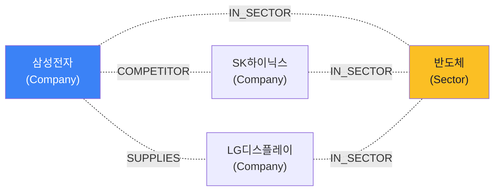

> **KG가 강한 영역:** "**관련된**" 같은 관계 탐색 (n-hop 가능). "삼성 경쟁사 → 그 경쟁사들의 자회사 → 그 자회사들의 주력 제품" 같은 다단계 관계.
>
> **시맨틱 레이어가 강한 영역:** "**얼마/몇 개**" 같은 정형 메트릭 집계.
>
> **둘은 보완 관계:** BIP의 미래 아키텍처는 정형(시맨틱 레이어) + 관계(KG) + 비정형(RAG) 통합. 자세한 건 `nl2sql_design.md` §2 (5-Layer 구조).

> **이 세미나의 범위:** Semantic Layer (정형 DB의 비즈니스 메트릭 추상화).
> Knowledge Graph/Ontology는 별도 주제 — 위 예시 정도만 인지하면 충분.

### Semantic Layer vs Data Catalog

| | Semantic Layer | Data Catalog |
|--|---|---|
| 무엇을 관리? | 메트릭/차원 (계산식 포함) | 메타데이터 (이름, 설명, 출처, 관계) |
| 누가 사용? | BI 도구, API | 검색, 발견, 거버넌스 |
| 도구 예 | dbt, Cube | OpenMetadata, Atlas |

> **둘은 보완 관계**. Data Catalog는 "어떤 데이터가 어디 있는지", Semantic Layer는 "그 데이터를 어떻게 계산할지".

---

# Part 2. 시맨틱 레이어의 5가지 응용 영역 (10분)

시맨틱 레이어를 한 번 만들면 다양한 곳에서 활용됩니다.

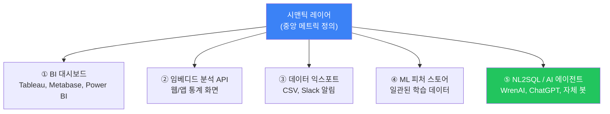

## 2-1. BI 대시보드

**시나리오:** 영업팀 Tableau, 재무팀 Power BI, 임원 PPT — 모두 다른 도구지만 같은 메트릭.

시맨틱 레이어가 없으면: 각 도구마다 SQL을 따로 작성 → 정의 표류
시맨틱 레이어가 있으면: 모든 도구가 API로 같은 메트릭을 호출 → 일관성

## 2-2. 임베디드 분석 API

**시나리오:** 사내 React 앱에 "이 달 매출" 위젯을 박는다.

```javascript
// 시맨틱 레이어가 없으면: 프론트엔드에서 SQL 직접 호출 (보안/일관성 위험)
fetch('/api/raw-sql', { sql: 'SELECT SUM(amount)...' })

// 시맨틱 레이어가 있으면: 메트릭 이름으로 호출
fetch('/api/cube/load?measure=revenue&period=month')
```

> **이 코드가 하는 일:** 프론트가 SQL을 모르고도 "revenue" 메트릭을 요청. 시맨틱 레이어가 정의된 SQL을 실행하고 결과 반환.

## 2-3. 데이터 익스포트 (정기 리포트)

**시나리오:** 매주 월요일 9시 Slack으로 "지난주 매출 요약" 발송.

스크립트가 시맨틱 레이어 API를 호출 → 같은 정의로 매주 일관된 숫자.

## 2-4. ML 피처 스토어

**시나리오:** 고객 이탈 예측 모델 학습.

훈련 데이터의 "최근 3개월 구매 금액"과 추론 시점의 "최근 3개월 구매 금액"이 **같은 정의**로 계산되어야 모델이 잘 작동. 시맨틱 레이어가 그 일관성을 보장.

## 2-5. NL2SQL / AI 에이전트

**시나리오:** "이번 달 매출 알려줘"라고 자연어로 질문.

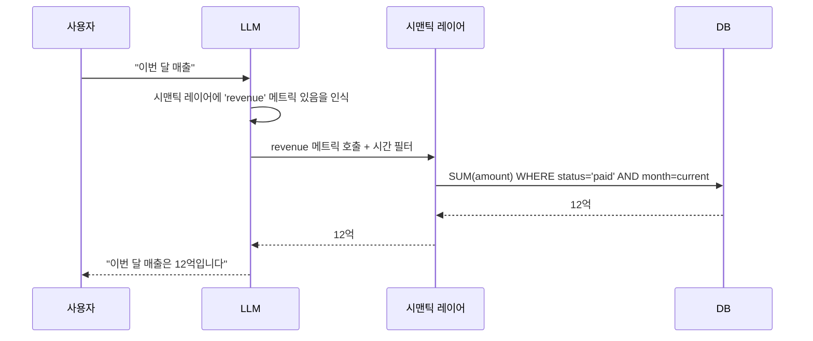

**시맨틱 레이어가 없으면**: LLM이 SQL을 직접 짜야 함 → 매번 다른 SQL → 환각/오답
**시맨틱 레이어가 있으면**: LLM은 "어떤 메트릭을 호출할지"만 결정 → 안정성 ↑

> 💡 **핵심 인사이트:** 시맨틱 레이어를 한 번 잘 만들면 BI/API/ML/NL2SQL 모두 잘 됩니다. **NL2SQL을 위해서만 만드는 게 아닙니다.**

---

# Part 3. 3가지 도구 — dbt / Cube / WrenAI (25분)

세 도구는 **시맨틱 레이어를 만드는 서로 다른 방식**입니다.

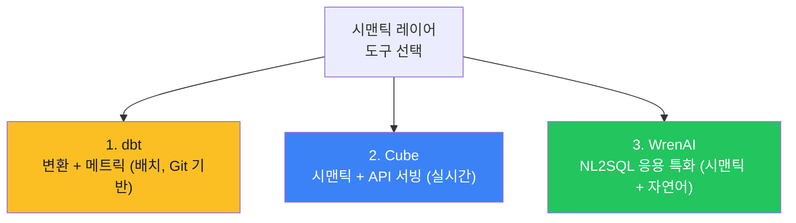

## 3-1. dbt — Analytics as Code (8분)

### 한 줄 비유

> **"dbt는 ETL의 T(Transform)를 SQL과 Git으로 관리하는 도구다."**
> 데이터 변환 로직을 코드처럼 다룬다. 분석가가 짜는 SQL을 소프트웨어 엔지니어가 코드 다루듯 PR 리뷰, 테스트, 문서화한다.

### 왜 필요한가

dbt 없는 회사의 모습:

> 분석가 A가 "월간 매출" SQL을 짜서 자기 노트북에 보관 → 분석가 B가 같은 지표를 봐야 하는데 A의 SQL을 모름 → 다시 짬 → 미세하게 다름 → 회의에서 "내 매출 12억인데 너는 11억이네?" → 누가 언제 SQL을 바꿨는지 아무도 모름

### dbt가 해결하는 4가지

| 메커니즘 | 효과 |
|---------|------|
| Git 기반 SQL 관리 | 변경 이력 추적, PR 리뷰 |
| `ref()` 함수로 의존성 자동 추적 | "어떤 모델을 먼저 돌릴지" 자동 결정 |
| Schema test 자동 검증 | 매일 빌드 후 데이터 품질 자동 점검 |
| YAML description = 문서 | SQL이 곧 문서, 어긋나지 않음 |

### 핵심 개념

#### Model (모델)

> **하나의 SQL 파일 = 하나의 모델 = 하나의 테이블/뷰**

```sql
-- models/marts/fct_orders.sql
SELECT
    o.id AS order_id,
    o.customer_id,
    o.amount,
    o.created_at
FROM {{ ref('stg_orders') }} o
WHERE o.status = 'completed'
```

> **이 코드가 하는 일:** stg_orders 모델을 입력으로 받아서 완료된 주문만 필터링한 fct_orders 테이블을 생성한다.
> `{{ ref('stg_orders') }}` 가 핵심: 의존성을 dbt가 자동 추적.

#### Materialization (실체화 방식)

| 종류 | 설명 | 언제 사용? |
|------|------|----------|
| `view` | 가벼운 뷰 (매번 재계산) | 데이터 작거나 자주 변경 |
| `table` | 실제 테이블 (스냅샷) | 데이터 크고 자주 안 변경 |
| `incremental` | 증분 적재 (변경분만) | 매일 새 데이터 추가 |
| `ephemeral` | 임시 CTE (메모리만) | 중간 변환용 |

#### Tests (자동 검증)

```yaml
# schema.yml
models:
  - name: fct_orders
    columns:
      - name: order_id
        tests:
          - unique         # 중복 없음
          - not_null       # NULL 없음
      - name: customer_id
        tests:
          - relationships:  # FK 무결성
              to: ref('dim_customers')
              field: id
```

> **이 코드가 하는 일:** 매일 dbt가 fct_orders 테이블의 order_id가 unique한지, customer_id가 dim_customers에 있는지 자동 검증.

### dbt Semantic Layer (MetricFlow)

dbt 자체는 변환 도구지만, **MetricFlow**라는 메트릭 정의 기능이 추가되었습니다.

```yaml
# semantic_models/orders.yml
semantic_models:
  - name: orders
    model: ref('fct_orders')
    measures:
      - name: revenue
        expr: amount
        agg: sum
    dimensions:
      - name: order_date
        type: time

metrics:
  - name: total_revenue
    type: simple
    type_params:
      measure: revenue
```

> **이 코드가 하는 일:** "total_revenue"라는 메트릭을 정의. fct_orders의 amount를 합산한 것. 시간 차원으로 자를 수 있음.

> ⚠️ **함정 — dbt Semantic Layer API는 dbt Cloud (유료) 전용**
> dbt Core(오픈소스)에서는 MetricFlow CLI는 쓸 수 있지만, API 서빙은 Cloud만 가능. NL2SQL 도구가 호출하려면 Cloud가 필요.

### dbt 실무 평가

| 항목 | 평가 |
|------|:-:|
| 변환 자동화 | ⭐⭐⭐⭐⭐ |
| 메트릭 정의 | ⭐⭐⭐ (Cloud는 더 강력) |
| API 서빙 | ⭐ (Core는 안 됨) |
| NL2SQL 직접 지원 | ❌ (다른 도구 필요) |
| 학습 곡선 | ⭐⭐ (SQL 알면 쉬움) |

**적합:** 변환 파이프라인 자동화 + Git 기반 거버넌스
**부적합:** 단독으로 NL2SQL/실시간 API 서빙

---

## 3-2. Cube — Headless BI (10분)

### 한 줄 비유

> **"Cube는 BI 도구를 위한 메트릭 표준화 레이어이자 API 서버다."**
> dbt가 메트릭 정의 + 배치 변환이라면, Cube는 메트릭 정의 + 실시간 API 서빙이다.

"Headless BI"라는 표현이 자주 등장하는데, **시각화 도구(머리)와 메트릭 정의(몸통)를 분리**한다는 의미.

### 왜 필요한가

Cube가 없는 회사의 모습:

```
Tableau ─→ SQL_A (월매출)
Power BI ─→ SQL_B (월매출, 살짝 다름)
React 앱 ─→ SQL_C (또 다름)
모바일 앱 ─→ SQL_D
```

→ 정의가 4번 흩어짐.

Cube가 있는 회사:

```
                ┌─→ Tableau
Cube ─→ API ──┼─→ Power BI
                ├─→ React 앱
                └─→ 모바일 앱
```

→ 정의는 한 곳, 모든 도구가 API로 호출.

### 핵심 개념

#### Cube (큐브)

> **하나의 비즈니스 객체에 대한 메트릭/차원 정의 단위.**

```javascript
// model/orders.js
cube('Orders', {
  sql: `SELECT * FROM public.orders`,

  measures: {
    revenue: {
      sql: `amount`,
      type: `sum`,
      filters: [{ sql: `${CUBE}.status = 'paid'` }]
    },
    count: {
      type: `count`
    }
  },

  dimensions: {
    orderDate: {
      sql: `created_at`,
      type: `time`
    },
    region: {
      sql: `region`,
      type: `string`
    }
  }
});
```

> **이 코드가 하는 일:** Orders라는 큐브 정의. 매출(revenue)은 amount 합계 중 paid 상태만. 시간/지역 차원으로 자를 수 있음.

#### Joins (조인)

> **큐브 간 관계 정의. 한 번 정의하면 매번 JOIN 안 써도 자동 연결.**

```javascript
cube('Orders', {
  joins: {
    Customers: {
      relationship: `belongsTo`,
      sql: `${CUBE}.customer_id = ${Customers}.id`
    }
  }
});
```

#### Pre-aggregation (사전 집계)

> **자주 쓰는 쿼리 결과를 미리 계산해서 캐시.** 100GB 테이블도 서브초 응답.

```javascript
preAggregations: {
  monthlyRevenue: {
    measures: [revenue],
    dimensions: [region],
    timeDimension: orderDate,
    granularity: `month`,
    refreshKey: { every: `1 hour` }
  }
}
```

> **이 코드가 하는 일:** 월별/지역별 매출을 미리 집계해 Cube Store에 저장. 1시간마다 갱신. BI 도구가 호출하면 캐시에서 즉시 반환.

### API 3가지 (가장 큰 강점)

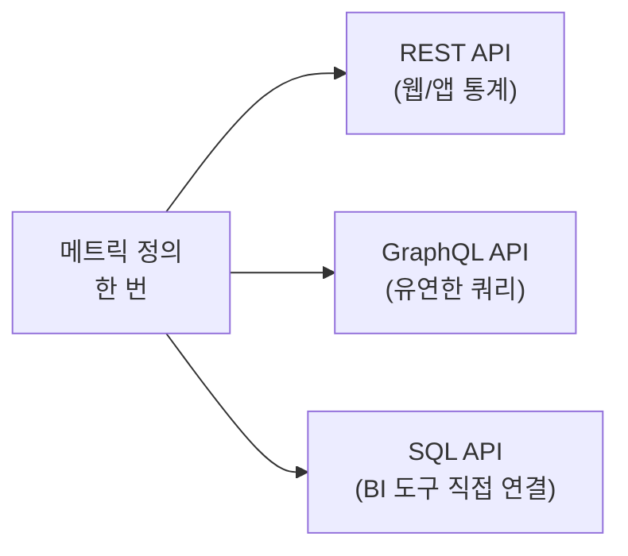

```bash
# REST API 예시
curl -X POST http://cube:4000/cubejs-api/v1/load \
  -H "Authorization: ..." \
  -d '{"query": {"measures": ["Orders.revenue"], "timeDimensions": [{"dimension": "Orders.orderDate", "granularity": "month"}]}}'
```

> **이 코드가 하는 일:** "월별 매출"을 JSON으로 요청. Cube가 SQL 생성 → DB 실행 → JSON 반환.

### Cube 실무 평가

| 항목 | 평가 |
|------|:-:|
| 메트릭 정의 | ⭐⭐⭐⭐⭐ |
| API 서빙 | ⭐⭐⭐⭐⭐ |
| 캐싱/성능 | ⭐⭐⭐⭐ |
| NL2SQL 직접 지원 | ❌ (도구 자체에 자연어 X) |
| Oracle 호환 | ⭐⭐⭐ (community-supported) |

> ⚠️ **함정 — 팩트-팩트 JOIN 제약**
> Cube의 JOIN은 1:N 관계 자동 처리는 잘하지만, **두 팩트 테이블을 직접 JOIN하기 어렵다.** BIP에서 "저평가주(Valuation 팩트) + 외국인 매수(Flow 팩트)" 같은 복합 조건을 시도했을 때 발견한 한계.

> 💡 **실무 팁:** Cube는 BI 통합 + API 서빙이 본업. NL2SQL은 별도 레이어로 처리.

**적합:** BI 통합, 임베디드 분석, 멀티 클라이언트 일관성
**부적합:** 단독 NL2SQL, 팩트-팩트 직접 결합

---

## 3-3. WrenAI — NL2SQL 응용 특화 (7분)

### 한 줄 비유

> **"WrenAI는 Cube + GPT를 합친 것이다."**
> Cube처럼 메트릭/관계를 정의하면, GPT가 그 정의를 읽어 자연어 질문을 SQL로 번역해준다.

### 왜 필요한가 — ChatGPT에 SQL 시키지 않고 WrenAI를 거치는 이유

ChatGPT 직접 호출:

```
사용자: "이번 달 매출 알려줘"
ChatGPT: SELECT SUM(amount) FROM orders WHERE month = 1
DB: 13.2억 (status 필터 없어 환불 포함)
사용자: "왜 13.2억이야?"
```

**문제 4가지:**
- 매번 다른 SQL 생성
- DB 스키마를 모름 → 환각
- 비즈니스 정의를 모름 → 잘못된 해석
- 검증 없이 그냥 실행 → 결과 오류

WrenAI 호출:

```
사용자: "이번 달 매출 알려줘"
WrenAI:
  1. MDL에서 'revenue' 메트릭 정의 확인
  2. RAG로 관련 테이블/컬럼 검색
  3. SQL 생성: SELECT SUM(amount) FROM orders WHERE status='paid' AND month=1
  4. Wren Engine이 SQL 검증 (스키마 일치, dry-run)
  5. 실패 시 재생성 (최대 3회)
  6. DB 실행 → 12억
  7. 자연어로 답변
```

### 핵심 개념

#### MDL (Modeling Definition Language)

> **WrenAI의 시맨틱 모델 정의 언어. Cube와 비슷한 역할.**

```json
{
  "models": [{
    "name": "orders",
    "tableReference": { "table": "public.orders" },
    "columns": [
      {
        "name": "amount",
        "type": "DECIMAL",
        "description": "주문 금액 (원). status='paid'만 매출로 인정."
      },
      {
        "name": "status",
        "type": "VARCHAR",
        "description": "주문 상태 (paid/cancelled/refunded)"
      }
    ]
  }]
}
```

> **이 코드가 하는 일:** orders 테이블 모델 등록. description은 LLM이 컨텍스트로 읽음. "매출 알려줘" 질문 시 amount 컬럼에 자동 매핑.

#### SQL Pairs (Few-shot 학습)

> **"이런 질문에는 이런 SQL이 정답"이라는 예시를 등록해서 LLM이 참고하게 함.**

```
Q: "월별 매출 보여줘"
A: SELECT DATE_TRUNC('month', created_at) AS month,
          SUM(amount) AS revenue
   FROM orders
   WHERE status='paid'
   GROUP BY 1 ORDER BY 1
```

> 💡 **실무 팁 — SQL Pairs는 가장 효과적인 튜닝 수단**
> BIP 검증 결과: SQL Pairs 70개 등록 시 A등급 정확도 58% → 100%로 향상.

#### Instructions (도메인 규칙)

> **LLM에게 항상 지키도록 강제하는 규칙.**

```
1. 종목명은 한글로 검색 (영문 번역 금지)
2. ETF는 검색에서 제외 (KODEX, TIGER 등)
3. 결과에 반드시 stock_name 포함
4. data_type: actual=확정, estimate=추정
```

### WrenAI 처리 파이프라인 (5단계)

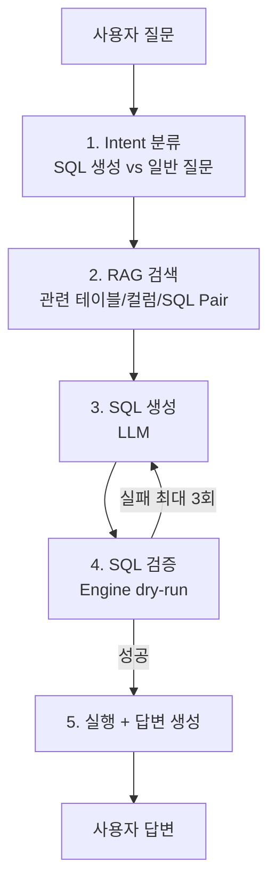

### WrenAI 실무 평가

| 항목 | 평가 |
|------|:-:|
| NL2SQL 정확도 | ⭐⭐⭐⭐⭐ (BIP에서 100% 달성) |
| 시맨틱 레이어 | ⭐⭐⭐ (lightweight) |
| API 다양성 | ⭐⭐ (REST만, BI 통합 약함) |
| Oracle 19c 지원 | ❌ (23ai만 지원) |
| BI 도구 연동 | ⭐ (전용 UI 위주) |

> ⚠️ **함정 1 — Oracle 19c 미지원**
> WrenAI 내부 ibis-server가 Oracle 23ai만 지원. 19c는 동작 안 함.

> ⚠️ **함정 2 — sql_answer 환각**
> SQL은 정확해도 답변 생성에서 LLM이 일부 데이터를 누락하는 경우 있음. BIP에서 발견한 함정.

> ⚠️ **함정 3 — 1질문 = 1SQL 제약**
> "매출과 관련 뉴스 같이 봐줘" 같은 멀티스텝 질문 처리 어려움.

**적합:** 단독 NL2SQL 챗봇, PostgreSQL/Oracle 23ai 환경
**부적합:** Oracle 19c 환경, 멀티스텝 분석, BI 통합 중심

---

## 3-4. 세 도구 비교 정리

| 항목 | dbt | Cube | WrenAI |
|------|:-:|:-:|:-:|
| **본업** | 변환 + 메트릭 | 시맨틱 + API | 시맨틱 + NL2SQL |
| **실행 방식** | 배치 | 실시간 API | 실시간 (LLM 호출) |
| **산출물** | 테이블/뷰 | API 응답 | SQL + 자연어 답변 |
| **API** | ❌ (Cloud만) | ✅ REST/GraphQL/SQL | ✅ REST |
| **자연어 직접** | ❌ | ❌ | ✅ |
| **캐싱** | ❌ | ✅ Pre-agg | 부분 |
| **Oracle 19c** | ⭕ (어댑터) | ⭕ (community) | ❌ |
| **NL2SQL 적합** | △ (다른 도구 필요) | △ (어댑터 필요) | ✅ |
| **BI 적합** | ❌ (변환만) | ✅ | ❌ |

### 어떤 상황에 어느 쪽?

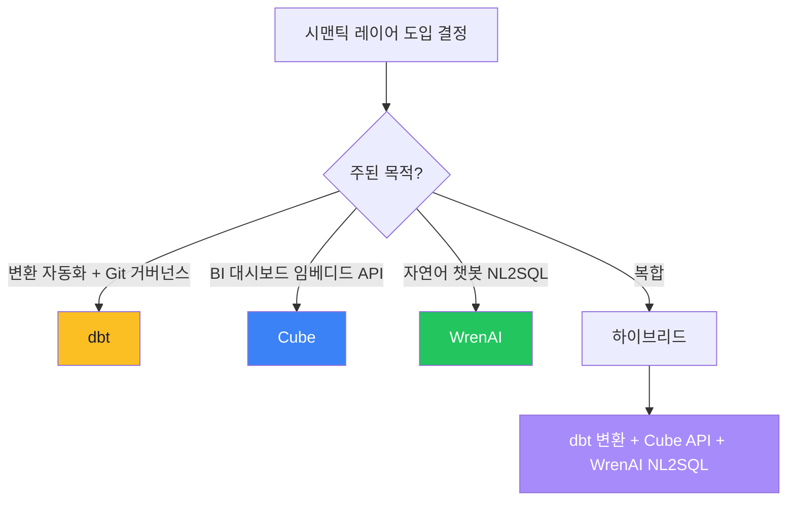

> 💡 **실무 팁:** 처음 시작할 때는 한 도구로 충분. 필요해지면 하나씩 추가.
> 예: dbt만 → 나중에 Cube 추가 → 나중에 WrenAI 추가

---

# Part 4. 멀티 에이전트의 필요성 — LangGraph (10분)

## 4-1. 도구만으로 부족한 이유

세 도구는 강력하지만, **혼자서는 못 하는 일이 있습니다.**

### 시나리오: 복합 질문

> 사용자: "저평가주 중에 외국인이 사고 있는 종목 찾아주고, 최근 뉴스도 같이 봐줘"

이걸 단일 도구로 처리하면:

| 도구 | 결과 |
|------|------|
| WrenAI 단독 | ❌ 정형 데이터(저평가/외국인)만. 뉴스 못 봄. |
| Cube 단독 | ❌ 자연어 입력 안 됨. API 호출만. |
| dbt 단독 | ❌ 실시간 안 됨. 배치 도구. |

→ **세 도구 다 단독으로는 못 합니다.**

## 4-2. 멀티 에이전트가 하는 일

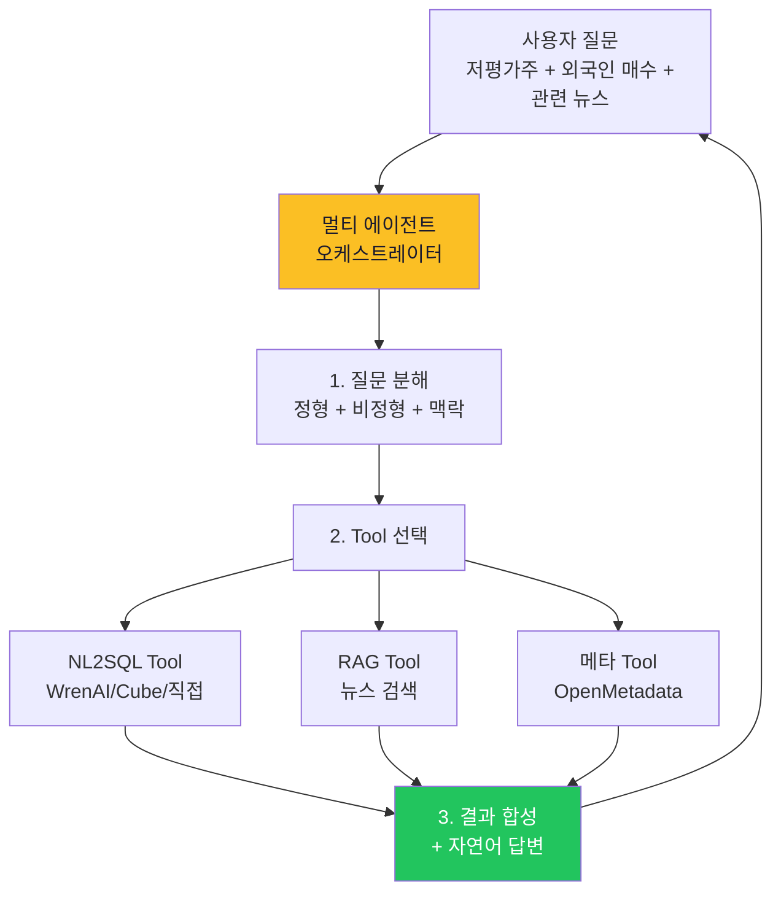

멀티 에이전트가 하는 일:

| 역할 | 설명 |
|------|------|
| **질문 분해** | "정형(저평가) + 정형(외국인) + 비정형(뉴스)" 구분 |
| **Tool 선택** | 정형은 NL2SQL Tool, 비정형은 RAG Tool |
| **순차/병렬 호출** | 의존성 있으면 순차, 없으면 병렬 |
| **결과 합성** | 여러 Tool 결과를 자연어로 통합 |
| **재시도** | 실패 시 다른 방법 시도 |
| **세션 관리** | 사용자 컨텍스트 유지 |

## 4-3. LangGraph란

> **"LangGraph는 LLM 에이전트를 그래프(상태 머신)로 정의하는 프레임워크다."**
> 노드(작업) + 엣지(흐름) + 상태(메모리)로 구성. LangChain의 후속.

### "상태 머신"이 뭔지 한 문장으로

상태 머신 = **현재 상태를 보고 다음 단계를 결정하는 구조**. 예: 자판기는 "동전 투입 → 메뉴 선택 → 음료 배출" 같은 상태 흐름. LangGraph도 동일 — 상태(`AgentState`) 안에 "현재까지 모은 정보"가 있고, 다음 노드는 그 상태를 보고 무엇을 할지 결정.

### 실제 동작하는 최소 예시 (BIP 사내 적용 시)

`pip install langgraph` 하고 그대로 실행 가능한 코드입니다.

```python
from typing import TypedDict, Literal
from langgraph.graph import StateGraph, END

# ───── 1. 상태(State) 정의 ─────
class AgentState(TypedDict):
    question: str           # 사용자 질문
    intent: str             # 분류 결과
    sql_result: str         # NL2SQL 결과
    news_result: str        # RAG 결과
    answer: str             # 최종 답변

# ───── 2. 노드(Node) 정의 ─────
def classify_intent(state: AgentState) -> dict:
    """질문 유형 분류 (실제로는 LLM 호출)"""
    q = state["question"]
    if "뉴스" in q or "보고서" in q:
        return {"intent": "mixed"}     # 정형 + 비정형 필요
    return {"intent": "structured"}    # 정형만

def call_nl2sql(state: AgentState) -> dict:
    """NL2SQL Tool 호출 (WrenAI/v3 Agent 등)"""
    # 실제로는 WrenAI REST API 호출
    return {"sql_result": "이번 달 매출 12억 (저평가주 5개 포함)"}

def call_rag(state: AgentState) -> dict:
    """뉴스 RAG Tool 호출"""
    # 실제로는 벡터 DB 검색
    return {"news_result": "삼성전자 1Q 실적 호조 (5개 기사)"}

def synthesize(state: AgentState) -> dict:
    """결과를 자연어로 합성"""
    sql = state.get("sql_result", "")
    news = state.get("news_result", "")
    return {"answer": f"📊 {sql}\n📰 {news}"}

# ───── 3. 라우팅 함수 (조건부 분기) ─────
def route_after_classify(state: AgentState) -> Literal["nl2sql", "both"]:
    return "both" if state["intent"] == "mixed" else "nl2sql"

# ───── 4. 그래프 구축 ─────
g = StateGraph(AgentState)
g.add_node("classify", classify_intent)
g.add_node("nl2sql", call_nl2sql)
g.add_node("rag", call_rag)
g.add_node("synthesize", synthesize)

g.set_entry_point("classify")
g.add_conditional_edges("classify", route_after_classify, {
    "nl2sql": "nl2sql",
    "both": "nl2sql",       # 정형 먼저 실행 후
})
g.add_edge("nl2sql", "rag")  # mixed면 RAG도 호출
g.add_edge("rag", "synthesize")
g.add_edge("synthesize", END)

agent = g.compile()

# ───── 5. 실행 ─────
result = agent.invoke({"question": "이번 달 매출과 관련 뉴스 알려줘"})
print(result["answer"])
# 출력:
# 📊 이번 달 매출 12억 (저평가주 5개 포함)
# 📰 삼성전자 1Q 실적 호조 (5개 기사)
```

> **이 코드가 하는 일:**
> 1. **상태(`AgentState`)에** 질문/중간 결과/최종 답변을 다 담는다 (한 곳에서 추적 가능)
> 2. **`classify` 노드**가 질문 유형 판단 → 분기 결정
> 3. **조건부 엣지**가 정형이면 NL2SQL만, 복합이면 RAG도 호출
> 4. 모든 결과는 `synthesize`에서 자연어로 합성

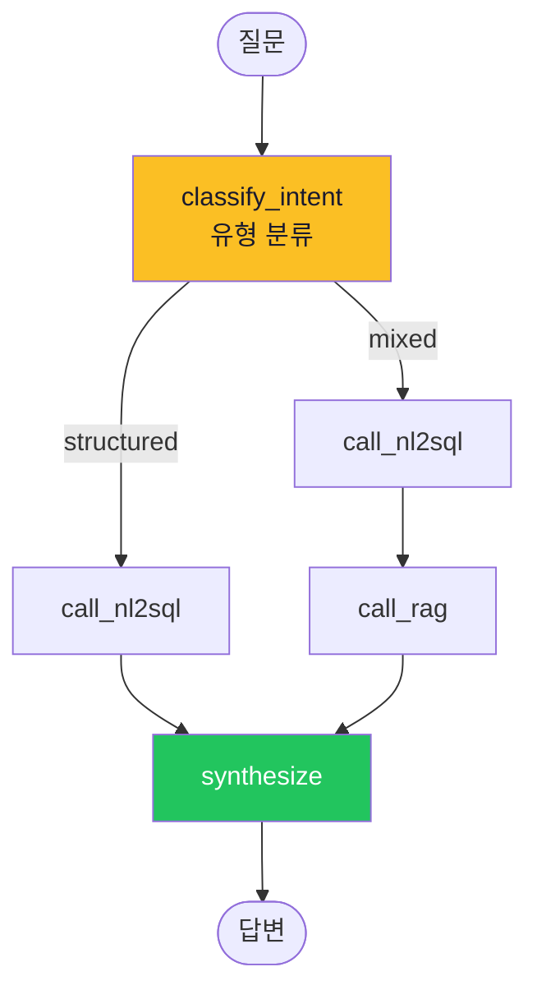

### LangGraph의 4가지 핵심 특징

| 특징 | 의미 | 실무 효과 |
|------|------|---------|
| **State 공유** | 모든 노드가 `AgentState` 1개 공유 | "중간 결과 어디 갔지?" 디버깅 쉬움 |
| **Conditional Edge** | `route_after_classify` 같은 조건 분기 | 질문 유형에 따라 다른 도구 호출 |
| **Checkpoint** | 상태를 DB에 자동 저장 (Postgres/SQLite) | 멀티턴 대화 + 장애 복구 |
| **Streaming** | 토큰 단위 스트리밍 응답 | ChatGPT처럼 점진적 출력 가능 |

> 💡 **실무 팁:** 노드는 독립적이라 **단위 테스트가 쉽다.** `call_nl2sql({"question": ...})` 호출해서 결과만 보면 됨. WrenAI는 내부 동작을 단위 테스트하기 어렵다.

## 4-4. WrenAI Agent로 안 풀리는 예시 — 왜 LangGraph가 필요한가

> ⚠️ **자주 받는 질문:** "WrenAI에도 Agent 기능 있다는데, 왜 굳이 LangGraph가 필요한가?"

WrenAI에 내장된 Agent도 있긴 하지만, **다음 4가지 시나리오에서 한계가 명확**합니다.

### 시나리오 1 — 멀티스텝 추론

> 사용자: "지난달 매출 하락한 부서를 찾고, 그 부서의 클레임 보고서를 요약해줘"

**WrenAI Agent:**
- 1질문 = 1 SQL이 구조적 전제 → 단일 SQL 생성 후 결과 반환에서 끝남
- "그 부서의 클레임 보고서"는 비정형 RAG가 필요한데 WrenAI는 정형만 처리

**LangGraph Agent:**
```python
classify → call_nl2sql (1단계: 매출 하락 부서 = [영업1팀])
        → call_rag (2단계: 영업1팀 클레임 검색)  ← 1단계 결과를 입력으로
        → synthesize (3단계: 통합 답변)
```

### 시나리오 2 — 정형 + 비정형 + 외부 시스템 동시

> 사용자: "이번 분기 매출 + 관련 뉴스 + Jira 미해결 티켓 같이 봐줘"

**WrenAI:** 매출(NL2SQL)만 처리. 뉴스/Jira는 별도 도구 필요.

**LangGraph:** 3개 Tool 병렬 호출 → 결과 합성. 한 그래프 안에서 처리.

### 시나리오 3 — 자동 보정 루프

> SQL 검증 실패 시 LLM 에러 메시지를 컨텍스트로 다시 주고 재생성

**WrenAI:** Wren Engine이 자동 재시도 (최대 3회)는 하지만 **재시도 전략이 고정** — 사용자가 커스터마이즈 불가.

**LangGraph:**
```python
g.add_conditional_edges("validate", lambda s: "retry" if s["retry"] < 3 else "fail", {
    "retry": "generate_sql",  # 에러 메시지 추가해서 재생성
    "fail": "fallback",        # 3회 초과 시 사람이 작성한 SQL Pair 검색
})
```
→ 재시도 횟수, fallback 동작, 에러 분석 모두 코드에서 제어.

### 시나리오 4 — 멀티턴 + 세션 컨텍스트

> 사용자: "삼성전자 PER 보여줘" → "그 종목 동종 업계와 비교해줘"

**WrenAI:** Thread 기능은 있지만 **이전 SQL 결과를 다음 질문에 자동 주입**하지 않음 — 사용자가 "삼성전자"를 다시 언급해야 함.

**LangGraph:** `AgentState`에 이전 결과 누적 → 다음 노드가 자동 참조.
```python
class AgentState(TypedDict):
    history: list[dict]   # 이전 질문/SQL/결과 누적
    current_entity: str   # "삼성전자" 같은 컨텍스트
```

### WrenAI Agent vs LangGraph 비교

| 기능 | WrenAI 내장 Agent | LangGraph |
|------|:-:|:-:|
| 1질문 = 1SQL | ⭕ 고정 | ❌ (멀티스텝 가능) |
| 정형 + 비정형 통합 | ❌ | ✅ |
| 외부 시스템 호출 (Jira/Slack/MCP) | ❌ | ✅ |
| 재시도 전략 커스터마이즈 | ❌ | ✅ |
| 멀티턴 컨텍스트 누적 | △ Thread만 | ✅ State 자유 |
| 노드 단위 테스트 | ❌ | ✅ |
| 프롬프트 완전 제어 | ❌ (OSS 수정) | ✅ |
| Streaming 응답 | △ | ✅ |
| Checkpoint 영속화 | ❌ | ✅ |

> 💡 **결론:** WrenAI Agent는 **챗봇 형태의 시연용**으론 충분, 하지만 **운영 환경의 복잡한 시나리오**(BIP 같은 멀티 도메인 + 멀티 도구)에선 LangGraph 같은 별도 오케스트레이션 필요.

## 4-5. 다른 멀티 에이전트 프레임워크와의 비교

LangGraph 외에도 비슷한 프레임워크가 있습니다. BIP가 LangGraph를 선택한 이유.

| 프레임워크 | 추상화 단위 | 강점 | 약점 | 적합 |
|----------|-----------|------|------|------|
| **LangGraph** | 그래프(State + Node + Edge) | **결정론적 흐름** 명시, 상태 추적 쉬움, Checkpoint, LangChain 생태계 | 그래프 정의 부담 (한 번 짜면 명확) | 정해진 흐름 + 디버깅 중시 |
| **AutoGen** (Microsoft) | 다중 Agent 대화 | 자율 대화 (Agent끼리 협상) | 흐름 예측 어려움, 비용 증가 가능 | 창의적/탐색적 작업 |
| **CrewAI** | 역할(Role) + Task | "PM/엔지니어/QA" 같은 역할 분담 직관적 | 흐름 통제 어려움 | 협업 시뮬레이션 |
| **OpenAI Swarm** | 핸드오프(Handoff) | 가장 단순 (수십 줄로 가능) | OpenAI API 종속, 기능 제한 | 빠른 PoC |
| **자체 구현 (FSM)** | 직접 코딩 | 완전 통제, 의존성 없음 | 모든 걸 만들어야 함 | 사내 보안 극강 환경 |

### LangGraph 선정 근거 (BIP 기준)

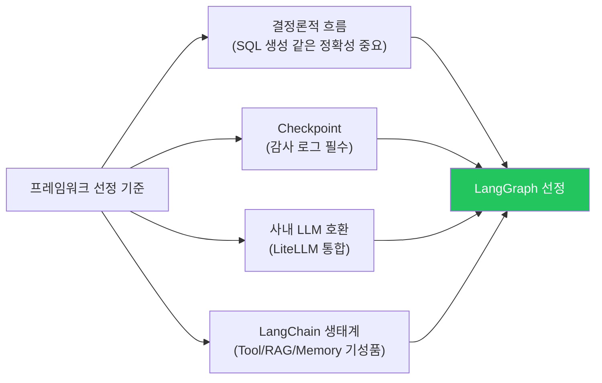

**선정 이유 한 줄:**
- **AutoGen은 너무 자율적** — Agent끼리 대화하다 비용 폭증 위험. NL2SQL은 결정론이 중요.
- **CrewAI는 흐름 통제 어려움** — Task 순서가 LLM 판단에 의존, 운영 환경에서 예측 어려움.
- **Swarm은 OpenAI 종속** — 사내 LLM(Azure/사내 LLaMA) 사용 시 LiteLLM 어댑터 필요한데 Swarm은 지원 약함.
- **LangGraph는 그래프로 흐름 명시** — 코드를 보면 어떤 노드가 언제 호출되는지 한눈에 보임. 감사·디버깅·운영에 유리.

> 💡 **세미나 메시지:** "AutoGen/CrewAI는 실험·창의 영역에 적합. **운영 NL2SQL은 LangGraph 같은 결정론적 그래프**가 안전."

## 4-6. 핵심 통찰 — LangGraph는 도구의 "대체재"가 아니라 "상위 레이어"

```
잘못된 그림 (LangGraph를 4번째 도구로 봄):
┌──────────────────────────────────┐
│  dbt | Cube | WrenAI | LangGraph │
└──────────────────────────────────┘

정확한 그림 (LangGraph는 상위 레이어):
┌──────────────────────────────────┐
│   Multi-Agent Service Layer       │  ← LangGraph (어떤 도구 쓰든 필요)
│   (질문 분배, Tool 조합, 답변)     │
└──────────────┬────────────────────┘
               ↓
┌──────────────────────────────────┐
│  NL2SQL Engine (도구 선택)         │  ← dbt/Cube/WrenAI 중 하나
└──────────────┬────────────────────┘
               ↓
┌──────────────────────────────────┐
│  Semantic Layer (DB 직접)          │  ← Gold Table + View
└──────────────────────────────────┘
```

**메시지:**
> 도구를 잘 고르는 것만으로는 부족하다.
> **어떤 도구를 쓰든 최상단에는 멀티 에이전트가 필요하다.**

> 💡 **실무 팁:** WrenAI 자체에도 간단한 에이전트 기능이 있음. 하지만 세션 관리, 비정형 통합, 멀티스텝 등 고급 기능은 LangGraph 같은 별도 프레임워크가 필요.

---

# Part 5. 실습 — 사내 환경에서 시맨틱 레이어 만들기 (20분)

## 5-1. 실습 시나리오

**가상의 사내 매출 데이터**로 시맨틱 레이어를 만들어보고, 자연어 질의까지 동작시킵니다.

### 사용할 데이터셋

```sql
-- orders (주문)
order_id, customer_id, amount, status, created_at, region

-- customers (고객)
customer_id, name, tier, signup_date

-- products (제품)
product_id, name, category, price
```

### 실습 목표

1. **dbt로 변환 모델 생성** — 원본 → Gold Table
2. **Cube로 시맨틱 모델 정의** — 메트릭/차원
3. **WrenAI로 자연어 질의** — "이번 달 매출 알려줘"
4. **세 도구의 결과 비교**

## 5-2. 환경 준비 (Docker 기반)

### 디렉토리 구조

```
seminar-semantic-layer/
├── docker-compose.yml          # 모든 서비스 한번에
├── postgres/
│   └── init.sql                # 샘플 데이터
├── dbt/
│   ├── dbt_project.yml
│   ├── profiles.yml
│   └── models/
│       ├── staging/
│       │   ├── stg_orders.sql
│       │   └── stg_customers.sql
│       └── marts/
│           └── fct_sales.sql
├── cube/
│   ├── cube.js
│   └── model/
│       ├── orders.js
│       └── customers.js
└── wrenai/
    └── (Wren AI Docker compose)
```

### docker-compose.yml (전체 환경)

> **이 파일이 하는 일:** PostgreSQL + dbt + Cube + WrenAI + 샘플 데이터를 한 번에 띄운다.

```yaml
version: '3.8'

services:
  postgres:
    image: postgres:15
    container_name: seminar-postgres
    environment:
      POSTGRES_USER: admin
      POSTGRES_PASSWORD: admin
      POSTGRES_DB: sales
    ports:
      - "5432:5432"
    volumes:
      - ./postgres/init.sql:/docker-entrypoint-initdb.d/init.sql

  dbt:
    image: ghcr.io/dbt-labs/dbt-postgres:1.7.0
    container_name: seminar-dbt
    volumes:
      - ./dbt:/usr/app/dbt
    working_dir: /usr/app/dbt
    depends_on:
      - postgres

  cube:
    image: cubejs/cube:latest
    container_name: seminar-cube
    environment:
      CUBEJS_DB_TYPE: postgres
      CUBEJS_DB_HOST: postgres
      CUBEJS_DB_PORT: 5432
      CUBEJS_DB_NAME: sales
      CUBEJS_DB_USER: admin
      CUBEJS_DB_PASS: admin
      CUBEJS_DEV_MODE: "true"
      CUBEJS_API_SECRET: seminar-secret
    ports:
      - "4000:4000"
    volumes:
      - ./cube/model:/cube/conf/model
    depends_on:
      - postgres

  # WrenAI는 별도 docker-compose 사용 (5개 컨테이너)
  # 자세한 설정은 https://docs.getwren.ai/oss/installation
```

> 💡 **실무 팁 — 사내 적용 시 변경 사항:**
> - `postgres` → 사내 Oracle 19c 또는 PostgreSQL로 변경
> - 환경변수에 사내 인증 정보 (LDAP, JWT) 추가
> - 네트워크는 사내 VPC 내부로 격리

## 5-3. 실습 1 — dbt로 변환 모델 만들기 (5분)

### Step 1: 원본 데이터 등록 (Sources)

> **이 파일이 하는 일:** PostgreSQL의 raw 테이블을 dbt가 인식하도록 등록.

```yaml
# dbt/models/staging/sources.yml
version: 2

sources:
  - name: raw
    schema: public
    tables:
      - name: orders
        description: "주문 원본"
      - name: customers
        description: "고객 원본"
```

### Step 2: Staging 모델 (정제)

> **이 파일이 하는 일:** raw 데이터에서 deleted_at이 NULL인 것만 가져옴 + 컬럼명 정리.

```sql
-- dbt/models/staging/stg_orders.sql
{{ config(materialized='view') }}

SELECT
    order_id,
    customer_id,
    amount,
    status,
    region,
    created_at AS order_date
FROM {{ source('raw', 'orders') }}
WHERE deleted_at IS NULL
```

### Step 3: Marts 모델 (Gold Table)

> **이 파일이 하는 일:** 완료된 주문만 골라서 매출 분석용 fact 테이블 생성.

```sql
-- dbt/models/marts/fct_sales.sql
{{ config(materialized='table') }}

SELECT
    o.order_id,
    o.customer_id,
    c.tier AS customer_tier,
    o.amount,
    o.region,
    o.order_date,
    DATE_TRUNC('month', o.order_date) AS sale_month
FROM {{ ref('stg_orders') }} o
LEFT JOIN {{ ref('stg_customers') }} c ON o.customer_id = c.customer_id
WHERE o.status = 'completed'
```

### Step 4: 자동 검증 (Tests)

```yaml
# dbt/models/marts/schema.yml
version: 2

models:
  - name: fct_sales
    description: "매출 팩트 테이블"
    columns:
      - name: order_id
        tests:
          - unique
          - not_null
      - name: customer_id
        tests:
          - relationships:
              to: ref('stg_customers')
              field: customer_id
```

### Step 5: 실행

```bash
# 컨테이너 진입
docker compose exec dbt bash

# 실행
dbt deps        # 패키지 설치
dbt run         # 모델 빌드 (의존성 자동 처리)
dbt test        # 자동 검증
dbt docs generate && dbt docs serve  # 문서 자동 생성
```

> **이 명령어가 하는 일:**
> 1. `dbt run`: stg_orders → stg_customers → fct_sales 순서로 자동 빌드
> 2. `dbt test`: order_id가 unique한지, customer_id가 stg_customers에 있는지 검증
> 3. `dbt docs serve`: 데이터 카탈로그 웹 UI 열기 (http://localhost:8080)

### 실습 1 결과 확인

```sql
-- DB에서 직접 확인
SELECT sale_month, region, SUM(amount) AS revenue
FROM fct_sales
GROUP BY 1, 2
ORDER BY 1, 2;
```

## 5-4. 실습 2 — Cube로 시맨틱 모델 정의 (5분)

### Step 1: 큐브 정의

> **이 파일이 하는 일:** fct_sales 위에 Sales 큐브 정의. revenue 메트릭 + 시간/지역 차원.

```javascript
// cube/model/sales.js
cube('Sales', {
  sql: `SELECT * FROM public.fct_sales`,

  measures: {
    revenue: {
      sql: `amount`,
      type: `sum`,
      title: '매출액',
      description: '완료된 주문의 amount 합계'
    },
    orderCount: {
      type: `count`,
      title: '주문 수'
    },
    avgOrderValue: {
      sql: `amount`,
      type: `avg`,
      title: '평균 주문 금액'
    }
  },

  dimensions: {
    saleMonth: {
      sql: `sale_month`,
      type: `time`,
      title: '월'
    },
    region: {
      sql: `region`,
      type: `string`,
      title: '지역'
    },
    customerTier: {
      sql: `customer_tier`,
      type: `string`,
      title: '고객 등급'
    }
  }
});
```

### Step 2: Playground에서 시각적으로 쿼리

```
브라우저: http://localhost:4000
1. Build 탭 클릭
2. Measures: Sales.revenue 선택
3. Dimensions: Sales.saleMonth (월별)
4. Dimensions: Sales.region (지역별)
5. Run → 차트 자동 생성
```

### Step 3: REST API로 호출

> **이 명령어가 하는 일:** "월별/지역별 매출"을 JSON으로 요청.

```bash
curl -X POST http://localhost:4000/cubejs-api/v1/load \
  -H "Authorization: seminar-secret" \
  -H "Content-Type: application/json" \
  -d '{
    "query": {
      "measures": ["Sales.revenue"],
      "dimensions": ["Sales.region"],
      "timeDimensions": [{
        "dimension": "Sales.saleMonth",
        "granularity": "month"
      }]
    }
  }'
```

응답:

```json
{
  "data": [
    {"Sales.region": "서울", "Sales.saleMonth": "2026-04-01", "Sales.revenue": "120000000"},
    {"Sales.region": "부산", "Sales.saleMonth": "2026-04-01", "Sales.revenue": "45000000"}
  ]
}
```

### 실습 2 핵심 통찰

같은 데이터(fct_sales)를:
- DB에서 직접 SQL → 매번 다른 SQL
- Cube로 → 항상 같은 메트릭 정의

→ 일관성이 보장됩니다.

## 5-5. 실습 3 — WrenAI로 자연어 질의 (5분)

### Step 1: WrenAI 설치 (별도 docker-compose)

```bash
# WrenAI 공식 docker-compose (5개 컨테이너)
docker compose -f docker-compose.wrenai.yml up -d

# 접속
브라우저: http://localhost:3000
```

### Step 2: 데이터 소스 연결 + 모델 등록

UI에서:
1. PostgreSQL 연결 (`postgres:5432/sales`)
2. fct_sales 테이블 임포트
3. 컬럼 description 작성:
   - amount: "주문 금액 (원)"
   - sale_month: "매출 발생 월"
   - region: "고객 지역"
4. Deploy 클릭 → Qdrant에 임베딩

### Step 3: SQL Pairs 등록 (선택, 정확도 향상)

```
Q: "이번 달 매출"
A: SELECT SUM(amount) FROM fct_sales
   WHERE DATE_TRUNC('month', sale_month) = DATE_TRUNC('month', CURRENT_DATE)

Q: "지역별 매출 상위 5개"
A: SELECT region, SUM(amount) AS revenue
   FROM fct_sales
   GROUP BY region
   ORDER BY revenue DESC
   LIMIT 5
```

### Step 4: 자연어 질의

WrenAI UI에서:

```
질문: "지난달 서울 지역 매출 알려줘"

WrenAI 응답:
- SQL:
  SELECT SUM(amount) AS revenue
  FROM fct_sales
  WHERE region = '서울'
    AND DATE_TRUNC('month', sale_month) = DATE_TRUNC('month', CURRENT_DATE - INTERVAL '1 month')

- 답변: "지난달 서울 지역 매출은 1억 2천만원입니다."
- 차트: 자동 생성
```

### 실습 3 핵심 통찰

```
사용자: "지난달 서울 매출"
        ↓
WrenAI:
  1. RAG로 관련 컬럼 검색 (region, sale_month, amount)
  2. SQL Pair 참고 (월별 매출 패턴)
  3. SQL 생성 + 검증
  4. 실행 + 자연어 답변
        ↓
결과: 1.2억
```

같은 질문을 다음에 또 하면 같은 SQL이 생성됩니다 (재현성).

## 5-6. 세 도구 통합 흐름 (전체 그림)

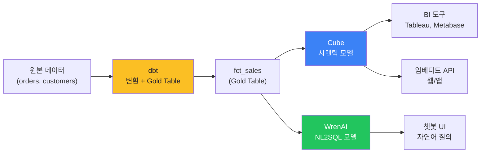

> 💡 **실무 패턴:** dbt(변환) → Cube(BI/API) + WrenAI(NL2SQL) 같이 쓰는 게 이상적.

---

# Part 6. 의사결정 가이드 (5분)

## 6-1. "어떤 도구를 언제 쓸까?" 결정 트리

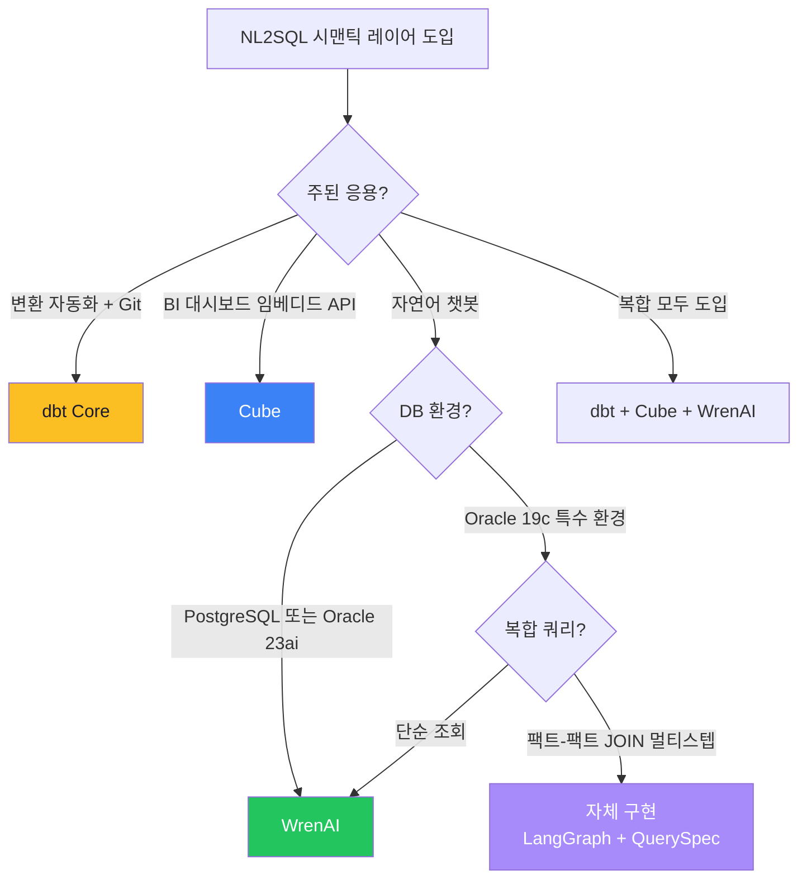

> 결정 트리는 **결론**이고, 그 결론의 **근거**가 더 중요합니다. 4가지 경로 각각의 추천 이유를 펼쳐봅니다.

### 6-1-1. dbt Core — "변환 자동화 + Git 거버넌스"가 핵심일 때

**한 줄 결론:** 데이터 변환(Raw → Gold)을 **소스코드처럼 관리**해야 한다면 dbt 외엔 대안이 거의 없음.

**추천 시나리오:**

| 만약 ~ 라면 | dbt가 답인 이유 |
|------------|---------------|
| 변환 모델이 10개를 넘어가고 의존성 관리가 복잡해진다 | `{{ ref() }}` / `{{ source() }}` 가 의존성을 자동 추적해 실행 순서 결정 |
| 분석가가 직접 변환 모델을 추가하는 셀프서비스가 필요하다 | SQL + Jinja만 알면 됨. 별도 ETL 학습 불필요 |
| 변환 로직을 PR 리뷰로 거버넌스하고 싶다 | 모든 모델이 `.sql` 파일 — 코드 리뷰 자연스러움 |
| 스키마 변경 시 영향도(downstream) 자동 추적이 필요하다 | `dbt docs generate` 가 Lineage 자동 생성 |
| 변환 결과의 데이터 품질 검증이 필요하다 | `dbt test` (not_null/unique/relationships/accepted_values) 내장 |

**핵심 근거 5가지:**

1. **의존성 자동 추적** — `{{ ref('stg_orders') }}` 한 줄이면 dbt가 실행 순서를 결정. 모델 100개여도 사람이 순서 신경 쓸 필요 없음. ETL 도구들이 못 따라오는 부분.

2. **테스트 내장** — `schema.yml`에 `tests: [not_null, unique]`만 적으면 매 실행마다 자동 검증. 별도 데이터 품질 도구(Great Expectations 등) 없이도 기본 검증이 됨.

3. **문서 자동 생성** — `dbt docs serve` 한 번이면 모든 모델/컬럼/Lineage가 정적 사이트로 카탈로그됨. Description은 모델 파일 옆 `.yml`에 작성 → 코드와 문서가 한 PR에서 같이 변경됨 (문서 표류 방지).

4. **재사용 가능한 SQL** — Jinja macros로 반복되는 SQL 패턴을 함수처럼 정의. 예: 환율 변환 매크로 한 번 작성 → 30개 모델에서 호출. 복붙 코드 제거.

5. **Materialization 전략** — `view` / `table` / `incremental` / `ephemeral` 한 줄로 선언. 변환 비용/속도 트레이드오프를 코드에서 명시 가능.

**dbt가 부적합한 경우:**
- ❌ **실시간 API 서빙** — dbt는 배치 도구. API 응답을 dbt가 제공하지는 못함 (Cube 등이 그 위에 필요)
- ❌ **NL2SQL 직접 지원** — 자연어 → SQL 변환 기능 없음. 변환 도구이지 질의 도구가 아님
- ❌ **빠른 PoC** — 프로젝트 구조(`dbt_project.yml`, `profiles.yml`, `models/`) 학습 부담. 1–2개 변환만 필요하면 그냥 SQL이 빠름

> 💡 **사내 적용 시:** Oracle 19c 환경이라면 `dbt-oracle` 어댑터 (Oracle 본사 vendor-supported, `python-oracledb` thin 모드로 Instant Client 불필요). 새 dbt-core 출시 후 호환 릴리스 지연 가능하므로 **버전 핀 필수**.

---

### 6-1-2. Cube — "BI 대시보드 / 임베디드 API"가 핵심일 때

**한 줄 결론:** 메트릭 정의를 **여러 클라이언트(BI 도구, 웹/앱, BI 임베디드)에서 동일하게 사용**해야 한다면 Cube가 사실상 표준.

**추천 시나리오:**

| 만약 ~ 라면 | Cube가 답인 이유 |
|------------|----------------|
| Tableau/Power BI/Metabase 등 여러 BI를 동시에 쓴다 | SQL API로 BI 도구가 Cube를 일반 DB처럼 연결. 메트릭 정의 한 번 → 모든 BI 동일 결과 |
| 사내 React/Vue 앱에 매출 위젯을 임베드하고 싶다 | REST/GraphQL API. 프론트가 SQL 모르고도 `measure=revenue` 한 줄로 호출 |
| 대시보드 응답 속도가 핵심이다 (수십 ms 목표) | Pre-aggregation: Cube가 미리 집계 테이블을 만들어 캐싱 |
| 부서마다 다른 매출 정의를 통일해야 한다 | Cube 모델 파일이 단일 진실 — 모든 측정값이 같은 SQL에서 나옴 |
| 멀티 테넌시 + 권한 관리가 필요하다 | `securityContext` + `accessPolicy`로 사용자별 필터링 |

**핵심 근거 5가지:**

1. **3가지 API 동시 제공** — REST(웹/앱), GraphQL(유연한 쿼리), SQL(BI 도구 직접 연결). **어떤 클라이언트도 같은 메트릭에 접근 가능.** dbt에는 OSS Core에 이런 API가 없음 (Cloud 유료).

2. **Pre-aggregation 캐싱** — "월별 매출"을 Cube가 미리 계산해 별도 테이블에 저장. 대시보드 응답이 원본 DB 쿼리(수초) → Cube 캐시(수십 ms). dbt에는 없는 기능.

3. **시각적 쿼리 도구 (Playground)** — 메트릭/차원/필터를 클릭으로 조합 → SQL 자동 생성. 분석가/PM이 직접 쿼리 가능.

4. **메트릭 표준화** — `cube('Orders').measure('revenue')` 가 단일 진실. Tableau 사용자도 Power BI 사용자도 같은 숫자를 봄. 부서 간 회의에서 "왜 매출이 다르냐" 논쟁 종결.

5. **Headless BI 패턴** — UI 없이 메트릭/API만 제공. 위에 어떤 BI/앱/봇이든 붙일 수 있는 **인프라 레이어**. WrenAI도 Cube 위에 얹을 수 있음.

**Cube가 부적합한 경우:**
- ❌ **팩트-팩트 JOIN 빈번** — 1:N JOIN은 자동 처리하지만 **N:N(팩트끼리) 결합 불가**. BIP 검증에서 "저평가 + 외국인 순매수" 같은 핵심 사용 케이스 모두 실패
- ❌ **자연어 챗봇 단독 구축** — Cube 자체에 LLM 없음. 자연어 처리하려면 위에 WrenAI/자체 Agent 필요
- ❌ **단순 변환 자동화만 필요** — Cube는 시맨틱 + 서빙 레이어. 변환 자동화는 dbt가 더 단순

> 💡 **사내 적용 시:** Oracle 19c 지원 (community, `node-oracledb` 6.x). dbt-oracle보다는 한 단계 낮은 등급이지만 BIP 검증으로 단순/2-Cube JOIN까지는 안정적으로 동작 확인.

---

### 6-1-3. WrenAI — "자연어 챗봇"이 핵심이고 환경이 맞을 때

**한 줄 결론:** PostgreSQL 또는 Oracle 23ai 환경에서 **자연어 → SQL을 30분 안에 띄우고 싶다면** WrenAI.

**추천 시나리오:**

| 만약 ~ 라면 | WrenAI가 답인 이유 |
|------------|------------------|
| 자연어 챗봇이 메인 인터페이스다 | MDL + LLM + RAG가 통합. 별도 Agent 코드 작성 불필요 |
| DB가 PostgreSQL 또는 Oracle 23ai다 | ibis-server가 공식 지원 |
| 빠른 PoC가 필요하다 | Docker Compose로 30분이면 동작 |
| 분석가도 SQL 정확도 튜닝에 참여하고 싶다 | SQL Pairs UI에서 질문-SQL 쌍 등록만 하면 됨 |
| Chat UI를 따로 만들기 부담스럽다 | WrenAI UI 그대로 사용 가능 |

**핵심 근거 5가지:**

1. **All-in-One 통합** — 데이터 연결, MDL, RAG, LLM 호출, SQL 검증, Chat UI가 한 패키지. dbt+Cube+자체 Agent를 합친 것과 동일한 기능을 단일 도구로.

2. **SQL Pairs 학습 시스템** — BIP 검증: 29개 → 70개로 늘리며 A등급 58% → 100%. **운영하면서 정확도가 오르는** 구조. 분석가가 UI에서 직접 등록 가능.

3. **Wren Engine 검증** — LLM이 생성한 SQL을 dry-run으로 검증 → 실패 시 자동 재생성 (3회). 환각 SQL이 사용자에게 도달하지 않음.

4. **Instructions로 도메인 규칙 강제** — "종목명은 한글로", "ETF 제외" 같은 전역 규칙을 LLM에 주입.

5. **검증된 운영 성숙도** — BIP에서 100% A등급 + 87% boolean flag 사용률 달성. 다른 NL2SQL 도구들(Vanna, MindsDB 등) 대비 가장 안정적.

**WrenAI가 부적합한 경우:**
- ❌ **Oracle 19c** — ibis-server가 23ai 전용 메타 조회 로직 사용 (`get_db_version` 등). 사내 19c 환경에서 동작 불가
- ❌ **BI 도구 통합 중심** — WrenAI는 자연어 UI 위주. Tableau/Power BI 같은 BI 도구 연동은 약함 (Cube가 적합)
- ❌ **1질문 → 멀티스텝 처리** — WrenAI 구조상 1질문 = 1 SQL. "매출 + 관련 뉴스 요약" 같은 멀티 도구 조합 어려움 (LangGraph로 보완 필요)
- ❌ **프롬프트 완전 제어** — OSS 소스 수정 부담. 답변 생성(sql_answer) 환각을 직접 고치기 어려움

> 💡 **검증 가능한 환경에서만 채택:** WrenAI는 환경 호환성이 가장 까다로움. 30분 PoC로 **자기 DB에 연결되는지부터 검증**하고 결정.

---

### 6-1-4. 자체 구현 (LangGraph + QuerySpec) — Oracle 19c + 복합 쿼리

**한 줄 결론:** **WrenAI도 Cube도 안 되는 환경**(Oracle 19c + 팩트-팩트 JOIN 빈번)에서 자연어 챗봇이 필요하면 자체 구현이 결국 도달점.

**추천 시나리오:**

| 만약 ~ 라면 | 자체 구현이 답인 이유 |
|------------|--------------------|
| DB가 Oracle 19c (또는 다른 특수 환경)이고 챗봇이 필요하다 | WrenAI 불가, Cube는 팩트-팩트 한계 — 우회 불가 |
| 멀티스텝 (NL2SQL + RAG + MCP) 통합이 필요하다 | 어떤 도구든 결국 위에 LangGraph 같은 오케스트레이션 필요 |
| 사내 LLM (외부 API 불가) 사용해야 한다 | LiteLLM 어댑터로 모델 자유 교체 |
| 도구 락인을 피하고 싶다 | 시맨틱 레이어 본체(DB View)만 남기고 변환 레이어 자체 구현 |
| 멀티 에이전트 / Function Calling 같은 최신 패턴 적용하고 싶다 | DAQUV/arXiv 2502.00032 논문 근거의 QuerySpec 패턴 적용 가능 |

**핵심 근거 4가지:**

1. **QuerySpec 중간 표현으로 안정성 확보** — LLM이 SQL을 직접 안 만들고 구조화된 JSON만 만듦. 문법 오류 원천 차단 + Function Calling 안정성. Claude 3.5 Sonnet 74.3%, GPT-4o mini 73.7% 정확도 달성 (논문).

2. **모든 제약 우회 가능** — DB 방언(Oracle 19c FETCH FIRST/SYSDATE)도 변환기 코드에 직접 작성. 외부 도구가 못 따라오는 부분을 코드로 해결.

3. **5-Layer 보안 (도구 의존 없음)** — SELECT only + allowlist + sqlglot + EXPLAIN + DB role. 모든 방어선을 자체 통제.

4. **확장 자유도** — LangGraph 노드 추가만으로 RAG/MCP/Synthesizer 통합. NL2SQL이 멀티 에이전트 서비스의 한 도구로 자연스럽게 편입.

**자체 구현이 부적합한 경우:**
- ❌ **초기 개발 부담 회피** — 모듈(Registry/QuerySpec/Converter/Validator/RAG/Agent) 직접 구현 필요. Cube/WrenAI가 동작하는 환경이라면 그쪽이 훨씬 빠름
- ❌ **표준 패턴만 필요** — 단순 조회 위주라면 WrenAI 한 도구로 충분. 자체 구현은 복합 쿼리/멀티스텝까지 가는 조직에 적합
- ❌ **인력 부족** — Python + LLM + DB + LangGraph 모두 다룰 수 있는 엔지니어가 없으면 운영 부담 큼

> 💡 **마지막 옵션으로 권장:** 자체 구현은 "다른 도구가 안 맞아서" 가는 길. 환경이 맞는다면 WrenAI/Cube 먼저 시도, 안 되면 자체 구현으로 진행하는 순서가 안전.

---

### 6-1-5. 한 페이지 요약 비교

| 항목 | dbt Core | Cube | WrenAI | 자체 구현 |
|------|:-:|:-:|:-:|:-:|
| **주된 강점** | 변환 자동화 | API 서빙 | 자연어 챗봇 | 환경 자유 |
| **핵심 산출물** | Gold Table | API + Pre-agg | SQL + 자연어 답변 | QuerySpec + SQL |
| **거버넌스** | Git PR | Cube 모델 파일 | UI + SQL Pairs | 코드 + 평가셋 |
| **API** | ❌ (Cloud만) | ✅ REST/GraphQL/SQL | ✅ REST | 자체 FastAPI |
| **자연어 직접** | ❌ | ❌ | ✅ | ✅ |
| **캐싱** | ❌ | ✅ Pre-agg | 부분 | 자체 구현 |
| **Oracle 19c** | ⭕ (vendor) | ⭕ (community) | ❌ | ✅ (코드 통제) |
| **개발 부담** | 낮음 | 중간 | 매우 낮음 | 높음 |
| **운영 부담** | 낮음 | 중간 | 낮음 | 높음 |
| **NL2SQL 적합** | △ (변환만) | △ (어댑터 필요) | ✅ | ✅ |
| **BI 적합** | △ (변환만) | ✅ | △ (UI 위주) | △ (직접 구현) |

> 💡 **실무 패턴 (가장 흔한 조합):** dbt(변환) + Cube(BI/API) + WrenAI(NL2SQL) — 세 도구가 서로 다른 레이어를 담당하므로 충돌 없이 같이 쓸 수 있다. 사내 환경(Oracle 19c)이라면 WrenAI 대신 자체 구현으로 대체.

## 6-2. 의사결정 체크리스트

도입 전 확인할 항목:

- [ ] **주된 응용 영역** (BI/API/NL2SQL/혼합)
- [ ] **DB 환경** (Oracle 버전, 특수 DB 여부)
- [ ] **데이터 규모** (Pre-aggregation 필요 여부)
- [ ] **메트릭 거버넌스** (Git 필요한가?)
- [ ] **비정형 확장 계획** (뉴스/문서 검색 같이 할 건가?)
- [ ] **사내 LLM 사용 여부** (외부 API 가능한가?)
- [ ] **개발 인력** (분석가 위주? 엔지니어 위주?)
- [ ] **운영 복잡도** (단일 도구 vs 하이브리드)

## 6-3. 단계적 도입 로드맵

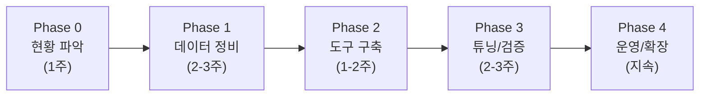

| Phase | 핵심 작업 | 산출물 |
|-------|---------|-------|
| 0 | 질문 유형 수집, 보안 요구사항 정리 | 질문셋 20개, allowlist |
| 1 | Gold Table 설계, Description 작성, DB COMMENT | Gold 3종 + Curated View |
| 2 | 도구 설치 (dbt/Cube/WrenAI 중 선택) | 동작 환경 |
| 3 | SQL Pairs/Instructions, 자동 평가 | 정확도 측정 |
| 4 | 모니터링, 사용자 피드백, 점진적 확장 | 운영 메트릭 |

> 💡 **가장 중요한 단계는 Phase 1 (데이터 정비)**
> 도구 선택은 Phase 2의 일부에 불과. 데이터/메트릭/Description 정비가 80% 결정.

---

# Part 7. 산업 사례 + 향후 방향 (5분)

## 7-1. 토스 PANDA — 참고 사례

토스는 데이터 분석가의 단순 추출 업무 자동화를 위해 **PANDA**라는 NL2SQL 봇을 만들었습니다.

### 핵심 통찰

| 항목 | 토스 PANDA | 우리 세미나 메시지와 일치하는 부분 |
|------|----------|----------------------------------|
| 시맨틱 레이어 본체 | 표준 데이터 마트 (SSOT) | "Gold Table에 메트릭 SSOT" |
| 비즈니스 용어 체계 | 용어 정의 표준화 | "Description/Glossary 정비" |
| 스코어링 시스템 | SSOT(×4) > 마트(×3) > 도메인(×2) > 원시(×1) | "어떤 테이블 우선할지" |
| 자율 동작 | Agentic Loop (멀티 에이전트) | "LangGraph 같은 오케스트레이션" |
| 결과 | 70% 사용률 (전체 팀의) | NL2SQL 도입의 ROI |

> 토스 사례가 **"데이터 정비가 80%, 멀티 에이전트가 필수"** 라는 우리 세미나 메시지를 강력하게 검증합니다.

### 토스에서 배울 추가 인사이트 — 계층 가중치 스코어링

```
같은 질문에 여러 테이블이 후보로 나올 때:
  유사도 점수 × 계층 가중치

  전사 SSOT 마트     × 4   ← 우선
  검증된 표준 마트    × 3
  도메인 분석용 마트  × 2
  원시 데이터        × 1   ← 최후의 수단

→ "공식 마트가 우선" 이라는 비즈니스 우선순위를 점수에 반영
```

> 💡 **실무 적용 가능:** 우리 NL2SQL 시스템에도 이 가중치 로직을 추가하면 정확도 향상 가능.

원문: https://toss.tech/article/da-assistant-panda

## 7-2. 향후 방향 — 환경에 맞는 도구가 없을 때

지금까지 본 3개 도구 (dbt/Cube/WrenAI) 중 환경에 맞는 게 있다면 그것을 쓰면 됩니다.

하지만 **다 안 맞을 수도 있습니다.** 예를 들어:

```
사내 환경:
- Oracle 19c (WrenAI 미지원)
- 팩트-팩트 JOIN 필요 (Cube 제약)
- 사내 LLM (OpenAI 외 API 제한)
- 비정형 데이터 통합 필요 (단일 도구로 안 됨)
```

이 경우 옵션 두 가지:

### 옵션 A: 도구 조합

```
dbt (변환) + Cube (BI) + WrenAI 대신 → 자체 NL2SQL Agent
```

### 옵션 B: 시맨틱 레이어를 직접 구현

#### 핵심 아이디어 — QuerySpec (중간 표현)

> **LLM에게 SQL을 직접 쓰게 하지 않고, "구조화된 쿼리 명세"만 만들게 한다.**

```python
class QuerySpec(BaseModel):
    tables: list[str]              # 어떤 테이블
    select: list[str]              # 어떤 컬럼
    filters: list[Filter]          # 어떤 조건
    order_by: list[OrderBy]        # 정렬
    limit: int = 20
```

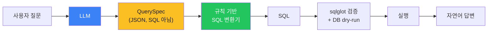

**LLM의 책임 vs 코드의 책임:**

| LLM | 코드 |
|-----|------|
| 질문 의도 파악 | Schema/JOIN 조회 |
| QuerySpec 생성 | SQL 생성 (규칙 기반) |
| 결과 → 자연어 변환 | 검증 (sqlglot/dry-run) |
| | 실행 (DB connection) |
| | 보안 (allowlist/audit) |

> **원칙:** LLM이 결정하는 영역을 최소화하면 환각이 줄어든다.

영감 출처:
- DAQUV/QUVI — SMQ(중간 표현) 개념
- 논문 "Querying Databases with Function Calling" (arXiv 2502.00032)

## 7-3. 결론 — 세미나 핵심 메시지

```
1. 시맨틱 레이어 본체 = DB View / 마트 / 메트릭 정의
   → 어떤 도구를 쓰든 동일

2. 도구 선택 = 환경 × 응용 × 제약의 교차점
   → dbt / Cube / WrenAI / 자체 구현 중 선택

3. 멀티 에이전트 = 어떤 경우에도 필수
   → LangGraph 같은 오케스트레이션

핵심 한 줄:
도구를 사는 게 본질이 아니다.
시맨틱 레이어를 어떻게 정의하느냐가 본질이다.
```

---

## 부록 A. 실습 사전 준비

### 사내 환경 가정 시 필요한 것

| 항목 | 사내 적용 시 |
|------|------------|
| DB | Oracle 19c (또는 PostgreSQL) |
| Docker | 사내 컨테이너 환경 (OpenShift/Kubernetes) |
| 네트워크 | 내부 VPC, 외부 API 호출 가능 여부 |
| LLM | 사내 LLM 또는 외부 API (OpenAI) |
| 인증 | LDAP/SSO 연동 |
| 메타데이터 | OpenMetadata (선택) |

### 실습 데이터셋 (제공)

다음 SQL을 사내 DB에 실행하면 실습 데이터 생성:

```sql
-- 고객 100명, 주문 1000건, 6개월치 시뮬레이션
-- 자세한 SQL은 별도 첨부 (init.sql)
```

## 부록 B. 참고 자료

| 자료 | URL |
|------|-----|
| dbt 공식 문서 | https://docs.getdbt.com |
| Cube 공식 문서 | https://cube.dev/docs |
| WrenAI 공식 문서 | https://docs.getwren.ai |
| LangGraph 공식 문서 | https://langchain-ai.github.io/langgraph/ |
| 토스 PANDA 사례 | https://toss.tech/article/da-assistant-panda |
| Gartner 시맨틱 레이어 정의 | https://www.gartner.com/en/glossary |

### 우리 사내 가이드 문서

- `guide_dbt.md` — dbt 상세 가이드 (1,422줄)
- `guide_cubejs.md` — Cube.js 상세 가이드 (1,459줄)
- `guide_wrenai.md` — WrenAI 상세 가이드 (1,372줄)
- `guide_openmetadata.md` — OpenMetadata 가이드 (1,436줄)
- `nl2sql_agent_design.md` — LangGraph + QuerySpec 자체 구현 설계
- `nl2sql_implementation_plan_v2.md` — 사내 NL2SQL 구현 계획

## 부록 C. Q&A 예상 질문

| Q | A |
|---|---|
| "dbt와 Cube를 같이 쓸 수 있나?" | ✅ 가능. dbt가 Gold Table 만들고 Cube가 그 위에 시맨틱 + API |
| "WrenAI 없이 ChatGPT만 쓰면?" | 가능하지만 정확도/일관성/보안 보장 안 됨 |
| "Oracle 19c에서 WrenAI 정말 안 되나?" | ibis-server가 23ai 전용 SQL 사용 → 19c 미지원 |
| "Cube의 JOIN 제약 어떻게 우회?" | 1) DB View로 미리 JOIN 2) 멀티 에이전트가 결과 합성 |
| "사내 LLM은 어떻게 연결?" | LiteLLM 어댑터 사용 (WrenAI/LangGraph 모두 지원) |
| "데이터 정비에 얼마나 걸리나?" | 작은 도메인 1-2주, 전사 도입 3-6개월 |
| "처음 시작은 어떤 도구로?" | 응용 영역에 따라. BI 중심이면 Cube, 변환 중심이면 dbt |

---

## 변경 이력

| 날짜 | 내용 |
|------|------|
| 2026-05-11 | 세미나 자료 초안 작성 (90분 분량, 실습 포함) |
| 2026-05-17 | §6-1 결정 트리에 4가지 추천 경로별 상세 근거 추가 (dbt Core / Cube / WrenAI / 자체 구현). 시나리오 표 + 핵심 근거 + 부적합 케이스 + 한 페이지 요약 비교 |
| 2026-05-18 | Part 1 개념 보강 — §1-2 Before/After 시각 비교(mermaid 2개), §1-3 각 구성요소에 "없으면 어떻게 되나" + dbt/Cube/WrenAI 용어 매핑표, §1-6 KG 1분 예시 (Cypher + mermaid) |
| 2026-05-18 | Part 4 LangGraph 보강 — §4-3 실제 동작 최소 예시 (TypedDict + 조건부 엣지 + invoke 결과), §4-4 신설 "WrenAI Agent로 안 풀리는 4 시나리오" + 기능 비교표, §4-5 신설 다른 멀티 에이전트 프레임워크 비교 (LangGraph/AutoGen/CrewAI/Swarm) |
