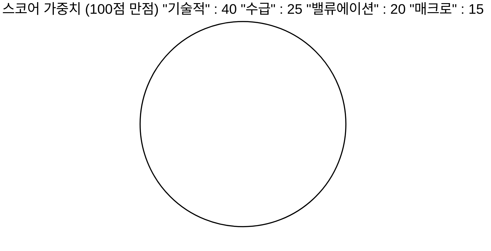
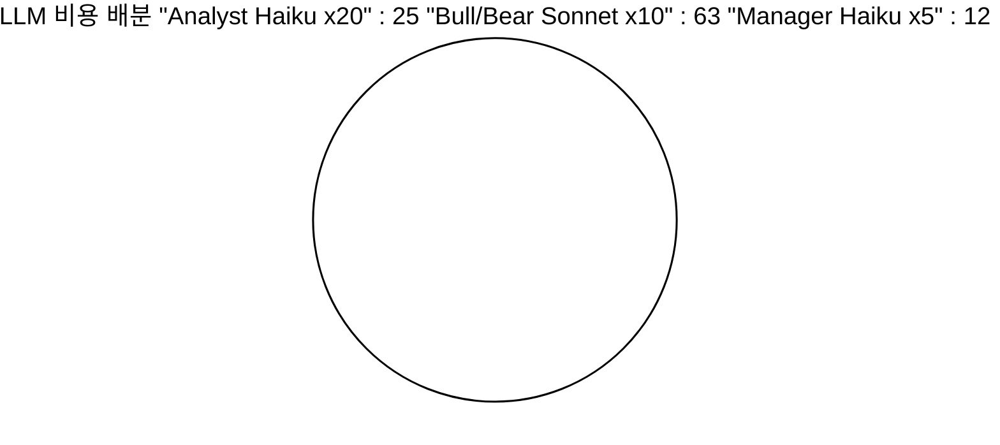
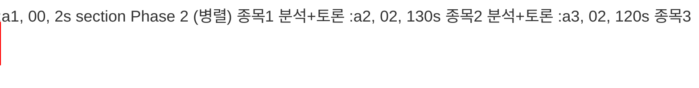

# BIP 종목 추천 에이전트 아키텍처

Version 3.0 | Phase 1+2 구현 완료 | TradingAgents debate discipline 차용

7

스크리닝 프리셋

7

에이전트 (Phase 2)

~2분

전체 소요 시간

$0.08

1회 비용 (5종목)

**목차**

  1. 시스템 개요
  2. 전체 아키텍처 흐름
  3. Phase 1: Deterministic 스크리닝
  4. Phase 2: 멀티 에이전트 토론
  5. 등급 결정 로직
  6. 7개 스크리닝 프리셋
  7. 4카테고리 스코어링
  8. MCP 도구 분배
  9. 출력 형식
  10. 비용/성능
  11. 파일 경로
  12. 미구현 / TODO
  13. 위험/한계

## 1\. 시스템 개요

**목표:** 한국 주식(KOSPI/KOSDAQ) 대상으로 매일 자동 종목 스크리닝 + Bull/Bear 토론 기반 투자 의견 제시

**핵심 원칙:** 스코어링/판정은 deterministic, LLM은 분석 메모 + 방향 판정만

**참고:** [TradingAgents](<https://github.com/TauricResearch/TradingAgents>) (48.5k stars)의 Bull/Bear debate discipline 차용

```mermaid
graph LR A[Airflow DAG  
평일 18:00 KST] -->|HTTP POST| B[BIP-Agents API  
/api/screener/daily] B --> C[Phase 1  
Deterministic 스크리닝] C --> D[Phase 2  
멀티 에이전트 토론] D --> E[stock_recommendations  
DB 저장] D --> F[텔레그램  
발송] style A fill:#dbeafe,stroke:#2563eb style B fill:#dbeafe,stroke:#2563eb style C fill:#d1fae5,stroke:#059669 style D fill:#f3e8ff,stroke:#7c3aed style E fill:#fef3c7,stroke:#d97706 style F fill:#fef3c7,stroke:#d97706
```

전체 시스템 흐름

## 2\. 전체 아키텍처 흐름

```mermaid
graph TD subgraph Phase1["Phase 1: Deterministic 스크리닝 (2초)"] DB[(analytics_stock_daily  
\+ consensus_estimates  
\+ analytics_valuation)] SQL[SQL 기본 필터  
시총 5000억+  
거래대금 10억+  
급등 제외] PRESET[7개 프리셋 필터  
oversold_bounce  
golden_cross  
value_momentum  
breakout  
deep_value  
trend_follow  
vcp_breakout] SCORE[4카테고리 스코어링  
기술 40 + 수급 25  
\+ 밸류 20 + 매크로 15] FILTER[품질 필터  
수익률 10%+  
손익비 1.5+] DB --> SQL SQL -->|149개| PRESET PRESET -->|34개| SCORE SCORE --> FILTER FILTER -->|15개| TOP[상위 5개 선발] end subgraph Phase2["Phase 2: 멀티 에이전트 토론 (130초, 병렬)"] ANALYST[4 Analyst Memo  
기술 / 재무 / 뉴스 / 수급  
Haiku + MCP 병렬] BULL[Bull Researcher  
매수 논거  
Sonnet] BEAR[Bear Researcher  
매도 논거 + 한국 반증  
Sonnet] MGR[Research Manager  
방향 판정  
Haiku] GRADE[Deterministic 등급  
Phase1 스코어 + 방향] TOP --> ANALYST ANALYST --> BULL ANALYST --> BEAR BULL --> MGR BEAR --> MGR MGR --> GRADE end GRADE --> OUT[Buy / Overweight / Hold  
Underweight / Sell] style Phase1 fill:#f0fdf4,stroke:#059669 style Phase2 fill:#faf5ff,stroke:#7c3aed style DB fill:#dbeafe,stroke:#2563eb style TOP fill:#fef3c7,stroke:#d97706 style OUT fill:#fee2e2,stroke:#dc2626
```

Phase 1 + Phase 2 상세 흐름 (숫자는 종목 수)

## 3\. Phase 1: Deterministic 스크리닝

```mermaid
graph LR A[전체 종목  
~540개] -->|시총/거래대금/급등 필터| B[기본 후보  
149개] B -->|7개 프리셋 OR 매칭| C[프리셋 통과  
34개] C -->|스코어링 + 품질 필터| D[품질 통과  
31개] D -->|섹터 중립 + 상위 제한| E[최종 후보  
15개] E -->|top_n_debate| F[Phase 2  
5개] style A fill:#f1f5f9,stroke:#94a3b8 style B fill:#dbeafe,stroke:#2563eb style C fill:#d1fae5,stroke:#059669 style D fill:#fef3c7,stroke:#d97706 style E fill:#fef3c7,stroke:#d97706 style F fill:#f3e8ff,stroke:#7c3aed
```

Phase 1 스크리닝 퍼널

### SQL 기반 1차 필터

  * **데이터 소스:** analytics_stock_daily + stock_info + analytics_valuation + consensus_estimates
  * **유동성 필터:** 시총 5,000억+, 거래대금 10억+
  * **추격매수 방지:** 당일 +5% 초과 급등주 제외
  * **수급 데이터:** 최근 5일 외국인/기관 연속 순매수일수, 누적금액
  * **컨센서스:** consensus_estimates 별도 JOIN (목표가, 투자의견)

### 품질 필터 (scorer 단계)

필터| 기준| 목적  
---|---|---  
최소 수익률| 목표가 / 현재가 ≥ 1.10 (+10%)| 수익성 없는 추천 배제  
최소 손익비| RR ≥ 1.50| 위험 대비 수익 불리한 종목 배제  
진입가 > 손절가| entry_high > stop_loss| 비정상 케이스 배제  
  
### 목표가 계산 우선순위

```mermaid
graph LR A[컨센서스 목표가  
+10% 이상?] -->|Yes| Z[목표가 확정] A -->|No| B[52주 고점 복귀  
+10% 이상?] B -->|Yes| Z B -->|No| C[피보나치 1.618  
확장] C -->|+10% 이상?| Z C -->|No| D[현재가 x 1.10  
Fallback] D --> Z style A fill:#dbeafe,stroke:#2563eb style Z fill:#d1fae5,stroke:#059669
```

## 4\. Phase 2: 멀티 에이전트 토론

```mermaid
graph TD subgraph parallel["5종목 병렬 실행 (asyncio.gather)"] subgraph stock1["종목 1"] A1[4 Analyst  
병렬] --> B1[Bull] & C1[Bear] B1 & C1 --> D1[Manager] end subgraph stock2["종목 2"] A2[4 Analyst  
병렬] --> B2[Bull] & C2[Bear] B2 & C2 --> D2[Manager] end subgraph stock3["종목 3~5"] A3[...동일 구조...] end end D1 & D2 & A3 --> RESULT[결과 취합 + 등급 결정] style parallel fill:#faf5ff,stroke:#7c3aed style RESULT fill:#d1fae5,stroke:#059669
```

Phase 2 병렬 실행 구조 (15분 → 2분으로 단축)

### 4개 Analyst Memo (병렬, Haiku + MCP)

각 에이전트가 MCP 도구로 실제 데이터를 수집하고 200자 이내 분석 메모 작성.

### 기술 분석가

추세, RSI/MACD  
지지/저항, 패턴

### 재무 분석가

매출/영업이익  
PER/PBR, DART공시

### 뉴스 분석가

최근 뉴스  
DART 공시, 이벤트

### 수급 분석가

외국인/기관  
프로그램, 섹터

```mermaid
graph LR MEMO[4개 Analyst Memo] --> BULL["Bull Researcher  
(Sonnet)  
매수 논거 200자"] MEMO --> BEAR["Bear Researcher  
(Sonnet)  
매도 논거 + 한국 반증"] BULL --> MGR["Research Manager  
(Haiku)  
방향 판정"] BEAR --> MGR MGR -->|bull_strong  
bull_win  
neutral  
bear_win  
bear_strong| GRADE[Deterministic  
등급 결정] style BULL fill:#d1fae5,stroke:#059669 style BEAR fill:#fee2e2,stroke:#dc2626 style MGR fill:#dbeafe,stroke:#2563eb style GRADE fill:#fef3c7,stroke:#d97706
```

Bull/Bear 토론 → Manager 판정 → 등급 결정

### Bull Researcher (Sonnet)

  * 4개 analyst memo + Phase 1 스코어 입력
  * 매수 논거 작성 (200자)
  * 성장 잠재력, 기술적 반등, 수급 개선, 밸류 매력

### Bear Researcher (Sonnet)

  * 매도 논거 + **한국 특화 반증 강제**
  * 대주주 리스크, CB/BW/유상증자
  * 잠정실적 쇼크, DART 공시 리스크
  * 외국인 이탈, 프로그램 매도, 커버리지 부족

## 5\. 등급 결정 로직

```mermaid
graph TD P1[Phase 1 스코어] --> BASE{Base Level} BASE -->|75+| BUY[Buy 4] BASE -->|60~74| OW[Overweight 3] BASE -->|45~59| HOLD[Hold 2] BASE -->|30~44| UW[Underweight 1] BASE -->|30미만| SELL[Sell 0] DIR[Manager 방향] --> MOD{Modifier} MOD -->|bull_strong| P2["+2"] MOD -->|bull_win| P1M["+1"] MOD -->|neutral| Z["0"] MOD -->|bear_win| M1["-1"] MOD -->|bear_strong| M2["-2"] BUY & OW & HOLD & UW & SELL --> CALC["최종 = clamp(0~4, base + modifier)"] P2 & P1M & Z & M1 & M2 --> CALC CALC --> FINAL["Buy / Overweight / Hold / Underweight / Sell"] style P1 fill:#d1fae5,stroke:#059669 style DIR fill:#f3e8ff,stroke:#7c3aed style FINAL fill:#fef3c7,stroke:#d97706
```

Deterministic 등급 결정: LLM은 방향만, 등급은 코드가 결정

### 등급 매트릭스

Phase 1 스코어| Base| \+ bull_strong| \+ bull_win| \+ neutral| \+ bear_win| \+ bear_strong  
---|---|---|---|---|---|---  
**75+**|  Buy| Buy| Buy| Buy| Overweight| Hold  
**60~74**|  Overweight| Buy| Buy| Overweight| Hold| Underweight  
**45~59**|  Hold| Buy| Overweight| Hold| Underweight| Sell  
**30~44**|  Underweight| Overweight| Hold| Underweight| Sell| Sell  
**< 30**| Sell| Hold| Underweight| Sell| Sell| Sell  
  
## 6\. 7개 스크리닝 프리셋

```mermaid
graph TD ALL[전체 후보 149개] --> P1[1. 과매도 반등  
RSI 45이하 + MACD양전환] ALL --> P2[2. 골든크로스  
MA5 > MA20 근접] ALL --> P3[3. 가치 모멘텀  
PER 15이하 + ROE 10이상] ALL --> P4[4. 돌파  
52주 고점 근접] ALL --> P5[5. 심층 가치  
PER 7이하 + PBR 0.8이하] ALL --> P6[6. 추세 추종  
MA 정배열 + 수급] ALL --> P7[7. VCP 돌파  
완전정배열 + vol200%] P1 & P2 & P3 & P4 & P5 & P6 & P7 -->|OR 조건| MERGE[합집합 34개  
한 종목이 여러 프리셋 매칭 가능] style ALL fill:#f1f5f9,stroke:#94a3b8 style MERGE fill:#d1fae5,stroke:#059669 style P7 fill:#fef3c7,stroke:#d97706
```

7개 프리셋은 OR 조건 (하나라도 매칭되면 통과)

#| 전략| 핵심 조건| 스타일  
---|---|---|---  
1| **과매도 반등**|  RSI<45 + MACD양전환 + 수급 + 풀백존(BB≤0.65, 이격≤3%)| 단기  
2| **골든크로스**|  MA5>MA20 2% 이내 + vol>1.2 + 풀백존| 단기  
3| **가치 모멘텀**|  PER<15 + ROE>10 + 외국인3일+ + 이격-5~2 + 목표가+10%| 중기  
4| **돌파**|  52w고점-2~-8% + vol>1.5 + MA20위 + MA5*1.03 이내| 단기  
5| **심층 가치**|  PER<7 + PBR<0.8 + ROE>8 + MA20근접 + MA60지지| 중기  
6| **추세 추종**|  정배열(MA20>60>120) + 52w-3~-15% + 수급 + RSI40~72| 중기  
7| **VCP 돌파**|  완전정배열(MA5>20>60>120) + vol200%+ + 52w-2~-15% + 수급| 단기  
  
## 7\. 4카테고리 스코어링



### 기술적 (40점)

  * RSI 과매도: 0~10점
  * MACD 양전환: 0~10점
  * 볼린저밴드 위치: 0~5점
  * 추세 (MA 기반): 0~5점
  * 거래량 비율: 0~5점
  * 52주 위치: 0~5점

### 수급 (25점)

  * 외국인 순매수: 0~10점
  * 기관 순매수: 0~8점
  * 외국인+기관 동반: +4점
  * 5일 누적 순매수: 0~3점

### 밸류에이션 (20점)

  * PER 매력도: 0~6점
  * PBR 저평가: 0~4점
  * ROE 수준: 0~4점
  * 컨센서스 괴리율: 0~6점

### 매크로 (15점)

  * VIX 수준: ±5점
  * KOSPI 등락: ±3점
  * 원/달러 환율: ±2점
  * 중립 시작 (7.5점)

## 8\. MCP 도구 분배

```mermaid
graph LR subgraph MCP["MCP 서버 (bip-stock-mcp)"] RT[실시간 도구  
realtime_stock_price  
realtime_index  
realtime_investor] DB_TOOL[DB 조회 도구  
db_investor_flow  
db_investor_trading  
db_market_indices] DART[DART 도구  
dart_financial_statement  
dart_disclosure_list  
dart_corp_search] NEWS[뉴스 도구  
news_search_naver  
news_search_web] CTX[맥락 도구  
get_indicator_context] end TECH[기술 분석가] -.-> RT & DB_TOOL & CTX FUND[재무 분석가] -.-> DART NEWS_A[뉴스 분석가] -.-> NEWS & DART FLOW[수급 분석가] -.-> RT & DB_TOOL style MCP fill:#f1f5f9,stroke:#94a3b8 style TECH fill:#dbeafe,stroke:#2563eb style FUND fill:#d1fae5,stroke:#059669 style NEWS_A fill:#fef3c7,stroke:#d97706 style FLOW fill:#f3e8ff,stroke:#7c3aed
```

에이전트별 MCP 도구 접근 권한

에이전트| 허용 도구  
---|---  
기술 분석가| `realtime_stock_price`, `realtime_index`, `db_market_indices`, `krx_stock_trade_info`, `get_indicator_context`  
재무 분석가| `dart_financial_statement`, `dart_corp_search`, `dart_disclosure_list`, `krx_stock_base_info`  
뉴스 분석가| `news_search_naver`, `news_search_web`, `dart_disclosure_list`  
수급 분석가| `realtime_investor`, `realtime_program_trade`, `db_investor_flow`, `db_investor_trading`, `sector_performance`  
Bull / Bear / Manager| 없음 (분석가 메모 기반으로만 작성)  
  
## 9\. 출력 형식
    
    
    📊 BIP 종목 분석 — 2026-04-11 (데이터: 2026-04-10)
    
    KOSPI 5,859(+1.4%) / KOSDAQ 1,094(+1.6%) / VIX 19.2
    
    🟢 Overweight — 한국앤컴퍼니 (000240) 66점
    현재: 50,500원(+3.1%) / 목표: 72,900원 (+44.3%)
    매수: 47,500~50,500원 | 손절: 46,300원 | RR 5.3
    
    Bull
      * 사상 최대 실적 + PER 4.5배 극저평가
      * 외국인+기관 동반 순매수
      * 타이어 업황 개선 지속
    
    Bear
      * 대주주 지분 변동 리스크
      * 원자재 가격 변동성
      * 글로벌 경쟁 심화
    
    📌 판정: Bull 우세 — 실적 확인 + 수급 개선이 밸류 부담 상쇄
    
    ———————————————
    투자 참고용이며, 투자 결정은 본인의 판단과 책임 하에 이루어져야 합니다.

## 10\. 비용 / 성능

### 비용 (5종목 기준)



단계| 모델| 호출수| 비용  
---|---|---|---  
4 Analyst x 5종목| Haiku| 20회| ~$0.02  
Bull+Bear x 5종목| Sonnet| 10회| ~$0.05  
Manager x 5종목| Haiku| 5회| ~$0.01  
**합계**| | **35회**| **~$0.08**  
  
월간: $0.08 x 22일 = $1.76

### 성능



항목| 소요 시간  
---|---  
Phase 1 스크리닝| ~2초  
Phase 2 토론 (5종목 병렬)| ~130초  
**총 소요**| **~2분 15초**  
  
병렬화 전: ~15분 → 후: ~2분 (7배 개선)

## 11\. 파일 경로

```mermaid
graph TD subgraph BIP_Agents["BIP-Agents / langgraph / screener /"] SN[screener_node.py  
SQL 스크리닝] SC[scorer.py  
스코어링] AN[analysts.py  
4 Analyst] DB_F[debate.py  
Bull/Bear + Manager] EX[explainer.py  
메시지 생성] MN[main.py  
통합 진입점] GR[graph.py  
LangGraph] ST[state.py  
상태 정의] end subgraph API["langgraph /"] AP[api.py  
FastAPI 엔드포인트] end AP --> MN MN --> GR GR --> SN --> SC --> EX MN --> AN --> DB_F style BIP_Agents fill:#faf5ff,stroke:#7c3aed style API fill:#dbeafe,stroke:#2563eb
```

### BIP-Agents (스크리너)

`screener/screener_node.py`| SQL 스크리닝 + 7개 프리셋  
---|---  
`screener/scorer.py`| 4카테고리 스코어링 + 품질필터  
`screener/analysts.py`| 4개 전문 애널리스트  
`screener/debate.py`| Bull/Bear + Manager + 등급  
`screener/explainer.py`| 코드 템플릿 메시지 생성  
`screener/main.py`| Phase 1+2 통합, 병렬 실행  
`api.py`| FastAPI 엔드포인트  
  
### BIP-Pipeline (참조)

`postgres/curated_views.sql`| 시그널 뷰 3개  
---|---  
`indicators/calculator.py`| 기술 지표 계산  
`docs/security_governance.md`| 보안 규칙  
  
## 12\. 미구현 / TODO

### Phase 2 고도화

  * TODO Bull/Bear 요약을 불릿 3개 형식으로 변경
  * TODO 메시지에 Manager 판정 근거 1줄 추가
  * TODO stock_recommendations DB 저장 로직
  * TODO Airflow DAG 생성 (평일 18:00 KST)

### Phase 3: Shadow Mode + 학습

  * TODO recommendation_performance 테이블 (D+1/D+5/D+20)
  * TODO Shadow mode 4~8주
  * TODO 성과 기반 가중치 캘리브레이션
  * TODO BM25 Memory
  * TODO 미국 주식 확장

### 데이터 보강

  * TODO stock_info.sector 데이터 적재
  * TODO 캔들스틱 패턴 감지
  * TODO MACD 다이버전스 계산
  * TODO OM 메타데이터/리니지 등록

## 13\. 위험 / 한계

  * **백테스트 필수:** Shadow mode 없이 운영 전환 금지
  * **LLM 환각:** Deterministic 스코어를 baseline으로 유지, LLM은 방향만 판정
  * **면책 조항:** 모든 출력에 "투자 참고용" disclaimer 필수
  * **민감 데이터:** portfolio/users 테이블 접근 금지
  * **섹터 데이터 부재:** stock_info.sector가 전부 NULL
  * **MCP 도구 지연:** 뉴스/DART 조회 80~290초 → 병렬화로 완화
  * **비용 통제:** 테스트 반복 시 비용 주의 (~$0.08/회)

마지막 업데이트: 2026-04-11 | v3.0 | Phase 1+2 구현 완료 
