# BIP 종목 추천 에이전트 아키텍처

> **버전:** v6.0 (2026-05-01) | Phase 1+2+백테스팅+VCP매집 운영 중

## 1. 개요

BIP-Pipeline의 기술 지표·재무·수급·매크로 데이터를 활용해 매일 한국 주식을 스크리닝하고, LLM 멀티 에이전트가 Bull/Bear 토론을 거쳐 매수 추천 등급을 산출하는 시스템.

> **비유:** 펀드 매니저 사무실의 "리서치 팀 + 투자 위원회" 구조와 같다.
> - **리서치 팀(Phase 1)**: 수천 종목을 정량 지표로 1차 스크리닝
> - **분석가들(Phase 2 Analyst)**: 통과한 종목을 기술/재무/뉴스/수급 측면에서 심층 분석
> - **Bull/Bear 토론자**: 같은 데이터로 매수/매도 양측 논거 작성
> - **리서치 매니저**: 토론 결과로 방향 판정
> - **백테스팅 팀**: 추천 후 D+60까지 일별 성과 추적

### 핵심 가치

| 가치 | 설명 |
|------|------|
| **객관성** | Phase 1 deterministic 스코어 기반, LLM은 방향만 보조 |
| **검증 가능성** | 모든 추천이 D+1~D+60 일별 추적 → 실제 승률 측정 |
| **일관성** | temperature=0, 같은 데이터에 같은 결과 |
| **재현성** | 추천 시점 정량 데이터 + Bull/Bear 메모 + Manager 판정 전부 DB 저장 |

## 2. 아키텍처

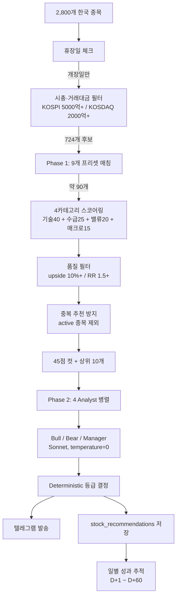

## 3. Phase 1: Deterministic 스크리닝

### 3.0 스크리닝 퍼널 (종목 수 변화)

> **이 다이어그램이 보여주는 것:** 2,800종목에서 시작해서 최종 10개로 좁혀지는 단계별 필터링. 각 단계에서 종목 수가 어떻게 줄어드는지 한눈에 파악할 수 있다.

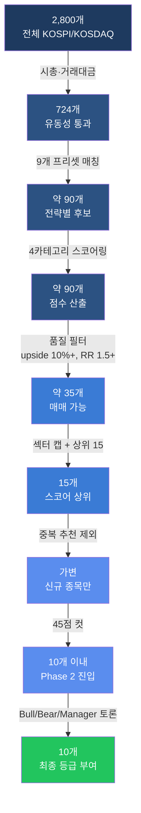

> 💡 **실무 팁 — funnel 단계별 종목 수 모니터링**: 어느 단계에서 너무 많이 걸러지면 그 단계 기준이 너무 타이트한 것. 예: "프리셋 매칭이 90 → 35로 60% 탈락" → 품질 필터가 너무 엄격할 수 있음.

### 3.1 시총·거래대금 필터

> **왜 필요한가:** 코스닥 잡주(시총 100억, 거래대금 1억)가 추천에 들어가면 유동성 부족으로 실제 매매가 어렵다. 기관/외국인이 따라올 수 있는 종목만 대상으로 한다.

> **이 코드가 하는 일:** 시장 종류에 따라 시총 기준을 다르게 적용한다.

```sql
CASE WHEN market_type = 'KOSPI' THEN market_value >= 5000  -- 5000억
     WHEN market_type = 'KOSDAQ' THEN market_value >= 2000 -- 2000억
END
AND close * volume > 1000000000  -- 거래대금 10억+
```

> ⚠️ **함정 — KOSPI/KOSDAQ 일괄 기준**: 초기에는 둘 다 5000억으로 했더니 KOSDAQ 종목이 거의 안 잡힘. KOSDAQ 시총 5000억은 상위 15%라 너무 엄격.

### 3.2 9개 프리셋

> **이 다이어그램이 보여주는 것:** 9개 프리셋을 추세 방향과 전략 성격으로 분류한 맵. 각 프리셋이 어떤 시장 상황에서 동작하는지 한눈에 파악할 수 있다.

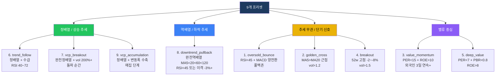

#### 프리셋 상세 매트릭스

| # | 프리셋 | 한 줄 정의 | 핵심 조건 | 신호 타입 |
|---|--------|----------|----------|----------|
| 1 | oversold_bounce | 과매도 반등 | RSI<45 + MACD양전환 + 수급 | 단기 반등 |
| 2 | golden_cross | 골든크로스 | MA5>MA20 근접 + vol>1.2 | 단기 추세 전환 |
| 3 | value_momentum | 가치 모멘텀 | PER<15 + ROE>10 + 외국인3일+ | 중장기 가치 |
| 4 | breakout | 돌파 | 52w고점 -2~-8% + vol>1.5 | 단기 모멘텀 |
| 5 | deep_value | 심층 가치 | PER<7 + PBR<0.8 + ROE>8 | 장기 가치 |
| 6 | trend_follow | 추세 추종 | 정배열(MA20>60>120) + 수급 | 중기 추세 |
| 7 | vcp_breakout | VCP 돌파 | 완전정배열 + vol 200%+ | 단기 돌파 |
| 8 | downtrend_pullback | 역배열 눌림 | 완전역배열 + 눌림 | 역추세 반등 |
| 9 | **vcp_accumulation** | **VCP 매집** | **정배열 + 변동폭 30%+ 수축 + 거래량 감소** | **중기 선행** |

#### 프리셋 매칭 동작

> **이 다이어그램이 보여주는 것:** 한 종목이 여러 프리셋에 동시 매칭될 수 있고, 매칭된 프리셋 목록이 `preset_tags` 배열로 저장된다.

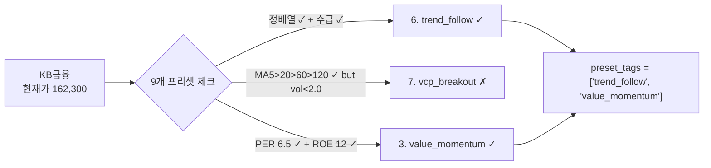

> 💡 **실무 팁 — 다중 매칭이 강한 신호**: 한 종목이 3개 이상 프리셋에 동시 매칭되면 그만큼 여러 관점에서 매수 근거가 있다는 뜻. 백테스팅에서 다중 매칭 종목의 승률이 높은지 확인 가능.

#### VCP (Volatility Contraction Pattern) 두 단계

> **비유:** 용수철이 압축되다가 튀어오르는 패턴. 7번 vcp_breakout은 "튀는 순간", 9번 vcp_accumulation은 "압축 진행 중"을 잡는다.

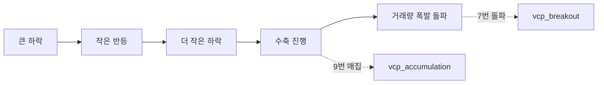

> 💡 **실무 팁 — 9번이 7번보다 선행 신호**: 9번에 잡혔다가 며칠 뒤 7번에 잡히는 패턴이 가장 강한 매수 시그널. 데이터 쌓이면 둘의 승률 차이를 비교할 수 있다.

### 3.3 VCP 수축률 계산 (사전 계산)

> **이 코드가 하는 일:** 매일 indicator DAG가 stock_indicators에 VCP 수축률을 계산해서 저장. 스크리너는 이 값을 SQL로 바로 조회.

```python
def calculate_vcp(high, low, volume):
    """
    vcp_contraction = 1 - (최근 5일 고저폭 / 과거 16~20일 고저폭)
                     0~1 범위, 1에 가까울수록 변동폭 수축 강함
    
    vcp_vol_dry = 1 - (최근 10일 평균 거래량 / 과거 11~20일 평균 거래량)
                  0~1 범위, 1에 가까울수록 거래량 감소 강함 (매집)
    """
```

> ⚠️ **함정 — 매번 SQL로 계산하면 느리다**: 700개 종목 × 20일 = 14,000행 윈도우 함수가 매일 돌면 부담. 사전 계산이 정답.

### 3.4 4카테고리 스코어링

| 카테고리 | 만점 | 주요 팩터 |
|----------|------|----------|
| 기술적 | 40 | RSI, MACD, BB, 추세, 볼륨, 52W 위치 |
| 수급 | 25 | 외국인, 기관, 연속일수, 동반매수 |
| 밸류 | 20 | PER, PBR, ROE, 컨센서스 괴리 |
| 매크로 | 15 | VIX, KOSPI 등락, 환율 |

> ⚠️ **함정 — 스코어 분포가 좁다**: 실제 분포는 35~55점 구간에 몰려있음. 75점(Buy)은 거의 안 나옴. 데이터 쌓이면 가중치 재조정 필요.

### 3.5 품질 필터

> **이 코드가 하는 일:** 수익 가능성이 낮거나 손익비가 안 맞는 종목을 자동 제외한다.

```python
MIN_UPSIDE_RATIO = 1.10  # 목표가 대비 +10% 미만 제외
MIN_RISK_REWARD = 1.50   # RR 1.5 미만 제외
```

> 💡 **실무 팁 — "수익이 X배 유리한 구조"**: R:R 2.5라는 수치보다 "수익이 손실의 2.5배 유리"가 일반 투자자에게 직관적이다.

### 3.6 차트 기반 매매포인트 (한 세트)

> **비유:** 트레이더 노트의 "진입-목표-손절" 한 페이지. 따로 계산하면 의미 없고, 하나의 시나리오로 묶여야 한다.

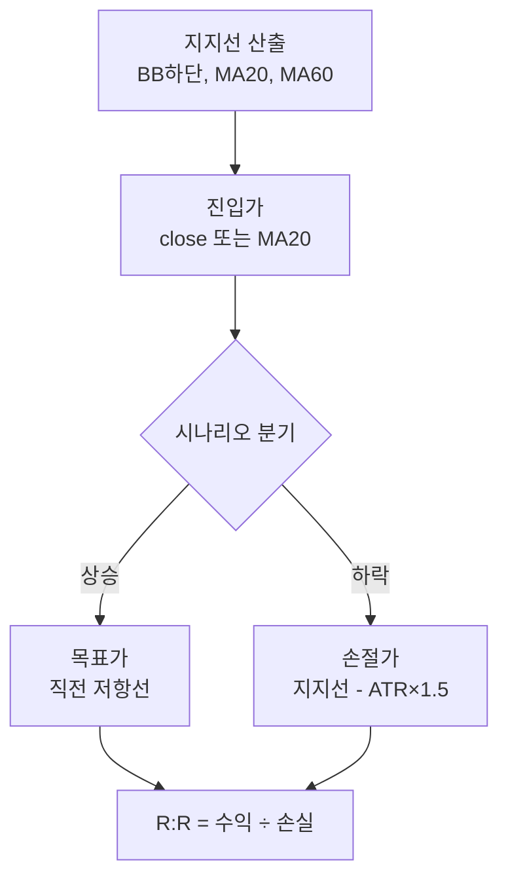

| 항목 | 산출 방식 |
|------|----------|
| 지지선 | max(BB하단, min(MA20, MA60) × 0.98) |
| 손절가 | 지지선 - ATR × 1.5 (최대 -15%) |
| 목표가 | 직전 저항선 → 52주 고점 50% 복귀 → ATR × 3 |
| 컨센서스 | 참고만 (한국 증권사 목표가는 과대계상 성향) |

## 4. Phase 2: 멀티 에이전트 토론

### 4.1 중복 추천 방지

> **왜 필요한가:** 같은 종목을 매일 추천하면 "이미 들고 있는 건 어쩌나, 추가 매수인가" 혼란. 증권사 리포트도 커버리지 종목은 등급 변경만 발표하지 신규 추천으로 안 낸다.

> **이 코드가 하는 일:** 현재 active 상태인 종목을 신규 추천에서 제외한다.

```python
active_tickers = SELECT ticker FROM recommendation_performance WHERE status = 'active'
new_recs = [r for r in recs if r.ticker not in active_tickers]
```

### 4.2 등급 변경 이력

> **왜 필요한가:** 같은 종목이 매수 추천 → 매수 주의로 바뀌면 사용자에게 알려줘야 한다. 증권사가 "투자의견 하향" 알림 보내는 것과 동일한 역할.

> **이 코드가 하는 일:** 기존 active 종목이 다시 스크리닝에 걸렸을 때 등급이 바뀌면 이력을 남기고 텔레그램으로 알림.

```python
if existing.grade != new_rec.grade:
    INSERT INTO recommendation_grade_history (
        ticker, prev_grade, new_grade, prev_score, new_score, reason
    ) VALUES (...)
    
    # 텔레그램 알림
    "현대해상 매수 추천 → 매수 주의 (스코어 50 → 42)"
```

> 💡 **실무 팁 — 이력을 남겨야 가치 검증 가능**: "매수 추천 → 매수 주의로 바꿨는데 실제로 하락했나?" 같은 사후 검증은 이력이 없으면 불가능.

### 4.3 4 Analyst 병렬 (Haiku + MCP)

| 에이전트 | 허용 MCP 도구 |
|----------|--------------|
| 기술 분석가 | realtime_stock_price, realtime_index, db_market_indices, krx_stock_trade_info, get_indicator_context |
| 재무 분석가 | dart_financial_statement, dart_corp_search, dart_disclosure_list, krx_stock_base_info |
| 뉴스 분석가 | news_search_naver, news_search_web, dart_disclosure_list |
| 수급 분석가 | realtime_investor, realtime_program_trade, db_investor_flow, db_investor_trading, sector_performance |

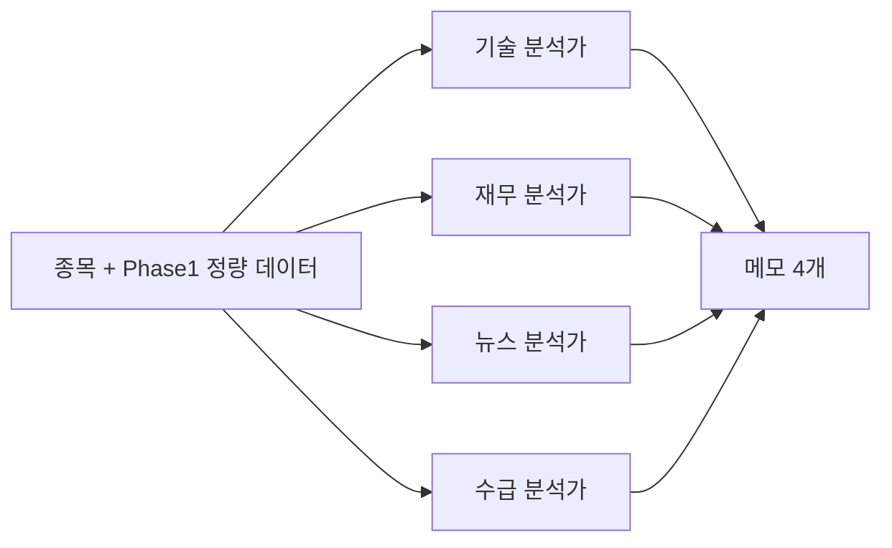

### 4.4 Bull/Bear/Manager 토론 (Sonnet)

> **비유:** 변호사 양측의 변론 → 판사 판정. Bull은 매수 변호인, Bear는 매도 변호인, Manager는 판사.

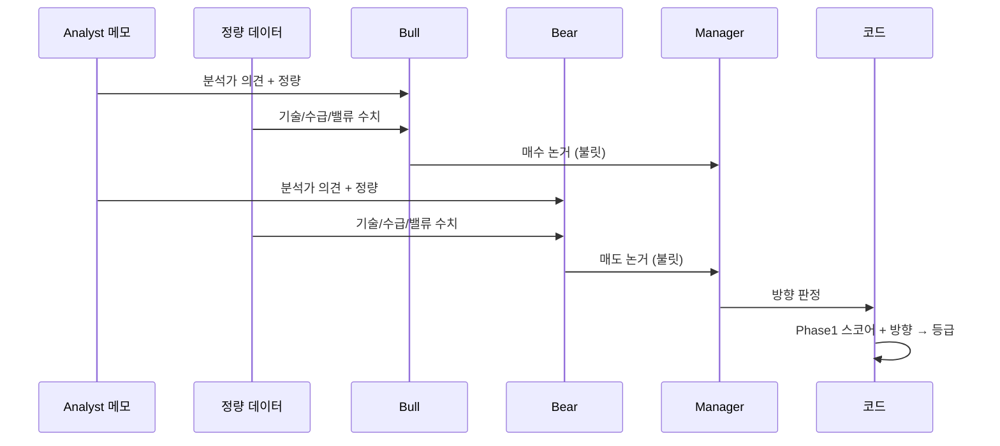

> ⚠️ **함정 — LLM이 등급을 직접 정하면 Hold만 남발**: 처음에는 LLM에게 직접 등급을 매기게 했더니 안전한 Hold만 나왔다. 등급은 코드, LLM은 방향만.

### 4.5 정량 데이터 주입

> **왜 필요한가:** Bull/Bear가 Analyst 메모(텍스트)만 보면 정보 손실. Phase 1에서 계산한 모든 수치(RSI, MACD, MA, 수급, 밸류, 매매포인트)를 직접 전달.

> **이 코드가 하는 일:** 모든 LLM에 정량 데이터 블록을 system 메시지에 함께 주입한다.

```
=== 정량 데이터 ===
현재가: 51,200원 (+2.1%)
기술: RSI 65.0 | MACD히스토그램 +120
이동평균: 정배열(MA5>20>60)
52주 고점 대비: -8.5%
수급: 외국인 3일 연속매수 | 기관당일 순매수
밸류: PER 11.2 | PBR 1.5 | ROE 14.3%
스코어: 기술22 + 수급15 + 밸류12 + 매크로9 = 58점
매매포인트: 목표 57,800원(+13%) | 손절 43,500원(-15%) | RR 2.8
```

### 4.6 Deterministic 등급 결정

> **이 코드가 하는 일:** Phase 1 스코어로 base 등급을 정하고, Manager가 판정한 방향으로 ±1~2단계 조정한다.

```python
LEVELS = ["Sell", "Underweight", "Hold", "Overweight", "Buy"]

# Phase 1 스코어 → base
if phase1_score >= 75: base = 4  # Buy
elif phase1_score >= 60: base = 3  # Overweight  
elif phase1_score >= 45: base = 2  # Hold
elif phase1_score >= 30: base = 1  # Underweight
else: base = 0  # Sell

# Manager 방향 → modifier
modifier = {
    "bull_strong": +2, "bull_win": +1,
    "neutral": 0,
    "bear_win": -1, "bear_strong": -2
}[direction]

final = max(0, min(4, base + modifier))
grade = LEVELS[final]
```

### 4.7 Deterministic 확신도 (6개 조건)

> **왜 코드로 계산:** LLM에게 "확신도 매겨라" 했더니 전부 "중간"만 찍었다. 객관적 조건 충족 개수로 판정.

> **이 코드가 하는 일:** 6개 조건 중 몇 개를 충족하는지 세서 높음/중간/낮음 산출.

```python
conditions = [
    direction in ("bull_strong", "bull_win"),  # Manager 긍정
    rr >= 2.0,                                  # 손익비 유리
    total_score >= 48,                          # 스코어 평균 이상
    foreign_buy or inst_buy,                    # 수급 한쪽 이상
    tech_score >= 15,                           # 기술적 양호
    target_upside_pct >= 15,                    # 컨센서스 상승여력
]
both_buy_bonus = 1 if (foreign_buy and inst_buy) else 0
met = sum(conditions) + both_buy_bonus

if met >= 5: confidence = "높음"
elif met >= 3: confidence = "중간"
else: confidence = "낮음"
```

### 4.8 일반 투자자 친화 용어

| 원문 | 변환 | 색상 |
|------|------|------|
| Buy | 적극 매수 | 빨강 |
| Overweight | 매수 추천 | 초록 |
| Hold | 관망 | 노랑 |
| Underweight | 매수 주의 | 주황 |
| Sell | 매도 | 파랑 |
| R:R 2.4 | "수익이 2.4배 유리한 구조" | - |
| 컨센서스 | 증권사 목표가 | - |

> ⚠️ **함정 — 매수 주의를 파랑으로 두면 매도와 헷갈림**: 처음엔 매수 주의=파랑, 매도=빨강이었는데 한국식(파랑=하락)과 충돌. 매수 주의는 주황으로 변경.

## 5. 백테스팅: 일별 성과 추적

### 5.1 핵심 설계

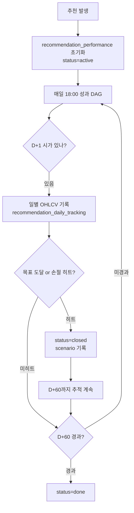

### 5.2 성과 측정 기준

| 항목 | 기준 |
|------|------|
| **진입가** | D+1 시가 (실제 살 수 있는 가격) |
| **수익률 계산** | 종가 기준 |
| **목표 도달 판정** | 장중 고가 ≥ 목표가 × **1.05** (5% 버퍼) |
| **손절 히트 판정** | 장중 저가 ≤ 손절가 × **0.95** (5% 버퍼) |
| **동시 터치** | 손절 우선 (보수적) |
| **추적 기간** | D+60 (약 3개월, 일별 매일 기록) |

> **왜 5% 버퍼:** 목표가 정확히 +0.1%에 살짝 닿고 빠진 케이스를 "도달"로 판정하면 노이즈가 많음. "확실히 넘어간 경우"만 closed로 처리.

### 5.3 테이블 구조

```
stock_recommendations  (추천 시점 스냅샷, 불변)
  ├── grade, direction, total_score
  ├── 4카테고리 개별 점수
  ├── target/stop/RR/preset_tags
  └── bull_memo/bear_memo/manager_summary/confidence

recommendation_performance  (요약, 종목당 1행)
  ├── d1_open (진입가)
  ├── d5/d10/d20/d60 close + return_pct
  ├── target_hit_day, stop_hit_day
  ├── scenario_result (target_first/stop_first/neither)
  └── status (active/closed/done/expired)

recommendation_daily_tracking  (상세, 종목당 최대 60행)
  ├── day_n, trade_date
  ├── open/high/low/close/volume
  ├── return_pct, cumulative_high/low
  └── target_hit, stop_hit (해당일 기준)

recommendation_grade_history  (등급 변경 이력)
  ├── ticker, change_date
  ├── prev_grade → new_grade
  └── prev_score → new_score
```

> 💡 **실무 팁 — closed 후에도 daily_tracking 계속**: 목표 도달로 closed 됐어도 D+60까지 추적 계속. 나중에 "조기 종료가 옳았나, 더 들고 갔으면 어땠을까" 분석 가능.

### 5.4 상태 흐름

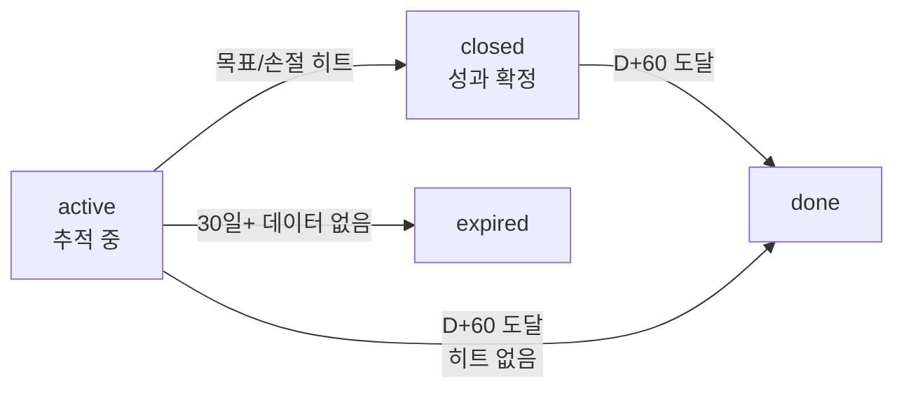

## 6. DAG 운영

### 6.1 DAG 체인

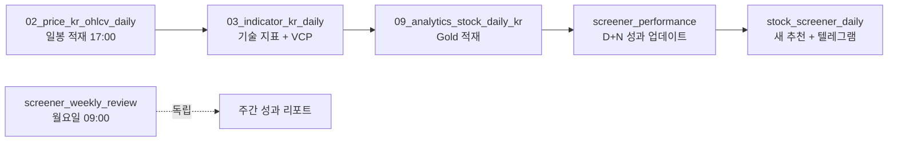

### 6.2 휴장일 체크

> **왜 필요한가:** 5/1(근로자의날)은 공휴일이 아니지만 증시는 휴장. 주말도 마찬가지. 휴장일에 DAG가 돌면 전일 데이터로 같은 추천이 나와서 의미 없음.

> **이 코드가 하는 일:** KST 기준으로 주말/공휴일/근로자의날을 체크해서 휴장일이면 False 반환.

```python
def is_market_open(check_date=None) -> bool:
    if check_date is None:
        check_date = datetime.now(KST).date()
    
    # 1. 주말
    if check_date.weekday() >= 5: return False
    
    # 2. 공휴일 (holidays 라이브러리)
    if check_date in holidays.KR(): return False
    
    # 3. 증시 추가 휴장일 (근로자의날)
    if check_date in EXTRA_MARKET_HOLIDAYS: return False
    
    return True
```

> ⚠️ **함정 — UTC 기준 today()**: 한국 시간 5/1 새벽인데 UTC로는 4/30. `date.today()` 대신 `datetime.now(KST).date()`를 써야 정확.

> ⚠️ **함정 — holidays.KR()에 근로자의날 없음**: 근로자의날은 공휴일이 아니라 노동법상 유급휴일. 별도로 `EXTRA_MARKET_HOLIDAYS`에 추가 필요.

```python
EXTRA_MARKET_HOLIDAYS = {
    date(2025, 5, 1): "근로자의날",
    date(2026, 5, 1): "근로자의날",
    # ...
}
```

### 6.3 DAG별 스케줄

| DAG | 스케줄 | 휴장일 처리 |
|-----|--------|------------|
| stock_screener_daily | screener_performance에서 트리거 | ✅ 휴장일 스킵 |
| screener_performance | analytics_stock_daily에서 트리거 | ✅ 휴장일 스킵 |
| screener_weekly_review | 월요일 09:00 KST | (집계만, 영향 없음) |

## 7. 비용

| 구성 | 종목당 | 10종목 | 월간 (22영업일) |
|------|--------|--------|----------------|
| Analyst (Haiku × 4) | $0.004 | $0.04 | |
| Bull/Bear (Sonnet × 2) | $0.014 | $0.14 | |
| Manager (Sonnet × 1) | $0.007 | $0.07 | |
| **합계** | **~$0.025** | **~$0.25** | **~$5** |

> 💡 **실무 팁 — Manager까지 Sonnet 쓴 이유**: Haiku로 했을 때 같은 데이터에 다른 방향이 자주 나옴. Sonnet + temperature=0이면 일관성 확보.

## 8. 화면 (BIP-React-FastAPI)

### 8.1 페이지 구조

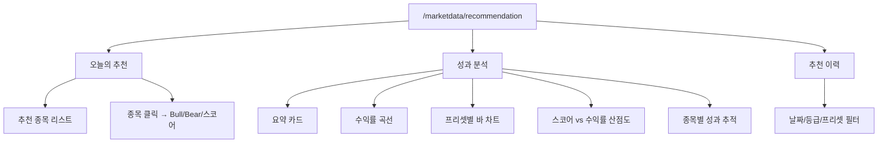

### 8.2 API 엔드포인트

| 엔드포인트 | 용도 |
|-----------|------|
| `GET /api/screener/today` | 오늘의 추천 |
| `GET /api/screener/performance/summary` | 성과 요약 |
| `GET /api/screener/performance/stocks` | 종목별 성과 (현재 수익률 + 1W/2W/1M) |
| `GET /api/screener/performance/daily/{ticker}` | 일별 추적 |
| `GET /api/screener/history` | 추천 이력 |
| `GET /api/screener/chart/returns` | 수익률 곡선 데이터 |
| `GET /api/screener/chart/scatter` | 스코어 vs 수익률 |
| `GET /api/screener/grade-changes` | 등급 변경 이력 |

### 8.3 UX 디테일

- **종목명 클릭** → 새 탭에서 Stock 상세 화면 열림
- **프리셋 태그 호버** → 한글 이름 + 조건 설명 툴팁
- **차트 라인 호버** → 해당 종목 강조 + 전체 종목 수익률 정렬 표시
- **현재 수익률 옆 (D+N)** → 며칠째인지 표시

## 9. 알려진 한계 + 함정

> ⚠️ **함정 정리**

| 함정 | 영향 | 해결 |
|------|------|------|
| LLM에 등급 직접 결정 시 Hold 남발 | 추천 다양성 손실 | Deterministic 등급 + 방향만 LLM |
| LLM에 확신도 직접 결정 시 "중간"만 | 차별화 불가 | 6개 조건 충족 개수로 코드 계산 |
| temperature=1 기본값 | 같은 데이터에 다른 결과 | 모든 LLM에 temperature=0 |
| KOSPI/KOSDAQ 시총 일괄 기준 | KOSDAQ 종목 누락 | 차등 적용 (5000/2000) |
| 같은 종목 매일 추천 | 중복, 액션 불명확 | active 종목 제외 + 등급 변경만 알림 |
| holidays.KR()에 근로자의날 없음 | 5/1 휴장일 미감지 | EXTRA_MARKET_HOLIDAYS 추가 |
| date.today()는 UTC | KST 자정 ~ UTC 자정 사이 오판 | datetime.now(KST).date() |
| 일봉에 OHLC=0 행 (시간외 종가만) | 손절 판정 오류 | insert 시 open/high/low > 0 필터 |

> 💡 **실무 팁**

- **백테스팅 데이터 4주 이상 쌓이기 전엔 가중치 튜닝 금지** — 표본 부족으로 잘못된 결론 가능
- **9번 vcp_accumulation 후보가 며칠 후 7번 vcp_breakout으로 넘어가는지 추적** — VCP 패턴 검증
- **현재 스코어 분포는 35~55점 구간** — Buy(75+) 등급은 거의 안 나옴. 데이터 쌓이면 가중치 재조정 필요
- **컨센서스(증권사 목표가)는 참고만** — 한국 증권사 목표가는 과대계상 성향, 차트 기반 목표가 우선
- **MCP 도구 지연** — Analyst의 뉴스/DART 조회가 종목당 80~290초 소요, 병렬화로 완화

## 10. 미구현 / TODO

### 운영 개선
- [ ] 스코어링 가중치 재조정 (45점 이상 종목 너무 적음, 데이터 쌓인 후)
- [ ] 뉴스 감성 스코어 추가 (Phase 1 새 카테고리)
- [ ] 임시공휴일 자동 감지 (현재는 수동 추가)

### 분석 고도화
- [ ] BM25 Memory (과거 유사 상황 검색)
- [ ] 캔들스틱 패턴 감지 (해머/도지/포식 등)
- [ ] MACD 다이버전스 계산

### 인프라
- [ ] OM 메타데이터/리니지 등록 (stock_recommendations, recommendation_performance 등)
- [ ] 감사 로그 저장 (agent_audit_log)
- [ ] 미국 주식 확장
- [ ] stock_info.sector 데이터 적재 (현재 NULL → 섹터 중립 제한적)

## 11. 핵심 파일

**스크리너 (BIP-Agents):**
- `langgraph/screener/screener_node.py` — SQL + 9개 프리셋
- `langgraph/screener/scorer.py` — 4카테고리 스코어링 + 매매포인트
- `langgraph/screener/analysts.py` — 4 Analyst (Haiku + MCP)
- `langgraph/screener/debate.py` — Bull/Bear/Manager (Sonnet)
- `langgraph/screener/main.py` — Phase 1+2 통합 + 메시지 빌더

**DAG (BIP-Pipeline):**
- `airflow/dags/dag_stock_screener.py` — 추천 + 텔레그램 + DB 저장 + 등급 변경
- `airflow/dags/dag_screener_performance.py` — D+1~D+60 성과 추적 + 트리거 체인
- `airflow/dags/dag_screener_review.py` — 주간 리뷰
- `airflow/dags/utils/market_calendar.py` — 휴장일 체크
- `airflow/dags/indicators/calculator.py` — VCP 수축률 계산

**API (BIP-React-FastAPI):**
- `backend/app/api/screener.py` — 8개 엔드포인트
- `frontend/src/pages/RecommendationPage.jsx` — 3탭 화면

**참조:**
- `docs/security_governance.md` — 보안 규칙
- `docs/bip_agents_architecture.html` — 전체 BIP-Agents 아키텍처

---

## 변경 이력

| 날짜 | 내용 |
|------|------|
| 2026-04-11 | v3.0 초안 (Phase 1+2 구현 완료) |
| 2026-04-16 | v4.0 (Bull/Bear 불릿, 차트 기반 매매포인트, 친화 용어) |
| 2026-04-19 | v5.0 (백테스팅 시스템, Manager Sonnet, 정량 데이터 주입) |
| 2026-04-21 | v5.1 (daily_tracking 추가, OHLC 0값 필터링) |
| 2026-05-01 | v6.0 (VCP 매집 9번 프리셋, 중복 추천 방지, 등급 변경 이력, D+60 추적, 5% 버퍼 조기종료, 휴장일 체크, 화면 전체 구현) |
| 2026-05-01 | v6.1 (스크리닝 퍼널 다이어그램 복원: 종목 수 변화 단계별) |
| 2026-05-01 | v6.2 (9개 프리셋 분류 다이어그램 + 다중 매칭 동작 다이어그램 추가) |
