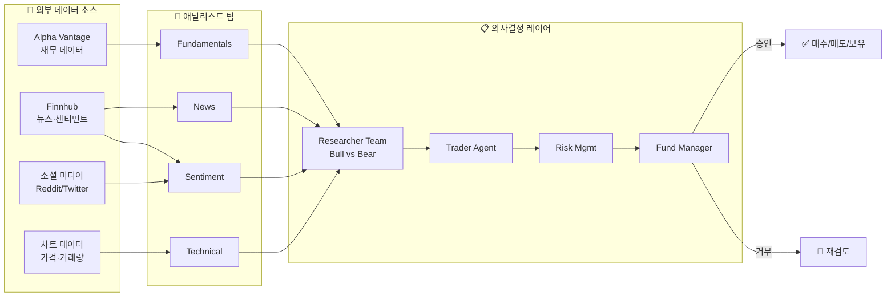
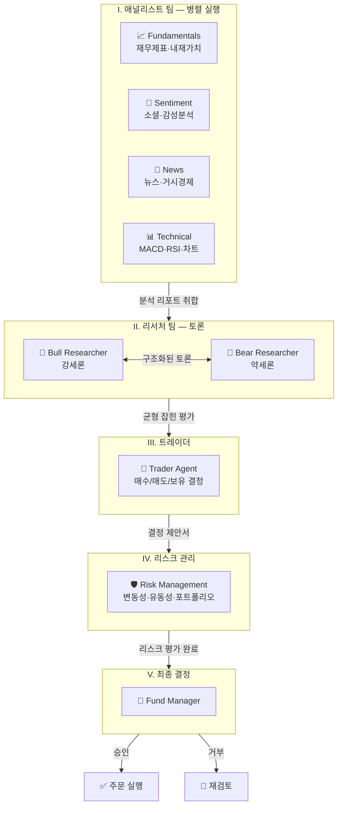
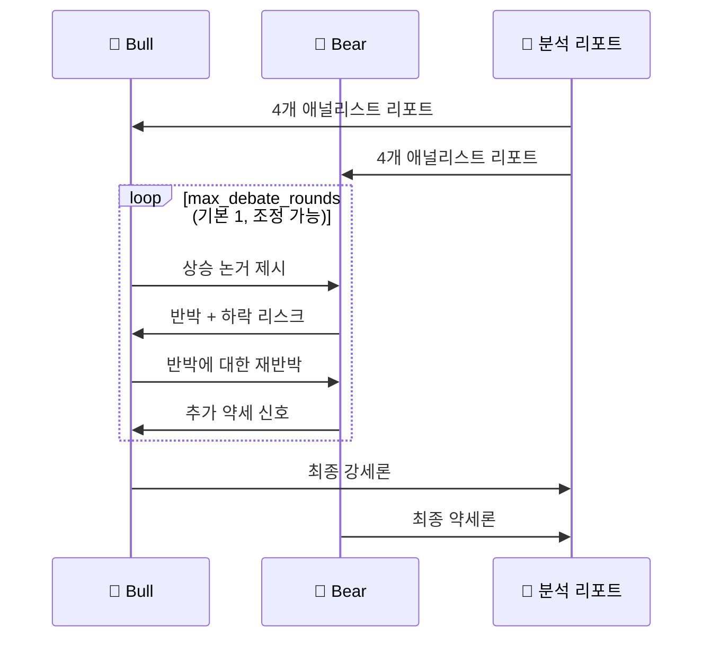
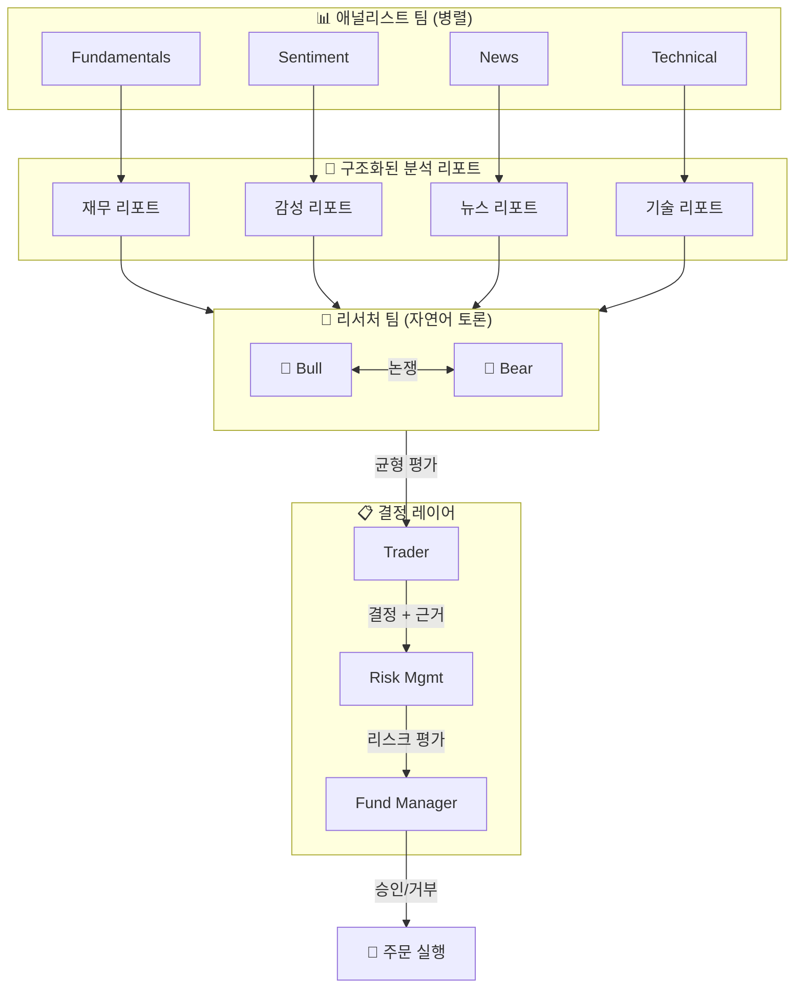

# TradingAgents 기술 가이드

> **공식 GitHub:** https://github.com/TauricResearch/TradingAgents
> **논문:** arXiv 2412.20138

---

## 1. 개요

### 1-1. 정의

**TradingAgents**는 실제 트레이딩 펌의 구조를 모방한 **멀티 에이전트 LLM 금융 트레이딩 프레임워크**다. 애널리스트, 리서처, 트레이더, 리스크 매니저 에이전트들이 협력하여 시장을 분석하고 트레이딩 결정을 내린다.

| 항목 | 값 |
|------|------|
| GitHub Stars | 48K+ |
| 라이선스 | Apache 2.0 |
| 기반 프레임워크 | LangGraph |
| 지원 언어 | Python 3.13+ |
| 전문 에이전트 역할 | 7 |
| 지원 LLM 제공자 | 6+ |

> ⚠ **연구 목적 전용**: TradingAgents는 연구 목적으로 설계된 프레임워크다. 선택된 LLM 모델, 모델 온도, 거래 기간, 데이터 품질 등 다양한 요인에 의해 트레이딩 성능이 달라질 수 있다. **금융·투자·트레이딩 자문을 의도하지 않는다.**

### 1-2. 핵심 아이디어 — 왜 멀티 에이전트인가

단일 LLM 시스템은 펀더멘털, 센티먼트, 기술적 분석, 리스크를 동시에 잘 처리하기 어렵다. TradingAgents는 **역할을 분리**하여 각 에이전트가 자신의 전문 영역에 집중하도록 설계했다.

특히 **Bull/Bear 리서처 간의 구조화된 토론**이 핵심 차별점이다. 단순한 데이터 수집을 넘어 반대 의견을 체계적으로 검토하는 과정이 더 균형 잡힌 결정을 만든다.

### 1-3. 업데이트 이력 (참고)

| 날짜 | 버전 | 주요 변경 |
|------|------|---------|
| 2026-03 | v0.2.3 | 다국어 지원, GPT-5.4 패밀리, 통합 모델 카탈로그, 백테스팅 정확도 |
| 2026-03 | v0.2.2 | GPT-5.4/Gemini 3.1/Claude 4.6, 5단계 평가, OpenAI Responses API |
| 2026-02 | v0.2.0 | 멀티 프로바이더 LLM 지원, 시스템 아키텍처 개선 |
| 2026-01 | - | Trading-R1 기술 보고서 공개 (arXiv:2509.11420) |
| 2024-12 | - | 최초 공개 (arXiv 2412.20138) |

---

## 2. 전체 아키텍처

### 2-1. 데이터 흐름



### 2-2. 5단계 트레이딩 결정 파이프라인



---

## 3. 애널리스트 팀 — 4명 병렬 실행

4명의 애널리스트가 **동시에** 시장 정보를 수집한다. 각자 전문 도구와 제약이 있다.

### 3-1. Fundamentals Analyst (펀더멘털 애널리스트)

기업 재무제표와 성과 지표를 평가. 내재 가치와 잠재적 리스크 신호를 파악. 수익성, 부채 비율, 현금흐름 중심 분석.

| 데이터 | 도구 |
|--------|------|
| 재무제표 (손익계산서/재무상태표/현금흐름) | Alpha Vantage |
| 주가수익비율 (PER/PBR/ROE) | Alpha Vantage |

### 3-2. Sentiment Analyst (센티먼트 애널리스트)

소셜 미디어와 대중 정서를 감성 점수 알고리즘으로 분석. 단기 시장 분위기 측정. Reddit, Twitter 데이터 활용.

### 3-3. News Analyst (뉴스 애널리스트)

글로벌 뉴스와 거시경제 지표 모니터링. 이벤트가 시장 상황에 미치는 영향을 해석. 실시간 뉴스 피드 분석.

### 3-4. Technical Analyst (기술적 애널리스트)

기술 지표(MACD, RSI 등)로 트레이딩 패턴 감지 및 가격 움직임 예측. 차트 패턴, 지지/저항선 분석.

| 분석 도구 |
|----------|
| MACD, RSI, 볼린저밴드, 이동평균 |

---

## 4. 리서처 팀 — Bull vs Bear 토론

### 4-1. Bull Researcher (강세론)

애널리스트 팀의 인사이트를 바탕으로 **상승 가능성을 평가**. 매수 포지션을 지지하는 논거를 구성하고 방어.

### 4-2. Bear Researcher (약세론)

동일한 데이터에서 **하락 리스크를 발굴**. Bull 리서처의 논리를 비판적으로 검토하고 반박 논거 제시.

### 4-3. 구조화된 토론 프로토콜

두 리서처는 단순히 정보를 수집하는 게 아니라 **서로 논쟁**한다. 이 토론 과정이 과도한 낙관론이나 비관론을 걸러내고 균형 잡힌 시장 평가를 만든다.



토론 라운드 수는 `max_debate_rounds`로 조정 가능하다. 라운드가 많을수록 더 깊은 분석이 가능하지만 LLM 호출 비용이 늘어난다.

---

## 5. 트레이더 에이전트

### 5-1. 역할

애널리스트 리포트와 리서처 토론 결과를 종합. 거래 타이밍과 규모를 결정하고 구체적인 매매 신호를 생성. 과거 데이터와 현재 인사이트를 통합하여 **매수/매도/보유**를 결정.

### 5-2. 리포트 기반 의사결정

트레이더는 자유로운 자연어 대화보다 **구조화된 애널리스트 리포트**를 우선 참조한다. 이렇게 하면 핵심 정보가 유실되지 않고 장시간 상호작용에서도 컨텍스트가 유지된다.

---

## 6. 리스크 관리팀 & 펀드 매니저

### 6-1. Risk Management Team

시장 변동성, 유동성, 기타 리스크 요소를 평가하여 포트폴리오 리스크를 지속적으로 모니터링. 트레이딩 전략 조정 후 평가 리포트를 펀드 매니저에게 제출.

| 평가 항목 |
|----------|
| 변동성 분석, VaR (Value at Risk), 최대 낙폭 (MDD) |

### 6-2. Fund Manager (Portfolio Manager)

리스크 팀의 리포트를 기반으로 거래 제안을 **최종 승인 또는 거부**. 승인 시 시뮬레이션 거래소에 주문 전달 및 실행.

---

## 7. 에이전트 통신 프로토콜

### 7-1. 통신 방식 매트릭스

| 상황 | 통신 방식 | 이유 |
|------|---------|------|
| 애널리스트 → 트레이더 | 구조화된 분석 리포트 | 정보 손실 없이 핵심 데이터 전달 |
| 트레이더 → 리스크팀 | 결정 신호 + 상세 근거 | 판단 근거의 투명성 |
| Bull ↔ Bear 리서처 | 자연어 토론 (논쟁) | 깊은 추론, 균형 잡힌 시각 |
| 리스크팀 내부 | 자연어 토론 | 복합 리스크 종합 판단 |
| 글로벌 상태 쿼리 | 직접 참조 | 모든 에이전트가 글로벌 상태 직접 접근 |

### 7-2. 통신 흐름



### 7-3. 설계 원칙

이전 멀티 에이전트 프레임워크들이 비구조화 자유 대화에 의존했던 것과 달리, **TradingAgents는 구조화된 리포트를 기본 통신 수단으로 사용**한다. 자연어 대화는 토론이 필요한 특정 인터랙션(리서처, 리스크팀)에만 제한적으로 활용한다.

---

## 8. 설치 및 시작

### 8-1. 로컬 설치 (권장)

```bash
# 1. 저장소 클론
git clone https://github.com/TauricResearch/TradingAgents.git
cd TradingAgents

# 2. 가상환경 생성 (Python 3.13 필요)
conda create -n tradingagents python=3.13
conda activate tradingagents

# 3. 패키지 설치
pip install .
```

### 8-2. Docker 실행

```bash
# .env 파일에 API 키 입력
cp .env.example .env

# 기본 실행
docker compose run --rm tradingagents

# Ollama (로컬 모델) 사용 시
docker compose --profile ollama run --rm tradingagents-ollama
```

### 8-3. API 키 설정

```bash
# LLM 제공자 (하나 이상 설정)
export OPENAI_API_KEY=...          # OpenAI (GPT-5.x)
export GOOGLE_API_KEY=...          # Google (Gemini 3.x)
export ANTHROPIC_API_KEY=...       # Anthropic (Claude 4.x)
export XAI_API_KEY=...             # xAI (Grok 4.x)
export OPENROUTER_API_KEY=...      # OpenRouter

# 금융 데이터 제공자
export ALPHA_VANTAGE_API_KEY=...   # Alpha Vantage (무료 티어 가능)
```

| 제공자 | 환경변수 | 지원 모델 (v0.2.3) | 비용 팁 |
|-------|---------|------------------|--------|
| **OpenAI** | `OPENAI_API_KEY` | GPT-5.4, GPT-5.4-mini | 테스트는 mini 권장 |
| **Anthropic** | `ANTHROPIC_API_KEY` | Claude 4.6, Haiku | Haiku로 비용 절감 |
| **Google** | `GOOGLE_API_KEY` | Gemini 3.1, Flash | Flash로 빠른 실행 |
| **xAI** | `XAI_API_KEY` | Grok 4.x | - |
| **Ollama** | (불필요) | 로컬 모델 | API 비용 없음 |

---

## 9. 사용법

### 9-1. CLI 사용

```bash
# 설치된 커맨드
tradingagents

# 또는 소스에서 직접
python -m cli.main
```

CLI 인터랙티브 화면에서 선택 가능:
- **Tickers** — 분석할 종목 코드 (예: NVDA, AAPL, TSLA)
- **Analysis Date** — 분석 기준 날짜 (백테스팅용)
- **LLM Provider** — OpenAI, Google, Anthropic, xAI, OpenRouter, Ollama
- **Research Depth** — 분석 깊이 (깊을수록 LLM 호출 증가)

### 9-2. Python 패키지 — 기본 사용

```python
from tradingagents.graph.trading_graph import TradingAgentsGraph
from tradingagents.default_config import DEFAULT_CONFIG

# 기본 설정으로 초기화
ta = TradingAgentsGraph(debug=True, config=DEFAULT_CONFIG.copy())

# 종목 + 날짜로 분석 실행 (forward propagate)
_, decision = ta.propagate("NVDA", "2026-01-15")
print(decision)
```

### 9-3. Python 패키지 — 커스텀 설정

```python
from tradingagents.graph.trading_graph import TradingAgentsGraph
from tradingagents.default_config import DEFAULT_CONFIG

config = DEFAULT_CONFIG.copy()

# LLM 설정
config["llm_provider"]    = "anthropic"           # openai | google | anthropic | xai | openrouter | ollama
config["deep_think_llm"]  = "claude-sonnet-4-6"   # 복잡한 추론용 (고비용)
config["quick_think_llm"] = "claude-haiku-4-5"    # 빠른 작업용 (저비용)

# 에이전트 동작 설정
config["max_debate_rounds"] = 2     # Bull/Bear 토론 라운드 수
config["online_tools"]      = True  # 실시간 데이터 수집 여부

ta = TradingAgentsGraph(debug=True, config=config)
_, decision = ta.propagate("AAPL", "2026-01-15")
print(decision)
```

### 9-4. 주요 설정 옵션

| 설정 키 | 기본값 | 설명 |
|--------|-------|------|
| `llm_provider` | `"openai"` | LLM 제공자 |
| `deep_think_llm` | `"gpt-5.4"` | 복잡한 추론 (리서처/리스크팀) |
| `quick_think_llm` | `"gpt-5.4-mini"` | 빠른 작업 (애널리스트) |
| `max_debate_rounds` | `1` | Bull/Bear 토론 라운드 |
| `online_tools` | `True` | 실시간 데이터 수집 |
| `backend_url` | 로컬 | Ollama 등 로컬 모델 서버 URL |

---

## 10. BIP 프로젝트 시사점

### 10-1. BIP-Agents에 적용 가능한 패턴

| TradingAgents 패턴 | BIP-Agents 적용 |
|-------------------|----------------|
| **4 애널리스트 병렬** | 종목 분석 시 펀더멘털/기술/수급/뉴스 동시 분석 |
| **Bull/Bear 토론** | Stock Screener의 매수/매도 의견 토론 구조 |
| **구조화된 리포트 통신** | Curated View → 에이전트 간 표준 리포트 |
| **Trader → Risk → Fund Manager 검증 체인** | 종목 추천 → 리스크 점검 → 최종 승인 |
| **deep/quick LLM 분리** | 비용 최적화 (BIP에서 이미 사용 중) |

### 10-2. 차이점

| 영역 | TradingAgents | BIP |
|------|--------------|-----|
| 시장 | 미국 주식 중심 (Alpha Vantage) | 한국 주식 (KOSPI/KOSDAQ) + 미국 |
| 데이터 | 외부 API 직접 호출 | DB(PostgreSQL) + DART/네이버 |
| 실행 | 시뮬레이션 거래소 | 추천만 (실거래 없음) |
| 데이터 정합성 | 실시간 호출 | Gold Table 기반 (정합성 보장) |

### 10-3. BIP에서 가져갈 수 있는 것

1. **에이전트 역할 분리**: 단일 거대 에이전트보다 전문 영역별 분리
2. **Bull/Bear 토론**: 종목 추천 시 반대 의견 강제 검토 단계 추가
3. **구조화 + 자연어 혼합 통신**: 리포트는 구조화, 토론만 자연어
4. **deep/quick 모델 분리**: 추론 깊이에 따라 모델 분리

---

## 11. 참고

| 항목 | URL |
|------|-----|
| 공식 GitHub | https://github.com/TauricResearch/TradingAgents |
| 논문 (TradingAgents) | arXiv:2412.20138 |
| 논문 (Trading-R1) | arXiv:2509.11420 |

### 내부 관련 문서
- `docs/bip_agents_architecture.md` — BIP 에이전트 아키텍처
- `docs/stock_screener_architecture.md` — Bull/Bear 토론 구조 적용 사례
- `docs/checklist_agent_architecture.md` — LangGraph 에이전트 패턴
- `docs/langgraph_technical_guide.md` — LangGraph 기술 가이드

---

## 변경 이력

| 날짜 | 내용 |
|------|------|
| 2026-04-13 | 초안 작성 |
| 2026-04-27 | 코드/Mermaid 블록 복원 (HTML→md 역변환 잔해 정리), 표준 포맷 재작성 |
