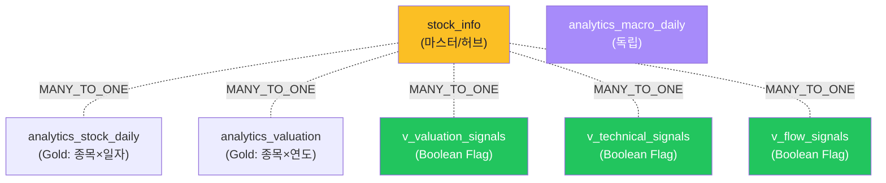
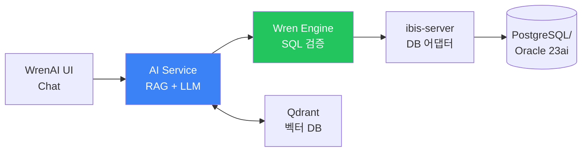
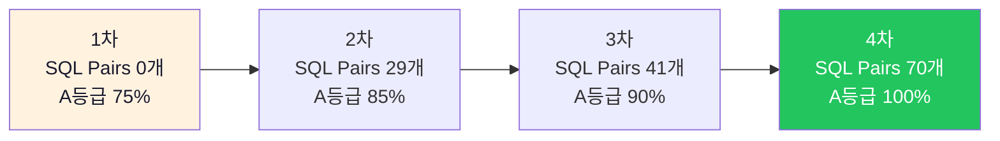
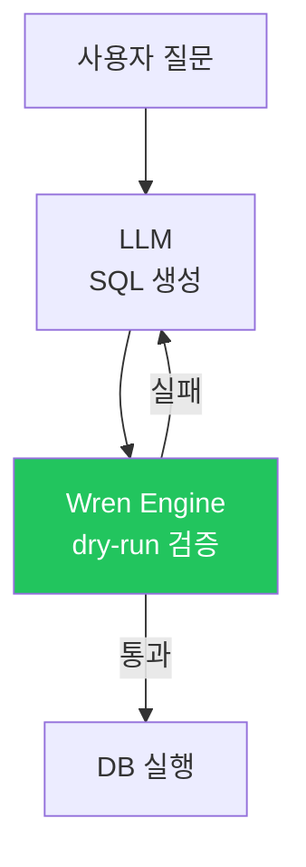
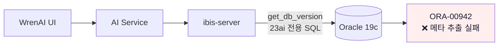
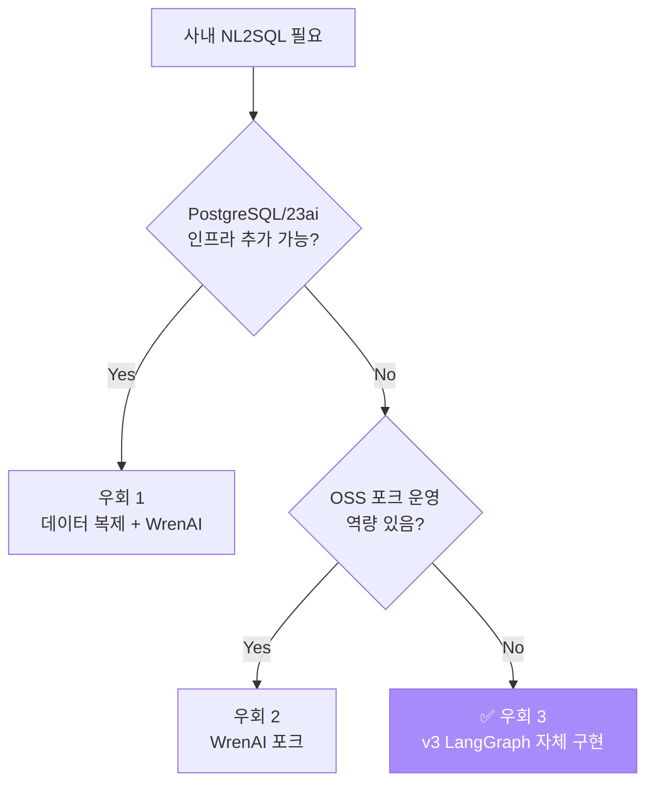
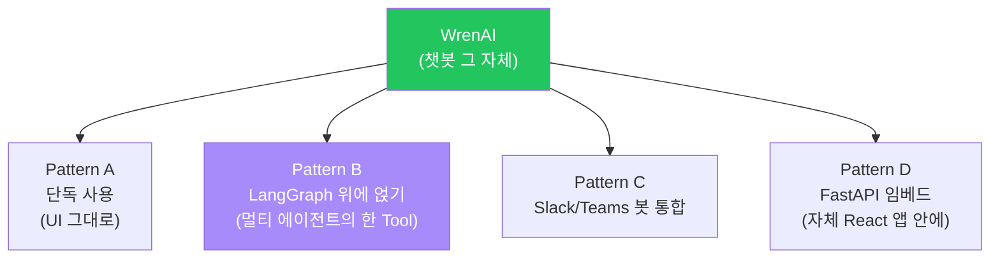
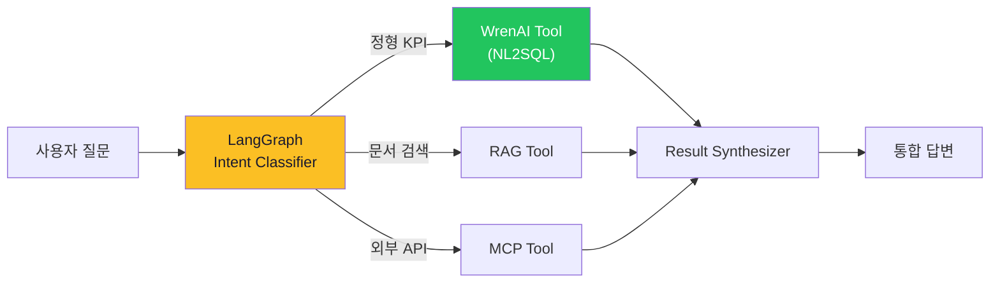
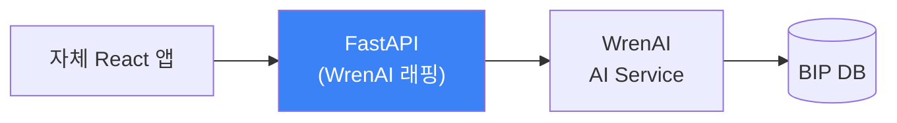

# WrenAI 데모 결과 — 학습조직 세미나 자료

> **목적:** BIP-Pipeline 실제 데이터(PostgreSQL)에 WrenAI를 적용한 데모 결과 정리. 세미나에서 WrenAI의 핵심 강점(All-in-One NL2SQL/SQL Pairs 학습/검증/UI 내장)을 시연하고, **Oracle 19c 미지원 한계**가 v3 LangGraph로 방향 전환된 근거임을 보여주기 위한 자료.
>
> **환경:** WrenAI v0.18.x / Docker Compose (5 컨테이너) / bip-postgres `stockdb`
> **데이터:** BIP의 Gold 3종 + Curated View 4종 = **7개 모델**로 시맨틱 레이어 구성
> **테스트 기간:** 2026-03~04 (5차에 걸친 개선 사이클, 상세는 [wrenai_test_report.md](wrenai_test_report.md))

---

## 1. 구축 결과 요약

```
✅ 5 시맨틱 모델 등록 + Relationship 자동 추론
✅ SQL Pairs 70개 등록 (29 → 70개로 점진 확장)
✅ Instructions 4개 (도메인 규칙)
✅ 컬럼 description 99% 커버리지 (115개 컬럼)
🏆 최종 A등급 정확도: 100% (4차 테스트)
🏆 Boolean flag 사용률: 0% → 87% (Curated View 등록 후)
🛠  Chat UI 내장 (별도 프론트 불필요)
```

**적재된 시맨틱 모델 (BIP Gold + Curated):**

| 모델 | 원본 | 역할 | BIP 검증 |
|------|------|------|:----:|
| `stock_info` | `stock_info` | 마스터 (허브) | ✅ |
| `analytics_stock_daily` | `analytics_stock_daily` | Gold — 일봉 와이드 | ✅ |
| `analytics_valuation` | `analytics_valuation` | Gold — 연간 밸류에이션 | ✅ |
| `analytics_macro_daily` | `analytics_macro_daily` | Gold — 매크로 일자별 | ✅ |
| `v_valuation_signals__v1` | Curated View | Boolean Flag — 밸류에이션 | ✅ |
| `v_technical_signals__v1` | Curated View | Boolean Flag — 기술적 | ✅ |
| `v_flow_signals__v1` | Curated View | Boolean Flag — 수급 | ✅ |

---

## 2. 시맨틱 모델 구조 (MDL + Relationship)



> **구조 특성:** Cube와 동일하게 `stock_info` 단일 허브 구조. **WrenAI는 1질문=1SQL이므로 팩트-팩트 결합을 LLM이 단일 SQL로 작성**하여 Cube 같은 JOIN 경로 제약 없음.

---

## 3. 세미나에서 보여줄 5가지 WrenAI 강점

### 강점 1 — All-in-One 통합 (설치 30분이면 챗봇 동작)

**구조:** 데이터 연결 / MDL 정의 / RAG / LLM 호출 / SQL 검증 / Chat UI가 **단일 Docker Compose 패키지**.



**dbt+Cube+자체 Agent 조합과 비교:**

| 항목 | dbt+Cube+Agent 조합 | WrenAI 단독 |
|------|:-:|:-:|
| 컨테이너 수 | 3~5개 | **5개 한 패키지** |
| 구축 시간 | 1-2주 | **30분** |
| 학습 곡선 | 3개 도구 학습 | **MDL + UI만** |
| 챗봇 UI | 별도 개발 필요 | **내장** |

> **메시지:** "PoC 단계에서 가장 빠른 도구. **챗봇 UI를 따로 만들 부담 없음.**"

---

### 강점 2 — SQL Pairs 학습 시스템 (정확도가 시간이 갈수록 오름)

**핵심 패턴:** 질문-SQL 쌍을 UI에서 등록하면 RAG가 자동으로 Few-shot으로 활용.

**BIP 실측 결과:**



**SQL Pair 예시:**
```
Q: "월별 매출 보여줘"
A: SELECT DATE_TRUNC('month', created_at) AS month,
          SUM(amount) AS revenue
   FROM orders
   WHERE status='paid'
   GROUP BY 1 ORDER BY 1
```

> **메시지:** "**가장 ROI 높은 튜닝 수단.** 운영하면서 실패 케이스를 Pair로 등록 → 다음번부터 자동으로 맞음. BIP에서 70개 등록으로 A등급 100% 달성."

---

### 강점 3 — Wren Engine SQL 검증 (환각 SQL 차단)

**구조:** LLM이 생성한 SQL을 **Wren Engine이 dry-run으로 검증** → 실패 시 자동 재생성 (최대 3회).



**검증 항목:**
- 스키마 일치 (테이블·컬럼 존재 여부)
- 문법 정확성 (PostgreSQL/Oracle 방언)
- Relationship 일관성 (JOIN 키 유효성)
- Materialization 가능성 (예: View가 deploy됐는지)

> **메시지:** "**환각 SQL이 사용자에게 도달하지 않음.** 자체 구현 시 Validator를 만들어야 하는데, WrenAI는 이게 내장."

---

### 강점 4 — Instructions로 도메인 규칙 강제

**문제:** LLM이 "셀트리온" 같은 종목명을 자동으로 영문 번역하거나, ETF를 일반 종목과 혼동.

**해결:** Instructions에 전역 규칙 등록 → 모든 SQL 생성에 강제 적용.

**BIP에서 등록한 4개 Instructions:**

| 규칙 | 효과 |
|------|------|
| 종목명 한글 필수 + ETF 제외 | "셀트리온" → `WHERE stock_name = '셀트리온'` (영문 X, ETF 매칭 X) |
| 계산식 힌트 (거래대금 = close × volume) | 컬럼에 없는 파생 지표를 LLM이 SQL로 계산 |
| data_type 설명 (actual/estimate/preliminary) | "확정 실적"이면 자동으로 `data_type='actual'` 필터 |
| 검색 결과에 stock_name 포함 | 티커만 반환 안 함 (사용자가 어떤 종목인지 인지 가능) |

> **메시지:** "**프롬프트 엔지니어링을 UI에서 관리.** 코드 배포 없이 즉시 반영."

---

### 강점 5 — Chat UI + Thread/Asking Task 내장

**구조:** WrenAI UI에 사용자 인터페이스 모두 내장 — 별도 프론트 개발 불필요.

**제공 기능:**
- **Thread:** 대화 세션 관리 (이전 질문 컨텍스트 유지)
- **Asking Task:** 한 번에 여러 후보 SQL 생성 → 사용자가 고름
- **Breakdown:** 복잡한 질문을 sub-step으로 분해
- **Recommendation:** "이런 질문도 해보세요" 자동 제안

> **메시지:** "**자체 React 챗봇 UI 만들 필요 없음.** WrenAI UI 그대로 사용 또는 임베드. dbt/Cube에는 없는 부분."

---

## 4. WrenAI vs 다른 도구 비교

| 항목 | 수동 SQL | dbt | Cube | **WrenAI** |
|------|:-:|:-:|:-:|:-:|
| 변환 자동화 | ❌ | **✅** | △ | ❌ |
| 메트릭 표준화 | ❌ | ✅ | **✅** | ✅ (MDL) |
| 실시간 API | ❌ | ❌ | **✅ 3종** | △ REST만 |
| **자연어 → SQL** | ❌ | ❌ | △ (별도) | **✅ 내장** |
| Chat UI | ❌ | ❌ | △ Playground | **✅ 내장** |
| 캐싱 | 별도 | ❌ | ✅ Pre-agg | 부분 |
| 환각 검증 | 없음 | ❌ | ❌ | **✅ Wren Engine** |
| 운영 학습 | — | dbt test | 정적 | **SQL Pairs 학습** |
| **Oracle 19c** | ✅ | ⭕ vendor | ⭕ community | **❌ 23ai만** |

---

## 5. 세미나 시연 명령어

```bash
# 1. WrenAI 컨테이너 기동 (5개 컨테이너)
docker compose -f docker-compose.wrenai.yml up -d

# 2. UI 접속
open http://localhost:3000
#    → 데이터소스 연결 (bip-postgres)
#    → 모델 등록 (7개)
#    → Chat 탭에서 질문

# 3. 시연 질문 예시 (BIP에서 100% 통과 확인)
#    - "삼성전자 PER 알려줘"
#    - "코스피 시총 상위 5종목"
#    - "저평가주 찾아줘"           ← Boolean Flag 활용
#    - "외국인 순매수 상위 종목"   ← 수급 데이터
#    - "ROE 20% 이상이면서 PER 10 이하"  ← 복합 조건

# 4. SQL Pairs 추가 시연 (UI에서)
#    - 실패한 질문 → 정답 SQL 작성 → SQL Pair 등록
#    - Deploy 클릭 → 같은 질문 재실행 → 정확도 향상 확인
```

---

## 6. 사내 Oracle 19c 적용 가이드 — **실질적으로 불가능 + 우회 경로**

### 6-1. 실패 원인

WrenAI는 **Oracle 23ai 이상만 공식 지원** — 19c에서는 동작 불가.

**발생하는 에러:**
```
IBIS_SERVER_ERROR
ORA-00942: table or view does not exist
```

**원인 분석:**
- DB 연결 자체는 성공 (`oracle.cx_Oracle` 드라이버 동작)
- WrenAI 내부의 **ibis-server** 가 `get_db_version`, `metadata_query` 등 23ai 전용 시스템 뷰 호출
- 19c에서는 해당 시스템 뷰가 다른 이름/구조 → 메타데이터 추출 실패 → 모든 후속 동작 불가



### 6-2. 우회 경로 3가지

#### 우회 1: PostgreSQL/Oracle 23ai로 데이터 복제

**구조:**
```
Oracle 19c → CDC (GoldenGate/Debezium) → PostgreSQL → WrenAI
또는
Oracle 19c → 정기 Export → Oracle 23ai → WrenAI
```

**장점:** WrenAI 그대로 사용 가능 (BIP 검증 자산 활용)
**단점:** 데이터 복제 인프라 부담, 실시간성 손실, Oracle 23ai 라이선스 추가

**적합:** 분석용 데이터마트가 명확히 분리되어 있고 일일 배치 정도면 충분한 경우

---

#### 우회 2: WrenAI 포크 + ibis-server 수정

**구조:** WrenAI 소스를 포크하고 ibis-server의 Oracle 어댑터 코드를 19c 호환으로 수정.

**장점:** 인프라 추가 없음
**단점:**
- ibis-server 코드 변경 부담 (Python + Rust 일부)
- WrenAI 신규 릴리스마다 머지 필요
- **유지보수 비용 매우 큼**

**적합:** 사내 OSS 컨트리뷰션 역량이 풍부한 조직 (현실적으로 드뭄)

---

#### 우회 3: 포기하고 v3 (LangGraph + QuerySpec)

**구조:** WrenAI 패턴(MDL + SQL Pairs + 검증)을 **자체 코드로 재구현**.

**장점:**
- Oracle 19c 즉시 동작
- 사내 LLM 자유 선택
- 도구 락인 없음

**단점:**
- 자체 구현 부담 (Schema Registry / Converter / Validator)

**적합:** 사내 표준이 Oracle 19c이고 변경 어려운 환경 → **현재 BIP의 v3 방향**

> 📚 **상세 설계:** `docs/nl2sql_implementation_plan_v3.md` §6

### 6-3. 우회 경로 결정 트리



**BIP의 결정:** 우회 3 (v3 LangGraph + QuerySpec). 우회 1은 인프라 부담, 우회 2는 유지보수 비용 과다.

---

## 7. WrenAI를 어디에 통합/확장하나 — 역방향 패턴

**핵심 차이점:** dbt/Cube는 "챗봇이 필요하면 어떻게?"가 질문이지만, **WrenAI는 그 자체가 챗봇**. 그래서 질문이 반대 — "WrenAI를 어디에 통합/확장하나".



### Pattern A — 단독 사용 (가장 단순)

**구조:** WrenAI UI를 그대로 노출. 사내 사용자가 직접 접속해서 질문.

**장점:** 추가 개발 불필요. 30분 PoC.
**단점:** 멀티스텝 질문 처리 한계 (1질문=1SQL). 비정형 데이터(뉴스/문서) 못 다룸.
**적합:** 정형 데이터 조회만 필요한 환경, 빠른 PoC

---

### Pattern B — LangGraph Agent의 Tool로 통합

**구조:** WrenAI를 LangGraph 서비스 레이어의 **한 도구**로 노출.



**장점:**
- WrenAI 정확도(100%)는 그대로 활용
- 멀티스텝/RAG/MCP 통합 가능 (WrenAI 단독 한계 우회)
- 사용자가 자연어로 정형+비정형 동시 질문

**구현:** WrenAI REST API를 LangGraph Tool로 등록.
```python
def wrenai_query_tool(question: str) -> dict:
    response = requests.post(
        "http://wrenai-ai-service:5555/v1/ask",
        json={"question": question, "thread_id": session_id}
    )
    return response.json()
```

**적합:** **WrenAI가 호환되는 환경에서 멀티 에이전트 확장하고 싶은 경우.** dbt + Cube + WrenAI + LangGraph 조합도 가능.

> 💡 **세미나 메시지:** "WrenAI도 결국 멀티 에이전트의 한 도구로 흡수된다. LangGraph가 위에서 라우팅."

---

### Pattern C — Slack/Teams 봇 통합

**구조:** 사용자가 Slack 메시지로 질문 → WrenAI API 호출 → 답변을 Slack에 회신.

**구현:**
- Slack Bolt SDK 또는 Teams Bot Framework
- 멘션 이벤트 → WrenAI `/v1/ask` 호출 → 결과 메시지로 회신
- Thread 관리로 대화 컨텍스트 유지

**장점:**
- 사내 협업 도구 안에서 자연스럽게 사용
- 별도 UI 학습 불필요
- 결과 공유가 쉬움 (Slack 메시지 그대로 포워딩)

**단점:**
- Slack/Teams 봇 인증·인프라 별도 관리
- Slack 메시지 길이 제한 (긴 표는 부적합)

**적합:** 사내 표준 메신저가 Slack/Teams이고, 대시보드보다 질문-답변 위주인 조직

---

### Pattern D — FastAPI 임베드 (자체 앱 안에)

**구조:** 자체 React/Vue 앱에서 WrenAI API를 백엔드로 사용.



**장점:**
- 사내 디자인 시스템에 맞춘 UI 가능
- 권한 관리·감사 로그 자체 통제
- 다른 사내 도구(Jira/Confluence)와 통합 자유

**단점:**
- WrenAI UI의 풍부한 기능(Thread/Breakdown/Recommendation)을 재구현해야 함
- 개발 부담

**적합:** 사내 통합 포털이 있고, NL2SQL을 그중 한 기능으로 임베드하고 싶은 조직

---

### 패턴 비교표

| 패턴 | 추가 도구 | 멀티스텝 가능 | 사내 통합도 | 개발 부담 |
|------|---------|:-:|:-:|:-:|
| **A. 단독 사용** | — | ❌ | 낮음 | 매우 낮음 |
| **B. LangGraph Tool** | LangGraph | **✅** | 중간 | 중간 |
| **C. Slack/Teams 봇** | Bolt SDK | 부분 | 매우 높음 | 중간 |
| **D. FastAPI 임베드** | FastAPI + 프론트 | 부분 | **매우 높음** | 높음 |

### 권장 경로

1. **PoC 단계:** Pattern A (단독 사용) — 30분 안에 동작 확인
2. **운영 진입:** Pattern C (Slack/Teams 봇) — 사용자가 자연스럽게 접근
3. **고도화:** Pattern B (LangGraph) — 멀티스텝·RAG·MCP 통합 필요해질 때

> 💡 **세미나 메시지:** "**WrenAI는 시작점이고, 운영 성숙도가 올라가면 LangGraph 위에 흡수된다.** dbt/Cube와 달리 단독으로 챗봇이 되지만, 결국 멀티 에이전트 시대로 가면 한 도구가 됨."

---

## 8. 한계 + 다음 단계 / 결론

**WrenAI가 잘하는 것:**
- ✅ **자연어 → SQL 정확도** (BIP 100% A등급 달성)
- ✅ All-in-One 통합 (30분 PoC)
- ✅ SQL Pairs 학습 시스템 (운영하면서 정확도 향상)
- ✅ Wren Engine 검증 (환각 SQL 차단)
- ✅ Chat UI 내장

**WrenAI가 잘 못하는 것:**
- ❌ **Oracle 19c 미지원** (사내 표준 환경 부적합 — §6)
- ❌ 1질문 = 1SQL (멀티스텝/RAG 통합은 LangGraph 필요 — §7 Pattern B)
- ❌ sql_answer 환각 (답변 생성 단계 — 해석 컬럼으로 우회)
- ❌ 프롬프트 커스터마이징 (OSS 소스 수정 부담)

**자연스러운 조합 (BIP 적용 사례):**
```
dbt (변환) → Gold Table → WrenAI (NL2SQL) → LangGraph (멀티 에이전트로 확장)
```

**v3 전환 근거:** Oracle 19c 미지원 + 1질문=1SQL 한계가 사내 핵심 사용 케이스(복합 질문, 멀티스텝)와 맞지 않음 → **자체 구현(LangGraph + QuerySpec)으로 전환**. 단, **WrenAI의 패턴(MDL/SQL Pairs/Validator)은 v3에 그대로 이식.**

→ 세미나의 §6 의사결정 가이드와 일관: **"PostgreSQL/Oracle 23ai면 WrenAI, Oracle 19c면 v3 자체 구현."**

---

## 부록 — 상세 이력

본 문서는 **세미나 데모용 요약**이다. 시간순 5차 테스트 개선 이력, 차원별 채점 결과, 발견된 모든 함정·조치는 별도 문서:

📚 **`docs/wrenai_test_report.md`** — 1차~5차 테스트 (1,200줄)
📚 **`docs/wrenai_technical_guide.md`** — Wren AI 내부 구조
📚 **`docs/guide_wrenai.md`** — 기능 가이드

---

## 변경 이력

| 날짜 | 내용 |
|------|------|
| 2026-03-28 ~ 2026-04-12 | WrenAI 1~5차 테스트 (별도 `wrenai_test_report.md`) |
| 2026-05-18 | 데모 결과 문서로 정리 (dbt/Cube와 동일 포맷). 5가지 강점 + Oracle 19c 우회 경로 3종 + 통합 패턴 4종 (역방향) |
