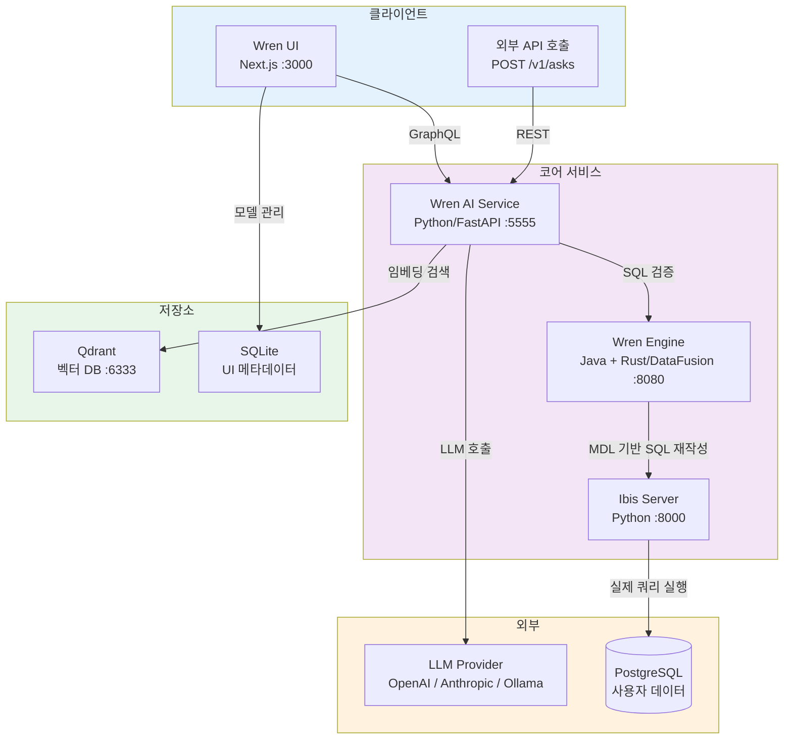
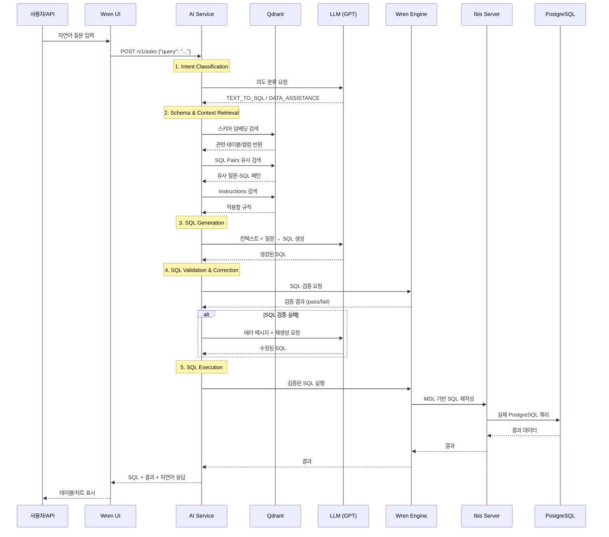
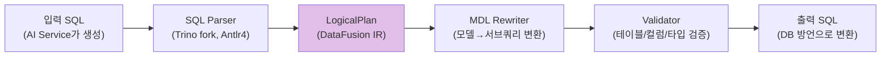
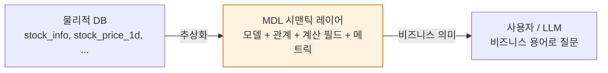
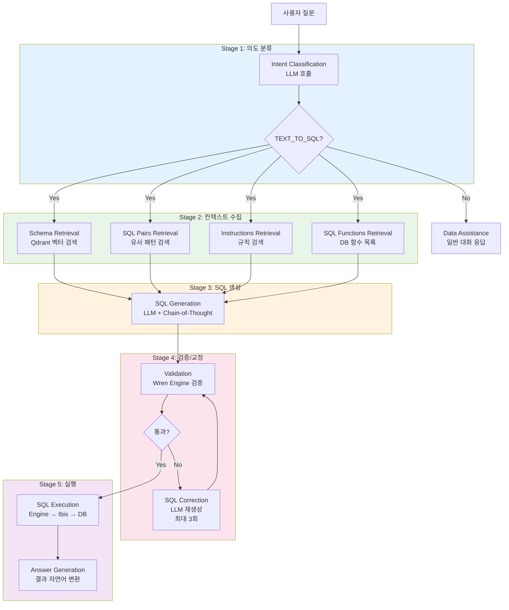
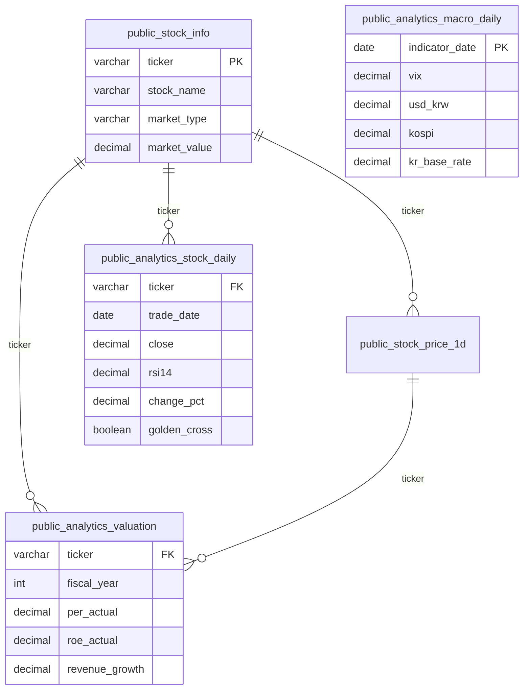
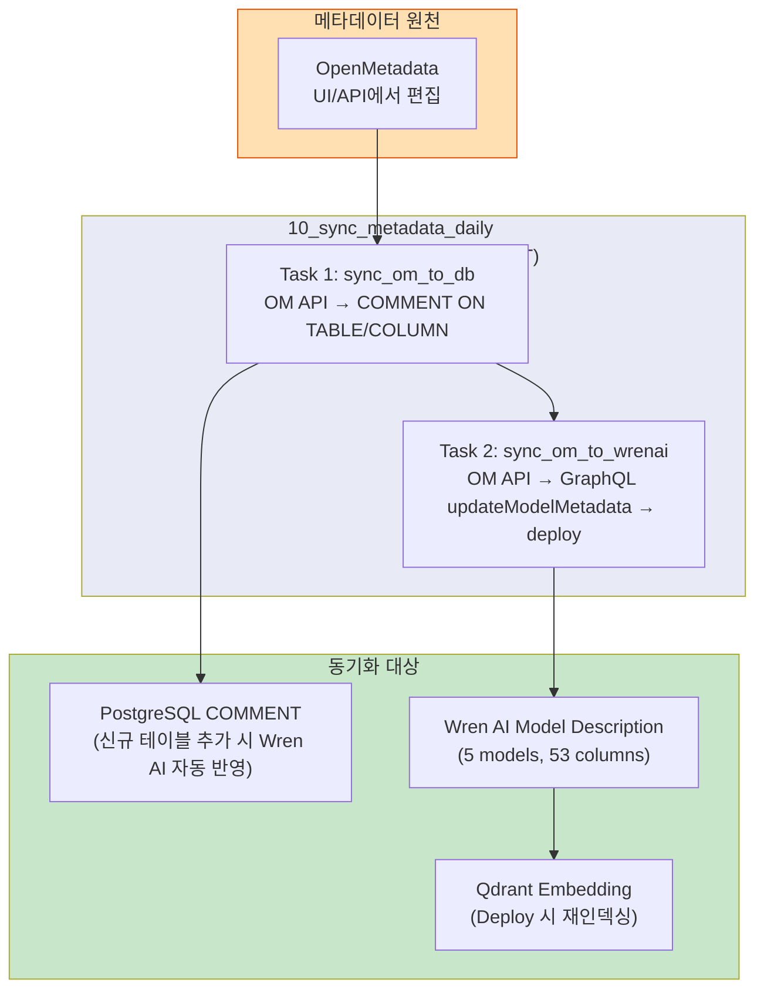
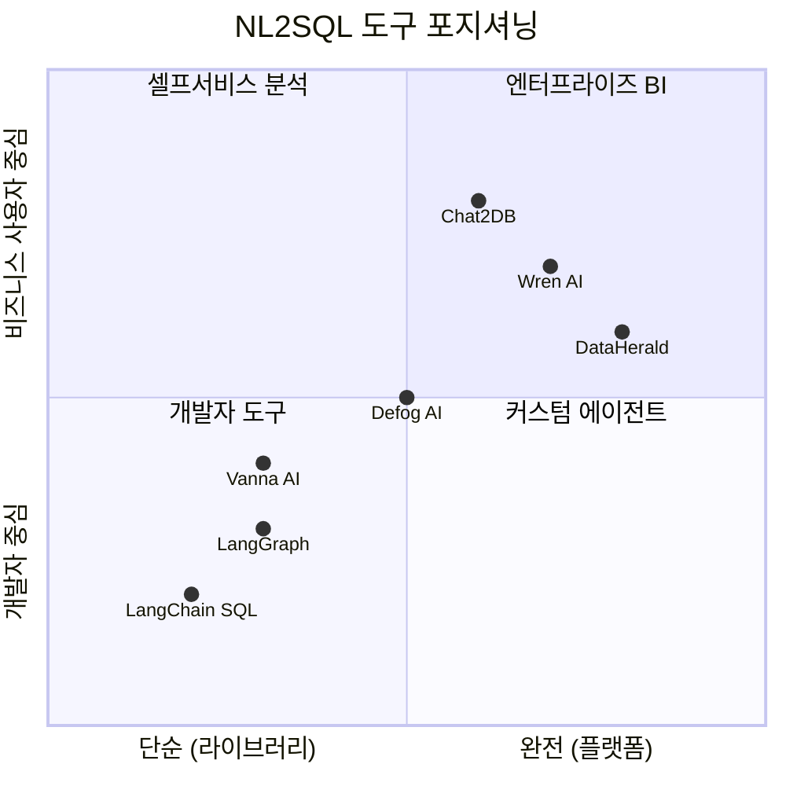
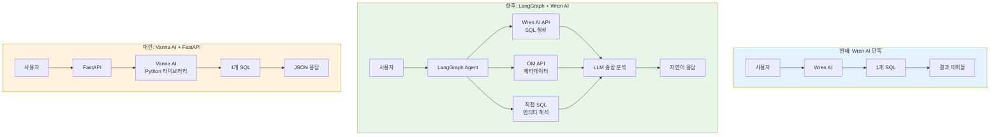
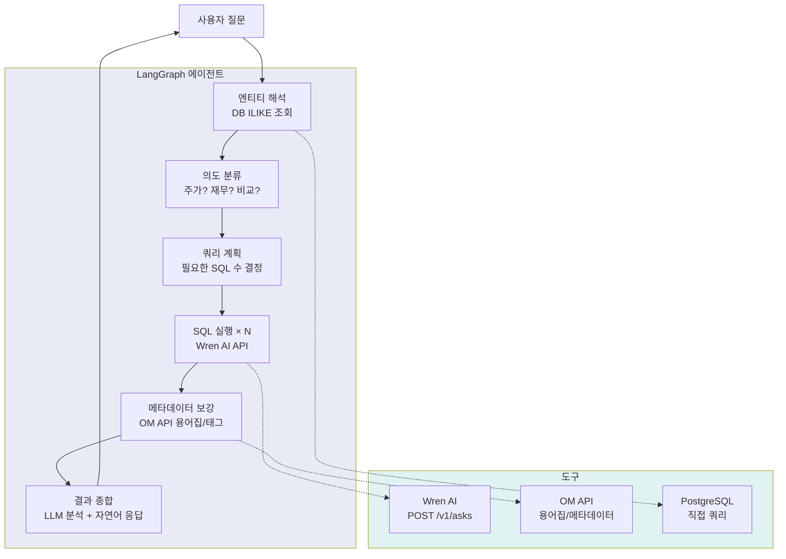

# Wren AI 기술 가이드 — 아키텍처, 동작 원리, BIP-Pipeline 적용

> **작성일:** 2026-04-02
> **기반 프로젝트:** BIP-Pipeline (주식 투자 데이터 파이프라인)
> **Wren AI 버전:** Engine 0.22.0 / AI Service 0.29.0 / UI 0.32.2
> **목적:** Wren AI의 기술적 내부 동작 원리, 설치 과정, BIP-Pipeline 적용 상세, 대안 솔루션 비교

---

## 목차

1. [Wren AI 개요](#1-wren-ai-개요)
2. [시스템 아키텍처](#2-시스템-아키텍처)
3. [구성 요소별 기술 상세](#3-구성-요소별-기술-상세)
4. [MDL (Modeling Definition Language)](#4-mdl-modeling-definition-language)
5. [SQL 생성 파이프라인](#5-sql-생성-파이프라인)
6. [Qdrant RAG 시스템](#6-qdrant-rag-시스템)
7. [LLM 통합 (LiteLLM)](#7-llm-통합-litellm)
8. [설치 및 구성 가이드](#8-설치-및-구성-가이드)
9. [BIP-Pipeline 적용 상세](#9-bip-pipeline-적용-상세)
10. [메타데이터 동기화 (OM ↔ Wren AI)](#10-메타데이터-동기화-om--wren-ai)
11. [운영 이슈 및 해결](#11-운영-이슈-및-해결)
12. [대안 솔루션 비교](#12-대안-솔루션-비교)
13. [향후 발전 방향](#13-향후-발전-방향)

---

## 1. Wren AI 개요

### 1-1. Wren AI란?

Wren AI는 오픈소스 **Text-to-SQL 엔진**으로, 자연어 질문을 SQL 쿼리로 변환하여 실행합니다.
핵심 차별점은 **시맨틱 레이어(MDL)**를 통해 비즈니스 로직을 명시적으로 정의하여 LLM의 hallucination을 줄이는 것입니다.

```
사용자: "PER이 10 이하인 종목 보여줘"
         ↓
Wren AI: MDL에서 PER 정의 확인 → 적절한 테이블/컬럼 선택 → SQL 생성 → 실행
         ↓
결과:    종목명, PER, ROE 등 테이블 반환
```

### 1-2. 핵심 설계 철학

| 원칙 | 설명 |
|------|------|
| **Semantic-First** | LLM에 raw 스키마가 아닌 비즈니스 의미가 부여된 MDL을 제공 |
| **Data Never Leaves** | LLM에 실제 데이터를 보내지 않음. 메타데이터(스키마/설명)만 전달 |
| **Single Source of Truth** | MDL에 비즈니스 로직을 한 곳에 정의 → 일관된 쿼리 생성 |
| **Modular Pipeline** | 의도 분류, 스키마 검색, SQL 생성, 교정을 독립 모듈로 구성 |

### 1-3. 1질문 = 1SQL 제약

Wren AI는 구조적으로 **하나의 질문에 하나의 SQL만 생성**합니다.
복합 질문(여러 테이블 조회 → 결과 종합)은 처리할 수 없으며,
이를 위해서는 LangGraph 같은 에이전트 프레임워크에서 Wren AI API를 도구로 활용하는 구조가 필요합니다.

---

## 2. 시스템 아키텍처

### 2-1. 전체 구조



### 2-2. 요청 처리 흐름



---

## 3. 구성 요소별 기술 상세

### 3-1. Wren Engine (SQL 실행 엔진)

| 항목 | 내용 |
|------|------|
| **언어** | Java (SQL 파서) + Rust (DataFusion 쿼리 엔진) |
| **기반** | Trino SQL 파서 fork + Apache DataFusion |
| **포트** | 8080 (REST), 7432 (SQL wire protocol) |
| **역할** | MDL 기반 SQL 재작성, 검증, 실행 계획 |

**핵심 동작 원리:**



**MDL → SQL 변환 예시:**

```sql
-- 입력 (AI Service가 생성한 SQL)
SELECT stock_name, close FROM public_analytics_stock_daily
WHERE stock_name ILIKE '%하이닉스%'

-- Engine 내부: MDL 모델을 서브쿼리로 확장
SELECT stock_name, close FROM (
    SELECT * FROM public.analytics_stock_daily  -- 실제 테이블로 매핑
) AS public_analytics_stock_daily
WHERE stock_name ILIKE '%하이닉스%'
```

**SQL Rewriter 구현:**
- Antlr4 Visitor 패턴으로 AST 순회
- 모델 참조 → 서브쿼리 치환
- Calculated Field → expression 인라인 삽입
- Relationship → JOIN 조건 자동 생성

**LogicalPlan (DataFusion):**
- Apache DataFusion의 중간 표현(IR)을 사용
- `UserDefinedLogicalNode`로 MDL 전용 노드 추가
- `AnalyzerRule`로 모델별 변환 규칙 적용
- 표준 SQL → DB별 방언(PostgreSQL, BigQuery, Snowflake 등) 변환

### 3-2. Wren AI Service (NL2SQL 엔진)

| 항목 | 내용 |
|------|------|
| **언어** | Python 3.12 |
| **프레임워크** | FastAPI + uvloop |
| **비동기 처리** | Hamilton (DAG 기반 비동기 실행) |
| **컴포넌트** | Haystack (파이프라인 구성) |
| **포트** | 5555 |

**주요 API 엔드포인트:**

| 엔드포인트 | 메서드 | 용도 |
|-----------|--------|------|
| `/v1/asks` | POST | 자연어 질문 제출 |
| `/v1/asks/{id}/result` | GET | 질문 결과 조회 (polling) |
| `/v1/semantics-descriptions` | POST | 테이블/컬럼 설명 자동 생성 |
| `/v1/question-recommendations/{id}` | GET | 추천 질문 조회 |

**파이프라인 구성 (config.yaml):**

```yaml
type: pipeline
pipes:
  # 인덱싱 파이프라인 (Deploy 시 실행)
  - name: db_schema_indexing          # 스키마 임베딩 → Qdrant
  - name: table_description_indexing   # 테이블 설명 임베딩
  - name: sql_pairs_indexing           # SQL Pairs 임베딩
  - name: instructions_indexing        # Instructions 임베딩
  - name: project_meta_indexing        # 프로젝트 메타데이터

  # 검색 파이프라인 (질문 시 실행)
  - name: db_schema_retrieval          # 관련 테이블/컬럼 검색
  - name: historical_question_retrieval # 과거 질문 패턴 검색
  - name: sql_pairs_retrieval          # 유사 SQL Pairs 검색
  - name: instructions_retrieval       # 적용할 Instructions 검색

  # 생성 파이프라인
  - name: intent_classification        # 의도 분류
  - name: sql_generation               # SQL 생성
  - name: sql_generation_reasoning     # SQL 생성 추론 (Chain-of-Thought)
  - name: sql_correction               # SQL 교정 (최대 3회 재시도)
  - name: sql_answer                   # 결과 자연어 변환
  - name: chart_generation             # 차트 생성
```

### 3-3. Wren UI (웹 인터페이스)

| 항목 | 내용 |
|------|------|
| **프레임워크** | Next.js (React) |
| **API** | Apollo GraphQL |
| **데이터 저장** | SQLite (모델, 관계, SQL Pairs, Instructions) |
| **포트** | 3000 |

**GraphQL 주요 API:**

```graphql
# 모델 관리
{ listModels { id displayName description } }
{ model(where: {id: 1}) { fields { displayName type properties } } }
mutation { updateModelMetadata(where: {id: 1}, data: {description: "...", columns: [...]}) }

# SQL Pairs
mutation { createSqlPair(data: {question: "...", sql: "..."}) { id } }
{ sqlPairs { id question sql } }

# Instructions
mutation { createInstruction(data: {instruction: "...", isDefault: false, questions: []}) { id } }

# Deploy (MDL 재생성 + Qdrant 재인덱싱)
mutation { deploy { status } }
```

### 3-4. Ibis Server (데이터 소스 커넥터)

| 항목 | 내용 |
|------|------|
| **기반** | Ibis (Python 데이터 분석 프레임워크) |
| **역할** | 12+ 데이터 소스 통합 커넥터 |
| **포트** | 8000 |

**지원 데이터 소스:**
PostgreSQL, MySQL, BigQuery, Snowflake, DuckDB, ClickHouse, Trino, MSSQL, Oracle, Databricks, SQLite, MariaDB

### 3-5. Qdrant (벡터 DB)

| 항목 | 내용 |
|------|------|
| **버전** | v1.11.0 |
| **임베딩 모델** | text-embedding-3-large (3072 dimensions) |
| **포트** | 6333 (REST), 6334 (gRPC) |
| **역할** | 스키마/SQL Pairs/Instructions 임베딩 저장 및 유사도 검색 |

### 3-6. Bootstrap (초기화 서비스)

```bash
# init.sh 동작:
1. config.properties 생성 (Engine 설정)
2. mdl/ 디렉토리 생성
3. sample.json 생성 (빈 MDL 초기 파일)
```

시작 후 즉시 종료되는 init container 패턴.

---

## 4. MDL (Modeling Definition Language)

### 4-1. MDL이란?

MDL은 Wren AI의 **시맨틱 레이어 정의 언어**입니다.
물리적 DB 스키마와 사용자 사이에 비즈니스 의미를 부여하는 추상화 계층을 정의합니다.



### 4-2. MDL 구조 (JSON)

```json
{
  "catalog": "stockdb",
  "schema": "public",
  "dataSource": "POSTGRES",
  "models": [
    {
      "name": "public_analytics_stock_daily",
      "properties": {
        "schema": "public",
        "catalog": "stockdb",
        "table": "analytics_stock_daily",
        "description": "Gold layer: 시세+지표+컨센서스 와이드 테이블"
      },
      "columns": [
        {
          "name": "stock_name",
          "type": "VARCHAR",
          "isCalculated": false,
          "properties": {
            "description": "한글 종목명. 검색 시 ILIKE 패턴 사용 권장.",
            "displayName": "stock_name"
          }
        },
        {
          "name": "price_change_pct",
          "type": "DECIMAL",
          "isCalculated": true,
          "expression": "(close - open) / open * 100",
          "properties": {
            "description": "당일 등락률 (%)"
          }
        }
      ]
    }
  ],
  "relationships": [
    {
      "name": "stock_daily_to_info",
      "models": ["public_analytics_stock_daily", "public_stock_info"],
      "joinType": "MANY_TO_ONE",
      "condition": "public_analytics_stock_daily.ticker = public_stock_info.ticker"
    }
  ],
  "metrics": [],
  "macros": []
}
```

### 4-3. MDL 주요 구성 요소

| 요소 | 역할 | 예시 |
|------|------|------|
| **Models** | 물리적 테이블의 논리적 표현 | `public_analytics_stock_daily` |
| **Columns** | 컬럼 + 설명 + 타입 | `stock_name: "한글 종목명"` |
| **Calculated Fields** | 런타임 계산 필드 (isCalculated=true) | `등락률 = (close - open) / open * 100` |
| **Relationships** | 모델 간 JOIN 경로 | `stock_daily.ticker = stock_info.ticker` |
| **Metrics** | 사전 정의된 집계 KPI | `평균 PER = AVG(per_actual)` |
| **Macros** | JinJava 템플릿 재사용 | 공통 필터, 계산식 |

### 4-4. MDL이 NL2SQL 정확도를 높이는 원리

```
Without MDL:  LLM이 raw 스키마만 보고 추측
  "PER 알려줘" → market_value / net_income? (단위 불일치!)

With MDL:     LLM이 MDL 설명을 참고
  "PER 알려줘" → per_actual 컬럼 사용 (이미 계산됨)
```

---

## 5. SQL 생성 파이프라인

### 5-1. 전체 파이프라인 흐름



### 5-2. 각 Stage 상세

**Stage 1 — 의도 분류 (Intent Classification):**
- LLM에 질문을 보내 유형 판별
- `TEXT_TO_SQL`: SQL 생성 파이프라인으로
- `MISLEADING_QUERY`: 데이터와 무관한 질문 거부
- `DATA_ASSISTANCE`: 일반 도움 응답

**Stage 2 — 컨텍스트 수집 (Retrieval):**
- 질문을 임베딩 → Qdrant에서 유사도 검색
- 스키마 검색: 관련 테이블/컬럼 + 설명 (top-10 tables, top-100 columns)
- SQL Pairs: 유사 질문의 검증된 SQL 패턴 (similarity > 0.7)
- Instructions: 적용할 도메인 규칙
- Column Pruning: 불필요한 컬럼 제거 (선택적)

**Stage 3 — SQL 생성:**
- 수집된 컨텍스트를 LLM 프롬프트에 주입
- Chain-of-Thought reasoning 지원 (sql_generation_reasoning)
- MDL 모델의 reference name을 사용하여 SQL 작성

**Stage 4 — 검증/교정:**
- Wren Engine이 SQL을 LogicalPlan으로 파싱
- 테이블/컬럼 존재 여부, 타입 호환성 검증
- 실패 시 에러 메시지를 LLM에 전달하여 재생성 (최대 3회)

**Stage 5 — 실행/응답:**
- Engine → Ibis → PostgreSQL 실행
- 결과를 LLM이 자연어로 요약

### 5-3. SQL 교정 메커니즘

```
시도 1: SELECT stock_name, close FROM public.analytics_stock_daily
         → Engine Error: "table not found"

시도 2: SELECT stock_name, close FROM public_analytics_stock_daily
         → Engine: OK ✅
```

`max_sql_correction_retries: 3` (config.yaml에서 설정)

---

## 6. Qdrant RAG 시스템

### 6-1. 임베딩 대상

Deploy 시 다음 데이터가 임베딩되어 Qdrant에 저장됩니다:

| Collection | 내용 | 용도 |
|-----------|------|------|
| `db_schema` | 테이블명, 컬럼명, 타입, 설명, 관계 | 관련 스키마 검색 |
| `table_descriptions` | 테이블/컬럼 description | 의미적 유사도 매칭 |
| `sql_pairs` | question + SQL 쌍 | 유사 패턴 재활용 |
| `instructions` | 도메인 규칙 | 적용할 규칙 검색 |
| `historical_questions` | 과거 질문 이력 | 이전 질문 참고 |

### 6-2. 검색 파라미터

```yaml
settings:
  table_retrieval_size: 10              # 검색할 테이블 수
  table_column_retrieval_size: 100      # 검색할 컬럼 수
  sql_pairs_similarity_threshold: 0.7   # SQL Pairs 유사도 임계값
  sql_pairs_retrieval_max_size: 10      # 최대 반환 SQL Pairs 수
  instructions_similarity_threshold: 0.7
  instructions_top_k: 10
  historical_question_retrieval_similarity_threshold: 0.9
```

### 6-3. 임베딩 모델

```yaml
type: embedder
provider: litellm_embedder
models:
  - model: text-embedding-3-large
    alias: default
    timeout: 120
```

- **차원:** 3072
- **제공자:** OpenAI (LiteLLM 경유)
- `recreate_index: true` 설정 시 Deploy마다 전체 재인덱싱

---

## 7. LLM 통합 (LiteLLM)

### 7-1. LiteLLM이란?

LiteLLM은 100+ LLM 제공자를 통일된 API로 추상화하는 라이브러리입니다.
Wren AI는 이를 통해 OpenAI, Anthropic, Ollama 등을 동일한 인터페이스로 호출합니다.

### 7-2. 지원 제공자

| 제공자 | 모델 예시 | 비고 |
|--------|---------|------|
| **OpenAI** | gpt-4o, gpt-4o-mini | 기본값 |
| **Anthropic** | claude-sonnet-4-20250514 | API 키 필요 |
| **Google** | gemini-2.0-flash | - |
| **Ollama** | llama3.1:8b, codestral | 로컬, 무료 |
| **Azure OpenAI** | gpt-4o (Azure 배포) | 엔터프라이즈 |
| **AWS Bedrock** | Claude, Llama | - |

### 7-3. 설정 방법 (config.yaml)

```yaml
# OpenAI (기본)
type: llm
provider: litellm_llm
models:
  - alias: default
    model: gpt-4o-mini
    context_window_size: 128000
    kwargs:
      max_tokens: 4096
      temperature: 0

# Anthropic Claude로 변경
type: llm
provider: litellm_llm
models:
  - alias: default
    model: anthropic/claude-sonnet-4-20250514
    context_window_size: 200000
    kwargs:
      max_tokens: 4096
      temperature: 0

# Ollama 로컬 모델
type: llm
provider: litellm_llm
models:
  - alias: default
    model: ollama_chat/llama3.1:70b
    api_base: http://host.docker.internal:11434
    context_window_size: 128000
```

### 7-4. Rate Limit 주의

| 모델 | TPM 제한 (무료 티어) | 권장 |
|------|-------------------|------|
| gpt-4o | 30,000 TPM | Deploy 시 rate limit 걸림. 유료 티어 필요 |
| gpt-4o-mini | 200,000 TPM | 무료 티어로도 충분 |
| claude-sonnet | 40,000 TPM | - |

BIP-Pipeline에서는 **gpt-4o-mini**를 사용 중 (rate limit 회피 + 단순 쿼리에 충분한 성능).

---

## 8. 설치 및 구성 가이드

### 8-1. 사전 요구사항

```bash
# Docker 네트워크 (이미 존재해야 함)
docker network create stock-network

# .env 파일에 OpenAI 키 설정
echo "OPENAI_API_KEY=sk-..." >> .env
```

### 8-2. Docker Compose 구조

```yaml
# docker-compose.wrenai.yml 핵심 구조
services:
  wren-bootstrap:    # 초기화 (config.properties 생성 → 종료)
    image: ghcr.io/canner/wren-bootstrap:0.1.5

  wren-engine:       # SQL 엔진 (MDL 기반)
    image: ghcr.io/canner/wren-engine:0.22.0
    depends_on: [wren-bootstrap]

  ibis-server:       # DB 커넥터
    image: ghcr.io/canner/wren-engine-ibis:0.22.0

  qdrant:            # 벡터 DB
    image: qdrant/qdrant:v1.11.0

  wren-ai-service:   # NL2SQL 엔진
    image: ghcr.io/canner/wren-ai-service:0.29.0
    environment:
      QDRANT_HOST: wren-qdrant          # 필수!
      SHOULD_FORCE_DEPLOY: 1
      CONFIG_PATH: /app/config.yaml
    depends_on: [qdrant, wren-engine]

  wren-ui:           # 웹 UI
    image: ghcr.io/canner/wren-ui:0.32.2
    ports: ["3000:3000"]
    depends_on: [wren-ai-service, wren-engine]
```

### 8-3. 설치 트러블슈팅

| 문제 | 원인 | 해결 |
|------|------|------|
| Engine `config.properties not found` | Bootstrap이 volume에 파일 미생성 | `docker run --rm -v wren-data:/app/data -e DATA_PATH=/app/data ghcr.io/canner/wren-bootstrap:0.1.5 /bin/sh /app/init.sh` |
| AI Service `qdrant did not start` | `QDRANT_HOST` 환경변수 미설정 | docker-compose에 `QDRANT_HOST: wren-qdrant` 추가 |
| `Incorrect API key` | `.env`에서 키가 한 줄에 붙음 | 줄바꿈 확인 |
| `Rate limit reached for gpt-4o` | 무료 티어 TPM 30,000 초과 | config.yaml에서 `gpt-4o-mini`로 변경 |
| `table not found` (SQL Pairs 등록 시) | `public.` prefix 사용 | Wren 내부는 `public_` (언더스코어) 사용 |
| Apple Silicon 이미지 pull 실패 | platform 미지정 | `platform: linux/arm64` 명시 |

### 8-4. 초기 설정 절차

```
1. http://localhost:3000 접속
2. PostgreSQL 선택 → 연결 정보 입력 (Host: bip-postgres)
3. 테이블 선택 (Gold 테이블 우선)
4. 관계(Relationship) 정의 (ticker 기반)
5. Deploy → 스키마 인덱싱
6. 자연어 질문 테스트
```

---

## 9. BIP-Pipeline 적용 상세

### 9-1. 등록된 모델

| 모델 (reference name) | 소스 테이블 | 컬럼 수 | 용도 |
|-----------------------|-----------|---------|------|
| `public_stock_info` | stock_info | 23 | 종목 마스터 |
| `public_stock_price_1d` | stock_price_1d | 19 | 일봉 시세 |
| `public_analytics_stock_daily` | analytics_stock_daily | 46 | Gold: 시세+지표+컨센서스 |
| `public_analytics_macro_daily` | analytics_macro_daily | 49 | Gold: 매크로 피벗 |
| `public_analytics_valuation` | analytics_valuation | 32 | Gold: 밸류에이션 |

### 9-2. 테이블 관계



### 9-3. SQL Pairs (29개)

7개 카테고리:

| 카테고리 | 예시 질문 | SQL 패턴 핵심 |
|---------|---------|-------------|
| **종목 검색** | "하이닉스 주가" | `stock_name ILIKE '%하이닉스%'` |
| **기간별 조회** | "삼성전자 최근 한달 주가" | `trade_date >= CURRENT_DATE - INTERVAL '1 month'` |
| **기술지표** | "RSI 과매도 종목" | `rsi14 < 30 AND rsi14 IS NOT NULL` |
| **밸류에이션** | "PER 낮은 종목 10개" | `per_actual > 0 ORDER BY per_actual LIMIT 10` |
| **매크로** | "오늘 환율" | `ORDER BY indicator_date DESC LIMIT 1` |
| **수급** | "외국인 순매수 상위" | `foreign_buy_volume > 0 ORDER BY ... DESC` |
| **복합** | "저PER 고ROE" | `per_actual < 10 AND roe_actual > 15` |

### 9-4. Instructions

```
- 종목 검색 시 ticker 하드코딩 금지. stock_name ILIKE '%검색어%' 사용
- 결과에 반드시 stock_name 포함
- "현재 주가" = ORDER BY trade_date DESC LIMIT 1
- 주가 흐름 질문 시 GROUP BY 없이 일별 데이터 반환
```

---

## 10. 메타데이터 동기화 (OM ↔ Wren AI)

### 10-1. 동기화 구조



### 10-2. 동기화 스크립트 상세

**`scripts/om_sync_wrenai.py` 동작 과정:**

```
1. OM API에서 39개 테이블의 description + 453개 컬럼 description 조회
2. Wren AI SQLite에서 model_id, model_column.id 매핑 조회 (docker exec)
3. GraphQL updateModelMetadata 호출 (모델별 description + columns description)
4. GraphQL deploy 호출 → MDL 재생성 + Qdrant 임베딩 재인덱싱
```

**`scripts/om_sync_comments.py` 동작 과정:**

```
1. OM API에서 테이블/컬럼 description 조회
2. psycopg2로 PostgreSQL 연결
3. COMMENT ON TABLE / COMMENT ON COLUMN SQL 실행
4. commit
```

### 10-3. Wren AI가 OM에서 활용할 수 없는 것

| OM 자산 | Wren AI 반영 | 이유 |
|--------|------------|------|
| 테이블/컬럼 설명 | ✅ 동기화 가능 | GraphQL API 존재 |
| 용어집 (Glossary 77개) | ❌ 불가 | Wren AI에 glossary 기능 없음 |
| 태그 (Domain, DataLayer) | ❌ 불가 | Wren AI에 태그 시스템 없음 |
| Lineage | ❌ 불가 | Wren AI에 lineage 개념 없음 |
| 컬럼-용어 매핑 | ❌ 불가 | - |

→ 이 자산들은 향후 **LangGraph 에이전트**에서 OM API를 직접 호출하여 LLM 컨텍스트에 주입하는 방식으로 활용 예정.

---

## 11. 운영 이슈 및 해결

### 11-1. 발견된 문제와 해결

| # | 문제 | 원인 | 해결 | 상태 |
|---|------|------|------|------|
| 1 | LLM이 ticker 추측 (035720.KQ = 카카오를 하이닉스로) | LLM 학습 데이터 기반 hallucination | Instructions: "ticker 하드코딩 금지" | ✅ |
| 2 | ETF/보통주 혼합 결과 | ILIKE로 ETF명도 매칭 | Instructions: "여러 매칭 시 모두 표시 + stock_name 포함" | ✅ |
| 3 | GROUP BY 에러 | Wren Engine 엄격한 SQL 검증 | Instructions: "주가 흐름은 GROUP BY 없이" | ✅ |
| 4 | "understanding" 무한 로딩 | OpenAI rate limit (gpt-4o) | gpt-4o-mini로 변경 | ✅ |
| 5 | Deploy 후 설명 미반영 | Wren AI가 DB COMMENT 자동 안 읽음 | GraphQL API로 직접 주입 (om_sync_wrenai.py) | ✅ |
| 6 | SQL Pairs `public.` 에러 | Wren 내부 reference name은 `public_` | 언더스코어로 변경 | ✅ |
| 7 | 1질문 = 1SQL 한계 | Wren AI 구조적 제약 | 향후 LangGraph 통합 | 🔲 |
| 8 | 답변 품질 (데이터만 반환) | Wren AI는 SQL 변환기 | 향후 LangGraph + LLM 분석 | 🔲 |

### 11-2. 성능/리소스

| 서비스 | CPU | Memory | 비고 |
|--------|-----|--------|------|
| wren-engine | 1 core | ~4GB | JVM 기반 |
| wren-ai-service | 1 core | ~2GB | Python |
| qdrant | 0.5 core | ~512MB | 경량 |
| wren-ui | 0.5 core | ~512MB | Next.js |
| ibis-server | 0.5 core | ~512MB | Python |

총 약 **3.5 CPU, 8GB RAM** 사용.

---

## 12. 대안 솔루션 비교

### 12-1. NL2SQL 도구 비교



### 12-2. 상세 비교표

| 항목 | Wren AI | Vanna AI | Defog AI | LangChain SQL Agent | Chat2DB |
|------|---------|---------|---------|-------------------|---------|
| **유형** | 플랫폼 (UI+엔진) | Python 라이브러리 | SaaS/Self-hosted | 프레임워크 | 데스크톱 앱 |
| **시맨틱 레이어** | ✅ MDL | ❌ | ❌ | ❌ | ❌ |
| **멀티 쿼리** | ❌ 1개만 | ❌ 1개만 | ❌ 1개만 | ✅ Agent Loop | ❌ |
| **자체 UI** | ✅ 웹 | ❌ (Jupyter) | ✅ 웹 | ❌ | ✅ 데스크톱 |
| **RAG** | ✅ Qdrant | ✅ ChromaDB | ✅ 자체 | ❌ (직접 구현) | ❌ |
| **SQL Pairs** | ✅ | ✅ (핵심 기능) | ✅ | ❌ | ❌ |
| **DB 지원** | 12+ | 모든 DB | 주요 6개 | 모든 DB | 20+ |
| **LLM** | 100+ (LiteLLM) | OpenAI/Ollama | 자체 모델 | 모든 LLM | OpenAI |
| **오픈소스** | ✅ AGPL | ✅ MIT | ✅ AGPL | ✅ MIT | ✅ Apache |
| **한국어** | 미검증 (작동 확인) | 미검증 | 미검증 | LLM 의존 | 지원 |
| **설치 난이도** | 중 (Docker 5개) | 하 (pip install) | 중 | 하 (pip) | 하 (다운로드) |

### 12-3. Wren AI vs Vanna AI 심층 비교

가장 자주 비교되는 두 도구:

| 기준 | Wren AI | Vanna AI |
|------|---------|---------|
| **접근 방식** | 시맨틱 레이어 + RAG | 순수 RAG (few-shot) |
| **비즈니스 로직** | MDL에 명시적 정의 | SQL 예시에서 암묵적 학습 |
| **정확도 원천** | MDL 메타데이터 + SQL Pairs | SQL Pairs + DDL + 문서 |
| **통합 방식** | REST API / UI | Python 함수 호출 |
| **적합한 경우** | 팀이 사용, 거버넌스 필요 | 개인 개발자, API 임베드 |
| **BIP 평가** | 현재 사용 중 | FastAPI 임베드 시 고려 |

### 12-4. 에이전트 프레임워크 비교

멀티 쿼리 / 복합 분석이 필요한 경우:

| 항목 | LangGraph | CrewAI | AutoGen |
|------|----------|--------|---------|
| **구조** | 상태 그래프 | 역할 기반 에이전트 | 대화 기반 에이전트 |
| **멀티 쿼리** | ✅ (노드별 실행) | ✅ (에이전트별 실행) | ✅ (턴별 실행) |
| **커스텀 도구** | ✅ (Tool 정의) | ✅ (Tool 정의) | ✅ (함수 등록) |
| **상태 관리** | ✅ (Checkpointer) | 제한적 | 제한적 |
| **BIP 평가** | **채택 예정** | - | - |

### 12-5. 아키텍처 대안 비교



| 구성 | 장점 | 단점 | 적합한 경우 |
|------|------|------|-----------|
| **A. Wren AI 단독** | 즉시 사용 가능, UI 제공 | 1SQL, 답변 단순 | 간단한 데이터 조회 |
| **B. LangGraph + Wren AI** | 멀티 쿼리, OM 활용, 풍부한 답변 | 개발 필요 | 복합 분석, 에이전트 |
| **C. Vanna + FastAPI** | 경량, API 임베드 쉬움 | UI 없음, 시맨틱 레이어 없음 | API 서비스 임베드 |

---

## 13. 향후 발전 방향

### 13-1. 단기 (Wren AI 개선)

```
🔲 Calculated Fields 추가 (등락률, 이격도, PER밴드 등 20개)
🔲 SQL Pairs 확대 (50개 → 100개, 실 사용 패턴 기반)
🔲 Instructions 고도화 (섹터별 규칙, 시장 구분 규칙)
```

### 13-2. 중기 (LangGraph 통합)



### 13-3. 장기 (Knowledge Graph)

```
🔲 Neo4j Knowledge Graph 도입
🔲 투자 도메인 온톨로지 (isA, partOf, calculatedFrom)
🔲 OM Glossary → Knowledge Graph 자동 변환
🔲 LangGraph에서 KG 검색 → LLM 컨텍스트 주입
```

---

*이 문서는 BIP-Pipeline 프로젝트의 Wren AI 설치/운영 경험을 바탕으로 작성되었습니다.*
*Wren AI OSS v0.29.1 기준이며, 버전 업데이트에 따라 내용이 변경될 수 있습니다.*
