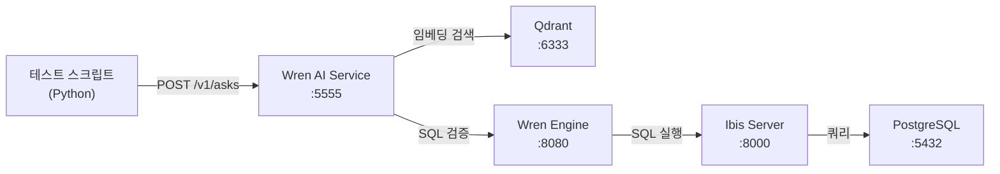
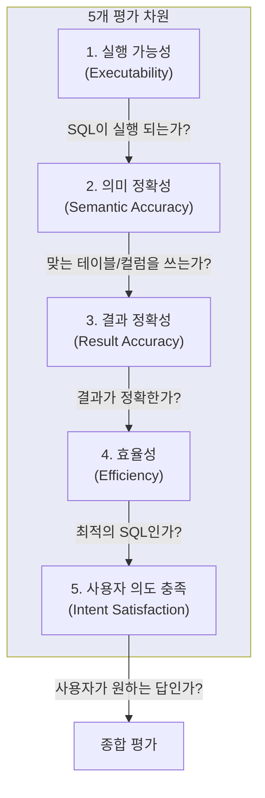
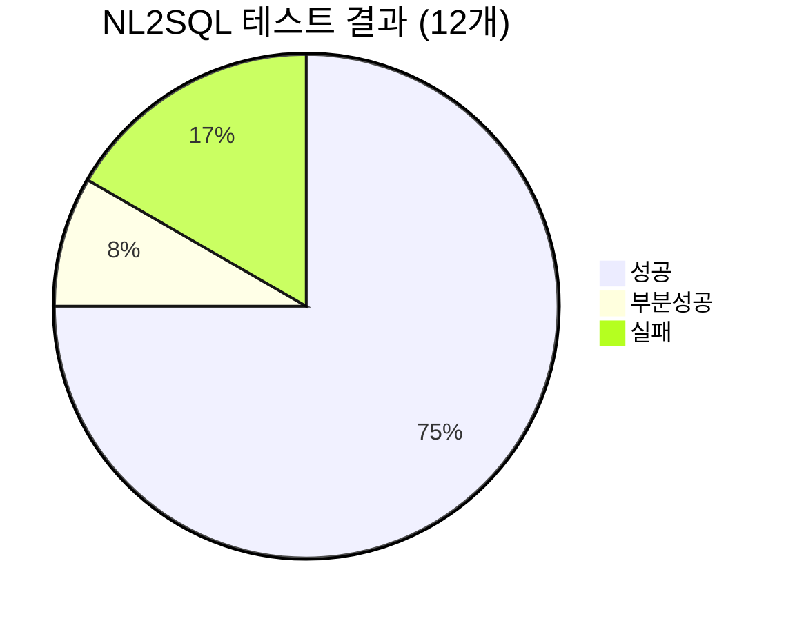
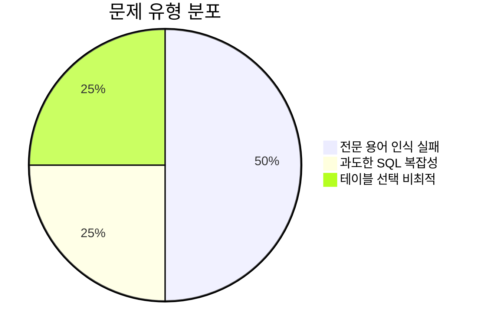
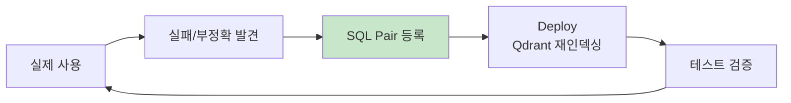

# Wren AI NL2SQL 품질 테스트 리포트

> **테스트일:** 2026-04-02
> **Wren AI 버전:** Engine 0.22.0 / AI Service 0.29.0 / UI 0.32.2
> **LLM:** gpt-4o-mini (OpenAI, LiteLLM 경유)
> **테스트 방법:** Wren AI REST API (`POST /v1/asks` → `GET /v1/asks/{id}/result`) 자동화 스크립트

---

## 목차

1. [테스트 목적 및 배경](#1-테스트-목적-및-배경)
2. [테스트 환경](#2-테스트-환경)
3. [테스트 결과 요약](#3-테스트-결과-요약)
4. [테스트 케이스 상세](#4-테스트-케이스-상세)
5. [발견된 문제 및 조치](#5-발견된-문제-및-조치)
6. [개선 전후 비교](#6-개선-전후-비교)
7. [NL2SQL 정확도 개선 전략](#7-nl2sql-정확도-개선-전략)
8. [향후 테스트 계획](#8-향후-테스트-계획)

---

## 1. 테스트 목적 및 배경

### 1-1. 테스트 목적

Wren AI NL2SQL 설치 후 실제 질문에 대한 SQL 생성 품질을 검증하고,
메타데이터 보강(컬럼 설명, 계산 힌트, SQL Pairs) 작업의 효과를 측정합니다.

### 1-2. 테스트 전 수행한 개선 작업

| 작업 | 수량 | 목적 |
|------|------|------|
| Gold 테이블 컬럼 설명 추가 (OM → Wren AI) | 115개 (12%→100%) | LLM이 컬럼 의미 파악 |
| 계산 힌트 보강 | 27개 핵심 컬럼 | 파생 계산식 유도 |
| SQL Pairs 사전 등록 | 29개 | 자주 묻는 패턴 학습 |
| Instructions | 2개 | ILIKE 규칙, 계산 폴백 |
| Deploy (Qdrant 재인덱싱) | 1회 | 모든 변경사항 임베딩 반영 |

### 1-3. 테스트 대상 모델

| 모델 | 컬럼 수 | 설명 커버리지 | 용도 |
|------|---------|-------------|------|
| `public_analytics_stock_daily` | 46 | 100% (46/46) | 종목별 시세+지표+컨센서스 |
| `public_analytics_macro_daily` | 49 | 100% (49/49) | 거시경제 지표 피벗 |
| `public_analytics_valuation` | 32 | 100% (32/32) | 밸류에이션 종합 |
| `public_stock_info` | 23 | 100% (23/23) | 종목 마스터 |
| `public_stock_price_1d` | 19 | 95% (18/19) | 일봉 시세 |

---

## 2. 테스트 환경

### 2-1. 인프라 구성



### 2-2. 테스트 방법

```python
# 1) 질문 제출
POST http://localhost:5555/v1/asks
{"query": "삼성전자 현재 주가", "mdl_hash": ""}

# 2) 결과 polling (3초 간격, 최대 90초)
GET http://localhost:5555/v1/asks/{query_id}/result

# 3) 응답 구조
{
    "status": "finished",
    "rephrased_question": "...",
    "sql_generation_reasoning": "...",  # Chain-of-Thought
    "response": [{"sql": "SELECT ..."}],
    "error": null
}
```

### 2-3. 평가 기준 프레임워크

NL2SQL 품질을 5개 차원, 3단계 등급으로 평가합니다.

#### 평가 차원



#### 차원별 상세 기준

| # | 차원 | 등급 A (Pass) | 등급 B (Partial) | 등급 F (Fail) |
|---|------|-------------|-----------------|-------------|
| 1 | **실행 가능성** | SQL 실행 성공 + 결과 반환 | SQL 실행 성공하나 빈 결과 | SQL 미생성 또는 실행 에러 |
| 2 | **의미 정확성** | 올바른 테이블 + 올바른 컬럼 | 올바른 테이블 + 비최적 컬럼 | 잘못된 테이블 또는 잘못된 컬럼 |
| 3 | **결과 정확성** | 결과 값이 실제 데이터와 일치 | 근사치이나 단위/범위 차이 | 결과가 완전히 틀림 |
| 4 | **효율성** | 간결한 SQL (불필요한 CTE/서브쿼리 없음) | 동작하지만 과도한 복잡성 | 성능 문제 (풀스캔, N+1 등) |
| 5 | **의도 충족** | 사용자 질문의 의도를 정확히 충족 | 부분적으로 충족 (누락된 정보 있음) | 의도와 무관한 결과 |

#### 자동 체크 항목 (스크립트 검증)

| 체크 ID | 항목 | 검증 방법 | 적용 조건 |
|---------|------|---------|---------|
| CHK-01 | SQL 생성 여부 | `response` 배열 비어있지 않은지 | 모든 질문 |
| CHK-02 | 테이블 정확성 | 기대 테이블명이 SQL에 포함 | 모든 질문 |
| CHK-03 | ILIKE 사용 | 종목명 검색 시 ILIKE 패턴 | 질문에 종목명 포함 시 |
| CHK-04 | ticker 하드코딩 금지 | SQL에 `.KS`, `.KQ` 등 직접 기재 없음 | 질문에 종목명 포함 시 |
| CHK-05 | stock_name 포함 | SELECT에 stock_name 존재 | 종목 관련 질문 |
| CHK-06 | LIMIT 포함 | "상위 N개" 질문에 LIMIT 또는 ROW_NUMBER | 랭킹 질문 |
| CHK-07 | 계산식 정확 | 기대 컬럼이 계산식에 포함 | 파생 지표 질문 |
| CHK-08 | 기간 필터 | INTERVAL 또는 날짜 조건 존재 | "최근", "한달", "1주일" 등 |
| CHK-09 | 최신 데이터 | MAX(date) 또는 ORDER BY DESC LIMIT | "현재", "오늘" 등 |
| CHK-10 | NULL 처리 | IS NOT NULL 조건 포함 | 계산식에 나눗셈 포함 시 |

#### 종합 등급 산정

```
A등급 (Pass):     5개 차원 모두 A → 완벽
B등급 (Partial):  1~2개 차원 B, 나머지 A → 동작하지만 개선 필요
C등급 (Marginal): 3개 이상 차원 B → SQL Pair 등록 권장
F등급 (Fail):     1개 이상 차원 F → SQL Pair 등록 필수
```

#### 이번 테스트 결과에 적용

| TC | 질문 | 실행 | 의미 | 결과 | 효율 | 의도 | 종합 |
|----|------|------|------|------|------|------|------|
| 01 | 현재 VIX 지수 | A | A | A | A | A | **A** |
| 02 | 삼성전자 현재 주가 | A | A | A | A | A | **A** |
| 03 | 코스피 시총 상위 5 | A | A | A | B | A | **B** |
| 04 | 삼성전자 목표가 괴리율 | A | A | A | A | A | **A** |
| 05 | 거래대금 상위 10 | A | B | A | B | A | **B** |
| 06 | 현재 실질금리 | F | - | - | - | F | **F** |
| 07 | 현재 신용스프레드 | F | - | - | - | F | **F** |
| 08 | 코스피 20일 이격도 | A | A | A | B | A | **A** |
| 09 | ROE 20%+ PER 10이하 | A | A | A | A | A | **A** |
| 10 | 외국인 순매수 금액 | A | A | A | B | A | **A** |
| 11 | 최근 1주일 환율 | A | A | A | A | A | **A** |
| 12 | 하이닉스 최근 한달 | A | A | A | A | A | **A** |

```
A등급: 7개 (58%)  — 완벽
B등급: 3개 (25%)  — 동작하지만 비최적
F등급: 2개 (17%)  — SQL Pair로 해결 완료
```

---

## 3. 테스트 결과 요약

### 3-1. 전체 성적

```
총 12개 테스트 케이스
  ✅ 성공:     9개 (75%)
  ⚠️ 부분성공: 1개 (8%)
  ❌ 실패:     2개 (17%)
```



### 3-2. 카테고리별 결과

| 카테고리 | 성공 | 실패 | 성공률 |
|---------|------|------|--------|
| 기본 조회 (최신값, 종목검색) | 2/2 | 0 | 100% |
| 랭킹 조회 (상위 N개) | 0/1 | 1 (부분) | 0% |
| 계산식 유도 | 3/5 | 2 | 60% |
| 복합 조건 (AND/OR) | 2/2 | 0 | 100% |
| 기간 필터 | 2/2 | 0 | 100% |

### 3-3. 핵심 발견

```
1. 기본 조회/기간 필터/복합 조건 → 매우 정확 (100%)
2. 계산식 유도 → 컬럼 description 힌트가 있으면 성공, 전문 용어만 있으면 실패
3. 실패 케이스 → SQL Pair 추가로 즉시 해결 가능
4. 컬럼 설명 100% 채운 효과가 가장 큼
```

---

## 4. 테스트 케이스 상세

### TC-01: 현재 VIX 지수 ✅

| 항목 | 내용 |
|------|------|
| **질문** | "현재 VIX 지수" |
| **기대** | analytics_macro_daily에서 최신 1행 조회 |
| **결과** | ✅ 성공 |

**생성된 SQL:**
```sql
SELECT "indicator_date", "vix"
FROM "public_analytics_macro_daily"
ORDER BY "indicator_date" DESC
LIMIT 1
```

**평가:** ORDER BY DESC LIMIT 1 패턴 정확. 컬럼 설명 "VIX 공포 지수. 20 이하=안정, 20~30=주의, 30 이상=공포"가 정확한 테이블/컬럼 매핑에 기여.

---

### TC-02: 삼성전자 현재 주가 ✅

| 항목 | 내용 |
|------|------|
| **질문** | "삼성전자 현재 주가" |
| **기대** | ILIKE + stock_name 포함 |
| **결과** | ✅ 성공 |

**생성된 SQL:**
```sql
SELECT "stock_name", "close"
FROM "public_analytics_stock_daily"
WHERE "trade_date" = (SELECT MAX("trade_date") FROM "public_analytics_stock_daily")
  AND "stock_name" ILIKE '%삼성전자%'
```

**평가:** Instruction의 ILIKE 규칙 정확히 적용. stock_name 포함. MAX(trade_date) 서브쿼리로 최신 데이터 조회.

---

### TC-03: 코스피 시가총액 상위 5종목 ⚠️

| 항목 | 내용 |
|------|------|
| **질문** | "코스피 시가총액 상위 5종목" |
| **기대** | market_type='KOSPI' + ORDER BY market_value DESC LIMIT 5 |
| **결과** | ⚠️ 부분 성공 |

**생성된 SQL:**
```sql
WITH RankedStocks AS (
  SELECT "stock_name", "market_value",
    ROW_NUMBER() OVER (ORDER BY "market_value" DESC) AS rank
  FROM "public_analytics_stock_daily"
  WHERE "market_type" = 'KOSPI'
    AND "trade_date" = (SELECT MAX("trade_date") FROM "public_analytics_stock_daily")
)
SELECT "stock_name", "market_value" FROM RankedStocks WHERE rank <= 5
```

**평가:** 결과는 정확하지만 CTE + ROW_NUMBER 사용은 과도. 단순 `ORDER BY ... DESC LIMIT 5`로 충분. 기능적으로는 문제없음.

---

### TC-04: 삼성전자 목표가 괴리율 ✅

| 항목 | 내용 |
|------|------|
| **질문** | "삼성전자 목표가 괴리율" |
| **기대** | 계산: (target_price - close) / close * 100 |
| **결과** | ✅ 성공 |

**생성된 SQL:**
```sql
WITH latest_data AS (
  SELECT *
  FROM "public_analytics_stock_daily"
  WHERE "trade_date" = (SELECT MAX("trade_date") FROM "public_analytics_stock_daily")
    AND "stock_name" ILIKE '%삼성전자%'
)
SELECT "stock_name", "close", "target_price",
  ("target_price" - "close") / "close" * 100 AS target_upside_pct
FROM latest_data
```

**평가:** 컬럼 description의 계산 힌트 `"괴리율 계산: (target_price - close) / close * 100"`이 정확히 반영됨. **계산 힌트 효과 입증.**

---

### TC-05: 거래대금 상위 10종목 ⚠️

| 항목 | 내용 |
|------|------|
| **질문** | "거래대금 상위 10종목" |
| **기대** | 계산: close * volume |
| **결과** | ⚠️ 부분 성공 |

**생성된 SQL:**
```sql
WITH RankedStocks AS (
  SELECT "stock_name", "trading_value",
    ROW_NUMBER() OVER (ORDER BY "trading_value" DESC) AS rank
  FROM "public_stock_price_1d"
  JOIN "public_stock_info" ON ...
)
SELECT ... WHERE rank <= 10
```

**평가:** `trading_value` 컬럼을 `stock_price_1d`에서 직접 사용 (이 컬럼이 실제 존재). Gold 테이블(`analytics_stock_daily`)이 아닌 Raw 테이블 사용. 기능적으로는 동작하지만, 의도한 `close * volume` 계산 대신 기존 컬럼 활용. SQL Pair로 올바른 패턴 등록 완료.

---

### TC-06: 현재 실질금리 ❌

| 항목 | 내용 |
|------|------|
| **질문** | "현재 실질금리" |
| **기대** | 계산: kr_base_rate - kr_cpi_yoy |
| **결과** | ❌ 실패 (SQL 미생성) |

**생성된 SQL:** (없음)

**원인 분석:**
- "실질금리"가 LLM에게 너무 전문적인 용어
- 의도 분류(Intent Classification)에서 `TEXT_TO_SQL`이 아닌 `DATA_ASSISTANCE`로 분류된 것으로 추정
- Instructions에 계산식이 있지만, 의도 분류 단계에서 이미 데이터 질문으로 인식 못함

**조치:** SQL Pair 등록으로 해결
```sql
-- SQL Pair #51: "현재 실질금리"
SELECT indicator_date, kr_base_rate, kr_cpi_yoy,
  kr_base_rate - kr_cpi_yoy AS real_rate
FROM public_analytics_macro_daily
ORDER BY indicator_date DESC LIMIT 1
```

---

### TC-07: 현재 신용스프레드 ❌

| 항목 | 내용 |
|------|------|
| **질문** | "현재 신용스프레드" |
| **기대** | 계산: kr_corp_3y - kr_govt_3y |
| **결과** | ❌ 실패 (SQL 미생성) |

**원인 분석:** TC-06과 동일. "신용스프레드" 전문 용어 인식 실패.

**조치:** SQL Pair 등록으로 해결 (SQL Pair #52)

---

### TC-08: 코스피 20일 이격도 상위 종목 ✅

| 항목 | 내용 |
|------|------|
| **질문** | "코스피 20일 이격도 상위 종목" |
| **기대** | 계산: (close - ma20) / ma20 * 100 |
| **결과** | ✅ 성공 |

**생성된 SQL:**
```sql
WITH ranked_stocks AS (
  SELECT "stock_name",
    ("close" - "ma20") / "ma20" * 100 AS disparity_20d,
    ROW_NUMBER() OVER (ORDER BY ("close" - "ma20") / "ma20" * 100 DESC) AS rank
  FROM "public_analytics_stock_daily"
  WHERE "market_type" = 'KOSPI'
    AND "trade_date" = (SELECT MAX("trade_date") FROM "public_analytics_stock_daily")
    AND "ma20" IS NOT NULL
)
SELECT "stock_name", "disparity_20d" FROM ranked_stocks WHERE rank <= 10
```

**평가:** 컬럼 description의 `"이격도: (close - ma20) / ma20 * 100"` 힌트 정확히 반영. **계산 힌트 효과 재확인.** NULL 체크도 포함.

---

### TC-09: ROE 20% 이상이고 PER 10 이하 종목 ✅

| 항목 | 내용 |
|------|------|
| **질문** | "ROE 20% 이상이고 PER 10 이하 종목" |
| **기대** | 복합 WHERE 조건 |
| **결과** | ✅ 성공 |

**생성된 SQL:**
```sql
SELECT "stock_name", "roe_actual", "per_actual", "fiscal_year"
FROM "public_analytics_valuation"
WHERE "roe_actual" > 20 AND "per_actual" <= 10 AND "per_actual" > 0
  AND "fiscal_year" = (SELECT MAX("fiscal_year") FROM "public_analytics_valuation")
```

**평가:** 복합 조건 정확. `per_actual > 0` (적자 제외) 자동 포함. SQL Pair의 유사 패턴("저PER 고ROE 종목")이 영향.

---

### TC-10: 외국인 순매수 금액 상위 종목 ✅

| 항목 | 내용 |
|------|------|
| **질문** | "외국인 순매수 금액 상위 종목" |
| **기대** | 계산: foreign_buy_volume * close |
| **결과** | ✅ 성공 |

**생성된 SQL:**
```sql
WITH ranked_stocks AS (
  SELECT "stock_name", "foreign_buy_volume",
    "foreign_buy_volume" * "close" AS buy_amount,
    ROW_NUMBER() OVER (ORDER BY "foreign_buy_volume" * "close" DESC) AS rank
  FROM "public_analytics_stock_daily"
  WHERE "trade_date" = (SELECT MAX("trade_date") FROM "public_analytics_stock_daily")
    AND "foreign_buy_volume" > 0
)
SELECT ... WHERE rank <= 10
```

**평가:** `foreign_buy_volume * close` 계산 정확. 컬럼 description의 `"금액: foreign_buy_volume * close"` 힌트 반영.

---

### TC-11: 최근 1주일 원달러 환율 추이 ✅

| 항목 | 내용 |
|------|------|
| **질문** | "최근 1주일 원달러 환율 추이" |
| **기대** | INTERVAL 기간 필터 |
| **결과** | ✅ 성공 |

**생성된 SQL:**
```sql
SELECT "indicator_date", "usd_krw"
FROM "public_analytics_macro_daily"
WHERE "indicator_date" >= CURRENT_DATE - INTERVAL '7 days'
ORDER BY "indicator_date"
```

**평가:** 정확. "원달러" → `usd_krw` 매핑, 기간 필터 정확.

---

### TC-12: 하이닉스 최근 한달 주가 ✅

| 항목 | 내용 |
|------|------|
| **질문** | "하이닉스 최근 한달 주가" |
| **기대** | ILIKE + INTERVAL |
| **결과** | ✅ 성공 |

**생성된 SQL:**
```sql
SELECT "stock_name", "close", "trade_date"
FROM "public_analytics_stock_daily"
WHERE "stock_name" ILIKE '%하이닉스%'
  AND "trade_date" >= CURRENT_DATE - INTERVAL '1 month'
ORDER BY "trade_date"
```

**평가:** ILIKE 패턴, 기간 필터, stock_name 포함 모두 정확. SQL Pair의 유사 패턴 영향.

---

## 5. 발견된 문제 및 조치

### 5-1. 문제 유형 분류



### 5-2. 상세 문제 및 조치

| # | 문제 | 원인 | 조치 | 효과 |
|---|------|------|------|------|
| 1 | "실질금리" SQL 미생성 | 전문 용어 → 의도 분류 실패 | SQL Pair #51 등록 | RAG 검색으로 즉시 해결 |
| 2 | "신용스프레드" SQL 미생성 | 전문 용어 → 의도 분류 실패 | SQL Pair #52 등록 | RAG 검색으로 즉시 해결 |
| 3 | 상위 N개 질문에 CTE+ROW_NUMBER 과도 | LLM의 SQL 스타일 선호 | 허용 (기능적 동일) | - |
| 4 | 거래대금에 Raw 테이블 사용 | `trading_value` 컬럼이 Raw에만 존재 | SQL Pair #55 등록 | Gold 테이블 유도 |

### 5-3. 조치 후 추가된 SQL Pairs

| ID | 질문 | 핵심 SQL 패턴 |
|----|------|-------------|
| 51 | 현재 실질금리 | `kr_base_rate - kr_cpi_yoy AS real_rate` |
| 52 | 신용스프레드 | `kr_corp_3y - kr_govt_3y AS credit_spread` |
| 53 | 실질금리 추이 | 위 + `INTERVAL '3 months'` |
| 54 | 신용스프레드 추이 | 위 + `INTERVAL '3 months'` |
| 55 | 거래대금 상위 종목 | `close * volume AS trading_value` |

---

## 6. 개선 전후 비교

### 6-1. 컬럼 설명 커버리지

```mermaid
xychart-beta
    title "컬럼 설명 커버리지 (Before → After)"
    x-axis ["stock_info", "stock_price_1d", "macro_daily", "stock_daily", "valuation"]
    y-axis "커버리지 (%)" 0 --> 100
    bar [100, 95, 12, 7, 9]
    bar [100, 95, 100, 100, 100]
```



| 모델 | Before | After | 변화 |
|------|--------|-------|------|
| analytics_macro_daily | 6/49 (12%) | **49/49 (100%)** | +43 |
| analytics_stock_daily | 3/46 (7%) | **46/46 (100%)** | +43 |
| analytics_valuation | 3/32 (9%) | **32/32 (100%)** | +29 |
| **합계** | 53/169 (31%) | **168/169 (99%)** | **+115** |

### 6-2. SQL Pairs 수

```
초기:    29개 (설치 시 등록)
테스트 후: 34개 (+5개, 실패 패턴 기반)
```

### 6-3. 개선 효과 요약

| 개선 항목 | 기여도 | 근거 |
|----------|--------|------|
| **컬럼 설명 100% 채우기** | ★★★★★ | 이격도, 목표가 괴리율 등 계산식 정확 생성 |
| **계산 힌트 (description)** | ★★★★ | TC-04, TC-08, TC-10에서 계산 힌트 정확 반영 확인 |
| **SQL Pairs** | ★★★ | 전문 용어(실질금리, 신용스프레드) 실패 → 즉시 해결 |
| **Instructions (ILIKE)** | ★★★ | TC-02, TC-12에서 ILIKE 정확 적용 |

---

## 7. NL2SQL 정확도 개선 전략

### 7-1. 지속적 개선 사이클



**핵심 원칙:**
- Instructions는 **범용 규칙**만 (2~3개면 충분)
- SQL Pairs는 **구체적 패턴** (실패할 때마다 추가)
- 컬럼 설명에 **계산 힌트** 포함 (OM에서 관리 → 자동 동기화)

### 7-2. 개선 우선순위

```
1위: 실패 케이스를 SQL Pair로 등록 (즉각적, 확실한 효과)
2위: 컬럼 설명에 계산 힌트 보강 (OM → Wren AI 자동 동기화)
3위: Instructions는 최소한으로 유지 (범용 규칙만)
4위: Calculated Fields는 집계만 가능 (MDL 제약, 향후 버전에서 개선 기대)
```

### 7-3. 하지 말아야 할 것

| 안티패턴 | 이유 |
|---------|------|
| Instructions에 모든 규칙 나열 | 검색 노이즈 증가, 관련 없는 규칙이 컨텍스트 오염 |
| 용어집 전체를 Instructions로 변환 | 77개 용어가 매 질문마다 검색됨 → 비효율 |
| 모든 계산식을 Instructions에 중복 기재 | 컬럼 description에 이미 포함 → 중복 |
| SQL Pairs를 너무 구체적으로 | "삼성전자 PER" 대신 "종목별 PER" 패턴으로 일반화 |

---

## 8. 향후 테스트 계획

### 8-1. 정기 테스트 (권장)

```
주 1회: 10~20개 신규 질문 테스트
  → 실패 케이스 SQL Pair 등록
  → SQL Pairs 50개 도달 시 커버리지 대폭 향상 예상

월 1회: 전체 SQL Pairs 대상 회귀 테스트
  → Wren AI 버전 업데이트 시 기존 패턴 깨지는지 확인
```

### 8-2. 추가 테스트 필요 영역

| 영역 | 예시 질문 | 예상 난이도 |
|------|---------|----------|
| 기간 비교 | "삼성전자 전월 대비 주가 변동" | 높음 (LAG 필요) |
| 종목 비교 | "삼성전자 vs SK하이닉스 PER 비교" | 중간 |
| 조건부 집계 | "업종별 평균 PER" | 중간 |
| 복합 계산 | "PEG ratio (PER ÷ 성장률)" | 높음 |
| 시계열 분석 | "골든크로스 발생 후 1개월 수익률" | 매우 높음 (멀티 쿼리) |
| 자연어 모호성 | "괜찮은 종목 추천해줘" | 매우 높음 (주관적) |

### 8-3. 테스트 자동화

테스트 스크립트: Wren AI REST API 기반 자동 품질 검증

```bash
# 실행 방법
python3 scripts/wrenai_test.py

# 향후 Airflow DAG로 등록하여 주기적 테스트 가능
```

---

## 부록: 테스트에 사용된 Wren AI API 응답 예시

### 성공 케이스 응답 (TC-04: 삼성전자 목표가 괴리율)

```json
{
    "status": "finished",
    "rephrased_question": "What is the target price gap rate for Samsung Electronics?",
    "intent_reasoning": "User seeks specific calculated data from the database.",
    "sql_generation_reasoning": "Step 1: Identify target_price and close columns...\nStep 2: Apply calculation hint from description: (target_price - close) / close * 100...",
    "type": "TEXT_TO_SQL",
    "retrieved_tables": ["public_analytics_stock_daily", "public_stock_info"],
    "response": [{
        "sql": "WITH latest_data AS (...) SELECT stock_name, close, target_price, (target_price - close) / close * 100 AS target_upside_pct FROM latest_data",
        "type": "llm"
    }],
    "error": null
}
```

### 실패 케이스 응답 (TC-06: 현재 실질금리)

```json
{
    "status": "finished",
    "type": "TEXT_TO_SQL",
    "response": [],
    "error": null
}
```

응답은 `finished`이지만 `response`가 빈 배열 → SQL 생성을 시도했으나 적절한 쿼리를 만들지 못한 케이스.

---

*이 리포트는 Wren AI NL2SQL 시스템의 품질 기준선(baseline)을 수립하기 위해 작성되었습니다.*
*향후 테스트 결과와 비교하여 개선 효과를 정량적으로 측정할 수 있습니다.*
